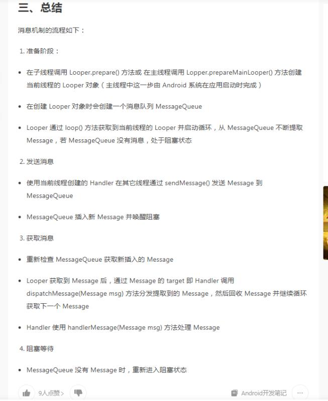
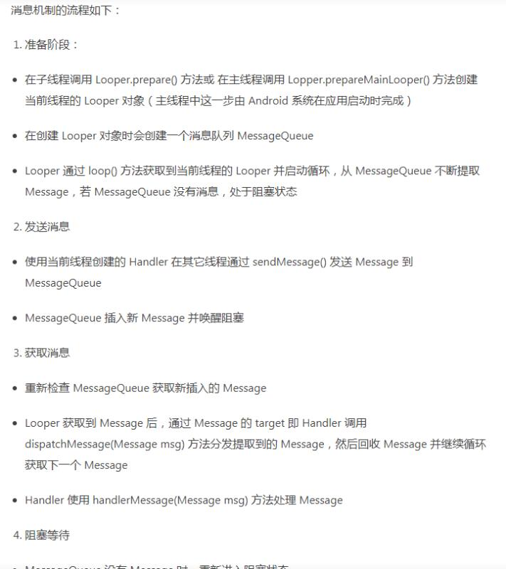

# Android 的常见问题

# 1. Activity 的启动流程

activity 启动过程全解析 https://blog.csdn.net/zhaokaiqiang1992/article/details/49428287

## 1.1. 主要对象功能介绍

- ActivityManagerServices，简称AMS，服务端对象，负责系统中所有Activity的生命周期
- ActivityThread，App的真正入口。当开启App之后，会调用main()开始运行，开启消息循环队列，这就是传说中的UI线程或者叫主线程。与ActivityManagerServices配合，一起完成Activity的管理工作
- ApplicationThread，用来实现ActivityManagerService与ActivityThread之间的交互。在ActivityManagerService需要管理相关Application中的Activity的生命周期时，通过ApplicationThread的代理对象与ActivityThread通讯。
- ApplicationThreadProxy，是ApplicationThread在服务器端的代理，负责和客户端的ApplicationThread通讯。AMS就是通过该代理与ActivityThread进行通信的。
- Instrumentation，每一个应用程序只有一个Instrumentation对象，每个Activity内都有一个对该对象的引用。Instrumentation可以理解为应用进程的管家，ActivityThread要创建或暂停某个Activity时，都需要通过Instrumentation来进行具体的操作。
- ActivityStack，Activity在AMS的栈管理，用来记录已经启动的Activity的先后关系，状态信息等。通过ActivityStack决定是否需要启动新的进程。
- ActivityRecord，ActivityStack的管理对象，每个Activity在AMS对应一个ActivityRecord，来记录Activity的状态以及其他的管理信息。其实就是服务器端的Activity对象的映像。
- TaskRecord，AMS抽象出来的一个“任务”的概念，是记录ActivityRecord的栈，一个“Task”包含若干个ActivityRecord。AMS用TaskRecord确保Activity启动和退出的顺序。如果你清楚Activity的4种launchMode，那么对这个概念应该不陌生。

## 1.2. 启动流程

Android 是基于 Linux 系统的，而在 Linux 中，所有的进程都是由 Init 进程直接或者间接 fork 出来的，在 Android 系统里面 ，zygote 是一个进程的名字。Android 是基于 Linux System 的，当手机开机的时候，Linux 的内核加载完成之后就会启动一个叫 "init" 的进程。在 Linux System 里面，所有的进程都是由 init 进程 fork 出来的，zygote 进程也一样。

每一个 App 其实都是：

* 一个单独的 dalvik 虚拟机
* 一个单独的进程

# 2.Activity 的启动模式，及其使用场景

启动模式就是定义 Activity 实例与 task 的关联方式。

## 2.1. Acitivity 的四种启动模式

### 2.1.1. standard(标准模式)

　　Activity 的默认启动模式，不设置启动模式时，就是标准模式。只要启动 Activity 就会创建一个新实例，并将该 Activity 添加到当前任务栈中。

#### 2.1.1.1. 标准模式的应用场景

　　正常打开一个新的页面，这种启动模式使用最多，最普通。一般没有特殊需求都是使用标准模式。

### 2.1.2. singleTop(栈顶复用)

　　在这种启动模式下，首先会判断要启动的活动是否已经存在于栈顶，如果是的话就不创建新实例，直接复用栈顶活动，并且调用 activity 的 onNewIntent() 方法。如果要启动的活动不位于栈顶，则会创建新实例入栈。

#### 2.1.2.1. 栈顶复用模式的应用场景

　　栈顶复用模式避免了同一个页面被重复打开，应用场景例如一个新闻客户端，在通知栏收到多条推送，点击一条推送就会打开新闻的详情页，如果是默认的启动模式，点击一次将会打开一个详情页，栈中就会有三个详情页，如果使用栈顶复用模式，点击第一条推送之后，接着点击其他的推送，都只会有一个详情页，可以避免重复打开页面。

### 2.1.3. singleTask(栈内复用)

　　singleTask 是一种栈内单例模式，当一个 activity 启动时，如果栈中没有 activity 则会创建 activity 并让它入栈；如果栈中有 activity ，则会将位于 activity 之上的 activities 出栈，然后复用栈中的 activity ，调用 activity 的 onNewIntent() 方法。

　　这种模式会保证 Activity 在栈内只有一个或者没有。

#### 2.1.3.1. 栈内复用模式的应用场景

　　栈内复用模式适合作为程序的入口。最常用的就是一个 APP 的首页，一般 App 的首页长时间保留在栈内，并且是栈的第一个 activity。例如浏览器的主界面，不管从多少个应用启动浏览器，只会启动主界面一次，并清空主界面上面的其他页面，根据 onNewIntent 方法传递的数值，显示新的界面。

　　比如说自定义的相机界面，不论从哪里启动相机，只会启动相机的主界面一次，并且会清除相机主界面上面的其他页面。

### 2.1.4. singleInstance(单例模式)

　　这种模式是真正的单例模式，以这种模式启动的活动会单独创建一个任务栈，并且依然遵循栈内复用的特性，保证了这个栈中只能存在这一个活动。并且系统不会在这个单例模式的 Activity 的实例所在栈中启动任何其他的 Activity 。单例模式的 Activity 的实例永远是这个栈中的唯一一个成员。

#### 2.1.4.1. 单例模式的应用场景

　　单例模式使用需要与程序分离开的页面。电话拨号页面，通过自己的应用或者其他应用打开拨打电话页面，只要系统的栈中存在该实例，那么就会直接调用，还有闹铃提醒。

## 2.2. Intent 的 flags

也可以通过 Intent 的 setFlags() 方法设置应用的启动方式。

### 2.2.1. 常用的 flags 介绍

　　操作中的 A,B,C 表示不同的 Activity，A->B 表示从 A 跳转到 B，栈情况中的 t1,t2 表示不同的栈，栈中的记录都是记录的从栈底到栈顶的顺序。

#### 2.2.1.1. FLAG_ACTIVITY_CLEAR_TOP

1. 新活动已在当前任务中时，在新活动上面的活动会被关闭，新活动不会重新启动，只会接收new intent。
2.  新活动已在任务最上面时：如果启动模式是"multiple" (默认的)，并且没添加 FLAG_ACTIVITY_SINGLE_TOP，那么活动会被销毁重新创建；如果启动模式是其他的，或者添加了FLAG_ACTIVITY_SINGLE_TOP，那么只会调用活动的onNewIntent()。
3. 跟 FLAG_ACTIVITY_NEW_TASK 联合使用效果很好：如果用于启动一个任务中的根活动，会把该任务移到前面并清空至root状态。这特别有用，比如用于从 notification manager 中启动活动。

#### 2.2.1.2. FLAG_ACTIVITY_NO_HISTORY

1.  新活动不会保留在历史栈中，一旦用户切换到其他页面，新活动会马上销毁。
2. 旧活动的onActivityResult()方法永远不会被触发。

**举例**：A 跳转 B 的 flag 设置为 FLAG_ACTIVITY_NO_HISTORY，B 跳转 C，在 C 界面点击返回键，则会直接回到 A 界面。

#### 2.2.1.3. FLAG_ACTIVITY_SINGLE_TOP

1. 新活动已存在历史栈的顶端时就不会重新启动。
2. 与 launchMode 的 “singleTask” 相同。

#### 2.2.1.4. FLAG_ACTIVITY_NEW_TASK

1. 新活动会成为历史栈中的新任务（一组活动）的开始。
2. 通常用于具有"launcher"行为的活动：让用户完成一系列事情，完全独立于之前的活动。
3. 如果新活动已存在于一个为它运行的任务中，那么不会启动，只会把该任务移到屏幕最前。
4. 如果新活动要返回result给启动自己的活动，就不能用这个flag。
5. 与 launchModel 的 “singleTask” 启动模式效果相同？

**描述**：设置 FLAG_ACTIVITY_NEW_TASK 标签后，首先会查找是否存在和被启动的 activity 具有相同亲和性的任务栈，如果没有，则新建一个栈让 activity 入栈；如果有，则保持栈中 activity 的顺序不变，如果栈中没有 activity，将 activity 入栈，如果栈中有 activity，则将整个栈移动到前台。

**举例**：设置 A 跳转 B 的 flag 为 FLAG_ACTIVITY_NEW_TASK，设置 B 的 taskAffinity 的值。A 跳转 B ，B 跳转 C，C 跳转回到 A，A 跳转 B,会显示 C 界面。

#### 2.2.1.5. FLAG_ACTIVITY_NEW_DOCUMENT

1. 本 flag 会给启动的活动开一个新的任务记录。使用了本 flag 或 documentLaunchMode 属性时，相同的活动的多实例会在最近任务列。
2. 使用本 flag 比使用 documentLaunchMode 属性好，因为 documentLaunchMode 属性会跟活动绑定，而 flag 只在需要时添加。
3. 注意本 flag 的默认词义，活动销毁后最近任务列表中的入口不会移除。这跟使用 FLAG_ACTIVITY_NEW_TASK 不一样，后者活动销毁后入口马上移除。可以用 FLAG_ACTIVITY_RETAIN_IN_RECENTS 改变这个行为。
4. 本 flag 可以跟 FLAG_ACTIVITY_MULTIPLE_TASK 联合使用。单独使用时跟 manifest 活动中定义 documentLauchMode = "intoExisting" 效果相同，联合使用时跟 manifest 活动中定义 documentLaunchMode = "always" 效果相同。

## 2.3. launchMode 与 Intent 的 flags 的对比

1. Intent 的 flags 的优先于 launchMode 。
2. launchMode 设置的一些启动模式只有四种，而 Intent 的 flags 比较多，可以搭配使用，实现效果也多种多样。
3. 指定 launchMode 的 activity 被任何对象任何地方调用，启动模式都一样；而 Intent 的 flags 只对 startActivity 的 activity 有效，其他调用同样的 activity 可以设置其他的启动模式，并不会相互影响。

## 2.4. Activity 属性

### 2.4.1. allowTaskReparenting

　　在这种情况下，Activity 可以从其启动的任务移动到与其具有关联的任务（如果该任务出现在前台）。

　　例如，假设将报告所选城市天气状况的 Activity 定义为旅行应用的一部分。它与同一应用中的其他 Activity 具有相同的关联（默认应用关联），并允许利用此属性重定父级。当你的一个 Activity 启动天气预报 Activity 时，它最初所属的任务与你的 Activity 相同。但是，当旅游应用的任务出现在前台时，系统会将天气预报 Activity 重新分配给该任务并显示在其中。

### 2.4.2. alwaysRetainTaskStat

　　如果用户长时间将某个task移入后台，则系统会将该task的栈内容弹出只剩下栈底的activity，此时用户再返回，则只能看到根activity了。如果栈底的activity的这个属性设置成true，则将阻止这一行为，从而保留所有的栈内容。

### 2.4.3. clearTaskOnLaunch

　　根activity的这个属性设置成true时，则每当用户离开任务然后返回时，系统都会将堆栈清除到只剩下根 Activity 。换而言之，它与 alwaysRetainTaskState 正好相反。即使只离开任务片刻时间，用户也始终会返回到任务的初始状态。

### 2.4.4. finishOnTaskLaunch

　　此属性类似于 clearTaskOnLaunch ，但它对单个 Activity 起作用，而非整个任务。此外，它还有可能会导致任何 Acivity 停止，包括根 Activity 。设置为 “true” 时，Activity 仍是任务的一部分，但是仅限于当前会话。如果用户离开然后返回任务，则任务将不复存在。

# 3. Activity 的事件分发机制

Android事件分发机制完全解析，带你从源码的角度彻底理解(上) https://blog.csdn.net/guolin_blog/article/details/9097463

　　Android 的事件分发机制基本会遵从 Activity -> ViewGroup -> View 的顺序进行事件分发，然后通过调用 onTouchEvent() 方法进行事件的处理。

　　当点击事件产生后，事件首先会传递给当前的 Activity，这会调用 Activity 的 dispatchTouchEvent() 方法，在这个方法中会调用 getWindow().superDispatchTouchEvent() 方法，其实就是调用了 DecorView 的 superDispatchTouchEvent()，DecoreView 的父类是 ViewGroup，其实也就是 ViewGroup 的 dispatchEvent() 方法。

　　一般情况下，事件列都是从用户按下（ACTION_DOWN）的那一刻产生的，不得不提到，三个非常重要的于事件相关的方法。

* dispatchTouchEvent() - 分发事件
* onTouchEvent() - 处理事件
* onInterceptTouchEvent() - 拦截事件

## 4. Android 的缓存机制

Android缓存机制 https://www.jianshu.com/p/2608f036f362

## 5. gradle 构建周期

## 6. Android 的消息机制

## 7. Android 的缓存机制

彻底解析Android缓存机制——LruCache https://www.jianshu.com/p/b49a111147ee

## 8. Fragment 的生命周期，与 Activity 生命周期的比较

Activity和Fragment的生命周期，以及对比 https://blog.csdn.net/copy_yuan/article/details/51159552

Android Fragment学习与使用—高级篇 https://blog.csdn.net/qq_24442769/article/details/77679147

【Android】Fragment之间数据传递的三种方式 https://www.jianshu.com/p/f87baad32662

解决方法：在onCreate方法中判断参数Bundle savedInstanceState，为空时初始化Fragment实例，然后在Fragment中通过onSaveInstanceState的方法恢复数据

## 9. Handler 通信原理

Android子线程创建Handler方法 https://blog.csdn.net/hongdameng/article/details/42639961

# 10. 跨进程通信方式

# 