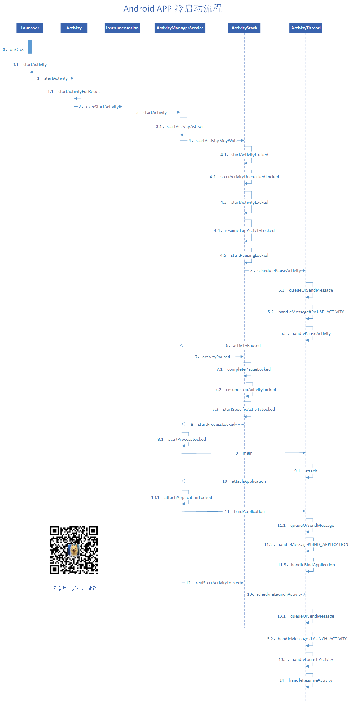
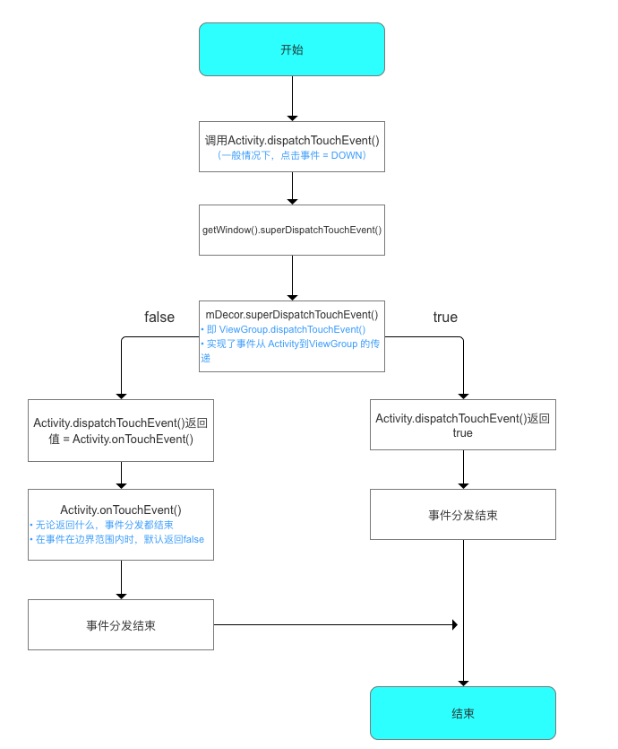
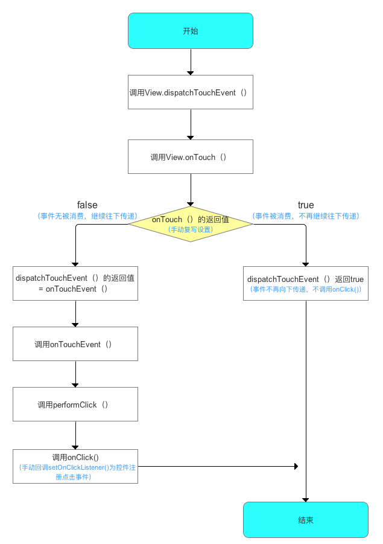
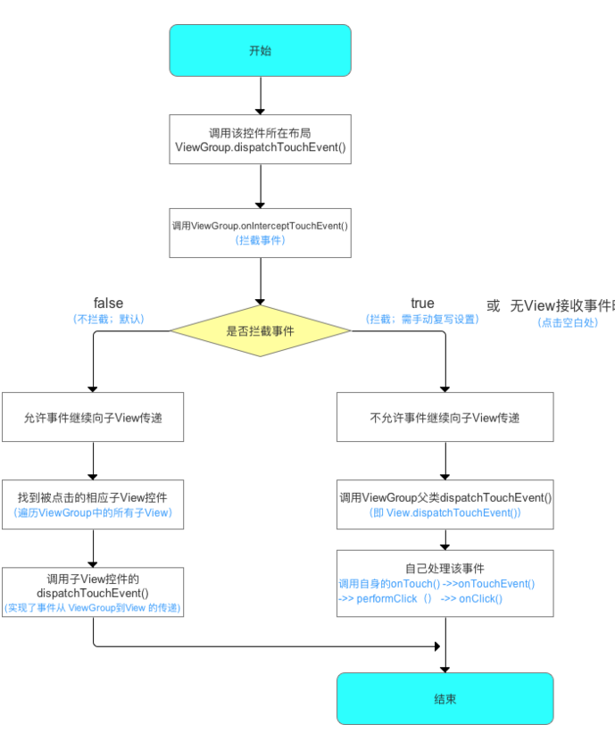
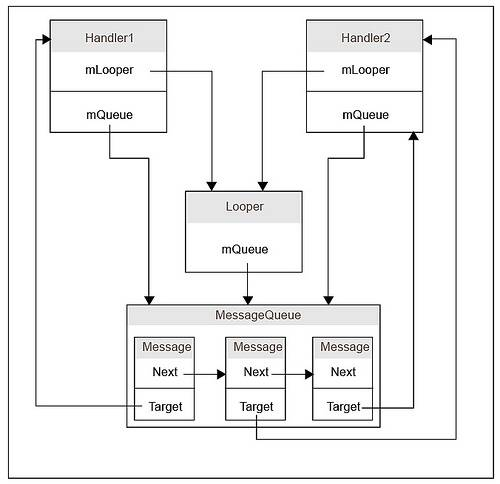

# Android 的常见问题 1

[TOC]


# 1. Activity 的启动流程

activity 启动过程全解析 https://blog.csdn.net/zhaokaiqiang1992/article/details/49428287

## 1.1. 主要对象功能介绍

- ActivityManagerServices，简称 AMS，服务端对象，负责系统中所有 Activity 的生命周期。
- ActivityThread，App 的真正入口。当开启 App 之后，会调用 main() 开始运行，开启消息循环队列，这就是传说中的 UI 线程或者叫主线程。与 ActivityManagerServices 配合，一起完成 Activity 的管理工作。
- ApplicationThread，用来实现 ActivityManagerService 与ActivityThread 之间的交互。在 ActivityManagerService 需要管理相关 Application 中的 Activity 的生命周期时，通过 ApplicationThread 的代理对象与 ActivityThread 通讯。
- ApplicationThreadProxy，是 ApplicationThread 在服务器端的代理，负责和客户端的 ApplicationThread 通讯。AMS 就是通过该代理与 ActivityThread 进行通信的。
- Instrumentation，每一个应用程序只有一个 Instrumentation 对象，每个 Activity 内都有一个对该对象的引用。Instrumentation 可以理解为应用进程的管家，ActivityThread 要创建或暂停某个 Activity 时，都需要通过 Instrumentation 来进行具体的操作。
- ActivityStack，Activity 在 AMS 的栈管理，用来记录已经启动的 Activity 的先后关系，状态信息等。通过 ActivityStack 决定是否需要启动新的进程。
- ActivityRecord，ActivityStack 的管理对象，每个 Activity 在 AMS 对应一个 ActivityRecord，来记录 Activity 的状态以及其他的管理信息。其实就是服务器端 的Activity 对象的映像。
- TaskRecord，AMS 抽象出来的一个“任务”的概念，是记录 ActivityRecord 的栈，一个 “Task” 包含若干个 ActivityRecord。AMS 用 TaskRecord 确保 Activity 启动和退出的顺序。

## 1.2. 启动流程

　　Android 是基于 Linux 系统的，而在 Linux 中，所有的进程都是由 Init 进程直接或者间接 fork 出来的，在 Android 系统里面 ，zygote 是一个进程的名字。Android 是基于 Linux System 的，当手机开机的时候，Linux 的内核加载完成之后就会启动一个叫 "init" 的进程。在 Linux System 里面，所有的进程都是由 init 进程 fork 出来的，zygote 进程也一样。

　　每一个 App 其实都是：

* 一个单独的 dalvik 虚拟机
* 一个单独的进程

　　所以当系统里面的第一个 zygote 进程运行之后，在这之后再开启 App，就相当于开启一个新的进程。而为了实现资源共用和更快的启动速度，Android 系统开启新进程的方式，是通过 fork 第一个 zygote 进程实现的。所以说，除了第一个 zygote 进程，其他应用所在的进程都是 zygote 的子进程。

### 1.2.1. SystemService

　　SystemService 也是一个进程，而且是由 zygote 进程 fork 出来的。

　　系统里面重要的服务都是在这个进程里面开启的，比如 
ActivityManagerService、PackageManagerService、WindowManagerService等等。

　　在 zygote 开启的时候，会调用 ZygoteInit.main() 进行初始化，初始化的时候会 fork SystemService 进程。

　　ActivityManagerService，简称 AMS，服务端对象，负责系统中所有 Activity 的生命周期。

　　ActivityManagerService 进行初始化的时机很明确，就是在 SystemServer 进程开启的时候，就会初始化 ActivityManagerService。

　　在 SystemServer 的 main() 方法中运行了 `new SystemServer().run()`，而在 run() 方法中创建 ActivityManagerService对象，并且完成了成员变量初始化。而且在这之前，调用 createSystemContext() 创建系统上下文的时候，也已经完成了 mSystemContext 和 ActivityThread 的创建。注意，这是系统进程开启时的流程，在这之后，会开启系统的 Launcher 程序，完成系统界面的加载与显示。

　　Android 系统里面的服务器和客户端的概念：其实服务器客户端的概念不仅仅存在于 Web 开发中，在 Android 的框架设计中，使用的也是这一种模式。服务器端指的就是所有 App 共用的系统服务，比如我们这里提到的 ActivityManagerService，和前面提到的 PackageManagerService、WindowManagerService 等等，这些基础的系统服务是被所有的 App 公用的，当某个 App 想实现某个操作的时候，要告诉这些系统服务，比如你想打开一个 App，那么我们知道了包名和 MainActivity 类名之后就可以打开。但是，我们的 App 通过调用 startActivity() 并不能直接打开另外一个 App，这个方法会通过一系列的调用，最后还是告诉 AMS 说：“我要打开这个 App，我知道他的住址和名字，你帮我打开吧！”所以是 AMS 来通知 zygote 进程来 fork 一个新进程，来开启我们的目标 App 的。这就像是浏览器想要打开一个超链接一样，浏览器把网页地址发送给服务器，然后还是服务器把需要的资源文件发送给客户端的。

　　App 和 AMS(SystemServer进程)还有 zygote 进程分属于三个独立的进程，他们之间如何通信呢：App 与 AMS 通过 Binder 进行 IPC 通信，AMS(SystemServer进程) 与 zygote 通过 Socket 进行 IPC 通信。

　　AMS 有什么用？如果想打开一个 App 的话，需要 AMS 去通知 zygote 进程，除此之外，其实所有的 Activity 的开启、暂停、关闭都需要 AMS 来控制，所以说，AMS 负责系统中所有 Activity 的生命周期。

　　在 Android 系统中，任何一个 Activity 的启动都是由 AMS 和应用程序进程（主要是 ActivityThread）相互配合来完成的。AMS 服务统一调度系统中所有进程的 Activity 启动，而每个 Activity 的启动过程则由其所属的进程具体来完成。

### 1.2.2. Launcher

　　当点击手机桌面上的图标的时候，App 就由 Launcher 开始启动了。Launcher 本质上也是一个应用程序，和我们的 App 一样，也是继承自 Activity。

　　Launcher 实现了点击、长按等回调接口，来接收用户的输入。通过捕捉图标点击事件，然后 startActivity() 发送对应的 Intent 请求。

### 1.2.3. Instrumentation

　　每个 Activity 都持有 Instrumentation 对象的一个引用，但是整个进程只会存在一个 Instrumentation 对象。当 startActivityForResult() 调用之后，实际上还是调用了 mInstrumentation.execStartActivity()。

　　所以当我们在程序中调用 startActivity() 的时候，实际上调用的是 Instrumentation 的相关的方法。

　　这个类里面的方法大多数和 Application 和 Activity 有关，是的，这个类就是完成对 Application 和 Activity 初始化和生命周期的工具类。

### 1.2.4. AMS 和 ActivityThread 之间的 Bindler 通信

　　Binder 本质上只是一种底层通信方式，和具体服务没有关系。为了提供具体服务，Server 必须提供一套接口函数以便 Client 通过远程访问使用各种服务。这时通常采用 Proxy 设计模式：将接口函数定义在一个抽象类中，Server 和 Client 都会以该抽象类为基类实现所有接口函数，所不同的是Server 端是真正的功能实现，而 Client 端是对这些函数远程调用请求的包装。

　　ActivityManagerService 和 ActivityManagerProxy 都实现了同一个接口——IActivityManager。

　　虽然都实现了同一个接口，但是代理对象 ActivityManagerProxy 并不会对这些方法进行真正地实现，ActivityManagerProxy 只是通过这种方式对方法的参数进行打包(因为都实现了相同接口，所以可以保证同一个方法有相同的参数，即对要传输给服务器的数据进行打包)，真正实现的是 ActivityManagerService。

　　但是这个地方并不是直接由客户端传递给服务器，而是通过 Binder 驱动进行中转。

　　客户端调用 ActivityManagerProxy 接口里面的方法，把数据传送给 Binder 驱动，然后 Binder 驱动就会把这些东西转发给服务器的 ActivityManagerServices，由 ActivityManagerServices 去真正的实施具体的操作。

　　客户端：ActivityManagerProxy => Binder驱动 => ActivityManagerService：服务器

　　而且由于继承了同样的公共接口类，ActivityManagerProxy 提供了与 ActivityManagerService 一样的函数原型，使用户感觉不出 Server 是运行在本地还是远端，从而可以更加方便的调用这些重要的系统服务。

　　但是！这里 Binder 通信是单方向的，即从 ActivityManagerProxy 指向 ActivityManagerService 的，如果 AMS 想要通知 ActivityThread 做一些事情，应该咋办呢？

　　还是通过 Binder 通信，不过是换了另外一对，换成了 ApplicationThread 和 ApplicationThreadProxy。

　　客户端：ApplicationThread <= Binder驱动 <= ApplicationThreadProxy：服务器

　　他们也都实现了相同的接口 IApplicationThread。

### 1.2.5. AMS 接收到客户端的请求之后，会如何开启一个 Activity？

　　会去调用 Instrumentation 去创建一个 Activity 对象，创建成功后会调用 Activity 的 onCreate() 方法。


　　口述：Activity 的启动分为冷启动和热启动两种。冷启动指的是应后台中没有应用的进程，开启应用系统会创建一个进程分配给它，之后会创建和初始化 Application，然后执行 ActivityThread 的 main 方法主线程开启运行 ，而热启动指的是后台存在应用进程中，开启应用就是从以后的进程中来启动引用，不需要走 Application 的部分。



　　冷启动是从桌面的应用快捷图标的点击开始的，Launcher 类是手机桌面 Activity ，当点击手机桌面上的 Activity 就会触发 Launcher 的 onClick() 方法，在 onClick() 方法中启动 Activity，经过一系列的方法调用，最后将会进入 ActivityThread 类，启动 ActivityThread 的 main() 方法。


　　在 ActivityThread 的 main() 方法中会初始化主线程的 Looper，并实例化一个 Application 对象，并且发出创建 Application 的消息，最后开启 Looper，等待接收消息。创建 Application 会交给 AMS 去完成，AMS 完成后会向客户端  ActivityThread 通信，创建 Instrumentation 对象，创建 Application 的工作会交给 Instrumentation 对象，并通过 Instrumentatiion 调用 Application 的 onCreate() 方法，Application 就创建好了。

　　在 AMS 处理创建 Application 之后就会去开启 Activity，AMS 会像客户端发消息去开启 LAUNCH_ACTIVITY ，开启 Activity 会先通过 Instrumentation 去创建 Activity 对象，创建完成调用 onCreate() 方法。

## 1.3. Instrumentation 介绍，ActivityStack 里面存储了什么


# 2.Activity 的启动模式，及其使用场景

启动模式就是定义 Activity 实例与 task 的关联方式。

## 2.1. Acitivity 的四种启动模式

### 2.1.1. standard(标准模式)

　　Activity 的默认启动模式，不设置启动模式时，就是标准模式。只要启动 Activity 就会创建一个新实例，并将该 Activity 添加到当前任务栈中。

#### 2.1.1.1. 标准模式的应用场景

　　正常打开一个新的页面，这种启动模式使用最多，最普通。一般没有特殊需求都是使用标准模式。

### 2.1.2. singleTop(栈顶复用)

　　在这种启动模式下，首先会判断要启动的活动是否已经存在于栈顶，如果是的话就不创建新实例，直接复用栈顶活动，并且调用 activity 的 onNewIntent() 方法。如果要启动的活动不位于栈顶，则会创建新实例入栈。

#### 2.1.2.1. 栈顶复用模式的应用场景

　　栈顶复用模式避免了同一个页面被重复打开，应用场景例如一个新闻客户端，在通知栏收到多条推送，点击一条推送就会打开新闻的详情页，如果是默认的启动模式，点击一次将会打开一个详情页，栈中就会有三个详情页，如果使用栈顶复用模式，点击第一条推送之后，接着点击其他的推送，都只会有一个详情页，可以避免重复打开页面。

### 2.1.3. singleTask(栈内复用)

　　singleTask 是一种栈内单例模式，当一个 activity 启动时，如果栈中没有 activity 则会创建 activity 并让它入栈；如果栈中有 activity ，则会将位于 activity 之上的 activities 出栈，然后复用栈中的 activity ，调用 activity 的 onNewIntent() 方法。

　　这种模式会保证 Activity 在栈内只有一个或者没有。

#### 2.1.3.1. 栈内复用模式的应用场景

　　栈内复用模式适合作为程序的入口。最常用的就是一个 APP 的首页，一般 App 的首页长时间保留在栈内，并且是栈的第一个 activity。例如浏览器的主界面，不管从多少个应用启动浏览器，只会启动主界面一次，并清空主界面上面的其他页面，根据 onNewIntent 方法传递的数值，显示新的界面。

　　比如说自定义的相机界面，不论从哪里启动相机，只会启动相机的主界面一次，并且会清除相机主界面上面的其他页面。

### 2.1.4. singleInstance(单例模式)

　　这种模式是真正的单例模式，以这种模式启动的活动会单独创建一个任务栈，并且依然遵循栈内复用的特性，保证了这个栈中只能存在这一个活动。并且系统不会在这个单例模式的 Activity 的实例所在栈中启动任何其他的 Activity 。单例模式的 Activity 的实例永远是这个栈中的唯一一个成员。

#### 2.1.4.1. 单例模式的应用场景

　　单例模式使用需要与程序分离开的页面。电话拨号页面，通过自己的应用或者其他应用打开拨打电话页面，只要系统的栈中存在该实例，那么就会直接调用，还有闹铃提醒。

## 2.2. Intent 的 flags

　　也可以通过 Intent 的 setFlags() 方法设置应用的启动方式。

### 2.2.1. 常用的 flags 介绍

　　操作中的 A,B,C 表示不同的 Activity，A->B 表示从 A 跳转到 B，栈情况中的 t1,t2 表示不同的栈，栈中的记录都是记录的从栈底到栈顶的顺序。

#### 2.2.1.1. FLAG_ACTIVITY_CLEAR_TOP

1. 新活动已在当前任务中时，在新活动上面的活动会被关闭，新活动不会重新启动，只会接收 new intent。
2.  新活动已在任务最上面时：如果启动模式是"multiple" (默认的)，并且没添加 FLAG_ACTIVITY_SINGLE_TOP，那么活动会被销毁重新创建；如果启动模式是其他的，或者添加了 FLAG_ACTIVITY_SINGLE_TOP，那么只会调用活动的 onNewIntent()。
3. 跟 FLAG_ACTIVITY_NEW_TASK 联合使用效果很好：如果用于启动一个任务中的根活动，会把该任务移到前面并清空至root状态。这特别有用，比如用于从 notification manager 中启动活动。

#### 2.2.1.2. FLAG_ACTIVITY_NO_HISTORY

1.  新活动不会保留在历史栈中，一旦用户切换到其他页面，新活动会马上销毁。
2. 旧活动的onActivityResult()方法永远不会被触发。

　　**举例**：A 跳转 B 的 flag 设置为 FLAG_ACTIVITY_NO_HISTORY，B 跳转 C，在 C 界面点击返回键，则会直接回到 A 界面。

#### 2.2.1.3. FLAG_ACTIVITY_SINGLE_TOP

1. 新活动已存在历史栈的顶端时就不会重新启动。
2. 与 launchMode 的 “singleTask” 相同。

#### 2.2.1.4. FLAG_ACTIVITY_NEW_TASK

1. 新活动会成为历史栈中的新任务（一组活动）的开始。
2. 通常用于具有"launcher"行为的活动：让用户完成一系列事情，完全独立于之前的活动。
3. 如果新活动已存在于一个为它运行的任务中，那么不会启动，只会把该任务移到屏幕最前。
4. 如果新活动要返回result给启动自己的活动，就不能用这个flag。
5. 与 launchModel 的 “singleTask” 启动模式效果相同？

　　**描述**：设置 FLAG_ACTIVITY_NEW_TASK 标签后，首先会查找是否存在和被启动的 activity 具有相同亲和性的任务栈，如果没有，则新建一个栈让 activity 入栈；如果有，则保持栈中 activity 的顺序不变，如果栈中没有 activity，将 activity 入栈，如果栈中有 activity，则将整个栈移动到前台。

　　**举例**：设置 A 跳转 B 的 flag 为 FLAG_ACTIVITY_NEW_TASK，设置 B 的 taskAffinity 的值。A 跳转 B ，B 跳转 C，C 跳转回到 A，A 跳转 B,会显示 C 界面。

#### 2.2.1.5. FLAG_ACTIVITY_NEW_DOCUMENT

1. 本 flag 会给启动的活动开一个新的任务记录。使用了本 flag 或 documentLaunchMode 属性时，相同的活动的多实例会在最近任务列。
2. 使用本 flag 比使用 documentLaunchMode 属性好，因为 documentLaunchMode 属性会跟活动绑定，而 flag 只在需要时添加。
3. 注意本 flag 的默认词义，活动销毁后最近任务列表中的入口不会移除。这跟使用 FLAG_ACTIVITY_NEW_TASK 不一样，后者活动销毁后入口马上移除。可以用 FLAG_ACTIVITY_RETAIN_IN_RECENTS 改变这个行为。
4. 本 flag 可以跟 FLAG_ACTIVITY_MULTIPLE_TASK 联合使用。单独使用时跟 manifest 活动中定义 documentLauchMode = "intoExisting" 效果相同，联合使用时跟 manifest 活动中定义 documentLaunchMode = "always" 效果相同。

## 2.3. launchMode 与 Intent 的 flags 的对比

1. Intent 的 flags 的优先于 launchMode 。
2. launchMode 设置的一些启动模式只有四种，而 Intent 的 flags 比较多，可以搭配使用，实现效果也多种多样。
3. 指定 launchMode 的 activity 被任何对象任何地方调用，启动模式都一样；而 Intent 的 flags 只对 startActivity 的 activity 有效，其他调用同样的 activity 可以设置其他的启动模式，并不会相互影响。

## 2.4. Activity 属性

### 2.4.1. allowTaskReparenting

　　在这种情况下，Activity 可以从其启动的任务移动到与其具有关联的任务（如果该任务出现在前台）。

　　例如，假设将报告所选城市天气状况的 Activity 定义为旅行应用的一部分。它与同一应用中的其他 Activity 具有相同的关联（默认应用关联），并允许利用此属性重定父级。当你的一个 Activity 启动天气预报 Activity 时，它最初所属的任务与你的 Activity 相同。但是，当旅游应用的任务出现在前台时，系统会将天气预报 Activity 重新分配给该任务并显示在其中。

### 2.4.2. alwaysRetainTaskStat

　　如果用户长时间将某个task移入后台，则系统会将该task的栈内容弹出只剩下栈底的activity，此时用户再返回，则只能看到根activity了。如果栈底的activity的这个属性设置成true，则将阻止这一行为，从而保留所有的栈内容。

### 2.4.3. clearTaskOnLaunch

　　根activity的这个属性设置成true时，则每当用户离开任务然后返回时，系统都会将堆栈清除到只剩下根 Activity 。换而言之，它与 alwaysRetainTaskState 正好相反。即使只离开任务片刻时间，用户也始终会返回到任务的初始状态。

### 2.4.4. finishOnTaskLaunch

　　此属性类似于 clearTaskOnLaunch ，但它对单个 Activity 起作用，而非整个任务。此外，它还有可能会导致任何 Acivity 停止，包括根 Activity 。设置为 “true” 时，Activity 仍是任务的一部分，但是仅限于当前会话。如果用户离开然后返回任务，则任务将不复存在。

# 3. Activity 的事件分发机制

　　Android 的事件分发机制基本会遵从 Activity -> ViewGroup -> View 的顺序进行事件分发，然后通过调用 onTouchEvent() 方法进行事件的处理。

　　一般情况下，事件列都是从用户按下（ACTION_DOWN）的那一刻产生的，不得不提到，三个非常重要的于事件相关的方法。

* dispatchTouchEvent() - 分发事件
* onTouchEvent() - 处理事件
* onInterceptTouchEvent() - 拦截事件

## 3.1. Activity

　　当点击事件产生后，事件首先会传递给当前的 Activity，这会调用 Activity 的 dispatchTouchEvent() 方法，在这个方法中会调用 getWindow().superDispatchTouchEvent() 方法，其实就是调用了 DecorView 的 superDispatchTouchEvent()，DecoreView 的父类是 ViewGroup，其实也就是 ViewGroup 的 dispatchEvent() 方法。



## 3.2. View

　　不管是 DOWN、MOVE 还是 UP 都是按照下面的顺序执行：

1. dispatchTouchEvrnt
2. setOnTouchListener 的 onTouch
3. onTouchEvent

　　如果 setOnToucheListener 和 setClickListener 都注册了，onTouch 是优先于 onClick 执行的。

　　onTouch 方法是由返回值的，如果把 onTouch 方法里的返回值改成 true，onClick 方法不再执行了。

　　只要触摸到了任何一个控件，就一定会调用该控件的 dispatchTouchEvent 方法。当去点击按钮的时候，就回去调用 Button 类里面的 dispatchTouchEvent 方法，就是调用的 View 的 dispatchTouchEvent 方法。

### 3.1.1. View#dispatchTouchEvent

```java
...
			      // 必须满足三个条件都为真，才会返回 true
          	// 1. mOnTouchListener 不为 null，即调用了 setOnTouchListener()
          	// 2. (mViewFlags & ENABLED_MASK) == ENABLED
            // 3. li.mOnTouchListener.onTouch(this, event) 
            if (li != null && li.mOnTouchListener != null
                    && (mViewFlags & ENABLED_MASK) == ENABLED
                	// 调用 li.mOnTouchListener.onTouch 方法
                    && li.mOnTouchListener.onTouch(this, event)) {
                result = true;
            }
			// 调用 onTouchEvent 方法
            if (!result && onTouchEvent(event)) {
                result = true;
            }
        }
...
```

　　在 View 的 dispatchTouchEvent() 方法内，会进行一个判断，如果 `li != null && li.mOnTouchListener != null && (mViewFlags & ENABLED_MASK) == ENABLED && li.mOnTouchListener.onTouch(this, event)` ，这个判断结果为 true ，则返回 true，否则就会调用 onTouchEvent(event) 方法。

　　`li != null && li.mOnTouchListener != null` ：如果调用了 setTouchListener() 方法设置了触摸监听，`li.mOnTouchListener`就是设置的 OnTouchListener 对象，这个判断结果就是 true。

　　`(mViewFlags & ENABLED_MASK) == ENABLED`：判断当前点击的空间是否是 enable 的，按钮默认都是 enable 的，所以这个条件为 true。

　　`li.mOnTouchListener.onTouch(this, event)`：li.mOnTouchListener 是触摸监听的 OnTouchListener 对象，调用它的 onTouch() 方法，如果 onTouch() 返回 true，则三个条件成立，则 dispatchTouchEvent() 方法返回 true。

　　如果控件是不可点击的或者 OnTouchListener.onTouch() 方法不存在或 OnTouchListener.onTouch() 存在并返回 false，才会执行 onTouchEvent() 方法。

### 3.1.2. View#onTouchEvent

　　如果控件可点击或者长按，View 的 onTouchEvent() 方法最终一定会 return true。

* ACTION_DOWN：如果父控件是可以滚动的，则延时 100ms 处理点击（滚动检测回调），为了防止点击是滚动；如果父控件是不可以滚动的，则刷新背景，检查长按。

  延时到了后，也是执行刷新背景，检测长按。

  刷新背景的方法中在刷新背景后，还会调用 dispatchSetPressed() 方法将消息传递给子 View。

  检查长按是，如果支持是长按，就会发送延迟消息（长按的检测回调），延时时间到了后，就会调用 performLongClick() 方法，而 performLongClick() 方法调用了 li.mOnLongClickListener.onLongClick() 方法。

* ACTION_MOVE：显示判断触摸点是否还在当前 View 上，如果不再当前 View 上，则移除滚动和长按的检测回调，并刷新背景；如果现在当前 View 上，则移除原来的长按检测回调，重新发出长按检测回调。

* ACTION_UP：控件可以点击或者长按时并且设置的长按回调 onLongClick() 方法返回了 false，则移除长按检测回调，并且接着运行 performClickInternal() 方法；如果 onLongClick() 方法返回了 true，就不会执行 performClickInternal() 方法。如果检测滚动还没完，则刷新背景，最后移除滚动检测。

  performClickInternal() 方法就是调view用设置的 onClickListener() 的 OnClick() 方法。

　　View的事件分发示意图：



## 3.3. ViewGroup

　　ViewGroup事件分发示意图



1. Android 事件分发是先传递给 ViewGroup，再由 ViewGroup 传递给 View 的。

2. ViewGroup 的 dispatchTouchEvent() 方法中会去调用 onInterceptTouchEvent() 方法，在 ViewGroup 中可以通过 onInterceptTouchEvent() 方法对事件传递进行拦截，onInterceptTouchEvent() 方法返回 true 代表不允许事件继续向子 View 传递，返回 false 代表不对事件进行拦截，默认返回 false。

3. ViewGroup 的 dispatchTouchEvent() 方法中在 ACTION_DOWN 时会先去遍历所有的子 View，判断看点击的地方是否是子 View 的控件，如果是，则调用子 View  的 dispatchTouchEvent() 方法；如果点击的地方不是子 View 控件，则调用父类 View 的 dispatchTouchEvent() 方法。在 ACTION_MOVE、ACTION_UP 事件中如果触摸的子 View 存在，也是去调用子 View 的 dispatchTouchEvent() 方法，不存在，则调用父类 View 的 dispatchTouchEvent() 方法。

   子 View 中如果将传递的事件消费掉，ViewGroup 中将无法接收到任何事件。

   如果 ViewGroup 找到了能够处理该事件的 View，则直接交给子 View 处理，自己的 onTouchEvent() 不会被触发。

4. 可以通过覆写 onInterceptTouchEvent(ev) 方法，拦截子 View 的事件（即 return true），把事件交给自己处理，则会执行自己对应的 onTouchEvent() 方法。

5. 子 View 可以通过调用 getParent().requestDisallowInterceptTouchEvent(true); 阻止 ViewGroup 对其 ACTION_MOVE 事件进行拦截。

   也可以在 ACTION_DOWN 和 ACTION_UP 中 return true，但是触摸事件是父控件先执行 dispatchTouchEvent() 方法，然后父控件分发事件调用子控件的 dispatchTouchEvent() 方法，而子控件在 dispatchTouchEvent() 方法中执行 getParent().requestDisallowInterceptTouchEvent(true) 设置已经不能影响到父控件的  dispatchTouchEvent() 方法了。

   而 ACTION_UP，事件都是最后一个了，return true 拦截子控件，如果不想拦截，直接 return false 就好了，没有必要。

## 3.4. onTouch 和 onTouchEvent 有什么区别？又该如何使用

　　从源码中可以看出，这两个方法都是在 View 的 dispatchTouchEvent 中调用的，onTouch 优先于 onTouchEvent 执行。如果在 onTouch 方法中通过返回 true 将事件消费掉，onTouchEvent 将不会再执行。

　　另外需要注意的是，onTouch 能够得到执行需要两个前提条件，第一 mOnTouchListener 的值不能为空，第二当前点击的控件必须是 enable 的。因此如果有一个控件是非 enable 的，那么给它注册 onTouch 事件将永远得不到执行。对于这一类控件，如果想要监听它的 touch 事件，就必须通过在该控件中重写 onTouchEvent 方法来实现。


口述：Activity 的事件分发机制基本遵循 Activity 到 ViewGroup 到 View 的顺序进行事件分发。主要的方法有：dispatchTouchEvent() 分发事件，onInterceptTouchEvent() 拦截事件，只是 ViewGroup 有用，onTouchEvent()  处理事件。

当点击事件产生后，事件首先会传递给当前的 Activity，调用 Activity 的 dispatchTouchEvent() 方法，这个方法会调用到 ViewGroup 的 dispatchTouchEvent() 方法中。

ViewGroup 的 dispatchTouchEvent() 方法中会调用 onInterceptTouchEvent() 方法，如果 onInterceptTouchEvent() 方法返回 true 标识不允许事件继续向子 View 传递，则调用父类 View 的 dispatchTouchEvent() 方法消费事件，返回 false 表示不对事件进行拦截。如果对事件不进行拦截，接着就会处理事件，在 ACTION_DOWN 时会去遍历所有的子 View，判断点击的地方是否是子 View 的控件，如果是，则调用子 View 的 dispatchTouchEvent() 方法将事件传递下去，并且会将触摸的子 View 控件存储起来，如果点击的地方不是子 View，则调用父类 View 的 dispatchTouchEvent() 方法消费实现。在 ACTION_MOVE、ACTION_UP 事件中，也是同样的，如果触摸的子 View 存在，也是去调用子 View 的 dispatchTouchEvent() 方法传递事件，如果不存在，则调用父 View 的 dispatchTouchEvent() 方法消费事件。

父控件可以通过覆写 onInterceptTouchEvent() 方法返回 true 而拦截子 View 的事件，把事件交给自己处理，就会执行自己对应的 onTouchEvent() 方法，子 View 可以通过调用 getParent().requestDisallowInterceptTouchEvent(true) 来阻止 ViewGroup 对事件的拦截。

View 的 dispatchTouchEvent() 方法中如果控件的状态是 enable 的并且设置了触摸监听 OnTouchListener 对象，就会调用其 onTouch() 方法。如果 onTouch() 方法返回 true，则不会执行下面的 onTouchEvent() 方法，如果返回 false，就会调用接下来的 onTouchEvent() 方法。

View 的 onTouchEvent() 方法在 ACTION_DOWN 会发送延时消息检测滚动和长按，并且会刷新背景，在检测滚动完成之后会进去检测长按。ACTION_MOVE 的时候会判断触摸点还在不在当前 View了，如果不在当前 View 上，则移除检测，并刷新背景，如果还在，则重新检测长按。ACTION_UP 的时候，移除滚动检测，如果不是长按或者长按检测未完成，则做点击事件的处理，会去调用设置的点击方法 onClick()。如果长按事件检测完成后，会调用设置的长按点击方法 onLongClick()。


# 4. Android 的缓存机制

　　缓存是指把不需要实时更新的数据缓存下来，通过时间或者其他因素来判别是读缓存还是网络请求，这样可以缓解服务器压力，一定程度上提高应用响应速度，并且支持离线阅读。

　　访问网络的数据常见返回格式有图片、文件和数据库，因此从这几个方向考虑缓存的实现。

## 4.1. 图片缓存

　　在许多的情况下（像 ListView、GridView 或 ViewPaper 之类的组件）需要一次性加载大量的图片，在屏幕上显示的图片和所有待显示的图片有可能需要马上就在屏幕上无限制的进行滚动、切换。

　　常见的优化就是子项不可见时，所占用的内存会被回收以供正在前台显示子项使用。如果想让 UI 运行流畅的话，就不应该每次显示时都去重新加载图片。保持一些内存和文件缓存就变得很有必要了。

### 4.1.1. 内存缓存

　　通过预先消耗应用的一点内存来存储数据，便可快速的为应用中的组件提供数据，是一种典型的以空间换时间的策略。

　　LruCache 类（Android v4 Support Library 类库中开始提供）非常适合来做图片缓存任务，它可以使用一个 LinkedHashMap 的强引用来保存最近使用的对象，并且当它保存的对象占用的内存总和超出了为它设计的最大内存时会把不经常使用的对象踢出以供垃圾回收器回收。

　　当为 ImageView 加载一张图片时，会先在 LruCache 中看看有没有缓存这张图片，如果有的话直接更新到 ImageView 中，如果没有的话，一个后台线程会被触发来加载这张图片。

　　在图片加载的 Task 中，需要把加载好的图片加入到内存缓存中。

### 4.1.2. 磁盘缓存

　　内存缓存能够快速的获取到最近显示的图片，但不一定就能够获取到需要的图片缓存。当数据集过大时很容易把内存缓存填满（如 GridView）。应用也有可能被其他的任务（比如来电）中断进行到后台，后台应用有可能会被杀死，那么相应的内存缓存对象也会被销毁。当应用重新回到前台显示时，应用又需要一张一张的去加载图片了。

　　硬盘文件缓存能够用来处理这些情况，保存处理好的图片，当内存缓存不可用的时候，直接读取在硬盘中保存好的图片，这样可以有效的减少图片加载的次数。读取磁盘文件要比直接从内存缓存中读取要慢一些，而且需要在一个 UI 主线程外的线程中进行，因为磁盘的读取速度是不能够保证的，磁盘文件缓存显然也是一种以空间换时间的策略。

　　如果图片使用非常频繁的话，一个 ContentProvider 可能更适合代替去存储缓存图片。

　　不能在 UI 主线程中进行 DiskCache 硬盘缓存操作，因为初始化磁盘缓存也需要对磁盘进行操作。而且要有一个锁对象确保了磁盘缓存没有初始化完成之前不能够对磁盘缓存进行访问。

　　内存缓存在 UI 线程中进行检测，磁盘缓存在 UI 主线程外的线程中进行检测，当图片处理完成之后，分别存储到内存缓存和磁盘缓存中。

### 4.1.3. 设备配置参数改变时加载问题

　　由于应用在运行的时候设备配置参数可能会发生改变，比如设备朝向改变，会导致 Android 销毁 Activity 然后按照新的配置重启，这种情况下，要避免重新去加载处理所有的图片，让用户能有一个流畅的体验。

　　使用 Fragment 能够把内存缓存对象传递到新的 activity 实例中，调用 setRetainInstance(true) 方法来保留 fragment 实例。当 activity 重新创建好后，被保留的 Fragment 依附于 activity 而存在，而 fragment 就可以获取到已经存在的内存缓存对象了，这样就可以快速的获取到图片，并设置到 ImageView 上，给用户一个流畅的体验。

```java
private LruCache<String, Bitmap> mMemoryCache;

@Override
protected void onCreate(Bundle savedInstanceState) {
    ...
RetainFragment mRetainFragment =            RetainFragment.findOrCreateRetainFragment(getFragmentManager());
  	// 获取 fragment 保存的缓存
    mMemoryCache = RetainFragment.mRetainedCache;
    if (mMemoryCache == null) {
        mMemoryCache = new LruCache<String, Bitmap>(cacheSize) {
            ... //像上面例子中那样初始化缓存
        }
        mRetainFragment.mRetainedCache = mMemoryCache;
    }
    ...
}

class RetainFragment extends Fragment {
    private static final String TAG = "RetainFragment";
    public LruCache<String, Bitmap> mRetainedCache;

    public RetainFragment() {}

    public static RetainFragment findOrCreateRetainFragment(FragmentManager fm) {
        RetainFragment fragment = (RetainFragment) fm.findFragmentByTag(TAG);
        if (fragment == null) {
            fragment = new RetainFragment();
            FragmentTransaction fragmentTransaction = fragmentManager  
                .beginTransaction(); 
            fragmentTransaction.add(fragment, TAG).commit(); 
        }
        return fragment;
    }

    @Override
    public void onCreate(Bundle savedInstanceState) {
        super.onCreate(savedInstanceState);
        // 使得 Fragment 在 Activity 销毁后还能够保留下来
        setRetainInstance(true);
    }
}
```

## 4.2. 使用 SQLite 进行缓存

　　网络请求数据完成后，把文件的相关信息（如 url （一般作为唯一标示）、下载时间、过期时间）等存放到数据库。下次加载的时候根据 url 先从数据库中查询，如果查询到并且时间未过期，就根据路径读取本地文件，从而实现缓存的效果。

　　注意：缓存的数据库是存放在 /data/data/databases/ 目录下，是占用内存空间的，如果缓存累积，容易浪费内存，需要及时清理缓存。

## 4.3. 文件缓存

　　思路和一般缓存一样，把需要的数据存储在文件中，下次加载时判断文件是否存在和过期（使用 File.lastModified() 方法得到文件的最后修改时间，与当前时间判断），存在并未过期加载文件中的数据，否则请求服务器重新下载。

　　注意，无网络环境下就默认读取文件缓存中的。

## 4.4. LruCache 的缓存原理

　　LruCache 中维护了一个集合 LinkedHashMap，该 LinkedHashMap 是以访问顺序排序。当调用 put() 方法时，就会在集合中添加元素，并调用 trimToSize() 判断缓存是否已满，如果满了就用 LinkedHashMap 的迭代器删除队尾元素，即近期最少访问的元素。当调用 get() 方法访问缓存对象时，就会调用 LinkedHashMap 的 get() 方法获得对应集合元素，同时会更新该元素到队头。

# 5. gradle 构建周期

https://www.jianshu.com/p/2e19268bf387

# 6. Handler


## 6.1. Handler 消息机制的流程

1. 准备阶段

   * 在子线程调用 Looper.prepare() 方法或在主线程调用 Looper.prepareMainLooper() 方法创建当前线程的 Looper 对象。

     主线程中这一步由 Android 系统在应用启动时完成。

     使用 ThreadLocal 将 Loop 对象存储在当前线程中。

   * 在创建 Looper 对象时会创建一个消息队列 MessageQueue。

   * Looper 通过 loop() 方法获取到当前线程的 Looper 和 MessageQyeye，并启动循环，从 MessageQueue 不断提取 Message，若 MessageQueue 没有消息，处于阻塞状态。

2. 发送消息

   * 使用当前线程创建的 Handler 在其他线程通过 sendMessage() 发送 Message 到 MessageQueue。在这个时候会将 Message 对象的 target 设置为 Handler 对象，将 Message 对象的 callback 设置为 Runnable 对象（hanle.post(Runnable runnable)）。
   * 使用 synchronized(this) 保证同步，将 Message 根据消息时间插入 MessageQueue 的消息链表中。如果是链表中的第一个消息，则唤醒阻塞。

3. 获取消息

   * Looper 的 loop() 方法从 MessageQueue 获取新插入的 Message。

   * MessageQueue 的 next() 方法中是一个死循环，循环中会有一个阻塞唤醒操作，当等待 nextPollTimeoutMillis 时长，或者消息队列被唤醒，都会唤醒。使用 synchronized(this) 保证同步，查找可用的消息并返回。

   * Looper 获取到 Message 后，通过 Message 的 target 即 Handler 调用 dispatchMessage(Message msg) 方法分发提取到的 Message，然后回收 Message 并继续循环获取下一个 Message。

     消息分发的优先级：

     * Message 的回调方法：message.callback.run()，优先级最高。（handle.post() 情况）
     * Handler 中 Callback 的回调方法：Handler.mCallback.handleMessage(msg)。
     * Handler.handleMessage(msg)。（handle.sendMessage() 的情况）

     第三种情况是最常用的，通过覆写 Handler.handleMessage() 方法从而实现自己的业务逻辑。

4. 阻塞等待

   * MessageQueue 没有 Message 时，重新进入阻塞状态。



### 6.1.1.  Message

　　Message 封装了任务携带的信息和处理该任务的 handler，可以被发送给 Handler。

　　尽管 Message 有 public 的默认构造方法，但是应该通过 Message.obtail() 来从消息池中获取空消息对象，以节省资源。

　　如果 Message 只需要携带简单的 int 消息，请优先使用 Message.arg1 和 Message.arg2 来传递消息，这比用 Bundle 更省内存。

　　用 Message.what 来标识消息，以便用不同方式处理 message。

### 6.1.2. MessageQueue

　　Message 并不是直接加到 MessageQueue 的，而是通过 Handler 对象和 Looper 关联在一起。可以通过 Looper.myQueue() 方法来检索当前线程的 MessageQueue。

　　MessageQueue 的内部存储了一组消息，其以队列的形式对外提供插入和删除的工作，虽然叫做消息队列，但是它的内部存储结构并不是真正的队列，而是采取单链表的数据结构来存储列表，因为单链表在插入和删除上比较有优势。

　　MessageQueue 主要功能是像消息池投递消息（MessageQueue.enqueMessage）和取走消息池的消息（MessageQueue.next）。

### 6.1.3. Handler

　　主要功能是向消息池发送各种消息事件（Hadnler.sendMessage）和处理相应消息事件（Handler.handleMessage）。

　　每个 Handler 都会跟一个线程绑定，并与该线程的 MessageQueue 关联在一起，从而实现消息的管理以及线程间通信。

### 6.1.4. Looper

　　不断循环执行（Looper.loop），从 MessageQueue 中读取消息，按分发机制将消息分发给目标处理者。　


口述：Handler 的消息流程分为三个部分，第一个部分开启，先调用 Looper.prepare() 方法创建当前线程的 Looper 对象，并且会创建一个消息队列 MessageQueue，接着调用 Looper 的 loop() 方法开启循环，从 MessageQueue 中不断取出 Message 消息，如果 MessageQueue 中没有消息，则处于阻塞状态。

第二部分就是发送消息，使用当前线程创建的 handler 在其他线程通过 sendMessage() 的系列方法发送 Message 到 MessageQueue 中，发送的 Message 对象会持有 handler 对象。使用 synchronized 保持同步，将 Message 根据消息事件插入 MessageQueue 的消息链表中。

第三部分就是获取消息，当 MessageQueue 中有消息了后，Looper的 loop() 方法就会从 MessageQueue 获取到消息，然后通过 Message 持有的 Handler 对象调用 dispatchMessage() 方法将消息分发出去。然后回收 Message 并继续循环获取下一个 Message。


　

## 6.2. Android子线程创建 Handler 方法

　　如果想在子线程上创建 Handler，通过直接 new 的出来是会报异常:

```java
AndroidRuntime(2226): java.lang.RuntimeException: Can't create handler inside thread that has not called Looper.prepare()
```

### 6.2.1. 方法1（直接获取当前子线程的 looper ）

　　既然说要 Looper.prepare()，那就给 prepare()，并且要调用 loop.loop()：

```java
new Thread(new Runnable() {
			public void run() {
				Looper.prepare();  // 此处获取到当前线程的Looper，并且 prepare()
				Handler handler = new Handler(){
					@Override

					public void handleMessage(Message msg) {						Toast.makeText(getApplicationContext(), "handler msg", Toast.LENGTH_LONG).show();
					}
				};
				handler.sendEmptyMessage(1);
        Looper.loop();
			};
		}).start();
```


### 6.2.2.  方法2（获取主线程的 looper，或者说是 UI 线程的 looper）

　　这个方法简单粗暴，不过和上面的方法不一样的是，这个是通过主线程的looper来实现的。

```java
new Thread(new Runnable() {
			public void run() {
				Handler handler = new Handler(Looper.getMainLooper()){ // 区别在这！！！！
					@Override
					public void handleMessage(Message msg) {
							Toast.makeText(getApplicationContext(), "handler msg", Toast.LENGTH_LONG).show();
					}
				};
				handler.sendEmptyMessage(1);
			};
		}).start();
```

## 6.3. Handler 的内存泄漏的处理

　　Handler 允许发送延时消息，如果在延时期间用户关闭了 Activity，那么该 Activity 会泄漏。

　　这个泄漏是因为 Message 会持有 Handler，而又因为 Java 的特性，内部类会持有外部类，使得 Activity 会被 Handler 持有，这样最终就导致 Activity 泄漏。

　　解决该问题的最有效的方法是：将 Handler 定义成静态的内部类，在内部持有 Activity 的弱引用，并及时移除所有消息。

　　而单纯的在 onDestory 中移除消息并不保险，因为 onDestory 并不一定执行。

　　让 Handler 持有 Activity 的弱引用：

```java
// Handler 是静态的
private static class SafeHandler extends Handler {
		//持有 Activity 的弱引用
    private WeakReference<HandlerActivity> ref;

    public SafeHandler(HandlerActivity activity) {
        this.ref = new WeakReference(activity);
    }

    @Override
    public void handleMessage(final Message msg) {
        HandlerActivity activity = ref.get();
        if (activity != null) {
            activity.handleMessage(msg);
        }
    }
}
```

　　在 Activity 的 onDestroy() 的方法里移除所有消息：

```java
@Override
protected void onDestroy() {
  // 移除并停止 handler 的消息
  safeHandler.removeCallbacksAndMessages(null);
  super.onDestroy();
}
```

　　这样，就能完全避免内存泄漏了。

## 6.4. obtainMessage() 的实现


## 6.5. 将消息插入队列的操作


# 7. Fragment 的生命周期，与 Activity 生命周期的比较


* onAttach()：Fragment 和 Activity 建立关联的时候调用。需要使用 Activity 的引用或者使用 Activity 作为其操作的上下文，将在此回调方法中实现。
* onCreate(Bundle savedInstanceState)：此时的 Fragment 的 onCreate 回调时，该 fragment 还没有获得 Activity 的 onCreate() 已完成的通知，所以不能将依赖于 Activity 视图层次结构的代码放入此回调方法中。在 OnCreate() 回调方法中，应该尽量避免耗时操作。
* onCreateView(LayoutInflater inflater,ViewGroup container,Bundle savedInstanceState) ：为 Fragment 加载布局时调用。不要将视图层次结构附加到传入的 ViewGroup 父元素中（就是不要把初始化的 view  视图主动添加到 container 里面，不能出现 container.addView(v) 的操作），该关联会自动完成，如果在此回调中将碎片的视图层次结构附加到父元素，很可能会出现异常。
* onActivityCreated() ：当 Activty 中的 onCreate 方法执行完后调用。在调用 onActivityCreated() 之前，Activity 的视图层次结构已经准备好了。如果 Activity 和它的 Fragment 是从保存的状态重新创建的，此回调尤其重要，也可以在这里保证此 Activity 的其他所有 Fragment 已经附加到该 Activity 中了。
* onStart()\onResume()\onPause()\onStop() ：这些回调方法和 Activity 的回调方法进行绑定，也就是说与 Activity 中对应的生命周期相同。
* onDestoryView()：该回调方法在视图层次结构与 Fragment 分离之后调用。
* onDestory()：不再使用 Fragment 时调用。Fragment 仍然附加到 Activity 并依然可以找到，但是不能执行其他操作。
* onDetach()：Fragment 和 Activity 解除关联的时候调用。

# 8. 跨进程通信方式

　　IPC 是 Inter-Process Communication 的缩写，含义为进程间通信或者跨进程通信，是指两个进程之间进行数据交换的过程。

## 8.1. Android 中的 IPC 方式

### 8.1.1. 使用 Bundle

　　四大组件中的三大组件（Activity、Service、Receiver）都是支持在 Intent 中传递 Bundle 数据的，由于 Bundle 实现了 Parcelable 接口，所以它可以方便地在不同的进程间传输。基于这一点，当在一个进程中启动了另一个进程的 Activity、Service 和 Receiver，就可以在 Bundle 中附加需要传输给远程进程的信息并通过 Intent 发送出去。当然，传输的数据必须能够被序列化，比如基本类型、实现了 Parcellable 接口的对象、实现了 Serializable 接口的对象以及一些 Android 支持的特殊对象，具体内容可以看 Bundle 这个类，就可以看到所有它支持的类型。

　　Bundle 不支持的类型无法通过它在进程间传递数据。

　　这是一种最简单的进程间通信方式。

### 8.1.2. 使用文件共享

　　共享文件也是一种不错的进程间通信方式，两个进程通过读/写同一个文件来交换数据。

　　在 Windows 上，一个文件如果被加了排斥锁将会导致其他线程无法对其进行访问，包括读和写，而由于 Android 系统基于 Linux，使得其并发读/写文件可以没有限制地进行，甚至两个线程同时对同一个文件进行写操作都是允许的，尽管这可能出问题。

　　通过文件交换数据很好使用，除了可以交换一些文本信息外，还可以序列化一个对象到文件系统中的同时从另一个进程中恢复这个对象。

　　通过文件共享这种方式来共享数据对文件格式是没有具体要求的，比如可以是文本文件，也可以是 XML 文件，只要读/写双方约定数据格式即可。

　　通过文件共享的方式也是有局限性的，比如并发读/写的问题，如果并发读/写，那么读出的内容就有可能不是最新的，如果是并发写的话那就更严重了。

　　因此要尽量避免并发写这种情况的发生或者考虑使用线程同步来限制多个线程的写操作。

　　文件共享方式适合在对数据同步要求不高的进程之间进行通信，并且要妥善处理并发读/写的问题。

　　当然，SharedPreferences 是个特例，众所周知，SharedPreferences 是 Android 中提供的轻量级存储方案，它通过键值对的方式来存储数据，在底层实现上它采用 XML 文件来存储键值对，每个应用的 SharedPreferences 文件都可以在当前包所在的 data目录 下查看到。一般来说，它的目录位于 /data/data/package name/shared_prefs 目录下，其中 package name 表示的是当前应用的包名。

　　从本质上来说，SharedPreferences 也属于文件的一种，但是由于系统对它的读/写有一定的缓存策略，即在内存中会有一份 SharedPreferences 文件的缓存，因此在多进程模式下，系统对它的读/写就变得不可靠，当面对高并发的读/写访问，Sharedpreferences 有很大几率会丢失数据，因此，不建议在进程间通信中使用 SharedPreferences。

### 8.1.3. 使用 Messenger

　　Messenger 可以翻译为信使，顾名思义，通过它可以在不同进程中传递 Message 对象，在 Message 中放入需要传递的数据，就可以轻松地实现数据的进程间传递了。

　　Messenger 是一种轻量级的 IPC 方案，它的底层实现是 AIDL。

　　Messenger 的使用方法很简单，它对 AIDL 做了封装，使得可以更简便地进行进程间通信。同时，由于它一次处理一个请求，因此在服务端不用考虑线程同步的问题，这是因为服务端中不存在并发执行的情形。

　　Message 中所支持的数据类型就是 Messenger 所支持的传输类型。

　　实际上，通过 Messenger 来传输 Message, Message 中能使用的载体只有 what、arg1、arg2、Bundle 以及replyTo。Message 中的另一个字段 object 在同一个进程中是很实用的，但是在进程间通信的时候，在 Android 2.2 以前 object 字段不支持跨进程传输，即便是 2.2 以后，也仅仅是系统提供的实现了 Parcelable 接口的对象才能通过它来传输。这就意味着自定义的 Parcelable 对象是无法通过 object 字段来传输的。

　　非系统的 Parcelable 对象的确无法通过 object 字段来传输，这也导致了 object 字段的实用性大大降低，所幸还有 Bundle, Bundle 中可以支持大量的数据类型。

　　Messenger 的工作原理：


### 8.1.4. 使用 AIDL

　　Messenger 是以串行的方式处理客户端发来的消息，如果大量的消息同时发送到服务端，服务端仍然只能一个个处理，如果有大量的并发请求，那么用 Messenger 就不太合适了。

　　Messenger 的作用主要是为了传递消息，很多时候可能需要跨进程调用服务端的方法，这种情形用 Messenger 就无法做到了，但是可以使用 AIDL 来实现跨进程的方法调用。

　　AIDL 也是 Messenger 的底层实现，因此 Messenger 本质上也是 AIDL，只不过系统做了封装从而方便上层的调用而已。

　　AIDL 文件支持哪些数据类型呢？如下所示。·

* 基本数据类型（ int、long、char、boolean、double 等）；
* String 和 CharSequence；·
* List：只支持 ArrayList，里面每个元素都必须能够被 AIDL 支持；
* Map：只支持 HashMap，里面的每个元素都必须被 AIDL 支持，包括 key 和 value；
* Parcelable：所有实现了 Parcelable 接口的对象；·
* AIDL：所有的 AIDL 接口本身也可以在 AIDL 文件中使用。

　　以上 6 种数据类型就是 AIDL 所支持的所有类型，其中自定义的 Parcelable 对象和 AIDL 对象必须要显式 import 进来，不管它们是否和当前的 AIDL 文件位于同一个包内。

　　如果 AIDL 文件中用到了自定义的 Parcelable 对象，那么必须新建一个和它同名的 AIDL 文件，并在其中声明它为 Parcelable 类型。

　　除此之外，AIDL 中除了基本数据类型，其他类型的参数必须标上方向：in、out 或者 inout, in 表示输入型参数，out 表示输出型参数，inout 表示输入输出型参数，

　　要根据实际需要去指定参数类型，不能一概使用 out 或者 inout，因为这在底层实现是有开销的。

　　AIDL 接口中只支持方法，不支持声明静态常量，这一点区别于传统的接口。

　　为了方便 AIDL 的开发，建议把所有和 AIDL 相关的类和文件全部放入同一个包中，这样做的好处是，当客户端是另外一个应用时，可以直接把整个包复制到客户端工程中。

　　AIDL 的包结构在服务端和客户端要保持一致，否则运行会出错，这是因为客户端需要反序列化服务端中和 AIDL 接口相关的所有类，如果类的完整路径不一样的话，就无法成功反序列化，程序也就无法正常运行。

　　Binder 会把客户端传递过来的对象重新转化并生成一个新的对象。

　　RemoteCallbackList 是系统专门提供的用于删除跨进程 listener 的接口。RemoteCallbackList 是一个泛型，支持管理任意的 AIDL 接口，这点从它的声明就可以看出，因为所有的 AIDL 接口都继承自 IInterface 接口。

　　RemoteCallbackList 的工作原理很简单，在它的内部有一个 Map 结构专门用来保存所有的 AIDL 回调，这个 Map 的 key 是 IBinder 类型，value 是 Callback 类型，如下所示：

```java
ArrayMap<IBinder, Callback> mCallbacks = new ArrayMap<IBinder, Callback>();
```

　　其中 Callback 中封装了真正的远程 listener。当客户端注册 listener 的时候，它会把这个 listener 的信息存入 mCallbacks 中，其中 key 和 value 分别通过下面的方式获得：

```java
IBinder key = listener.asBinder();
Callback value = new Callback(listener,cookie);
```

　　虽然说多次跨进程传输客户端的同一个对象会在服务端生成不同的对象，但是这些新生成的对象有一个共同点，那就是它们底层的 Binder 对象是同一个。

　　同时 RemoteCallbackList 还有一个很有用的功能，那就是当客户端进程终止后，它能够自动移除客户端所注册的 listener。另外，RemoteCallbackList 内部自动实现了线程同步的功能，所以使用它来注册和解注册时，不需要做额外的线程同步工作。

　　使用 RemoteCallbackList，有一点需要注意，是无法像操作 List 一样去操作它，尽管它的名字中也带个 List，但是它并不是一个 List。遍历 RemoteCallbackList，必须要按照下面的方式进行，其中 beginBroadcast 和 finishBroadcast 必须要配对使用，哪怕仅仅是想要获取 RemoteCallbackList 中的元素个数，这是必须要注意的地方。

```java
final int N = mListenerList.beginBroadcast();
for (int i = 0; i < N; i++){
	IOnNewBookArrivedListener l = mListenerList.getBroadcastItem(i);
	if (l != null) {
		// TODO handle i
	}
}
mLIstenerList.finishBroadcast();
```

　　客户端调用远程服务的方法，被调用的方法运行在服务端的 Binder 线程池中，同时客户端线程会被挂起，这个时候如果服务端方法执行比较耗时，就会导致客户端线程长时间地阻塞在这里，而如果这个客户端线程是 UI 线程的话，就会导致客户端 ANR。因此，如果明确知道某个远程方法是耗时的，那么就要避免在客户端的 UI 线程中去访问远程方法。由于客户端的 onServiceConnected 和 onServiceDisconnected 方法都运行在 UI 线程中，所以也不可以在它们里面直接调用服务端的耗时方法，这点要尤其注意。

　　另外，由于服务端的方法本身就运行在服务端的 Binder 线程池中，所以服务端方法本身就可以执行大量耗时操作，这个时候切记不要在服务端方法中开线程去进行异步任务，除非明确知道自己在干什么，否则不建议这么做。

　　Binder 是可能意外死亡的，这往往是由于服务端进程意外停止了，这时需要重新连接服务，有两种方法：

1. 第一种方法是给 Binder 设置 DeathRecipient 监听，当 Binder 死亡时，会收到 binderDied 方法的回调，在 binderDied 方法中可以重连远程服务。
2. 另一种方法是在 onServiceDisconnected 中重连远程服务。

　　这两种方法可以随便选择一种来使用，它们的区别在于：

1. onServiceDisconnected 在客户端的 UI 线程中被回调，而 binderDied 在客户端的 Binder 线程池中被回调。也就是说，在 binderDied 方法中不能访问 UI，这就是它们的区别。

　　在 AIDL 中进行权限验证，介绍两种常用的方法：

1. 第一种方法，可以在 onBind 中进行验证，验证不通过就直接返回 null，这样验证失败的客户端直接无法绑定服务，至于验证方式可以有多种，比如使用 permission 验证。使用这种验证方式，要先在AndroidMenifest 中声明所需的权限，比如：

   ```xml
   <permission
               android:name="com.ryg.chapter_2.permission.ACCESS_BOOK_SERVICE"
               android:protectionLevel="normal" />
   ```

   定义了权限以后，就可以在 BookManagerService 的 onBind 方法中做权限验证了，如下所示:

   ```java
   public IBinder onBind(Intent intent) {
               int check = checkCallingOrSelfPermission("com.ryg.chapter_2.
               permission.ACCESS_BOOK_SERVICE");
               if (check == PackageManager.PERMISSION_DENIED) {
                   return null;
               }
               return mBinder;
           }
   
   ```

   一个应用来绑定服务时，会验证这个应用的权限，如果它没有使用这个权限，onBind 方法就会直接返回null，最终结果是这个应用无法绑定到服务，这样就达到了权限验证的效果，这种方法同样适用于 Messenger 中。
   如果自己内部的应用想绑定到我服务中，只需要在它的 AndroidMenifest 文件中采用如下方式使用 permission 即可。

2. 第二种方法，可以在服务端的 onTransact 方法中进行权限验证，如果验证失败就直接返回 false，这样服务端就会终止执行 AIDL 中的方法从而达到保护服务端的效果。至于具体的验证方式有很多，可以采用 permission 验证，具体实现方式和第一种方法一样。还可以采用 Uid 和 Pid 来做验证，通过 getCallingUid 和 getCallingPid 可以拿到客户端所属应用的 Uid 和 Pid，通过这两个参数可以做一些验证工作，比如验证包名。

　　上面介绍了两种 AIDL 中常用的权限验证方法，但是肯定还有其他方法可以做权限验证，比如为 Service 指定 android:permission 属性等。

### 8.1.5. 使用 ContentProvider

　　ContentProvider 是 Android 中提供的专门用于不同应用间进行数据共享的方式，从这一点来看，它天生就适合进程间通信。

　　和 Messenger 一样，ContentProvider 的底层实现同样也是 Binder，由此可见，Binder 在 Android 系统中是何等的重要。

　　虽然 ContentProvider 的底层实现是 Binder，但是它的使用过程要比 AIDL 简单许多，这是因为系统已经做了封装，使得无须关心底层细节即可轻松实现 IPC。

　　ContentProvider 虽然使用起来很简单，包括自己创建一个 ContentProvider 也不是什么难事，尽管如此，它的细节还是相当多，比如 CRUD 操作、防止 SQL 注入和权限控制等。

　　系统预置了许多 ContentProvider，比如通讯录信息、日程表信息等，要跨进程访问这些信息，只需要通过 ContentResolver 的 query、update、insert 和 delete 方法即可。

　　创建一个自定义的 ContentProvider 很简单，只需要继承 ContentProvider 类并实现六个抽象方法即可：onCreate、query、update、insert、delete和getType。这六个抽象方法都很好理解：

1. onCreate 代表 ContentProvider 的创建，一般来说需要做一些初始化工作；
2. getType 用来返回一个 Uri 请求所对应的 MIME 类型（媒体类型），比如图片、视频等，这个媒体类型还是有点复杂的，如果应用不关注这个选项，可以直接在这个方法中返回 null 或者 “*/*”；
3. 剩下的四个方法对应于 CRUD 操作，即实现对数据表的增删改查功能。

　　根据 Binder 的工作原理，这六个方法均运行在 ContentProvider 的进程中，除了 onCreate 由系统回调并运行在主线程里，其他五个方法均由外界回调并运行在 Binder 线程池中。

　　ContentProvider 主要以表格的形式来组织数据，并且可以包含多个表，对于每个表格来说，它们都具有行和列的层次性，行往往对应一条记录，而列对应一条记录中的一个字段，这点和数据库很类似。

　　除了表格的形式，ContentProvider 还支持文件数据，比如图片、视频等。

　　文件数据和表格数据的结构不同，因此处理这类数据时可以在 ContentProvider 中返回文件的句柄给外界从而让文件来访问 ContentProvider 中的文件信息。

　　Android 系统所提供的 MediaStore 功能就是文件类型的 ContentProvider。

　　虽然 ContentProvider 的底层数据看起来很像一个 SQLite 数据库，但是 ContentProvider 对底层的数据存储方式没有任何要求，既可以使用 SQLite 数据库，也可以使用普通的文件，甚至可以采用内存中的一个对象来进行数据的存储。

　　注册 ContentProvider 时，其中 android:authorities 是 ContentProvider 的唯一标识，通过这个属性外部应用就可以访问自己的 ContentProvider，因此， android:authorities 必须是唯一的，这里建议命名的时候加上包名前缀。

　　ContentProvider 的权限还可以细分为读权限和写权限，分别对应 android:readPermission 和 android:writePermission 属性，如果分别声明了读权限和写权限，那么外界应用也必须依次声明相应的权限才可以进行读/写操作，否则外界应用会异常终止。

　　通过 ContentResolver 对象的 query 方法去查询 ContentProvider 中的数据，其中 “content://com.xxx.xxx.xxx.provider” 唯一标识了ContentProvider，而这个标识正是前面为 ContentProvider 的 android:authorities 属性所指定的值。

　　不能在 onCreate 中做耗时操作。

　　可以使用 UriMatcher 的 addURI 方法将 Uri 和 Uri_Code 关联到一起。

　　通过 ContentResolver 的 notifyChange 方法来通知外界当前 ContentProvider 中的数据已经发生改变。要观察一个 ContentProvider 中的数据改变情况，可以通过 ContentResolver 的 registerContentObserver 方法来注册观察者，通过 unregisterContentObserver 方法来解除观察者。

　　query、update、insert、delete 四大方法是存在多线程并发访问的，因此方法内部要做好线程同步。

　　SQLiteDatabase 内部对数据库的操作是有同步处理的，但是如果通过多个 SQLiteDatabase 对象来操作数据库就无法保证线程同步，因为 SQLiteDatabase 对象之间无法进行线程同步。

　　如果 ContentProvider 的底层数据集是一块内存的话，比如是 List，在这种情况下同 List 的遍历、插入、删除操作就需要进行线程同步，否则就会引起并发错误，这点是尤其需要注意的。

　　ContentProvider 除了支持对数据源的增删改查这四个操作，还支持自定义调用，这个过程是通过 ContentResolver 的 Call 方法和 ContentProvider 的 Call 方法来完成的。

### 8.1.6. 使用 Socket

　　Socket 也称为“套接字”，是网络通信中的概念，它分为流式套接字和用户数据报套接字两种，分别对应于网络的传输控制层中的 TCP 和 UDP 协议。

　　TCP 协议是面向连接的协议，提供稳定的双向通信功能，TCP 连接的建立需要经过 “三次握手” 才能完成，为了提供稳定的数据传输功能，其本身提供了超时重传机制，因此具有很高的稳定性。

　　而 UDP 是无连接的，提供不稳定的单向通信功能，当然 UDP 也可以实现双向通信功能。

　　在性能上，UDP 具有更好的效率，其缺点是不保证数据一定能够正确传输，尤其是在网络拥塞的情况下。

　　Socket 本身可以支持传输任意字节流。

　　使用 Socket 来进行通信，有两点需要注意：

1. 首先需要声明权限：

```xml
<uses-permission android:name="android.permission.INTERNET" />
        <uses-permission android:name="android.permission.ACCESS_NETWORK_STATE" />

```

2. 其次要注意不能在主线程中访问网络，因为这会导致程序无法在 Android 4.0 及其以上的设备中运行，会抛出如下异常：

   ```xml
   android.os.NetworkOnMainThreadException
   ```

   而且进行网络操作很可能是耗时的，如果放在主线程中会影响程序的响应效率，从这方面来说，也不应该在主线程中访问网络。

## 8.2. 选用合适的 IPC 方式

　　通过下表，可以明确地看出不同 IPC 方式的优缺点和适用场景，那么在实际的开发中，只要选择合适的 IPC 方式就可以轻松完成多进程的开发场景。

