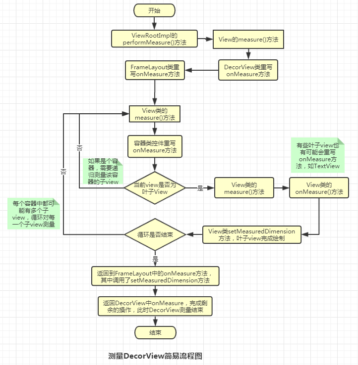
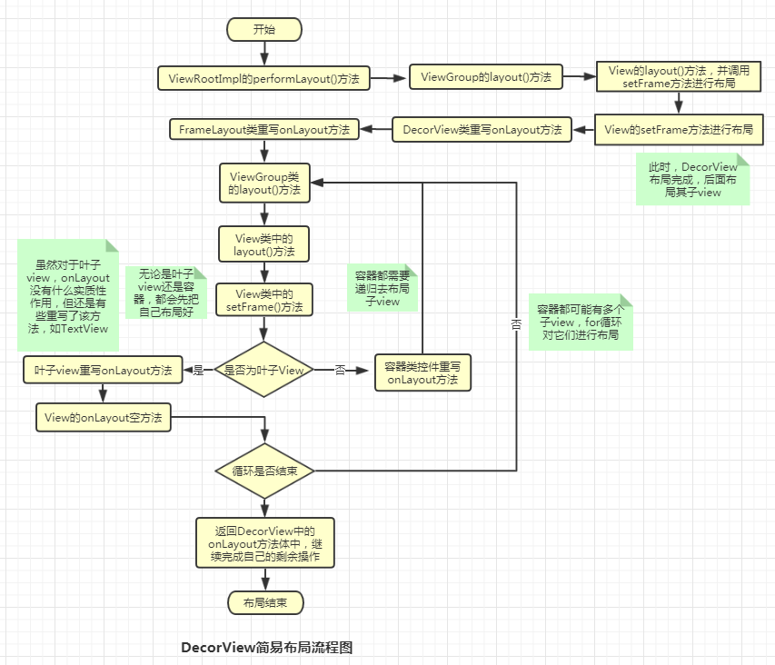
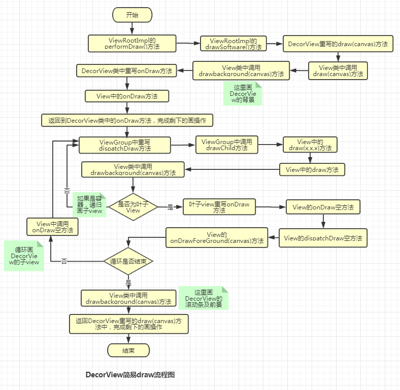

# Android 的常见问题

[TOC]


# 1. 性能优化

## 1.1. 内存优化

### 1.1.1. 内存泄漏

　　内存泄漏：内存不在 GC 的掌控范围之内了。

　　java 的 GC 内存回收机制：某对象不再有任何引用的时候才会进行回收。

　　内存泄漏一般导致应用卡顿，极端情况会导致项目 boom。Boom 的原因是因为超过内存的阈值。原因只要有两方面：

1. 代码存在泄漏，内存无法及时释放导致 oom。

2. 一些逻辑消耗了大量内存，无法及时释放或者超过导致 oom。

　　所谓消耗大量的内存的，绝大多数是因为图片加载。这是 oom 出现最频繁的地方。

### 1.1.2. 内存溢出

　　内存溢出是指当对象的内存占用已经超过可分配内存的空间大小，系统不能满足需求，这时未经处理的异常就会抛出。比如常见的内存溢出情况有：bitmap 过大，引用没释放，资源对象没关闭。

　　内存溢出的原因：内存泄漏导致（对象占用内存不释放，内存占用越来越多），占用内存较多的对象（保存了多个耗用内存过大的对象（如 Bitmap）或加载单个超大的图片，造成内存超出限制。）。

　　如何查看内存溢出：

1. 确定是否存在内存溢出的问题

   方法有两种：

* Android -> SystemInformation -> Memory Usage 查看 Object 里面是否有没有被释放的 Views 和 Activity。
* 命令 `adb shell dumpsys meminfo 包名 -d`。

2. 通过看 Memory Montor 工具，检查动作，反复多次执行某一个操作，查看内存的大概变化情况。
3. 使用 Heap SnapShot 工具（堆栈快照）更仔细地查找泄漏的位置。

　　点击 -> 进行一段时间的监控，生成一个文件 -> package treeview 会出现一些内存信息，便于分析内存情况。

### 1.1.3. 内存分析工具

　　性能优化工具：

* Heap SnapShot 工具
* Head Views 工具
* LeakCanary 工具
* MAT 工具
* TraceView 工具（Device Monitor）

　　第三方分析工具：

* Memory Analyzer
* GT Home
* iTest

### 1.1.4. 内存优化的操作

　　避免内存溢出：

1. 减少对象的内存占用

* 使用轻量的数据结构，比如使用 ArrayMap/SparseArray 而不是 HashMap 等传统数据结构。

* 避免在 Android 里面使用 Enum。

* 减少 Bitmap 对象的内存占用，使用 inSampleSize(缩放比例)、decode format（解码格式）减少创建出来的 Bitmap 的内存占用。

* 使用更小的图片。压缩设计师给的资源图片。

2. 内存对象的重复利用

* 复用系统自带资源，如字符串/颜色/图片/动画/样式以及简单布局。

* ListView/GridView 等出现大量重复子组件的视图对 ConvertView 的复用。

* Bitmap 对象的复用。

  使用 LRU 的机制缓存处理好的 Bitmap。利用 inBitmap 的高级特性提高 Android 系统在 Bitmap 分配和释放执行效率上的提升。

* 避免在 onDraw 方法里面执行对象的创建。

* 考虑使用 StringBuilder 来替代频繁的 String "+"。

3. 避免对象的内存泄漏

* 注意 Activity 的泄漏。

  内部类引用导致 Activity 泄漏：使用 static 和弱引用断开内部类引用与 Activity 之间存在的引用关系。

  Activity Context 被传递到其他实例中，这可能导致自身被引用而发生泄漏：可以考虑尽量使用 static 类型的内部类，同时使用 WeakReference 的机制来避免因为相互引用而出现的泄漏。

* 考虑使用 Application Context 而不是 Activity Context。

  对于大部分非必须使用 Activity Context 的情况（Dialog 的 Context 就必须是 Activity Context），都可以考虑使用 Application Context 而不是 Activity 的 Context，这样就避免不经意的 Activity 泄漏。

* 注意临时  Bitmap 对象的及时回收。

  需要特别留意的是 Bitmap 类里面提供的 createBitmap() 方法，这个方法返回的 bitmap 有可能和 source bitmap 是同一个，在回收的时候，需要特别检查 source bitmap 与 return bitmap 的引用是否相同，只有在不同的时候，才能够执行 source bitmap 的 recycler 方法。

* 注意监听器的注销，比如广播。

* 注意动画资源的释放。

* 注意缓存容器中的对象泄漏。

  有时候，为了提高对象的复用性把某些对象放到缓存容器中，可是如果这些对象没有及时从容器中清除，也是有可能导致内存泄漏的。

* 注意 WebView 的泄漏。

  标准的 WebView 存在内存泄漏的问题，所以通常根治这个问题的方法是为 WebView 开启另外一个进程，通过 AIDL 与主进程进行通信，WebView 所在的进程可以根据业务的需要选择合适的时机进行销毁，从而达到内存的完整释放。

* 注意 Cursor 对象是否及时关闭。

  在程序中经常会进行查询数据库的操作，但时常会存在不小心使用 Cursor 之后没有及时关闭的情况。这些 Cursor 的泄漏，反复多次出现的话会对内存管理产生很大的负面影响，需要谨记对 Cursor 对象的及时关闭。

4. 内存使用策略优化

* 谨慎使用 large heap

  可以通过调用 getMemoryClass() 来获取应用的可用 Heap 大小。

  在一些特殊的情景下，可以通过在 manifest 的 application 标签下添加 largeHeap = true 的属性来为应用声明一个更大的 heap 空间，然后，可以通过 getLargeMemoryClass() 来获取到这个更大的 heap size 阈值。

  然而，声明得到更大 Heap 阈值的本意是为了一小部分会消耗大量 RAM 的应用（例如一个大图片的编辑应用）。不要轻易的因为需要使用更多的内存而去请求一个大的 Heap Size。只有当清楚的知道哪里会使用大量的内存并且知道为什么这些内存必须被保留时才去使用 large heap。因此请谨慎使用 large heap 属性。

  使用额外的内存空间会影响系统整体的用户体验，并且会使得每次 gc 的运行时间更长。在任务切换时，系统的性能会大打折扣。

* 综合考虑设备内存阈值与其他因素设计合适的缓存大小

  在设计 ListView 或者 GridView 的 Bitmap LRU 缓存的时候，需要考虑

  * 应用程序剩下了多少可用的内存空间？
  * 有多少图片会被一次呈现到屏幕上？有多少图片需要事先缓存好以便快速滑动时能立即显示到屏幕？
  * 设备的屏幕大小与密度是多少？一个 xhdpi 的设备会比 hdpi 需要一个更大的 Cache 来 hold 住同样数量的图片。
  * 不同的页面针对 Bitmap 的设计的尺寸与配置是什么，大概会花费多少内存？
  * 页面图片被访问的频率？是否存在其中的一部分比其他的图片具有更高的访问频繁？如果是，也许想要保存那些最常访问的到内存中，或者为不同组别的位图（按访问频率分组）设置多个 LruCache 容器。

* onLowMemory() 与 onTrimMemory()

  * onLowMemory()：Android 系统提供了一些回调来通知当前应用的内存使用情况，通常来说，当所有的后台应用都被 kill 掉的时候，前台应用会收到 onLowMemory() 的回调，在这种情况下，需要尽快释放当前应用的非必须的内存资源，从而确保系统能够继续稳定运行。

  * onTrimMemory(int)：Android 系统从 4.0 开始还提供了 onTrimMemory() 的回调，当系统内存达到某些条件的时候，所有正在运行的应用都会收到这个回调，同时在这个回调里面会传递下面的参数，代表不同的内存使用情况。

    收到 onTrimMemory() 回调的时候，需要根据传递的参数类型进行判断，合理的选择释放自身的一些内存占用，一方面可以提高系统的整体运行流畅度，另外也可以避免自己被系统判断为优先需要杀死的应用。

* 资源文件需要选择合适的文件夹进行存放

  hdpi/xhdpi/xxhdpi 等等不同 dpi 的文件夹下的图片在不同的设备上会经过 scale 的处理。

* Try catch 某些大内存分配的操作

  在某些情况下，需要实现评估那些可能发生 OOM 的代码，对于这些可能发生 OOM 的代码，加入 catch 机制，可以考虑在 catch 里面尝试一次降级的内存分配操作，例如 decode bitmap 的时候，catch 到 OOM，可以尝试把采样比例再增加一倍之后，再次尝试 decode。

* 谨慎使用 static 对象

  因为 static 的生命周期很长，和应用的进程保持一致，使用不当很可能导致对象泄漏，在 Android 中应该谨慎使用 static 对象。

* 特别留意单例对象中不合理的持有

  虽然单例模式简单实用，提供了很多便利性，但是因为单例的生命周期和应用保持一致，使用不合理很容易出现持有对象的泄漏。

* 珍惜 Services 资源

  如果应用需要在后台使用 Service，除非它被触发并执行一个任务，否则其他时候 Service 都应该是停止状态。

  另外需要注意当这个 service 完成任务之后因为停止 Service 失败而引起的内存泄漏。

  建议使用 IntentService，它会在处理完交代给它的任务之后尽快结束自己。

* 优化布局层次，减少内存消耗

  越扁平化的视图布局，占用的内存就越少，效率越高。

  需要尽量保证布局足够扁平化，当使用系统提供的 View 无法实现足够扁平化的时候考虑使用自定义 View 来达到目的。

* 谨慎使用 ”抽象“ 编程

  抽象能够提升代码的灵活性与可维护性。但是抽象会导致一个显著的额外内存开销：它们需要同等量的代码用于可执行，那些代码会被 mapping 到内存中，因此如果抽象没有显著的提升效率，应该尽量避免它们。

* 使用 nano protobufs 序列化数据

  Protocal buffers 是由 Google 为序列化结构数据而设计的，一种语言无关，平台无关，具有良好的扩展性。类似 XML，却比 XML 更加轻量、快速、简单。如果需要为数据实现序列化与协议化，建议使用 nano protobufs。

* 谨慎使用依赖注入框架

  使用类似 Guice 或者 RoboGuice 等框架注入代码，在某种程度上可以简化代码。

  使用 RoboGuice 之后，代码是简化了不少。然而，那些注入框架会通过扫描代码执行许多初始化的操作，这会导致代码需要大量的内存空间来 mapping 代码，而且 mapped pages 会长时间的被保留在内存中。

* 谨慎使用多进程

  使用多进程可以把应用中的部分组件运行在单独的进程中，这样可以扩大应用的内存占用范围，但是这个技术必须谨慎使用，绝大数应用都不应该贸然使用多进程，一方面是因为使用多进程会使得代码逻辑更加复杂，另外如果使用不当，它可能反而会导致显著增加内存。

  当应用需要运行一个常驻后台的任务，而且这个任务并不轻量，可以考虑使用这个技术。

  也可以考虑线程池实现。

* 使用 ProGuard 来剔除不需要的代码

  ProGuard 能够通过移除不需要的代码、重命名类、域与方法等等，对代码进行压缩、优化与混淆。

  使用 Proguard 可以使得代码更加紧凑，这样能够减少 mapping 代码所需要的内存空间。

* 谨慎使用第三方 libraries

  很多开源的 library 代码都不是为移动网络环境而编写的，如果运用在移动设备上，并不一定适合。即使是针对 Android 而设计的 library，也需要特别谨慎，特别是在不知道引入的 library 具体做了什么事情的时候。

  另外不要为了 1 个或者 2 个功能而导入整个 library，如果没有一个合适的库与需要相吻合，应该考虑自己去实现，而不是导入一个大而全的解决方案。

* 考虑不同的实现方式来优化内存占用

  在某些情况下，设计的某个方案能够快速实现需求，但是这个方案却可能在内存占用上表现的效率不够好，就需要考虑其他实现方式来优化内存的占用。

  有时为了减少内存的占用，代码复杂度会有所增加，这就需要在优化内存占用与实现简易度之间进行权衡。

## 1.2. UI 优化

　　UI 优化主要包括**布局优化**以及 **view 的绘制优化**。

　　一般会导致卡顿的情况：

1. 人为在 UI 线程中做轻微耗时操作，导致 UI 线程卡顿；
2. 布局 Layout 过于复杂，无法在 16 ms 内完成渲染；
3. 同一时间动画执行的次数过多，导致 CPU 或 GPU 负载过重；
4. View 过度绘制，导致某些像素在同一帧时间内被绘制多次，从而使 CPU 或 GPU 负载过重；
5. View 频繁的触发 measure、layout，导致 measure、layout 累计耗时过多及整个 View 频繁的重新渲染；
6. 内存频繁触发 GC 过多（同一帧中频繁创建内存），导致暂时阻塞渲染操作；
7. 冗余资源及逻辑等导致加载和执行缓慢；
8. ANR；

### 1.2.1. 布局优化

　　屏幕上的某个像素在同一帧的时间内被绘制了多次，在多层次的 UI 结构里面，如果不可见的 UI 也在做绘制的操作，这就会导致某些像素区域被绘制了多次，这就浪费了大量的 CPU 以及 GPU 资源。

#### 1.2.1.1. 关于布局优化的方法

1. 如果父控件有颜色，也有自己需要的颜色，那么就不必在子控件加背景颜色。

2. 如果每个子控件的颜色不太一样，而且可以完全覆盖父控件，那么就不需要在父控件上加背景颜色。

3. 尽量避免不必要的嵌套。

4. 能用 LinearLayout 和 FrameLayout，就不要用 RelativeLayout，因为 RelativeLayout 控件相对比较复杂，测试也相对耗时。

5. 使用 include 和 merge 增加复用，减少层级。

   针对嵌套布局，google 提出了 include、merge 和 ViewStub 。

   include 标签常用于将布局中的公共部分提取出来供其他 layout 共用，以实现布局模块化，也是平常设计布局时用的最多的。

   include 可以提高布局的复用性，大大方便开发，include 没有减少布局的嵌套，但是 include 和 merge 联手搭配，还是不错的。

   merge 标签主要用于辅助 include 标签，在使用 include 后可能导致布局嵌套过多，多余的 layout 节点或导致解析变慢（可通过 hierarchy viewer 工具查看布局的嵌套情况）。merge 就是为了减少在使用 include 布局文件时的层级。

   merge 的布局取决于父控件是哪个布局，使用 merge 相当于减少了自身的一层布局，直接采用父 include 的布局，当然直接在父布局里面使用意义不大，所以会和 include 配合使用，即增加了布局的复用性，也减少了一层布局嵌套。

6. ViewStub 按需加载，更加轻便。

   ViewStub 可以按需加载，在需要的时候 ViewStub 中的布局才加载到内存。对于一些进度条，提示信息等等少次数使用的功能，使用 ViewStub 很合适。

   ViewStub 是一个不可见的，实际上是把宽高设置为 0 的 View。效果有点类似普通的 view.setVisible()，但性能体验提高不少。

7. 复杂界面可选择 ConstraintLayout，可有效减少层级。

   ConstraintLayout 可以有效地解决布局嵌套过多的问题。ConstraintLayout 使用约束的方式来指定各个控件的位置和关系，有点类似于 RelativeLayout，但远比 RelativeLayout 要更强大。所以简单布局简单处理，复杂布局 ConstraintLayout 很好使。

### 1.2.2. 绘制优化

　　平时感觉的卡顿问题最主要的原因之一是因为渲染性能，因为越来越复杂的界面交互，其中可能添加了动画、图片等等。希望创造出越炫的交互界面，同时也希望可以流畅显示，但是往往卡顿就会发生在这里。

　　这个是 Android 的渲染机制造成的，Android 系统每隔 16ms 发出 VSYNC 信号，触发对 UI 进行渲染，但是渲染未必成功，如果成功了那么代表一切顺利，但是失败了可能就要延误时间，或者直接跳过去，给人视觉上的表现就是要么卡了一会，要么跳帧。

　　View 的绘制频率保证 60 fps 是最佳的，这就要求每帧绘制时间不超过 16ms ( 16ms = 1000 / 60 ) ，虽然程序很难保证 16 ms 这个时间，但是尽量降低 onDraw 方法中的复杂度总是切实有效的。

　　解决方法：
**第一点：**onDraw 方法中不要做耗时的任务，也不做过多的循环操作，特别是嵌套循环，虽然每次循环耗时很小，但是大量的循环势必霸占 CPU 的时间片，从而造成 View 的绘制过程不流畅。

**第二点：**除了循环之外，onDraw() 中不要创建新的布局对象，因为 onDraw() 方法一般都会频繁大量调用，就意味着会产生大量的临时对象，不仅占用内存，而且会导致系统更加频繁的 GC，大大降低程序的执行速度和效率。

#### 1.2.2.1 关于绘制优化的方法

1. onDraw 中不要创建新的布局对象。
2. onDraw 方法中不要做耗时的任务，少使用循环。

### 1.2.3. 检查 UI 优化的方法

#### 1.2.3.1. **调试过度绘制**

　　对于 UI 性能的优化可以通过开发者选项中的 GPU 过度绘制工具来进行分析。在设置 -> 开发者选项 -> 调试 GPU 过度绘制中打开调试。

　　开启后在我们想要调试的应用界面中可以看到各种颜色的区域，红色标识最严重的过度渲染，目标就是尽量减少红色 Overdraw，看到更多的蓝色区域。

#### 1.2.3.2. **查看每帧的渲染时长**

　　可以打开设置 -> 开发者选项 -> GPU 呈现模式分析 -> 在屏幕上显示为条形图。

　　随着界面的刷新，界面上会以实时柱状图来显示每帧的渲染时间，柱状图越高表示渲染时间越长，每个柱状图偏上都有一根表示 16 ms 基准的绿色横线，每一条竖着的柱状线都包含三部分（蓝色代表测量绘制 Display List 的时间，红色代表 OpenGL 渲染 Display List 所需要的时间，黄色代表 CPU 等待 GPU 处理的时间），只要每一帧的总时间低于基准线就不会发生 UI 卡顿问题（个别超出基准线其实也不算什么问题的）。

　　也可以在执行完 UI 滑动操作后在命令行输入如下命令查看命令行打印的 GPU 渲染数据：

```
	adb shell dumpsys gfxinfo [应用包名]
```

　　分析依据：Draw + Process + Execute = 完整的显示一帧时间 < 16ms。

## 1.3. 启动优化

　　安卓应用的启动方式分为三种：冷启动（Cold start）、暖启动（Warm start）、热启动（Hot start）。不同的启动方式决定了应用 UI 对用户可见所需要花费的时间长短。冷启动消耗的时间最长，基于冷启动方式的优化工作也是最考验产品用户体验的地方。

### 1. 3.1. 启动方式

#### 3.1.1. 冷启动

　　冷启动是指应用程序从头开始，系统没有获取到当前 app 的 activity、Service 等等。例如第一次启动 app 或者杀死进程后第一次启动。那么对比其他两种当时，冷启动是耗时最长的。

　　应用发生冷启动时，系统一定会执行下面的三个任务：

1. 开始加载并启动应用

2. 应用启动后，显示一个空白的启动窗口（启动闪屏页）

3. 创建应用程序进程

　　那么创建应用程序进程之后，开始创建应用程序对象：

4.  启动 UI 线程
5.  创建主 Activity
6.  加载布局
7.  屏幕布局
8.  执行初始化绘制

　　应用程序进程完成第一次绘制后，系统进程会交换当前显示的背景窗口，将其替换为主活动。此时，用户可以开始使用该应用进程，至此启动完成。

　　在冷启动过程中有两个 creation 工作，分别是 Application 和 Activity creation，它们均在 View 绘制展示之前。所以，在应用自定义的 Application 类和第一个 Activity 类中，onCreate() 方法做的事情越多，冷启动消耗的时间越长。

#### 3.1.2. 暖启动

　　当应用中的 Activities 被销毁，但在内存中常驻时，应用的启动方式就会变为暖启动。相比冷启动，暖启动过程减少了对象初始化、布局加载等工作，启动时间更短。但启动时，系统依然会展示闪屏页，直到第一个 Activity 的内容呈现为止。

　　暖启动的场景有：

1. 用户退出应用，但随后重新启动它。该过程可能已继续运行，但应用程序必须通过调用从头开始重新创建 Activity 的 onCreate()。
2. 系统将您的应用程序从内存中逐出，然后用户重新启动它。需要重新启动进程和活动，但是在调用 onCreate() 的时候可以从 Bundle(savedInstanceState) 获取数据。

#### 3.1.3. 热启动

　　相比暖启动，热启动时应用做的工作更少，启动时间更短。在一个热启动中，系统会把你的 Activity 带到前台，如果应用程序的 Activity 仍然驻留在内存中，那么引用程序可以避免重复对象初始化、布局加载和渲染。产生热启动的场景有：用户使用返回键退出应用，然后马上又重新启动应用。

　　热启动和冷启动一样系统进程显示空白屏幕，直到应用程序完成呈现活动。

### 3.2. 如何优化

1. 利用提前展示出来的 Window，快速展示出来一个界面。

   使用 Activity 的 windowBackground 主题属性来为启动的 Activity 提供一个简单的 drawable。

2. 避免在启动时做密集沉重的初始化

   对于一些必须去初始化的，可以使用异步加载。一些初始化的情况：a.比如像友盟，bugly 这样的业务非必要的可以异步加载；b.比如地图、推送等，非第一时间需要的可以在主线程做延时启动。当程序以及启动起来之后，再进行初始化。c.对于图片、网络请求框架必须在主线程初始化。 

3. 避免 I/O 操作、反序列化、网络操作、布局嵌套等

## 1.4. 网络优化

　　网络优化的重点：时间、速度和成功率。

#### 1.4.1.1. 图片优化

　　图片现在在应用中很常见，所以对图片优化也是对网络优化的一种方式。

1. 使用 WebP 格式。同样的图片，采用 WebP 格式可大幅节省流量，相对于 JPG 格式的图片，流量能节省将近 25% 到 35%；相对于 PNG 格式的图片，流量可以节省将近 80%。最重要的是使用 WebP 之后图片质量也没有改变。
2. 使用缩略图。可以控制 inside 和 option，进行图片缩放。

#### 4.1.2. 网络请求处理的优化

1. 对服务器返回数据进行缓存，设定有效时间，有效时间之内不走网络请求，读取缓存显示，从而减少流量消耗。可以使用 HttpResponseCache 进行数据缓存。
2. 尽量少使用 GPS 定位，如果条件允许，尽可能使用网络定位。
3. 下载和上传尽可能使用断点。
4. 刷新数据时，尽可能使用局部刷新，而不是全局刷新。第一、界面会闪屏一下，网差的时候界面可能会直接白屏一段时间；第二，节省流量。

## 1.5. 包体优化

### 1.5.1. 包体优化的方式

　　从代码和资源两个方面去减少 APK 的大小。

1. 使用可绘制对象，某些图像不需要静态图片资源；框架可以在运行时动态绘制图像。Drawable 对象（< shape > 以 XML 格式）可以占用 APK 中的少量空间。此外，XML Drawbale 对象产生符合材料设计准则的单色图像。

2. 可以使用自己用 XML 写 Drawable，就使用自己写的，这种图片占用空间会很小。

3. 重用资源。可以使用旋转等方法去重用（比如三角按钮，三角朝上代表收起，三角朝下表示展开，就可以通过旋转重用一张图片）。

   统一图像的着色不同，可以使用 android:tint（将图片渲染成指定的颜色） 和 tintMode 属性，低版本（5.0 以下）可以使用 ColorFilter（图片减半处理，可以修改图片每个像素的颜色）。

4. 压缩 PNG 和 JPEG 文件。可以减少 PNG 文件的大小，而不会丢失图像质量。使用工具如 pngcrush、pngquant 或 zopfliping，这些工具都可以减少 PNG 文件的大小，同时保持感知的图像质量。

5. 使用 WebP 文件格式。可以使用 Webp 文件格式，而不是使用 PNG 或 JPEG 文件。Webp 格式提供有损压缩（如 JPEG）以及透明度（如 PNG），但可以提供比 JPEG 、PNG 更好的压缩。

   可以使用 Android Studio 将现有的 BMP、JPG、PNG 或静态 GIF 图像转换为 WebP 格式。

6. 使用矢量图像。可以使用矢量图形来创建与分辨率无关的图标和其他可伸缩 Image。使用这些图像可以大大减少 APK 大小。一个 100 字节的文件可以生成与屏幕大小相关的清晰图像。

   但是，系统渲染每个 VectorDrawable 对象需要花费大量时间，而较大的图像需要更长的时间才能显示在屏幕上。因此，仅在显示小图像时使用矢量图形。

   不要把 AnimationDrawable 用于创建逐帧动画，因为这样做需要为动画的每个帧包含一个单独的位图文件，这会大大增加 APK 的大小。

7. 代码混淆。使用 proGuard 代码混淆器工具，包括压缩、优化、混淆等功能。

8. 插件化。比如功能模块放在服务器上，按需下载，可以减少安装包大小。

### 1.5.2. 检查包体的工具

1. lint 工具，没有使用过的资源就会打印信息

```
res/layout/preferences.xml: Warning: The resource R.layout.preferences appears
    to be unused [UnusedResources]
```

　　开启资源压缩，就会自动删除无用的代码

```groovy
android {
    ...
    buildTypes {
        release {
            shrinkResources true
            minifyEnabled true
            proguardFiles getDefaultProguardFile('proguard-android.txt'),
                    'proguard-rules.pro'
        }
    }
}
```

2. Android Studio 有自带的代码检查工具。打开 Analyze -> Run Inspection by Name... -> unused resource 点击开始检测。
3. 也可以将鼠标放在代码区点击右键 -> Analyze -> Inspect Code -> 界面选择你要检测的模块 ->点击确认开始检测。

　　上面的方法是最容易找到代码缺陷以及无用代码的地方。

## 1.6. 电量优化

　　Battery Historian 是由 Google 提供的 Android 系统电量分析工具，从手机中导出 bugreport 文件上传至页面，在网页中生成详细的图标数据来展示手机上各模块电量消耗过程，最后通过 App 数据的分析制定出相应的电量优化的方法。

　　谷歌推荐使用 JobScheduler 来调整任务优先级等策略来达到降低损耗的目的。JobScheduler 可以避免频繁的唤醒硬件模块，造成不必要的电量消耗。避免在不合适的时间（例如低电量情况下、弱网络或者移动网络情况下）执行过多的任务从而消耗电量。

### 6.1. 具体实践

1. 可以退出非面向用户的任务（如定期数据库数据更新）；
2. 当充电时才希望执行的工作（如备份数据）；
3. 需要访问网络或 Wi-Fi 连接的任务（如向服务器拉取配置数据）；
4. 零散任务合并到一个批次去定期运行；
5. 当设备空闲时启动某些任务；
6. 只有当条件得到满足，系统才会启动计划中的任务（充电、WIFI）。
7. 需要进行网络请求时，首先判断网络当前的状态。
8. 在同时有 wifi 和移动数据的情况下，应该直接屏蔽移动数据的网络请求，只有当 wifi 断开时再调用，因为 wifi 请求的耗电量远比移动数据的耗电量低的低。
9. 后台任务要尽可能少的唤醒 CPU。

### 6.2. 电量优化的法则

　　谷歌对电量优化提出了一个懒惰第一的法则：

　　**减少**：应用可以删除冗余操作吗？例如，是否可以缓存下载的数据而不是重复唤醒无线电以重新下载数据。

　　**推迟**：应用是否需要立即执行操作？例如，可以等到设备充电时把数据备份到云端。

　　**合并**：可以批处理工作，而不是多次将设备至于活动状态吗？例如，几十个应用程序是否真的有必要在不同时间打开收音机发送邮件，在依次唤醒收音机期间，是否可以传输消息。

### 6.3. 电量优化的方法

1. 使用 JobScheduler 调度任务。
2. 使用懒惰法则。

# 2. View 的绘制流程

https://www.cnblogs.com/andy-songwei/p/10955062.html

　　一个完整的绘制流程包括 measure、layout、draw 三个步骤，其中：

* measure：测量。系统会先根据 xml 布局文件和代码中对控件属性的设置，来获取或者计算出每个View和ViewGrop的尺寸，并将这些尺寸保存下来。

* layout：布局。根据测量出的结果以及对应的参数，来确定每一个控件应该显示的位置。

* draw：绘制。确定好位置后，就将这些控件绘制到屏幕上。

　　整个绘制流程是从 ActivityThread 的 handleResumeActivity() 方法开始的。在 handleResumeActivity() 方法代码中，当 Activity 启动后，就通过 addView() 方法来间接调用 ViewRootImpl 类中的 performTraversals()，从而实现视图的绘制。

　　performTraversals() 方法把控着整个绘制的流程：

```java
// =====================ViewRootImpl.java=================
private void performTraversals() {
   ......
   int childWidthMeasureSpec = getRootMeasureSpec(mWidth, lp.width);
   int childHeightMeasureSpec = getRootMeasureSpec(mHeight, lp.height);
   ......
   // Ask host how big it wants to be
   performMeasure(childWidthMeasureSpec, childHeightMeasureSpec);
   ......
   performLayout(lp, mWidth, mHeight);
   ......
   performDraw();
}
```

　　上述代码中就是一个完成的绘制流程，三个步骤：

1. performMeasure()：从根节点向下遍历View树，完成所有 ViewGroup 和 View 的测量工作，计算出所有 ViewGroup 和 View 显示出来需要的高度和宽度；

2. performLayout()：从根节点向下遍历View树，完成所有ViewGroup和View的布局计算工作，根据测量出来的宽高及自身属性，计算出所有ViewGroup和View显示在屏幕上的区域；

3. performDraw()：从根节点向下遍历View树，完成所有ViewGroup和View的绘制工作，根据布局过程计算出的显示区域，将所有View的当前需显示的内容画到屏幕上。

## 2.1. Measure 过程

### 2.1.1. MeasureSpec 简介

1. MeasureSpec 概括了从父布局传递给子 view 布局要求。每一个MeasureSpec 代表了宽度或者高度要求，它由size（尺寸）和mode（模式）组成。

2. 有三种可能的mode：UNSPECIFIED、EXACTLY、AT_MOST

3. UNSPECIFIED：未指定尺寸模式。父布局没有对子view强加任何限制。它可以是任意想要的尺寸。（笔者注：这个在工作中极少碰到，据说一般在系统中才会用到，后续会讲得很少）

4. EXACTLY：精确值模式。父布局决定了子view的准确尺寸。子view无论想设置多大的值，都将限定在那个边界内。（笔者注：也就是layout_width属性和layout_height属性为具体的数值，如50dp，或者设置为match_parent，设置为match_parent时也就明确为和父布局有同样的尺寸，所以这里不要以为笔者搞错了。当明确为精确的尺寸后，其也就被给定了一个精确的边界）

5. AT_MOST：最大值模式。子view可以一直大到指定的值。（笔者注：也就是其宽高属性设置为wrap_content，那么它的最大值也不会超过父布局给定的值，所以称为最大值模式）

### 2.1.2. ViewGroup.LayoutParams 简介

1. LayoutParams被view用于告诉它们的父布局它们想要怎样被布局。

2. 该 LayoutParams 基类仅仅描述了 view 希望宽高有多大。对于每一个宽或者高，可以指定为以下三种值中的一个：MATCH_PARENT,WRAP_CONTENT,an exact number。（笔者注：FILL_PARENT从API8开始已经被MATCH_PARENT取代了，所以下文就只提MATCH_PARENT）

3. MATCH_PARENT：意味着该view希望和父布局尺寸一样大，如果父布局有padding，则要减去该padding值。

4. WRAP_CONTENT：意味着该view希望其大小为仅仅足够包裹住其内容即可，如果自己有padding，则要加上该padding值。

5. 对ViewGroup不同的子类，也有相应的LayoutParams子类。 

6. 其width和height属性对应着layout_width和layout_height属性。

### 2.1.3. View 测量的基本流程及重要方法分析

　　View体系的测量是从DecorView这个根view开始递归遍历的，而这个View体系树中包含了众多的叶子view和ViewGroup的子类容器。

　　measure() 方法是final型的，View子类都不能重写该方法。

　　measure() 方法：

1. 该方法被调用，用于找出 view 应该多大。父布局在witdh和height参数中提供了限制信息；

2. 一个view的实际测量工作是在被本方法所调用的onMeasure(int，int)方法中实现的。所以，只有onMeasure(int,int)可以并且必须被子类重写（笔者注：这里应该指的是，ViewGroup的子类必须重写该方法，才能绘制该容器内的子view。如果是自定义一个子控件，extends View，那么并不是必须重写该方法）；

3. 参数widthMeasureSpec：父布局加入的水平空间要求；

4. 参数heightMeasureSpec：父布局加入的垂直空间要求。

　　系统将其定义为一个final方法，可见系统不希望整个测量流程框架被修改。

　　onMeasure() 方法：

1. 测量该view以及它的内容来决定测量的宽度和高度。该方法被measure(int，int)（笔者注：就是前面提到过的那个方法）调用，并且应该被子类重写来提供准确而且有效的对它们的内容的测量。

2. 当重写该方法时，必须调用setMeasuredDimension(int,int)来存储该view测量出的宽和高。如果不这样做将会触发IllegalStateException，由measure(int,int)抛出。调用基类的onMeasure(int,int)方法是一个有效的方法。

3. 测量的基类实现默认为背景的尺寸，除非更大的尺寸被MeasureSpec所允许。子类应该重写onMeasure(int,int)方法来提供对内容更好的测量。

4. 如果该方法被重写，子类负责确保测量的高和宽至少是该view的mininum高度和mininum宽度值（链接getSuggestedMininumHeight()和getSuggestedMininumWidth()）；

5. widthMeasureSpec：父布局加入的水平空间要求。该要求被编码到android.view.View.MeasureSpec中。

6. heightMeasureSpec：父布局加入的垂直空间要求。该要求被编码到android.view.View.MeasureSpec中。

　　注意：容器类控件都是ViewGroup的子类，如FrameLayout、LinearLayout等，都会重写onMeasure方法，根据自己的特性来进行测量；如果是叶子节点view，即最里层的控件，如TextView等，也可能会重写onMeasure方法，所以当流程走到onMeasure(...)时，流程可能就会切到那些重写的onMeasure()方法中去。最后通过从根View到叶子节点的遍历和递归，最终还是会在叶子view中调用setMeasuredDimension(...)来实现最终的测量。

　　getMeasureWidth()方法：获取原始的测量宽度值，一般会拿这个方法和layout执行后getWidth()方法做比较。该方法需要在setMeasuredDimension()方法执行后才有效，否则返回值为0。

　　getMeasureHeight()方法：获取原始的测量高度值，一般会拿这个方法和layout执行后getHeight()方法做比较。该方法需要在setMeasuredDimension()方法执行后才有效，否则返回值为0。

　　DecorView测量的大致流程：DecorView的继承链：DecorView extends FrameLayout extends ViewGroup extends View，当DecorView第一次调用到measure()方法后，流程就开始切换到子类（也就是 FrameLayout）重写的onMeasure()中了。从FrameLayout中重写的onMeasure方法中可以看到，是先把子view测量完成后，最后才去调用setMeasuredDimension(...)来测量自己的。事实上，整个测量过程就是从子view开始测量，然后一层层往上再测量父布局，直到DecorView为止的。

　　DecorView中onMeasure方法的参数值是从哪里传过来的：在 ViewRootImpl 的 performTraversals() 方法中：`int childWidthMeasureSpec = getRootMeasureSpec(mWidth, lp.width); int childHeightMeasureSpec = getRootMeasureSpec(mHeight, lp.height);    `获取的。

　　DecorView视图树的简易measure流程图：从ViewRootImpl类的performTraversals()开始，经过递归遍历，最后到叶子view测量结束，DecorView视图树的测量就完成了。这里再用一个流程图简单描述一下整个流程：



## 2.2. layout 过程

　　当measure过程完成后，接下来就会进行layout阶段，即布局阶段。在前面measure的作用是测量每个view的尺寸，而layout的作用是根据前面测量的尺寸以及设置的其它属性值，共同来确定View的位置。

　　performLayout方法引出DecorView的布局流程：测量完成后，会在ViewRootImpl类的performTraverserals()方法中，开始调用performLayout方法。

　　layout方法正式启动布局流程：由于DecorView是一个容器，是ViewGroup子类，所以跟踪代码的时候，实际上是先进入到ViewGroup类中的layout方法中。这是一个final类型的方法，所以自定义 的ViewGroup子类无法重写该方法，可见系统不希望自定义的ViewGroup子类破坏layout流程。会继续跳转到 View 的 layout() 方法中。

　　View 的 layout() 方法：

1. 给view和它的所有后代分配尺寸和位置。

2. 这是布局机制的第二个阶段（第一个阶段是测量）。在这一阶段中，每一个父布局都会对它的子view进行布局来放置它们。一般来说，该过程会使用在测量阶段存储的child测量值。

3. 派生类不应该重写该方法。有子view的派生类（笔者注：也就是容器类，父布局）应该重写onLayout方法。在重写的onLayout方法中，它们应该为每一子view调用layout方法进行布局。

4. 参数依次为：Left、Top、Right、Bottom四个点相对父布局的位置。

　　View 的 layout() 方法中调用了 setFrame() 方法，这个方法用于给该 View 分配尺寸和位置（也就是实际的布局工作是在这里完成的）。如果新的尺寸和位置和之前的不同，返回 true。

　　如果 View 发生了改变，在 layout() 方法中接下来会调用 onLayout() 方法。

　　onLayout() 方法：

1. 当该view要分配尺寸和位置给它的每一个子view时，该方法会从layout方法中被调用。

2. 有子view的派生类（笔者注：也就是容器，父布局）应该重写该方法并且为每一个子view调用layout。

　　layout过程是父布局容器布局子view的过程，onLayout方法叶子view没有意义，只有ViewGroup才有用。

　　FrameLayout 的 onLayout 方法：方法中也是对每一个child调用layout方法的。如果该child仍然是父布局，会继续递归下去；如果是叶子view，则会走到view的onLayout空方法，该叶子view布局流程走完。

　　DecorView视图树的简易布局流程图：



## 2.3. draw 过程

　　当layout完成后，就进入到draw阶段了，在这个阶段，会根据layout中确定的各个view的位置将它们画出来。该过程的分析思路和前两个过程类似。

　　从 performDraw() 方法到 draw() 方法：draw过程，自然也是从performTraversals()中的performDraw()方法开始的，调用到了 DecorView 的 draw() 方法。

DecorView 树递归完成画流程：DecorView类中重写了draw()方法，在调用完super.draw后，还画了菜单背景。super.draw() 方法由于FrameLayout和ViewGroup都没有重写该方法，所以就直接进入都了View类中的draw方法了。

View 的 draw() 方法主要是手动渲染该view（以及它的所有子view）到给定的画布上。在该方法调用之前，该view必须已经完成了全面的布局。

从 draw() 代码上看，这里做了很多工作，简单说明一下：

1. 第一步：画背景。对应我我们在xml布局文件中设置的“android:background”属性，这是整个“画”过程的第一步。

2. 第二步：画内容。比如TextView的文字等，这是重点，onDraw方法。
3. 第三步：画子view。dispatchDraw方法用于帮助ViewGroup来递归画它的子view。这也是重点，后面也要详细讲到。

4. 第四步：画装饰。这里指画滚动条和前景。其实平时的每一个view都有滚动条，只是没有显示而已。

onDraw() 方法：DecorView中重写了该方法，所以流程会走到DecorView中重写的onDraw方法。调用了onDraw的父类方法，同时第4行还画了自己特定的东西。由于FrameLayout和ViewGroup也没有重写该方法，且View中onDraw为空方法，所以super.onDraw方法其实是啥都没干的。DocerView画完自己的东西，紧接着流程就又走到dispatchDraw方法了。

dispatchDraw() 方法：被draw方法调用来画子View。该方法可能会被派生类重写来获取控制，这个过程正好在该view的子view被画之前（但在它自己被画完成后）。也就是说当本view被画完之后，就开始要画它的子view了。这个方法也是一个空方法，实际上对于叶子view来说，该方法没有什么意义，因为它没有子view需要画了，而对于ViewGroup来说，就需要重写该方法来画它的子view。像平时常用的LinearLayout、FrameLayout、RelativeLayout等常用的布局控件，都没有再重写该方法，DecorView中也一样，而是只在ViewGroup中实现了dispatchDraw方法的重写。所以当DecorView执行完onDraw方法后，流程就会切到ViewGroup中的dispatchDraw方法了。

ViewGroup中的dispatchDraw 方法其实就是对每一个child执行drawChild操作。而 drawChild() 方法调用的是 child.draw() 方法。draw() 方法被ViewGroup.drawChild()方法调用，来让每一个子view画它自己。

该方法中，又回到了draw(canvas)方法中了，然后再开始画其子view，这样不断递归下去，直到画完整棵DecorView树。

DecorView视图树的简易draw流程图：




口述：

View 的绘制过程只要分为三部分：measure 测量，layout 布局和 draw 绘制。

绘制流程的开始是从 ActivityThread 调用 handleResumeActivity() 方法开始的，在这个方法中，当 Activity 启动后，就通过 addView() 方法来间接调用 ViewRootImpl 类中的 performTraversals()，从而开始显示视图的绘制。

performTraversals() 方法把控整个绘制的流程，调用了 performMeasure() 、performLayout()、performDraw() 方法实现从根节点向下遍历 View 树，完成所有 ViewGroup 和 View 的测量、布局、绘制工作。

measure 过程中是调用的 View 的 measure() 方法，measure() 方法是一个 final 类型的方法，所以子类无法重写该方法，而 measure() 方法中调用了 onMeasure() 方法。如果是容器类，需要递归调用该容器的子 View 的 measure() 方法测量。measure 过程完成后，View 的显示的宽高就确定了。

layout 过程只是对容器控件有用的，只有有子 View 才需要布局。 ViewGroup 的 layout() 方法是一个 final 类型的方法（ViewGroup 的 layout() 是一个 final 类型的，View 不是），所以子类无法重写该方法，ViewGroup 的 layout() 方法中调用了父类 View 的 layout() 方法，在这个方法中调用了 onLayout() 方法。View 的 onLayout() 是一个空实现，onLayout() 对于非容器控件是没有意义的，只有 ViewGroup 才有用。ViewGroup 的 onLayout() 方法会对每一个 child 调用 layout() 方法的。layout 过程完成后，layout 在父控件的 top、bottom、left、right 就确定了。

draw 过程会从 DecorView 的 draw() 调用到 View 的  draw() 方法，View 的 draw() 方法中会调用 drawBackground() 方法画背景，调用 onDraw() 方法画内容，调用 dispatchDraw() 方法画子 View，调用 onDrawForeground() 方法画装饰。在 ViewGroup 中会实现 dispatchDraw() 方法循环调用子 View 的 draw() 方法。draw 过程完成后，view 就显示在屏幕上了。

## 2.4. Android的wrap_content是如何计算的

　　MeasureSpec 的值由 specSize 和 specMode 共同组成的，其中 specSize 记录的是大小，specMode 记录的是规格。

　　specMode 一共有三种类型：

1. EXACTLY

   表示父视图希望子视图的大小应该是由 specSize 的值来决定的。

   系统默认会按照这个规则来设置子视图的大小，开发人员当然也可以按照自己的意愿设置成任意的大小。

2. AT_MOST

   表示子视图最多只能是 specSize 中指定的大小，开发人员应该尽可能小的去设置这个视图，并且保证不会超过 specSize。

   系统默认会按照这个规则来设置子视图的大小，开发人员当然也可以按照自己的意愿设置成任意的大小。

3. UNSPECIFIED

   表示开发人员可以将视图按照自己的意愿设置成任意的大小，没有任何限制。

   这种情况比较少见，不太会用到。

　　通常情况下，这两个值都是由父视图经过计算后传递给子视图的，说明父视图会在一定程度上决定子视图的大小。

当 rootDimension 参数等于 MATCH_PARENT 的时候，MeasureSpec 的 specMode 就等于 EXACTLY，当 rootDimension 等于 WRAP_CONTENT 的时候，MeasureSpec 的 specMode 就等于 AT_MOST。并且 MATCH_PARENT 和 WRAP_CONTENT 时的 specSize 都是等于 windowSize 的，也就意味着根视图总是会充满全屏的。

```java
    private static int getRootMeasureSpec(int windowSize, int rootDimension) {
        int measureSpec;
        switch (rootDimension) {

        	case ViewGroup.LayoutParams.MATCH_PARENT:
            // Window can't resize. Force root view to be windowSize.
            measureSpec = MeasureSpec.makeMeasureSpec(windowSize, MeasureSpec.EXACTLY);
            break;
        	case ViewGroup.LayoutParams.WRAP_CONTENT:
            // Window can resize. Set max size for root view.
            measureSpec = MeasureSpec.makeMeasureSpec(windowSize, MeasureSpec.AT_MOST);
            break;
       	 	default:
            // Window wants to be an exact size. Force root view to be that size.
            measureSpec = MeasureSpec.makeMeasureSpec(rootDimension, MeasureSpec.EXACTLY);
            break;
        }
        return measureSpec;
    }
```


# 3. Android 进程保活

## 3.1. 进程划分

　　Android 系统将进程划分为如下几种（重要性从高到低）。

### 3.1.1. 前台进程（Foreground process）

　　用户正在使用的程序，一般系统是不会杀死前台进程的，除非用户强制停止应用或系统内存不足等极端情况会杀死。

#### 3.1.1.1. 常见场景

1. 某个进程持有一个正在与用户交互的 Activity 并且该 Activity 正处于 resume 的状态。
2. 某个进程持有一个 Service，并且该 Service 与用户正在交互的 Activity 绑定。
3. 某个进程持有一个 Service，并且该 Service 调用 startForground() 方法使之位于前台运行。
4. 某个进程持有一个 Service，并且该 Service 正在执行它的某个生命周期回调方法，比如 onCreate()、onStary() 或 onDestory()。
5. 某个进程持有一个 BroadcastReceiver，并且该 BroadcastReceiver 正在执行其 onReceiver() 方法。

### 3.1.2. 可见进程

　　用户正在使用，看得到但是摸不着，显示界面没有覆盖到整个屏幕，只有屏幕的一部分。可见进程不包含任何前台组件，一般系统也是不会杀死可见进程的，除非要在资源吃紧的情况下，要保持某个或多个前台进程存活。

#### 3.1.2.1. 常见场景

1. 拥有不在前台、但仍对用户可见的 Activity（已调用 onPause()）。
2. 拥有绑定到可见（或前台）Activity 的 Service。

### 3.1.3. 服务进程

　　在内存不足以维持所有前台进程和可见进程同时运行的情况下，服务进程会被杀死。

#### 3.1.3.1. 常见场景

1. 某个进程中运行着一个 Service 且该 Service 是通过 startService() 启动的，与用户看见的界面没有直接关联。

### 3.1.4. 后台进程

　　系统可能随时终止它们，回收内存。

#### 3.1.4.1. 常见场景

1. 在用户按了 “ back ” 或者 “ home ” 后，程序本身看不到了，但是其实还在运行的程序，比如 Activity 调用了 onPause 方法。

### 3.1.5. 空进程

　　会被直接杀死的进程。

#### 3.1.5.1. 常见场景

1. 某个进程不包含任何活跃的组件时该进程就会被置为空进程，完全没用，杀了它只有好处没坏处，内存不足时会第一个杀死它。


　　系统出于体验和性能上的考虑，app 在退到后台时系统并不会真正的 kill 掉这个进程，而是将其缓存起来。打开的应用越多，后台缓存的进程也越多。在系统内存不足的情况下，系统开始依据自身的一套进程回收机制来判断要 kill 掉哪些进程，以腾出内存来供给需要的 app，这套杀进程的机制就叫 Low Memory Killer，它是基于 Linux 内核的 OOM Killer(Out-Of-Memory killer) 机制诞生。进程是有它的优先级的，进程回收机制就是根据这个优先级来决定是否进行回收。

　　app 退到后台时，其所有的进程优先级都会降低。但是 UI 进程是降低最为明显的，因为它占用的内存资源最多，系统内存不足的时候肯定优先先杀这些占用内存高的进程来腾出资源。所以，为了尽量避免后台 UI 进程被杀，需要尽可能地释放一些不用地资源，尤其是图片、音视频之类的。

　　进程保活的实现思想分为两部分：

1. 保活。通过提高进程优先级，降低进程被杀死的概率。
2. 拉起。进程被杀死后，进行拉起。

　　进程保活的实现方法如下：

* 黑色保活：不同的 app 进程，用广播相互唤醒（包括利用系统提供的广播进行唤醒）。
* 白色保活：通过启动前台 Service 使得进程优先级提高到前台进程。
* 灰色保活：利用系统的漏洞启动前台 Service。
* 双进程守护：两个进程互相拉起。
* JobService 轮询：关闭后自动拉起。

## 3.2. 黑色保活

　　所谓黑色保活，就是利用不同的 app 进程使用广播来进行相互唤醒。

　　适用对象：腾讯系全家桶、阿里系全家桶、应用之间互相拉起。

　　举 3 个比较常见的场景：

1. 开机、网络切换、拍照、拍视频的时候，利用系统产生的广播唤醒 app。
2. 接入第三方 SDK 也会唤醒相应的 app 进程，如微信 sdk 会唤醒微信，支付宝 sdk 会唤醒支付宝。
3. 假如手机里装了支付宝、淘宝、天猫、UC 等阿里系的 app，那么打开任意一个阿里系的 app 后，有可能就顺便把其他阿里系的 app 给唤醒了。

　　对于场景 1，在最新的 Android N 取消了 ACTION_NEW_PICTURE（拍照）、ACTION_NEW_VIDEO（拍视频）、CONNECTIVITY_ACTION（网络切换）等三种广播。而开机广播，有一些定制 ROM 的厂商会将其去掉。

## 3.3. 白色保活

　　白色保活手段非常简单，就是调用系统 api 启动一个前台的 Service 进程，这样会在系统的通知栏生成一个 Notification，用来让用户知道有这样一个 app 在运行着，哪怕当前的 app 推到了后台。

　　比如 LBE 和 QQ 音乐就是这样。

　　优点：写法简单、处理方便。

　　缺点：前台服务和通知绑定在一起，意味着开启服务要伴随一条通知在通知栏，用户有感知。

## 3.4. 灰色保活

　　灰色保活，这种保活手段是应用范围最广泛。

　　它是利用系统的漏洞来启动一个前台的 Service 进程，与普通的启动方式区别在于，它不会在系统通知栏处出现一个 Notification，看起来就如同运行着一个后台 Service 进程一样。这样做带来的好处就是，用户无法察觉到应用运行着一个前台进程（因为看不到 Notification），但是应用的进程优先级又是高于普通后台进程的。

　　大致的实现思路如下：

1. 思路一： API level < 18，启动前台 Service 时直接传入 new Notification。

2. 思路二：API level >= 18，同时启动两个 id 相同的前台 Service，然后再将后启动的 Service 做 stop 处理。

　　使用灰色保活并不代表 Service 就永久不死了，只能说是提高了进程的优先级。如果 app 进程占用了大量的内存，按照回收进程的策略，同样会干掉 app。

　　优点：开启前台服务的情况下，可以去掉通知，使得用户无感知。

　　缺点：target26 8.0 以上的系统该漏洞已修复，因此不适用。

## 3.5. 双进程守护

　　所谓双进程守护，就是指两个进程互相监视，一旦有一个进程死了，另一个进程监听到就拉起。

　　依托这个原理，衍生出的双进程守护的方案有很多，比如利用监听 socket 连接中断实现，利用文件锁实现，利用 android 的绑定服务实现。

　　以服务绑定为例：

```java
context.bindService(intent, serviceConnection, flag);
```

　　这里的 serviceconnection 就是监听回调，回调中有 onServiceConnected 方法和 onServiceDisconnected 这两个方法，通过 onServiceDisconnected 可以监听到另一个服务是否还存活。把两个服务放在两个进程就能够做到监听并拉起进程。

## 3.6. JobService

　　通过定时触发任务，判定进程是否存活，如果不存活了，则拉起。

　　优点：5.0 以后出现的 JobService 是官方推荐的方式，比较稳定。

　　缺点：触发时机不够实时，JobService 的触发时机会是充电时，闲暇时等特殊时机或者时周期性运行。

## 3.7. 具体的守护方案

### 3.7.1. 开启一个像素的 Activity

　　基本思想：系统一般是不会杀死前台进程的，所以要使得进程常驻，只需要在锁屏的时候在本进程开启一个 Activity，为了欺骗用户，让这个 Activity 的大小是 1 像素，并且透明无切换动画，在开屏幕的时候，把这个 Activity 关闭掉，所以这个就需要监听系统锁屏广播。

　　优化：内存越多会被最先 kill 掉，为了减少主程序的内存，可以将打开和关闭一个像素的 Activity 放到一个服务 Service 中去，而 Service 可以在另外一个进程中运行，在 MainActivity 中开启和关闭这个 Service 就可以了，这样主应用的进程就会更加的轻量。

### 3.7.2. 前台进程

　　原理：

1. 对于 API level < 18：调用 startForeground(ID, new Notofication()) ，发送空的 Notification，图标则不会显示。

2. 对于 API level >= 18：在需要提优先级的 service A 启动一个 InnerService，两个服务同时 startForeground，且绑定同样的 ID，Stop 掉 InnerService，这样通知栏图标即被移除。

### 3.7.3. 相互唤醒

　　相互唤醒的意思是打开一个应用，这个应用会去唤醒其他应用。此外，开机、网络切换、拍照、拍视频时候，利用系统产生的广播也能唤醒 app，不过 Android N 已经将这三种广播取消了。

　　像友盟、信鸽这种推送 SDK，也存在唤醒 app 的功能。

### 3.7.4. JobScheduler

　　Android 系统在 5.x 以上版本提供了一个 JobScheduler 接口，系统会根据自己实现定时去调用该接口传递的进程去实现一些操作，而且这个接口在被强制停止后依然能够正常的启动，不过在一些国产设备上可能无效，比如小米。

### 3.7.5. 粘性服务 & 系统服务绑定

　　这个是系统自带的，服务的 onStartCommand 方法必须具有一个整型的返回值，这个整型的返回值用来告诉系统在服务启动完毕后，如果被 kill，系统将如何操作。

　　这种方案虽然可以，但是在某些情况或者某些定制的 ROM 上可能失效，可以认为是多做的一种保守方案。

　　服务 的 onStartCommand 方法返回值的取值：

* START_STICKY

  如果系统在 onStartCommand 返回后被销毁，系统将会重新创建服务并以此调用 onCreate 和 onStartCommand（注意：根据测试 Android 2.3.3 以下版本只会调用 onCreate 根本不会调用 onStartCommand，Android 4.0 可以办到），这种相当于服务又重新启动恢复到之前的状态了。

* START_NOT_STICKY

  如果系统在 onStartCommand 返回后被销毁，如果返回该值，则在执行完 onStartCommand 方法后，如果 Service 被杀死，系统将不会重启该服务。

* START_REDELIVER_INTENT

  START_STICKY 的兼容版本，不同的是其不保证服务被杀后一定能重启。

### 3.7.6. 双进程守护

　　双进程守护的思想就是：两个进程共同运行，如果有其中一个进程被杀，那么另一个进程就会将被杀的进程重新拉起，相互保护，在一定的意义上，维持进程的不断运行。

　　双进程守护的两个进程，一个进程用于应用所需的后台操作，且叫它本地进程，另一个进程只负责监听着本地进程的状态，在本地进程被杀的时候拉起，与此同时本地进程也在监听着这个进程，准备在它被杀时拉起，将这个进程称为远端进程。

　　所以双进程守护的前提是，系统杀进程只能一个一个的去杀，如果一次性杀两个，这种方法也是不行的。

　　在 Android 5.0 之前，在应用退出后，ActivityManagerService 就把主进程给杀死了。但是，在 Android 5.0 以后，在应用退出后，ActivityManagerService 不仅把主进程给杀死，另外把主进程所属的进程组一并杀死，这样一来，由于子进程和主进程在同一进程组，子进程在做的事情，也就停止了。

#### 3.7.6.1. 代码实现

　　本地服务，就是需要在应用中处理逻辑的服务：

```java
public class LocalService extends Service {

    public static final String TAG = LocalService.class.getSimpleName();

    @Nullable
    @Override
    public IBinder onBind(Intent intent) {
        Log.d(TAG, "onBind");
        throw new UnsupportedOperationException("Not yet implemented");
    }

    @Override
    public int onStartCommand(Intent intent, int flags, int startId) {
        Log.d(TAG, "onStartCommand");
        startAndBindRemoteService();
        return super.onStartCommand(intent, flags, startId);
    }
		// 启动并绑定服务
    private void startAndBindRemoteService() {
        Log.d(TAG, "startAndBindRemoteService");
        Intent intent = new Intent(this, RemoteService.class);
        startService(intent);
        bindService(intent, new LocalServiceConnection(), Context.BIND_IMPORTANT);
    }
		// 绑定的回调
    private class LocalServiceConnection implements ServiceConnection {
        public final String TAG = LocalServiceConnection.class.getSimpleName();

        @Override
        public void onServiceConnected(ComponentName name, IBinder service) {
            Log.d(TAG, "onServiceConnected");
        }

        @Override
        public void onServiceDisconnected(ComponentName name) {
            Log.d(TAG, "onServiceDisconnected");
            startAndBindRemoteService();
        }
    }
}
```

　　负责拉起服务的服务：

```java
@TargetApi(Build.VERSION_CODES.LOLLIPOP)
public class RemoteService extends JobService {

    private static final String TAG = RemoteService.class.getSimpleName();

    @Override
    public int onStartCommand(Intent intent, int flags, int startId) {
        Log.d(TAG, "onStartCommand");
        return super.onStartCommand(intent, flags, startId);
    }

    @Override
    public boolean onStartJob(JobParameters params) {
        Log.d(TAG, "onStartJob");
        JobInfo.Builder builder = new JobInfo.Builder(1, new ComponentName(this, RemoteService.class));
        builder.setPeriodic(2000);
        JobInfo jobInfo = builder.build();
        JobScheduler jobScheduler = (JobScheduler) getSystemService(Context.JOB_SCHEDULER_SERVICE);
        jobScheduler.schedule(jobInfo);
        return false;
    }

    @Override
    public boolean onStopJob(JobParameters params) {
        Log.d(TAG, "onStopJob");
        // 在本服务停止时，检查 LocalService 是否存活，不存活就启动 LocalService
        boolean isServiceWork = isServiceWork(this, LocalService.class.getName());
        Log.d(TAG, "onStopJob isServiceWork:" + isServiceWork);
        if (!isServiceWork) {
            startService(new Intent(this, LocalService.class));
        }
        return false;
    }

    @Override
    public void onCreate() {
        Log.d(TAG, "onCreate");
        super.onCreate();
    }

    @Override
    public void onDestroy() {
        Log.d(TAG, "onDestroy");
        super.onDestroy();
    }
		// 检查某个服务是否还存活
    public boolean isServiceWork(Context context, String serviceName) {
        if (TextUtils.isEmpty(serviceName)) {
            return false;
        }
        boolean isWork = false;
        ActivityManager am = (ActivityManager) context.getSystemService(Context.ACTIVITY_SERVICE);
        List<ActivityManager.RunningServiceInfo> serviceList = am.getRunningServices(100);
        if (serviceList == null || serviceList.size() <= 0) {
            return false;
        }
        for (int i = 0; i < serviceList.size(); i++) {
            String name = serviceList.get(i).service.getClassName();
            if (serviceName.equals(name)) {
                isWork = true;
                break;
            }
        }
        return isWork;
    }
}
```

　　RemoteService 继承 JobService ，可以使得服务在被强制停止后再度启动起来，启动起来之后，就会将 LocalService 拉活。

　　在 AndroidManifest.xml 中声明服务：

```java
        <service android:name=".LocalService" />
        <service
            android:name=".RemoteService"
            android:exported="true"
            android:permission="android.permission.BIND_JOB_SERVICE" />
```

　　在 MainActivity 中启动服务：

```java
        Intent intent = new Intent(this, LocalService.class);
        startService(intent);
```

#### 3.7.6.2. 优化

　　在双进程守护的方案上还可以加上其他的实现方案进行优化：

1. 将 LocalService 设置为前台进程，提供它的优先级，减少被杀死的可能性。
2. 将 RemoteService 放在单独的一个线程，减少占用主程序的内存。

　　优化后的双进程守护的方案在实际使用中是最常用的。


# 4. 动画的分类及其原理

https://www.jianshu.com/p/88d349009530

## 4.1. 动画分类及使用

　　动画分为三类，分别是`帧动画、补间动画、属性动画`。

　　帧动画和补间动画又属于`View动画`。View动画作用对象是View，支持四种动画，分别是**平移、旋转、缩放、透明度变化**动画。

　　由于帧动画的表现形式与其他View动画不太一样，所以把它们区分来介绍。

## 4.2. 帧动画

　　帧动画是通过顺序 播放一系列图像产生的动画效果，类似于播放动画片。

　　通过在 drawable 目录下新建一个 animation-list 标签的 xml 文件，animation-list 的 item 代表一张图片，按照顺序排列图片。

　　之后在布局文件中使用这个 xml 文件，最后在代码中获取这个AnimationDrawable 文件，并且启动动画：`val background = icLove.background as AnimationDrawable;
    background.start();`

　　使用帧动画需要注意一个问题，**如果图片过多过大会引发OOM，所以尽量使用尺寸较小的图片**。

## 4.3. View动画

　　View动画支持四种动画：**平移`<translate>`、缩放`<scale>`、旋转`<rotate>`、透明度变化`<alpha>`**。
　　 **View动画的基类是Animation**，四种动画对应的子类分别是：TranslateAnimation、ScaleAnimation、RotateAnimation、AlphaAnimation。既可以通过xml定义，也可以在代码中动态创建，**建议通过xml定义View动画，可读性更好**。

## 4.4. 属性动画

　　属性动画是 Api11（Android 3.0）新加入的特性，**相比于View动画，属性动画可以对任何对象做动画，而且动画效果也得到加强，不再像View动画只能支持四种简单动画**。通过属性动画，可以实现更加绚丽的动画效果。

　　**属性动画的基类是ValueAnimator，还有一个重要的子类ObjectAnimator**。

## 4.5. 动画原理分析

下面，通过阅读源码分析View动画和属性动画的原理。对于动画原理，我们主要关心两个点：

- **属性值如何改变并且作用到对象上**
- **如何保证动画时间内不停更新属性值，从而形成动画效果**

### 4.5.1. View动画

View 动画的启动方式是 view.startAnimation(xxx) 方法，在这个方法中对 View 设置动画，并且刷新父类缓存和 view 本身及其子类。而 刷新视图最后会调用 View 的 draw 方法。

在 View 的 draw() 方法中会获取 View 上的动画信息，如果存在动画，则绘制动画。

先对 animation 进行初始化，初始化后会回调 onAnimationStart() 方法。之后调用 Animation 的 getTransformation() 方法获取动画信息。在 getTransformation() 方法中根据流逝的时间计算当前动画时间百分比，然后通过插值器（Interpolator）重新计算这个百分比，并且以此来计算当前动画属性值，并会调用 applyTransformation() 方法应用动画，这个方法会在 Animation 的子类中实现，通过 Matrix 来实现功能。之后在动画结束之前会不断重绘，从而形成连续的动画效果。

#### 4.5.1. 插值器与估值器

插值器，一般和估值器配合使用。

插值器的作用是设置 属性值 从初始值过渡到结束值 的变化规律。

估值器的作用是设置 属性值 从初始值过渡到结束值 的变化具体数值。

插值器（Interpolator）决定 值 的变化规律（匀速、加速blabla），即决定的是变化趋势；而接下来的具体变化数值则交给估值器。

插值器和估值器都是接口，支持自定义。

### 4.5.2. 属性动画原理

属性动画原理

ObjectAnimator 的 ofInt() 方法中会构建一个属性动画对象 ObjectAnimator，并调用 ObjectAnimator 的 setIntValues() 方法设置了一些属性，在 setIntValues() 方法中调用了 setValues(PropertyValuesHolder.ofInt(mProperty, values)) 方法，PropertyValuesHaolder 对象的作用就是保存属性名称和该属性的 setter、getter 方法以及它的目标值。而 setValues() 方法会计算动画的关键帧。

ObjectAnimator 的 start() 方法会调用它的父类 ValueAnimator 的 start() 方法，start() 方法主要做的事情是：

1. 初始化动画的各种标志位；
2. 注册 callback  回调，获取动画的下一帧回调。
3. 如果没有延迟启动，初始化动画设置一些监听，并设置 time 为 0 的当前帧数的目标值。


我们从ObjectAnimator.ofInt方法开始分析：


```cpp
public static ObjectAnimator ofInt(Object target, String propertyName, int... values) {
    ObjectAnimator anim = new ObjectAnimator(target, propertyName);
    anim.setIntValues(values);
    return anim;
}
```

构建一个属性动画对象，并且设置一些属性，着重看setIntValues方法：


```java
@Override
public void setIntValues(int... values) {
    if (mValues == null || mValues.length == 0) {
        // No values yet - this animator is being constructed piecemeal. Init the values with
        // whatever the current propertyName is
        if (mProperty != null) {
            setValues(PropertyValuesHolder.ofInt(mProperty, values));
        } else {
            setValues(PropertyValuesHolder.ofInt(mPropertyName, values));
        }
    } else {
        super.setIntValues(values);
    }
}
```

方法中出现了一个PropertyValuesHolder类，这个类是该动画库的一个核心类，它的作用是保存属性的名称和它的setter、getter方法，以及它的目标值。
 继续跟setValues方法：


```cpp
public void setValues(PropertyValuesHolder... values) {
    int numValues = values.length;
    mValues = values;
    mValuesMap = new HashMap<String, PropertyValuesHolder>(numValues);
    for (int i = 0; i < numValues; ++i) {
        PropertyValuesHolder valuesHolder = values[i];
        mValuesMap.put(valuesHolder.getPropertyName(), valuesHolder);
    }
    // New property/values/target should cause re-initialization prior to starting
    mInitialized = false;
}
```

保存PropertyValuesHolder在数组mValues和Map mValuesMap中。从上面代码中可以看出，`PropertyValuesHolder.ofInt(mPropertyName, values)`会构建一个PropertyValueHolder对象。


```cpp
public static PropertyValuesHolder ofInt(String propertyName, int... values) {
    return new IntPropertyValuesHolder(propertyName, values);
}
```

IntPropertyValuesHolder是PropertyValuesHolder的子类，接着看IntPropertyValuesHolder构造方法：


```java
public IntPropertyValuesHolder(String propertyName, int... values) {
    //保存属性名
    super(propertyName);
    setIntValues(values);
}
```

看setIntValues方法：


```java
@Override
public void setIntValues(int... values) {
    super.setIntValues(values);
    mIntKeyframes = (Keyframes.IntKeyframes) mKeyframes;
}
```

会调用super（PropertyValuesHolder）的setIntValues方法：


```csharp
public void setIntValues(int... values) {
    //保存属性的类型
    mValueType = int.class;
    mKeyframes = KeyframeSet.ofInt(values);
}
```

这个方法中会根据传入的值生成关键帧集合mKeyframes，它保存的是在每个时刻该属性对应的值：


```java
public class KeyframeSet implements Keyframes {

    int mNumKeyframes;

    Keyframe mFirstKeyframe;
    Keyframe mLastKeyframe;
    TimeInterpolator mInterpolator; // only used in the 2-keyframe case
    List<Keyframe> mKeyframes; // only used when there are not 2 keyframes
    TypeEvaluator mEvaluator;


    public KeyframeSet(Keyframe... keyframes) {
        mNumKeyframes = keyframes.length;
        // immutable list
        mKeyframes = Arrays.asList(keyframes);
        mFirstKeyframe = keyframes[0];
        mLastKeyframe = keyframes[mNumKeyframes - 1];
        mInterpolator = mLastKeyframe.getInterpolator();
    }

    public static KeyframeSet ofInt(int... values) {
        int numKeyframes = values.length;
        IntKeyframe keyframes[] = new IntKeyframe[Math.max(numKeyframes,2)];
        if (numKeyframes == 1) {
            keyframes[0] = (IntKeyframe) Keyframe.ofInt(0f);
            keyframes[1] = (IntKeyframe) Keyframe.ofInt(1f, values[0]);
        } else {
            keyframes[0] = (IntKeyframe) Keyframe.ofInt(0f, values[0]);
            for (int i = 1; i < numKeyframes; ++i) {
                keyframes[i] =
                        (IntKeyframe) Keyframe.ofInt((float) i / (numKeyframes - 1), values[i]);
            }
        }
        return new IntKeyframeSet(keyframes);
    }
}
```

上面介绍的是创建ObjectAnimator对象的过程，ObjectAnimator创建完毕之后就可以通过`start()`方法启动动画，我们跟一下：


```java
@Override
public void start() {
    AnimationHandler.getInstance().autoCancelBasedOn(this);
    ...
    super.start();
}
```

会调用父类ValueAnimator的start方法：


```java
@Override
public void start() {
    start(false);
}

private void start(boolean playBackwards) {
    //检查Looper是否为空，此处的Looper是UI线程的Looper
    if (Looper.myLooper() == null) {
        throw new AndroidRuntimeException("Animators may only be run on Looper threads");
    }
    //设置一些基本状态
    mReversing = playBackwards;
    mSelfPulse = !mSuppressSelfPulseRequested;
    // Special case: reversing from seek-to-0 should act as if not seeked at all.
    if (playBackwards && mSeekFraction != -1 && mSeekFraction != 0) {
        if (mRepeatCount == INFINITE) {
            // Calculate the fraction of the current iteration.
            float fraction = (float) (mSeekFraction - Math.floor(mSeekFraction));
            mSeekFraction = 1 - fraction;
        } else {
            mSeekFraction = 1 + mRepeatCount - mSeekFraction;
        }
    }
    mStarted = true;
    mPaused = false;
    mRunning = false;
    mAnimationEndRequested = false;
    // Resets mLastFrameTime when start() is called, so that if the animation was running,
    // calling start() would put the animation in the
    // started-but-not-yet-reached-the-first-frame phase.
    mLastFrameTime = -1;
    mFirstFrameTime = -1;
    mStartTime = -1;
    //添加动画回调到AnimationHandler中
    addAnimationCallback(0);

    if (mStartDelay == 0 || mSeekFraction >= 0 || mReversing) {
        // If there's no start delay, init the animation and notify start listeners right away
        // to be consistent with the previous behavior. Otherwise, postpone this until the first
        // frame after the start delay.
        //触发动画监听的回调方法
        startAnimation();
        //开始执行第一帧动画
        if (mSeekFraction == -1) {
            // No seek, start at play time 0. Note that the reason we are not using fraction 0
            // is because for animations with 0 duration, we want to be consistent with pre-N
            // behavior: skip to the final value immediately.
            setCurrentPlayTime(0);
        } else {
            setCurrentFraction(mSeekFraction);
        }
    }
}
```

实际上setCurrentPlayTime方法调用的也是setCurrentFraction方法，我们直接看setCurrentFraction方法：


```java
public void setCurrentFraction(float fraction) {
    initAnimation();
    fraction = clampFraction(fraction);
    mStartTimeCommitted = true; // do not allow start time to be compensated for jank
    if (isPulsingInternal()) {
        long seekTime = (long) (getScaledDuration() * fraction);
        long currentTime = AnimationUtils.currentAnimationTimeMillis();
        // Only modify the start time when the animation is running. Seek fraction will ensure
        // non-running animations skip to the correct start time.
        mStartTime = currentTime - seekTime;
    } else {
        // If the animation loop hasn't started, or during start delay, the startTime will be
        // adjusted once the delay has passed based on seek fraction.
        mSeekFraction = fraction;
    }
    mOverallFraction = fraction;
    final float currentIterationFraction = getCurrentIterationFraction(fraction, mReversing);
    animateValue(currentIterationFraction);
}
```

该方法计算出当前动画时间百分比，然后通过animateValue来改变属性的值：


```csharp
@CallSuper
void animateValue(float fraction) {
    fraction = mInterpolator.getInterpolation(fraction);
    mCurrentFraction = fraction;
    int numValues = mValues.length;
    for (int i = 0; i < numValues; ++i) {
        mValues[i].calculateValue(fraction);
    }
    if (mUpdateListeners != null) {
        int numListeners = mUpdateListeners.size();
        for (int i = 0; i < numListeners; ++i) {
            mUpdateListeners.get(i).onAnimationUpdate(this);
        }
    }
}
```

这个方法就是调用PropertyValuesHolder来改改变属性的值，并且调用属性动画监听的回调方法。
 到这里，我们知道了属性的值是如何改变的。接下来分析在动画时间内怎样保证动画持续进行。在ValueAnimator的start方法中有一句`addAnimationCallback(0);`，我们跟踪看一下：


```cpp
private void addAnimationCallback(long delay) {
    if (!mSelfPulse) {
        return;
    }
    getAnimationHandler().addAnimationFrameCallback(this, delay);
}
```

调用了AnimationHandler的addAnimationFrameCallback方法：


```csharp
public void addAnimationFrameCallback(final AnimationFrameCallback callback, long delay) {
    if (mAnimationCallbacks.size() == 0) {
        getProvider().postFrameCallback(mFrameCallback);
    }
    if (!mAnimationCallbacks.contains(callback)) {
        mAnimationCallbacks.add(callback);
    }

    if (delay > 0) {
        mDelayedCallbackStartTime.put(callback, (SystemClock.uptimeMillis() + delay));
    }
}
```

假设当前callback数量为0，就会调用getProvider().postFrameCallback方法，getProvider方法如下：


```csharp
private AnimationFrameCallbackProvider getProvider() {
    if (mProvider == null) {
        mProvider = new MyFrameCallbackProvider();
    }
    return mProvider;
}
```

它是一个MyFrameCallbackProvider对象，我们就来看一下MyFrameCallbackProvider的postFrameCallback方法：


```java
/**
 * Default provider of timing pulse that uses Choreographer for frame callbacks.
 */
private class MyFrameCallbackProvider implements AnimationFrameCallbackProvider {

    final Choreographer mChoreographer = Choreographer.getInstance();

    @Override
    public void postFrameCallback(Choreographer.FrameCallback callback) {
        mChoreographer.postFrameCallback(callback);
    }

    @Override
    public void postCommitCallback(Runnable runnable) {
        mChoreographer.postCallback(Choreographer.CALLBACK_COMMIT, runnable, null);
    }

    @Override
    public long getFrameTime() {
        return mChoreographer.getFrameTime();
    }

    @Override
    public long getFrameDelay() {
        return Choreographer.getFrameDelay();
    }

    @Override
    public void setFrameDelay(long delay) {
        Choreographer.setFrameDelay(delay);
    }
}
```

postFrameCallback中会调用Choreographer.postFrameCallback方法：


```cpp
public void postFrameCallback(FrameCallback callback) {
    postFrameCallbackDelayed(callback, 0);
}
```

接着跟：


```csharp
public void postFrameCallbackDelayed(FrameCallback callback, long delayMillis) {
    if (callback == null) {
        throw new IllegalArgumentException("callback must not be null");
    }

    postCallbackDelayedInternal(CALLBACK_ANIMATION,
            callback, FRAME_CALLBACK_TOKEN, delayMillis);
}
```

继续：


```java
private void postCallbackDelayedInternal(int callbackType,
            Object action, Object token, long delayMillis) {
    if (DEBUG_FRAMES) {
        Log.d(TAG, "PostCallback: type=" + callbackType
                + ", action=" + action + ", token=" + token
                + ", delayMillis=" + delayMillis);
    }

    synchronized (mLock) {
        final long now = SystemClock.uptimeMillis();
        final long dueTime = now + delayMillis;
        mCallbackQueues[callbackType].addCallbackLocked(dueTime, action, token);

        if (dueTime <= now) {
            scheduleFrameLocked(now);
        } else {
            Message msg = mHandler.obtainMessage(MSG_DO_SCHEDULE_CALLBACK, action);
            msg.arg1 = callbackType;
            msg.setAsynchronous(true);
            mHandler.sendMessageAtTime(msg, dueTime);
        }
    }
}
```

因为延时为0，所以dueTime = now，就回调用scheduleFrameLocked(now)方法：


```java
private void scheduleFrameLocked(long now) {
    if (!mFrameScheduled) {
        mFrameScheduled = true;
        if (USE_VSYNC) {
            if (DEBUG_FRAMES) {
                Log.d(TAG, "Scheduling next frame on vsync.");
            }

            // If running on the Looper thread, then schedule the vsync immediately,
            // otherwise post a message to schedule the vsync from the UI thread
            // as soon as possible.
            if (isRunningOnLooperThreadLocked()) {
                scheduleVsyncLocked();
            } else {
                Message msg = mHandler.obtainMessage(MSG_DO_SCHEDULE_VSYNC);
                msg.setAsynchronous(true);
                mHandler.sendMessageAtFrontOfQueue(msg);
            }
        } else {
            final long nextFrameTime = Math.max(
                    mLastFrameTimeNanos / TimeUtils.NANOS_PER_MS + sFrameDelay, now);
            if (DEBUG_FRAMES) {
                Log.d(TAG, "Scheduling next frame in " + (nextFrameTime - now) + " ms.");
            }
            Message msg = mHandler.obtainMessage(MSG_DO_FRAME);
            msg.setAsynchronous(true);
            mHandler.sendMessageAtTime(msg, nextFrameTime);
        }
    }
}
```

这个方法中USE_VSYNC默认为true，所以会走scheduleVsyncLocked方法，这个方法是一个native方法，我们就不跟了。在这里着重看注释，它的意思是：如果运行在UI线程中，会立刻调用VSYNC机制。而VSYNC是Android系统用来更新界面的信号，每16ms一次。**说明属性动画是通过VSYNC信号来持续改变属性值进行动画的**。

 到这里，总算把属性动画的原理解释完毕了。文章很长，大家可以对着源码一步步来看，能够更好的理解属性动画。

## 4.6. 视图动画和属性动画的区别

　　视图动画只提供为视图类设置动画的能力，所以如果你想为非视图的类设置动画，你需要自己实现代码来完成这个功能。视图动画也只能设置视图类的一部分属性设置动画，例如缩放和旋转视图，但不能为视图的背景设置动画。

　　除了上面提到的缺点外，视图动画只能为当前绘制的视图设置动画，但并没有改变视图本身的属性，例如，如果你为一个按钮设置动画，使按钮在屏幕上移动，按钮在屏幕上按照预期的期望绘制在指定的位置，但是实际你点击按钮能触发按钮事件的位置还是在原处，你需要额
外的逻辑来处理这种情况。

　　如果使用属性动画，上面提到的这些视图动画的缺点都将不存在。你可以为任何对象设置动画，包括视图类和非视图类，并且修改的就是视图本身的属性。属性动画在实现动画的策略方面也是更健壮的。在一个更高的水平上，可以为动画分配你想设置动画的属性，例如颜色，位置，大小并且可以为动画设置插值器的行为，你也可以同时执行多个动画。

　　当然，视图动画还是有他的优点，设置视图动画的时间要少，为设置视图动画编写的代码也少。如果视图动画能完成你想要做的任何事情，又或者当前的代码已经达到你想要的效果，这时候也不需要使用属性动画。在某些情况下，为不同的情况结合使用两种动画也是有意义的。

# 5. SparseArray 原理

https://www.cnblogs.com/xiaxveliang/p/12396049.html

https://www.jianshu.com/p/081b78dfe9f6

https://www.cnblogs.com/RGogoing/p/5095168.html

# 6. 一个 Android 程序至少包含几个线程

　　线程是指进程中的一个执行流程，一个进程中可以运行多个线程。

　　而进程就是一个内存中运行的应用程序，而且有它自己独立的一块内存空间，一个程序至少有一个进程，一个进程至少有一个线程。

　　在 Java 中，每次程序运行至少启动 2 个线程：一个是 main 线程，一个是垃圾收集线程。因为每当使用 java 命令执行一个类的时候，实际上都会启动一个 JVM，每一个 JVM 实际上就是在操作系统中启动了一个进程。

　	UI 线程即用户交互线程，用来处理用户消息和界面绘制。

　　其次，每个 Binder 对象对应一个线程；在 ActivityThread 中会创建 ApplicationThread，他们都是继承 Binder，这里会启动两个线程。

　　所以最少应该是 4 个线程，UI 线程、两个 Binder 、一个垃圾收集线程，然后开发人员自定义的子线程。


