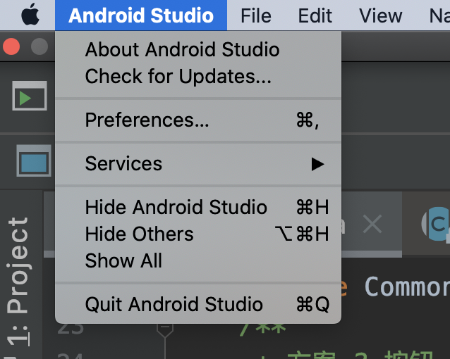
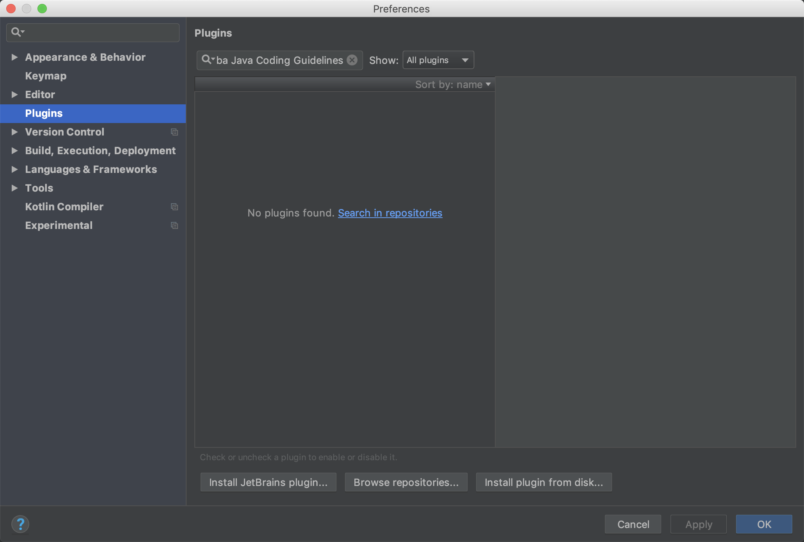
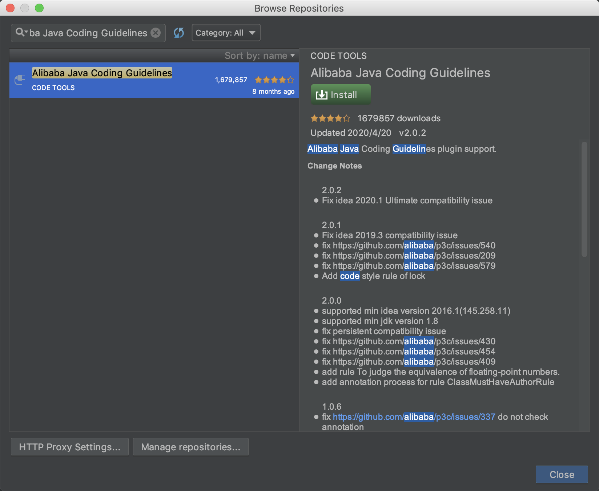
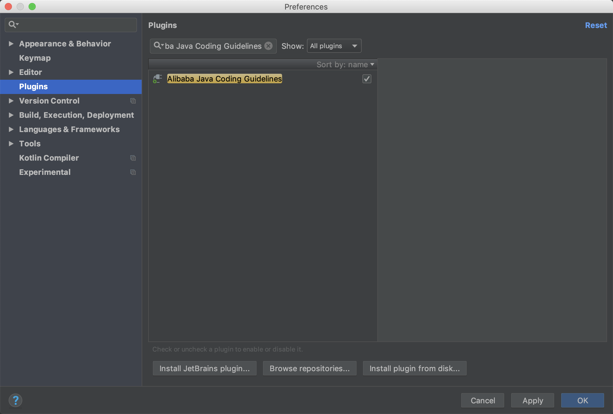
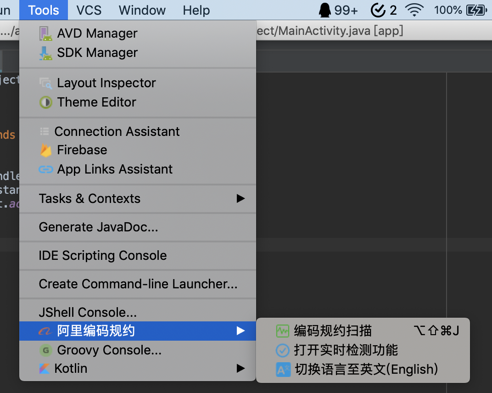
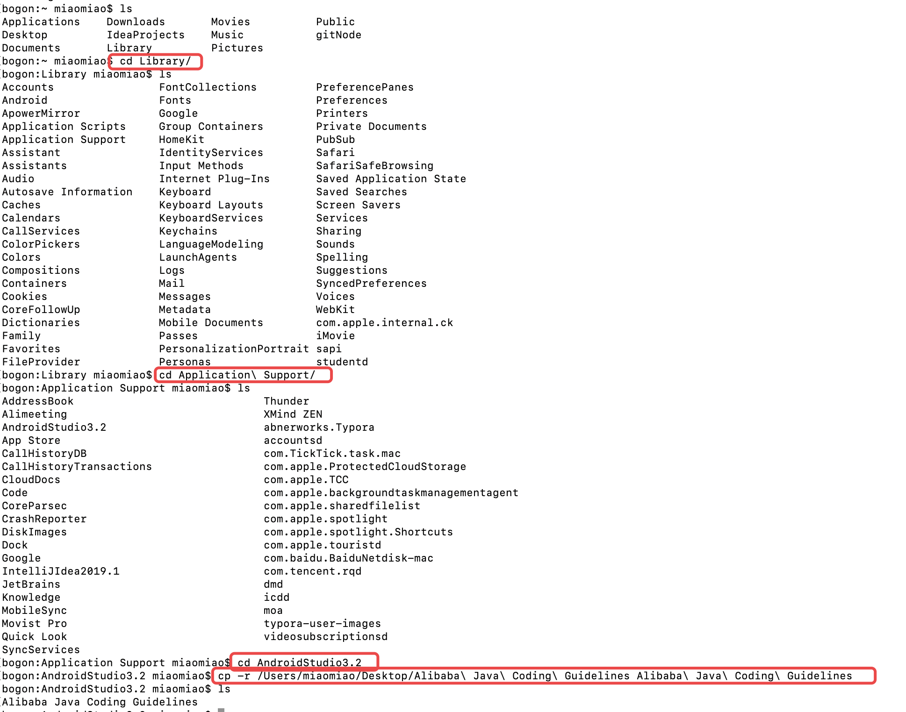
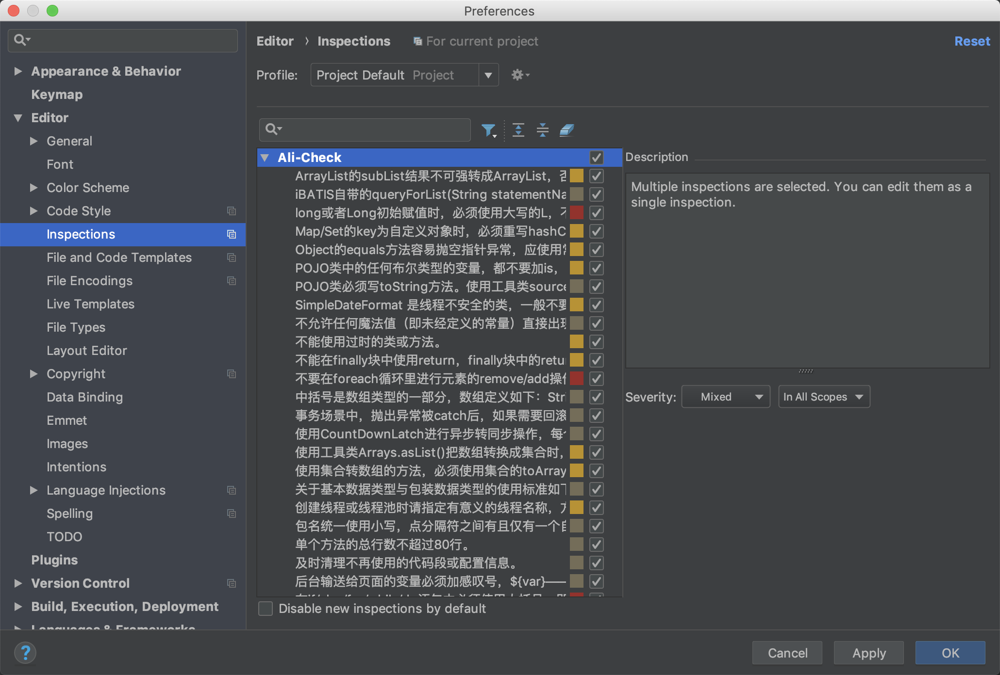
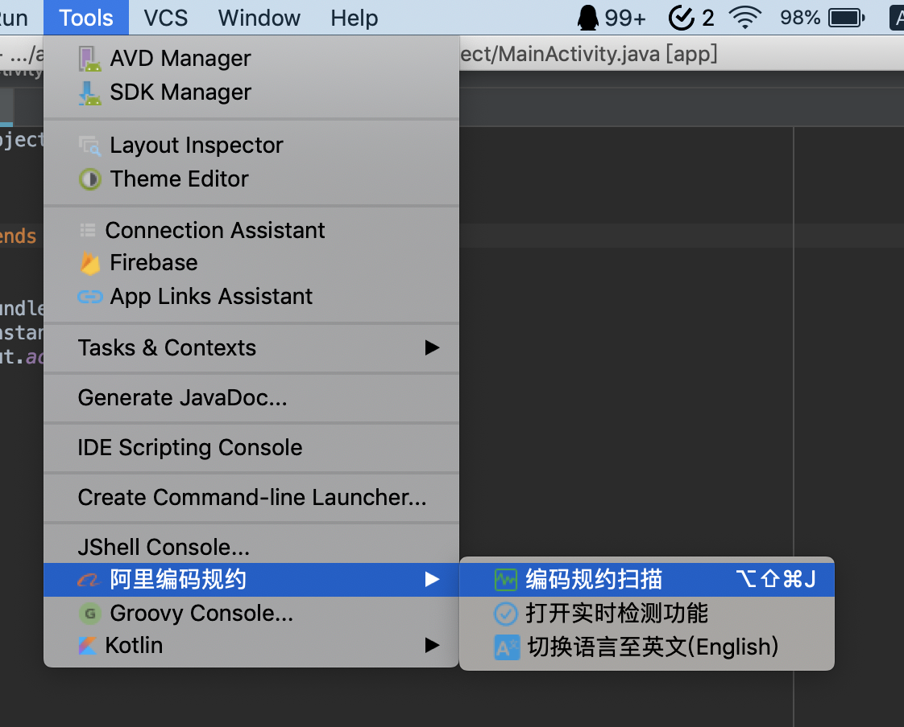
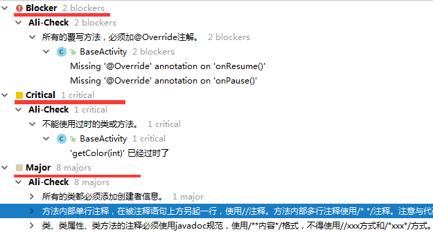
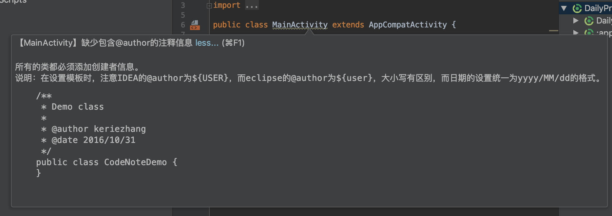

# 使用阿里代码规范插件

# 1. 安装插件工具

## 1.1. 在线安装

1. 点击 Preferences 选项。

2. 点击 Plugins 选项，并搜索 Alibaba Java Coding Guidelines。点击 Search in repositories。

3. 点击 Search in repositories，弹出下图框，点击 Install 安装插件。

4. 下载完成后，点击 Apply -> OK。

然后重启项目。

有上图的标志，就说明安装插件成功了。

## 1.2. 离线安装

1. 将附件的《Alibaba Java Coding Guidelines》压缩包下载下来，解压。

2. 打开终端，将 Alibaba Java Coding Guidelines 文件夹复制到 Android 外部插件的文件夹中。

然后重启电脑即可。

有上图的标志，就说明安装插件成功了。

# 2. 使用插件工具

## 2.1. Inspections 支持

Insepections 会自动在编码的阶段，进行快速灵活的静态代码分析，自动检测编译器和运行时错误，并提示开发人员在编译之前就进行有效的改正和改进。

## 2.2. 代码静态分析

使用 Tools -> 阿里编码规约 - > 编码规约扫描 就可以开启代码静态分析。

开启后分析的就是当前类的代码问题。

分析的结果，会以 Blocker/Critical/Major 三个级别进行区分。

## 1.3. 提示

开启之后，编码不规范的地方就会有提示，根据提示修改即可。

