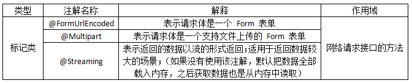

# Retrofit

## 简介


|  | Retrofit 简介 |
|--------|--------|
| 介绍 | 一个 RESTful 的 HTTP 网络请求框架（基于 OKHTTP） |
| 作者 | Square |
| 功能 | 1.基于 okhttp & 遵循 Restful API 设计风格；   <br />2.通过注解配置网络请求参数； <br />3.支持同步 & 异步网络请求； <br />4.支持多种数据的解析 & 序列化格式（Gson、Json、XML、Protobuf）；<br /> 5.提供对 RxJava 支持。 |
| 优点 | 1.功能强大：支持同步 & 异步、支持多种数据的解析 & 序列化格式、支持 RxJava；<br />2.简洁易用：通过注解配置网络请求参数、采用大量设计模式简化使用；<br />3.可扩展性好：功能模块高度封装、解耦彻底，如自定义 Converters （自定义转换器）等等。 |
| 应用场景 | 任何网络请求的需求场景都应优先选择（特别是后台 API 遵循 Resful API 设计风格 & 项目中使用到 RxJava）。 |

　　特别注意：
* 准确来说，Retrofit 是一个 RESTful 的 HTTP 网络请求框架的封装。
* 原因：网络请求的工作本质上是 OkHttp 完成，而 Retrofit 仅负责网络请求接口的封装。

* App 应用程序通过 Retrofit 请求网络，实际上是使用 Retrofit 接口层封装请求参数、Header、Url 等信息，之后由 OkHttp 完成后续的请求操作。
* 在服务端返回数据之后，OkHttp 将原始的结构交给 Retrofit，Retrofit 根据用户的需求对结果进行解析。

## 与其他开源请求库对比
　　除了 Retrofit，如今 Android 中主流的网络请求框架有：
* Android-Asynv-Http
* Volley
* OkHttp

　　网络请求开源库对比：

| 网络请求库/对比 | android-async-http | Volley | OkHttp | Retrofit |
|:-------|--------|--------|--------|--------|
| 作者 | Loopj | Google | Square | Square |
| 面世时间 | 1（最早） |2|3|4（最晚）|
| 人们使用情况（GitHub start书） | 2                                                            |1（最多）|3|4（最少）|
| 功能 | 1.基于 HttpClient；<br />2.在 UI 线程外、异步处理 Http 请求；<br />3.在匿名回调中处理请求结果，callback 使用了 Android 的 Handler 发送消息机制在创建它的线程中执行；<br />4.自动智能请求重试；<br />5.持久化 cookie 存储，保存 cookie 到你的应用程序的 SharedPreferences。 | 1.基于 HttpUrlConnection；<br />2.封装了 URL 图片加载框架，支持图片加载；<br />3.网络请求的排序、优先级处理；<br />4.缓存；<br />5.多级别取消请求；<br />6.Activity 和生命周期的联动（Activity 结束时同时取消所有网络请求）。 | 1.高性能 Http 请求库，可把它理解成一个封装之后的类似 HttpUrlConnection 的一个东西，属于同级并不属于上述两种；<br />2.支持 SPDY，共享同一个 Socket 来处理同一个服务器的所有请求；<br />3.支持 http 2.0、websocket；<br />4.支持同步、异步；<br />5.封装了线程池、数据转换、参数使用、错误处理等；<br />6.无缝的支持 GZIP 来减少数据流量；<br />7.缓存响应数据来减少重复的网络请求；<br />8.能从很多常用的连接问题中自动恢复；<br />9.解决了代理服务器问题和 SSL 握手失败问题。 | 1.基于 OkHttp；<br />2.RESTful API 设计风格；<br />3.支持同步、异步；<br />4.通过注解配置请求，包括请求方法、请求参数、请求头、返回值等；<br />5.可以搭配多种 Converter （转换器）将获得的数据解析 & 序列化，支持 Gson(默认)、Jackson、Protobuf 等；<br />6.提供对 RxJava 的支持。 |
| 性能 | 1.作者已经停止对该项目维护；<br />2.Android 5.0 后不推荐使用 HttpClient；所以不推荐在项目中使用。 | 1.可扩展性好：可支持 HttpClient、HttpUrlConnection 和 OkHttp。 | 1.基于 NIO 和 Okio，所以性能更好：请求、处理速度快（IO：阻塞式；NIO：非阻塞式；Okio 是 Square 公司基于 IO 和 NIO 基础上做的一个更简单、高效处理数据流的一个库）。 | 1.性能最好，处理最快；<br />2.扩展性差，高度封装所带来的必然后果；解析数据都是使用的统一的 converter（转换器），如果服务器不能给出统一的 API 的形式，将很难进行处理。 |
| 开发者使用 | 1.作者已经停止对该项目维护；<br />2.Android 5.0 后不推荐使用 HttpClient；所以不推荐在项目中使用。 | 1.封装性好：简单易用。 | 1. API 调用更加简单、方便；<br />2.使用时需要进行多一层封装。 | 1.简洁易用（RestfulAPI 设计分割）；<br />2.代码简洁（更加高度的封装性和注解用法）；<br />3.解耦的更彻底、职责更细分；<br />4.易与其他框架联合使用（RxJava）；<br />5.使用方法较多，原理复杂，存在一定门槛。 |
| 应用场景 | 1.作者已经停止对该项目维护；<br />2.Android 5.0 后不推荐使用 HttpClient；所以不推荐在项目中使用。 | 1.适合轻量级网络交互：网络请求频繁、传输数据量小；<br />2.不能进行大数据量的网络操作（比如下载视频、音频），所以不适合用来上传文件。 | 1.重量级网络交互场景：网络请求频繁、传输数据量大（其实会更推荐 Retrofit，反正 Retrofit 是基于 Okhttp 的）。 | 1.任何场景下优先选择，特别是：后台 Api 遵循 RESTful 的风格 & 项目中使用 RxJava。 |
| 备注 |  | Volley 的 request 和 response 都是把数据放到 byte 数组里，不支持输入输出流，把数据放到数组中，如果大文件多了，数组就会非常的大且多，消耗内存，所以不如直接返回 Stream 那样具备可操作性，比如下载一个大文件，不可能把整个文件都缓存内存之后再写到文件里。 | Android 4.4 的源码中可以看到 HttpURLConnection 已经替换成 OkHttp 实现了，所以有理由相信 OkHttp 的强大。 |  |

## 注解说明

#### 第一类：网络请求方法


　　Retrofit 把网络请求的 URL 分成了两部分设置：第 1 部分：在网络请求接口的注解设置，第 2 部分：在创建 Retrofit 实例时通过 .baseUrl() 设置。

* 网络请求的完整 Url = 在创建 Retrofit 实例时通过 .baseUrl() 设置 + 网络请求接口的注解设置（path）。

　　具体整合的规则如下：

| 类型 | 具体使用 |
|--------|--------|
| path = 完整的 Url | Url = "http://host:port/aa/apath"，其中：path = "http://port/aa/apath"，baseUrl = 不设置（即如果接口里的 url 是一个完整的网址，那么在创建 Retrofit 实例时可以不设置 URL） |
| path = 绝对路径 | Url = "http://host:port/apath"，其中：path = "/apath"，baseUrl = "http://host:port/a/b" |
| path = 相对路径 baseUrl = 目录形式 | Url = "http://host:port/a/b/apath"，其中：path = "apath"，baseUrl = "http://host:port/a/b/" |
| path = 相对路径 baseUrl = 文件形式 | Url = "http://host:port/a/apath"，其中：path = "apath"，baseUrl = "http://host:port/a/b" |

　　建议采用第三种方式来配置，并尽量使用同一种路径形式。

　　@HTTP 替换 @GET、@POST、@PUT、@DELETE、@HEAD 注解的作用及更多功能的扩展，通过属性 method、path、hasBody 进行设置。
* method：网络请求的方法（区分大小写）
* path：网络请求地址路径
* hasBody：是否有请求体

#### 第二类：标记image


**@FormUrlEncoded**

* 作用：表示发送 form-encoded 的数据

　　每个键值对需要用 @Field 来注解键名，随后的对象需要提供值。

**@Multipart**

* 作用：表示发送 form-encoded 的数据（适用于有文件上传的场景）

　　每个键值对需要用 @ Part 来注解键名，随后的对象需要提供值。

#### 第三类：网络请求参数


###### 详细说明
**1. @Header & @Headers**
* 作用：添加请求头 & 添加不固定的请求头
* @Header 与 @Headers 的效果是一样的，区别在于使用场景和使用方式上：a.使用场景：@Header 用于添加不固定的请求头，@Headers 用于添加固定的请求头。b.使用方式：@Header 作用于方法的参数；@Headers 作用于方法。

**2.@Body**
* 作用：以 Post 方式传递自定义数据类型给服务器。
* 特别注意：如果提交的是一个 Map，那么作用相当于 #Field。
* Map 要经过 FormBody.Builder 类处理成为符合 OkHttp 格式的表单。

**3.@Field & @FieldMap**
* 作用：发送 Post 请求时提交请求的表单字段。
* 具体使用：与 @FormUrlEncoded 注解配合使用。

**4.@Part & @PartMap**
* 作用：发送 Post 请求时提交请求的表单字段。
* 与 @Field 的区别：功能相同，但携带的参数类型更加丰富，包括数据流，所以适用于有文件上传的场景。
* 具体使用：与 @Multipart 注解配合使用。

**5.@Query & @QueryMap**
* 作用：用于 @GET 方法的查询参数（@Query = Url 中 '?' 后面的 key-value）。如 url=http://www.println.net-android，其中，Query = cate。
* 具体使用：配置时只需要在接口方法中增加一个参数即可。

**6.@Path**
* 作用：URL 地址的缺省值。

**7.@Url**
* 作用：直接传入一个请求的 URL 变量用于 URL 设置。

## 创建 Retrofit 实例
```
Retrofit retrofit = 
	new Retrofit.Builder()b
		.baseUrl("http://fanyi.youdao.com/") //设置网络请求的 Url 地址
		.addConverterFactory(GsonConverterFactory.create()) //设置数据解析器
		.addCallAdapterFactory(RxJavaCallAdapterFactory.create()) //支持 RxJava 平台
		.build();
```

#### 关于数据解析器（Converter）
* Retrofit 支持多种数据解析方式
* 使用时需要在 Gradle 添加依赖

| 数据解析器 | Gradle 依赖 |
|--------|--------|
| Gson | com.squareup.retrofit2:converter-gson:2.0.2 |
| Jackson | com.squareup.retrofit2:converter-jackson:2.0.2 |
| Simple XML | com.squareup.retrofit2:converter-simplexml:2.0.2 |
| Protobuf | com.squareup.retrofit2:converter-protobuf:2.0.2 |
| Moshi | com.squareup.retrofit2:converter-moshi:2.0.2 |
| Wire | com.squareup.retrofit2:converter-wire:2.0.2 |
| Scalars | com.squareup.retrofit2:converter-scalars:2.0.2 |

###### 关于网络请求适配器（CallAdapter）
* Retrofit 支持多种网络请求适配方式：guava、Java8 和 rxJava。
* 使用时，若使用的是 Android 默认的 CallAdapter，则不需要添加网络请求适配器的依赖，否则则需要按照需求进行添加 Retrofit 提供的 CallAdapter。
* 使用时需要在 Gradle 添加依赖：
| 网络请求适配器 | Gradle 依赖 |
|--------|--------|
| guava | com.squareup.retrofit2:adapter-guava:2.0.2 |
| Java8 | com.squareup.retrofit2:adapter-java8:2.0.2 |
| rxjava | com.squareup.retrofit2:adapter-rxjava:2.0.2 |


## 参考文章
[这是一份很详细的 Retrofit 2.0 使用教程（含实例讲解）](https://blog.csdn.net/carson_ho/article/details/73732076)