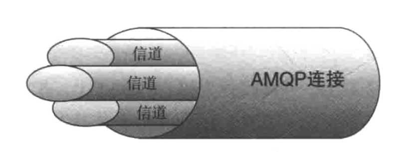
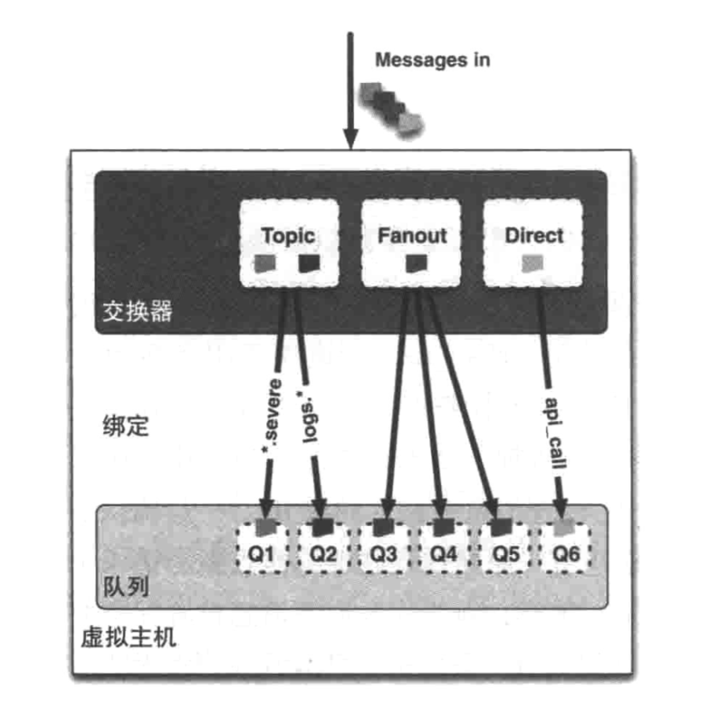

# RabbitMQ 知识

## 概述

　　官方地址：https://www.rabbitmq.com/

　　官方教程：https://www.rabbitmq.com/tutorials/tutorial-one-java.html

　　MQ 全称为 Message Queue，消息队列（MQ）是一种应用程序对应用程序的通信方法，也就是信息中间件。

　　RabbitMQ 则是 MQ 的一种开源实现，遵循 AMQP（高级消息队列协议）协议，特点是消息转发是非同步并且可靠的。

　　MQ 的模型：

　　RabbitMQ 比 MQ 模型有更加详细的模型概念：

　　RabbitMQ 主要用来处理应用程序之间消息的存储与转发，可让消费者和生产者解耦，消息是基于二进制的。

## 概念

### 信道

　　引入信道的原因：RabbitMQ 之间使用 TCP 连接，每次发布消息都要连接 TCP，这样会导致连接资源严重浪费，从而造成服务器性能瓶颈，所以引入信道，将需要发布消息的线程都包装成一条信道在 TCP 中传输，这样 RabbitMQ 为所有的线程只用一条 TCP 连接即可。

　　一条 TCP 连接可以支持多个信道，模型如下：

### 队列

　　消息队列用来保存消息直到发送给消费者。

　　它是消息的容器，也是消息的终点。

　　一个消息可投入一个或多个队列。

　　消息一直在队列里面，等待消费者连接到这个队列将其取走。

### 绑定

　　绑定用于消息队列和交换器之间的关联。

　　一个绑定就是基于路由键将交换器和消息队列连接起来的路由规则，所以可以将交换器理解成一个由绑定构成的路由表，如下：

### 交换器

　　向 RabbitMQ 发送消息，实际上是把消息发到交换器上，再由交换器根据相关路由规则发到特定队列上，在队列上监听的消费者就可以进行消费了。

　　目前 RabbitMQ 共有四种烈性：direct、fanot、topic、headers。

　　headers 匹配 AMOP 消息的 header 而不是路由键，而且 headers 交换器和 direct 交换器完全一直，但性能差很多，目前几乎用不到了。

#### direct 交换器

　　消息中的路由键（ routing key ）

#### fanout 交换器

#### topic 交换器

## 参考文章

