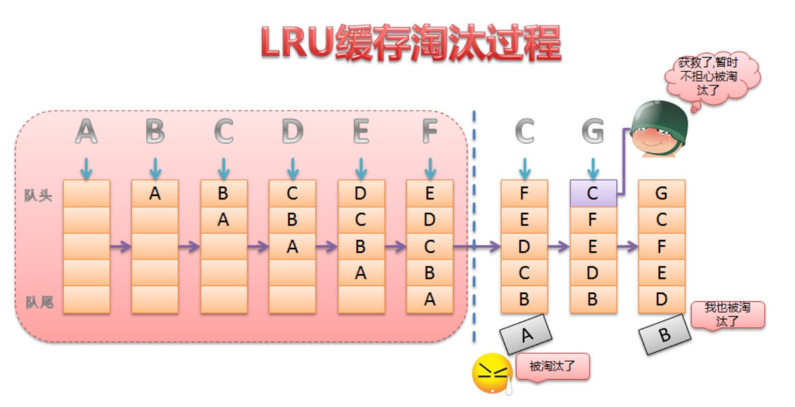

# LruCache 知识

## 1. Android 中的缓存策略

　　一般来说，缓存策略主要包含缓存的添加、获取和删除这三类操作。如何添加和获取缓存这个比较好理解，那么为什么还要删除缓存呢？这是因为不管是内存缓存还是硬盘缓存，它们的缓存大小都是有限的。当缓存满了之后，再想其添加缓存，这个时候就需要删除一些旧的缓存并添加新的缓存。

　　因此 LRU（Least Recently Used）缓存算法便应运而生，LRU 是近期最少使用的算法，它的核心思想是当缓存满时，会优先淘汰那些近期最少使用的缓存对象。采用 LRU 算法的缓存有两种：LruCache 和 DisLruCache，分别用于实现内存缓存和硬盘缓存，其核心思想都是 LRU 缓存算法。

## 2. LruCache 的使用

　　LruCache 是 Android 3.1 所提供的一个缓存类，所以在 Andriod 中可以直接使用 LruCache 实现内存缓存。而 DisLruCache 目前在 Android 还不是 Android SDK 的一部分，但 Android 官方文档推荐使用该算法来实现硬盘缓存。

### 2.1 LruCache 的介绍

　　LruCache 的使用非常简单，以图片缓存为例。

```java
 int maxMemory = (int) (Runtime.getRuntime().totalMemory()/1024);
        int cacheSize = maxMemory/8;
        mMemoryCache = new LruCache<String,Bitmap>(cacheSize){
            @Override
            protected int sizeOf(String key, Bitmap value) {
                return value.getRowBytes()*value.getHeight()/1024;
            }
        };
```

1. 设置 LruCache 缓存的大小，一般为当前进程可用容量的 1/8。
2. 重写 sizeOf 方法，计算出要缓存的每张图片的大小。

　　注意：缓存的总容量和每个缓存对象的大小所用单位要一致。

## 3. LruCache 的实现原理

　　LruCache 的核心思想很好理解，就是要维护一个缓存对象列表，其中对象列表的排列方式是按照访问顺序实现的，即一直没访问的对象，将放在对味，即将被淘汰。而最近访问的对象将放在对头，最后被淘汰。

　　如下图所示：



　　那么这个队列到底是由谁来维护的，是由 LinkedHashMap 来维护。

　　而  LinkedHashMap 是由数组 + 双向链表的数据结构来实现的。其中双向链表的结构可以实现访问顺序和插入顺序，使得 LinkedHashMap 中的 <key,value> 对按照一定顺序排列起来。

　　通过下面构造函数来指定 LinkedHashMap 中双向链表的结构是访问顺序还是插入顺序。

```java
public LinkedHashMap(int initialCapacity,
                         float loadFactor,
                         boolean accessOrder) {
        super(initialCapacity, loadFactor);
        this.accessOrder = accessOrder;
    }
```

　　其中 accessOrder 设置为 true 则为访问顺序，为 false ，则为插入顺序。

　　以具体例子解释，当设置为 true 时：

```java
public static final void main(String[] args) {
        LinkedHashMap<Integer, Integer> map = new LinkedHashMap<>(0, 0.75f, true);
        map.put(0, 0);
        map.put(1, 1);
        map.put(2, 2);
        map.put(3, 3);
        map.put(4, 4);
        map.put(5, 5);
        map.put(6, 6);
        map.get(1);
        map.get(2);

        for (Map.Entry<Integer, Integer> entry : map.entrySet()) {
            System.out.println(entry.getKey() + ":" + entry.getValue());

        }
    }
```

　　输出结果：

```java
0:0
3:3
4:4
5:5
6:6
1:1
2:2
```

　　即最近访问的最后输出，那么这就正好满足 LRU 缓存算法的思想。可见 LruCache 的实现就是利用了 LinkedHashMap 的这种数据结构。

　　查看 LruCache 的源码，查看怎么应用 LinkedHashMap 来实现缓存的添加、获得和删除的。

```java
 public LruCache(int maxSize) {
        if (maxSize <= 0) {
            throw new IllegalArgumentException("maxSize <= 0");
        }
        this.maxSize = maxSize;
        this.map = new LinkedHashMap<K, V>(0, 0.75f, true);
    }
```

　　从 LruCache 的构造函数中可以看到正是用了 LinkedHashMap 的访问顺序。

### 3.1. put() 方法


### 3.2. trimToSize() 方法


### 3.3. get() 方法


 

## 参考文章

[彻底解析 Android 缓存机制 -- LruCache](https://www.jianshu.com/p/b49a111147ee)