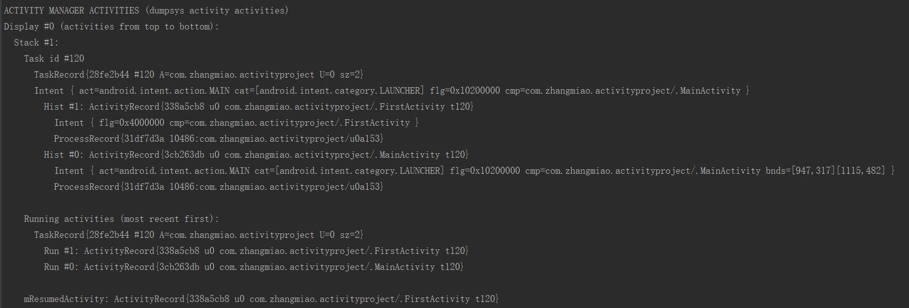
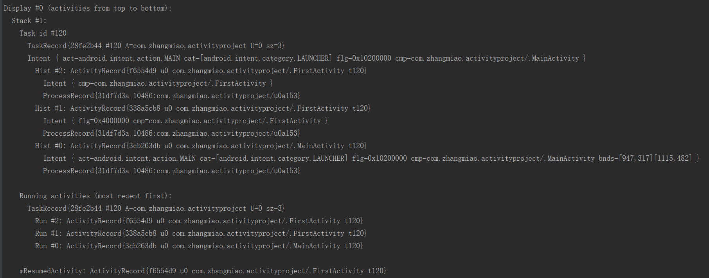
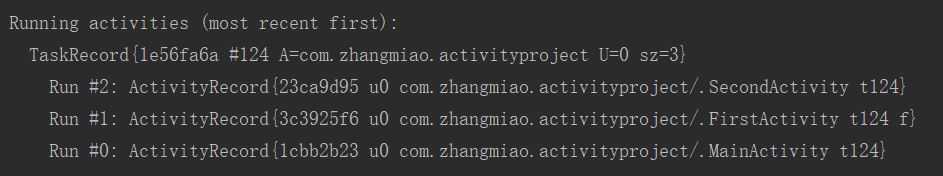
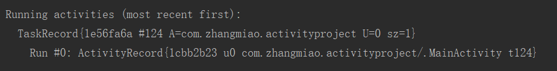

# Intent 的常用 flags 的实践验证

## 关于如何验证
　　创建一个 MainActivity 、 FirstActivity 与 SecondActivity 类，MainActivity 是项目的主界面，任何一个 Activity 都可以跳转包括自己的任意一个 Activiity ，通过在代码中跳转 FirstActivity 时设置 flag 。
　　通过执行 `adb shell dumpsys activity` 命令观察任务栈中 Activity 的入栈和出栈情况。
　　相关验证代码在：[activityproject](https://github.com/ZhangMiao147/ArticleProject/tree/master/activityproject)

## 设置方法
　　在使用 Intent 启动 Activity 时，通过使用 Intent.addFlags(int flags) 方法来设置，如下：
```
  Intent intent = new Intent(MainActivity.this, FirstActivity.class);
  intent.setFlags(Intent.FLAG_ACTIVITY_CLEAR_TASK);
  startActivity(intent);
```

## 常用 flag 的实践验证
#### FLAG_ACTIVITY_CLEAR_TASK & FLAG_ACTIVITY_NEW_TASK

#### FLAG_ACTIVITY_CLEAR_TOP
　　如果设置此标签，activity 已经在栈中，则不会启动 activity 的新实例，而是将栈中 activity 之上的 activities 进行出栈关闭，Intent 将被传递给旧的 activity 作为新的 Intent 。

* 设置 SecondActivity 跳转 FirstActivity 的 flag 为 FLAG_ACTIVITY_CLEAR_TOP。
* 打开应用 MainActivity，点击跳转 FirstActivity ，在 FirstActivity 界面跳转 SecondActivity 。

　　当前栈中情况是（从栈底到栈顶）：MainActivity -> FirstActivity -> SecondActivity。

* 在 SecondActivity 点击跳转 FirstActivity 。

　　当前栈中情况是（从栈底到栈顶）：MainActivity -> FirstActivity。当将标记设置为 FLAG_ACTIVITY_CLEAR_TOP 时，会将栈内 FirstActivity 上面的 SecondActivity 移除栈，然后复用栈内的 FirstActivity 。

* 在 FirstActivity 界面点击跳转 FirstActivity 。

　　当前栈中情况是（从栈底到栈顶）：MainActivity -> FirstActivity -> FirstActivity 。注意是在 FirstActivity 界面点击跳转的 FirstActivity ，在 FirstActivity 中跳转 FirstActivity 时并没有设置 flag 的值，使用的是默认值，所以会创建新的 activity 实例。

* 再继续在 FirstActivity 界面点击跳转 SecondActivity 。

　　当前栈中情况是（从栈底到栈顶）：MainActivity -> FirstActivity -> FirstActivity -> SecondActivity 。

* 再次在SecondActivity 点击跳转 FirstActivity 。

　　当前栈中情况是（从栈底到栈顶）：MainActivity -> FirstActivity -> FirstActivity 。这是会发现 FLAG_ACTIVITY_CLEAR_TOP 并不是找到栈中从栈底向上最近的 activity ，而是从栈顶开始找，找到 activity 就会返回。


#### FLAG_ACTIVITY_CLEAR_TOP & FLAG_ACTIVITY_NEW_TASK
　　如果被使用给栈的根 activity ，activity 会成为前台 activity，并且将其清除到根状态。这是特别有用的，比如，从通知管理器开启 activity 。


#### FLAG_ACTIVITY_MULTIPLE_TASK & FLAG_ACTIVITY_NEW_TASK 与 FLAG_ACTIVITY_MULTIPLE_TASK & FLAG_ACTIVITY_NEW_DOCUMENT
　　FLAG_ACTIVITY_MULTIPLE_TASK 用于创建新的 task ，并在 task 中启动 activity，此 flag 经常与 FLAG_ACTIVITY_NEW_DOCUMENT  或者 FLAG_ACTIVITY_NEW_TASK 一起使用。单独使用 FLAG_ACTIVITY_NEW_DOCUMENT 或 FLAG_ACTIVITY_NEW_TASK 时，会先从存在的栈中搜索匹配 Intent 的栈 ，如果没有栈被发现则创建新的栈。当与 FLAG_ACTIVITY_MULTIPLE_TASK 配合使用时，会跳过搜索匹配的栈而是直接开启一个新栈。
　　如果使用了 FLAG_ACTIVITY_NEW_TASK 就不要使用此标签，除非你启动的是应用的 launcher 。

#### FLAG_ACTIVITY_NO_HISTORY
　　如果设置此 flag ，则新的 activity 将不会保留在历史栈中。一旦用户离开它，activity 将结束。也可以通过 `android.R.styleable#AndroidManifestActivity_noHistory noHistory` 属性设置。
　　如果设置此 flag ，当前的 activity 启动一个新的 activity ，新的 activity 设置返回值并结束，但旧的 activity 的 onActivityResult() 不会被触发。

* 设置 MainActivity 跳转 FirstActivity 的 flag 为 FLAG_ACTIVITY_NO_HISTORY。
* 点击打开 MainActivity 。

　　当前栈中情况是（从栈底到栈顶）：MainActivity 。

* 在 MainActivity 界面跳转 FirstActivity 。

　　当前栈中情况是（从栈底到栈顶）：MainActivity -> FirstActivity。这时会发现加了 FLAG_ACTIVITY_NO_HISTORY 的 Activity 仍然会入栈。


* 在 FirstActivity 界面跳转 SecondActivity 。


　　当前栈中情况是（从栈底到栈顶）：MainActivity -> FirstActivity -> SecondActivity。就算离开了 FirstActivity 进入到 SecondActivity ，FristActivity 依然在栈内。但是还会打印一个信息就是 FirstActivity 在等待被结束。

* 在 SecondActivity 界面点击返回键。

　　当前栈中情况是（从栈底到栈顶）：MainActivity。点击返回键之后，界面直接回到了 MainActivity 。并没有回到 FirstActivity 界面。

* 在 MainActivity 跳转到 FirstActivity ，按下 home 键，让应用进入后台，然后再从后台点击应用进入。

　　当前栈中情况是（从栈底到栈顶）：MainActivity。应用在恢复时也没有回到 FirstActivity ，而是恢复到了 MainActivity 界面。

#### FLAG_ACTIVITY_NO_ANIMATION
　　如果在 Context.startActivity 给 Intent 设置这个标签，将不会展示系统在 activity 从当前状态跳转到下一个 activity 的切换动画。

* 设置 MainActivity 跳转 FirstActivity 的 flag 为 FLAG_ACTIVITY_NO_ANIMATION。
* 查看从 MainActivity 跳转 FirstActivity 时的动画显示、FirstActivity 按 back 键返回 MainActivity 的动画显示以及 FirstActivty 跳转 FirstActivity 的动画显示。
　　从 MainActivity 跳转 FirstActivity 时的动画并没有显示，FirstActivity 按 back 键返回 MainActivity 的动画显示正常，FirstActivty 跳转 FirstActivity 的动画显示正常。说明 FLAG_ACTIVITY_NO_ANIMATION 标签只能阻碍 startActivity 的动画，之后的返回与其他地方的 startActivity 并不会受到影响。


## 参考文章：
1. [Intent.addFlags() 启动Activity的20种flags全解析](https://blog.csdn.net/blueangle17/article/details/79712229)