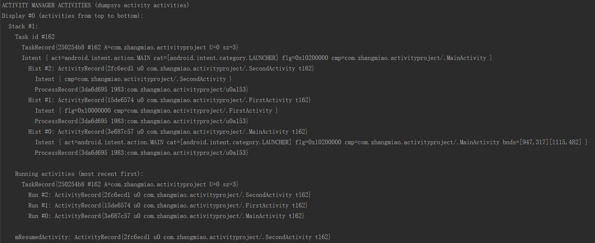
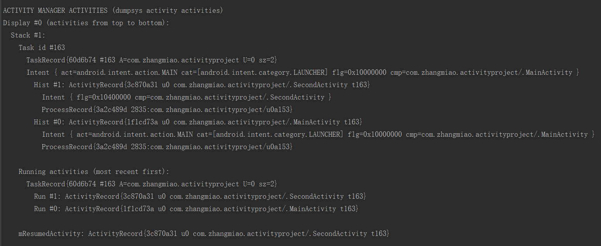
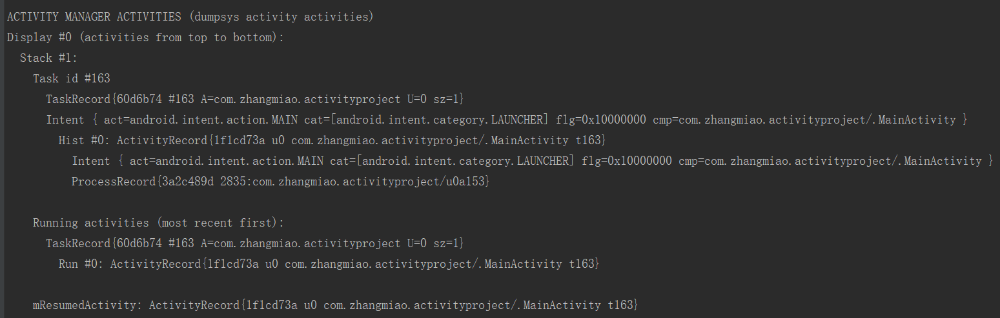

# Activity 四种 launchMode 的实践验证


## 如何设置 Activity 的启动模式
　　在 AndroidManidest.xml 中设置 Activity 的启动模式非常简单，直接在想要设置的 Activity 中添加 `android:launchMode=""` 属性即可，`android:launchMode=""` 属性有四个可供选择的值，分别是 `standard`、`singleTop`、`singTask` 与 `singleInstance`，这四个值分别对应四种启动模式：标准模式、栈顶复用、栈内复用与单例模式。
　　例如，设置 Activity 的启动模式为 `singleTop` ,在 AndroidManifest.xml 中应该是：
```
   <activity
            android:name=".FirstActivity"
            android:launchMode="singleTop" />
```

## 如何严重使用 launchMode
　　通过执行 `adb shell dumpsys activity` 命令观察任务栈中 Activity 的入栈和出栈情况。
　　创建 MainActivity 、 FirstActivity 与 SecondActivity 三个 Activity ，任何一个 Activity 都可以跳转包括自己的任意一个 Activiity ，通过设置 FirstActivity 的启动模式，来观察任务栈的情况。
** MainActivity.java **
```
package com.zhangmiao.activityproject;

import android.content.DialogInterface;
import android.content.Intent;
import android.os.Bundle;
import android.support.v7.app.AlertDialog;
import android.support.v7.app.AppCompatActivity;
import android.util.Log;
import android.view.View;
import android.widget.EditText;
import android.widget.TextView;

public class MainActivity extends AppCompatActivity implements View.OnClickListener {

    private static final String TAG = MainActivity.class.getSimpleName();

    @Override
    protected void onCreate(Bundle savedInstanceState) {
        super.onCreate(savedInstanceState);
        setContentView(R.layout.activity_main);
		       findViewById(R.id.goto_main_activity).setOnClickListener(this);
        findViewById(R.id.goto_first_activity).setOnClickListener(this);
        findViewById(R.id.goto_second_activity).setOnClickListener(this);
    }

    @Override
    public void onClick(View view) {
        switch (view.getId()) {
		      case R.id.goto_main_activity:
                Intent mainIntent = new Intent(MainActivity.this, MainActivity.class);
                startActivity(mainIntent);
                break;
            case R.id.goto_first_activity:
                Intent intent = new Intent(MainActivity.this, FirstActivity.class);
                startActivity(intent);
                break;
            case R.id.goto_second_activity:
                Intent DialogIntent = new Intent(MainActivity.this, SecondActivity.class);
                startActivity(DialogIntent);
                break;
            default:
                break;
        }
    }
}
```
** FirstActivity.java **
```
package com.zhangmiao.activityproject;

import android.content.Intent;
import android.os.Bundle;
import android.support.v7.app.AppCompatActivity;
import android.util.Log;
import android.view.View;

public class FirstActivity extends AppCompatActivity implements View.OnClickListener {

    private static final String TAG = FirstActivity.class.getSimpleName();

    @Override
    protected void onCreate(Bundle savedInstanceState) {
        super.onCreate(savedInstanceState);
        setContentView(R.layout.activity_first);
        findViewById(R.id.goto_main_activity).setOnClickListener(this);
        findViewById(R.id.goto_first_activity).setOnClickListener(this);
        findViewById(R.id.goto_second_activity).setOnClickListener(this);
        Log.d(TAG, "onCreate()");
    }

    @Override
    public void onClick(View view) {
        switch (view.getId()) {
            case R.id.goto_main_activity:
                Intent mainIntent = new Intent(MainActivity.this, MainActivity.class);
                startActivity(mainIntent);
                break;
            case R.id.goto_first_activity:
                Intent intent = new Intent(MainActivity.this, FirstActivity.class);
                startActivity(intent);
                break;
            case R.id.goto_second_activity:
                Intent secondIntent = new Intent(MainActivity.this, SecondActivity.class);
                startActivity(secondIntent);
                break;
            default:
                break;
        }
    }
}

```
** SecondActivity.java **
```
package com.zhangmiao.activityproject;

import android.content.Intent;
import android.os.Bundle;
import android.support.v7.app.AppCompatActivity;
import android.util.Log;
import android.view.View;

public class SecondActivity extends AppCompatActivity implements View.OnClickListener{

    private static final String TAG = SecondActivity.class.getSimpleName();

    @Override
    protected void onCreate(Bundle savedInstanceState) {
        super.onCreate(savedInstanceState);
        setContentView(R.layout.activity_second);
        findViewById(R.id.goto_main_activity).setOnClickListener(this);
        findViewById(R.id.goto_first_activity).setOnClickListener(this);
        findViewById(R.id.goto_second_activity).setOnClickListener(this);
        Log.d(TAG, "onCreate()");
    }

    @Override
    protected void onRestart() {
        super.onRestart();
        Log.d(TAG, "onRestart()");
    }

    @Override
    protected void onStart() {
        super.onStart();
        Log.d(TAG, "onStart()");
    }

    @Override
    protected void onResume() {
        super.onResume();
        Log.d(TAG, "onResume()");
    }

    @Override
    protected void onPause() {
        super.onPause();
        Log.d(TAG, "onPause()");
    }

    @Override
    protected void onStop() {
        super.onStop();
        Log.d(TAG, "onStop()");
    }

    @Override
    protected void onDestroy() {
        super.onDestroy();
        Log.d(TAG, "onDestroy()");
    }

    @Override
    public void onClick(View view) {
        switch (view.getId()) {
            case R.id.goto_main_activity:
                Intent mainIntent = new Intent(SecondActivity.this, MainActivity.class);
                startActivity(mainIntent);
                break;
            case R.id.goto_first_activity:
                Intent firstIntent = new Intent(SecondActivity.this, FirstActivity.class);
                startActivity(firstIntent);
                break;
            case R.id.goto_second_activity:
                Intent secondIntent = new Intent(SecondActivity.this, SecondActivity.class);
                startActivity(secondIntent);
                break;
            default:
                break;
        }
    }
}

```

** activity_main.xml **
```
<?xml version="1.0" encoding="utf-8"?>
<LinearLayout xmlns:android="http://schemas.android.com/apk/res/android"
    android:layout_width="match_parent"
    android:layout_height="match_parent"
    android:orientation="vertical">

    <TextView
        android:id="@+id/main_activity_message_tv"
        android:layout_width="wrap_content"
        android:layout_height="wrap_content"
        android:freezesText="true"
        android:text="这是 MainActivity" />

    <Button
        android:id="@+id/goto_main_activity"
        android:layout_width="wrap_content"
        android:layout_height="wrap_content"
        android:text="跳转MainActivity" />

    <Button
        android:id="@+id/goto_first_activity"
        android:layout_width="wrap_content"
        android:layout_height="wrap_content"
        android:text="跳转firstActivity" />

    <Button
        android:id="@+id/goto_second_activity"
        android:layout_width="wrap_content"
        android:layout_height="wrap_content"
        android:text="跳转SecondActivity" />
</LinearLayout>

```
** activity_first.xml **
```
<?xml version="1.0" encoding="utf-8"?>
<LinearLayout xmlns:android="http://schemas.android.com/apk/res/android"
    android:layout_width="match_parent"
    android:layout_height="match_parent"
    android:orientation="vertical">

    <TextView
        android:layout_width="wrap_content"
        android:layout_height="wrap_content"
        android:text="这是 FirstActivity" />

    <Button
        android:id="@+id/goto_main_activity"
        android:layout_width="wrap_content"
        android:layout_height="wrap_content"
        android:text="跳转MainActivity" />

    <Button
        android:id="@+id/goto_first_activity"
        android:layout_width="wrap_content"
        android:layout_height="wrap_content"
        android:text="跳转FirstActivity" />

    <Button
        android:id="@+id/goto_second_activity"
        android:layout_width="wrap_content"
        android:layout_height="wrap_content"
        android:text="跳转SecondActivity" />
</LinearLayout>

```
** activity_second.xml **
```
<?xml version="1.0" encoding="utf-8"?>
<LinearLayout xmlns:android="http://schemas.android.com/apk/res/android"
    android:layout_width="match_parent"
    android:layout_height="match_parent"
    android:orientation="vertical">

    <TextView
        android:layout_width="wrap_content"
        android:layout_height="wrap_content"
        android:text="这是 SecondActivity" />

    <Button
        android:id="@+id/goto_main_activity"
        android:layout_width="wrap_content"
        android:layout_height="wrap_content"
        android:text="跳转MainActivity" />

    <Button
        android:id="@+id/goto_first_activity"
        android:layout_width="wrap_content"
        android:layout_height="wrap_content"
        android:text="跳转FirstActivity" />

    <Button
        android:id="@+id/goto_second_activity"
        android:layout_width="wrap_content"
        android:layout_height="wrap_content"
        android:text="跳转SecondActivity" />

</LinearLayout>

```
** AndroidMainfest.xml **
```
<?xml version="1.0" encoding="utf-8"?>
<manifest xmlns:android="http://schemas.android.com/apk/res/android"
    package="com.zhangmiao.activityproject">

    <application
        android:allowBackup="true"
        android:icon="@mipmap/ic_launcher"
        android:label="@string/app_name"
        android:roundIcon="@mipmap/ic_launcher_round"
        android:supportsRtl="true"
        android:theme="@style/AppTheme">
        <activity
            android:name=".MainActivity"
            android:configChanges="orientation|screenSize">
            <intent-filter>
                <action android:name="android.intent.action.MAIN" />

                <category android:name="android.intent.category.LAUNCHER" />
            </intent-filter>
        </activity>
        <activity
            android:name=".FirstActivity"
            android:launchMode="standard" />
        <activity android:name=".SecondActivity" />
    </application>

</manifest>
```

## 初始任务栈情况

　　打开应用，显示 MainActivity 之后的任务栈如下：

　　从图中可以看到应用刚打开是，任务栈里只有一个 MainActivity 。

## standard(标准模式)
　　Activity 的默认启动模式，只要启动 Activity 就会创建一个新实例，并将该 Activity 添加到当前 Task 栈中。

* 在 MainActivity 中点击跳转 FirstActivity ，然后在 FirstActivity 中点击跳转 FirstActivity ，任务栈情况:

　　从图中可以看出任务栈中有 MainActiivty 、 FirstActivity 与 FirstActivity ，操作点击打开了两次 FirstActivity ，FirstActvity 的启动模式是 standard ，所以任务栈中就会有两个 FirstActivity 。

## singleTop(栈顶复用)
　　在这种启动模式下，首先会判断要启动的活动是否已经存在于栈顶，如果是的话就不创建新实例，直接复用栈顶活动。如果要启动的活动不位于栈顶或在栈中或在栈中无实例，则会创建新实例入栈。

* 将 FirstActivity 的启动模式修改为 singleTop 。

** AndroidMainfest.xml **

```
<?xml version="1.0" encoding="utf-8"?>
<manifest xmlns:android="http://schemas.android.com/apk/res/android"
    package="com.zhangmiao.activityproject">

    <application
        ...>
        ...
        <activity
            android:name=".FirstActivity"
            android:launchMode="singleTop" />
        ...
    </application>

</manifest>
```

* 在 MainActivity 中点击跳转 FirstActivity ，然后在 FirstActivity 中点击跳转 FirstActivity ，任务栈情况（操作和标准模式相同）:


　　从图中可以看到，在和 standard 模式下一样操作的情况下，栈内只有 MainActivity 与 FirstActivity ,这是 FirstActivity 的启动模式是 singTop ,在 MainActivity 点击跳转 FirstActivity 之后，FirstActivity 就位于栈顶，当 FirstActivity 再跳转 FirstActivity 时，发现 FirstActivity 在栈顶，所以就直接复用了栈顶的 FirstActivity 。

## singleTask(栈内复用)

　　这种模式比较复杂，是一种栈内单例模式，当一个 activity 启动时，会进行两次判断：
（1） 首先会寻找是否有这个活动需要的任务栈，如果没有就创建这个任务栈并将活动入栈，如果有的话就进入下一步判断。
（2） 第二次判断这个栈中是否存在该 activity 的实例，如果不存在就新建 activity 入栈，如果存在的话就直接复用，并且带有 clearTop 效果，会将该实例上方的所有活动全部出栈，令这个 activity 位于栈顶。
　　这种模式会保证 Activity 在所需要的栈内只有一个或者没有。

* 将 FirstActivity 的启动模式修改为 singleTask 。

** AndroidMainfest.xml **
```
<?xml version="1.0" encoding="utf-8"?>
<manifest xmlns:android="http://schemas.android.com/apk/res/android"
    package="com.zhangmiao.activityproject">

    <application
        ...>
        ...
        <activity
            android:name=".FirstActivity"
            android:launchMode="singleTask" />
        ...
    </application>

</manifest>
```

* 在 MainActivity 中点击跳转 FirstActivity ，然后在 FirstActivity 中点击跳转 SecondActivity ，任务栈情况:

　　在经过上面的操作之后，任务栈中从栈顶到栈底的依次是 SecondActivity -> FirstActivity -> MainActivity 。

* 在上面的操作基础上，在 SecondActivity 中点击跳转 FirstActivity ，任务栈情况：

　　在 SecondActivity 中点击跳转 FirstActivity 之后，任务栈中从栈顶到栈底的依次是 FirstActivity -> MainActivity ，SecondActivity 并没有在任务栈中了，FirstActivity 在栈中也只有一个。在把 FirstActivity 的启动模式设置为 SingleTask ，当 SecondActivity 跳转到 FirstActivity 时，任务栈中已经有 FirstActivity 了，就会复用栈内的 FirstActivity ，并将栈内 FirstActivity 上面的 Activity 出栈。

## singleInstance(单例模式)
　　这种模式是真正的单例模式，以这种模式启动的活动会单独创建一个任务栈，并且依然遵循栈内复用的特性，保证了这个栈中只能存在这一个活动。并且系统不会在这个单例模式的 Activity 的实例所在 task 中启动任何其他的 Activity 。单例模式的 Activity 的实例永远是这个 task 中的唯一一个成员。

* 将 FirstActivity 的启动模式修改为 singleInstance 。

** AndroidMainfest.xml **
```
<?xml version="1.0" encoding="utf-8"?>
<manifest xmlns:android="http://schemas.android.com/apk/res/android"
    package="com.zhangmiao.activityproject">

    <application
        ...>
        ...
        <activity
            android:name=".FirstActivity"
            android:launchMode="singleInstance" />
        ...
    </application>

</manifest>
```

* 在 MainActivity 中点击跳转 FirstActivity ，然后在 FirstActivity 中点击跳转 SecondActivity ，任务栈情况:

　　在经过上面的操作之后，任务栈中从栈顶到栈底的依次是 SecondActivity -> FirstActivity -> MainActivity 。注意，图中的 task id ,会发现 MainActivity 与 SecondActivity 的 task id 是相同的，而 SecondActivity 的 task id 与其他的不同。

* 在上面的操作基础上，在 SecondActivity 中点击跳转 FirstActivity ，任务栈情况：

　　在 SecondActivity 中点击跳转 FirstActivity 之后，栈与操作之前的情况相同。在将 firstActivity 的启动模式设置为 singleInstance 时，调用 FirstActivity 时，就会从 FirstActivity 所在的栈中取出 FirstActivity ，也不会在 FirstActivity 所在的栈中再次将 FirstActivity 入栈。

* 在上面的操作基础上，在 FirstActivity 界面点击返回键，任务栈情况：

　　在 FirstActivity 界面点击返回键之后，FirstActivity 所在栈没有了，只剩下一个栈，栈中依旧是 SecondActivity 与 ManiActivity 。

* 在上面的操作基础上，在 SecondActivity 界面点击返回键，任务栈情况：

　　在 SecondActivity 界面点击返回键之后，栈中只剩下 MainActivity ，界面也回到 MainActivity 。
