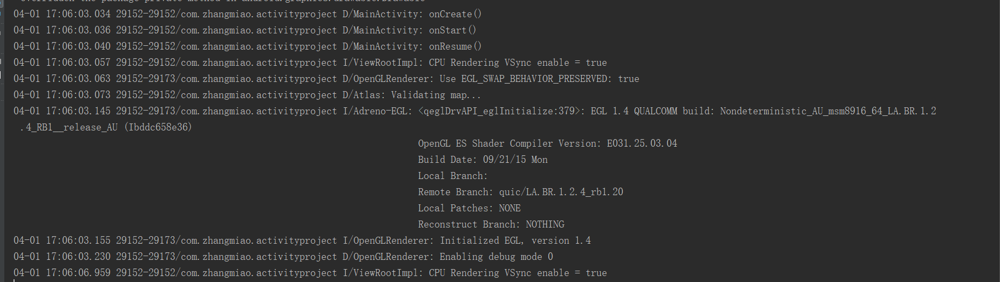
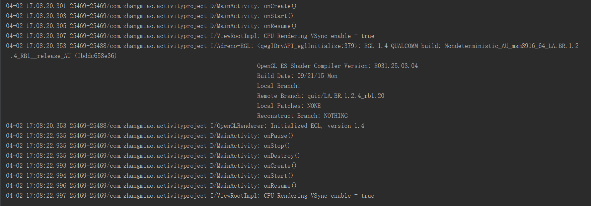
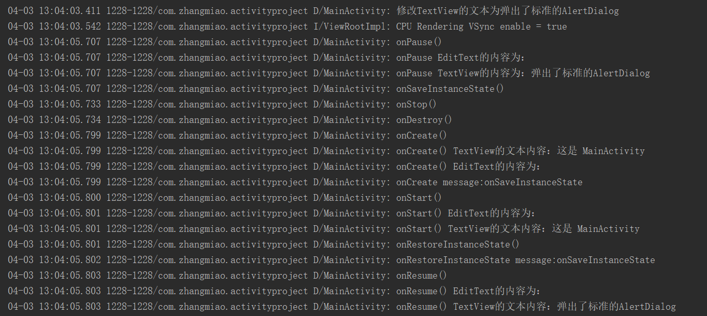
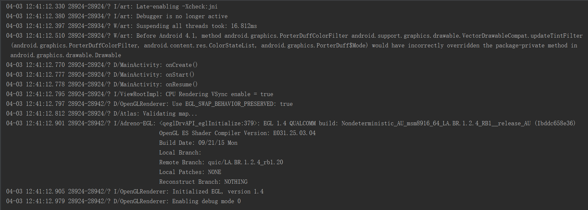

# Activity 关于生命周期一些问题的实践验证

## 1. 正常情况下的生命周期
　　写一个 MainActivity 类，来观察 Activity 的生命周期方法的调用。

** MainActivity.java **
```
package com.zhangmiao.activityproject;

import android.os.Bundle;
import android.support.v7.app.AppCompatActivity;
import android.util.Log;

public class MainActivity extends AppCompatActivity {

    private static final String TAG = MainActivity.class.getSimpleName();

    @Override
    protected void onCreate(Bundle savedInstanceState) {
        super.onCreate(savedInstanceState);
        setContentView(R.layout.activity_main);
        Log.d(TAG, "onCreate()");
    }

    @Override
    protected void onRestart() {
        super.onRestart();
        Log.d(TAG, "onRestart()");
    }

    @Override
    protected void onStart() {
        super.onStart();
        Log.d(TAG, "onStart()");
    }

    @Override
    protected void onResume() {
        super.onResume();
        Log.d(TAG, "onResume()");
    }

    @Override
    protected void onPause() {
        super.onPause();
        Log.d(TAG, "onPause()");
    }

    @Override
    protected void onStop() {
        super.onStop();
        Log.d(TAG, "onStop()");
    }

    @Override
    protected void onDestroy() {
        super.onDestroy();
        Log.d(TAG, "onDestroy()");
    }
}
```

** activity_main.xml **
```
<?xml version="1.0" encoding="utf-8"?>
<LinearLayout xmlns:android="http://schemas.android.com/apk/res/android"
    android:layout_width="match_parent"
    android:layout_height="match_parent"
    android:orientation="vertical">

    <TextView
        android:layout_width="wrap_content"
        android:layout_height="wrap_content"
        android:text="这是 MainActivity" />

</LinearLayout>
```

* 点击应用到界面显示出来的生命周期

　　第一次打开 MainActivity ，调用了 onCreate() -> onStart() -> onResume() 方法。

* 在显示界面点击返回键退出的生命周期

　　关闭 MainActivity ，调用了 onPause() -> onStop() -> onDestory() 方法。

## 2. 由活动A启动活动B时。活动A的 onPause() 与活动B的 onResume() 哪一个先执行？
* 在 MainActivity 界面中添加一个按钮，点击按钮跳转 FirstActivity 界面。

** activity_main.xml **
```
<?xml version="1.0" encoding="utf-8"?>
<LinearLayout xmlns:android="http://schemas.android.com/apk/res/android"
    android:layout_width="match_parent"
    android:layout_height="match_parent"
    android:orientation="vertical">

	...

    <Button
        android:id="@+id/goto_first_activity"
        android:layout_width="wrap_content"
        android:layout_height="wrap_content"
        android:text="跳转firstActivity" />

</LinearLayout>
```

**MainActivity.java**
```
    @Override
    protected void onCreate(Bundle savedInstanceState) {
        super.onCreate(savedInstanceState);
        setContentView(R.layout.activity_main);
        findViewById(R.id.goto_first_activity).setOnClickListener(this);
        Log.d(TAG, "onCreate()");
    }
	...
	@Override
    public void onClick(View view) {
        switch (view.getId()) {
            case R.id.goto_first_activity:
                Log.d(TAG, "跳转FirstActivity");
                Intent intent = new Intent(MainActivity.this, FirstActivity.class);
                startActivity(intent);
                break;
            default:
                break;
        }
    }
```

**activity_first.xml**
```
<?xml version="1.0" encoding="utf-8"?>
<LinearLayout xmlns:android="http://schemas.android.com/apk/res/android"
    android:layout_width="match_parent"
    android:layout_height="match_parent"
    android:orientation="vertical">

    <TextView
        android:layout_width="wrap_content"
        android:layout_height="wrap_content"
        android:text="这是 FirstActivity" />

</LinearLayout>
```

**FirstActivity.xml**
```
package com.zhangmiao.activityproject;

import android.os.Bundle;
import android.support.v7.app.AppCompatActivity;
import android.util.Log;

public class FirstActivity extends AppCompatActivity {

    private static final String TAG = FirstActivity.class.getSimpleName();

    @Override
    protected void onCreate(Bundle savedInstanceState) {
        super.onCreate(savedInstanceState);
        setContentView(R.layout.activity_first);
        Log.d(TAG, "onCreate()");
    }

    @Override
    protected void onRestart() {
        super.onRestart();
        Log.d(TAG, "onRestart()");
    }

    @Override
    protected void onStart() {
        super.onStart();
        Log.d(TAG, "onStart()");
    }

    @Override
    protected void onResume() {
        super.onResume();
        Log.d(TAG, "onResume()");
    }

    @Override
    protected void onPause() {
        super.onPause();
        Log.d(TAG, "onPause()");
    }

    @Override
    protected void onStop() {
        super.onStop();
        Log.d(TAG, "onStop()");
    }

    @Override
    protected void onDestroy() {
        super.onDestroy();
        Log.d(TAG, "onDestroy()");
    }
}
```

* 创建两个 Activity ，由 MainActivity 跳转到 FirstAcivity ，运行结果如下：


　　可以看到，是 MainActivity 先执行了 onPause() ， FirstActivity 的 onResume() 后执行的。

* 点击返回看一下执行的顺序：


　　点击返回后，可以看到是 FirstActivity 的 onPause() 先执行，MainActivity 的 onResume() 后执行。

　　所以，当活动 A 启动活动B时，是活动 A 的 onPause() 方法先执行，活动 B 的 onResume() 方法后执行。

## 3.dialog 是否会对生命周期产生影响？

　　查看 Activity 声明周期的描述，如果 Activity 不在前台，且并非完全不可见时， Activity 就会处在 onPause() 的暂停状态。但是事实如何，用代码说话，测试三种情况：一，弹出标准的 AlertDialog ；二，弹出全屏的 AlertDialog ；三，弹出主题为 Theme.AppCompat.Dialog 的 Activity ，查看这三种情况下的生命周期的变化：

#### 弹出标准的 AlertDialog

* 在 MainActivity 的布局中添加一个弹出标准 AlertDialog 的按钮，用于观察 MainActivity 在弹出 AlertDialog 和隐藏 AlertDialog 的情况下的生命周期变化。

**activity_main.xml**
```
<?xml version="1.0" encoding="utf-8"?>
<LinearLayout xmlns:android="http://schemas.android.com/apk/res/android"
    android:layout_width="match_parent"
    android:layout_height="match_parent"
    android:orientation="vertical">

    ...

    <Button
        android:id="@+id/show_standard_alert_dialog"
        android:layout_width="wrap_content"
        android:layout_height="wrap_content"
        android:text="弹出标准的AlertDialog" />

</LinearLayout>
```

**MainActivity.java**
```
    @Override
    protected void onCreate(Bundle savedInstanceState) {
        ...
        findViewById(R.id.show_standard_alert_dialog).setOnClickListener(this);
    }
	...
	@Override
    public void onClick(View view) {
        switch (view.getId()) {
            ...
            case R.id.show_standard_alert_dialog:
                AlertDialog.Builder builder = new AlertDialog.Builder(MainActivity.this);
                builder.setTitle("这是一个标准的AlertDialog");
                builder.setPositiveButton("确定", new DialogInterface.OnClickListener() {
                    @Override
                    public void onClick(DialogInterface dialog, int which) {
                        dialog.dismiss();
                    }
                });
                AlertDialog alertDialog = builder.create();
                alertDialog.show();
                break;
            default:
                break;
        }
    }
```

* 点击弹出标准 AlertDialog 的生命周期的运行

　　可以看到弹出标准的 AlertDialog 并不会对 MainActivity 的生命周期有任何的影响。

* 点击 AlertDialog 的“确定”按钮，对 AlertDialog 进行隐藏，观察 MainActivity 的生命周期的变化
　　点击 AlertDialog 的“确定”按钮后，看到没有任何的日志打印出来，所有隐藏标准 AlertDialog 也不会对 MainActivity 的生命周期有任何的影响。

#### 弹出全屏的 AlertDialog

* 在 MainActivity 的布局中添加一个弹出全屏 AlertDialog 的按钮，用于观察 MainActivity 在弹出全屏 AlertDialog 和隐藏全屏 AlertDialog 的情况下的生命周期变化。

**activity_main.xml**

```
<?xml version="1.0" encoding="utf-8"?>
<LinearLayout xmlns:android="http://schemas.android.com/apk/res/android"
    android:layout_width="match_parent"
    android:layout_height="match_parent"
    android:orientation="vertical">

    ...

    <Button
        android:id="@+id/show_full_alert_dialog"
        android:layout_width="wrap_content"
        android:layout_height="wrap_content"
        android:text="弹出全屏的AlertDialog" />

</LinearLayout>
```

**全屏 AlertDialog 的 style**
```
    <style name="Dialog_Fullscreen">
        <item name="android:windowFullscreen">true</item>
        <item name="android:windowNoTitle">true</item>
        <item name="windowActionBar">false</item>
        <item name="android:windowCloseOnTouchOutside">true</item>
    </style>
```

**Activity_main.java**
```
    @Override
    protected void onCreate(Bundle savedInstanceState) {
        ...
        findViewById(R.id.show_full_alert_dialog).setOnClickListener(this);
    }
	...
	@Override
    public void onClick(View view) {
        switch (view.getId()) {
            ...
            case R.id.show_full_alert_dialog:
                AlertDialog.Builder fullBuilder = new AlertDialog.Builder(MainActivity.this, R.style.Dialog_Fullscreen);
                fullBuilder.setTitle("这是一个全屏的AlertDialog");
                fullBuilder.setPositiveButton("确定", new DialogInterface.OnClickListener() {
                    @Override
                    public void onClick(DialogInterface dialog, int which) {
                        dialog.dismiss();
                    }
                });
                AlertDialog fullAlertDialog = fullBuilder.create();
                fullAlertDialog.show();
				break;
            default:
                break;
        }
    }
```

* 点击弹出全屏 AlertDialog 的生命周期的运行

　　可以看到弹出全屏的 AlertDialog 并不会对 MainActivity 的生命周期有任何的影响。

* 点击 AlertDialog 的“确定”按钮，对 AlertDialog 进行隐藏，观察 MainActivity 的生命周期的变化
　　点击 AlertDialog 的“确定”按钮后，看到没有任何的日志打印出来，所有隐藏全屏 AlertDialog 也不会对 MainActivity 的生命周期有任何的影响。

#### 跳转主题为 Theme.AppCompat.Dialog 的 Activity

* 在 MainActivity 的布局中添加一个跳转主题为 Theme.AppCompat.Dialog 的 Activity 的按钮，用于观察 MainActivity 在跳转主题为 Theme.AppCompat.Dialog 的 Activity 和从 主题为 Theme.AppCompat.Dialog 的 Activity 返回的情况下的生命周期变化。

**activity_main.xml**

```
<?xml version="1.0" encoding="utf-8"?>
<LinearLayout xmlns:android="http://schemas.android.com/apk/res/android"
    android:layout_width="match_parent"
    android:layout_height="match_parent"
    android:orientation="vertical">

    ...

    <Button
        android:id="@+id/goto_dialog_activity"
        android:layout_width="wrap_content"
        android:layout_height="wrap_content"
        android:text="弹出主题为Dialog的Activity" />

</LinearLayout>
```

**DialogActivity**
```
package com.zhangmiao.activityproject;

import android.os.Bundle;
import android.support.v7.app.AppCompatActivity;
import android.util.Log;

public class DialogActivity extends AppCompatActivity {

    private static final String TAG = DialogActivity.class.getSimpleName();

    @Override
    protected void onCreate(Bundle savedInstanceState) {
        super.onCreate(savedInstanceState);
        setContentView(R.layout.activity_dialog);
        Log.d(TAG, "onCreate()");
    }

    @Override
    protected void onRestart() {
        super.onRestart();
        Log.d(TAG, "onRestart()");
    }

    @Override
    protected void onStart() {
        super.onStart();
        Log.d(TAG, "onStart()");
    }

    @Override
    protected void onResume() {
        super.onResume();
        Log.d(TAG, "onResume()");
    }

    @Override
    protected void onPause() {
        super.onPause();
        Log.d(TAG, "onPause()");
    }

    @Override
    protected void onStop() {
        super.onStop();
        Log.d(TAG, "onStop()");
    }

    @Override
    protected void onDestroy() {
        super.onDestroy();
        Log.d(TAG, "onDestroy()");
    }
}
```

**activity_dialog**
```
<?xml version="1.0" encoding="utf-8"?>
<LinearLayout xmlns:android="http://schemas.android.com/apk/res/android"
    android:layout_width="match_parent"
    android:layout_height="match_parent"
    android:orientation="vertical">
    <TextView
        android:layout_width="wrap_content"
        android:layout_height="wrap_content"
        android:text="Theme 为 Dialog 的 Activity" />
</LinearLayout>
```
**在AndroidManifest.xml中设置DialogActivity的主题为Dialog**
```
<?xml version="1.0" encoding="utf-8"?>
<manifest xmlns:android="http://schemas.android.com/apk/res/android"
    package="com.zhangmiao.activityproject">

    <application
        ...>
        ...
        <activity
            android:name=".DialogActivity"
            android:theme="@style/Theme.AppCompat.Dialog" />
    </application>

</manifest>
```
**Activity_main.java**
```
    @Override
    protected void onCreate(Bundle savedInstanceState) {
        ...
        findViewById(R.id.goto_dialog_activity).setOnClickListener(this);
    }
	...
	@Override
    public void onClick(View view) {
        switch (view.getId()) {
            ...
            case R.id.goto_dialog_activity:
                Intent DialogIntent = new Intent(MainActivity.this, DialogActivity.class);
                startActivity(DialogIntent);
				break;
            default:
                break;
        }
    }
```

* 跳转主题为 Dialog 的 Activity 的生命周期变化

　　可以看到跳转主题为 Dialog 的 Activity 会对 MainActivity 的生命周期产生影响，生命周期的变化与跳转 Activity 的变化相同。

* 在主题为 Dialog 的 Activity 下点击返回键的生命周期变化

　　在主题为 Dialog 的 Activity 下点击返回键，返回到 MainActivity 的界面，从运行结果可以看出，与跳转 Activity 之后返回的声明周期变化不同，MainActivity 只调用了 onResume() 方法，并没有调用 onRestart() 与 onStart() 两个方法，DialogActivity 调用 onPause()、onStop() 与 onDestory() 方法。


## MainActivity 在横竖屏切换时生命周期变化的过程：
　　

## 低优先级 Activity 由于内存不足被杀死
* 模拟内存不足杀死应用：先打开应用，然后按 home 键，使应用进入后台，然后使用命令 `adb shell am kill 包名`将应用杀死。
* 从打开应用到杀死应用的生命周期变化如下：

　　在按 home 键之后，MainActivty 调用了 onPause() 与 onStop() 方法，并没有调用 onDestory() 方法，所以主进程现在属于后台进程。
* 然后在点击应用的图标，打开应用，生命周期变化如下：

　　可以看到 MainActivity 调用了 onCreate()、onStart() 和 onResume() 方法，Activity 重新创建了。

##### 数据保存

* 在 MainActivity 中覆盖 onSaveInstanceState 和 onRestoreInstanceState 两个方法：
**MainActivity.java**
```
...
public class MainActivity extends AppCompatActivity implements View.OnClickListener {
	...
    @Override
    protected void onSaveInstanceState(Bundle outState) {
        Log.d(TAG, "onSaveInstanceState()");
        super.onSaveInstanceState(outState);
        outState.putString("message", "onSaveInstanceState");
    }

    @Override
    protected void onRestoreInstanceState(Bundle savedInstanceState) {
        Log.d(TAG, "onRestoreInstanceState()");
        super.onRestoreInstanceState(savedInstanceState);
        if (savedInstanceState != null) {
            String message = savedInstanceState.getString("message");
            Log.d(TAG, "onRestoreInstanceState message:" + message);
        }
    }
}
```
　　在 onSaveInstanceState 方法中保存 key 值为 message ,值为 onSaveInstanceState 的数值，在 onRestoreInstanceState 方法中获取 key 值为 message 对应的数值，使用横竖屏切换来测试这两个方法的调用，以及保存数值的获取。

* 从 MainActivity 开启到切换横竖屏的生命周期变化如下：

　　横竖屏切换时，MainActivity 调用了 onSaveInstanceState() 方法，切换之后 MainActivity 重新创建，并且调用了 onRestoreInstanceState() 方法，并从 Bundle 中取得了 onSaveInstanceState() 方法中保存的数据。

* 再切换回来的生命周期变化如下:

　　切换回来与切换的时候的生命周期变化一样，先调用了 onSaveInstanceState() 方法，切换后 MainActivity 重新创建并调用 onRestoreInstanceState() 方法，并从Bundle 中取得了 onSaveInstanceState() 方法中保存的数据。

* onCreate() 方法中也能获取 onSaveInstanceState 方法中保存的数据，在 MainActivity 的 onCreate() 方法中增加获取代码：
**MainActivity.java**
```
...
public class MainActivity extends AppCompatActivity implements View.OnClickListener {
	...
    @Override
    protected void onCreate(Bundle savedInstanceState) {
        super.onCreate(savedInstanceState);
        setContentView(R.layout.activity_main);
        findViewById(R.id.goto_first_activity).setOnClickListener(this);
        findViewById(R.id.show_standard_alert_dialog).setOnClickListener(this);
        findViewById(R.id.show_full_alert_dialog).setOnClickListener(this);
        findViewById(R.id.goto_dialog_activity).setOnClickListener(this);
        Log.d(TAG, "onCreate()");
        if (savedInstanceState != null) {
            String message = savedInstanceState.getString("message");
            Log.d(TAG, "onCreate message:" + message);
        }
    }
	...
}
```

* 横竖屏切换之后 onCreate() 打印的日志如下:

　　在 MainActivity 重新创建时，调用了 onCreate() 方法，并从 onCreate() 方法的 Bundle 中获取到 onSaveInstanceState() 方法中存储的值。注意：onCreate() 中从 Bundle 中获取数据之前，一定要判空，因为第一次进入的时候，Bundle 是空的，会有空指针异常。

* EditText：（通过转屏观察信息，要加 id 才行）
　　在 MainActivity 的布局文件中添加 EditText，打开应用后，在输入框内输入一些文字。在横竖屏切换后观察输入框内的文字是否和切换之前的文字相同。
** activity_main.xml **
```
<LinearLayout xmlns:android="http://schemas.android.com/apk/res/android"
    android:layout_width="match_parent"
    android:layout_height="match_parent"
    android:orientation="vertical">
    ...
    <EditText
        android:id="@+id/main_activity_input_et"
        android:layout_width="wrap_content"
        android:layout_height="wrap_content" />
	...
</LinearLayout>
```
** MainActivity.java **
```
...
public class MainActivity extends AppCompatActivity implements View.OnClickListener {
    ...
    private EditText et_input;

    @Override
    protected void onCreate(Bundle savedInstanceState) {
        ...
        Log.d(TAG, "onCreate() EditText的内容为：" + et_input.getText());
        ...
    }

    @Override
    protected void onRestart() {
        super.onRestart();
        Log.d(TAG, "onRestart()");
        Log.d(TAG, "onRestart() EditText的内容为：" + et_input.getText());
    }

    @Override
    protected void onStart() {
        super.onStart();
        Log.d(TAG, "onStart()");
        Log.d(TAG, "onStart() EditText的内容为：" + et_input.getText());
    }

    @Override
    protected void onResume() {
        super.onResume();
        Log.d(TAG, "onResume()");
        Log.d(TAG, "onResume() EditText的内容为：" + et_input.getText());
    }

    @Override
    protected void onPause() {
        super.onPause();
        Log.d(TAG, "onPause()");
        Log.d(TAG, "onPause EditText的内容为：" + et_input.getText());
    }
    ...
}
```

　　从打开应用，到横竖屏切换之后输入框的文字内容如下：

　　在切换横竖屏时，onPause() 方法中打印了 EditText 的文本内容，切换重建后，在 onResume() 中获取到 EditText 的内容与之前的内容相同，并且要注意，重建后 onCreate() 与 onStart() 方法中获取 EditText 的文本内容都是为空。

* TextView：（通过转屏观察信息，这里只是通过 setText 方法动态设置文本内容，在这种情况下加了 id 也无法自动保存，这种情况可以通过给 TextView 设置 freezesText 属性才能自动保存。）
　　打开应用后在点击弹出标准的 AlertDialog 时修改 TextView 的内容，横竖屏切换后，观察 TextView 的内容是否和切换之前的文字相同。
**activity_main.xml**
```
<LinearLayout xmlns:android="http://schemas.android.com/apk/res/android"
    android:layout_width="match_parent"
    android:layout_height="match_parent"
    android:orientation="vertical">
    <TextView
        android:id="@+id/main_activity_message_tv"
        android:layout_width="wrap_content"
        android:layout_height="wrap_content"
        android:freezesText="true"
        android:text="这是 MainActivity" />
</LinearLayout>
```

** MainActivity.java **
```
...
public class MainActivity extends AppCompatActivity implements View.OnClickListener {

    private static final String TAG = MainActivity.class.getSimpleName();
    private TextView tv_message;
    private EditText et_input;

    @Override
    protected void onCreate(Bundle savedInstanceState) {
        ...
        Log.d(TAG, "onCreate() TextView的文本内容：" + tv_message.getText());
        Log.d(TAG, "onCreate() EditText的内容为：" + et_input.getText());
        ...
    }

    @Override
    protected void onRestart() {
        super.onRestart();
        Log.d(TAG, "onRestart()");
        Log.d(TAG, "onRestart() EditText的内容为：" + et_input.getText());
        Log.d(TAG, "onRestart() TextView的文本内容：" + tv_message.getText());
    }

    @Override
    protected void onStart() {
        super.onStart();
        Log.d(TAG, "onStart()");
        Log.d(TAG, "onStart() EditText的内容为：" + et_input.getText());
        Log.d(TAG, "onStart() TextView的文本内容：" + tv_message.getText());
    }

    @Override
    protected void onResume() {
        super.onResume();
        Log.d(TAG, "onResume()");
        Log.d(TAG, "onResume() EditText的内容为：" + et_input.getText());
        Log.d(TAG, "onResume() TextView的文本内容：" + tv_message.getText());
    }

    @Override
    protected void onPause() {
        super.onPause();
        Log.d(TAG, "onPause()");
        Log.d(TAG, "onPause EditText的内容为：" + et_input.getText());
        Log.d(TAG, "onPause TextView的内容为：" + tv_message.getText());
    }
    ...
    @Override
    public void onClick(View view) {
        switch (view.getId()) {
            ...
            case R.id.show_standard_alert_dialog:
                AlertDialog.Builder builder = new AlertDialog.Builder(MainActivity.this);
                builder.setTitle("这是一个标准的AlertDialog");
                tv_message.setText("弹出了标准的AlertDialog");
                Log.d(TAG, "修改TextView的文本为弹出了标准的AlertDialog");
                builder.setPositiveButton("确定", new DialogInterface.OnClickListener() {
                    @Override
                    public void onClick(DialogInterface dialog, int which) {
                        dialog.dismiss();
                    }
                });
                AlertDialog alertDialog = builder.create();
                alertDialog.show();
                break;
            ...
            default:
                break;
        }
    }

    ...
}
```


　　从打开应用，到横竖屏切换之后 TextView 的文字内容如下：

　　在切换横竖屏时，onPause() 方法中打印了 TextView 的文本内容，切换重建后，在 onResume() 中获取到 TextView 的内容与之前的内容相同，并且要注意，重建后 onCreate() 与 onStart() 方法中获取 TextView 的文本内容是布局文件中的默认内容。

##### 防止重建

* 将 MainActivity 的 android:configChanges 设置为 orientation ，在横竖屏切换的时候防止重新被创建。
** AndroidManifest.xml **
```
        <activity
            android:name=".MainActivity"
            android:configChanges="orientation|screenSize">
            <intent-filter>
                <action android:name="android.intent.action.MAIN" />

                <category android:name="android.intent.category.LAUNCHER" />
            </intent-filter>
        </activity>
```

* 横竖屏切换时，生命周期的变化如下:

　　可以看到在第一次进入 Activity 会调用 onCreate() -> onStart() -> onResume() 创建，之后切换横竖屏并不会有任何的生命周期方法的调用。

## 总结
　　通过对一些常见问题的验证，对生命周期也会有更深层次的理解，将上面验证过的问题和结论通过表格的形式列举在下面：

| 操作 | 结论 |
|--------|--------|
| 第一次打开 MainActivity |        |
| 退出 MainActivity |        |


