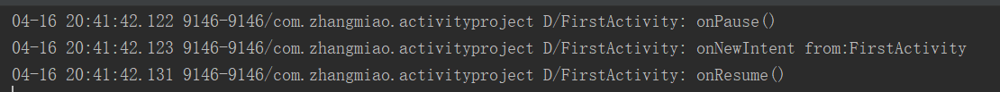

# 验证 onNewIntent 方法

[TOC]

## 关于 onNewIntent

　　onNewIntent() 方法会在 activity 复用的时候调用，也就是说调用 activity ，并不会创建 activity 的新实例，而是复用栈中的 activity ，复用时就会调用 onNewIntent() 方法，将新的 Intent 传递给 oNewIntent() 方法。

## 想要验证的问题
1. 一般 onNewIntent() 回调的验证。
2. 回调方法在生命周期的何时被调用？

## 关于如何验证
　　创建一个 MainActivity 、 FirstActivity 与 SecondActivity 类，MainActivity 是项目的主界面，任何一个 Activity 都可以跳转包括自己的任意一个 Activiity ，通过设置 activity 的 launchMode 与在代码中使用 startActivity 的 Intent 设置 flag 来验证。
　　相关验证代码在：[activityproject](https://github.com/ZhangMiao147/ArticleProject/tree/master/activityproject)

## 验证一般 onNewIntent() 方法的回调与在生命周期何时回调
* 将 FirstActivity 的 launchMode 设置为 singleTask 。
* 在 MainActivity 、FirsrActivity 与 SecondActivity 跳转 FirstActivity 的 Intent 携带一个数值为“from”，设置值分别为跳转的 activity 的类名。
* 在 FirstActivity 打印生命周期日志与 onNewIntent() 方法，并在 onNewIntent() 方法中打印 Intent 的 "from" 数值。
* 通过 MainActivity 界面跳转 FirstAcivity 界面，在 FirstActivity 界面跳转 FirstActivity 界面。

　　在 MainActivity 界面跳转 FirstActivity 界面，onNewIntent() 方法并不会回调，因为栈内还没有 FirstActivity ，这次将会创建 FirstActivity 实例，所以并不会回调 onNewIntent 方法。在 FirstActivity 跳转 FirstActivity 时，复用栈内的 FirstActivity ，并回调了 onNewIntent() 方法，onNewIntent() 方法中获取到的 "from" 的值为 “FirstActivity”。并且可以看到 onNewIntent() 方法是在 FirstActivity 的 onPause() 与 FirstActivity 的 onResume() 方法之间回调。

* 在 FirstActivity 界面跳转 SecondActivity 界面，然后在 SecondActivity 界面跳转 FirstActivity 界面。

　　在 SecondActivity 跳转 FirstActivity 时，复用栈内的 FirstActivity ，并回调了 onNewIntent() 方法，onNewIntent() 方法中获取到的 "from" 的值为 “SecondActivity”。并且可以看到 onNewIntent() 方法是在 SecondActivity 的 onPause() 与 FirstActivity 的 onRestart() 方法之间回调。

## 结论
　　onNewIntent() 方法会在复用栈内的 activity 时回调，将新的 Intent 传递给被复用的 activity 。