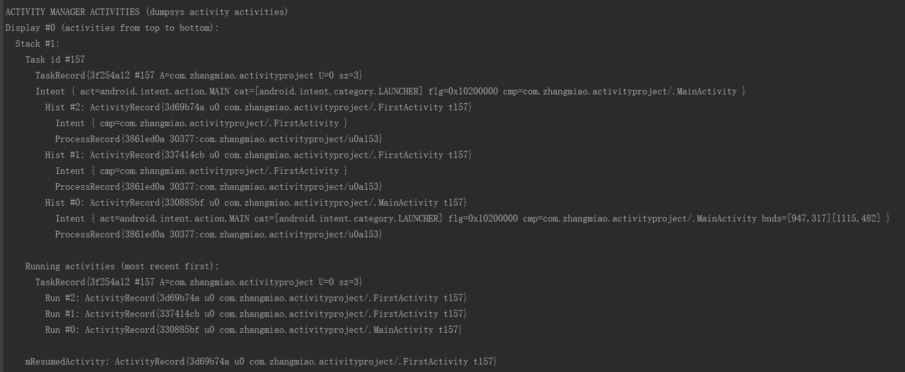
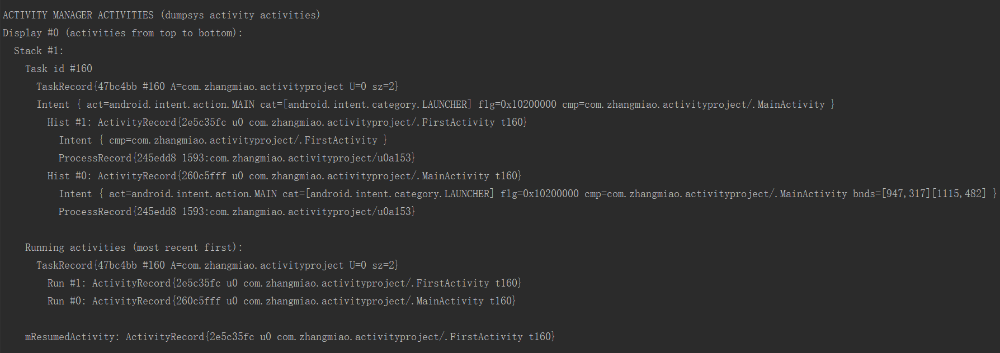
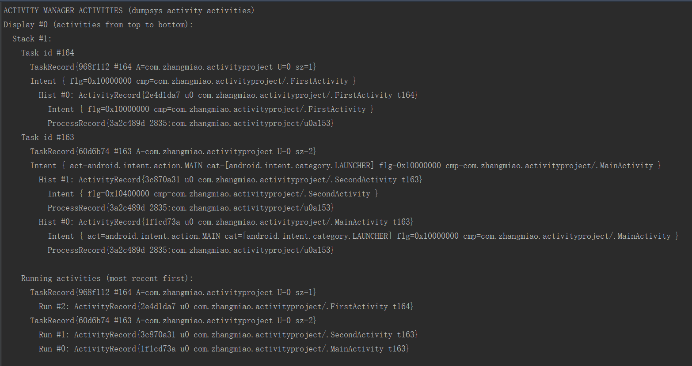

# 验证 Activity 四种 launchMode
	本文内容：
	1. 如何验证
	2. 如何设置 Activity 的启动模式
	3. 初始任务栈情况
	4. standard(标准模式)
	5. singleTop(栈顶复用)
	6. singleTask(栈内复用)
	7. singleInstance(单例模式)

[TOC]

## 1. 如何验证

　　创建一个 MainActivity 、 FirstActivity 与 SecondActivity 类，MainActivity 是项目的主界面，任何一个 Activity 都可以跳转包括自己的任意一个 Activiity ，通过设置 FirstActivity 的 launchMode 的值来观察任务栈中的情况。

　　通过执行 `adb shell dumpsys activity` 命令观察任务栈中 Activity 的入栈和出栈情况。

　　相关验证代码在：[activityproject](https://github.com/ZhangMiao147/ArticleProject/tree/master/activityproject)

## 2. 如何设置 Activity 的启动模式
　　在 AndroidManidest.xml 中设置 Activity 的启动模式非常简单，直接在想要设置的 Activity 中添加 `android:launchMode=""` 属性即可，`android:launchMode=""` 属性有四个可供选择的值，分别是 **standard**、**singleTop**、**singTask** 与 **singleInstance**，这四个值分别对应四种启动模式：标准模式、栈顶复用、栈内复用与单例模式。

　　例如，设置 Activity 的启动模式为 `singleTop` ,在 AndroidManifest.xml 中应该是：

```
   <activity
            android:name=".FirstActivity"
            android:launchMode="singleTop" />
```

## 3. 初始任务栈情况

　　打开应用，显示 MainActivity 之后的任务栈如下：

　　从图中可以看到应用刚打开是，任务栈里只有一个 MainActivity 。

　　**栈：（从栈底到栈顶）**：MainActivity 。

## 4. standard(标准模式)
　　Activity 的默认启动模式，只要启动 Activity 就会创建一个新实例，并将该 Activity 添加到当前 Task 栈中。

* 在 MainActivity 中点击跳转 FirstActivity ，然后在 FirstActivity 中点击跳转 FirstActivity ，任务栈情况:

　　从图中可以看出任务栈中有 MainActiivty 、 FirstActivity 与 FirstActivity ，操作点击打开了两次 FirstActivity ，FirstActvity 的启动模式是 standard ，所以任务栈中就会有两个 FirstActivity 。

　　**栈：（从栈底到栈顶）**：MainActivity -> FirstActivity -> FirstActivity 。

## 5. singleTop(栈顶复用)
　　在这种启动模式下，首先会判断要启动的活动是否已经存在于栈顶，如果是的话就不创建新实例，直接复用栈顶活动。如果要启动的活动不位于栈顶或在栈中或在栈中无实例，则会创建新实例入栈。

* 将 FirstActivity 的启动模式修改为 singleTop 。
* 在 MainActivity 中点击跳转 FirstActivity ，然后在 FirstActivity 中点击跳转 FirstActivity ，任务栈情况（操作和标准模式相同）:


　　从图中可以看到，在和 standard 模式下一样操作的情况下，栈内只有 MainActivity 与 FirstActivity ,这是 FirstActivity 的启动模式是 singTop ,在 MainActivity 点击跳转 FirstActivity 之后，FirstActivity 就位于栈顶，当 FirstActivity 再跳转 FirstActivity 时，发现 FirstActivity 在栈顶，所以就直接复用了栈顶的 FirstActivity 。

　　**栈：（从栈底到栈顶）**：MainActivity -> FirstActivity 。

## 6. singleTask(栈内复用)

　　singleTask 是一种栈内单例模式，当一个 activity 启动时，如果栈中没有 activity 则会创建 activity 并让它入栈；如果栈中有 activity ，则会将位于 activity 之上的 activities 出栈，然后复用栈中的 activity ，调用 activity 的 onNewIntent() 方法。

　　这种模式会保证 Activity 在所需要的栈内只有一个或者没有。

* 将 FirstActivity 的启动模式修改为 singleTask 。
* 在 MainActivity 中点击跳转 FirstActivity ，然后在 FirstActivity 中点击跳转 SecondActivity ，任务栈情况:

　　在经过上面的操作之后，任务栈中从栈顶到栈底的依次是 SecondActivity -> FirstActivity -> MainActivity 。
　　**栈：（从栈底到栈顶）**：MainActivity -> FirstActivity -> SecondActivity 。

* 在上面的操作基础上，在 SecondActivity 中点击跳转 FirstActivity ，任务栈情况：

　　在 SecondActivity 中点击跳转 FirstActivity 之后，任务栈中从栈顶到栈底的依次是 FirstActivity -> MainActivity ，SecondActivity 并没有在任务栈中了，FirstActivity 在栈中也只有一个。在把 FirstActivity 的启动模式设置为 SingleTask ，当 SecondActivity 跳转到 FirstActivity 时，任务栈中已经有 FirstActivity 了，就会复用栈内的 FirstActivity ，并将栈内 FirstActivity 上面的 Activity（ 即 SecondaActivity ）出栈。

　　**栈：（从栈底到栈顶）**：MainActivity -> FirstActivity 。

## 7. singleInstance(单例模式)
　　这种模式是真正的单例模式，以这种模式启动的活动会单独创建一个任务栈，并且依然遵循栈内复用的特性，保证了这个栈中只能存在这一个活动。并且系统不会在这个单例模式的 Activity 的实例所在 task 中启动任何其他的 Activity 。单例模式的 Activity 的实例永远是这个 task 中的唯一一个成员。

* 将 FirstActivity 的启动模式修改为 singleInstance 。
* 在 MainActivity 中点击跳转 FirstActivity ，然后在 FirstActivity 中点击跳转 SecondActivity ，任务栈情况:

　　在经过上面的操作之后，有两个任务栈，一个任务栈中从栈顶到栈底的依次是 SecondActivity -> MainActivity ，另一个任务栈中只有 FirstActivity。 注意，图中的 task id ,会发现 MainActivity 与 SecondActivity 的 task id 是相同的，而 FirstActivity 的 task id 与其他的不同，所以说明打开 FirstActivity 时新建了任务栈，并将 FirstActivity 放入新建的栈中。

　　**栈：（从栈底到栈顶）**：Task 163: MainActivity -> SecondActivity ; Task 164: FirstActivity。

* 在上面的操作基础上，在 SecondActivity 中点击跳转 FirstActivity ，任务栈情况：

　　在 SecondActivity 中点击跳转 FirstActivity 之后，栈与操作之前的情况相同。在将 FirstActivity 的启动模式设置为 singleInstance 时，调用 FirstActivity 时，就会从 FirstActivity 所在的栈中取出 FirstActivity ，也不会在 FirstActivity 所在的栈中再次将 FirstActivity 入栈。

　　**栈：（从栈底到栈顶）**：Task 163: MainActivity -> SecondActivity ; Task 164: FirstActivity。

* 在上面的操作基础上，在 FirstActivity 界面点击返回键，任务栈情况：

　　在 FirstActivity 界面点击返回键之后，FirstActivity 所在栈没有了，只剩下一个栈，栈中依旧是 SecondActivity 与 ManiActivity 。

　　**栈：（从栈底到栈顶）**：Task 163: MainActivity -> SecondActivity ; Task 164: 没有了。

* 在上面的操作基础上，在 SecondActivity 界面点击返回键，任务栈情况：

　　在 SecondActivity 界面点击返回键之后，栈中只剩下 MainActivity ，界面也回到 MainActivity 。

　　**栈：（从栈底到栈顶）**：Task 163: MainActivity ; Task 164: 没有了。

