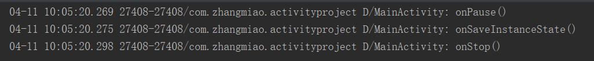
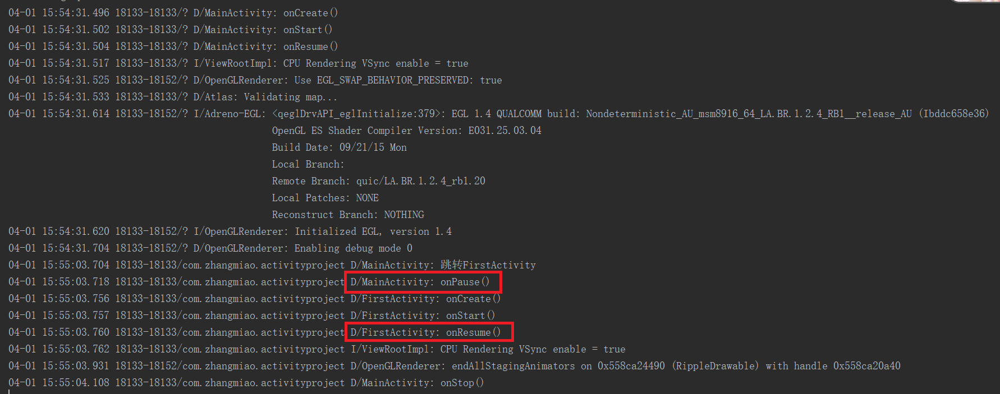
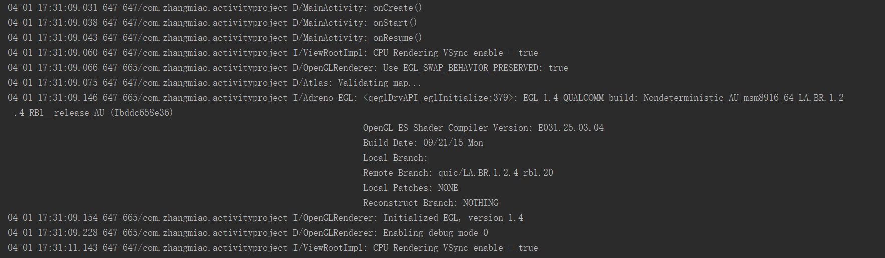
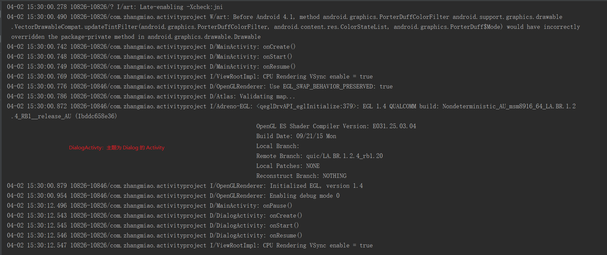
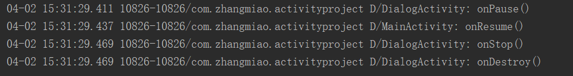
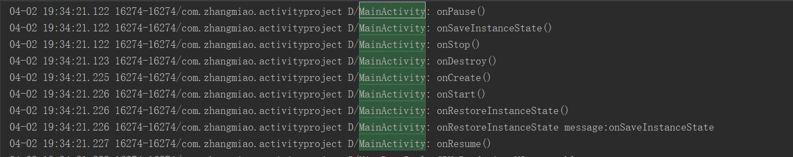

# 验证 Activity 生命周期的问题

	本文内容
	1. 如何验证问题
	2. 正常情况下的生命周期
	3. 由活动 A 启动活动 B 时，活动 A 的 onpause() 和 B 的 onResume() 哪一个先执行？
	4. dialog 是否会对生命周期产生影响？
		4.1. 标准的 AlertDialog 是否有影响？
		4.2. 全屏的 AlertDialog 是否有影响？
		4.3. 主题为 Dialog 的 Activity 是否有影响？
	5. 横竖屏切换时生命周期变化
	6. 内存不足杀死 Activity 时的生命周期变化
	7. 异常情况下数据保存
	8. 异常情况下，系统默认恢复 EditText 的文本信息
	9. 异常情况下，系统默认恢复 TextView 的文本信息
	10. 防止重建

[TOC]

## 1. 如何验证问题

　　创建一个 MainActivity 、 FirstActivity 类以及一些验证问题的 Dialog 等等其他的类，MainActivity 是项目的主界面。MainActivity 与 FirstActivity 的生命周期方法中都打印了日志。

　　相关验证代码在：[activityproject](https://github.com/ZhangMiao147/ArticleProject/tree/master/activityproject)

## 2. 正常情况下的生命周期

* 点击应用到界面显示出来的生命周期

**结论**：第一次打开 MainActivity ，调用了 onCreate() -> onStart() -> onResume() 方法。

* 按下电源键时的屏保的生命周期

**结论**：屏保时的生命周期调用为：onPause() -> onStop() 。

* 亮屏时的生命周期

**结论**：亮屏时的生命周期调用为：onRestore() -> onStart() -> onResume() 。

* 按 home 键时的生命周期

**结论**：按下 home 键时的生命周期调用为：onPause() -> onStop() 。

* 按 home 键后重新打开界面的生命周期（从后台应用打开的生命周期是相同的）

**结论**：按下 home 键之后重新打开界面时的生命周期调用为：onRestore() -> onStart() -> onResume() 。

* 在显示界面点击返回键退出的生命周期

**结论**：关闭 MainActivity ，调用了 onPause() -> onStop() -> onDestory() 方法。

## 3. 由活动A启动活动B时。活动A的 onPause() 与活动B的 onResume() 哪一个先执行？
　　在 MainActivity 界面中添加一个按钮，点击按钮跳转 FirstActivity 界面。

* 打开 MainActivity 界面，在 MainActivity 跳转到 FirstAcivity ，运行结果如下：

　　可以看到，是 MainActivity 先执行了 onPause() ， FirstActivity 的 onResume() 后执行的。

* 点击返回看一下执行的顺序：

　　点击返回后，可以看到是 FirstActivity 的 onPause() 先执行，MainActivity 的 onResume() 后执行。

**结论**：当活动 A 启动活动 B 时，是活动 A 的 onPause() 方法先执行，活动 B 的 onResume() 方法后执行。

## 4.dialog 是否会对生命周期产生影响？

　　查看 Activity 生命周期的描述，如果 Activity 不在前台，且并非完全不可见时， Activity 就会处在 onPause() 的暂停状态。但是事实如何，用代码说话，测试三种情况：一，弹出标准的 AlertDialog ；二，弹出全屏的 AlertDialog ；三，弹出主题为 Theme.AppCompat.Dialog 的 Activity ，查看这三种情况下的生命周期的变化：

#### 4.1. 标准的 AlertDialog 是否有影响？
　　在 MainActivity 的布局中添加一个弹出标准 AlertDialog 的按钮，用于观察 MainActivity 在弹出 AlertDialog 和隐藏 AlertDialog 的情况下的生命周期变化。

* 点击弹出标准 AlertDialog 的生命周期的运行
  

  可以看到弹出标准的 AlertDialog 并不会对 MainActivity 的生命周期有任何的影响。

* 点击 AlertDialog 的“确定”按钮，对 AlertDialog 进行隐藏，观察 MainActivity 的生命周期的变化
　　点击 AlertDialog 的“确定”按钮后，看到没有任何的日志打印出来，所以隐藏标准 AlertDialog 也不会对 MainActivity 的生命周期有任何的影响。

**结论**：显示和隐藏标准的 AlertDialog 不会对 MainActivity 的生命周期有任何的影响。

#### 4.2. 全屏的 AlertDialog 是否有影响？
　　在 MainActivity 的布局中添加一个弹出全屏 AlertDialog 的按钮，用于观察 MainActivity 在弹出全屏 AlertDialog 和隐藏全屏 AlertDialog 的情况下的生命周期变化。

* 点击弹出全屏 AlertDialog 的生命周期的运行

　　可以看到弹出全屏的 AlertDialog 并不会对 MainActivity 的生命周期有任何的影响。

* 点击 AlertDialog 的 “ 确定 ” 按钮，对 AlertDialog 进行隐藏，观察 MainActivity 的生命周期的变化
　　点击 AlertDialog 的 “ 确定 ” 按钮后，看到没有任何的日志打印出来，所有隐藏全屏 AlertDialog 也不会对 MainActivity 的生命周期有任何的影响。

**结论**：显示和隐藏全屏的 AlertDialog 不会对 MainActivity 的生命周期有任何的影响。

#### 4.3. 主题为 Dialog 的 Activity 是否有影响？

　　在 MainActivity 的布局中添加一个跳转主题为 Theme.AppCompat.Dialog 的 Activity 的按钮，用于观察 MainActivity 在跳转主题为 Theme.AppCompat.Dialog 的 Activity 和从主题为 Theme.AppCompat.Dialog 的 Activity 返回的情况下的生命周期变化。

* 跳转主题为 Dialog 的 Activity 的生命周期变化

　　可以看到跳转主题为 Dialog 的 Activity 会对 MainActivity 的生命周期产生影响，调用了 MainActivity 的 onResume() 方法，并没有调用 onStop() 方法。

* 在主题为 Dialog 的 Activity 下点击返回键的生命周期变化

　　在主题为 Dialog 的 Activity 下点击返回键，返回到 MainActivity 的界面，从运行结果可以看出，MainActivity 只调用了 onResume() 方法，并没有调用 onRestart() 与 onStart() 两个方法，DialogActivity 调用 onPause()、onStop() 与 onDestory() 方法。

**结论**：主题为 Dialog 的 Activity 会对 MainActivity 的生命周期有影响，调用了 MainActivity 的 onPause() 方法。从主题为 Dailog 的 Activity 返回到 MainActivity 会调用 MainActivity 的 onResume() 方法，不会调用 onRestart() 和 onStart() 方法。

## 5. 横竖屏切换时生命周期变化
　　MainActivity 在横竖屏切换时生命周期的变化：
　　

**结论**：横竖屏切换时的生命周期调用为：onPause() -> onStop() -> onDestory() -> onCreate() -> onStart() -> onResume() 。就是一个销毁再重建的过程。

## 内存不足杀死 Activity 时的生命周期变化
　　模拟内存不足杀死应用：先打开应用，然后按 home 键，使应用进入后台，然后使用命令 `adb shell am kill 包名`将应用杀死。
* 从打开应用到杀死应用的生命周期变化如下：

　　在按 home 键之后，MainActivty 调用了 onPause() 与 onStop() 方法，并没有调用 onDestory() 方法，所以主进程现在属于后台进程。
**结论**：内存不足时，杀死应用，前台的 Activity 生命周期为 onPause() -> onStop() 。
* 然后在点击应用的图标，打开应用，生命周期变化如下：

　　可以看到 MainActivity 调用了 onCreate()、onStart() 和 onResume() 方法，Activity 重新创建了。

## 7. 异常情况下数据保存

　　在 MainActivity 中覆盖 onSaveInstanceState 和 onRestoreInstanceState 两个方法。在 onSaveInstanceState 方法中保存 key 值为 message ,值为 onSaveInstanceState 的数值，在 onRestoreInstanceState 方法中获取 key 值为 message 对应的数值，使用横竖屏切换来测试这两个方法的调用，以及保存数值的获取。

* 从 MainActivity 开启到切换横竖屏的生命周期变化如下：

　　横竖屏切换时，MainActivity 调用了 onSaveInstanceState() 方法，切换之后 MainActivity 重新创建，并且调用了 onRestoreInstanceState() 方法，并从 Bundle 中取得了 onSaveInstanceState() 方法中保存的数据。

* 再切换回来的生命周期变化如下:

　　切换回来与切换的时候的生命周期变化一样，先调用了 onSaveInstanceState() 方法，切换后 MainActivity 重新创建并调用 onRestoreInstanceState() 方法，并从 Bundle 中取得了 onSaveInstanceState() 方法中保存的数据。

　　onCreate() 方法中也能获取 onSaveInstanceState 方法中保存的数据，在 MainActivity 的 onCreate() 方法中增加获取代码。

* 横竖屏切换之后 onCreate() 打印的日志如下:

　　在 MainActivity 重新创建时，调用了 onCreate() 方法，并从 onCreate() 方法的 Bundle 中获取到 onSaveInstanceState() 方法中存储的值。注意：onCreate() 中从 Bundle 中获取数据之前，一定要判空，因为第一次进入的时候，Bundle 是空的，会有空指针异常。

## 8. 在异常情况下，系统默认恢复 EditText 的文本信息
　　在 MainActivity 的布局文件中添加 EditText，打开应用后，在输入框内输入一些文字。在横竖屏切换后观察输入框内的文字是否和切换之前的文字相同。（通过横竖屏切换观察信息，注意 EditText 需要添加 id 才行）
　　从打开应用，到横竖屏切换之后输入框的文字内容如下：

　　在切换横竖屏时，onPause() 方法中打印了 EditText 的文本内容，切换重建后，在 onResume() 中获取到 EditText 的内容与之前的内容相同，并且要注意，重建后 onCreate() 与 onStart() 方法中获取 EditText 的文本内容都是为空。

## 9. 在异常情况下，系统默认恢复 TextView 的文本信息
　　通过转屏观察信息，这里只是通过 setText 方法动态设置文本内容，在这种情况下加了 id 也无法自动保存，这种情况可以通过给 TextView 设置 freezesText 属性才能自动保存。
　　打开应用后在点击弹出标准的 AlertDialog 时修改 TextView 的内容，横竖屏切换后，观察 TextView 的内容是否和切换之前的文字相同。

　　从打开应用，到横竖屏切换之后 TextView 的文字内容如下：

　　在切换横竖屏时，onPause() 方法中打印了 TextView 的文本内容，切换重建后，在 onResume() 中获取到 TextView 的内容与之前的内容相同，并且要注意，重建后 onCreate() 与 onStart() 方法中获取 TextView 的文本内容是布局文件中的默认内容。

## 10. 防止重建
　　将 MainActivity 的 android:configChanges 设置为 orientation ，在横竖屏切换的时候防止重新被创建。

* 横竖屏切换时，生命周期的变化如下:

　　可以看到在第一次进入 Activity 会调用 onCreate() -> onStart() -> onResume() 创建，之后切换横竖屏并不会有任何的生命周期方法的调用。

