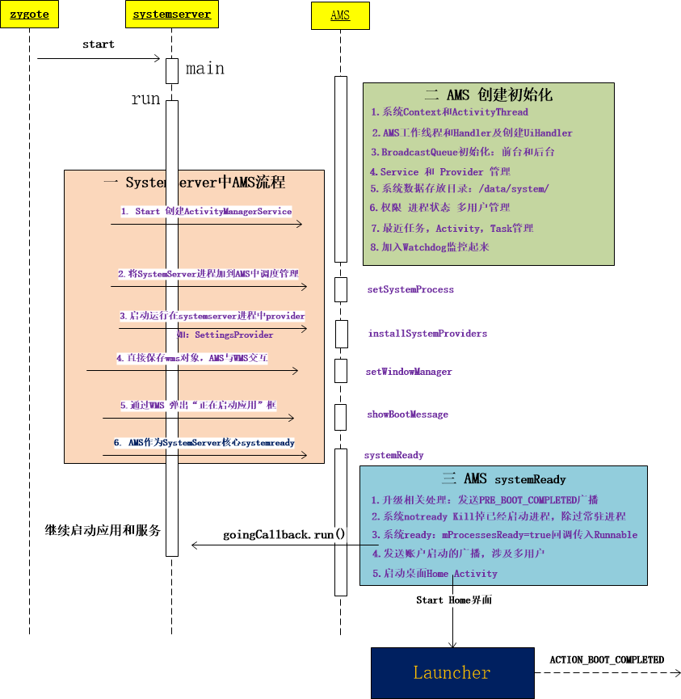

# ActivityManagerService

## 1. 概述

　　AMS 是系统的引导服务，应用进程的启动、切换和调度以及四大组件的启动和管理都需要 AMS 的支持。从这里可以看出 AMS 的功能会十分的繁多，当然它并不是一个类承担这个重责，它有一些关联类。

## 2. AMS 的启动流程

　　AMS 的启动是在 SystemServer 进程中启动的，从 SystemServer 的 main 方法进入。

### 2.1. SystemServer#main

```java
    public static void main(String[] args) {
        new SystemServer().run();
    }
```

　　main 方法中只调用了 SystemServer 的 run 方法。

### 2.2. SystemServer#run

```java
    private void run() {
            ...    
          // 创建 SystemServer 运行环境：设置线程优先级，创建主线程 Looper、ActivityThread 和 SystemContext    
          android.os.Process.setThreadPriority(
                android.os.Process.THREAD_PRIORITY_FOREGROUND);
            android.os.Process.setCanSelfBackground(false);
            Looper.prepareMainLooper();
						...
      
            // Initialize native services.
            // 加载了动态库 libandroid_servers.so
            System.loadLibrary("android_servers");
            // 创建 systemserver 上进程的 ActivityThread 和 SystemContext
            createSystemContext();

            ...

            // Create the system service manager.
            // 创建 SystemServiceMananger ,它会对系统的服务进行创建、启动和生命周期管理。
            mSystemServiceManager = new SystemServiceManager(mSystemContext);
            mSystemServiceManager.setRuntimeRestarted(mRuntimeRestart);
            LocalServices.addService(SystemServiceManager.class, mSystemServiceManager);
            ...

        // Start services.
        try {
            traceBeginAndSlog("StartServices");
            // 用 SystemServiceManager 启动 ActivityManangerService、PowerManangerService、PackageManangerService 等服务
            startBootstrapServices();
            // 启动 BatteryService、UsageStatsService 和 WebViewUpdateService
            startCoreServices();
            // 启动 CameraService、AlarmManagerService、VrManangerService 等服务。
            startOtherServices();
            SystemServerInitThreadPool.shutdown();
        } catch (Throwable ex) {
            Slog.e("System", "******************************************");
            Slog.e("System", "************ Failure starting system services", ex);
            throw ex;
        } finally {
            traceEnd();
        }

        ...
    }
```

　　SystemServer 的 run 方法中调用 startBootstrapServices、startCoreServices、startOtherServices 三个方法去启动服务，这些服务的父类均为 SystemService。

　　官方把系统服务分为了三种类型，分别是引导服务、核心服务和其他服务，其中其他服务是一些非紧要和一些不需要立即启动的服务。系统服务总共大约有 80多个。

### 2.3. SystemServer#startBootstrapServices

```java
    private void startBootstrapServices() {
        ...

        // Activity manager runs the show.
        traceBeginAndSlog("StartActivityManager");
       // 调用了 SystemServiceMananger 的 startService 方法，参数是 ActivityManagerService.Lifecycle.class
      // 创建 AMS
        mActivityManagerService = mSystemServiceManager.startService(
                ActivityManagerService.Lifecycle.class).getService();
        mActivityManagerService.setSystemServiceManager(mSystemServiceManager);
        mActivityManagerService.setInstaller(installer);
        traceEnd();
      
      	// 将 SystemServer 进程可加到 AMS 中调度管理
        mActivityManagerService.setSystemProcess();

        ...
    }
```

　　在 SystemServer 的 startBootstrapService 方法中调用了 SystemServiceMananger 的 startService 方法，参数是 ActivityManagerService.Lifecycle.class。

#### 2.3.1. SystemServiceManager#startService

```java
    public <T extends SystemService> T startService(Class<T> serviceClass) {
        try {
            ...

            // Create the service.
            ...
            final T service;
            try {
                // 得到传进来的 Lifecycle 的构造器 constructor
                Constructor<T> constructor = serviceClass.getConstructor(Context.class);
                // 创建 Lifecycle 类型的 service 对象
                service = constructor.newInstance(mContext);
            } catch (xxxException ex) {
                ...
            }
						// 调用 startService 方法
            startService(service);
            // 返回 service
            return service;
        } finally {
            Trace.traceEnd(Trace.TRACE_TAG_SYSTEM_SERVER);
        }
    }

    public void startService(@NonNull final SystemService service) {
        // Register it.
        // 将创建的 service 添加到 ArrayList 类型的 mServices 对象中完成注册
        mServices.add(service);
        // Start it.
        long time = System.currentTimeMillis();
        try {
            // 调用 service 的 onStart 方法来启动 service
            service.onStart();
        } catch (RuntimeException ex) {
            ...
        }
        ...
    }
```

　　startService 方法传入的参数是 Lifecycle.class，Lifecycle 继承自 SystemService。

　　首先通过反射创建 Lifecycle 实例：先得到 Lifecycle 的构造器 constructor，然后调用 constructor 的 newInstance 方法来创建 Lifecycle 类型的 service 对象。

　　接着将刚创建的 service 添加到 ArrayList 类型的 mService 对象中完成注册。

　　然后调用 service 的 onStart 方法来启动 service。

　　最后返回该 service。

#### 2.3.2. Lifecycle

　　Lifecycle 是 ActivityManagerService 的内部类。

```java
    public static final class Lifecycle extends SystemService {
        private final ActivityManagerService mService;

        public Lifecycle(Context context) {
            super(context);
            // 创建 ActivityManagerService 实例
            mService = new ActivityManagerService(context);
        }

        @Override
        public void onStart() {
            // 调用 ActivityManagerService 的 start 方法
            mService.start();
        }

        public ActivityManagerService getService() {
            // 返回 ActivityManagerService 实例
            return mService;
        }
    }
```

　　在 SystemServiceManager  的 startService 方法中通过反射创建了 Lifecycle 实例的时候，会调用 Lifecycle 的构造方法，在里面会创建 AMS 实例。

　　在 SystemServiceManager  的 startService 方法中调用 Lifecycle 类型的 service 的 onStart 方法时，实际上时调用了 AMS 的 start 方法。

　　在 Systemserver 的 startBootstrapServices 方法中调用的 `mActivityManagerService = mSystemServiceManager.startService(
                ActivityManagerService.Lifecycle.class).getService();` 就是 ActivityManagerService 的对象。

#### 2.3.3. ActivityManagerService#setSystemProcess

　　在 SystemServer 的 run 方法中调用了 ActivityManagerService 的 setSystemProcess 方法将 SystemServer 进程加到 AMS 中调度管理。

```java
    public void setSystemProcess() {
        try {
          // 将服务加入到 ServiceManager 中
            ServiceManager.addService(Context.ACTIVITY_SERVICE, this, true);
            ServiceManager.addService(ProcessStats.SERVICE_NAME, mProcessStats);
            ServiceManager.addService("meminfo", new MemBinder(this));
            ServiceManager.addService("gfxinfo", new GraphicsBinder(this));
            ServiceManager.addService("dbinfo", new DbBinder(this));
            ...
            // 设置 application info LoadeApkinfo 有关 framework-res.apk

            ApplicationInfo info = mContext.getPackageManager().getApplicationInfo(
                    "android", STOCK_PM_FLAGS | MATCH_SYSTEM_ONLY);
            mSystemThread.installSystemApplicationInfo(info, getClass().getClassLoader());

          	// 给 SystemServer 进程创建 ProcessRecord，adj 值，就是将 SystemServer 进程加入到 AMS 进程管理机制中，跟应用进程一致
            synchronized (this) {
                ProcessRecord app = newProcessRecordLocked(info, info.processName, false, 0);
                app.persistent = true;
                app.pid = MY_PID;
                app.maxAdj = ProcessList.SYSTEM_ADJ;
                app.makeActive(mSystemThread.getApplicationThread(), mProcessStats);
                synchronized (mPidsSelfLocked) {
                    mPidsSelfLocked.put(app.pid, app);
                }
                updateLruProcessLocked(app, false, null);
                updateOomAdjLocked();
            }
        } catch (PackageManager.NameNotFoundException e) {
            ...
        }
    }
```

　　setSystemProcess 意义：这一步就是给 SystemServer 进程创建 ProcessRecord、adj 值，就是将 SystemServer 进程加入到 AMS 进程管理机制中，跟应用进程一致。

　　SystemServiceMananger 的 startService 方法最终会返回 Lifecycle 的 getService 方法，这个方法会返回 AMS 类型的 mService 对象，这样 AMS 实例就会被创建并且返回。

### 2.4. SystemServer#startOtherService

```java
    private void startOtherServices() {
      			...
      			// 将相关 provider 运行在 systemserver 进程中：SettingProvider
            traceBeginAndSlog("InstallSystemProviders");
            mActivityManagerService.installSystemProviders();
            Trace.traceEnd(Trace.TRACE_TAG_SYSTEM_SERVER);
      			...
        
            traceBeginAndSlog("InitWatchdog");
            final Watchdog watchdog = Watchdog.getInstance();
            watchdog.init(context, mActivityManagerService);
            Trace.traceEnd(Trace.TRACE_TAG_SYSTEM_SERVER);
      
      			...
        
        		// start window manager
            traceBeginAndSlog("StartWindowManagerService");
            wm = WindowManagerService.main(context, inputManager,
                    mFactoryTestMode != FactoryTest.FACTORY_TEST_LOW_LEVEL,
                    !mFirstBoot, mOnlyCore);
            ServiceManager.addService(Context.WINDOW_SERVICE, wm);
            ServiceManager.addService(Context.INPUT_SERVICE, inputManager);
            Trace.traceEnd(Trace.TRACE_TAG_SYSTEM_SERVER);
      
      
      			// 直接保存 wms 对象，与 WMS 交互
            mActivityManagerService.setWindowManager(wm);
      
      			...
        
            // 系统启动前的准备工作，启动 SystemUI 和 Home 界面等
            mActivityManagerService.systemReady(new Runnable() {
             				... 
                  	// 启动 SystemUI
                  	Trace.traceBegin(Trace.TRACE_TAG_SYSTEM_SERVER, "StartSystemUI");
                try {
                    startSystemUi(context);
                } catch (Throwable e) {
                    reportWtf("starting System UI", e);
                }
                ...
                
                // 启动 watchDog 监控核心服务状态
                Watchdog.getInstance().start();
                
                ...
                try {
                    if (mmsServiceF != null) mmsServiceF.systemRunning();
                } catch (Throwable e) {
                    reportWtf("Notifying MmsService running", e);
                }
                ...
              }
    }
```

　　startOtherService 方法会启动 CameraService、AlarmManagerService、VrManangerService 等服务。将相关 provider 运行在 systemserver 进程中：SettingProvider，创建并初始化 Watchdog 对象，做好系统启动前的准备工作。

## 3. AMS 与进程启动

　　要启动一个应用程序，首先要保证这个应用程序所需要的应用程序进程已经被启动。

　　AMS 在启动应用程序时会检查这个应用程序需要的应用程序进程是否存在，不存在就会请求进程将需要的应用程序进程启动。

### 3.1. ActiveServices#bringUpServiceLocked

　　Service 的启动过程中会调用 ActiveServices 的 bringUpServiceLocked 方法。

```java
    private String bringUpServiceLocked(ServiceRecord r, int intentFlags, boolean execInFg,
            boolean whileRestarting, boolean permissionsReviewRequired)
            throws TransactionTooLargeException {
        ...

        // 得到 ServiceRecord 的 processName 的值赋值给 procName
        // 其中 ServiceRecord 用来描述 Service 的 android:process 属性
        final String procName = r.processName;
        String hostingType = "service";
        // ProcessRecord 主要用来记录运行的应用程序进程的信息
        ProcessRecord app;

        if (!isolated) {
            // 将 procName 和 Service 的 uid 传入到 AMS 的 getProcessRecordLocked 方法中，来查询是否存在一个与 Service 对应的 ProcessRecord 类型的对象 app
            app = mAm.getProcessRecordLocked(procName, r.appInfo.uid, false);
            if (DEBUG_MU) Slog.v(TAG_MU, "bringUpServiceLocked: appInfo.uid=" + r.appInfo.uid
                        + " app=" + app);
            if (app != null && app.thread != null) {
                try {
                    app.addPackage(r.appInfo.packageName, r.appInfo.versionCode, mAm.mProcessStats);
                    realStartServiceLocked(r, app, execInFg);
                    return null;
                } catch (TransactionTooLargeException e) {
                    throw e;
                } catch (RemoteException e) {
                    Slog.w(TAG, "Exception when starting service " + r.shortName, e);
                }

                // If a dead object exception was thrown -- fall through to
                // restart the application.
            }
        } else {
            // If this service runs in an isolated process, then each time
            // we call startProcessLocked() we will get a new isolated
            // process, starting another process if we are currently waiting
            // for a previous process to come up.  To deal with this, we store
            // in the service any current isolated process it is running in or
            // waiting to have come up.
            app = r.isolatedProc;
            if (WebViewZygote.isMultiprocessEnabled()
                    && r.serviceInfo.packageName.equals(WebViewZygote.getPackageName())) {
                hostingType = "webview_service";
            }
        }

        // Not running -- get it started, and enqueue this service record
        // to be executed when the app comes up.
        // 判断 service 对应的 app 为 null 则说明用来运行 Service 的 应用进程不存在
        if (app == null && !permissionsReviewRequired) {
            // 调用 AMS 的 startProcessLocked 方法来创建对应的应用程序进程。
            if ((app=mAm.startProcessLocked(procName, r.appInfo, true, intentFlags,
                    hostingType, r.name, false, isolated, false)) == null) {
                String msg = "Unable to launch app "
                        + r.appInfo.packageName + "/"
                        + r.appInfo.uid + " for service "
                        + r.intent.getIntent() + ": process is bad";
                Slog.w(TAG, msg);
                bringDownServiceLocked(r);
                return msg;
            }
            if (isolated) {
                r.isolatedProc = app;
            }
        }
        
        ...
    }
```

　　ActiveServices 的 bringUpServiceLocked 方法中会先去检查是否存在一个与 Service 对应的 ProcessRecord 类型的对象 app，如果不存在，则调用 AMS 的 startProcessLocked 方法来创建对应的应用程序进程。

## 4. AMS systemReady 过程

　　在 SystemServer 的 startOtherService 方法中调用了 ActivityServiceService 的 systemReady 方法，来完成系统启动前的准备工作。

```java
    public void systemReady(final Runnable goingCallback) {
        synchronized(this) {
            if (mSystemReady) {
                // If we're done calling all the receivers, run the next "boot phase" passed in
                // by the SystemServer
                if (goingCallback != null) {
                    goingCallback.run();
                }
                return;
            }

            mLocalDeviceIdleController
                    = LocalServices.getService(DeviceIdleController.LocalService.class);

            // Make sure we have the current profile info, since it is needed for security checks.
            mUserController.onSystemReady();
            mRecentTasks.onSystemReadyLocked();
            mAppOpsService.systemReady();
            mSystemReady = true;
        }

      	// 收集已经启动的进程并杀死，除过 persistent 常驻进程 
        ArrayList<ProcessRecord> procsToKill = null;
        synchronized(mPidsSelfLocked) {
            for (int i=mPidsSelfLocked.size()-1; i>=0; i--) {
                ProcessRecord proc = mPidsSelfLocked.valueAt(i);
                if (!isAllowedWhileBooting(proc.info)){
                    if (procsToKill == null) {
                        procsToKill = new ArrayList<ProcessRecord>();
                    }
                    procsToKill.add(proc);
                }
            }
        }

        synchronized(this) {
            if (procsToKill != null) {
                for (int i=procsToKill.size()-1; i>=0; i--) {
                    ProcessRecord proc = procsToKill.get(i);
                    Slog.i(TAG, "Removing system update proc: " + proc);
                    removeProcessLocked(proc, true, false, "system update done");
                }
            }

            // Now that we have cleaned up any update processes, we
            // are ready to start launching real processes and know that
            // we won't trample on them any more.
            mProcessesReady = true;
        }

        Slog.i(TAG, "System now ready");
        EventLog.writeEvent(EventLogTags.BOOT_PROGRESS_AMS_READY,
            SystemClock.uptimeMillis());

        synchronized(this) {
            // Make sure we have no pre-ready processes sitting around.

            if (mFactoryTest == FactoryTest.FACTORY_TEST_LOW_LEVEL) {
                ResolveInfo ri = mContext.getPackageManager()
                        .resolveActivity(new Intent(Intent.ACTION_FACTORY_TEST),
                                STOCK_PM_FLAGS);
                CharSequence errorMsg = null;
                if (ri != null) {
                    ActivityInfo ai = ri.activityInfo;
                    ApplicationInfo app = ai.applicationInfo;
                    if ((app.flags&ApplicationInfo.FLAG_SYSTEM) != 0) {
                        mTopAction = Intent.ACTION_FACTORY_TEST;
                        mTopData = null;
                        mTopComponent = new ComponentName(app.packageName,
                                ai.name);
                    } else {
                        errorMsg = mContext.getResources().getText(
                                com.android.internal.R.string.factorytest_not_system);
                    }
                } else {
                    errorMsg = mContext.getResources().getText(
                            com.android.internal.R.string.factorytest_no_action);
                }
                if (errorMsg != null) {
                    mTopAction = null;
                    mTopData = null;
                    mTopComponent = null;
                    Message msg = Message.obtain();
                    msg.what = SHOW_FACTORY_ERROR_UI_MSG;
                    msg.getData().putCharSequence("msg", errorMsg);
                    mUiHandler.sendMessage(msg);
                }
            }
        }

        retrieveSettings();
        final int currentUserId;
        synchronized (this) {
            currentUserId = mUserController.getCurrentUserIdLocked();
            readGrantedUriPermissionsLocked();
        }

      	// 系统准备好回调传入的 runnable
        if (goingCallback != null) goingCallback.run();

        mBatteryStatsService.noteEvent(BatteryStats.HistoryItem.EVENT_USER_RUNNING_START,
                Integer.toString(currentUserId), currentUserId);
        mBatteryStatsService.noteEvent(BatteryStats.HistoryItem.EVENT_USER_FOREGROUND_START,
                Integer.toString(currentUserId), currentUserId);
        mSystemServiceManager.startUser(currentUserId);

        synchronized (this) {
            // Only start up encryption-aware persistent apps; once user is
            // unlocked we'll come back around and start unaware apps
            startPersistentApps(PackageManager.MATCH_DIRECT_BOOT_AWARE);

            // Start up initial activity.
            mBooting = true;
            // Enable home activity for system user, so that the system can always boot
            if (UserManager.isSplitSystemUser()) {
                ComponentName cName = new ComponentName(mContext, SystemUserHomeActivity.class);
                try {
                    AppGlobals.getPackageManager().setComponentEnabledSetting(cName,
                            PackageManager.COMPONENT_ENABLED_STATE_ENABLED, 0,
                            UserHandle.USER_SYSTEM);
                } catch (RemoteException e) {
                    throw e.rethrowAsRuntimeException();
                }
            }
          	// 启动桌面 Home Activity
            startHomeActivityLocked(currentUserId, "systemReady");

            try {
                if (AppGlobals.getPackageManager().hasSystemUidErrors()) {
                    Slog.e(TAG, "UIDs on the system are inconsistent, you need to wipe your"
                            + " data partition or your device will be unstable.");
                    mUiHandler.obtainMessage(SHOW_UID_ERROR_UI_MSG).sendToTarget();
                }
            } catch (RemoteException e) {
            }

            if (!Build.isBuildConsistent()) {
                Slog.e(TAG, "Build fingerprint is not consistent, warning user");
                mUiHandler.obtainMessage(SHOW_FINGERPRINT_ERROR_UI_MSG).sendToTarget();
            }

          	// 发送账户启动的广播，涉及多用户
            long ident = Binder.clearCallingIdentity();
            try {
                Intent intent = new Intent(Intent.ACTION_USER_STARTED);
                intent.addFlags(Intent.FLAG_RECEIVER_REGISTERED_ONLY
                        | Intent.FLAG_RECEIVER_FOREGROUND);
                intent.putExtra(Intent.EXTRA_USER_HANDLE, currentUserId);
                broadcastIntentLocked(null, null, intent,
                        null, null, 0, null, null, null, AppOpsManager.OP_NONE,
                        null, false, false, MY_PID, Process.SYSTEM_UID,
                        currentUserId);
                intent = new Intent(Intent.ACTION_USER_STARTING);
                intent.addFlags(Intent.FLAG_RECEIVER_REGISTERED_ONLY);
                intent.putExtra(Intent.EXTRA_USER_HANDLE, currentUserId);
                broadcastIntentLocked(null, null, intent,
                        null, new IIntentReceiver.Stub() {
                            @Override
                            public void performReceive(Intent intent, int resultCode, String data,
                                    Bundle extras, boolean ordered, boolean sticky, int sendingUser)
                                    throws RemoteException {
                            }
                        }, 0, null, null,
                        new String[] {INTERACT_ACROSS_USERS}, AppOpsManager.OP_NONE,
                        null, true, false, MY_PID, Process.SYSTEM_UID, UserHandle.USER_ALL);
            } catch (Throwable t) {
                Slog.wtf(TAG, "Failed sending first user broadcasts", t);
            } finally {
                Binder.restoreCallingIdentity(ident);
            }
            mStackSupervisor.resumeFocusedStackTopActivityLocked();
            mUserController.sendUserSwitchBroadcastsLocked(-1, currentUserId);
        }
    }
```

　　在 ActivityServiceService 的 systemReady 方法中会启动桌面 Activity，发送账户启动的广播。

### 4.1. Binder.clearCallingIdentity 和 Binder.restoreCallingIdentity

　　注意发送广播前有如下操作：成对出现：

```java
            long ident = Binder.clearCallingIdentity();
            try {
                ...
            } catch (Throwable t) {
                ...
            } finally {
                Binder.restoreCallingIdentity(ident);
            }
```

　　Binder.clearCallingIdentity 和 Binder.restoreCallingIdentity 两个方法是成对出现的。

　　通过 IPC binder 调用来远端进程，当前进程会记录调用者的 PID 和 UOD，即通常使用的 getCallingPid 和 getCallingUid。

　　Binder.clearCallingIdentity()：把调用者 PID 和 UID 清除，将其设置为当前进程的 PID 和 UID，并将原来的 PID 和 UID 作为返回值。

　　PID 和 UID 是保存在一个 long 型数中，通过移位计算。

　　Binder.restoreCallingIdentity(ident)：恢复刚才清除的远端调用者的 PID 和 UID。

### 4.2. AMS 启动图



　　AMS 的 system ready 过程基本如上，整个系统准备 OK，下面就将开始启动桌面流程，进入到应用启动过程分析。

## 5. AMS 家族

　　ActivityManager 是一个和 AMS 相关联的类，它主要对运行中的 Activity 进行管理，这些管理工作并不是由 ActivityManager 来处理的，而是交由 AMS 来处理，ActivityManager 中的方法就会通过 ActivityManagerNative（AMN）的 getDefault 方法来得到 ActivityManagerProxy（AMP），通过 AMP 就可以和 AMN 进行通信，而 AMN 是一个抽象类，它会将功能交由它的子类 AMS 来处理，因此，AMP 就是 AMS 的代理类。AMS 作为系统核心服务，很多 API 是不会暴露给 ActivityManager 的，因此 ActivityManager 并不算 AMS 家族一份子。

　　以 Activity 的启动过程举例，Activity 的启动过程中会调用 Instrumentation 的 execStartActivity 方法。

### 5.1. Instrumentation#execStartActivity

```java
    public ActivityResult execStartActivity(
            Context who, IBinder contextThread, IBinder token, Activity target,
            Intent intent, int requestCode, Bundle options) {
        ...
        try {
            intent.migrateExtraStreamToClipData();
            intent.prepareToLeaveProcess(who);
          	// 调用 ActivityManager.getService().startActivity 方法
            int result = ActivityManagerNative.getDefault()
                .startActivity(whoThread, who.getBasePackageName(), intent,
                        intent.resolveTypeIfNeeded(who.getContentResolver()),
                        token, target != null ? target.mEmbeddedID : null,
                        requestCode, 0, null, options);
            checkStartActivityResult(result, intent);
        } catch (RemoteException e) {
            throw new RuntimeException("Failure from system", e);
        }
        return null;
    }
```

　　execStartActivity 方法中会调用 AMN 的 getDefault 来获取 AMS 的代理类 AMP，接着调用了 AMP 的 startActivity 方法。

### 5.2. ActivityManagerNative#getDefault

```java
    static public IActivityManager getDefault() {
        return gDefault.get();
    }

    private static final Singleton<IActivityManager> gDefault = new Singleton<IActivityManager>() {
        protected IActivityManager create() {
          	// 得到名为 “activity” 的 Service 引用，也就是 IBinder 类型 的 AMS 的引用
            IBinder b = ServiceManager.getService("activity");
            if (false) {
                Log.v("ActivityManager", "default service binder = " + b);
            }
          	// 将 b 封装成 AMP 类型对象，并将它保存到 gDefault 中
          	// 此后调用 AMN 的 getDefault 方法就会直接获得 AMS 的代理对象 AMP
            IActivityManager am = asInterface(b);
            if (false) {
                Log.v("ActivityManager", "default service = " + am);
            }
            return am;
        }
    };
```

　　getDefault 方法调用了 gDefault 的 get 方法，gDefault 是一个 Singleton 类。最后返回 AMP 对象。

#### 5.2.1. ActivityManagerNative#asInterface

```java
    static public IActivityManager asInterface(IBinder obj) {
        if (obj == null) {
            return null;
        }
        IActivityManager in =
            (IActivityManager)obj.queryLocalInterface(descriptor);
        if (in != null) {
            return in;
        }

        return new ActivityManagerProxy(obj);
    }
```

　　asInterface 方法的主要作用就是将 IBinder 类型的 AMS 引用封装成 AMP。

#### 5.2.2. ActivityManagerProxy 的构造方法

　　ActivityManagerProxy 是 ActivityManagerNative 的内部类。

```java
class ActivityManagerProxy implements IActivityManager
{
    public ActivityManagerProxy(IBinder remote)
    {
        mRemote = remote;
    }
}
```

　　AMP 的构造方法中将 AMS 的引用赋值给变量 mRemote，这样在 AMP 中就可以使用 AMS 了。

　　其中 IActivityManager 是一个接口，AMN 和 AMP 都实现了这个接口，用于实现代理模式和 Binder 通信。

### 5.3. ActivityManagerProxy#startActivity

　　再回到 Instrumentation 的 execStartActivity 方法，查看 AMP 的 startActivity 方法。

　　AMP 是 AMN 的内部类。

```java
    public int startActivity(IApplicationThread caller, String callingPackage, Intent intent,
            String resolvedType, IBinder resultTo, String resultWho, int requestCode,
            int startFlags, ProfilerInfo profilerInfo, Bundle options) throws RemoteException {
        ...
        data.writeInt(requestCode);
        data.writeInt(startFlags);
        ...
        // 通过 IBinder 类型对象 mRemote 向服务端 AMS 发送一个 START_ACTIVITY_TRANSACTION 类型的进程间通信请求
        mRemote.transact(START_ACTIVITY_TRANSACTION, data, reply, 0);
        reply.readException();
        int result = reply.readInt();
        reply.recycle();
        data.recycle();
        return result;
    }

```

　　首先会将传入的参数写入到 Parcel 类型的 data 中，通过 IBinder 类型对象 mRemote（AMS 的引用）向服务端的 AMS 发送一个 START_ACTIVITY_TRANSACTION 类型的进程间通信请求。那么服务端 AMS 就会从 Binder 线程池中读取客户端发送来的数据，最终会调用 AMN 的 onTransact 方法。

#### 5.3.1. ActivityManagerNative#onTransact

```java
    @Override
    public boolean onTransact(int code, Parcel data, Parcel reply, int flags)
            throws RemoteException {
        switch (code) {
        case START_ACTIVITY_TRANSACTION:
        {
            ...
            // 调用 AMS 的 startActivity
            int result = startActivity(app, callingPackage, intent, resolvedType,
                    resultTo, resultWho, requestCode, startFlags, profilerInfo, options);
            reply.writeNoException();
            reply.writeInt(result);
            return true;
        }
        ...
    }
      
    return super.onTransact(code, data, reply, flags);
}
```

　　ActivityManagerNative 的 onTransact 方法中会调用 AMS 的 startActivity 方法。

#### 5.3.2. ActivityManagerService#startActivity

```java
    @Override
    public final int startActivity(IApplicationThread caller, String callingPackage,
            Intent intent, String resolvedType, IBinder resultTo, String resultWho, int requestCode,
            int startFlags, ProfilerInfo profilerInfo, Bundle bOptions) {
        return startActivityAsUser(caller, callingPackage, intent, resolvedType, resultTo,
                resultWho, requestCode, startFlags, profilerInfo, bOptions,
                UserHandle.getCallingUserId());
    }
```

　　ActivityManagerService 的 startActivity 会 return startActivityAsUser 方法。

##### 5.3.2.1. ActivityManagerService#startActivityAsUser

```java
    @Override
    public final int startActivityAsUser(IApplicationThread caller, String callingPackage,
            Intent intent, String resolvedType, IBinder resultTo, String resultWho, int requestCode,
            int startFlags, ProfilerInfo profilerInfo, Bundle bOptions, int userId) {
        enforceNotIsolatedCaller("startActivity");
        userId = mUserController.handleIncomingUser(Binder.getCallingPid(), Binder.getCallingUid(),
                userId, false, ALLOW_FULL_ONLY, "startActivity", null);
        // TODO: Switch to user app stacks here.
        return mActivityStarter.startActivityMayWait(caller, -1, callingPackage, intent,
                resolvedType, null, null, resultTo, resultWho, requestCode, startFlags,
                profilerInfo, null, null, bOptions, false, userId, null, null);
    }
```

　　startActivityAsUser 方法最后会 return mActivityStarter.startActivityMayWait 方法。

### 5.4. 关系总结

　　在 Activity 的启动过程中提到了 AMP、AMN 和 AMS ，它们共同组成了 AMS 家族的主要部分，如下图所示：


　　AMP 是 AMN 的内部类，它们都实现了 IActivityManager 接口，这样它们就可以实现代理模式。

　　具体来讲是远程代理：AMP 和 AMN 都是运行在两个进程的，AMP 是 Client 端，AMN 则是 Server 端，而 Server 端中具体的功能都是由 AMN 的子类 AMS 来实现的，因此，AMP 就是 AMS 在 Client 端的代理类。AMN 又实现了 Binder 类，这样 AMP 可以和 AMS 通过 Binder 来进行进程间通信。

　　ActivityManager 通过 AMN 的 getDefault 方法得到 AMP，通过 AMP 就可以和 AMN 进行通信，也就是间接的与 AMS 进行通信。

　　除了 ActivityManager ，其他想要与 AMS 进行通信的类都需要通过 AMP，如下图：


## 6. ActivityStack

　　ActivityStack 是一个管理类，用来管理系统所有 Activity 的各种状态，其内部维护了 TaskRecord 的列表，因此从 Activity 任务栈这一角度来说，ActivityStack 也可以理解为 Activity 堆栈。它由 ActivityStackSupervicor 来进行管理的，而 ActivityStackSupervisor 在 AMS 中的构造方法中被创建。

### 6.1. ActivityManagerService 的构造方法

```java
    public ActivityManagerService(Context systemContext) {
      	// 系统 Context 和 ActivityThread （将 systemserver 进程作为应用进程管理）
        mContext = systemContext;
        mFactoryTest = FactoryTest.getMode();
        mSystemThread = ActivityThread.currentActivityThread();
      
      	// AMS 工作的线程和 Handler，处理显示相关的 UiHandler
        mHandlerThread = new ServiceThread(TAG,
                android.os.Process.THREAD_PRIORITY_FOREGROUND, false /*allowIo*/);
        mHandlerThread.start();
        mHandler = new MainHandler(mHandlerThread.getLooper());
        mUiHandler = new UiHandler();
      
				// 广播队列 BroadcastQueue 初始化：前台广播队列和后台广播队列
        mFgBroadcastQueue = new BroadcastQueue(this, mHandler,
                "foreground", BROADCAST_FG_TIMEOUT, false);
        mBgBroadcastQueue = new BroadcastQueue(this, mHandler,
                "background", BROADCAST_BG_TIMEOUT, true);
        mBroadcastQueues[0] = mFgBroadcastQueue;
        mBroadcastQueues[1] = mBgBroadcastQueue;      

      	// Service 和 Provider 管理
        mServices = new ActiveServices(this);
        mProviderMap = new ProviderMap(this);
      	
      	// 系统数据存放目录：/data/system/
        File dataDir = Environment.getDataDirectory();
        File systemDir = new File(dataDir, "system");
        systemDir.mkdirs();
      
      	// 电池状态信息、进程状态和应用权限管理
        mBatteryStatsService = new BatteryStatsService(systemDir, mHandler);
        mProcessStats = new ProcessStatsService(this, new File(systemDir, "procstats"));
        mAppOpsService = new AppOpsService(new File(systemDir, "appops.xml"), mHandler);

      
        mConfigurationSeq = mConfiguration.seq = 1;
      	// 创建一个新线程，用于监控和定时更新系统 CPU 消息，30 分钟更新一次 CPU 和电池信息
        mProcessCpuTracker.init();

        // 最近任务，Activity task 管理 
        mStackSupervisor = new ActivityStackSupervisor(this);
        mRecentTasks = new RecentTasks(this, mStackSupervisor);
      
				mProcessCpuThread = new Thread("CpuTracker") {}
      
      	// 加入 Watchdog 监控起来
        Watchdog.getInstance().addMonitor(this);
        Watchdog.getInstance().addThread(mHandler);
      
    }
```

　　以上 AMS 创建过程涉及到 Android 四大组件管理的初始化：

　　Broadcase -> BroadcastQueue

　　Provider -> ProviderMap

　　Service -> ActiveServices

　　Activity -> ActivityStackSuperivisor

　　Android 6.0 上加入多用户功能，增加了一些设计多用户的管理。

### 6.2. ActivityStack 的实例类型

　　ActivityStackSupervisor 中有多种 ActivityStack 实例。

```java
public class ActivityStackSupervisor extends ConfigurationContainer implements DisplayListener {
	/** The stack containing the launcher app. Assumed to always be attached to
     * Display.DEFAULT_DISPLAY. */
    ActivityStack mHomeStack;

    /** The stack currently receiving input or launching the next activity. */
    ActivityStack mFocusedStack;
 
    /** If this is the same as mFocusedStack then the activity on the top of the focused stack has
     * been resumed. If stacks are changing position this will hold the old stack until the new
     * stack becomes resumed after which it will be set to mFocusedStack. */
    private ActivityStack mLastFocusedStack;
	...
}
```

　　mHomeStack 用来存储 Launcher App 的所有 Activity，mFocusedStack 表示当前正在接收输入或启动下一个 Activity 的所有 Activity。mLastFocusStack 表示此前接收输入的所有 Activity。

　　通过 ActivityStackSupervisor 提供了获取上述 ActivityStack 的方法，比如要获取 mFocusStack，主要调用 ActivityStackSupervisor 的 getFocusedStack 方法就可以了：

 ```java
    ActivityStack getFocusedStack() {
        return mFocusedStack;
    }
 ```

### 6.3. ActivityState

　　ActivityState 是 ActivityStack 的内部类。

　　ActivityState 中通过枚举存储了 Activity 的所有状态，如下：

```java
    enum ActivityState {
        INITIALIZING,
        RESUMED,
        PAUSING,
        PAUSED,
        STOPPING,
        STOPPED,
        FINISHING,
        DESTROYING,
        DESTROYED
    }
```

　　通过名称可以很轻易的知道这些状态所代表的意义。

　　应用 ActivityState 的场景有很多，比如：

```java
public class ActivityManagerService extends IActivityManager.Stub
        implements Watchdog.Monitor, BatteryStatsImpl.BatteryCallback {
	@Override
    public void overridePendingTransition(IBinder token, String packageName,
            int enterAnim, int exitAnim) {
        synchronized(this) {
            ...

            // 只有 ActivityState 为 RESUMNED 状态或者 PAUSING 状态时才会调用 WMS 类型的 mWindowManager 对象的 overridePendingAppTransition 方法来进行切换动画
            if (self.state == ActivityState.RESUMED
                    || self.state == ActivityState.PAUSING) {
                mWindowManager.overridePendingAppTransition(packageName,
                        enterAnim, exitAnim, null);
            }

            Binder.restoreCallingIdentity(origId);
        }
    }
}
```

　　overridePendingTransition 方法用于设置 Activity 的切换动画。

### 6.4. 特殊状态的 Activity

　　在  ActivityStack 中定义了一些特殊状态的 Activity，如下所示：

```java
    /**
     * When we are in the process of pausing an activity, before starting the
     * next one, this variable holds the activity that is currently being paused.
     */
		// 正在暂停的 Activity
    ActivityRecord mPausingActivity = null;

    /**
     * This is the last activity that we put into the paused state.  This is
     * used to determine if we need to do an activity transition while sleeping,
     * when we normally hold the top activity paused.
     */
		// 上一个已经暂停的 Activity
    ActivityRecord mLastPausedActivity = null;

    /**
     * Activities that specify No History must be removed once the user navigates away from them.
     * If the device goes to sleep with such an activity in the paused state then we save it here
     * and finish it later if another activity replaces it on wakeup.
     */
		// 最近一次没有历史记录的 Activity
    ActivityRecord mLastNoHistoryActivity = null;

    /**
     * Current activity that is resumed, or null if there is none.
     */
		// 已经 Resume 的 Activity
    ActivityRecord mResumedActivity = null;

    /**
     * This is the last activity that has been started.  It is only used to
     * identify when multiple activities are started at once so that the user
     * can be warned they may not be in the activity they think they are.
     */
		// 最近一次启动的 Activity
    ActivityRecord mLastStartedActivity = null;

		// 传递给 converToTranslucent 方法的最上层的 Activity
    ActivityRecord mTranslucentActivityWaiting = null;
```

　　这些特殊的状态都是 ActivityRecord 类型的，ActivityRecord 用来记录一个 Activity 的所有信息。从 Activity 任务栈的角度来说，一个或多个 ActivityRecord 会组成一个 TaskRecord，TaskRecord 用来记录 Activity 的栈，而 ActivityStack 包含了一个或多个 TaskRecord。


### 6.5. 维护的 ArrayList

　　ActivityStack 中维护了很多 ArrayList，这些 ArrayList 中的元素类型主要有 ActivityRecord 和 TaskRecord，其中 TaskRecord 用来记录 Activity 的 Task。

| ArrayList          | 元素类型       | 说明                                                        |
| ------------------ | -------------- | ----------------------------------------------------------- |
| mTaskHistory       | TaskRecord     | 所有没有被销毁的 Task                                       |
| mLRUActivities     | ActivityRecord | 正在运行的 Activity，列表中的第一个条目是最近最少使用的元素 |
| mNoAnimActivity    | ActivityRecord | 不考虑转换动画的 Activity                                   |
| mValidateAppTokens | TaskGroup      | 用于与窗口管理器验证应用令牌                                |

## 7. Activity 栈管理

　　Activity 是由任务栈来进行管理的，有了栈管理，就可以对应用程序进行操作，应用可以复用自身应用中以及其他应用的 Activity，节省了资源。

　　为了更灵活的进行栈管理，Android 系统提供了很多配置，下面分别对它们进行介绍。

### 7.1. Launch Mode

　　Launch Mode 都不会陌生，用于设定 Activity 的启动方式，无论是哪种启动方式，所启动的 Activity 都会位于 Activity 栈的栈顶。

　　Launch Mode 有以下四种：

1. standerd：标准模式，每次启动 Activity 都会创建一个新的 Activity 实例。
2. singleTop：如果要启动的 Activity 已经在栈顶，则不会重新创建 Activity，同时该 Activity 的  onNewIntent 方法会被调用。如果要启动的 Activity 不在栈顶，则会重新创建该 Activity 的实例。
3. singleTask：如果要启动的 Activity 已经存在于它想要归属的栈中，那么不会创建该 Activity 实例，将栈中位于该 Activity 上的所有的 Activity 出栈，同时该 Activity 的 onNewIntent 方法会被调用。如果要启动的 Activity 不存在于它想要归属的栈中，并且该栈存在，则会重新创建该 Activity 的实例。如果要启动的 Activity 想要归属的栈不存在，则首先要创建一个新栈，然后创建该 Activity 实例并压入到新栈中。
4. singleInstance：和 singleTask 基本类似，不同的是启动 Activity 时，首先要创建在一个新栈，然后创建该 Activity 实例并压入新栈中，新栈中只会存在这一个 Activity 实例。

### 7.2. Intent 的 FLAG

　　Intent 中定义了很多 FLAG，其中有几个 FLAG 也可以设定 Activity 的启动方式，如果 Launch Mode 设定和 FLAG 设定的 Activity 的启动方式有冲突，则以 FLAG 设定的为准。

1. FLAG_ACTIVITY_SINGLE_TOP：和 Launch Mode 中的 singleTop 效果是一样的。
2. FLAG_ACTIVITY_NEW_TASK：和 Launch Mode 中的 singleTask 效果是一样的。
3. FLAG_ACTIVITY_CLEAR_TOP：Launch Mode 中没有与此对应的模式，如果要启动的 Activity 已经存在于栈中，则将所有位于它上面的 Activity 出栈。singleTask 默认具有此标记位的效果。

　　除了这三个 FLAG，还有一些 FLAG 对分析栈管理有些帮助。

1. FLAG_ACTIVITY_NO_HISTORY：Activity 一旦退出，就不会存在于栈中。同样的，也可以在 AndroidManifest.xml 中设置 “android:noHistory”。
2. FLAG_ACTIVITY_MULTIPLE_TASK：需要和 FLAG_ACTIVITY_NEW_TASK 一同使用才有效果，系统会启动一个新的栈来容纳新启动的 Activity。
3. FLAG_ACTIVITY_EXCLUDE_FROM_RECENTS：Activity 不会被放入到 “ 最近启动的 Activity ” 列表中。
4. FLAG_ACTIVITY_BROUGHT_TO_FRONT：这个标志位通常不是由应用程序中的代码设置的，而是 Launch Mode 为 singleTask 时，由系统自动加上的。
5. FLAG_ACTIVITY_LAUNCHED_FROM_HISTORY：这个标志为通常不是由应用程序中的代码设置的，而是从历史记录中启动的（长按 Home 键调出）。
6. FLAG_ACTIVITY_CLEAR_TASK：需要和 FLAG_ACTIVITY_NEW_TASK 一同使用才有效果，用于清除与启动的 Activity 相关栈的所有其他 Activity。

#### 7.2.1. ActivityStarter#startActivityUnchecked

　　根 Activity 启动时会调用 AMS 的 startActivity 方法，经过层层调用会调用 ActivityStarter 的 startActivityUnchecked 方法，如下图的时序图所示：


```java
class ActivityStarter {
    private int startActivityUnchecked(final ActivityRecord r, ActivityRecord sourceRecord,
            IVoiceInteractionSession voiceSession, IVoiceInteractor voiceInteractor,
            int startFlags, boolean doResume, ActivityOptions options, TaskRecord inTask,
            ActivityRecord[] outActivity) {
      
        // 用于初始化启动 Activity 的各种配置
        // 在初始化前会重置各种配置再进行配置
        // 这些配置包括：ActivityRecord、Intent、TaskRecord 和 LaunchFlags（启动的 FLAG）等等
        setInitialState(r, options, inTask, doResume, startFlags, sourceRecord, voiceSession,
                voiceInteractor);
      
        // 用于计算出启动的 FLAG，并将计算的值赋值给 mLaunchFlags。
        computeLaunchingTaskFlags();

        computeSourceStack();

        // 将 mLaunchFlags 设置为 Intent，达到设定 Activity 的启动方式的目的。
        mIntent.setFlags(mLaunchFlags);
        ...
    }
}
```

　　在 ActivityStarter 的 startActivitUnchecked 方法中会计算出启动的 FLAG，并将计算的值赋值给 mLaunchFlags，在将 mLaunchFlags 设置给 Intent，使用设定的启动方式启动。

#### 7.2.2. ActivityStarter#computeLaunchingTaskFlags

```java
    private void computeLaunchingTaskFlags() {
        ...

        // TaskRecord 类型的 mInTask 为 null 时，说明 Activity 要加入的栈不存在，因此，这一小段代码主要解决的问题就是 Activity 要加入的栈不存在时如何计算出启动的 FLAG。
        if (mInTask == null) {
          
            // ActivityRecord 类型的 mSourceRecord 用于描述 “ 初始化 Activity ”
            // 初始化 Activity：ActivityA 启动了 ActivityB，ActivityA 就是初始 Activity
            if (mSourceRecord == null) {
                // This activity is not being started from another...  in this
                // case we -always- start a new task.
                // 同时满足 mSourceRecord == null 和下面的条件则需要创建一个新栈
                if ((mLaunchFlags & FLAG_ACTIVITY_NEW_TASK) == 0 && mInTask == null) {
                    Slog.w(TAG, "startActivity called from non-Activity context; forcing " +
                            "Intent.FLAG_ACTIVITY_NEW_TASK for: " + mIntent);
                    mLaunchFlags |= FLAG_ACTIVITY_NEW_TASK;
                }
              
            // 如果 “ 初始 Activity ” 所在的栈只允许有一个 Activity 实例，则也需要创建一个新栈
            } else if (mSourceRecord.launchMode == LAUNCH_SINGLE_INSTANCE) {
                // The original activity who is starting us is running as a single
                // instance...  this new activity it is starting must go on its
                // own task.
                mLaunchFlags |= FLAG_ACTIVITY_NEW_TASK;
                // 如果 Launch Mode 设置了 singleTask 或 singleInstance，则也要创建一个新栈。
            } else if (mLaunchSingleInstance || mLaunchSingleTask) {
                // The activity being started is a single instance...  it always
                // gets launched into its own task.
                mLaunchFlags |= FLAG_ACTIVITY_NEW_TASK;
            }
        }
    }
```

　　ActivityStarter 的 compluteLaunchingTaskFlags 方法会根据 mSourceRecord 计算出启动的 FLAG，并将结果存储到 mLaunchFlags。

### 7.3. taskAffinity

　　可以在 AndroidManifest.xml 设置 android:taskAffinity，用来指定 Activity 希望归属的栈，默认情况下，同一个应用程序的所有的 Activity 都有着相同的 taskAffinity。

　　taskAffinity 在下面两种情况下会产生效果：

1. taskAffinity 与 FLAG_ACTIVITY_NEW_TASK 或者 singleTask 配合。如果新启动 Activity 的 taskAffinity 和栈的 taskAffinity 相同（栈的 taskAffinity 取决于根 Activity 的 taskAffinity）则加入到该栈中。如果不同，就会创建新栈。
2. taskAffinity 与 allowTaskReparenting 配合，如果 allowTaskReparenting 为 true，说明 Activity 具有转移的能力。如果 ActivityA 启动 ActivityB，ActivityB 的 allowTaskReparenting 为 false，ActivityA 和 ActivityB 就处于同一个栈中。如果 ActivityB 的 allowTaskReparenting 设置为 true，此后 ActivityB 所在的栈位于前台，这是 AcvitiyB 就会由 ActivityA 的栈中转移到与它更亲近的 ActivityB（taskAffinity相同）所在的栈中。

#### 7.3.1. ActivityStack#findTaskLocked

　　ActivityStackSupervisor 的 findTaskLocked 方法用于找到 Activity 最匹配的栈，最终会调用 ActivityStack 的 findTaskLocked 方法。

```java
    void findTaskLocked(ActivityRecord target, FindTaskResult result) {
        ...
        // 遍历 mTaskHistory 列表
        // 列表的元素为 TaskRecord，用于存储没有被销毁的 Task
        for (int taskNdx = mTaskHistory.size() - 1; taskNdx >= 0; --taskNdx) {
          
          	// 得到某一个 Task 消息
            final TaskRecord task = mTaskHistory.get(taskNdx);
            ...
              
            final ActivityRecord r = task.getTopActivity();

            // TODO Refactor to remove duplications. Check if logic can be simplified.
            if (taskIntent != null && taskIntent.getComponent() != null &&
                    taskIntent.getComponent().compareTo(cls) == 0 &&
                    Objects.equals(documentData, taskDocumentData)) {
                if (DEBUG_TASKS) Slog.d(TAG_TASKS, "Found matching class!");
                //dump();
                if (DEBUG_TASKS) Slog.d(TAG_TASKS,
                        "For Intent " + intent + " bringing to top: " + r.intent);
                result.r = r;
                result.matchedByRootAffinity = false;
                break;
            } else if (affinityIntent != null && affinityIntent.getComponent() != null &&
                    affinityIntent.getComponent().compareTo(cls) == 0 &&
                    Objects.equals(documentData, taskDocumentData)) {
                if (DEBUG_TASKS) Slog.d(TAG_TASKS, "Found matching class!");
                //dump();
                if (DEBUG_TASKS) Slog.d(TAG_TASKS,
                        "For Intent " + intent + " bringing to top: " + r.intent);
                result.r = r;
                result.matchedByRootAffinity = false;
                break;
              
            // 将 Task 的 rootAffinity (初始的 taskAffinity)和目标 Activity 的 taskAffinity 做对比
            // 如果相同，则将 FindTaskResult 的 matchByRootAffinity 属性设置为 true，说明找到了匹配的 Task
            } else if (!isDocument && !taskIsDocument
                    && result.r == null && task.canMatchRootAffinity()) {
                if (task.rootAffinity.equals(target.taskAffinity)) {
                    if (DEBUG_TASKS) Slog.d(TAG_TASKS, "Found matching affinity candidate!");
                    // It is possible for multiple tasks to have the same root affinity especially
                    // if they are in separate stacks. We save off this candidate, but keep looking
                    // to see if there is a better candidate.
                    result.r = r;
                    result.matchedByRootAffinity = true;
                }
            } else if (DEBUG_TASKS) Slog.d(TAG_TASKS, "Not a match: " + task);
        }
    }
```

　　上面的代码只是与 taskAffinity 相关的部分。

　　ActivityStack 的 findTaskLocked 方法会将 task 的 rootAffinity 与目标的 taskAffinity 做对比，如果相同，则说明找到了匹配的 task，并将匹配的 task 的栈顶 ActivityRecord 复制给返回的 FindTaskResult 对象的 result 的成员 r。

## 8. 参考文章

1. [请从 AMS、WMS、PMS 的角度考虑，以及继承是如何启动的？开机 SystemServer 到 ActivityManagerService 启动过程](https://www.cnblogs.com/sunkeji/articles/7650482.html)
2. [Android 解析 ActivityManagerService（一）AMS 启动流程和 AMS 家族](https://blog.csdn.net/itachi85/article/details/76405596)
3. [Android解析ActivityManagerService（二）ActivityTask和Activity栈管理](https://blog.csdn.net/itachi85/article/details/77542286)