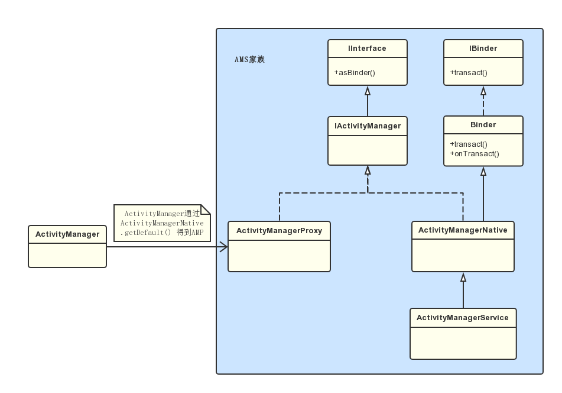
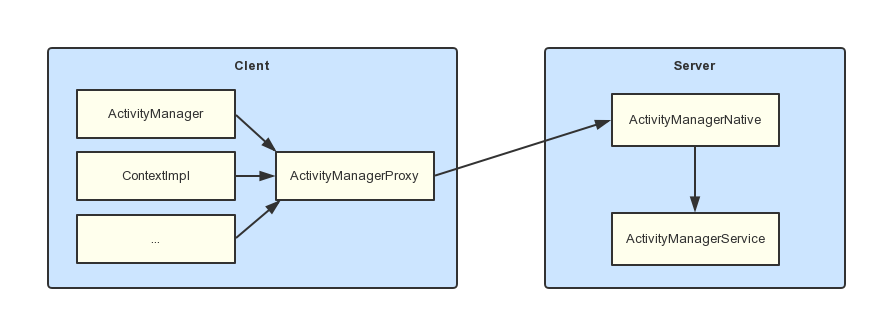

# ActivityManagerService

## 概述

　　AMS 是系统的引导服务，应用进程的启动、切换和调度、四大组件的启动和管理都需要 AMS 的支持。从这里可以看出 AMS 的功能会十分的繁多，当然它并不是一个类承担这个重责，它有一些关联类。

## AMS 的启动流程

　　AMS 的启动是在 SystemServer 进程中启动的，从 SystemServer 的 main 方法进入。

### SystemServer#main

```java
    public static void main(String[] args) {
        new SystemServer().run();
    }
```

　　main 方法中只调用了 SystemServer 的 run 方法。

### SystemServer#run

```java
    private void run() {
            ...

            // Initialize native services.
                // 加载了动态库 libandroid_servers.so
            System.loadLibrary("android_servers");

            ...

            // Create the system service manager.
                // 创建 SystemServiceMananger ,它会对系统的服务进行创建、启动和生命周期管理。
            mSystemServiceManager = new SystemServiceManager(mSystemContext);
            mSystemServiceManager.setRuntimeRestarted(mRuntimeRestart);
            LocalServices.addService(SystemServiceManager.class, mSystemServiceManager);
            ...

        // Start services.
        try {
            traceBeginAndSlog("StartServices");
            // 用 SystemServiceManager 启动 ActivityManangerService、PowerManangerService、PackageManangerService 等服务
            startBootstrapServices();
            // 启动 BatteryService、UsageStatsService 和 WebViewUpdateService
            startCoreServices();
            // 启动 CameraService、AlarmManagerService、VrManangerService 等服务。
            startOtherServices();
            SystemServerInitThreadPool.shutdown();
        } catch (Throwable ex) {
            Slog.e("System", "******************************************");
            Slog.e("System", "************ Failure starting system services", ex);
            throw ex;
        } finally {
            traceEnd();
        }

        ...
    }
```

　　SystemServer 的 run 方法中调用 startBootstrapServices、startCoreServices、startOtherServices 三个方法去启动服务，这些服务的父类均为 SystemService。官方把系统服务分为了三种类型，分别是引导服务、核心服务和其他服务，其中其他服务是一些非紧要和一些不需要立即启动的服务。系统服务总共大约有 80多个。

### SystemServer#startBootstrapServices

```java
    private void startBootstrapServices() {
        ...

        // Activity manager runs the show.
        traceBeginAndSlog("StartActivityManager");
                // 调用了 SystemServiceMananger 的 startService 方法，参数是 ActivityManagerService.Lifecycle.class
        mActivityManagerService = mSystemServiceManager.startService(
                ActivityManagerService.Lifecycle.class).getService();
        mActivityManagerService.setSystemServiceManager(mSystemServiceManager);
        mActivityManagerService.setInstaller(installer);
        traceEnd();

        ...
    }
```

　　在 SystemServer 的 startBootstrapService 方法中调用了 SystemServiceMananger 的 startService 方法，参数是 ActivityManagerService.Lifecycle.class。

### SystemServiceManager#startService

```java
    public <T extends SystemService> T startService(Class<T> serviceClass) {
        try {
            ...

            // Create the service.
            ...
            final T service;
            try {
                // 得到传进来的 Lifecycle 的构造器 constructor
                Constructor<T> constructor = serviceClass.getConstructor(Context.class);
                // 创建 Lifecycle 类型的 service 对象
                service = constructor.newInstance(mContext);
            } catch (xxxException ex) {
                ...
            }

            startService(service);
            // 返回 service
            return service;
        } finally {
            Trace.traceEnd(Trace.TRACE_TAG_SYSTEM_SERVER);
        }
    }

    public void startService(@NonNull final SystemService service) {
        // Register it.
        // 将创建的 service 添加到 ArrayList 类型的 mServices 对象中完成注册
        mServices.add(service);
        // Start it.
        long time = System.currentTimeMillis();
        try {
            // 调用 service 的 onStart 方法来启动 service
            service.onStart();
        } catch (RuntimeException ex) {
            ...
        }
        ...
    }
```

　　startService 方法传入的参数是 Lifecycle.class，Lifecycle 继承自 SystemService。

　　首先通过反射创建 Lifecycle 实例：先得到 Lifecycle 的构造器 constructor，然后调用 constructor 的 newInstance 方法来创建 Lifecycle 类型的 service 对象。

　　接着将刚创建的 service 添加到 ArrayList 类型的 mService 对象中完成注册。

　　然后调用 service 的 onStart 方法来启动 service。

　　最后返回该 service。

### Lifecycle

　　Lifecycle 是 ActivityManagerService 的内部类。

```java
    public static final class Lifecycle extends SystemService {
        private final ActivityManagerService mService;

        public Lifecycle(Context context) {
            super(context);
            // 创建 ActivityManagerService 实例
            mService = new ActivityManagerService(context);
        }

        @Override
        public void onStart() {
            // 调用 ActivityManagerService 的 start 方法
            mService.start();
        }

        public ActivityManagerService getService() {
            // 返回 ActivityManagerService 实例
            return mService;
        }
    }
```

　　在 SystemServiceManager  的 startService 方法中通过反射创建了 Lifecycle 实例的时候，会调用 Lifecycle 的构造方法，在里面会创建 AMS 实例。

　　在 SystemServiceManager  的 startService 方法中调用 Lifecycle 类型的 service 的 onStart 方法时，实际上时调用了 AMS 的 start 方法。

　　在 Systemserver 的 startBootstrapServices 方法中调用的 `mActivityManagerService = mSystemServiceManager.startService(
                ActivityManagerService.Lifecycle.class).getService();` 就是 ActivityManagerService 的对象。

### 总结

　　SystemServiceMananger 的 startService 方法最终会返回 Lifecycle 的 getService 方法，这个方法会返回 AMS 类型的 mService 对象，这样 AMS 实例就会被创建并且返回。

## AMS 与进程启动

　　要启动一个应用程序，首先要保证这个应用程序所需要的应用程序进程已经被启动。

　　AMS 在启动应用程序时会检查这个应用程序需要的应用程序进程是否存在，不存在就会请求进程将需要的应用程序进程启动。

　　Service 的启动过程中会调用 ActiveServices 的 bringUpServiceLocked 方法。

### ActiveServices#bringUpServiceLocked

```java
    private String bringUpServiceLocked(ServiceRecord r, int intentFlags, boolean execInFg,
            boolean whileRestarting, boolean permissionsReviewRequired)
            throws TransactionTooLargeException {
        ...
         

        // 得到 ServiceRecord 的 processName 的值赋值给 procName
        // 其中 ServiceRecord 用来描述 Service 的 android:process 属性
        final String procName = r.processName;
        String hostingType = "service";
        ProcessRecord app;

        if (!isolated) {
            // 将 procName 和 Service 的 uid 传入到 AMS 的 getProcessRecordLocked 方法中，来查询是否存在一个与 Service 对应的 ProcessRecord 类型的对象 app
            // ProcessRecord 主要用来记录运行的应用程序进程的信息
            app = mAm.getProcessRecordLocked(procName, r.appInfo.uid, false);
            if (DEBUG_MU) Slog.v(TAG_MU, "bringUpServiceLocked: appInfo.uid=" + r.appInfo.uid
                        + " app=" + app);
            if (app != null && app.thread != null) {
                try {
                    app.addPackage(r.appInfo.packageName, r.appInfo.versionCode, mAm.mProcessStats);
                    realStartServiceLocked(r, app, execInFg);
                    return null;
                } catch (TransactionTooLargeException e) {
                    throw e;
                } catch (RemoteException e) {
                    Slog.w(TAG, "Exception when starting service " + r.shortName, e);
                }

                // If a dead object exception was thrown -- fall through to
                // restart the application.
            }
        } else {
            // If this service runs in an isolated process, then each time
            // we call startProcessLocked() we will get a new isolated
            // process, starting another process if we are currently waiting
            // for a previous process to come up.  To deal with this, we store
            // in the service any current isolated process it is running in or
            // waiting to have come up.
            app = r.isolatedProc;
            if (WebViewZygote.isMultiprocessEnabled()
                    && r.serviceInfo.packageName.equals(WebViewZygote.getPackageName())) {
                hostingType = "webview_service";
            }
        }

        // Not running -- get it started, and enqueue this service record
        // to be executed when the app comes up.
        // 判断 service 对应的 app 为 null 则说明用来运行 Service 的 应用进程不存在
        if (app == null && !permissionsReviewRequired) {
            // 调用 AMS 的 startProcessLocked 方法来创建对应的应用程序进程。
            if ((app=mAm.startProcessLocked(procName, r.appInfo, true, intentFlags,
                    hostingType, r.name, false, isolated, false)) == null) {
                String msg = "Unable to launch app "
                        + r.appInfo.packageName + "/"
                        + r.appInfo.uid + " for service "
                        + r.intent.getIntent() + ": process is bad";
                Slog.w(TAG, msg);
                bringDownServiceLocked(r);
                return msg;
            }
            if (isolated) {
                r.isolatedProc = app;
            }
        }
        
        ...
    }
```


## AMS 家族

　　ActivityManager 是一个和 AMS 相关联的类，它主要对运行中的 Activity 进行管理，这些管理工作并不是由 ActivityManager 来处理的，而是交由 AMS 来处理，ActivityManager 中的方法就会通过 ActivityManagerNative（AMN）的 getDefault 方法来得到 ActivityManagerProxy（AMP），通过 AMP 就可以和 AMN 进行通信，而 AMN 是一个抽象类，它会将功能交由它的子类 AMS 来处理，因此，AMP 就是 AMS 的代理类。AMS 作为系统核心服务，很多 API 是不会暴露给 ActivityManager 的，因此 ActivityManager 并不算 AMS 家族一份子。

　　以 Activity 的启动过程举例，Activity 的启动过程中会调用 Instrumentation 的 execStartActivity 方法。

### Instrumentation#execStartActivity

```java
    public ActivityResult execStartActivity(
            Context who, IBinder contextThread, IBinder token, Activity target,
            Intent intent, int requestCode, Bundle options) {
        ...
        try {
            intent.migrateExtraStreamToClipData();
            intent.prepareToLeaveProcess(who);
            int result = ActivityManager.getService()
                .startActivity(whoThread, who.getBasePackageName(), intent,
                        intent.resolveTypeIfNeeded(who.getContentResolver()),
                        token, target != null ? target.mEmbeddedID : null,
                        requestCode, 0, null, options);
            checkStartActivityResult(result, intent);
        } catch (RemoteException e) {
            throw new RuntimeException("Failure from system", e);
        }
        return null;
    }
```

　　execStartActivity 方法中会调用 AMN 的 getDefault 来获取 AMS 的代理类 AMP，接着调用了 AMP 的 startActivity 方法。

#### ActivityManagerNative#getDefault

```java
    static public IActivityManager getDefault() {
        return gDefault.get();
    }

    private static final Singleton<IActivityManager> gDefault = new Singleton<IActivityManager>() {
        protected IActivityManager create() {
          	// 得到名为 “activity” 的 Service 引用，也就是 IBinder 类型 的 AMS 的引用
            IBinder b = ServiceManager.getService("activity");
            if (false) {
                Log.v("ActivityManager", "default service binder = " + b);
            }
          	// 将 b 封装成 AMP 类型对象，并将它保存到 gDefault 中
          	// 此后调用 AMN 的 getDefault 方法就会直接获得 AMS 的代理对象 AMP
            IActivityManager am = asInterface(b);
            if (false) {
                Log.v("ActivityManager", "default service = " + am);
            }
            return am;
        }
    };
```

　　getDefault 方法调用了 gDefault 的 get 方法，gDefault 是一个 Singleton 类。最后返回 AMP 对象。

##### ActivityManagerNative#asInterface

```java
    static public IActivityManager asInterface(IBinder obj) {
        if (obj == null) {
            return null;
        }
        IActivityManager in =
            (IActivityManager)obj.queryLocalInterface(descriptor);
        if (in != null) {
            return in;
        }

        return new ActivityManagerProxy(obj);
    }
```

　　asInterface 方法的主要作用就是将 IBinder 类型的 AMS 引用封装成 AMP。

##### ActivityManagerProxy 的构造方法

　　ActivityManagerProxy 是 ActivityManagerNative 的内部类。

```java
class ActivityManagerProxy implements IActivityManager
{
    public ActivityManagerProxy(IBinder remote)
    {
        mRemote = remote;
    }
}
```

　　AMP 的构造方法中将 AMS 的引用赋值给变量 mRemote，这样在 AMP 中就可以使用 AMS 了。

　　其中 IActivityManager 是一个接口，AMN 和 AMP 都实现了这个接口，用于实现代理模式和 Binder 通信。

#### ActivityManagerProxy#startActivity

　　再回到 Instrumentation 的 execStartActivity 方法，查看 AMP 的 startActivity 方法。

　　AMP 是 AMN 的内部类。

```java
    public int startActivity(IApplicationThread caller, String callingPackage, Intent intent,
            String resolvedType, IBinder resultTo, String resultWho, int requestCode,
            int startFlags, ProfilerInfo profilerInfo, Bundle options) throws RemoteException {
        ...
        data.writeInt(requestCode);
        data.writeInt(startFlags);
        ...
        // 通过 IBinder 类型对象 mRemote 向服务端 AMS 发送一个 START_ACTIVITY_TRANSACTION 类型的进程间通信请求
        mRemote.transact(START_ACTIVITY_TRANSACTION, data, reply, 0);
        reply.readException();
        int result = reply.readInt();
        reply.recycle();
        data.recycle();
        return result;
    }

```

　　首先会将传入的参数写入到 Parcel 类型的 data 中，通过 IBinder 类型对象 mRemote（AMS 的引用）向服务端的 AMS 发送一个 START_ACTIVITY_TRANSACTION 类型的进程间通信请求。那么服务端 AMS 就会从 Binder 线程池中读取客户端发送来的数据，最终会调用 AMN 的 onTransact 方法。

##### ActiveManagerNative#onTransact

```java
    @Override
    public boolean onTransact(int code, Parcel data, Parcel reply, int flags)
            throws RemoteException {
        switch (code) {
        case START_ACTIVITY_TRANSACTION:
        {
            ...
            int result = startActivity(app, callingPackage, intent, resolvedType,
                    resultTo, resultWho, requestCode, startFlags, profilerInfo, options);
            reply.writeNoException();
            reply.writeInt(result);
            return true;
        }
        ...
    }
      
    return super.onTransact(code, data, reply, flags);
}
```

　　ActivityManagerNative 的 onTransact 方法中会调用 AMS 的 startActivity 方法。

##### ActivityManagerService#startActivity

```java
    @Override
    public final int startActivity(IApplicationThread caller, String callingPackage,
            Intent intent, String resolvedType, IBinder resultTo, String resultWho, int requestCode,
            int startFlags, ProfilerInfo profilerInfo, Bundle bOptions) {
        return startActivityAsUser(caller, callingPackage, intent, resolvedType, resultTo,
                resultWho, requestCode, startFlags, profilerInfo, bOptions,
                UserHandle.getCallingUserId());
    }
```

　　ActivityManagerService 的 startActivity 会 return startActivityAsUser 方法。

##### ActivityManagerService#startActivityAsUser

```java
    @Override
    public final int startActivityAsUser(IApplicationThread caller, String callingPackage,
            Intent intent, String resolvedType, IBinder resultTo, String resultWho, int requestCode,
            int startFlags, ProfilerInfo profilerInfo, Bundle bOptions, int userId) {
        enforceNotIsolatedCaller("startActivity");
        userId = mUserController.handleIncomingUser(Binder.getCallingPid(), Binder.getCallingUid(),
                userId, false, ALLOW_FULL_ONLY, "startActivity", null);
        // TODO: Switch to user app stacks here.
        return mActivityStarter.startActivityMayWait(caller, -1, callingPackage, intent,
                resolvedType, null, null, resultTo, resultWho, requestCode, startFlags,
                profilerInfo, null, null, bOptions, false, userId, null, null);
    }
```

　　startActivityAsUser 方法最后会 return mActivityStarter.startActivityMayWait 方法。

### 总结

　　在 Activity 的启动过程中提到了 AMP、AMN 和 AMS ，它们共同组成了 AMS 家族的主要部分，如下图所示：



　　AMP 是 AMN 的内部类，它们都实现了 IActivityManager 接口，这样它们就可以实现代理模式。

　　具体来讲是远程代理：AMP 和 AMN 都是运行在两个进程的，AMP 是 Client 端，AMN 则是 Server 端，而 Server 端中具体的功能都是由 AMN 的子类 AMS 来实现的，因此，AMP 就是 AMS 在 Client 端的代理类。AMN 又实现了 Binder 类，这样 AMP 可以和 AMS 通过 Binder 来进行进程间通信。

　　ActivityManager 通过 AMN 的 getDefault 方法得到 AMP，通过 AMP 就可以和 AMN 进行通信，也就是间接的与 AMS 进行通信。

　　除了 ActivityManager ，其他想要与 AMS 进行通信的类都需要通过 AMP，如下图：



## 参考文章

1. [请从 AMS、WMS、PMS 的角度考虑，以及继承是如何启动的？开机 SystemServer 到 ActivityManagerService 启动过程](https://www.cnblogs.com/sunkeji/articles/7650482.html)
2. [Android 解析 ActivityManagerService（一）AMS 启动流程和 AMS 家族](https://blog.csdn.net/itachi85/article/details/76405596)
3. [Android解析ActivityManagerService（二）ActivityTask和Activity栈管理](https://blog.csdn.net/itachi85/article/details/77542286)