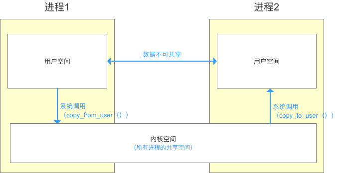

# Binder 机制

# 1. 定义

　　是一种实现 android 跨进程通讯的方式，有物理上的虚拟物理设备驱动，和 Binder 类组成。

# 2. 前言

　　android是基于linux内核的，先了解一些Linux的基础知识。

## 2.1. Linux 进程空间划分

- 一个进程空间分为 用户空间 & 内核空间（`Kernel`），即把进程内 用户 & 内核 隔离开来，所有进程共用1个内核空间。

- 二者区别：

  1. 进程间，用户空间的数据不可共享，所以用户空间 = 不可共享空间
  2. 进程间，内核空间的数据可共享，所以内核空间 = 可共享空间

- 进程内 用户空间 & 内核空间 进行交互 需通过 系统调用，

  主要通过函数：
   copy_from_user（）：将用户空间的数据拷贝到内核空间
   copy_to_user（）：将内核空间的数据拷贝到用户空间



## 2.2. 进程隔离

　　为了保证 安全性 & 独立性，一个进程 不能直接操作或者访问另一个进程，即`Android`的进程是相互独立、隔离的。

## 2.3. 跨进程通信（ `IPC` ）

- 隔离后，由于某些需求，进程间 需要合作 / 交互
- 跨进程间通信的原理
  1. 先通过 进程间 的内核空间进行 数据交互
  2. 再通过 进程内 的用户空间 & 内核空间进行 数据交互，从而实现 进程间的用户空间 的数据交互


　　而`Binder`，就是充当 连接 两个进程（内核空间）的通道。

## 2.4. 传统跨进程通信的基本原理


跨进程通讯原理.png

　　而 Binder 的作用则是：连接 两个进程，实现了mmap()系统调用，主要负责 创建数据接收的缓存空间 & 管理数据接收缓存，传统的跨进程通信需拷贝数据 2 次，但 Binder 机制只需 1 次，主要是使用到了内存映射。

## 2.5. 什么是内存映射呢？

　　内存映射是关联 进程中的1个虚拟内存区域 & 1个磁盘上的对象，使得二者存在映射关系。


内存映射原理.png


　　内存映射的实现过程主要是通过 Linux 系统下的系统调用函数： mmap（），该函数的作用 = 创建虚拟内存区域 + 与共享对象建立映射关系。

## 2.6. 内存映射的作用

1. 实现内存共享：如 跨进程通信
2. 提高数据读 / 写效率 ：如 文件读 / 写操作

# 3. Binder


　　所以 Binder 驱动一共有两个作用
 1.创建接受缓存区
 2.通知 client 和 service 数据准备就绪
 3.管理线程

　　Binder驱动 属于 进程空间的 内核空间，可进行进程间 & 进程内交互


简单示意图.png

## 3.1. Binder请求的线程管理

　　Binder 模型的线程管理 采用 Binder 驱动的线程池，并由 Binder 驱动自身进行管理。

　　一个进程的 Binder 线程数默认最大是 16，超过的请求会被阻塞等待空闲的 Binder 线程。

## 3.2. Android中的Binder实现机制

　　android 中提供了 Binder 实体类，Binder 实体是 Server进程在 Binder 驱动中的存在形式。

　　该对象保存 Server 和 ServiceManager 的信息（保存在内核空间中），Binder 驱动通过内核空间的 Binder 实体找到用户空间的 Server 对象，注册服务后，Binder 驱动持有 Server 进程创建的 Binder 实体。

```dart
public class Binder implement IBinder{
    // Binder 机制在 Android 中的实现主要依靠的是 Binder 类，其实现了 IBinder 接口
    // IBinder 接口：定义了远程操作对象的基本接口，代表了一种跨进程传输的能力
    // 系统会为每个实现了 IBinder 接口的对象提供跨进程传输能力
    // 即 Binder 类对象具备了跨进程传输的能力

        void attachInterface(IInterface plus, String descriptor)；
       	  // 作用：
          // 1. 将（descriptor，plus）作为（key,value）对存入到 Binder 对象中的一个 Map<String,IInterface> 对象中
          // 2. 之后，Binder 对象可根据 descriptor 通过 queryLocalIInterface（） 获得对应 IInterface 对象（即 plus）的引用，可依靠该引用完成对请求方法的调用

        IInterface queryLocalInterface(Stringdescriptor) ；
        // 作用：根据 参数 descriptor 查找相应的 IInterface 对象（即plus引用）

        boolean onTransact(int code, Parcel data, Parcel reply, int flags)；
        // 定义：继承自 IBinder 接口的
        // 作用：执行 Client 进程所请求的目标方法（子类需要复写）
        // 参数说明：
        // code：Client 进程请求方法标识符。即 Server 进程根据该标识确定所请求的目标方法
        // data：目标方法的参数。（Client 进程传进来的，此处就是整数 a 和 b）
        // reply：目标方法执行后的结果（返回给 Client 进程）
        // 注：运行在 Server 进程的 Binder 线程池中；当 Client 进程发起远程请求时，远程请求会要求系统底层执行回调该方法

        final class BinderProxy implements IBinder {
         // 即 Server 进程创建的 Binder 对象的代理对象类
         // 该类属于 Binder 的内部类
        }
        // 回到分析1原处
}
```


绑定服务流程.png

　　流程总结：客户端通过 bindService，通过 Binder 驱动查询 ServiceManager 是否已经注册该服务，如果没有注册，Service 进程会向 Binder 驱动发起服务注册请求，一旦注册，调用该服务的 onBind 返回一个 Binder 对象到 Binder 驱动，已经注册则意味着 Binder 驱动内包含这个 Binder 对象，Binder 驱动返回一个 BinderProxy 对象，并通过回调，传递给客户端，客户端通过这个 BinderProxy( 在 java 层仍然是 Binder 对象)操作 Binder 驱动内的 Binder 对象（transact 方法），Binder 驱动含有很多的 Binder 对象，它们是通过 InterfaceToken 区分不同服务的。


Binder总示意图.png

# 4. 参考文章

1. [Android Binder机制全面解析](https://www.jianshu.com/p/b5cc1ef9f917)
2. [图文详解 Android Binder跨进程通信机制 原理](https://www.cnblogs.com/xinmengwuheng/p/7070167.html)