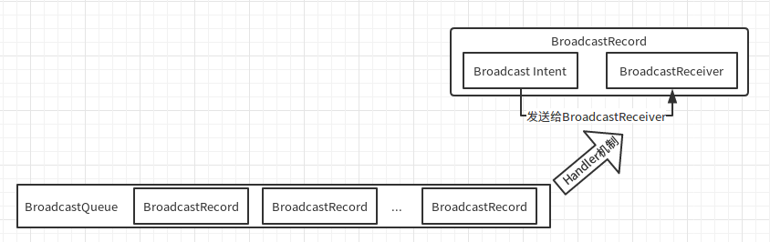

# BroadcastReceiver 的实现原理

# 1. 采用的模型

　　Android 中的广播使用了设计模式中的观察者模式：基于消息的发布 / 订阅事件模型。Android 将广播的发送者和接受者解耦，使得系统方便集成、更易扩展。

## 1.1. 模型讲解

　　模型中有 3 个角色：1.消息订阅者（广播接受者），2.消息发布者（广播发布者），3.消息中心（AMS，即 Activity Manager Service）。


# 2. 静态广播的注册

　　静态广播是通过 PackageManagerService 在启动的时候扫描已安装的应用去注册的。

　　在 PackageManagerservice 的构造方法中，会去扫描应用安装目录，顺序是先扫描系统应用安装目录再去扫描第三方应用安装目录。

　　PackageManagerService.scanDirLI 就是用于扫描目录的方法：
```java
//用于扫描目录
private void scanDirLI(File dir, final int parseFlags, int scanFlags, long currentTime) {				
    final File[] files = dir.listFiles();
    if (ArrayUtils.isEmpty(files)) {
        Log.d(TAG, "No files in app dir " + dir);
        return;
    }
	...
	for (File file : files) {
      	// isApkFile() 方法将目录下的所有后缀为 “.apk” 的文件过滤出来
    		final boolean isPackage = (isApkFile(file) || file.isDirectory())
            && !PackageInstallerService.isStageName(file.getName());
        if (!isPackage) {
            // Ignore entries which are not packages
            continue;
        }
        try {
            // 调用 scanPackageTracedLI 方法继续扫描
            scanPackageTracedLI(file, parseFlags | PackageParser.PARSE_MUST_BE_APK,
                   scanFlags, currentTime, null);
        } catch (PackageManagerException e) {
            Slog.w(TAG, "Failed to parse " + file + ": " + e.getMessage());

            // Delete invalid userdata apps
            if ((parseFlags & PackageParser.PARSE_IS_SYSTEM) == 0 &&
                    e.error == PackageManager.INSTALL_FAILED_INVALID_APK) {
                logCriticalInfo(Log.WARN, "Deleting invalid package at " + file);
                removeCodePathLI(file);
            }
        }
    }
}
```
　　可以看到，它通过 isApkFile() 方法将目录下的所有后缀为 “.apk” 的文件传给 scanPackageTrancedLI() 方法去处理。

　　而 scanPackageTrancedLI(File scanFile, final int parseFlags, int scanFlags, long currentTime, UserHandle user) 内部会调用 scanPackageLI(File scanFile, int parseFlags, int scanFlags, long currentTime, UserHandle user)方法：
```java
    /**
     *  Traces a package scan.
     *  追踪包扫描
     *  @see #scanPackageLI(File, int, int, long, UserHandle)
     */
    private PackageParser.Package scanPackageTracedLI(File scanFile, final int parseFlags,
            int scanFlags, long currentTime, UserHandle user) throws PackageManagerException {
        Trace.traceBegin(TRACE_TAG_PACKAGE_MANAGER, "scanPackage");
        try {
            // 调用 scanPackageLI 方法扫描
            return scanPackageLI(scanFile, parseFlags, scanFlags, currentTime, user);
        } finally {
            Trace.traceEnd(TRACE_TAG_PACKAGE_MANAGER);
        }
    }
```
　　在 scanPackageLI(File scanFile, int parseFlags, int scanFlags, long currentTime, UserHandle user)内部会调用它的重载方法 scanPackageLI(PackageParser.Package pkg, File scanFile, final int policyFlags, int scanFlags, long currentTime, UserHandle user)：
```java
    /**
     *  Scans a package and returns the newly parsed package.
     *  扫描包并返回一个新解析的包
     *  Returns {@code null} in case of errors and the error code is stored in mLastScanError
     */
    private PackageParser.Package scanPackageLI(File scanFile, int parseFlags, int scanFlags,
            long currentTime, UserHandle user) throws PackageManagerException {
        if (DEBUG_INSTALL) Slog.d(TAG, "Parsing: " + scanFile);
        PackageParser pp = new PackageParser();
        pp.setSeparateProcesses(mSeparateProcesses);
        pp.setOnlyCoreApps(mOnlyCore);
        pp.setDisplayMetrics(mMetrics);

        if ((scanFlags & SCAN_TRUSTED_OVERLAY) != 0) {
            parseFlags |= PackageParser.PARSE_TRUSTED_OVERLAY;
        }

        Trace.traceBegin(TRACE_TAG_PACKAGE_MANAGER, "parsePackage");
        final PackageParser.Package pkg;
        try {
            pkg = pp.parsePackage(scanFile, parseFlags);
        } catch (PackageParserException e) {
            throw PackageManagerException.from(e);
        } finally {
            Trace.traceEnd(TRACE_TAG_PACKAGE_MANAGER);
        }
		// 调用 scanPackageLI 扫描文件
        return scanPackageLI(pkg, scanFile, parseFlags, scanFlags, currentTime, user);
    }
```
　　在 scanPackageLI(PackageParser.Package pkg, File scanFile, final int policyFlags, int scanFlags, long currentTime, UserHandle user) 内部会调用 scanPackageInternalLI(PackageParser.Package pkg, File scanFile, int policyFlags, int scanFlags, long currentTime, UserHandle user) 扫描文件：
```java
    /**
     *  Scans a package and returns the newly parsed package.
     *  扫描包并返回一个新解析的包
     *  @throws PackageManagerException on a parse error.
     */
    private PackageParser.Package scanPackageLI(PackageParser.Package pkg, File scanFile,
            final int policyFlags, int scanFlags, long currentTime, UserHandle user)
            throws PackageManagerException {
        // If the package has children and this is the first dive in the function
        // we scan the package with the SCAN_CHECK_ONLY flag set to see whether all
        // packages (parent and children) would be successfully scanned before the
        // actual scan since scanning mutates internal state and we want to atomically
        // install the package and its children.
        if ((scanFlags & SCAN_CHECK_ONLY) == 0) {
            if (pkg.childPackages != null && pkg.childPackages.size() > 0) {
                scanFlags |= SCAN_CHECK_ONLY;
            }
        } else {
            scanFlags &= ~SCAN_CHECK_ONLY;
        }

        // Scan the parent
        // 扫描父文件
        PackageParser.Package scannedPkg = scanPackageInternalLI(pkg, scanFile, policyFlags,
                scanFlags, currentTime, user);

        // Scan the children
        // 扫描子文件
        final int childCount = (pkg.childPackages != null) ? pkg.childPackages.size() : 0;
        for (int i = 0; i < childCount; i++) {
            PackageParser.Package childPackage = pkg.childPackages.get(i);
            scanPackageInternalLI(childPackage, scanFile, policyFlags, scanFlags,
                    currentTime, user);
        }


        if ((scanFlags & SCAN_CHECK_ONLY) != 0) {
            return scanPackageLI(pkg, scanFile, policyFlags, scanFlags, currentTime, user);
        }

        return scannedPkg;
    }
```
　　在 scanPackageInternalLI(PackageParser.Package pkg, File scanFile, int policyFlags, int scanFlags, long currentTime, UserHandle user) 方法会调用 scanPackageLI(PackageParser.Package pkg, final int policyFlags, int scanFlags, long currentTime, UserHandle user) 方法：
```java
    /**
     *  Scans a package and returns the newly parsed package.
     *  扫描包并返回一个新的解析包
     *  @throws PackageManagerException on a parse error.
     */
    private PackageParser.Package scanPackageInternalLI(PackageParser.Package pkg, File scanFile,
            int policyFlags, int scanFlags, long currentTime, UserHandle user)
            throws PackageManagerException {
        PackageSetting ps = null;
        PackageSetting updatedPkg;
		...

        // Note that we invoke the following method only if we are about to unpack an application
        PackageParser.Package scannedPkg = scanPackageLI(pkg, policyFlags, scanFlags
                | SCAN_UPDATE_SIGNATURE, currentTime, user);

        /*
         * If the system app should be overridden by a previously installed
         * data, hide the system app now and let the /data/app scan pick it up
         * again.
         */
        if (shouldHideSystemApp) {
            synchronized (mPackages) {
                mSettings.disableSystemPackageLPw(pkg.packageName, true);
            }
        }

        return scannedPkg;
    }
```
　　在 scanPackageInternalLI(PackageParser.Package pkg, File scanFile, int policyFlags, int scanFlags, long currentTime, UserHandle user) 方法中调用了 scanPackageLI(PackageParser.Package pkg, final int policyFlags, int scanFlags, long currentTime, UserHandle user) 方法：

```java
    private PackageParser.Package scanPackageLI(PackageParser.Package pkg, final int policyFlags, int scanFlags, long currentTime, UserHandle user) throws PackageManagerException {
        boolean success = false;
        try {
          	// 解析 pkg
            final PackageParser.Package res = scanPackageDirtyLI(pkg, policyFlags, scanFlags,
                    currentTime, user);
            success = true;
            return res;
        } finally {
            if (!success && (scanFlags & SCAN_DELETE_DATA_ON_FAILURES) != 0) {
                // DELETE_DATA_ON_FAILURES is only used by frozen paths
                destroyAppDataLIF(pkg, UserHandle.USER_ALL,
                        StorageManager.FLAG_STORAGE_DE | StorageManager.FLAG_STORAGE_CE);
                destroyAppProfilesLIF(pkg, UserHandle.USER_ALL);
            }
        }
    }
```
　　在  scanPackageLI(PackageParser.Package pkg, final int policyFlags, int scanFlags, long currentTime, UserHandle user) 方法调用了 scanPackageDirtyLI(PackageParser.Package pkg, final int policyFlags, final int scanFlags, long currentTime, UserHandle user) 方法，scanPackageDirtyLI() 方法会解析 Package 并且将 AndroidManifest.xml 中注册的 BroadcastReceiver 保存下来 ：
```java
    private PackageParser.Package scanPackageDirtyLI(PackageParser.Package pkg,
            final int policyFlags, final int scanFlags, long currentTime, UserHandle user)
            throws PackageManagerException {
			...
		    N = pkg.services.size();
            r = null;
      		// 遍历包
            for (i=0; i<N; i++) {
                PackageParser.Service s = pkg.services.get(i);
                s.info.processName = fixProcessName(pkg.applicationInfo.processName,
                        s.info.processName, pkg.applicationInfo.uid);
              	// 保存注册的组件在 mServices
                mServices.addService(s);
                if ((policyFlags&PackageParser.PARSE_CHATTY) != 0) {
                    if (r == null) {
                        r = new StringBuilder(256);
                    } else {
                        r.append(' ');
                    }
                    r.append(s.info.name);
                }
            }
		...
	}
```
　　所以从上面获取静态广播的流程可以看出：系统应用的广播先于第三方应用的广播注册，而安装在同一目录下的应用的静态广播的注册顺序是按照 File.list 列出来的 apk 的顺序注册的，他们的注册顺序就决定了它们接收广播的顺序。

　　通过静态广播的注册流程，已经将静态广播注册到了 PackageManagerService 的 mReceivers 中，可以使用 PackageManagerService.queryIntentReceivers 方法查询 intent 对应的静态广播：
```java
    @Override
    public @NonNull ParceledListSlice<ResolveInfo> queryIntentReceivers(Intent intent,
            String resolvedType, int flags, int userId) {
        return new ParceledListSlice<>(
          		// 查询注册的 BroadcastReceiver
                queryIntentReceiversInternal(intent, resolvedType, flags, userId));
    }
```
　　queryIntentReceivers() 方法调用了 queryIntentReceiversInternal(Intent intent, String resolvedType, int flags, int userId) 方法来查询：
```java
    private @NonNull List<ResolveInfo> queryIntentReceiversInternal(Intent intent,
            String resolvedType, int flags, int userId) {
        if (!sUserManager.exists(userId)) return Collections.emptyList();
        flags = updateFlagsForResolve(flags, userId, intent);
        ComponentName comp = intent.getComponent();
        if (comp == null) {
            if (intent.getSelector() != null) {
                intent = intent.getSelector();
                comp = intent.getComponent();
            }
        }
        // 根据 Intent 的 component 来查找 BroadcaseReceiver
        if (comp != null) {
            List<ResolveInfo> list = new ArrayList<ResolveInfo>(1);
            ActivityInfo ai = getReceiverInfo(comp, flags, userId);
            if (ai != null) {
                ResolveInfo ri = new ResolveInfo();
                ri.activityInfo = ai;
                list.add(ri);
            }
            return list;
        }

        // reader
        synchronized (mPackages) {
            String pkgName = intent.getPackage();
            if (pkgName == null) {
                return mReceivers.queryIntent(intent, resolvedType, flags, userId);
            }
            final PackageParser.Package pkg = mPackages.get(pkgName);
            if (pkg != null) {
            	// 查询注册的 BroadcaseReceiver
                return mReceivers.queryIntentForPackage(intent, resolvedType, flags, pkg.receivers,
                        userId);
            }
            return Collections.emptyList();
        }
    }
```

# 3. 动态广播的注册

　　调用 Context.registerReceiver 最后会调用 ActivityManagerService.registerReceiver：
```java
    public Intent registerReceiver(IApplicationThread caller, String callerPackage,
            IIntentReceiver receiver, IntentFilter filter, String permission, int userId) {
		...
		ReceiverList rl = mRegisteredReceivers.get(receiver.asBinder());
		...
		BroadcastFilter bf = new BroadcastFilter(filter, rl, callerPackage,
                    permission, callingUid, userId);
        rl.add(bf);
    	// 动态注册广播保存在 mReceiverResolver 
		mReceiverResolver.addFilter(bf);
		...
	}
```
　　通过 `mReceiverResolver.queryIntent()` 就能获得 intent 对应的动态广播了。

# 4. 发送广播

　　`ContextImpl.sendBroadcast` 中会调用 `ActivityManagerService.getDefault().broadcastIntent()` 发送广播：
```java
    @Override
    public void sendBroadcast(Intent intent) {
        warnIfCallingFromSystemProcess();
        String resolvedType = intent.resolveTypeIfNeeded(getContentResolver());
        try {
            intent.prepareToLeaveProcess(this);
          	// 调用 AMS 的 broadcastIntent 方法
            ActivityManagerNative.getDefault().broadcastIntent(
                    mMainThread.getApplicationThread(), intent, resolvedType, null,
                    Activity.RESULT_OK, null, null, null, AppOpsManager.OP_NONE, null, false, false,
                    getUserId());
        } catch (RemoteException e) {
            throw e.rethrowFromSystemServer();
        }
    }
```
　　实际是调用 ActivityManagerService.broadcastIntent：
```java
    public final int broadcastIntent(IApplicationThread caller,
            Intent intent, String resolvedType, IIntentReceiver resultTo,
            int resultCode, String resultData, Bundle resultExtras,
            String[] requiredPermissions, int appOp, Bundle bOptions,
            boolean serialized, boolean sticky, int userId) {
        enforceNotIsolatedCaller("broadcastIntent");
        synchronized(this) {
            intent = verifyBroadcastLocked(intent);

            final ProcessRecord callerApp = getRecordForAppLocked(caller);
            final int callingPid = Binder.getCallingPid();
            final int callingUid = Binder.getCallingUid();
            final long origId = Binder.clearCallingIdentity();
          	// 调用 broadcastIntentLocked 方法
            int res = broadcastIntentLocked(callerApp,
                    callerApp != null ? callerApp.info.packageName : null,
                    intent, resolvedType, resultTo, resultCode, resultData, resultExtras,
                    requiredPermissions, appOp, bOptions, serialized, sticky,
                    callingPid, callingUid, userId);
            Binder.restoreCallingIdentity(origId);
            return res;
        }
    }
```
　　ActivityManangerService.broadcastIntent() 中又会调用 ActivityManangerService.broadcastIntentLocked() 方法：
```java
    final int broadcastIntentLocked(ProcessRecord callerApp,
            String callerPackage, Intent intent, String resolvedType,
            IIntentReceiver resultTo, int resultCode, String resultData,
            Bundle resultExtras, String[] requiredPermissions, int appOp, Bundle bOptions,
            boolean ordered, boolean sticky, int callingPid, int callingUid, int userId) {
		...
	    // Figure out who all will receive this broadcast.
		// 静态广播
        List receivers = null;
		// 动态广播
        List<BroadcastFilter> registeredReceivers = null;
		// Need to resolve the intent to interested receivers...
        if ((intent.getFlags()&Intent.FLAG_RECEIVER_REGISTERED_ONLY)
                 == 0) {
			// 查询静态广播
            receivers = collectReceiverComponents(intent, resolvedType, callingUid, users);
        }
		if (intent.getComponent() == null) {
			// 查询动态广播
            if (userId == UserHandle.USER_ALL && callingUid == Process.SHELL_UID) {
                // Query one target user at a time, excluding shell-restricted users
                for (int i = 0; i < users.length; i++) {
                    if (mUserController.hasUserRestriction(
                            UserManager.DISALLOW_DEBUGGING_FEATURES, users[i])) {
                        continue;
                    }
                  	// 获取动态广播
                    List<BroadcastFilter> registeredReceiversForUser =
                            mReceiverResolver.queryIntent(intent,
                                    resolvedType, false, users[i]);
                    if (registeredReceivers == null) {
                        registeredReceivers = registeredReceiversForUser;
                    } else if (registeredReceiversForUser != null) {
                        registeredReceivers.addAll(registeredReceiversForUser);
                    }
                }
            } else {
                registeredReceivers = mReceiverResolver.queryIntent(intent,
                        resolvedType, false, userId);
            }
        }

				final boolean replacePending =
                (intent.getFlags()&Intent.FLAG_RECEIVER_REPLACE_PENDING) != 0;

        int NR = registeredReceivers != null ? registeredReceivers.size() : 0;
        if (!ordered && NR > 0) {
            // If we are not serializing this broadcast, then send the
            // registered receivers separately so they don't wait for the
            // components to be launched.
            if (isCallerSystem) {
                checkBroadcastFromSystem(intent, callerApp, callerPackage, callingUid,
                        isProtectedBroadcast, registeredReceivers);
            }
            final BroadcastQueue queue = broadcastQueueForIntent(intent);
            BroadcastRecord r = new BroadcastRecord(queue, intent, callerApp,
                    callerPackage, callingPid, callingUid, resolvedType, requiredPermissions,
                    appOp, brOptions, registeredReceivers, resultTo, resultCode, resultData,
                    resultExtras, ordered, sticky, false, userId);
            final boolean replaced = replacePending && queue.replaceParallelBroadcastLocked(r);
            if (!replaced) {
				// 发送动态广播
                queue.enqueueParallelBroadcastLocked(r);
                queue.scheduleBroadcastsLocked();
            }
            registeredReceivers = null;
            NR = 0;
        }
		...
		 if ((receivers != null && receivers.size() > 0)
                || resultTo != null) {
            BroadcastQueue queue = broadcastQueueForIntent(intent);
            BroadcastRecord r = new BroadcastRecord(queue, intent, callerApp,
                    callerPackage, callingPid, callingUid, resolvedType,
                    requiredPermissions, appOp, brOptions, receivers, resultTo, resultCode,
                    resultData, resultExtras, ordered, sticky, false, userId);

            boolean replaced = replacePending && queue.replaceOrderedBroadcastLocked(r);
            if (!replaced) {
				// 发送静态广播
                queue.enqueueOrderedBroadcastLocked(r);
                queue.scheduleBroadcastsLocked();
            }
        }
	}
```
　　动态广播会优先于静态广播，从上面代码可以看到，原因就是因为安卓的源代码就是按这个顺序写的。

　　再来看一下 `ActivityManagerService.collectReceiverComponents` 方法，实际上静态广播就是从 PackageManagerService 中查询的：
```java
    private List<ResolveInfo> collectReceiverComponents(Intent intent, String resolvedType,
            int callingUid, int[] users) {
        ...
        // 从 PackageManagerService 中查找静态注册的广播
        List<ResolveInfo> newReceivers = AppGlobals.getPackageManager().queryIntentReceivers(intent, resolvedType, pmFlags, user).getList();
				...
	}
```

# 5. 广播队列

　　从 ActivityManangerService.broadcastIntentLocked 中可以看到，实际上它不是直接将广播发送到 BroadcastReceiver 中的，而是将它包装到 BroadcastRecord 中，再放进 BroadcastQueue：
```java
// 注册广播	
public Intent registerReceiver(IApplicationThread caller, String callerPackage,
            IIntentReceiver receiver, IntentFilter filter, String permission, int userId) {
      // 获取广播队列
 	  final BroadcastQueue queue = broadcastQueueForIntent(intent);
  	  // 包装到 BroadcaseRecord 对象
      BroadcastRecord r = new BroadcastRecord(queue, intent, callerApp,
            callerPackage, callingPid, callingUid, resolvedType, requiredPermissions,
            appOp, brOptions, registeredReceivers, resultTo, resultCode, resultData,
            resultExtras, ordered, sticky, false, userId);
      final boolean replaced = replacePending && queue.replaceParallelBroadcastLocked(r);
     	if (!replaced) {
        	// 发送广播
            queue.enqueueParallelBroadcastLocked(r);
            queue.scheduleBroadcastsLocked();
      }
	}
```
　　enqueueParallelBroadcastLocked() 方法用于并发执行广播的发送，很简单，就是将 BroadcastRecord 放到了 mParallelBroadcasts 中：
```java
    public void enqueueParallelBroadcastLocked(BroadcastRecord r) {
      	// 将 BroadcastRecord 加入到 mParallelBroadcasts 中
        mParallelBroadcasts.add(r);
        r.enqueueClockTime = System.currentTimeMillis();
    }
```
　　scheduleBroadcastsLocked 方法同样很简单，就是向 mHandler 发送了一个 BROADCAST_INTENT_MSG 消息：
```java
    public void scheduleBroadcastsLocked() {
        if (mBroadcastsScheduled) {
            return;
        }
      	// 向 mHandler 发送一条 BROADCAST_INTENT_MSG 消息
        mHandler.sendMessage(mHandler.obtainMessage(BROADCAST_INTENT_MSG, this));
        mBroadcastsScheduled = true;
    }
```
　　再去看看BroadcastQueue： mHandler 在接收到 BROADCAST_INTENT_MSG 消息的处理：
```java
   private final class BroadcastHandler extends Handler {
        public BroadcastHandler(Looper looper) {
            super(looper, null, true);
        }

        @Override
        public void handleMessage(Message msg) {
            switch (msg.what) {
                case BROADCAST_INTENT_MSG: {
                  	// 从队列中获取广播消息并发送
                    processNextBroadcast(true);
                } break;
                case BROADCAST_TIMEOUT_MSG: {
                    synchronized (mService) {
                        broadcastTimeoutLocked(true);
                    }
                } break;
            }
        }
    }
```
　　processNextBroadcast 方法用于从队列中获取广播消息并发送给 BroadcastReceiver，它内部有两个分支，并行处理和串行处理。

# 6. 并行处理

　　例如动态注册的非有序广播等就是使用并行处理，先看并行处理的分支：
```java
    final void processNextBroadcast(boolean fromMsg) {
        synchronized(mService) {
            BroadcastRecord r;

            mService.updateCpuStats();

            if (fromMsg) {
                mBroadcastsScheduled = false;
            }

            // First, deliver any non-serialized broadcasts right away.
            while (mParallelBroadcasts.size() > 0) {
                r = mParallelBroadcasts.remove(0);
                r.dispatchTime = SystemClock.uptimeMillis();
                r.dispatchClockTime = System.currentTimeMillis();
                final int N = r.receivers.size();
                for (int i=0; i<N; i++) {
                    Object target = r.receivers.get(i);
           			// 发送消息给 Receiver
                    deliverToRegisteredReceiverLocked(r, (BroadcastFilter)target, false, i);
                }
                addBroadcastToHistoryLocked(r);
            }
						...
		}
		...
	}
	// 发送消息给 receiver
    private void deliverToRegisteredReceiverLocked(BroadcastRecord r,
            BroadcastFilter filter, boolean ordered, int index) {
		...
		// 获取 BroadcastReceiver 的 Binder
		r.receiver = filter.receiverList.receiver.asBinder();
		...
		// 使用 Binder 机制将消息传递给 BroadcastReceiver
		performReceiveLocked(filter.receiverList.app, filter.receiverList.receiver,
                        new Intent(r.intent), r.resultCode, r.resultData,
                        r.resultExtras, r.ordered, r.initialSticky, r.userId);
		...
	}

    void performReceiveLocked(ProcessRecord app, IIntentReceiver receiver,
            Intent intent, int resultCode, String data, Bundle extras,
            boolean ordered, boolean sticky, int sendingUser) throws RemoteException {
		...
		// 通过 Binder 将消息处理传到应用进程，应用进程内部再使用 Handler 机制，将消息处理放到主线程中
		app.thread.scheduleRegisteredReceiver(receiver, intent, resultCode,data, extras, ordered, sticky, sendingUser, app.repProcState);
		...
	}
```

# 7. 串行处理

　　例如有序广播和静态广播等，会通过 enqueueOrderedBroadcastLocked 传给 BroadcastQueue:
```java
    public void enqueueOrderedBroadcastLocked(BroadcastRecord r) {
        mOrderedBroadcasts.add(r);
        r.enqueueClockTime = System.currentTimeMillis();
    }
```
　　然后在 processNextBroadcast 里面会对 mOrderedBroadcasts 进行特殊处理。
```java
    final void processNextBroadcast(boolean fromMsg) {
		synchronized(mService) {
            BroadcastRecord r;
			// 开始处理有序广播
			// Now take care of the next serialized one...

            // If we are waiting for a process to come up to handle the next
            // broadcast, then do nothing at this point.  Just in case, we
            // check that the process we're waiting for still exists.
            if (mPendingBroadcast != null) {
                if (DEBUG_BROADCAST_LIGHT) Slog.v(TAG_BROADCAST,
                        "processNextBroadcast [" + mQueueName + "]: waiting for "
                        + mPendingBroadcast.curApp);

                boolean isDead;
                synchronized (mService.mPidsSelfLocked) {
                    ProcessRecord proc = mService.mPidsSelfLocked.get(mPendingBroadcast.curApp.pid);
                    isDead = proc == null || proc.crashing;
                }
                if (!isDead) {
                    // It's still alive, so keep waiting
                    return;
                } else {
                    Slog.w(TAG, "pending app  ["
                            + mQueueName + "]" + mPendingBroadcast.curApp
                            + " died before responding to broadcast");
                    mPendingBroadcast.state = BroadcastRecord.IDLE;
                    mPendingBroadcast.nextReceiver = mPendingBroadcastRecvIndex;
                    mPendingBroadcast = null;
                }
            }

            boolean looped = false;
			// 循环处理有序广播
			do {
                if (mOrderedBroadcasts.size() == 0) {
                    // No more broadcasts pending, so all done!
                    mService.scheduleAppGcsLocked();
                    if (looped) {
                        // If we had finished the last ordered broadcast, then
                        // make sure all processes have correct oom and sched
                        // adjustments.
                        mService.updateOomAdjLocked();
                    }
                    return;
                }
                r = mOrderedBroadcasts.get(0);
                boolean forceReceive = false;

                // Ensure that even if something goes awry with the timeout
                // detection, we catch "hung" broadcasts here, discard them,
                // and continue to make progress.
                //
                // This is only done if the system is ready so that PRE_BOOT_COMPLETED
                // receivers don't get executed with timeouts. They're intended for
                // one time heavy lifting after system upgrades and can take
                // significant amounts of time.
                int numReceivers = (r.receivers != null) ? r.receivers.size() : 0;
                if (mService.mProcessesReady && r.dispatchTime > 0) {
                    long now = SystemClock.uptimeMillis();
                    if ((numReceivers > 0) &&
                            (now > r.dispatchTime + (2*mTimeoutPeriod*numReceivers))) {
                        Slog.w(TAG, "Hung broadcast ["
                                + mQueueName + "] discarded after timeout failure:"
                                + " now=" + now
                                + " dispatchTime=" + r.dispatchTime
                                + " startTime=" + r.receiverTime
                                + " intent=" + r.intent
                                + " numReceivers=" + numReceivers
                                + " nextReceiver=" + r.nextReceiver
                                + " state=" + r.state);
                        broadcastTimeoutLocked(false); // forcibly finish this broadcast
                        forceReceive = true;
                        r.state = BroadcastRecord.IDLE;
                    }
                }

                if (r.state != BroadcastRecord.IDLE) {
                    if (DEBUG_BROADCAST) Slog.d(TAG_BROADCAST,
                            "processNextBroadcast("
                            + mQueueName + ") called when not idle (state="
                            + r.state + ")");
                    return;
                }

                if (r.receivers == null || r.nextReceiver >= numReceivers
                        || r.resultAbort || forceReceive) {
                    // No more receivers for this broadcast!  Send the final
                    // result if requested...
					// 还有下一个接收广播的 Receiver
                    if (r.resultTo != null) {
                        try {
                            if (DEBUG_BROADCAST) Slog.i(TAG_BROADCAST,
                                    "Finishing broadcast [" + mQueueName + "] "
                                    + r.intent.getAction() + " app=" + r.callerApp);
                            // 看这里，将 intent 的结果传递给下一个接受者
                            performReceiveLocked(r.callerApp, r.resultTo,
                                new Intent(r.intent), r.resultCode,
                                r.resultData, r.resultExtras, false, false, r.userId);
                            // Set this to null so that the reference
                            // (local and remote) isn't kept in the mBroadcastHistory.
                            r.resultTo = null;
                        } catch (RemoteException e) {
                            r.resultTo = null;
                            Slog.w(TAG, "Failure ["
                                    + mQueueName + "] sending broadcast result of "
                                    + r.intent, e);

                        }
                    }

                    if (DEBUG_BROADCAST) Slog.v(TAG_BROADCAST, "Cancelling BROADCAST_TIMEOUT_MSG");
                    cancelBroadcastTimeoutLocked();

                    if (DEBUG_BROADCAST_LIGHT) Slog.v(TAG_BROADCAST,
                            "Finished with ordered broadcast " + r);

                    // ... and on to the next...
                    addBroadcastToHistoryLocked(r);
                    if (r.intent.getComponent() == null && r.intent.getPackage() == null
                            && (r.intent.getFlags()&Intent.FLAG_RECEIVER_REGISTERED_ONLY) == 0) {
                        // This was an implicit broadcast... let's record it for posterity.
                        mService.addBroadcastStatLocked(r.intent.getAction(), r.callerPackage,
                                r.manifestCount, r.manifestSkipCount, r.finishTime-r.dispatchTime);
                    }
                    mOrderedBroadcasts.remove(0);
                    r = null;
                    looped = true;
                    continue;
                }
            } while (r == null);
		...
		}
	...
	}
```
　　在 processNextBroadcast(boolean fromMsg) 方法中，通过 do-while 循环处理有序广播，如果 BroadcastRecord 有下一个需要传递的接收者，则调用 performReceiveLocked() 方法：
```java
    void performReceiveLocked(ProcessRecord app, IIntentReceiver receiver,
            Intent intent, int resultCode, String data, Bundle extras,
            boolean ordered, boolean sticky, int sendingUser) throws RemoteException {
        		...
            // 调用 IntentReceiver 的 performReceiver 方法
            receiver.performReceive(intent, resultCode, data, extras, ordered,
                    sticky, sendingUser);
        }
    }
```
　　在 processNextBroadcast(boolean fromMsg) 方法中调用 IIntentReceiver 的 performReceive 方法（也就是LoadApk 的内部类 InnerReceiver 的方法）：
```java
            @Override
            public void performReceive(Intent intent, int resultCode, String data,
                    Bundle extras, boolean ordered, boolean sticky, int sendingUser) {
                final LoadedApk.ReceiverDispatcher rd;
                if (intent == null) {
                    rd = null;
                } else {
                    rd = mDispatcher.get();
                }
                if (rd != null) {
					// 结束接收
                    rd.performReceive(intent, resultCode, data, extras,
                            ordered, sticky, sendingUser);
                } else {
                    // The activity manager dispatched a broadcast to a registered
                    // receiver in this process, but before it could be delivered the
                    // receiver was unregistered.  Acknowledge the broadcast on its
                    // behalf so that the system's broadcast sequence can continue.
                    IActivityManager mgr = ActivityManagerNative.getDefault();
                    try {
                        if (extras != null) {
                            extras.setAllowFds(false);
                        }
						// 结束接收
                        mgr.finishReceiver(this, resultCode, data, extras, false, intent.getFlags());
                    } catch (RemoteException e) {
                        throw e.rethrowFromSystemServer();
                    }
                }
            }

```
　　在 performReceive() 方法中调用 ReceiverDispatcher 的 performReceive 方法或者 ActivityManangerService 的 finishReceiver() 方法，ReceiverDispatcher 的 performReceive 方法也会调用到 ActivityManangerService 的 finishReceiver() 方法：
```java
    public void finishReceiver(IBinder who, int resultCode, String resultData,
            Bundle resultExtras, boolean resultAbort, int flags) {
        if (DEBUG_BROADCAST) Slog.v(TAG_BROADCAST, "Finish receiver: " + who);

        // Refuse possible leaked file descriptors
        if (resultExtras != null && resultExtras.hasFileDescriptors()) {
            throw new IllegalArgumentException("File descriptors passed in Bundle");
        }

        final long origId = Binder.clearCallingIdentity();
        try {
            boolean doNext = false;
            BroadcastRecord r;

            synchronized(this) {
                BroadcastQueue queue = (flags & Intent.FLAG_RECEIVER_FOREGROUND) != 0
                        ? mFgBroadcastQueue : mBgBroadcastQueue;
              	// 从 queue 中获取匹配的 BroadcaseReceiver
                r = queue.getMatchingOrderedReceiver(who);
                if (r != null) {
					//调用 finishReceiverLocked方法
                    doNext = r.queue.finishReceiverLocked(r, resultCode,
                        resultData, resultExtras, resultAbort, true);
                }
            }
			// 继续下一个，循环调用了 BroadcastQueue 的 processNextBroadcast() 方法
            if (doNext) {
                r.queue.processNextBroadcast(false);
            }
            trimApplications();
        } finally {
            Binder.restoreCallingIdentity(origId);
        }
    }
```
　　在 ActivityManangerService 的 finishReceiver() 方法中调用了 BroadcastQueue 的 finishReceiverLocked() 方法：
```java
    public boolean finishReceiverLocked(BroadcastRecord r, int resultCode,
            String resultData, Bundle resultExtras, boolean resultAbort, boolean waitForServices) {
        final int state = r.state;
      	// 当前接收者的 ActivityInfo
        final ActivityInfo receiver = r.curReceiver;
        r.state = BroadcastRecord.IDLE;
        r.receiver = null;
        r.intent.setComponent(null);
        if (r.curApp != null && r.curApp.curReceiver == r) {
            r.curApp.curReceiver = null;
        }
        if (r.curFilter != null) {
            r.curFilter.receiverList.curBroadcast = null;
        }
        r.curFilter = null;
        r.curReceiver = null;
        r.curApp = null;
        mPendingBroadcast = null;
		// 返回的数据
        r.resultCode = resultCode;
        r.resultData = resultData;
        r.resultExtras = resultExtras;
        if (resultAbort && (r.intent.getFlags()&Intent.FLAG_RECEIVER_NO_ABORT) == 0) {
            r.resultAbort = resultAbort;
        } else {
            r.resultAbort = false;
        }

        if (waitForServices && r.curComponent != null && r.queue.mDelayBehindServices
                && r.queue.mOrderedBroadcasts.size() > 0
                && r.queue.mOrderedBroadcasts.get(0) == r) {
            ActivityInfo nextReceiver;
          	// 下一个接收者
            if (r.nextReceiver < r.receivers.size()) {
                Object obj = r.receivers.get(r.nextReceiver);
                nextReceiver = (obj instanceof ActivityInfo) ? (ActivityInfo)obj : null;
            } else {
                nextReceiver = null;
            }
            // Do not do this if the next receive is in the same process as the current one.
            if (receiver == null || nextReceiver == null
                    || receiver.applicationInfo.uid != nextReceiver.applicationInfo.uid
                    || !receiver.processName.equals(nextReceiver.processName)) {
                // In this case, we are ready to process the next receiver for the current broadcast,
                // but are on a queue that would like to wait for services to finish before moving
                // on.  If there are background services currently starting, then we will go into a
                // special state where we hold off on continuing this broadcast until they are done.
                if (mService.mServices.hasBackgroundServices(r.userId)) {
                    Slog.i(TAG, "Delay finish: " + r.curComponent.flattenToShortString());
                    r.state = BroadcastRecord.WAITING_SERVICES;
                    return false;
                }
            }
        }

        r.curComponent = null;

        // We will process the next receiver right now if this is finishing
        // an app receiver (which is always asynchronous) or after we have
        // come back from calling a receiver.
		// 如果已经完成了一个应用的接收（始终是异步的）则即可进行一下个接受者的处理，或者返回到调用接受者的地方。
        return state == BroadcastRecord.APP_RECEIVE
                || state == BroadcastRecord.CALL_DONE_RECEIVE;
    }
```

# 8. 总结

　　广播队列传送广播给 Receiver 的原理其实就是将 BroadcastReceiver 和消息都放到 BroadcastRecord 里面，然后通过 Handler 机制遍历 BroadcastQueue 里面的 BroadcastRecord ，将消息发送给 BroadcastReceiver：


　　整个广播的机制总结成下图：


# 9. 参考文章

1. [安卓广播的底层实现原理](https://www.jianshu.com/p/02085150339c)

