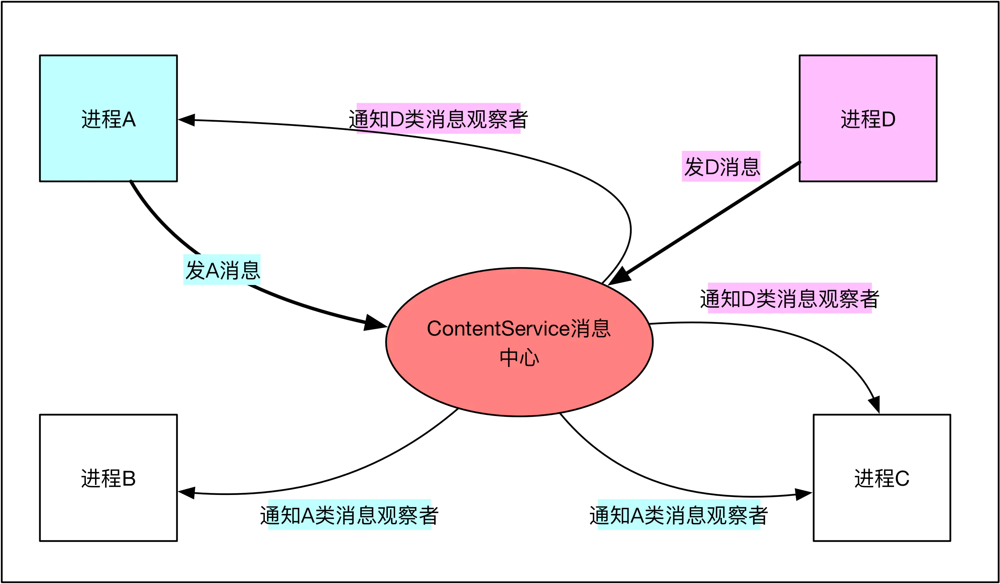

# ContentProvider 的共享数据更新通知机制

# 1. 概述

　　Android 应用程序组件 ContentProvider 中的数据更新通知机制和 Android 系统中的广播（Broadcast）通知机制的实现思路是相似的。

　　在 Android 的广播机制中，首先是接收者对自己感兴趣的广播进行注册，接着当发送者发出这些广播时，接收者就会得到通知了。

　　然而，ContentProvider 中的数据监控机制与 Android 系统中的广播机制又有三个主要的区别：

1. ContentProvider 是通过 URI 来把通知的发送者和接收者关联在一起的，而系统中的广播是通过 Intent 来关联的。
2. ContentProvider 的通知注册中心是由 ContentService 服务来扮演的，而系统中的广播是由 ActivityManangerService 服务来扮演的。
3. ContentProvider 负责接收数据更新通知的类必须要继承 ContentObserver 类，而系统的广播要继承 BroadcastReceiver 类。

　　之所以会有这些区别，是由于 ContentProvider 组件的数据共享功能本身就是建立在 URI 的基础之上的，因此专门针对 URL 来设计另外一套通知机制会更实用和方便，而 Android 系统的广播机制是一种更加通用的事件通知机制，它的适用范围会更广泛一些。

　　将 ContentProvider 的数据更新机制划分为三个部分进行讲解：

1. ContentService 的启动过程
2. 监控数据变化的 ContentObserver 的注册过程
3. 数据更新通知的发送过程

# 2. ContentService 启动

## 2.1. ContentService 概述

　　ContentService 可以看做 Android 中一个系统级别的消息中心，可以说搭建一个系统级的观察者模型，App 可以向消息中心注册观察者，选择订阅自己关心的消息，也可以通过消息中心发送消息，通知其他进程，简单模型如下：



　　ContentService 服务伴随系统启动，更准确的说是伴随 SystemServer 进程启动，本身是一个 Binder 系统服务，运行在 SystemServer 进程。

　　作为系统服务，最好能保持高效运行，因此 ContentService 通知 App 都是异步的，被限制 oneway，仅仅插入目标进程（线程）的 Queue 队列，不必等待执行。

## 2.2. 源码分析

### 2.2.1. Lifecycle

　　Lifecycle 是 ContentService 的静态内部类。

```java
	// Lifecycle 继承 SystemService   
	public static class Lifecycle extends SystemService {
        private ContentService mService; // ContentService 的成员对象

        public Lifecycle(Context context) {
            super(context);
        }

      	// 启动后会调用 onStart 方法
        @Override
        public void onStart() {
            final boolean factoryTest = (FactoryTest
                    .getMode() == FactoryTest.FACTORY_TEST_LOW_LEVEL);
          	// 初始化 contentService 成员对象
            mService = new ContentService(getContext(), factoryTest);
          	// 调用 SystemService 的 publishBinderService 方法
            publishBinderService(ContentResolver.CONTENT_SERVICE_NAME, mService);
        }

        @Override
        public void onBootPhase(int phase) {
            if (phase == SystemService.PHASE_ACTIVITY_MANAGER_READY) {
                mService.systemReady();
            }
        }

        @Override
        public void onCleanupUser(int userHandle) {
            synchronized (mService.mCache) {
                mService.mCache.remove(userHandle);
            }
        }
    }
```

　　Lifecycle 是 SystemService 的子类，持有 ContentService 成员 mService，在 onStart 方法中初始化 mService，并调用 publishBinderService 方法。

### 2.2.2. SystemServer

　　SystemServer 是一个进程，从 main 方法进入开始执行。

#### 2.2.2.1. SystemServer#main

```java
    public static void main(String[] args) {
      	// 调用 SystemServer 的 run 方法
        new SystemServer().run();
    }
    public SystemServer() {
        // Check for factory test mode.
        mFactoryTestMode = FactoryTest.getMode();
        // Remember if it's runtime restart(when sys.boot_completed is already set) or reboot
        mRuntimeRestart = "1".equals(SystemProperties.get("sys.boot_completed"));
    }
```

　　在 SystemServer 的 main 方法中调用 SystemServer 的构造方法创建了一个 SystemServer 对象，并调用了 SystemServer 的 run 方法。

#### 2.2.2.2. SystemServer#run

　　在 SystemServer 的 run 方法中会有如下部分代码：

```java
 		// Start services.开启一些系统核心服务与其他服务
        try {
            traceBeginAndSlog("StartServices");
            startBootstrapServices();
            startCoreServices();
            startOtherServices();
            SystemServerInitThreadPool.shutdown();
        } catch (Throwable ex) {
            Slog.e("System", "******************************************");
            Slog.e("System", "************ Failure starting system services", ex);
            throw ex;
        } finally {
            traceEnd();
        }
```

　　在 SystemServer 的 run 方法中调用了 startOtherService 方法。

#### 2.2.2.3. SystemServer#startOtherService

　　在 SystemServer 的 startOtherService 方法中有如下部分代码：

```java
traceBeginAndSlog("StartContentService");
mSystemServiceManager.startService(CONTENT_SERVICE_CLASS);
traceEnd();
```

　　调用 mSystemServiceManager 的 startService 开启 CONTENT_SERVICE_CLASS 服务，而 CONTENT_SERVICE_CLASS 如下：

```java
    private static final String CONTENT_SERVICE_CLASS =
            "com.android.server.content.ContentService$Lifecycle"; // ContentService 的 Lisecycle
```

　　CONTENT_SERVICE_CLASS 就是 ContentService 的内部类 Lifecycle。启动之后就会调用 Lifecycle 的 onStart 方法，创建 ContentService 对象，并调用 publicBinderService 方法。

### 2.2.3. SystemService#publishBinderService

```java
/**
 * Publish the service 到 ServiceManager，对其他进程提供 binder 服务.
 */
protected final void publishBinderService(String name, IBinder service) {
    publishBinderService(name, service, false);
}

/**
 * Publish the service 到 ServiceManager，对其他进程提供 binder 服务.
 */
protected final void publishBinderService(String name, IBinder service,
        boolean allowIsolated) {
    ServiceManager.addService(name, service, allowIsolated);
}
```

　　在 publishBinderService 方法中调用了 ServiceMananger 的 addService 方法。

#### 2.2.3.1. ServiceManager#addService

　　SystemServer 进程启动系统服务有两种方式，分别是 SystemServiceManager 的`startService` 方式和 ServiceManager 的 `addService` 方式。

```java
public static void addService(String name, IBinder service, boolean allowIsolated) {
		try {
				getIServiceManager().addService(name, service, allowIsolated);
		} catch (RemoteException e) {
				Log.e(TAG, "error in addService", e);
		}
}
```

　　通过 ServiceManager 的`addService(String name, IBinder service)`用于初始化继承于 IBinder 的服务。

　　主要功能是将对应服务的 Binder 对象添加到 SystemManager 中去。

#### 2.2.3.2. ServiceManagerNative#addService

```java

    public void addService(String name, IBinder service, boolean allowIsolated)
            throws RemoteException {
        Parcel data = Parcel.obtain();
        Parcel reply = Parcel.obtain();
        data.writeInterfaceToken(IServiceManager.descriptor);
        data.writeString(name);
        data.writeStrongBinder(service);
        data.writeInt(allowIsolated ? 1 : 0);
        mRemote.transact(ADD_SERVICE_TRANSACTION, data, reply, 0);
        reply.recycle();
        data.recycle();
    }
```

　　调用 mRemote 的 transact 方法执行添加服务的 Binder 操作。

# 3. 监控数据变化的 ContentObserver 的注册过程

## 3.1. 注册更新

```java
// 注册数据更新
resolver.registerContentObserver(Uri.parse("content://com.content.mycontentprovider/contact"), true, new MyContentObserver(new Handler()));
```

　　通过调用 ContentResolver 对象的 registerContentObserver() 方法来注册一个自定义的 ContentObserver(MyContentObserver) 来监控 MyContentProvider 这个 ContentProvider 中的数据变化。

```java
 private class MyContentObserver extends ContentObserver{  
  
        /** 
         * Creates a content observer. 
         * 
         * @param handler The handler to run {@link #onChange} on, or null if none. 
         */  
        public MyContentObserver(Handler handler) {  
            super(handler);  
        }  
  		
     	// 接收到数据更新时的回调
        @Override  
        public void onChange(boolean selfChange) {  
            
            myAdapter.notifyDataSetChanged();  
  
        }  
    }  
```

　　从 ContentObserver 继承下来的子类必须要实现 onChange 函数。当这个 ContentObserver 子类负责监控的数据发生变化时，ContentService 就会调用它的 onChange 函数来处理，参数 selfChange 表示这个变化是否是由自己引起的。

　　在这个应用程序中，MyContentObserver 继承了 Observer 类，它负责监控的 URL 是 “"content://com.content.mycontentprovider/contact"”。当这个 URI 为前缀的 URI 对应的数据发生改变时，ContentService 都会调用这个 MyContentObserver 类的 onChange 函数来处理。

## 3.2. 注册过程分析

　　在 ContentObserver 类的构造函数中，有一个 handler，它的类型为 Handler：

```java
	Handler mHandler;
    
	public ContentObserver(Handler handler) {
        mHandler = handler;
  	}
```

　　这个 handler 是用来分发和处理消息用的。

　　由于是在主线程中调用的 `resolver.registerContentObserver(...,  
                ..,new MyContentObserver(new Handler()));`，因此，这个 handler 参数就是和应用程序主线程的消息循环关联在一起的。

### 3.2.1. ContentResolver#registerContentObserver

```java
    public final void registerContentObserver(@NonNull Uri uri, boolean notifyForDescendants,
            @NonNull ContentObserver observer) {
        Preconditions.checkNotNull(uri, "uri");
        Preconditions.checkNotNull(observer, "observer");
        registerContentObserver(
                ContentProvider.getUriWithoutUserId(uri),
                notifyForDescendants,
                observer,
                ContentProvider.getUserIdFromUri(uri, mContext.getUserId()));
    }

    /** @hide - designated user version */
    public final void registerContentObserver(Uri uri, boolean notifyForDescendents,
            ContentObserver observer, @UserIdInt int userHandle) {
        try {
          	// 调用了 ContentService 的 registerContentObserver 方法
            getContentService().registerContentObserver(uri, notifyForDescendents,
                    observer.getContentObserver(), userHandle, mTargetSdkVersion);
        } catch (RemoteException e) {
        }
    }
```

　　当参数 notifyDescendents 为 true 时，表示要监控所有以 uri 为前缀的 URI 对应的数据变化。

　　registerContentObserver 方法做了三件事情：

1. 调用 getContentService 函数来获得启动起来了的 ContentService 服务。
2. 调用从参数传进来的 ContentObserver 对象 observer 的 getContentObserver 函数来获得一个 Binder 对象。
3. 通过调用 ContentService 远程接口的 registerContentObserver 函数来把这个 Binder 对象注册到 ContentService 中去。

### 3.2.2. ContentResolver#getContentService

```java
    public static IContentService getContentService() {
        if (sContentService != null) {
            return sContentService;
        }
        IBinder b = ServiceManager.getService(CONTENT_SERVICE_NAME);
        if (false) Log.v("ContentService", "default service binder = " + b);
        sContentService = IContentService.Stub.asInterface(b);
        if (false) Log.v("ContentService", "default service = " + sContentService);
        return sContentService;
    }
```

　　在 ContentProvider 类中，有一个静态成员变量 sContentService。开始时 sContentService 为 null。当ContentResolver 类的 getContentService 函数第一次被调用时，它便会通过 ServiceMananger 类的 getService 方法来获得前面已经启动起来了的 ContentService 服务的远程接口，然后把它保存在 sContentService 变量中。这样，当下次 ContentResolver 类的 getContentService 函数再次被调用时，就可以直接把这个 ContentService 远程接口返回给调用者了。

### 3.2.3. ContentObserver#getContentObserver

```java
    public IContentObserver getContentObserver() {
        synchronized (mLock) {
            if (mTransport == null) {
                mTransport = new Transport(this);
            }
            return mTransport;
        }
    }
```

　　ContentObserver 类的 getContentObserver 方法返回的是一个成员变量 mTransport，它的类型为 ContentObserver 的内部类 Transport。

```java
    private static final class Transport extends IContentObserver.Stub {
        private ContentObserver mContentObserver; // ContentObserver 成员对象

        public Transport(ContentObserver contentObserver) {
            mContentObserver = contentObserver;
        }

        @Override
        public void onChange(boolean selfChange, Uri uri, int userId) {
            ContentObserver contentObserver = mContentObserver;
            if (contentObserver != null) {
                contentObserver.dispatchChange(selfChange, uri, userId);
            }
        }

        public void releaseContentObserver() {
            mContentObserver = null;
        }
    }
```

　　Transport 是一个 Binder 对象，它是要传递给 ContentService 服务的，以便当 ContentObserver 所监控的数据发生变化时，ContentService 服务可以通过这个 Binder 对象通知相应的 ContentObserver 它监控的数据发生变化了。

### 3.2.4. ContentService#registerContentObserver

```java
    @Override
    public void registerContentObserver(Uri uri, boolean notifyForDescendants,
            IContentObserver observer, int userHandle, int targetSdkVersion) {
        if (observer == null || uri == null) {
            throw new IllegalArgumentException("You must pass a valid uri and observer");
        }

        final int uid = Binder.getCallingUid();
        final int pid = Binder.getCallingPid();

        userHandle = handleIncomingUser(uri, pid, uid,
                Intent.FLAG_GRANT_READ_URI_PERMISSION, true, userHandle);

        final String msg = LocalServices.getService(ActivityManagerInternal.class)
                .checkContentProviderAccess(uri.getAuthority(), userHandle);
        if (msg != null) {
            if (targetSdkVersion >= Build.VERSION_CODES.O) {
                throw new SecurityException(msg);
            } else {
                if (msg.startsWith("Failed to find provider")) {
                    // Sigh, we need to quietly let apps targeting older API
                    // levels notify on non-existent providers.
                } else {
                    Log.w(TAG, "Ignoring content changes for " + uri + " from " + uid + ": " + msg);
                    return;
                }
            }
        }

        synchronized (mRootNode) {
            // 注册这个 ContentObserver 对象 observer
            mRootNode.addObserverLocked(uri, observer, notifyForDescendants, mRootNode,
                    uid, pid, userHandle);
            if (false) Log.v(TAG, "Registered observer " + observer + " at " + uri +
                    " with notifyForDescendants " + notifyForDescendants);
        }
    }

    public void registerContentObserver(Uri uri, boolean notifyForDescendants,
                                        IContentObserver observer) {
        registerContentObserver(uri, notifyForDescendants, observer,
                UserHandle.getCallingUserId(), Build.VERSION_CODES.CUR_DEVELOPMENT);
    }
```

　　ContentService 的 registerContentObserver 方法调用了 ContentService 类的成员变量 mRootNode 的 addObserverLocked 方法来注册这个 ContentObserver 对象 observer。

　　成员变量 mRootNode 的类型为 ContentService 在内部定义的一个类 ObserverNode。

#### 3.2.4.1. ObserverNode#addObserverLocked

```java
        private void addObserverLocked(Uri uri, int index, IContentObserver observer,
                                       boolean notifyForDescendants, Object observersLock,
                                       int uid, int pid, int userHandle) {
            // If this is the leaf node add the observer
            if (index == countUriSegments(uri)) {
                mObservers.add(new ObserverEntry(observer, notifyForDescendants, observersLock,
                        uid, pid, userHandle));
                return;
            }

            // Look to see if the proper child already exists
            String segment = getUriSegment(uri, index);
            if (segment == null) {
                throw new IllegalArgumentException("Invalid Uri (" + uri + ") used for observer");
            }
            int N = mChildren.size();
            for (int i = 0; i < N; i++) {
                ObserverNode node = mChildren.get(i);
                if (node.mName.equals(segment)) {
                    node.addObserverLocked(uri, index + 1, observer, notifyForDescendants,
                            observersLock, uid, pid, userHandle);
                    return;
                }
            }

            // No child found, create one
            ObserverNode node = new ObserverNode(segment);
            mChildren.add(node);
            node.addObserverLocked(uri, index + 1, observer, notifyForDescendants,
                    observersLock, uid, pid, userHandle);
        }
```

　　从这里可以看出，注册到 ContentService 中的 ContentObserver 按照树形来组织，树的节点类型为 ObserverNode，而树的根节点就是 ContentService 类的成员变量 mRootNode。

```java
    private final ObserverNode mRootNode = new ObserverNode("");
```

　　每一个 ObserverNode 节点都对应一个名字，它是从 URI 中解析出来的。

#### 3.2.4.2. ObserverNode#countUriSegments

```java
        private int countUriSegments(Uri uri) {
            if (uri == null) {
                return 0;
            }
            return uri.getPathSegments().size() + 1;
        }
```

　　获取 uri 的 segment 的数量。

　　uri.getPathSegments 方法会得到 uri 的 path 部分，并拆封，去掉 “/”，取得第一个元素（从第 0 个开始）。

　　例如对于 "content://com.content.mycontentprovider/contact"  uri.getPathSegments 方法返回的就是 “content” 一个元素。

#### 3.2.4.3. ObserverNode#getUriSegment

```java
        private String getUriSegment(Uri uri, int index) {
            if (uri != null) {
                if (index == 0) {
                    return uri.getAuthority();
                } else {
                    return uri.getPathSegments().get(index - 1);
                }
            } else {
                return null;
            }
        }
```

　　获取 Uri 指定 index 的 segment。

　　以传入的 uri 为 "content://com.content.mycontentprovider/contact"  为例：

**第一次调用 addObserverLock **

　　第一次调用的是 mRpptNode 的 addObserverLock() 方法，传入的参数 index 的值为 0，而调用 countUriSegments(“content://com.content.mycontentprovider/contact”)  方法的返回值为 2，不等于 index 的值。

　　因此就会往下执行，通过调用 getUriSegment("content://com.content.mycontentprovider/contact",0) 方法得到的返回值为 “com.content.mycontentprovider”。

　　在第一次调用树的根节点 mRootNode 来增加 “content://com.content.mycontentprovider/contact” 这个 URI，那么在接下来的 for 循环中，就不会在 mRootNode 的孩子节点列表 mChildren 中找到与名称 “com.content.mycontentprovider” 对应的 ObserverNode，于是就会以 “com.content.mycontentprovider” 为名称来创建一个新的 ObserverNode，并增加到 mRootNode 的孩子界面列表 mChildren 中去，并以这个新的 ObserverNode 来开始新一轮的 addObserverLocked() 方法调用。

**第二次调用 addObserverLocked **

　　第二次进入到 addObserverLocked() 方法时，countUriSegents("content://com.content.mycontentprovider/contact") 的值仍为 2，而 index 的值为 1，因此就会往下执行，这时候通过调用 getUriSegment("content://com.content.mycontentprovider/contact",1) 方法得到的返回值为 “content”。这里不存在名称为 “contact” 的孩子节点，于是又会以 “contact” 为名称来创建一个新的 ObserverNode，并以这个新的 ObserverNode 来开始新一轮的 addObserverLocked 方法调用。

**第三次调用 addObserverLocked**

　　第三次进入到 addObserverLocked() 方法时，countUriSegments("content://com.content.mycontentprovider/contact") 的值仍为 2，而 index 的值也为 2，因此就会新建一个 ObserverEntry 对象，并保存这个以 “contact” 为名称的 ObserverNode 的 ContentObserver 列表 mObservers 中。

　　最终得到的属性结构如下所示：

```xml
mRootNode("")
	- ObserverNode("com.content.mycontentprovider")
		- ObserverNode("contact"),while has a ContentObserver in mObservers
```

　　这样，ContentObserver 的注册过程就完成了。

# 4. 数据更新通知的发送过程

## 4.1. 通知更新

　　调用 ContentResolver 来插入数据：

```java
ContentValues contentValues = new ContentValues();  
contentValues.put("name",name);  
contentValues.put("number",num);  
           getContentResolver().insert(Uri.parse("content://com.content.mycontentprovider/contact",contentValues);
```

　　在插入数据时，就会调用到 MyContentProvider 类的 insert 方法中：

```java
 public Uri insert(Uri uri, ContentValues values) {  
        Uri u = null;  
        if(uriMatcher.match(uri) == CONTACT){  
            SQLiteDatabase database = dbHelp.getWritableDatabase();  
  
            long d = database.insert("contact", "_id", values);  
            u = ContentUris.withAppendedId(uri,d);  
            // 通知订阅者
            contentResolver.notifyChange(u,null);  
        }  
        return u;  
  
    }  
```

　　传递进来的参数 uri 的值为 “content://com.content.mycontentprovider/contact”。在 MyContentProvider 类的 insert 方法将数据加入到 SQLite 数据库之后，返回来的 id 值为 d，于是通过调用 ContentUris.withAppendedId(uri,id) 得到的 u 就是 “content://com.content.mycontentprovider/contact/d”。随后就会调用 `contentResolver.notifyChange` 方法来通知那些注册了监控 “content://com.content.mycontentprovider/contact/d” 这个 URI 的 ContentObserver，它监控的数据发生变化了。

## 4.2. 通知过程分析

### 4.2.1. ContentResolver#notifyChange

```java
    public void notifyChange(@NonNull Uri uri, @Nullable ContentObserver observer) {
        notifyChange(uri, observer, true /* sync to network */);
    }

    public void notifyChange(@NonNull Uri uri, @Nullable ContentObserver observer,
            boolean syncToNetwork) {
        Preconditions.checkNotNull(uri, "uri");
        notifyChange(
                ContentProvider.getUriWithoutUserId(uri),
                observer,
                syncToNetwork,
                ContentProvider.getUserIdFromUri(uri, mContext.getUserId()));
    }

    public void notifyChange(@NonNull Uri uri, ContentObserver observer, boolean syncToNetwork,
            @UserIdInt int userHandle) {
        try {
            // 调用 ContentService 的 notifyChange
            getContentService().notifyChange(
                    uri, observer == null ? null : observer.getContentObserver(),
                    observer != null && observer.deliverSelfNotifications(),
                    syncToNetwork ? NOTIFY_SYNC_TO_NETWORK : 0,
                    userHandle, mTargetSdkVersion);
        } catch (RemoteException e) {
        }
    }

```

　　调用了 ContentService 的远程接口来调用它的 notifyChange() 方法来发送数据更新通知。

#### 4.2.1.2. ContentService#notifyChange

```java
    public void notifyChange(Uri uri, IContentObserver observer,
                             boolean observerWantsSelfNotifications, boolean syncToNetwork) {
        notifyChange(uri, observer, observerWantsSelfNotifications,
                syncToNetwork ? ContentResolver.NOTIFY_SYNC_TO_NETWORK : 0,
                UserHandle.getCallingUserId(), Build.VERSION_CODES.CUR_DEVELOPMENT);
    }
    
    @Override
    public void notifyChange(Uri uri, IContentObserver observer,
            boolean observerWantsSelfNotifications, int flags, int userHandle,
            int targetSdkVersion) {
        if (DEBUG) Slog.d(TAG, "Notifying update of " + uri + " for user " + userHandle
                + " from observer " + observer + ", flags " + Integer.toHexString(flags));

        if (uri == null) {
            throw new NullPointerException("Uri must not be null");
        }

        final int uid = Binder.getCallingUid();
        final int pid = Binder.getCallingPid();
        final int callingUserHandle = UserHandle.getCallingUserId();

        userHandle = handleIncomingUser(uri, pid, uid,
                Intent.FLAG_GRANT_WRITE_URI_PERMISSION, true, userHandle);

        final String msg = LocalServices.getService(ActivityManagerInternal.class)
                .checkContentProviderAccess(uri.getAuthority(), userHandle);
        if (msg != null) {
            if (targetSdkVersion >= Build.VERSION_CODES.O) {
                throw new SecurityException(msg);
            } else {
                if (msg.startsWith("Failed to find provider")) {
                    // Sigh, we need to quietly let apps targeting older API
                    // levels notify on non-existent providers.
                } else {
                    Log.w(TAG, "Ignoring notify for " + uri + " from " + uid + ": " + msg);
                    return;
                }
            }
        }

        // This makes it so that future permission checks will be in the context of this
        // process rather than the caller's process. We will restore this before returning.
        long identityToken = clearCallingIdentity();
        try {
            ArrayList<ObserverCall> calls = new ArrayList<ObserverCall>();
            synchronized (mRootNode) {
                // 收集注册了监控 uri 的 ContentObserver
                mRootNode.collectObserversLocked(uri, 0, observer, observerWantsSelfNotifications,
                        flags, userHandle, calls);
            }
            final int numCalls = calls.size();
            for (int i=0; i<numCalls; i++) {
                ObserverCall oc = calls.get(i);
                try {
                    // 调用 observer 的 onChange 方法通知数据变化了
                    oc.mObserver.onChange(oc.mSelfChange, uri, userHandle);
                    if (DEBUG) Slog.d(TAG, "Notified " + oc.mObserver + " of " + "update at "
                            + uri);
                } catch (RemoteException ex) {
                    synchronized (mRootNode) {
                        Log.w(TAG, "Found dead observer, removing");
                        IBinder binder = oc.mObserver.asBinder();
                        final ArrayList<ObserverNode.ObserverEntry> list
                                = oc.mNode.mObservers;
                        int numList = list.size();
                        for (int j=0; j<numList; j++) {
                            ObserverNode.ObserverEntry oe = list.get(j);
                            if (oe.observer.asBinder() == binder) {
                                list.remove(j);
                                j--;
                                numList--;
                            }
                        }
                    }
                }
            }
            if ((flags&ContentResolver.NOTIFY_SYNC_TO_NETWORK) != 0) {
                SyncManager syncManager = getSyncManager();
                if (syncManager != null) {
                    syncManager.scheduleLocalSync(null /* all accounts */, callingUserHandle, uid,
                            uri.getAuthority());
                }
            }

            synchronized (mCache) {
                final String providerPackageName = getProviderPackageName(uri);
                invalidateCacheLocked(userHandle, providerPackageName, uri);
            }
        } finally {
            restoreCallingIdentity(identityToken);
        }
    }

```

　　ContentService 的 notifyChange 方法做了两件事情：

1. 第一件事情是调用 ContentService 的成员变量 mRootNode 的 collectObserverLocked() 方法来收集那些注册了监控 “content://com.content.mycontentprovider/contact/d” 这个 URI 的 ContentObserver。
2. 第二件事情是分别调用这些 ContentObserver 的 onChange() 方法来通知它们监控的数据发生变化了。

### 4.2.2. 收集注册了监控的 ContentObserver

#### 4.2.2.1. ObserverNode#collectObserverLocked

　　ObserverNode 是 ContentService 的内部类。

```java
        public void collectObserversLocked(Uri uri, int index, IContentObserver observer,
                                           boolean observerWantsSelfNotifications, int flags,
                                           int targetUserHandle, ArrayList<ObserverCall> calls) {
            String segment = null;
            int segmentCount = countUriSegments(uri);
            if (index >= segmentCount) {
                // This is the leaf node, notify all observers
                if (DEBUG) Slog.d(TAG, "Collecting leaf observers @ #" + index + ", node " + mName);
                collectMyObserversLocked(true, observer, observerWantsSelfNotifications,
                        flags, targetUserHandle, calls);
            } else if (index < segmentCount){
                segment = getUriSegment(uri, index);
                if (DEBUG) Slog.d(TAG, "Collecting non-leaf observers @ #" + index + " / "
                        + segment);
                // Notify any observers at this level who are interested in descendants
                collectMyObserversLocked(false, observer, observerWantsSelfNotifications,
                        flags, targetUserHandle, calls);
            }

            int N = mChildren.size();
            for (int i = 0; i < N; i++) {
                ObserverNode node = mChildren.get(i);
                if (segment == null || node.mName.equals(segment)) {
                    // We found the child,
                    node.collectObserversLocked(uri, index + 1, observer,
                            observerWantsSelfNotifications, flags, targetUserHandle, calls);
                    if (segment != null) {
                        break;
                    }
                }
            }
        }
```

#### 4.2.2.2. ObserverNode#collectMyObserverLocked

```java
        private void collectMyObserversLocked(boolean leaf, IContentObserver observer,
                                              boolean observerWantsSelfNotifications, int flags,
                                              int targetUserHandle, ArrayList<ObserverCall> calls) {
            int N = mObservers.size();
            IBinder observerBinder = observer == null ? null : observer.asBinder();
            for (int i = 0; i < N; i++) {
                ObserverEntry entry = mObservers.get(i);

                // Don't notify the observer if it sent the notification and isn't interested
                // in self notifications
                boolean selfChange = (entry.observer.asBinder() == observerBinder);
                if (selfChange && !observerWantsSelfNotifications) {
                    continue;
                }

                // Does this observer match the target user?
                if (targetUserHandle == UserHandle.USER_ALL
                        || entry.userHandle == UserHandle.USER_ALL
                        || targetUserHandle == entry.userHandle) {
                    // Make sure the observer is interested in the notification
                    if (leaf) {
                        // If we are at the leaf: we always report, unless the sender has asked
                        // to skip observers that are notifying for descendants (since they will
                        // be sending another more specific URI for them).
                        if ((flags&ContentResolver.NOTIFY_SKIP_NOTIFY_FOR_DESCENDANTS) != 0
                                && entry.notifyForDescendants) {
                            if (DEBUG) Slog.d(TAG, "Skipping " + entry.observer
                                    + ": skip notify for descendants");
                            continue;
                        }
                    } else {
                        // If we are not at the leaf: we report if the observer says it wants
                        // to be notified for all descendants.
                        if (!entry.notifyForDescendants) {
                            if (DEBUG) Slog.d(TAG, "Skipping " + entry.observer
                                    + ": not monitor descendants");
                            continue;
                        }
                    }
                    if (DEBUG) Slog.d(TAG, "Reporting to " + entry.observer + ": leaf=" + leaf
                            + " flags=" + Integer.toHexString(flags)
                            + " desc=" + entry.notifyForDescendants);
                    calls.add(new ObserverCall(this, entry.observer, selfChange,
                            UserHandle.getUserId(entry.uid)));
                }
            }
        }
```

　　以 uri 为 “content://com.content.mycontentprovider/contact/d” 为例，解析 collectObserverLocked 方法：

**第一次调用 collectObserverLocked**

　　第一个调用 collectObserversLocked() 时，是在 mRootNode 的这个 ObserverNode 节点中进行收集 ConentObserver 的。这时候传进来的 uri 的值为 “content://com.content.mycontentprovider/contact/d” ，index 的值为 0 ，调用 countUriSegments("content://com.content.mycontentprovider/contact/d") 函数得到的返回值为 3，于是就会调用 getUriSegment 方法，得到的 segment 的值为 “com.content.mycontentprovider”。在这个情景中，mRootNode 这个节点中没有注册 ContentObserver，于是调用 collectMyObserversLocked 方法就不会收集到 ContentObserver。

　　在接下来的 for 循环中，在 mRootNode 的孩子节点列表 mChildren 中查找名称等于 “com.content.mycontentprovider” 的 ObserverNode 节点。

　　在 ContentObserver 的注册过程中，已经往 mRootNode 的孩子节点列表 mChildren 中增加了一个名称为 “com.content.mycontentprovider” 的 ObserverNode 节点，因此，在这里会成功找到它，并且调用它的 collectionObserversLocked() 函数来继续收集 ContentObserver。

**第二次调用 collectObserversLocked **

　　第二次进入到 collectObserversLocked() 方法时，是在名称为 “com.content.mycontentprovider” 的 ObserverNode 节点中收集 ContentObserver 的。这时候传来的 uri 值不变，但是 index 的值为 1，于是执行 getUriSegment 方法的返回值 segment 为 “contact”，并接着执行 collectMyObserversLocked 方法。在当前场景重，没有在名称为 “com.content.mycontentprovider” 的 ObserverNode 节点中注册有 ContentObserver，因此调用 collectMyObserversLocked() 方法也不会收集到 ContentObserver。

　　在接下来的 for 循环中，在名称为 “com.content.mycontentprovider”  的 ObserverNode 节点的孩子节点列表 mChildren 中查找名称等于 “contact” 的 ObserverNode 节点。在 ContentObserver 的注册过程中，往名称为 “com.content.mycontentprovider” 的 ObserverNode 节点的孩子节点列表 mChildren 中增加了一个名称为 "contact" 的 ObserverNode 节点，因此，这里会找到它，并且调用它的 collectObserversLocked() 方法来继续收集 ContentObserver。

**第三次调用 collectObserversLocked **

　　第三次进入到 collectObserversLocked() 方法时，是在名称为 “com.content.mycontentprovider” 的 ObserverNode 节点的子节点中名称为 "contact" 的 ObserverNode 节点中收集 ContentObserver 的。这时候传来的 uri 值不变，但是 index 的值为 2，于是执行 getUriSegment 的返回值 segment 为 “d”。

　　前面已经在名称为 “com.content.mycontentprovider” 的 ObserverNode 节点的子节点中名称为 “contact” 的 ObserverNode 节点中注册了一个 ContentObserver，即 MyContentObserver，因此这里调用 collectMyObserversLocked() 方法会收集到这个 ContentObserver。注意，这次调用 collectMyObserversLocked() 方法时，虽然传进去的参数 leaf 为 false，但是由于注册 MyContentProvider 时，指定了 notifyForDescendents 参数为 true，因此，这里可以把它收集回来。

　　在接下来的 for 循环中，继续在该节点的子节点列表 mChildren 中查找名称等于 "d" 的 ObserverNode 节点。在当前场景下，不存在这个名称为 “d” 的子节点，于是收集 ContentObserver 的工作就结束了，收集结果是只有一个 ContentObserver，即在前面注册的 MyContentObserver。

#### 4.2.3. 通知监控数据发生了变化

　　collectObserversLocked 方法执行完成后，回到 ContentService 的 notifyChange 方法，接着执行 for 循环：

```java
            for (int i=0; i<numCalls; i++) {
                ObserverCall oc = calls.get(i);
                try {
                    oc.mObserver.onChange(oc.mSelfChange, uri, userHandle);
                    if (DEBUG) Slog.d(TAG, "Notified " + oc.mObserver + " of " + "update at "
                            + uri);
                } catch (RemoteException ex) {
                    synchronized (mRootNode) {
                        Log.w(TAG, "Found dead observer, removing");
                        IBinder binder = oc.mObserver.asBinder();
                        final ArrayList<ObserverNode.ObserverEntry> list
                                = oc.mNode.mObservers;
                        int numList = list.size();
                        for (int j=0; j<numList; j++) {
                            ObserverNode.ObserverEntry oe = list.get(j);
                            if (oe.observer.asBinder() == binder) {
                                list.remove(j);
                                j--;
                                numList--;
                            }
                        }
                    }
                }
            }
```

　　ContentService 服务中的 mObserver 是一个在 ContentObserver 内部定义的一个类 Transport 对象的远程接口。

　　通过调用 `oc.mObserver.onChange(oc.mSelfChange, uri, userHandle);` 也就是调用远程接口的 onChange() 方法，就会进入 ContentObserver 的内部类 Transport 的 onChange() 方法中去。

##### 4.2.3.1. Transport

　　Transport 是 ContentObserver 的内部类。

```java
    private static final class Transport extends IContentObserver.Stub {
        private ContentObserver mContentObserver; // ContenObserver 成员对象

        public Transport(ContentObserver contentObserver) {
            mContentObserver = contentObserver;
        }

        @Override
        public void onChange(boolean selfChange, Uri uri, int userId) {
            ContentObserver contentObserver = mContentObserver;
            if (contentObserver != null) {
                // 调用 contentObserver 的 dispatchChange 方法
                contentObserver.dispatchChange(selfChange, uri, userId);
            }
        }

        public void releaseContentObserver() {
            mContentObserver = null;
        }
    }
```

　　在 ContentObserver 的注册过程中，会把 MyContentObserver 这个 ContentObserver 保存在这个 Transport 对象的 mContentObserver 成员变量中，因此会调用它的 dispatchChange() 方法来执行数据更新通知的操作。

##### 4.2.3.2. ContentObserver#dispatchChange

```java
    private void dispatchChange(boolean selfChange, Uri uri, int userId) {
        if (mHandler == null) {
            // 里面什么代码都没有执行
            onChange(selfChange, uri, userId);
        } else {
            // 调用 mHandler 运行 NotificationRunnable
            mHandler.post(new NotificationRunnable(selfChange, uri, userId));
        }
    }
```

　　在 ContentObserver 的注册过程中，在应用程序的主线程的消息循环创建了一个 Handler，并且以这个 Handler 来创建了这个 MyContentObserver，这个 Handler 就保存在 ContentObserver 的成员变量 mHandler 中。因此，这里的 mHandler 不为 null，于是把这个消息更新通知封装成了一个消息，放到应用程序的主线程中去处理，最终消息是由 NotificationRunnable 类的 run() 方法来处理的。

##### 4.2.3.3. NotificationRunnable#run

　　NotificationRunnable 是 ContentObserver 的内部类。

```java
    private final class NotificationRunnable implements Runnable {
        private final boolean mSelfChange;
        private final Uri mUri;
        private final int mUserId;

        public NotificationRunnable(boolean selfChange, Uri uri, int userId) {
            mSelfChange = selfChange;
            mUri = uri;
            mUserId = userId;
        }

        @Override
        public void run() {
            // 调用 ContentObserver 的 onChange 方法
            ContentObserver.this.onChange(mSelfChange, mUri, mUserId);
        }
    }
```

　　NotificationRunnable 直接调用了 ContentObserver 的子类 onChange 方法来处理这个数据更新通知了，这个 ContentObserver 子类就是 MyContentObserver 。

　　以上就是 ContentProvider 的共享数据更新通知机制的运行过程。

## 5. 总结

　　ContentService 服务伴随系统启动，本身是一个 Binder 系统服务，运行在 SystemServer 进程。在 SystemService 的 main 方法中开启 ContentService 的 lifecycyle 服务，从来创建 ContentService 对象，并调用 ServiceManager 的 addService 方法启动服务。

　　ContentObserver 的 registerContentObserver 方法会做三件事情去完成绑定数据变化监听：

1. 调用 getContentService 函数来获得启动起来了的 ContentService 服务。
2. 调用从参数传进来的 ContentObserver 对象 observer 的 getContentObserver 函数来获得一个 Binder 对象。返回的是 ContentObserver 的内部类 Transport 。
3. 通过调用 ContentService 远程接口（也就是 Transport）的 registerContentObserver 函数来把这个 Binder 对象注册到 ContentService 中去。

　　注册到 ContentService 中的 ContentObserver 是按照树形来组织，树的节点类型为 ObserverNode，ObserverNode 的 name 是 uri 的其中一部分，而树的根节点就是 ContentService 类的成员变量 mRootNode。最后一个树节点（树梢）会存储监听了 uri （从 mRootNode 开始到该 ObserberNode 的 name 的拼接，只不过没有 “content://” 和 uri 中的 /） 的 ContentObserver 对象。

　　数据更新通知是通过 ContentResolver 的 notifyChange 方法来发出的。而 ContentResolver 的 notifyChange 方法调用了开启的 ContentService 的 notifyChange 来完成。

　　ContentService 的 notifyChange 方法会先收集注册了监听 uri 变化的 ContentObserver，从自己的 mRootNode 注册的 ObserverNode 中去收集注册的 ContentObserver，然后遍历收集到的 ContentObserver 列表，调用收集的 ContentObserver 的 onChange() 方法，将更新通知发送了出去。

## 6. 参考文章

1. [深入理解ContentProvider共享数据更新通知机制](https://blog.csdn.net/hehe26/article/details/51871610)
2. [Android内容服务ContentService原理浅析](https://www.jianshu.com/p/d6af600e4c20)

4. [Android SystemService类注释](https://blog.csdn.net/u011139711/article/details/81105895)