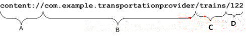

# ContentProvider 的知识

## 1. ContentProvider 概念

　　ContentProvider 可以实现在应用程序之间共享数据。

　　Android 为常见的一些数据提供了默认的 ContentProvider（包括音频、视频、图片和通讯录等）。所以可以在其他应用中通过那些 ContentProvider 获取这些数据。

　　Android 所提供的 ContentProvider 都存放在 android.provider 包中。

## 2. 为什么要选择 ContentProvider

　　虽然也可以通过文件等其他方式来达到在不同程序之间共享数据，但是会很复杂，而 ContentProvider 也是可以实现应用程序之间共享数据的，除了可以在不同程序之间共享数据之外，还有其他优点。

### 2.1. ContentProvider 的 特点

1. ContentProvider 为存储和获取数据提供了统一的接口。ContentProvider 对数据进行了封装，不用关心数据存储的细节。统一了数据的访问方式。
2. 使用 ContentProvider 可以在不同的应用程序之间共享数据。
3. Android 为常见的一些数据提供了默认的 ContentProvider（包括音频、视频、图片和通讯录等）。
4. 不同于文件存储和 SharedPreferences 存储中的两种全局可读写操作模式，ContentProvider 可以选择只对哪一部分进行共享，从而保证程序中的隐私数据不会有泄漏的风险。

### 2.2. 对 ContentProvider 封装的理解

　　继承 ContentProvider 的类在 onCreate()、insert()、delete()、update()、query()、getType() 方法中实现对数据增删改查的操作，而数据的存储可以使用文件、数据库、网络等各种方式去实现。而对数据的操作使用的是 ContentResolver 类，不管 ContentProvider 如何对数据进行实质操作，ContentReselver 的使用都是一样的。将实现与使用进行了分割，完成了对数据的封装，也统一了对数据的使用方式。

## 3. Uri 介绍

　　每一个 ContentProvider 都拥有一个公共的 URI，这个 URI 用于表示这个 ContentProvider 所提供的数据。



　　A：scheme，标准前缀，用来说明一个 ContentProvider 控制这些数据，无法改变。ContentProvider 的 scheme 已经由 Android 所规定，scheme 为：content://。

　　B：主机名，URI 的标识，用来唯一标识这个 ContentProvider ，外部调用者可以根据这个标识来找到它。它定义了是哪个 ContentProvider 提供这些数据。对于第三方应用程序，为了保证 URI 标识的唯一性，它必须是一个完整的、小写的类名。这个标识在元素的 authorities 属性中说明，一般是定义该 ContentProvider 的包类的名称。

　　C：路径（path），就是要操作的数据，路径的构建根据业务而定。

　　D：如果 URI 中包含表示需要获取的记录的 ID，则就返回该 id 对应的数据，如果没有 ID，就表示返回全部。

　　在配置 ContentProvider 的时候，最重要的就是指定它的 **authorities** 属性了，只有配置了这个属性，第三方应用程序才能通过它来找到这个 ContentProvider，authorities 就是 ContentProvider 的身份证。另外一个属性 **multiprocess** 是一个布尔值，它表示这个 ContentProvider 是否可以在每个客户进程中创建一个实例，这样做的目的是为了减少进程间通信的开销。

## 4. 操作 Uri 的工具类

　　Uri 代表了要操作的数据，所以有时需要解析 Uri，并从 Uri 中获取数据。

　　Android 系统提供了两个用于操作 Uri 的工具类，分别是 UriMatcher 和 ContentUris。

### 4.1. UriMatcher 类

　　UriMatcher 类用于匹配 Uri。

#### 4.1.1. UriMatcher 的用法

1. 把需要匹配的 Uri 路径使用 UriMatcher 的 addURI 方法全部注册上。

```java
public void addURI(String authority, //Uri 的 B 部分
                   String path, //Uri 的 C 部分
                   int code); //匹配成功的返回码
```

2. 使用 UriMatcher 的 match 方法进行匹配。如果匹配就返回匹配码。

```java
public int match(Uri uri);
```

​		UriMatch.NO_MATCH（-1） 表示当不匹配任何路径时的返回码。

### 4.2. ContentUris

​		ContentUris 类用于操作 Uri 路径后面的 ID 部分。

#### 4.2.1. ContentUris 的方法

1. `withAppendedId(Uri,id)` 方法用于为路径加上 ID 部分。

2. `parseId(Uri)` 方法用于从路径中获取 ID 部分。

## 5. ContentProvider 与 ContentResolver

​		ContentProvider 负责组织应用程序的数据，向其他应用程序提供数据。

​		ContentResolver 负责获取 ContentProvider 提供的数据，修改、添加、删除、更新数据等。

### 5.1. 使用 ContentProvider 共享数据

#### 5.1.1. ContentProvider 类的主要方法

##### 5.1.1.1 onCreate

​		pubilc boolean onCreate()

​		该方法在 ContentProvider 创建后就会被调用，Android 开机后，ContentProvider 在其他应用第一次访问它时才会被创建。通常会在这里完成对数据库的创建和升级操作。返回 true，表示 ContentProvider 初始化成功，false 则失败。

##### 5.1.1.2. insert

​		public Uri insert(Uri uri, ContentValues values)

​		该方法用于 添加数据。

##### 5.1.1.3. delete

​		public int delete(Uri uri, String selection,String[] selectionArgs)

​		该方法用于删除数据。

##### 5.1.1.4. update

​		public int update(Uri uri, ContentValues values, String selection, String[] selectionArgs)

​		该方法用于更新数据。

##### 5.1.1.5. query

​		public Cursor query(Uri uri, String[] projection, String selection, String[] selectionArgs, String sortOrder)

​		该方法用于获取数据。

##### 5.1.1.6. getType

​		public String getType(Uri uri)

​		该方法用于返回 Uri 所代表数据的 MIME 类型。

#### 5.1.2. MIME 类型

​		指定某个扩展名的文件用某种应用程序来打开。

​		MIME 类型组成：类型 + 子类型。

　　如果操作的数据属于集合类型，那么 MIME 类型字符串应该以 vnd.android.cursor.dir/ 开头。

​		如果操作的数据属于非集合类型，那么 MIME 类型字符串应该以 vnd.android.cursor.item/ 开头。

###  5.2. ContentResolver 操作 ContentProvider 中的数据

​		当外部应用需要对 ContentProvider 中的数据进行添加、删除、修改和查询操作时，可以使用 ContentResolver 类来完成。

​		要获取 ContentResolver 对象，可以使用 Activity 提供的 getContentResolver() 方法。

#### 5.2.1. ContentResolver 的方法

##### 5.2.1.1. insert

​		public Uri insert(Uri uri, ContentValues values)

​		该方法用于往 ContentProvider 添加数据。

##### 5.2.1.2. delete

​		public int delete(Uri uri, String selection, String[] selectionArgs)

​		该方法用于从 ContentProvider 删除数据。

##### 5.2.1.3. update

​		public int update(Uri uri, ContentValues values, String selection, String[] selectionArgs)

​		该方法用于更新 ContentProvider 中的数据。

##### 5.2.1.4. quesry

​		public Cursor query(Uri uri, String[] projection, String selection, String[] selectionArgs, String sortOrder)

​		该方法用于从 ContentProvider 中获取数据。

​		方法的第一个参数为 Uri，代表要操作的 ContentProvider 和对其中的什么数据进行操作。

#### 5.2.2 其他查询方法

​		查询 ContentProvider 的方法有两个：ContentResolver 的 `query()` 和 Activity 对象的 `managerQuery()` ，二者接收的参数均相同，返回的都是 Cursor 对象，唯一不同的是使用 `managerQuery()` 方法可以让 Activity 来管理 Cursor 的生命周期。

　　被管理的 Cursor 会在 Activity 进入暂停状态的时候调用自己的 `deactivate()` 方法进行卸载，而在 Activity 进入暂停状态时会调用自己的 request 方法重新查询生成的 Cursor 对象。如果一个未被管理的 Cursor 对象想被 Activity 管理，可以调用 Activity 的 startManagerCursor 方法来实现。但是这个方法已经不推荐使用了。

## 6. 监听 ContentProvider 中数据的变化

​		如果 ContentProvider 的访问者需要知道 ContentProvider 中的数据发生变化，可以在 ContentProvider 发生数据变化时调用 `getContentResolver().notifyChange(uri, null)` 来通知注册在此 Uri 上的访问者。

​		如果 ContentProvider 的访问者需要得到数据变化通知，必须使用 ContentObserver 对数据（数据采用 uri 描述 ）进行监听，当监听到数据数据变化通知时，系统就会调用 ContentObserver 的 `onChange()` 方法。

## 7. 参考文章

1. [Android 四大组件 -- ContentProvider 详解](https://www.cnblogs.com/0927wyj/p/5385565.html)
3. [android ContentResolver 详解](https://blog.csdn.net/cankingapp/article/details/7792999)
4. [Android四大组件之ContentProvider](https://www.jianshu.com/p/540a62ec37ea)

