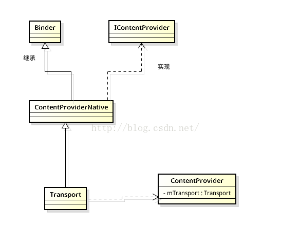

# ContentProvider 运行过程源码分析

# 1. ContextWrapper#getContentResolver

　　getContentResolver  用来获取 ContentResolver 对象。

　　这个方法是 Activity 的父类 ContextWrapper 中的。

```java
    @Override
    public ContentResolver getContentResolver() {
        return mBase.getContentResolver();
    }
```

　　调用了 mBase 的 getContentResolver 方法，而这个 mBase ：

```java
    Context mBase;
```

　　mBase 是 Context 对象，而 Context 是一个抽象类，它的实现类是 ContextImpl，在创建 activity 的时候会 new 一个 ContextImpl 对象，赋值给 activity 的。

## 1.1. ContextImpl#getContentResolver

```java
    @Override
    public ContentResolver getContentResolver() {
        return mContentResolver;
    }
```

　　直接返回了 ContextImpl 对象的成员变量 mContentResolver。

## 1.2. mContextResolver 在哪里初始化的

　　在启动 APP 的时候会调用 ActivityThread 的 performLaunchActivity 方法。

### 1.2.1. ActivityThread#performLaunchActivity

```java
    private Activity performLaunchActivity(ActivityClientRecord r, Intent customIntent) {
        // System.out.println("##### [" + System.currentTimeMillis() + "] ActivityThread.performLaunchActivity(" + r + ")");

        ActivityInfo aInfo = r.activityInfo;
        if (r.packageInfo == null) {
            r.packageInfo = getPackageInfo(aInfo.applicationInfo, r.compatInfo,
                    Context.CONTEXT_INCLUDE_CODE);
        }

        ComponentName component = r.intent.getComponent();
        if (component == null) {
            component = r.intent.resolveActivity(
                mInitialApplication.getPackageManager());
            r.intent.setComponent(component);
        }

        if (r.activityInfo.targetActivity != null) {
            component = new ComponentName(r.activityInfo.packageName,
                    r.activityInfo.targetActivity);
        }

        // 创建 ContextImpl 对象
        ContextImpl appContext = createBaseContextForActivity(r);
        Activity activity = null;
        try {
            java.lang.ClassLoader cl = appContext.getClassLoader();
            activity = mInstrumentation.newActivity(
                    cl, component.getClassName(), r.intent);
            StrictMode.incrementExpectedActivityCount(activity.getClass());
            r.intent.setExtrasClassLoader(cl);
            r.intent.prepareToEnterProcess();
            if (r.state != null) {
                r.state.setClassLoader(cl);
            }
        } catch (Exception e) {
            if (!mInstrumentation.onException(activity, e)) {
                ...
            }
        }

        try {
            Application app = r.packageInfo.makeApplication(false, mInstrumentation);

            ...

            if (activity != null) {
                CharSequence title = r.activityInfo.loadLabel(appContext.getPackageManager());
                Configuration config = new Configuration(mCompatConfiguration);
                if (r.overrideConfig != null) {
                    config.updateFrom(r.overrideConfig);
                }
                if (DEBUG_CONFIGURATION) Slog.v(TAG, "Launching activity "
                        + r.activityInfo.name + " with config " + config);
                Window window = null;
                if (r.mPendingRemoveWindow != null && r.mPreserveWindow) {
                    window = r.mPendingRemoveWindow;
                    r.mPendingRemoveWindow = null;
                    r.mPendingRemoveWindowManager = null;
                }
                appContext.setOuterContext(activity);
                // 在这里
                activity.attach(appContext, this, getInstrumentation(), r.token,
                        r.ident, app, r.intent, r.activityInfo, title, r.parent,
                        r.embeddedID, r.lastNonConfigurationInstances, config,
                        r.referrer, r.voiceInteractor, window, r.configCallback);

                if (customIntent != null) {
                    activity.mIntent = customIntent;
                }
                r.lastNonConfigurationInstances = null;
                checkAndBlockForNetworkAccess();
                activity.mStartedActivity = false;
                int theme = r.activityInfo.getThemeResource();
                if (theme != 0) {
                    activity.setTheme(theme);
                }

                activity.mCalled = false;
                if (r.isPersistable()) {
                    mInstrumentation.callActivityOnCreate(activity, r.state, r.persistentState);
                } else {
                    mInstrumentation.callActivityOnCreate(activity, r.state);
                }
                if (!activity.mCalled) {
                    throw new SuperNotCalledException(
                        "Activity " + r.intent.getComponent().toShortString() +
                        " did not call through to super.onCreate()");
                }
                r.activity = activity;
                r.stopped = true;
                if (!r.activity.mFinished) {
                    activity.performStart();
                    r.stopped = false;
                }
                if (!r.activity.mFinished) {
                    if (r.isPersistable()) {
                        if (r.state != null || r.persistentState != null) {
                            mInstrumentation.callActivityOnRestoreInstanceState(activity, r.state,
                                    r.persistentState);
                        }
                    } else if (r.state != null) {
                        mInstrumentation.callActivityOnRestoreInstanceState(activity, r.state);
                    }
                }
                if (!r.activity.mFinished) {
                    activity.mCalled = false;
                    if (r.isPersistable()) {
                        mInstrumentation.callActivityOnPostCreate(activity, r.state,
                                r.persistentState);
                    } else {
                        mInstrumentation.callActivityOnPostCreate(activity, r.state);
                    }
                    if (!activity.mCalled) {
                        throw new SuperNotCalledException(
                            "Activity " + r.intent.getComponent().toShortString() +
                            " did not call through to super.onPostCreate()");
                    }
                }
            }
            r.paused = true;

            mActivities.put(r.token, r);

        } catch (SuperNotCalledException e) {
            ...
        } catch (Exception e) {
            ...
        }

        return activity;
    }
```

　　在 ActivityThread  的 performLaunchActivity 方法中会使用 createBaseContextForActivity() 函数创建 contextImpl 对象，在这个方法里面最终也会创建 mContentResolver 对象，然后通过 attach() 方法将创建的 contextImpl 对象赋值给 activity 的成员，也就是前面的 mBase 变量。

#### 1.2.1.1. ActivityThread#createBaseContextForActivity

```java
    private ContextImpl createBaseContextForActivity(ActivityClientRecord r) {
        final int displayId;
        try {
            displayId = ActivityManager.getService().getActivityDisplayId(r.token);
        } catch (RemoteException e) {
            throw e.rethrowFromSystemServer();
        }
		// 创建 ContextImpl 对象
        ContextImpl appContext = ContextImpl.createActivityContext(
                this, r.packageInfo, r.activityInfo, r.token, displayId, r.overrideConfig);

        final DisplayManagerGlobal dm = DisplayManagerGlobal.getInstance();
        // For debugging purposes, if the activity's package name contains the value of
        // the "debug.use-second-display" system property as a substring, then show
        // its content on a secondary display if there is one.
        String pkgName = SystemProperties.get("debug.second-display.pkg");
        if (pkgName != null && !pkgName.isEmpty()
                && r.packageInfo.mPackageName.contains(pkgName)) {
            for (int id : dm.getDisplayIds()) {
                if (id != Display.DEFAULT_DISPLAY) {
                    Display display =
                            dm.getCompatibleDisplay(id, appContext.getResources());
                    appContext = (ContextImpl) appContext.createDisplayContext(display);
                    break;
                }
            }
        }
        return appContext;
    }
```

　　调用 ContextImpl 的 createActivityContext 方法来创建 ContextImpl 对象 appContext。

##### 1.2.1.1.1. ContextImpl#createActivityContext

```java
    static ContextImpl createActivityContext(ActivityThread mainThread,
            LoadedApk packageInfo, ActivityInfo activityInfo, IBinder activityToken, int displayId,
            Configuration overrideConfiguration) {
        if (packageInfo == null) throw new IllegalArgumentException("packageInfo");

        String[] splitDirs = packageInfo.getSplitResDirs();
        ClassLoader classLoader = packageInfo.getClassLoader();

        if (packageInfo.getApplicationInfo().requestsIsolatedSplitLoading()) {
            Trace.traceBegin(Trace.TRACE_TAG_RESOURCES, "SplitDependencies");
            try {
                classLoader = packageInfo.getSplitClassLoader(activityInfo.splitName);
                splitDirs = packageInfo.getSplitPaths(activityInfo.splitName);
            } catch (NameNotFoundException e) {
                // Nothing above us can handle a NameNotFoundException, better crash.
                throw new RuntimeException(e);
            } finally {
                Trace.traceEnd(Trace.TRACE_TAG_RESOURCES);
            }
        }

      	// 调用 ContextImpl 的构造方法来创建 ContextImpl 对象
        ContextImpl context = new ContextImpl(null, mainThread, packageInfo, activityInfo.splitName,
                activityToken, null, 0, classLoader);

        // Clamp display ID to DEFAULT_DISPLAY if it is INVALID_DISPLAY.
        displayId = (displayId != Display.INVALID_DISPLAY) ? displayId : Display.DEFAULT_DISPLAY;

        final CompatibilityInfo compatInfo = (displayId == Display.DEFAULT_DISPLAY)
                ? packageInfo.getCompatibilityInfo()
                : CompatibilityInfo.DEFAULT_COMPATIBILITY_INFO;

        final ResourcesManager resourcesManager = ResourcesManager.getInstance();

        // Create the base resources for which all configuration contexts for this Activity
        // will be rebased upon.
        context.setResources(resourcesManager.createBaseActivityResources(activityToken,
                packageInfo.getResDir(),
                splitDirs,
                packageInfo.getOverlayDirs(),
                packageInfo.getApplicationInfo().sharedLibraryFiles,
                displayId,
                overrideConfiguration,
                compatInfo,
                classLoader));
        context.mDisplay = resourcesManager.getAdjustedDisplay(displayId,
                context.getResources());
        return context;
    }
```

　　调用 ContextImpl 的 构造方法创建 ContextImpl 对象 context。

##### 1.2.1.1.2. ContextImpl 构造方法

```java
    private ContextImpl(@Nullable ContextImpl container, @NonNull ActivityThread mainThread,
            @NonNull LoadedApk packageInfo, @Nullable String splitName,
            @Nullable IBinder activityToken, @Nullable UserHandle user, int flags,
            @Nullable ClassLoader classLoader) {
        mOuterContext = this;

        // If creator didn't specify which storage to use, use the default
        // location for application.
        if ((flags & (Context.CONTEXT_CREDENTIAL_PROTECTED_STORAGE
                | Context.CONTEXT_DEVICE_PROTECTED_STORAGE)) == 0) {
            final File dataDir = packageInfo.getDataDirFile();
            if (Objects.equals(dataDir, packageInfo.getCredentialProtectedDataDirFile())) {
                flags |= Context.CONTEXT_CREDENTIAL_PROTECTED_STORAGE;
            } else if (Objects.equals(dataDir, packageInfo.getDeviceProtectedDataDirFile())) {
                flags |= Context.CONTEXT_DEVICE_PROTECTED_STORAGE;
            }
        }

        mMainThread = mainThread;
        mActivityToken = activityToken;
        mFlags = flags;

        if (user == null) {
            user = Process.myUserHandle();
        }
        mUser = user;

        mPackageInfo = packageInfo;
        mSplitName = splitName;
        mClassLoader = classLoader;
        mResourcesManager = ResourcesManager.getInstance();

        if (container != null) {
            mBasePackageName = container.mBasePackageName;
            mOpPackageName = container.mOpPackageName;
            setResources(container.mResources);
            mDisplay = container.mDisplay;
        } else {
            mBasePackageName = packageInfo.mPackageName;
            ApplicationInfo ainfo = packageInfo.getApplicationInfo();
            if (ainfo.uid == Process.SYSTEM_UID && ainfo.uid != Process.myUid()) {
                // Special case: system components allow themselves to be loaded in to other
                // processes.  For purposes of app ops, we must then consider the context as
                // belonging to the package of this process, not the system itself, otherwise
                // the package+uid verifications in app ops will fail.
                mOpPackageName = ActivityThread.currentPackageName();
            } else {
                mOpPackageName = mBasePackageName;
            }
        }
				// 创建 mContentResolver 成员
      	// mainThread 就是 ActivityThread 对象，作为 ApplicationContentResolver 的 mMainThread 成员
        mContentResolver = new ApplicationContentResolver(this, mainThread, user);
    }
```

　　在这里初始化了 mContextResolver 成员。所以 getContentResolver 就是 ApplicationContentResolver 对象。

#### 1.2.1.2. Activity#attach

```java
    final void attach(Context context, ActivityThread aThread,
            Instrumentation instr, IBinder token, int ident,
            Application application, Intent intent, ActivityInfo info,
            CharSequence title, Activity parent, String id,
            NonConfigurationInstances lastNonConfigurationInstances,
            Configuration config, String referrer, IVoiceInteractor voiceInteractor,
            Window window, ActivityConfigCallback activityConfigCallback) {
        // 调用 attachBaseContext 方法
      	// context 就是 createBaseContextForActivity 方法返回的 ContextImpl 对象
        attachBaseContext(context);

        mFragments.attachHost(null /*parent*/);

        mWindow = new PhoneWindow(this, window, activityConfigCallback);
        mWindow.setWindowControllerCallback(this);
        mWindow.setCallback(this);
        mWindow.setOnWindowDismissedCallback(this);
        mWindow.getLayoutInflater().setPrivateFactory(this);
        if (info.softInputMode != WindowManager.LayoutParams.SOFT_INPUT_STATE_UNSPECIFIED) {
            mWindow.setSoftInputMode(info.softInputMode);
        }
        if (info.uiOptions != 0) {
            mWindow.setUiOptions(info.uiOptions);
        }
        mUiThread = Thread.currentThread();

        mMainThread = aThread;
        mInstrumentation = instr;
        mToken = token;
        mIdent = ident;
        mApplication = application;
        mIntent = intent;
        mReferrer = referrer;
        mComponent = intent.getComponent();
        mActivityInfo = info;
        mTitle = title;
        mParent = parent;
        mEmbeddedID = id;
        mLastNonConfigurationInstances = lastNonConfigurationInstances;
        if (voiceInteractor != null) {
            if (lastNonConfigurationInstances != null) {
                mVoiceInteractor = lastNonConfigurationInstances.voiceInteractor;
            } else {
                mVoiceInteractor = new VoiceInteractor(voiceInteractor, this, this,
                        Looper.myLooper());
            }
        }

        mWindow.setWindowManager(
                (WindowManager)context.getSystemService(Context.WINDOW_SERVICE),
                mToken, mComponent.flattenToString(),
                (info.flags & ActivityInfo.FLAG_HARDWARE_ACCELERATED) != 0);
        if (mParent != null) {
            mWindow.setContainer(mParent.getWindow());
        }
        mWindowManager = mWindow.getWindowManager();
        mCurrentConfig = config;

        mWindow.setColorMode(info.colorMode);
    }
```

　　调用了 attachBaseContext 方法。而 attachBaseContext 是 Activity 基类 ContextThemeWrapper 的 方法。ContextThemeWrapper 的 attachBaseContext 方法是调用了它的基类 ContextWrapper的 attachBaseContext 方法。

##### 1.2.1.2.1. ContextWrapper#attachBaseContext

```java
    protected void attachBaseContext(Context base) {
        if (mBase != null) {
            throw new IllegalStateException("Base context already set");
        }
        // mBase 就是上面调用 createBaseContextForActivity 创建的 ContextImpl 对象
        mBase = base;
    }
```

　　在这里将 createBaseContextForActivity() 方法创建的 ContextImpl 对象设置给了 mBase 成员。

# 2. ContentResolver#query

```java
    public final @Nullable Cursor query(@RequiresPermission.Read @NonNull Uri uri,
            @Nullable String[] projection, @Nullable String selection,
            @Nullable String[] selectionArgs, @Nullable String sortOrder) {
        return query(uri, projection, selection, selectionArgs, sortOrder, null);
    }
    
    public final @Nullable Cursor query(@RequiresPermission.Read @NonNull Uri uri,
            @Nullable String[] projection, @Nullable String selection,
            @Nullable String[] selectionArgs, @Nullable String sortOrder,
            @Nullable CancellationSignal cancellationSignal) {
        Bundle queryArgs = createSqlQueryBundle(selection, selectionArgs, sortOrder);
        return query(uri, projection, queryArgs, cancellationSignal);
    }
    
    
    public final @Nullable Cursor query(final @RequiresPermission.Read @NonNull Uri uri,
            @Nullable String[] projection, @Nullable Bundle queryArgs,
            @Nullable CancellationSignal cancellationSignal) {
        Preconditions.checkNotNull(uri, "uri");
        // 创建 IContentProvider 对象
        IContentProvider unstableProvider = acquireUnstableProvider(uri);
        if (unstableProvider == null) {
            return null;
        }
        IContentProvider stableProvider = null;
        Cursor qCursor = null;
        try {
            long startTime = SystemClock.uptimeMillis();

            ICancellationSignal remoteCancellationSignal = null;
            if (cancellationSignal != null) {
                cancellationSignal.throwIfCanceled();
                remoteCancellationSignal = unstableProvider.createCancellationSignal();
                cancellationSignal.setRemote(remoteCancellationSignal);
            }
            try {
                // 创建 qCursor 对象
                qCursor = unstableProvider.query(mPackageName, uri, projection,
                        queryArgs, remoteCancellationSignal);
            } catch (DeadObjectException e) {
                // The remote process has died...  but we only hold an unstable
                // reference though, so we might recover!!!  Let's try!!!!
                // This is exciting!!1!!1!!!!1
                unstableProviderDied(unstableProvider);
                stableProvider = acquireProvider(uri);
                if (stableProvider == null) {
                    return null;
                }
                qCursor = stableProvider.query(
                        mPackageName, uri, projection, queryArgs, remoteCancellationSignal);
            }
            if (qCursor == null) {
                return null;
            }

            // Force query execution.  Might fail and throw a runtime exception here.
            qCursor.getCount();
            long durationMillis = SystemClock.uptimeMillis() - startTime;
            maybeLogQueryToEventLog(durationMillis, uri, projection, queryArgs);

            // Wrap the cursor object into CursorWrapperInner object.
            // 创建 IContentProvider 对象
            final IContentProvider provider = (stableProvider != null) ? stableProvider
                    : acquireProvider(uri);
            // 创建 CourseWrapperInner 对象，qCursor 与 provider 作为成员 
            final CursorWrapperInner wrapper = new CursorWrapperInner(qCursor, provider);
            stableProvider = null;
            qCursor = null;
            // 返回 wrapper 对象
            return wrapper;
        } catch (RemoteException e) {
            // Arbitrary and not worth documenting, as Activity
            // Manager will kill this process shortly anyway.
            return null;
        } finally {
            if (qCursor != null) {
                qCursor.close();
            }
            if (cancellationSignal != null) {
                cancellationSignal.setRemote(null);
            }
            if (unstableProvider != null) {
                releaseUnstableProvider(unstableProvider);
            }
            if (stableProvider != null) {
                releaseProvider(stableProvider);
            }
        }
    }
```

　　ContentResolver 的 query 方法主要做了下面几件事：

1. 调用 acquireUnstableProvider 方法创建 IContentProvider 对象 unstableProvier。
2. 如果 stableProvider 为空则调用 acquireProvider 方法来初始化。
3. 调用 unstableProvider 或者 stableProvider 的 query 方法创建 Cursor 对象 qCursor。
4. 创建 CursorWrapperInner 对象，将  qCursor 和 provider 作为成员，并返回 CursorWrapperInnder 对象。

## 2.1. ContentResolver#acquireUnStableProvider

```java
  public static final String SCHEME_CONTENT = "content";

	public final IContentProvider acquireUnstableProvider(Uri uri) {
        // 检查 uri 的 scheme 是不是 content
        if (!SCHEME_CONTENT.equals(uri.getScheme())) {
            return null;
        }
        // 获取 uri 的 authority
        String auth = uri.getAuthority();
        if (auth != null) {
            return acquireUnstableProvider(mContext, uri.getAuthority());
        }
        return null;
    }
```

　　方法返回的是一个 IContentProvider，而一个 IContentProvider 对应一个 ContentProvider 对象。

　　调用 IContentProvider 对象的方法最终会调用到 ContentProvider 对象的方法，也就是 MyContentProvider。

　　方法首先会验证参数 Uri 的 scheme 是否正确，也就是是否是以 content 开头的，然后取出它的 authority 部分，最后调用 acquireUnstableProvider 方法获取 ContentProvider。

　　acquireUnstableProvider 的实现是在 ApplicationContentResolver 类中。

### 2.1.1. ApplicationContentResolver#acquireUnstableProvider

　　ApplicationContentResolver 是 ContextImpl 的内部类。

```java
        @Override
        protected IContentProvider acquireUnstableProvider(Context c, String auth) {
            return mMainThread.acquireProvider(c,
                    ContentProvider.getAuthorityWithoutUserId(auth),
                    resolveUserIdFromAuthority(auth), false);
        }
```

　　mMainThread 是 ActivityThread 类型，在创建 ApplicationContentResolver 对象时作为构造参数传进去的。

### 2.1.2. ActivityThread#acquireProvider

```java
    public final IContentProvider acquireProvider(
            Context c, String auth, int userId, boolean stable) {
        // 获取本地存在的 IContentProvider
        final IContentProvider provider = acquireExistingProvider(c, auth, userId, stable);
      	// 如果存在直接返回
        if (provider != null) {
            return provider;
        }

        // There is a possible race here.  Another thread may try to acquire
        // the same provider at the same time.  When this happens, we want to ensure
        // that the first one wins.
        // Note that we cannot hold the lock while acquiring and installing the
        // provider since it might take a long time to run and it could also potentially
        // be re-entrant in the case where the provider is in the same process.
      	// 不存在本地的，则需要获取
        ContentProviderHolder holder = null;
        try {
            // 获取一个 ContentProviderHolder 对象 holder
            holder = ActivityManager.getService().getContentProvider(
                    getApplicationThread(), auth, userId, stable);
        } catch (RemoteException ex) {
            throw ex.rethrowFromSystemServer();
        }
        if (holder == null) {
            Slog.e(TAG, "Failed to find provider info for " + auth);
            return null;
        }

        // Install provider will increment the reference count for us, and break
        // any ties in the race.
      	// 将 IContentProvider 保存在本地
        holder = installProvider(c, holder, holder.info,
                true /*noisy*/, holder.noReleaseNeeded, stable);
        return holder.provider;
    }
```

　　方法首先会调用 acquireExistingProvider 方法来获取本地要获取的 IContentProvider，如果存在，就直接返回了。本地已经存在的 IContentProvider 保存在 ActivityThread 类的 `final ArrayMap<ProviderKey, ProviderClientRecord> mProviderMap
    = new ArrayMap<ProviderKey, ProviderClientRecord>();`成员中，以 ContentProvider 对应的 URI 的 authority 为键值保存。

　　如果是第一次调用，通过 acquireExistingProvider 方法得到的 IContentProvider 为 null，所以就会调用 `ActivityManager.getService().getContentProvider(getApplicationThread(), auth, userId, stable);` 方法来获取一个 ContentProviderHolder 对象 holder，这个对象包含了所要获取的 MyContentProvider 对应的 IContentProvider，在将 IContentProvider 返回给调用者之前，还会调用 installProvider 方法把这个 IContentProvider 保存在本地中，以便下次要使用这个 IContentProvider 时，直接就可以通过 acquireExistingProvider 方法获取了。

### 2.1.3. ContentProviderRecord

```java
final class ContentProviderRecord {
    final ActivityManagerService service;
    public final ProviderInfo info;
    final int uid;
    final ApplicationInfo appInfo;
    final ComponentName name;
    final boolean singleton;
    public IContentProvider provider;
    public boolean noReleaseNeeded;
    // All attached clients
    final ArrayList<ContentProviderConnection> connections
            = new ArrayList<ContentProviderConnection>();
    //final HashSet<ProcessRecord> clients = new HashSet<ProcessRecord>();
    // Handles for non-framework processes supported by this provider
    HashMap<IBinder, ExternalProcessHandle> externalProcessTokenToHandle;
    // Count for external process for which we have no handles.
    int externalProcessNoHandleCount;
    ProcessRecord proc; // if non-null, hosting process.
    ProcessRecord launchingApp; // if non-null, waiting for this app to be launched.
    String stringName;
    String shortStringName;

    public ContentProviderRecord(ActivityManagerService _service, ProviderInfo _info,
            ApplicationInfo ai, ComponentName _name, boolean _singleton) {
        service = _service;
        info = _info;
        uid = ai.uid;
        appInfo = ai;
        name = _name;
        singleton = _singleton;
        noReleaseNeeded = uid == 0 || uid == Process.SYSTEM_UID;
    }

    public ContentProviderRecord(ContentProviderRecord cpr) {
        service = cpr.service;
        info = cpr.info;
        uid = cpr.uid;
        appInfo = cpr.appInfo;
        name = cpr.name;
        singleton = cpr.singleton;
        noReleaseNeeded = cpr.noReleaseNeeded;
    }

    public ContentProviderHolder newHolder(ContentProviderConnection conn) {
        ContentProviderHolder holder = new ContentProviderHolder(info);
        holder.provider = provider;
        holder.noReleaseNeeded = noReleaseNeeded;
        holder.connection = conn;
        return holder;
    }

    public boolean canRunHere(ProcessRecord app) {
        return (info.multiprocess || info.processName.equals(app.processName))
                && uid == app.info.uid;
    }

    public void addExternalProcessHandleLocked(IBinder token) {
        if (token == null) {
            externalProcessNoHandleCount++;
        } else {
            if (externalProcessTokenToHandle == null) {
                externalProcessTokenToHandle = new HashMap<IBinder, ExternalProcessHandle>();
            }
            ExternalProcessHandle handle = externalProcessTokenToHandle.get(token);
            if (handle == null) {
                handle = new ExternalProcessHandle(token);
                externalProcessTokenToHandle.put(token, handle);
            }
            handle.mAcquisitionCount++;
        }
    }

    public boolean removeExternalProcessHandleLocked(IBinder token) {
        if (hasExternalProcessHandles()) {
            boolean hasHandle = false;
            if (externalProcessTokenToHandle != null) {
                ExternalProcessHandle handle = externalProcessTokenToHandle.get(token);
                if (handle != null) {
                    hasHandle = true;
                    handle.mAcquisitionCount--;
                    if (handle.mAcquisitionCount == 0) {
                        removeExternalProcessHandleInternalLocked(token);
                        return true;
                    }
                }
            }
            if (!hasHandle) {
                externalProcessNoHandleCount--;
                return true;
            }
        }
        return false;
    }

    private void removeExternalProcessHandleInternalLocked(IBinder token) {
        ExternalProcessHandle handle = externalProcessTokenToHandle.get(token);
        handle.unlinkFromOwnDeathLocked();
        externalProcessTokenToHandle.remove(token);
        if (externalProcessTokenToHandle.size() == 0) {
            externalProcessTokenToHandle = null;
        }
    }

    public boolean hasExternalProcessHandles() {
        return (externalProcessTokenToHandle != null || externalProcessNoHandleCount > 0);
    }

    public boolean hasConnectionOrHandle() {
        return !connections.isEmpty() || hasExternalProcessHandles();
    }

    void dump(PrintWriter pw, String prefix, boolean full) {
        if (full) {
            pw.print(prefix); pw.print("package=");
                    pw.print(info.applicationInfo.packageName);
                    pw.print(" process="); pw.println(info.processName);
        }
        pw.print(prefix); pw.print("proc="); pw.println(proc);
        if (launchingApp != null) {
            pw.print(prefix); pw.print("launchingApp="); pw.println(launchingApp);
        }
        if (full) {
            pw.print(prefix); pw.print("uid="); pw.print(uid);
                    pw.print(" provider="); pw.println(provider);
        }
        if (singleton) {
            pw.print(prefix); pw.print("singleton="); pw.println(singleton);
        }
        pw.print(prefix); pw.print("authority="); pw.println(info.authority);
        if (full) {
            if (info.isSyncable || info.multiprocess || info.initOrder != 0) {
                pw.print(prefix); pw.print("isSyncable="); pw.print(info.isSyncable);
                        pw.print(" multiprocess="); pw.print(info.multiprocess);
                        pw.print(" initOrder="); pw.println(info.initOrder);
            }
        }
        if (full) {
            if (hasExternalProcessHandles()) {
                pw.print(prefix); pw.print("externals:");
                if (externalProcessTokenToHandle != null) {
                    pw.print(" w/token=");
                    pw.print(externalProcessTokenToHandle.size());
                }
                if (externalProcessNoHandleCount > 0) {
                    pw.print(" notoken=");
                    pw.print(externalProcessNoHandleCount);
                }
                pw.println();
            }
        } else {
            if (connections.size() > 0 || externalProcessNoHandleCount > 0) {
                pw.print(prefix); pw.print(connections.size());
                        pw.print(" connections, "); pw.print(externalProcessNoHandleCount);
                        pw.println(" external handles");
            }
        }
        if (connections.size() > 0) {
            if (full) {
                pw.print(prefix); pw.println("Connections:");
            }
            for (int i=0; i<connections.size(); i++) {
                ContentProviderConnection conn = connections.get(i);
                pw.print(prefix); pw.print("  -> "); pw.println(conn.toClientString());
                if (conn.provider != this) {
                    pw.print(prefix); pw.print("    *** WRONG PROVIDER: ");
                            pw.println(conn.provider);
                }
            }
        }
    }
    
    ...

    // This class represents a handle from an external process to a provider.
    // 用于在托管 IBinder 的进程离开时接收回调的接口。
    private class ExternalProcessHandle implements DeathRecipient {
        private static final String LOG_TAG = "ExternalProcessHanldle";

        private final IBinder mToken;
        private int mAcquisitionCount;

        ...
        
    }
}
```

　　ContentProviderRecord 类持有 ActivityManagerService 成员 service，ProviderInfo 成员 info，还有进程 ID  uid，ApplicationInfo 成员 appInfo 和 IContentProvider 成员 provider。

### 2.1.4. ContentProviderHolder

```java
public class ContentProviderHolder implements Parcelable {
    public final ProviderInfo info;
    public IContentProvider provider;
    public IBinder connection;
    public boolean noReleaseNeeded;

    ...
}
```

　　ContentProviderHolder 类具有 ProviderInfo 成员 info，IContentProvider 成员 provider 和 IBinder 成员 connection。

### 2.1.5. ActivityManagerService#getContentProvider

```java
    @Override
    public final ContentProviderHolder getContentProvider(
            IApplicationThread caller, String name, int userId, boolean stable) {
        enforceNotIsolatedCaller("getContentProvider");
        if (caller == null) {
            String msg = "null IApplicationThread when getting content provider "
                    + name;
            Slog.w(TAG, msg);
            throw new SecurityException(msg);
        }
        // The incoming user check is now handled in checkContentProviderPermissionLocked() to deal
        // with cross-user grant.
        return getContentProviderImpl(caller, name, null, stable, userId);
    }

    private ContentProviderHolder getContentProviderImpl(IApplicationThread caller,
            String name, IBinder token, boolean stable, int userId) {
        ContentProviderRecord cpr;
        ContentProviderConnection conn = null;
        ProviderInfo cpi = null;

        synchronized(this) {
            long startTime = SystemClock.uptimeMillis();
			
            ProcessRecord r = null;
            if (caller != null) {
                // 获取调用者的进程记录块信息
                r = getRecordForAppLocked(caller);
                if (r == null) {
                    throw new SecurityException(
                            "Unable to find app for caller " + caller
                          + " (pid=" + Binder.getCallingPid()
                          + ") when getting content provider " + name);
                }
            }

            boolean checkCrossUser = true;

            checkTime(startTime, "getContentProviderImpl: getProviderByName");

            // First check if this content provider has been published...
            // 在 ActivityManagerService 中，用 mProviderMap 保存系统中的 ContentProvider 信息的。
            // 这里的 ContentProviderRecord 对象就封装了 ContentProvider 的相关信息。
            cpr = mProviderMap.getProviderByName(name, userId);
            // If that didn't work, check if it exists for user 0 and then
            // verify that it's a singleton provider before using it.
            if (cpr == null && userId != UserHandle.USER_SYSTEM) {
                cpr = mProviderMap.getProviderByName(name, UserHandle.USER_SYSTEM);
                if (cpr != null) {
                    cpi = cpr.info;
                    if (isSingleton(cpi.processName, cpi.applicationInfo,
                            cpi.name, cpi.flags)
                            && isValidSingletonCall(r.uid, cpi.applicationInfo.uid)) {
                        userId = UserHandle.USER_SYSTEM;
                        checkCrossUser = false;
                    } else {
                        cpr = null;
                        cpi = null;
                    }
                }
            }

          	// 检查要获取的 ContentProvider 是否已经存在了
            boolean providerRunning = cpr != null && cpr.proc != null && !cpr.proc.killed;
            if (providerRunning) {
                cpi = cpr.info;
                String msg;
                checkTime(startTime, "getContentProviderImpl: before checkContentProviderPermission");
                if ((msg = checkContentProviderPermissionLocked(cpi, r, userId, checkCrossUser))
                        != null) {
                    throw new SecurityException(msg);
                }
                checkTime(startTime, "getContentProviderImpl: after checkContentProviderPermission");

                if (r != null && cpr.canRunHere(r)) {
                    // This provider has been published or is in the process
                    // of being published...  but it is also allowed to run
                    // in the caller's process, so don't make a connection
                    // and just let the caller instantiate its own instance.
                    ContentProviderHolder holder = cpr.newHolder(null);
                    // don't give caller the provider object, it needs
                    // to make its own.
                    holder.provider = null;
                    return holder;
                }
                // Don't expose providers between normal apps and instant apps
                try {
                    // 
                    if (AppGlobals.getPackageManager()
                            .resolveContentProvider(name, 0 /*flags*/, userId) == null) {
                        return null;
                    }
                } catch (RemoteException e) {
                }

                final long origId = Binder.clearCallingIdentity();

                checkTime(startTime, "getContentProviderImpl: incProviderCountLocked");

                // In this case the provider instance already exists, so we can
                // return it right away.
                conn = incProviderCountLocked(r, cpr, token, stable);
                if (conn != null && (conn.stableCount+conn.unstableCount) == 1) {
                    if (cpr.proc != null && r.setAdj <= ProcessList.PERCEPTIBLE_APP_ADJ) {
                        // If this is a perceptible app accessing the provider,
                        // make sure to count it as being accessed and thus
                        // back up on the LRU list.  This is good because
                        // content providers are often expensive to start.
                        checkTime(startTime, "getContentProviderImpl: before updateLruProcess");
                        updateLruProcessLocked(cpr.proc, false, null);
                        checkTime(startTime, "getContentProviderImpl: after updateLruProcess");
                    }
                }

                checkTime(startTime, "getContentProviderImpl: before updateOomAdj");
                final int verifiedAdj = cpr.proc.verifiedAdj;
                boolean success = updateOomAdjLocked(cpr.proc, true);
                // XXX things have changed so updateOomAdjLocked doesn't actually tell us
                // if the process has been successfully adjusted.  So to reduce races with
                // it, we will check whether the process still exists.  Note that this doesn't
                // completely get rid of races with LMK killing the process, but should make
                // them much smaller.
                if (success && verifiedAdj != cpr.proc.setAdj && !isProcessAliveLocked(cpr.proc)) {
                    success = false;
                }
                maybeUpdateProviderUsageStatsLocked(r, cpr.info.packageName, name);
                checkTime(startTime, "getContentProviderImpl: after updateOomAdj");
                if (DEBUG_PROVIDER) Slog.i(TAG_PROVIDER, "Adjust success: " + success);
                // NOTE: there is still a race here where a signal could be
                // pending on the process even though we managed to update its
                // adj level.  Not sure what to do about this, but at least
                // the race is now smaller.
                if (!success) {
                    // Uh oh...  it looks like the provider's process
                    // has been killed on us.  We need to wait for a new
                    // process to be started, and make sure its death
                    // doesn't kill our process.
                    Slog.i(TAG, "Existing provider " + cpr.name.flattenToShortString()
                            + " is crashing; detaching " + r);
                    boolean lastRef = decProviderCountLocked(conn, cpr, token, stable);
                    checkTime(startTime, "getContentProviderImpl: before appDied");
                    appDiedLocked(cpr.proc);
                    checkTime(startTime, "getContentProviderImpl: after appDied");
                    if (!lastRef) {
                        // This wasn't the last ref our process had on
                        // the provider...  we have now been killed, bail.
                        return null;
                    }
                    providerRunning = false;
                    conn = null;
                } else {
                    cpr.proc.verifiedAdj = cpr.proc.setAdj;
                }

                Binder.restoreCallingIdentity(origId);
            }

            if (!providerRunning) {
                try {
                    checkTime(startTime, "getContentProviderImpl: before resolveContentProvider");
                    // AppGlobals.getPackageManager() 获取 PackageManangerService 服务接口
                    // resolveContentProvider 获取 ContentProvider 所在程序的相关信息，保存在 cpi 本地变量中
                    cpi = AppGlobals.getPackageManager().
                        resolveContentProvider(name,
                            STOCK_PM_FLAGS | PackageManager.GET_URI_PERMISSION_PATTERNS, userId);
                    checkTime(startTime, "getContentProviderImpl: after resolveContentProvider");
                } catch (RemoteException ex) {
                }
                if (cpi == null) {
                    return null;
                }
                // If the provider is a singleton AND
                // (it's a call within the same user || the provider is a
                // privileged app)
                // Then allow connecting to the singleton provider
                boolean singleton = isSingleton(cpi.processName, cpi.applicationInfo,
                        cpi.name, cpi.flags)
                        && isValidSingletonCall(r.uid, cpi.applicationInfo.uid);
                if (singleton) {
                    userId = UserHandle.USER_SYSTEM;
                }
                cpi.applicationInfo = getAppInfoForUser(cpi.applicationInfo, userId);
                checkTime(startTime, "getContentProviderImpl: got app info for user");

                String msg;
                checkTime(startTime, "getContentProviderImpl: before checkContentProviderPermission");
                if ((msg = checkContentProviderPermissionLocked(cpi, r, userId, !singleton))
                        != null) {
                    throw new SecurityException(msg);
                }
                checkTime(startTime, "getContentProviderImpl: after checkContentProviderPermission");

                if (!mProcessesReady
                        && !cpi.processName.equals("system")) {
                    // If this content provider does not run in the system
                    // process, and the system is not yet ready to run other
                    // processes, then fail fast instead of hanging.
                    throw new IllegalArgumentException(
                            "Attempt to launch content provider before system ready");
                }

                // Make sure that the user who owns this provider is running.  If not,
                // we don't want to allow it to run.
                if (!mUserController.isUserRunningLocked(userId, 0)) {
                    Slog.w(TAG, "Unable to launch app "
                            + cpi.applicationInfo.packageName + "/"
                            + cpi.applicationInfo.uid + " for provider "
                            + name + ": user " + userId + " is stopped");
                    return null;
                }

                ComponentName comp = new ComponentName(cpi.packageName, cpi.name);
                checkTime(startTime, "getContentProviderImpl: before getProviderByClass");
                cpr = mProviderMap.getProviderByClass(comp, userId);
                checkTime(startTime, "getContentProviderImpl: after getProviderByClass");
                final boolean firstClass = cpr == null;
                if (firstClass) {
                    final long ident = Binder.clearCallingIdentity();

                    // If permissions need a review before any of the app components can run,
                    // we return no provider and launch a review activity if the calling app
                    // is in the foreground.
                    if (mPermissionReviewRequired) {
                        if (!requestTargetProviderPermissionsReviewIfNeededLocked(cpi, r, userId)) {
                            return null;
                        }
                    }

                    try {
                        checkTime(startTime, "getContentProviderImpl: before getApplicationInfo");
                        // 获取 ContentProvider 所在应用程序的的相关信息
                        ApplicationInfo ai =
                            AppGlobals.getPackageManager().
                                getApplicationInfo(
                                        cpi.applicationInfo.packageName,
                                        STOCK_PM_FLAGS, userId);
                        checkTime(startTime, "getContentProviderImpl: after getApplicationInfo");
                        if (ai == null) {
                            Slog.w(TAG, "No package info for content provider "
                                    + cpi.name);
                            return null;
                        }
                        ai = getAppInfoForUser(ai, userId);
                        // 将 ai 信息保存在 cpr 版本变量中
                        cpr = new ContentProviderRecord(this, cpi, ai, comp, singleton);
                    } catch (RemoteException ex) {
                        // pm is in same process, this will never happen.
                    } finally {
                        Binder.restoreCallingIdentity(ident);
                    }
                }

                checkTime(startTime, "getContentProviderImpl: now have ContentProviderRecord");

                if (r != null && cpr.canRunHere(r)) {
                    // If this is a multiprocess provider, then just return its
                    // info and allow the caller to instantiate it.  Only do
                    // this if the provider is the same user as the caller's
                    // process, or can run as root (so can be in any process).
                    return cpr.newHolder(null);
                }

                if (DEBUG_PROVIDER) Slog.w(TAG_PROVIDER, "LAUNCHING REMOTE PROVIDER (myuid "
                            + (r != null ? r.uid : null) + " pruid " + cpr.appInfo.uid + "): "
                            + cpr.info.name + " callers=" + Debug.getCallers(6));

                // This is single process, and our app is now connecting to it.
                // See if we are already in the process of launching this
                // provider.
                final int N = mLaunchingProviders.size();
                int i;
                for (i = 0; i < N; i++) {
                    // 判断 ContentProvider 是否正在被其他应用程序加载
                    if (mLaunchingProviders.get(i) == cpr) {
                        // 如果是的话，就不用重复加载了
                        break;
                    }
                }

                // If the provider is not already being launched, then get it
                // started.
                // i >= N ，表明没有其他应用程序正在加载这个 ContentProvider
                if (i >= N) {
                    final long origId = Binder.clearCallingIdentity();

                    try {
                        // Content provider is now in use, its package can't be stopped.
                        try {
                            checkTime(startTime, "getContentProviderImpl: before set stopped state");
                            AppGlobals.getPackageManager().setPackageStoppedState(
                                    cpr.appInfo.packageName, false, userId);
                            checkTime(startTime, "getContentProviderImpl: after set stopped state");
                        } catch (RemoteException e) {
                        } catch (IllegalArgumentException e) {
                            Slog.w(TAG, "Failed trying to unstop package "
                                    + cpr.appInfo.packageName + ": " + e);
                        }

                        // Use existing process if already started
                        checkTime(startTime, "getContentProviderImpl: looking for process record");
                        
                        ProcessRecord proc = getProcessRecordLocked(
                                cpi.processName, cpr.appInfo.uid, false);
                        if (proc != null && proc.thread != null && !proc.killed) {
                            if (DEBUG_PROVIDER) Slog.d(TAG_PROVIDER,
                                    "Installing in existing process " + proc);
                            if (!proc.pubProviders.containsKey(cpi.name)) {
                                checkTime(startTime, "getContentProviderImpl: scheduling install");
                                proc.pubProviders.put(cpi.name, cpr);
                                try {
                                    proc.thread.scheduleInstallProvider(cpi);
                                } catch (RemoteException e) {
                                }
                            }
                        } else {
                            checkTime(startTime, "getContentProviderImpl: before start process");
                            // 启动一个新的进程来加载这个 ContentProvider 对应的类
                            proc = startProcessLocked(cpi.processName,
                                    cpr.appInfo, false, 0, "content provider",
                                    new ComponentName(cpi.applicationInfo.packageName,
                                            cpi.name), false, false, false);
                            checkTime(startTime, "getContentProviderImpl: after start process");
                            if (proc == null) {
                                Slog.w(TAG, "Unable to launch app "
                                        + cpi.applicationInfo.packageName + "/"
                                        + cpi.applicationInfo.uid + " for provider "
                                        + name + ": process is bad");
                                return null;
                            }
                        }
                        cpr.launchingApp = proc;
                        // 把这个正在加载的信息增加到 mLaunchingProvider 中去
                        mLaunchingProviders.add(cpr);
                    } finally {
                        Binder.restoreCallingIdentity(origId);
                    }
                }

                checkTime(startTime, "getContentProviderImpl: updating data structures");

                // Make sure the provider is published (the same provider class
                // may be published under multiple names).
                if (firstClass) {
                    // 把 ContentProvider 的信息保存到 mProviderMap 中去，以方便后续查询。
                    mProviderMap.putProviderByClass(comp, cpr);
                }

                mProviderMap.putProviderByName(name, cpr);
                conn = incProviderCountLocked(r, cpr, token, stable);
                if (conn != null) {
                    conn.waiting = true;
                }
            }
            checkTime(startTime, "getContentProviderImpl: done!");

            grantEphemeralAccessLocked(userId, null /*intent*/,
                    cpi.applicationInfo.uid, UserHandle.getAppId(Binder.getCallingUid()));
        }

        // Wait for the provider to be published...
        // 等待要获取的 ContentProvider ,是在新的进程中加载完成。
        synchronized (cpr) {
            while (cpr.provider == null) {
                if (cpr.launchingApp == null) {
                    Slog.w(TAG, "Unable to launch app "
                            + cpi.applicationInfo.packageName + "/"
                            + cpi.applicationInfo.uid + " for provider "
                            + name + ": launching app became null");
                    EventLog.writeEvent(EventLogTags.AM_PROVIDER_LOST_PROCESS,
                            UserHandle.getUserId(cpi.applicationInfo.uid),
                            cpi.applicationInfo.packageName,
                            cpi.applicationInfo.uid, name);
                    return null;
                }
                try {
                    if (DEBUG_MU) Slog.v(TAG_MU,
                            "Waiting to start provider " + cpr
                            + " launchingApp=" + cpr.launchingApp);
                    if (conn != null) {
                        conn.waiting = true;
                    }
                  	// 等待
                    cpr.wait();
                } catch (InterruptedException ex) {
                } finally {
                    if (conn != null) {
                        conn.waiting = false;
                    }
                }
            }
        }
        return cpr != null ? cpr.newHolder(conn) : null;
    }
```

　　在 ActivityManagerService 中，是用 mProviderMap 保存系统中的 ContentProvider 信息的。这里 ContentProviderRecord 对象就封装了 ContentProvider 的相关信息。

　　如果是第一次调用 MyContentProvider，那么在 mProviderMap 中不存在需要的 MyContentProvider 的相关信息。因此，这里会通过 AppGlobals.getPackageManager 函数来获得 PackageManangerService 服务接口，然后分别通过它的 resolveContentProvider 和 getApplicationInfo 函数来分别获取 MyContentProvider 所在应用程序的相关信息，分别保存在 cpi 和 cpr 这两个本地变量中。这些信息都是在安装应用程序的过程中保存下来的。

　　系统中所有正在加载的 ContentProvider 都保存在 mLaunchingProviders 成员变量中。在加载相应的 ContentProvider 之前，首先要判断一下它是否正在被其他应用程序加载，如果是的话，就不用重复加载了。

　　当条件 i >= N 为 true，就表明没有其他应用程序正在加载这个 ContentProvider，因此，就要调用 startProcessLocked 函数来启动一个新的进程来加载这个 ContentProvider 对应的类了，然后就把这个正在加载的信息增加到 mLaunchingProviders 中去，防止重复加载。

　　因为需要获取的 ContentProvider 是在新的进程中加载的，而 getContentProviderImpl() 这个方法是在系统进程中执行的，它必须要等到要获取的 ContentProvider 是在新的进程中加载完成后才能返回，这样就涉及到进程同步的问题了。这里使用的同步方法是不断地去检查变量 cpr 的 provider 域是否被设置了。当要获取的 ContentProvidre 在新的进程加载完成之后，它会通过 Binder 进程间通信机制调用到系统进程中，把这个 cpr 变量的 provider 域设置为已经加载好的 IContentProvider 接口，这时候，函数 getContentProviderImpl() 就可以返回了。

　　cpr 就是 ContentProviderRecord，它的 provider 域就是 IContentProvider。

# 3. 何时 ContentProviderRecord 的 provider 被设置

　　在点击 Android 桌面 app 图标启动应用程序的过程中，会调用 ActivityManagerService 的 attachApplication() 方法，而 attachApplication 方法就会调用 attachApplicationLocked 方法。

## 3.1. ActivityManagerService#attachApplicationLocked

```java
    private final boolean attachApplicationLocked(IApplicationThread thread,
            int pid) {

        // Find the application record that is being attached...  either via
        // the pid if we are running in multiple processes, or just pull the
        // next app record if we are emulating process with anonymous threads.
        ProcessRecord app;
        long startTime = SystemClock.uptimeMillis();
        if (pid != MY_PID && pid >= 0) {
            synchronized (mPidsSelfLocked) {
              	// 获取 pid 对应的进程记录块
                app = mPidsSelfLocked.get(pid);
            }
        } else {
            app = null;
        }

        if (app == null) {
            Slog.w(TAG, "No pending application record for pid " + pid
                    + " (IApplicationThread " + thread + "); dropping process");
            EventLog.writeEvent(EventLogTags.AM_DROP_PROCESS, pid);
            if (pid > 0 && pid != MY_PID) {
                killProcessQuiet(pid);
                //TODO: killProcessGroup(app.info.uid, pid);
            } else {
                try {
                    thread.scheduleExit();
                } catch (Exception e) {
                    // Ignore exceptions.
                }
            }
            return false;
        }

        // If this application record is still attached to a previous
        // process, clean it up now.
        if (app.thread != null) {
            handleAppDiedLocked(app, true, true);
        }

        // Tell the process all about itself.

        if (DEBUG_ALL) Slog.v(
                TAG, "Binding process pid " + pid + " to record " + app);

        final String processName = app.processName;
        try {
            AppDeathRecipient adr = new AppDeathRecipient(
                    app, pid, thread);
            thread.asBinder().linkToDeath(adr, 0);
            app.deathRecipient = adr;
        } catch (RemoteException e) {
            app.resetPackageList(mProcessStats);
            startProcessLocked(app, "link fail", processName);
            return false;
        }

        EventLog.writeEvent(EventLogTags.AM_PROC_BOUND, app.userId, app.pid, app.processName);

        app.makeActive(thread, mProcessStats);
        app.curAdj = app.setAdj = app.verifiedAdj = ProcessList.INVALID_ADJ;
        app.curSchedGroup = app.setSchedGroup = ProcessList.SCHED_GROUP_DEFAULT;
        app.forcingToImportant = null;
        updateProcessForegroundLocked(app, false, false);
        app.hasShownUi = false;
        app.debugging = false;
        app.cached = false;
        app.killedByAm = false;
        app.killed = false;


        // We carefully use the same state that PackageManager uses for
        // filtering, since we use this flag to decide if we need to install
        // providers when user is unlocked later
        app.unlocked = StorageManager.isUserKeyUnlocked(app.userId);

        mHandler.removeMessages(PROC_START_TIMEOUT_MSG, app);

        boolean normalMode = mProcessesReady || isAllowedWhileBooting(app.info);
      	// 获取需要在这个进程中加载的 ContentProvider 列表
        List<ProviderInfo> providers = normalMode ? generateApplicationProvidersLocked(app) : null;

        if (providers != null && checkAppInLaunchingProvidersLocked(app)) {
            Message msg = mHandler.obtainMessage(CONTENT_PROVIDER_PUBLISH_TIMEOUT_MSG);
            msg.obj = app;
            mHandler.sendMessageDelayed(msg, CONTENT_PROVIDER_PUBLISH_TIMEOUT);
        }

        checkTime(startTime, "attachApplicationLocked: before bindApplication");

        if (!normalMode) {
            Slog.i(TAG, "Launching preboot mode app: " + app);
        }

        if (DEBUG_ALL) Slog.v(
            TAG, "New app record " + app
            + " thread=" + thread.asBinder() + " pid=" + pid);
        try {
            int testMode = ApplicationThreadConstants.DEBUG_OFF;
            if (mDebugApp != null && mDebugApp.equals(processName)) {
                testMode = mWaitForDebugger
                    ? ApplicationThreadConstants.DEBUG_WAIT
                    : ApplicationThreadConstants.DEBUG_ON;
                app.debugging = true;
                if (mDebugTransient) {
                    mDebugApp = mOrigDebugApp;
                    mWaitForDebugger = mOrigWaitForDebugger;
                }
            }
            String profileFile = app.instr != null ? app.instr.mProfileFile : null;
            ParcelFileDescriptor profileFd = null;
            int samplingInterval = 0;
            boolean profileAutoStop = false;
            boolean profileStreamingOutput = false;
            if (mProfileApp != null && mProfileApp.equals(processName)) {
                mProfileProc = app;
                profileFile = mProfileFile;
                profileFd = mProfileFd;
                samplingInterval = mSamplingInterval;
                profileAutoStop = mAutoStopProfiler;
                profileStreamingOutput = mStreamingOutput;
            }
            boolean enableTrackAllocation = false;
            if (mTrackAllocationApp != null && mTrackAllocationApp.equals(processName)) {
                enableTrackAllocation = true;
                mTrackAllocationApp = null;
            }

            // If the app is being launched for restore or full backup, set it up specially
            boolean isRestrictedBackupMode = false;
            if (mBackupTarget != null && mBackupAppName.equals(processName)) {
                isRestrictedBackupMode = mBackupTarget.appInfo.uid >= FIRST_APPLICATION_UID
                        && ((mBackupTarget.backupMode == BackupRecord.RESTORE)
                                || (mBackupTarget.backupMode == BackupRecord.RESTORE_FULL)
                                || (mBackupTarget.backupMode == BackupRecord.BACKUP_FULL));
            }

            if (app.instr != null) {
                notifyPackageUse(app.instr.mClass.getPackageName(),
                                 PackageManager.NOTIFY_PACKAGE_USE_INSTRUMENTATION);
            }
            if (DEBUG_CONFIGURATION) Slog.v(TAG_CONFIGURATION, "Binding proc "
                    + processName + " with config " + getGlobalConfiguration());
            ApplicationInfo appInfo = app.instr != null ? app.instr.mTargetInfo : app.info;
            app.compat = compatibilityInfoForPackageLocked(appInfo);
            if (profileFd != null) {
                profileFd = profileFd.dup();
            }
            ProfilerInfo profilerInfo = profileFile == null ? null
                    : new ProfilerInfo(profileFile, profileFd, samplingInterval, profileAutoStop,
                                       profileStreamingOutput);

            // We deprecated Build.SERIAL and it is not accessible to
            // apps that target the v2 security sandbox. Since access to
            // the serial is now behind a permission we push down the value.
            String buildSerial = Build.UNKNOWN;
            if (appInfo.targetSandboxVersion != 2) {
                buildSerial = IDeviceIdentifiersPolicyService.Stub.asInterface(
                        ServiceManager.getService(Context.DEVICE_IDENTIFIERS_SERVICE))
                        .getSerial();
            }

            // Check if this is a secondary process that should be incorporated into some
            // currently active instrumentation.  (Note we do this AFTER all of the profiling
            // stuff above because profiling can currently happen only in the primary
            // instrumentation process.)
            if (mActiveInstrumentation.size() > 0 && app.instr == null) {
                for (int i = mActiveInstrumentation.size() - 1; i >= 0 && app.instr == null; i--) {
                    ActiveInstrumentation aInstr = mActiveInstrumentation.get(i);
                    if (!aInstr.mFinished && aInstr.mTargetInfo.uid == app.uid) {
                        if (aInstr.mTargetProcesses.length == 0) {
                            // This is the wildcard mode, where every process brought up for
                            // the target instrumentation should be included.
                            if (aInstr.mTargetInfo.packageName.equals(app.info.packageName)) {
                                app.instr = aInstr;
                                aInstr.mRunningProcesses.add(app);
                            }
                        } else {
                            for (String proc : aInstr.mTargetProcesses) {
                                if (proc.equals(app.processName)) {
                                    app.instr = aInstr;
                                    aInstr.mRunningProcesses.add(app);
                                    break;
                                }
                            }
                        }
                    }
                }
            }

            checkTime(startTime, "attachApplicationLocked: immediately before bindApplication");
            mStackSupervisor.mActivityMetricsLogger.notifyBindApplication(app);
          	// 应用程序初始化工作
            if (app.instr != null) {
                thread.bindApplication(processName, appInfo, providers,
                        app.instr.mClass,
                        profilerInfo, app.instr.mArguments,
                        app.instr.mWatcher,
                        app.instr.mUiAutomationConnection, testMode,
                        mBinderTransactionTrackingEnabled, enableTrackAllocation,
                        isRestrictedBackupMode || !normalMode, app.persistent,
                        new Configuration(getGlobalConfiguration()), app.compat,
                        getCommonServicesLocked(app.isolated),
                        mCoreSettingsObserver.getCoreSettingsLocked(),
                        buildSerial);
            } else {
                thread.bindApplication(processName, appInfo, providers, null, profilerInfo,
                        null, null, null, testMode,
                        mBinderTransactionTrackingEnabled, enableTrackAllocation,
                        isRestrictedBackupMode || !normalMode, app.persistent,
                        new Configuration(getGlobalConfiguration()), app.compat,
                        getCommonServicesLocked(app.isolated),
                        mCoreSettingsObserver.getCoreSettingsLocked(),
                        buildSerial);
            }

            checkTime(startTime, "attachApplicationLocked: immediately after bindApplication");
            updateLruProcessLocked(app, false, null);
            checkTime(startTime, "attachApplicationLocked: after updateLruProcessLocked");
            app.lastRequestedGc = app.lastLowMemory = SystemClock.uptimeMillis();
        } catch (Exception e) {
            // todo: Yikes!  What should we do?  For now we will try to
            // start another process, but that could easily get us in
            // an infinite loop of restarting processes...
            Slog.wtf(TAG, "Exception thrown during bind of " + app, e);

            app.resetPackageList(mProcessStats);
            app.unlinkDeathRecipient();
            startProcessLocked(app, "bind fail", processName);
            return false;
        }

        // Remove this record from the list of starting applications.
        mPersistentStartingProcesses.remove(app);
        if (DEBUG_PROCESSES && mProcessesOnHold.contains(app)) Slog.v(TAG_PROCESSES,
                "Attach application locked removing on hold: " + app);
        mProcessesOnHold.remove(app);

        boolean badApp = false;
        boolean didSomething = false;

        // See if the top visible activity is waiting to run in this process...
        if (normalMode) {
            try {
                if (mStackSupervisor.attachApplicationLocked(app)) {
                    didSomething = true;
                }
            } catch (Exception e) {
                Slog.wtf(TAG, "Exception thrown launching activities in " + app, e);
                badApp = true;
            }
        }

        // Find any services that should be running in this process...
        if (!badApp) {
            try {
                didSomething |= mServices.attachApplicationLocked(app, processName);
                checkTime(startTime, "attachApplicationLocked: after mServices.attachApplicationLocked");
            } catch (Exception e) {
                Slog.wtf(TAG, "Exception thrown starting services in " + app, e);
                badApp = true;
            }
        }

        // Check if a next-broadcast receiver is in this process...
        if (!badApp && isPendingBroadcastProcessLocked(pid)) {
            try {
                didSomething |= sendPendingBroadcastsLocked(app);
                checkTime(startTime, "attachApplicationLocked: after sendPendingBroadcastsLocked");
            } catch (Exception e) {
                // If the app died trying to launch the receiver we declare it 'bad'
                Slog.wtf(TAG, "Exception thrown dispatching broadcasts in " + app, e);
                badApp = true;
            }
        }

        // Check whether the next backup agent is in this process...
        if (!badApp && mBackupTarget != null && mBackupTarget.app == app) {
            if (DEBUG_BACKUP) Slog.v(TAG_BACKUP,
                    "New app is backup target, launching agent for " + app);
            notifyPackageUse(mBackupTarget.appInfo.packageName,
                             PackageManager.NOTIFY_PACKAGE_USE_BACKUP);
            try {
                thread.scheduleCreateBackupAgent(mBackupTarget.appInfo,
                        compatibilityInfoForPackageLocked(mBackupTarget.appInfo),
                        mBackupTarget.backupMode);
            } catch (Exception e) {
                Slog.wtf(TAG, "Exception thrown creating backup agent in " + app, e);
                badApp = true;
            }
        }

        if (badApp) {
            app.kill("error during init", true);
            handleAppDiedLocked(app, false, true);
            return false;
        }

        if (!didSomething) {
            updateOomAdjLocked();
            checkTime(startTime, "attachApplicationLocked: after updateOomAdjLocked");
        }

        return true;
    }
```

　　这个方法做了 4 件事情：

1. 首先是根据传进来的进程 ID 找到相应的进程记录块，注意，这个进程 ID 是 MyContentProvider 所在程序的 ID。
2. 然后对这个进程记录块做了一些初始化的工作。
3. 再接下来通过调用 generateApplicationProviderLocked() 获得需要在这个进程中加载的 ContentProvider 列表，在这个情景中，就只有 MyProviderContent 这个 ContentProvider 了。
4. 最后调用从参数传进来的 IApplicationThread 对象 thread 的 bindApplication 函数来执行一些应用程序初始化工作。

### 3.1.1. ApplicationThread#bindApplication

```java
        public final void bindApplication(String processName, ApplicationInfo appInfo,
                List<ProviderInfo> providers, ComponentName instrumentationName,
                ProfilerInfo profilerInfo, Bundle instrumentationArgs,
                IInstrumentationWatcher instrumentationWatcher,
                IUiAutomationConnection instrumentationUiConnection, int debugMode,
                boolean enableBinderTracking, boolean trackAllocation,
                boolean isRestrictedBackupMode, boolean persistent, Configuration config,
                CompatibilityInfo compatInfo, Map services, Bundle coreSettings,
                String buildSerial) {

            if (services != null) {
                // Setup the service cache in the ServiceManager
                ServiceManager.initServiceCache(services);
            }

            setCoreSettings(coreSettings);

            AppBindData data = new AppBindData();
            data.processName = processName;
            data.appInfo = appInfo;
            data.providers = providers;
            data.instrumentationName = instrumentationName;
            data.instrumentationArgs = instrumentationArgs;
            data.instrumentationWatcher = instrumentationWatcher;
            data.instrumentationUiAutomationConnection = instrumentationUiConnection;
            data.debugMode = debugMode;
            data.enableBinderTracking = enableBinderTracking;
            data.trackAllocation = trackAllocation;
            data.restrictedBackupMode = isRestrictedBackupMode;
            data.persistent = persistent;
            data.config = config;
            data.compatInfo = compatInfo;
            data.initProfilerInfo = profilerInfo;
            data.buildSerial = buildSerial;
            sendMessage(H.BIND_APPLICATION, data);
        }
```

　　ApplicationThread 的 bindApplication 方法，向主线程发送了 BIND_APPLICATION 消息，主线程中就会收到 BIND_APPLICATION 消息，在 handleMessage 中处理：

```java
              case BIND_APPLICATION:
                    Trace.traceBegin(Trace.TRACE_TAG_ACTIVITY_MANAGER, "bindApplication");
                    AppBindData data = (AppBindData)msg.obj;
                    handleBindApplication(data);
                    Trace.traceEnd(Trace.TRACE_TAG_ACTIVITY_MANAGER);
                    break;
```

　　在处理 BIND_APPLICATION 消息，会调用 ActivityThread 的 handleBindApplication 方法。

## 3.2. ActivityThread#handleBindApplication

```java
    private void handleBindApplication(AppBindData data) {
        // Register the UI Thread as a sensitive thread to the runtime.
        VMRuntime.registerSensitiveThread();
        if (data.trackAllocation) {
            DdmVmInternal.enableRecentAllocations(true);
        }

        // Note when this process has started.
        Process.setStartTimes(SystemClock.elapsedRealtime(), SystemClock.uptimeMillis());

        mBoundApplication = data;
        mConfiguration = new Configuration(data.config);
        mCompatConfiguration = new Configuration(data.config);

        mProfiler = new Profiler();
        if (data.initProfilerInfo != null) {
            mProfiler.profileFile = data.initProfilerInfo.profileFile;
            mProfiler.profileFd = data.initProfilerInfo.profileFd;
            mProfiler.samplingInterval = data.initProfilerInfo.samplingInterval;
            mProfiler.autoStopProfiler = data.initProfilerInfo.autoStopProfiler;
            mProfiler.streamingOutput = data.initProfilerInfo.streamingOutput;
        }

        // send up app name; do this *before* waiting for debugger
        Process.setArgV0(data.processName);
        android.ddm.DdmHandleAppName.setAppName(data.processName,
                                                UserHandle.myUserId());

        if (data.persistent) {
            // Persistent processes on low-memory devices do not get to
            // use hardware accelerated drawing, since this can add too much
            // overhead to the process.
            if (!ActivityManager.isHighEndGfx()) {
                ThreadedRenderer.disable(false);
            }
        }

        if (mProfiler.profileFd != null) {
            mProfiler.startProfiling();
        }

        // If the app is Honeycomb MR1 or earlier, switch its AsyncTask
        // implementation to use the pool executor.  Normally, we use the
        // serialized executor as the default. This has to happen in the
        // main thread so the main looper is set right.
        if (data.appInfo.targetSdkVersion <= android.os.Build.VERSION_CODES.HONEYCOMB_MR1) {
            AsyncTask.setDefaultExecutor(AsyncTask.THREAD_POOL_EXECUTOR);
        }

        Message.updateCheckRecycle(data.appInfo.targetSdkVersion);

        /*
         * Before spawning a new process, reset the time zone to be the system time zone.
         * This needs to be done because the system time zone could have changed after the
         * the spawning of this process. Without doing this this process would have the incorrect
         * system time zone.
         */
        TimeZone.setDefault(null);

        /*
         * Set the LocaleList. This may change once we create the App Context.
         */
        LocaleList.setDefault(data.config.getLocales());

        synchronized (mResourcesManager) {
            /*
             * Update the system configuration since its preloaded and might not
             * reflect configuration changes. The configuration object passed
             * in AppBindData can be safely assumed to be up to date
             */
            mResourcesManager.applyConfigurationToResourcesLocked(data.config, data.compatInfo);
            mCurDefaultDisplayDpi = data.config.densityDpi;

            // This calls mResourcesManager so keep it within the synchronized block.
            applyCompatConfiguration(mCurDefaultDisplayDpi);
        }

        data.info = getPackageInfoNoCheck(data.appInfo, data.compatInfo);

        /**
         * Switch this process to density compatibility mode if needed.
         */
        if ((data.appInfo.flags&ApplicationInfo.FLAG_SUPPORTS_SCREEN_DENSITIES)
                == 0) {
            mDensityCompatMode = true;
            Bitmap.setDefaultDensity(DisplayMetrics.DENSITY_DEFAULT);
        }
        updateDefaultDensity();

        final String use24HourSetting = mCoreSettings.getString(Settings.System.TIME_12_24);
        Boolean is24Hr = null;
        if (use24HourSetting != null) {
            is24Hr = "24".equals(use24HourSetting) ? Boolean.TRUE : Boolean.FALSE;
        }
        // null : use locale default for 12/24 hour formatting,
        // false : use 12 hour format,
        // true : use 24 hour format.
        DateFormat.set24HourTimePref(is24Hr);

        View.mDebugViewAttributes =
                mCoreSettings.getInt(Settings.Global.DEBUG_VIEW_ATTRIBUTES, 0) != 0;

        /**
         * For system applications on userdebug/eng builds, log stack
         * traces of disk and network access to dropbox for analysis.
         */
        if ((data.appInfo.flags &
             (ApplicationInfo.FLAG_SYSTEM |
              ApplicationInfo.FLAG_UPDATED_SYSTEM_APP)) != 0) {
            StrictMode.conditionallyEnableDebugLogging();
        }

        /**
         * For apps targetting Honeycomb or later, we don't allow network usage
         * on the main event loop / UI thread. This is what ultimately throws
         * {@link NetworkOnMainThreadException}.
         */
        if (data.appInfo.targetSdkVersion >= Build.VERSION_CODES.HONEYCOMB) {
            StrictMode.enableDeathOnNetwork();
        }

        /**
         * For apps targetting N or later, we don't allow file:// Uri exposure.
         * This is what ultimately throws {@link FileUriExposedException}.
         */
        if (data.appInfo.targetSdkVersion >= Build.VERSION_CODES.N) {
            StrictMode.enableDeathOnFileUriExposure();
        }

        // We deprecated Build.SERIAL and only apps that target pre NMR1
        // SDK can see it. Since access to the serial is now behind a
        // permission we push down the value and here we fix it up
        // before any app code has been loaded.
        try {
            Field field = Build.class.getDeclaredField("SERIAL");
            field.setAccessible(true);
            field.set(Build.class, data.buildSerial);
        } catch (NoSuchFieldException | IllegalAccessException e) {
            /* ignore */
        }

        if (data.debugMode != ApplicationThreadConstants.DEBUG_OFF) {
            // XXX should have option to change the port.
            Debug.changeDebugPort(8100);
            if (data.debugMode == ApplicationThreadConstants.DEBUG_WAIT) {
                Slog.w(TAG, "Application " + data.info.getPackageName()
                      + " is waiting for the debugger on port 8100...");

                IActivityManager mgr = ActivityManager.getService();
                try {
                    mgr.showWaitingForDebugger(mAppThread, true);
                } catch (RemoteException ex) {
                    throw ex.rethrowFromSystemServer();
                }

                Debug.waitForDebugger();

                try {
                    mgr.showWaitingForDebugger(mAppThread, false);
                } catch (RemoteException ex) {
                    throw ex.rethrowFromSystemServer();
                }

            } else {
                Slog.w(TAG, "Application " + data.info.getPackageName()
                      + " can be debugged on port 8100...");
            }
        }

        // Allow application-generated systrace messages if we're debuggable.
        boolean isAppDebuggable = (data.appInfo.flags & ApplicationInfo.FLAG_DEBUGGABLE) != 0;
        Trace.setAppTracingAllowed(isAppDebuggable);
        if (isAppDebuggable && data.enableBinderTracking) {
            Binder.enableTracing();
        }

        /**
         * Initialize the default http proxy in this process for the reasons we set the time zone.
         */
        Trace.traceBegin(Trace.TRACE_TAG_ACTIVITY_MANAGER, "Setup proxies");
        final IBinder b = ServiceManager.getService(Context.CONNECTIVITY_SERVICE);
        if (b != null) {
            // In pre-boot mode (doing initial launch to collect password), not
            // all system is up.  This includes the connectivity service, so don't
            // crash if we can't get it.
            final IConnectivityManager service = IConnectivityManager.Stub.asInterface(b);
            try {
                final ProxyInfo proxyInfo = service.getProxyForNetwork(null);
                Proxy.setHttpProxySystemProperty(proxyInfo);
            } catch (RemoteException e) {
                Trace.traceEnd(Trace.TRACE_TAG_ACTIVITY_MANAGER);
                throw e.rethrowFromSystemServer();
            }
        }
        Trace.traceEnd(Trace.TRACE_TAG_ACTIVITY_MANAGER);

        // Instrumentation info affects the class loader, so load it before
        // setting up the app context.
        final InstrumentationInfo ii;
        if (data.instrumentationName != null) {
            try {
                ii = new ApplicationPackageManager(null, getPackageManager())
                        .getInstrumentationInfo(data.instrumentationName, 0);
            } catch (PackageManager.NameNotFoundException e) {
                throw new RuntimeException(
                        "Unable to find instrumentation info for: " + data.instrumentationName);
            }

            mInstrumentationPackageName = ii.packageName;
            mInstrumentationAppDir = ii.sourceDir;
            mInstrumentationSplitAppDirs = ii.splitSourceDirs;
            mInstrumentationLibDir = getInstrumentationLibrary(data.appInfo, ii);
            mInstrumentedAppDir = data.info.getAppDir();
            mInstrumentedSplitAppDirs = data.info.getSplitAppDirs();
            mInstrumentedLibDir = data.info.getLibDir();
        } else {
            ii = null;
        }

        final ContextImpl appContext = ContextImpl.createAppContext(this, data.info);
        updateLocaleListFromAppContext(appContext,
                mResourcesManager.getConfiguration().getLocales());

        if (!Process.isIsolated() && !"android".equals(appContext.getPackageName())) {
            // This cache location probably points at credential-encrypted
            // storage which may not be accessible yet; assign it anyway instead
            // of pointing at device-encrypted storage.
            final File cacheDir = appContext.getCacheDir();
            if (cacheDir != null) {
                // Provide a usable directory for temporary files
                System.setProperty("java.io.tmpdir", cacheDir.getAbsolutePath());
            } else {
                Log.v(TAG, "Unable to initialize \"java.io.tmpdir\" property "
                        + "due to missing cache directory");
            }

            // Setup a location to store generated/compiled graphics code.
            final Context deviceContext = appContext.createDeviceProtectedStorageContext();
            final File codeCacheDir = deviceContext.getCodeCacheDir();
            if (codeCacheDir != null) {
                setupGraphicsSupport(appContext, codeCacheDir);
            } else {
                Log.e(TAG, "Unable to setupGraphicsSupport due to missing code-cache directory");
            }
        }

        // If we use profiles, setup the dex reporter to notify package manager
        // of any relevant dex loads. The idle maintenance job will use the information
        // reported to optimize the loaded dex files.
        // Note that we only need one global reporter per app.
        // Make sure we do this before calling onCreate so that we can capture the
        // complete application startup.
        if (SystemProperties.getBoolean("dalvik.vm.usejitprofiles", false)) {
            BaseDexClassLoader.setReporter(DexLoadReporter.getInstance());
        }

        // Install the Network Security Config Provider. This must happen before the application
        // code is loaded to prevent issues with instances of TLS objects being created before
        // the provider is installed.
        Trace.traceBegin(Trace.TRACE_TAG_ACTIVITY_MANAGER, "NetworkSecurityConfigProvider.install");
        NetworkSecurityConfigProvider.install(appContext);
        Trace.traceEnd(Trace.TRACE_TAG_ACTIVITY_MANAGER);

        // Continue loading instrumentation.
        if (ii != null) {
            final ApplicationInfo instrApp = new ApplicationInfo();
            ii.copyTo(instrApp);
            instrApp.initForUser(UserHandle.myUserId());
            final LoadedApk pi = getPackageInfo(instrApp, data.compatInfo,
                    appContext.getClassLoader(), false, true, false);
            final ContextImpl instrContext = ContextImpl.createAppContext(this, pi);

            try {
                final ClassLoader cl = instrContext.getClassLoader();
                mInstrumentation = (Instrumentation)
                    cl.loadClass(data.instrumentationName.getClassName()).newInstance();
            } catch (Exception e) {
                throw new RuntimeException(
                    "Unable to instantiate instrumentation "
                    + data.instrumentationName + ": " + e.toString(), e);
            }

            final ComponentName component = new ComponentName(ii.packageName, ii.name);
            mInstrumentation.init(this, instrContext, appContext, component,
                    data.instrumentationWatcher, data.instrumentationUiAutomationConnection);

            if (mProfiler.profileFile != null && !ii.handleProfiling
                    && mProfiler.profileFd == null) {
                mProfiler.handlingProfiling = true;
                final File file = new File(mProfiler.profileFile);
                file.getParentFile().mkdirs();
                Debug.startMethodTracing(file.toString(), 8 * 1024 * 1024);
            }
        } else {
            mInstrumentation = new Instrumentation();
        }

        if ((data.appInfo.flags&ApplicationInfo.FLAG_LARGE_HEAP) != 0) {
            dalvik.system.VMRuntime.getRuntime().clearGrowthLimit();
        } else {
            // Small heap, clamp to the current growth limit and let the heap release
            // pages after the growth limit to the non growth limit capacity. b/18387825
            dalvik.system.VMRuntime.getRuntime().clampGrowthLimit();
        }

        // Allow disk access during application and provider setup. This could
        // block processing ordered broadcasts, but later processing would
        // probably end up doing the same disk access.
        final StrictMode.ThreadPolicy savedPolicy = StrictMode.allowThreadDiskWrites();
        try {
            // If the app is being launched for full backup or restore, bring it up in
            // a restricted environment with the base application class.
            Application app = data.info.makeApplication(data.restrictedBackupMode, null);
            mInitialApplication = app;

            // don't bring up providers in restricted mode; they may depend on the
            // app's custom Application class
            if (!data.restrictedBackupMode) {
                if (!ArrayUtils.isEmpty(data.providers)) {
                    // 安装 ContentProvider
                    installContentProviders(app, data.providers);
                    // For process that contains content providers, we want to
                    // ensure that the JIT is enabled "at some point".
                    mH.sendEmptyMessageDelayed(H.ENABLE_JIT, 10*1000);
                }
            }

            // Do this after providers, since instrumentation tests generally start their
            // test thread at this point, and we don't want that racing.
            try {
                mInstrumentation.onCreate(data.instrumentationArgs);
            }
            catch (Exception e) {
                throw new RuntimeException(
                    "Exception thrown in onCreate() of "
                    + data.instrumentationName + ": " + e.toString(), e);
            }

            try {
                mInstrumentation.callApplicationOnCreate(app);
            } catch (Exception e) {
                if (!mInstrumentation.onException(app, e)) {
                    throw new RuntimeException(
                        "Unable to create application " + app.getClass().getName()
                        + ": " + e.toString(), e);
                }
            }
        } finally {
            StrictMode.setThreadPolicy(savedPolicy);
        }

        // Preload fonts resources
        FontsContract.setApplicationContextForResources(appContext);
        try {
            final ApplicationInfo info =
                    getPackageManager().getApplicationInfo(
                            data.appInfo.packageName,
                            PackageManager.GET_META_DATA /*flags*/,
                            UserHandle.myUserId());
            if (info.metaData != null) {
                final int preloadedFontsResource = info.metaData.getInt(
                        ApplicationInfo.METADATA_PRELOADED_FONTS, 0);
                if (preloadedFontsResource != 0) {
                    data.info.mResources.preloadFonts(preloadedFontsResource);
                }
            }
        } catch (RemoteException e) {
            throw e.rethrowFromSystemServer();
        }
    }
```

　　在这个方法中，调用了 installContentProviders 方法来在本地安装 ContentProviders 信息。

### 3.2.1. ActivityThread#installContentProviders

```java
    private void installContentProviders(
            Context context, List<ProviderInfo> providers) {
        final ArrayList<ContentProviderHolder> results = new ArrayList<>();

        for (ProviderInfo cpi : providers) {
            if (DEBUG_PROVIDER) {
                StringBuilder buf = new StringBuilder(128);
                buf.append("Pub ");
                buf.append(cpi.authority);
                buf.append(": ");
                buf.append(cpi.name);
                Log.i(TAG, buf.toString());
            }
            // 安装每一个 ContentProvider 的信息
            // ContentProviderHolder 对象来保存相关信息
            ContentProviderHolder cph = installProvider(context, null, cpi,
                    false /*noisy*/, true /*noReleaseNeeded*/, true /*stable*/);
            if (cph != null) {
                cph.noReleaseNeeded = true;
                results.add(cph);
            }
        }

        try {
            // 通知 ActivityManangerService 服务这个进程中所要加载的 ContentProvider 都已经准备完毕了
            ActivityManager.getService().publishContentProviders(
                getApplicationThread(), results);
        } catch (RemoteException ex) {
            throw ex.rethrowFromSystemServer();
        }
    }
```

　　这个方法主要是做了两件事情：

1. 调用 installProvider() 来在本地安装每一个ContentProvider 的信息，并且为每一个 ContentProvider 创建一个 ContentProviderHolder 对象来保存相关的信息。

   ContentProviderHolder 对象是一个 Binder 对象，是用来把 ContentProvider 的信息传递给 ActiivtyManagerService 服务的。

2. 当这些 ContentProvider 都处理好了以后，还要调用 ActivityManangerService 服务的 publishContentProviders() 函数来通知 ActivityManagerService 服务这个进程中所要加载的 ContentProvider 都已经准备完毕了，而 ActivityManagerService 服务的 publishContentProviders() 函数的作用就是用来唤醒 ActivityManagerService 的 getContentProvider 方法中等待的线程。

#### 3.2.1.1. ActivityThread#installProvider

```java
    private ContentProviderHolder installProvider(Context context,
            ContentProviderHolder holder, ProviderInfo info,
            boolean noisy, boolean noReleaseNeeded, boolean stable) {
        ContentProvider localProvider = null;
        IContentProvider provider;
        if (holder == null || holder.provider == null) {
            if (DEBUG_PROVIDER || noisy) {
                Slog.d(TAG, "Loading provider " + info.authority + ": "
                        + info.name);
            }
            Context c = null;
            ApplicationInfo ai = info.applicationInfo;
            if (context.getPackageName().equals(ai.packageName)) {
                c = context;
            } else if (mInitialApplication != null &&
                    mInitialApplication.getPackageName().equals(ai.packageName)) {
                c = mInitialApplication;
            } else {
                try {
                    c = context.createPackageContext(ai.packageName,
                            Context.CONTEXT_INCLUDE_CODE);
                } catch (PackageManager.NameNotFoundException e) {
                    // Ignore
                }
            }
            if (c == null) {
                Slog.w(TAG, "Unable to get context for package " +
                      ai.packageName +
                      " while loading content provider " +
                      info.name);
                return null;
            }

            if (info.splitName != null) {
                try {
                    c = c.createContextForSplit(info.splitName);
                } catch (NameNotFoundException e) {
                    throw new RuntimeException(e);
                }
            }

            try {
                // 将 ContentProvider 类加载到内存中
                final java.lang.ClassLoader cl = c.getClassLoader();
                localProvider = (ContentProvider)cl.
                    loadClass(info.name).newInstance();
                // 获得一个 Binder 对象
                provider = localProvider.getIContentProvider();
                if (provider == null) {
                    Slog.e(TAG, "Failed to instantiate class " +
                          info.name + " from sourceDir " +
                          info.applicationInfo.sourceDir);
                    return null;
                }
                if (DEBUG_PROVIDER) Slog.v(
                    TAG, "Instantiating local provider " + info.name);
                // XXX Need to create the correct context for this provider.
              	// 初始化加载好的 localProvider
                localProvider.attachInfo(c, info);
            } catch (java.lang.Exception e) {
                if (!mInstrumentation.onException(null, e)) {
                    throw new RuntimeException(
                            "Unable to get provider " + info.name
                            + ": " + e.toString(), e);
                }
                return null;
            }
        } else {
            provider = holder.provider;
            if (DEBUG_PROVIDER) Slog.v(TAG, "Installing external provider " + info.authority + ": "
                    + info.name);
        }

        ContentProviderHolder retHolder;

        synchronized (mProviderMap) {
            if (DEBUG_PROVIDER) Slog.v(TAG, "Checking to add " + provider
                    + " / " + info.name);
            IBinder jBinder = provider.asBinder();
            if (localProvider != null) {
                ComponentName cname = new ComponentName(info.packageName, info.name);
                ProviderClientRecord pr = mLocalProvidersByName.get(cname);
                if (pr != null) {
                    if (DEBUG_PROVIDER) {
                        Slog.v(TAG, "installProvider: lost the race, "
                                + "using existing local provider");
                    }
                    provider = pr.mProvider;
                } else {
                    holder = new ContentProviderHolder(info);
                    holder.provider = provider;
                    holder.noReleaseNeeded = true;
                  	// 把在本地中加载的 ContentProvider 信息保存下来，方便后面查询和使用。
                    pr = installProviderAuthoritiesLocked(provider, localProvider, holder);
                    mLocalProviders.put(jBinder, pr);
                    mLocalProvidersByName.put(cname, pr);
                }
                retHolder = pr.mHolder;
            } else {
                ProviderRefCount prc = mProviderRefCountMap.get(jBinder);
                if (prc != null) {
                    if (DEBUG_PROVIDER) {
                        Slog.v(TAG, "installProvider: lost the race, updating ref count");
                    }
                    // We need to transfer our new reference to the existing
                    // ref count, releasing the old one...  but only if
                    // release is needed (that is, it is not running in the
                    // system process).
                    if (!noReleaseNeeded) {
                        incProviderRefLocked(prc, stable);
                        try {
                            ActivityManager.getService().removeContentProvider(
                                    holder.connection, stable);
                        } catch (RemoteException e) {
                            //do nothing content provider object is dead any way
                        }
                    }
                } else {
                 	// 把在本地中加载的 ContentProvider 信息保存下来，方便后面查询和使用。
                    ProviderClientRecord client = installProviderAuthoritiesLocked(
                            provider, localProvider, holder);
                    if (noReleaseNeeded) {
                        prc = new ProviderRefCount(holder, client, 1000, 1000);
                    } else {
                        prc = stable
                                ? new ProviderRefCount(holder, client, 1, 0)
                                : new ProviderRefCount(holder, client, 0, 1);
                    }
                    mProviderRefCountMap.put(jBinder, prc);
                }
                retHolder = prc.holder;
            }
        }
        return retHolder;
    }
```

　　这个方法的作用主要就是在应用程序进程中把相应的 ContentProvider 类加载进来，也就是要在 MyContentProvider 所在应用程序中把这个 MyContentProvider 这个 ContentProvider 类加载到内存中来。

　　接着通过调用 localProvider(ContentProvider 类型)的 getIContentProvider() 函数来获得一个 Binder 对象（IContentProvider 类型），将这个 Binder 对象赋值给 ContentProviderHolder 对象的内部变量 provider，将 ContentProviderHolder 返回，传到 ActivityManagerService 中去，后续其他应用程序就会通过获得这个 ContentProviderHolder 对象的内部 IContentProvider 对象来和相应的 ContentProvider 进行通信的了。

##### 3.2.1.1.1. ContentProvider#getIContentProvider

```java
    private Transport mTransport = new Transport();

	public IContentProvider getIContentProvider() {
        return mTransport;
    }
```



　　ContentProvider 类和 Thransport 类的关系就类似于 ActivityThread 和 ApplicationThread 的关系，其他应用程序不是直接调用 ContentProvider 接口来访问它的数据，而是通过调用它的内部对象 mTransport 来间接调用 ContentProvider 的接口。

##### 3.2.1.1.2. ContentProvider#attachInfo

　　那么 ActivityThread 的 installProvider 方法中调用了 `localProvider.attachInfo`来初始化刚刚加载好的 ContentProvider。

```java
    private void attachInfo(Context context, ProviderInfo info, boolean testing) {
        mNoPerms = testing;

        /*
         * Only allow it to be set once, so after the content service gives
         * this to us clients can't change it.
         */
        if (mContext == null) {
            mContext = context;
            if (context != null) {
                mTransport.mAppOpsManager = (AppOpsManager) context.getSystemService(
                        Context.APP_OPS_SERVICE);
            }
            mMyUid = Process.myUid();
            if (info != null) {
              	// 设置相应的读写权限
                setReadPermission(info.readPermission);
                setWritePermission(info.writePermission);
                setPathPermissions(info.pathPermissions);
                mExported = info.exported;
                mSingleUser = (info.flags & ProviderInfo.FLAG_SINGLE_USER) != 0;
                setAuthorities(info.authority);
            }
          	// 调用 ContentProvider 的 onCreate() 方法
            ContentProvider.this.onCreate();
        }
    }
```

　　这个方法很简单，主要就是根据这个 ContentProvider 的信息 info 来设置相应的读写权限，然后调用它的子类的 onCreate 函数来让子类执行一些初始化的工作。这个子类就是 MyContentProvider 所在应用程序中的 MyContentProvider 类了。

##### 3.2.1.1.3. ActivityThread#installProviderAuthoritiesLocked

```java
    private ProviderClientRecord installProviderAuthoritiesLocked(IContentProvider provider,
            ContentProvider localProvider, ContentProviderHolder holder) {
        final String auths[] = holder.info.authority.split(";");
        final int userId = UserHandle.getUserId(holder.info.applicationInfo.uid);

        if (provider != null) {
            // If this provider is hosted by the core OS and cannot be upgraded,
            // then I guess we're okay doing blocking calls to it.
            for (String auth : auths) {
                switch (auth) {
                    case ContactsContract.AUTHORITY:
                    case CallLog.AUTHORITY:
                    case CallLog.SHADOW_AUTHORITY:
                    case BlockedNumberContract.AUTHORITY:
                    case CalendarContract.AUTHORITY:
                    case Downloads.Impl.AUTHORITY:
                    case "telephony":
                        Binder.allowBlocking(provider.asBinder());
                }
            }
        }

        final ProviderClientRecord pcr = new ProviderClientRecord(
                auths, provider, localProvider, holder);
        for (String auth : auths) {
            final ProviderKey key = new ProviderKey(auth, userId);
            final ProviderClientRecord existing = mProviderMap.get(key);
            if (existing != null) {
                Slog.w(TAG, "Content provider " + pcr.mHolder.info.name
                        + " already published as " + auth);
            } else {
              	// 保存在 mProviderMap 中
                mProviderMap.put(key, pcr);
            }
        }
        return pcr;
    }
```

　　把在本地中加载的 ContentProvider 信息保存下来，方便后面查询和使用

##### 3.2.1.1.4. ActivityManagerService#publishContentProvider

```java
    public final void publishContentProviders(IApplicationThread caller,
            List<ContentProviderHolder> providers) {
        if (providers == null) {
            return;
        }

        enforceNotIsolatedCaller("publishContentProviders");
        synchronized (this) {
            final ProcessRecord r = getRecordForAppLocked(caller);
            if (DEBUG_MU) Slog.v(TAG_MU, "ProcessRecord uid = " + r.uid);
            if (r == null) {
                throw new SecurityException(
                        "Unable to find app for caller " + caller
                      + " (pid=" + Binder.getCallingPid()
                      + ") when publishing content providers");
            }

            final long origId = Binder.clearCallingIdentity();

            final int N = providers.size();
            for (int i = 0; i < N; i++) {
                ContentProviderHolder src = providers.get(i);
                if (src == null || src.info == null || src.provider == null) {
                    continue;
                }
                ContentProviderRecord dst = r.pubProviders.get(src.info.name);
                if (DEBUG_MU) Slog.v(TAG_MU, "ContentProviderRecord uid = " + dst.uid);
                if (dst != null) {
                  	// 把 dst 信息保存在 mProviderMap 中
                    ComponentName comp = new ComponentName(dst.info.packageName, dst.info.name);
                    mProviderMap.putProviderByClass(comp, dst);
                    String names[] = dst.info.authority.split(";");
                    for (int j = 0; j < names.length; j++) {
                        mProviderMap.putProviderByName(names[j], dst);
                    }

                    int launchingCount = mLaunchingProviders.size();
                    int j;
                    boolean wasInLaunchingProviders = false;
                    for (j = 0; j < launchingCount; j++) {
                        // 因为这个 ContentProvider 已经加载好了，因此把它从 mLaunchingProviders 列表中删除
                        if (mLaunchingProviders.get(j) == dst) {
                            mLaunchingProviders.remove(j);
                            wasInLaunchingProviders = true;
                            j--;
                            launchingCount--;
                        }
                    }
                    if (wasInLaunchingProviders) {
                        mHandler.removeMessages(CONTENT_PROVIDER_PUBLISH_TIMEOUT_MSG, r);
                    }
                  	// 设置这个 ContentProviderRecord 对象 dst 的 provider 域为从参数传进来的 IContentProvider 远程接口
                    synchronized (dst) {
                        dst.provider = src.provider;
                        dst.proc = r;
                      	// 执行了 dst.notifyAll 语句后，getContentProviderImpl 中等待要获取的 ContentProvider 接口加载完毕的线程就被唤醒了。唤醒之后它检查本地 ContentProviderRecord 变量 cpr 的 provider 域不为 null，于是就返回了。
                      	// 最终返回到 ActivityThread 类的 acquireProvider() 函数中。
                        dst.notifyAll();
                    }
                    updateOomAdjLocked(r, true);
                    maybeUpdateProviderUsageStatsLocked(r, src.info.packageName,
                            src.info.authority);
                }
            }

            Binder.restoreCallingIdentity(origId);
        }
    }
```

　　这个方法调用的作用就是通知 ActivityManagerService，需要在这个进程中加载的 ContentProvider 已经加载完成了，参数 result 就包含了这些已经加载好的 ContentProvider 接口。

　　当只有一个 ContentProvider 时，N 等于 1。在 for 循环里面，最重要的就是

```java
ContentProviderRecord dst = r.pubProviders.get(src.info.name);
```

　　从这个得到的 ContentProviderRecord 对象 dst，就是 getContentProviderImpl 方法中创建的 ContentProviderRecord 对象。在 for 循环中，首先是把这个 ContentProvider 信息保存好在 mProviderMap 中。

　　该方法返回到 ActivityThread 类的 acquireProvider() 函数中后，会继续执行 installProvider 方法。注意，这里是在第二个应用程序进程中执行 installProvider() 函数的，而前面的 installProvider 函数是在第一个应用程序中执行的。

## 3.3. ActivityThread#installProvider

```java
    private ContentProviderHolder installProvider(Context context,
            ContentProviderHolder holder, ProviderInfo info,
            boolean noisy, boolean noReleaseNeeded, boolean stable) {
        ContentProvider localProvider = null;
        IContentProvider provider;
        if (holder == null || holder.provider == null) {
            if (DEBUG_PROVIDER || noisy) {
                Slog.d(TAG, "Loading provider " + info.authority + ": "
                        + info.name);
            }
            Context c = null;
            ApplicationInfo ai = info.applicationInfo;
            if (context.getPackageName().equals(ai.packageName)) {
                c = context;
            } else if (mInitialApplication != null &&
                    mInitialApplication.getPackageName().equals(ai.packageName)) {
                c = mInitialApplication;
            } else {
                try {
                    c = context.createPackageContext(ai.packageName,
                            Context.CONTEXT_INCLUDE_CODE);
                } catch (PackageManager.NameNotFoundException e) {
                    // Ignore
                }
            }
            if (c == null) {
                Slog.w(TAG, "Unable to get context for package " +
                      ai.packageName +
                      " while loading content provider " +
                      info.name);
                return null;
            }

            if (info.splitName != null) {
                try {
                    c = c.createContextForSplit(info.splitName);
                } catch (NameNotFoundException e) {
                    throw new RuntimeException(e);
                }
            }

            try {
                final java.lang.ClassLoader cl = c.getClassLoader();
                localProvider = (ContentProvider)cl.
                    loadClass(info.name).newInstance();
                provider = localProvider.getIContentProvider();
                if (provider == null) {
                    Slog.e(TAG, "Failed to instantiate class " +
                          info.name + " from sourceDir " +
                          info.applicationInfo.sourceDir);
                    return null;
                }
                if (DEBUG_PROVIDER) Slog.v(
                    TAG, "Instantiating local provider " + info.name);
                // XXX Need to create the correct context for this provider.
                localProvider.attachInfo(c, info);
            } catch (java.lang.Exception e) {
                if (!mInstrumentation.onException(null, e)) {
                    throw new RuntimeException(
                            "Unable to get provider " + info.name
                            + ": " + e.toString(), e);
                }
                return null;
            }
        } else {
            provider = holder.provider;
            if (DEBUG_PROVIDER) Slog.v(TAG, "Installing external provider " + info.authority + ": "
                    + info.name);
        }

        ContentProviderHolder retHolder;

        synchronized (mProviderMap) {
            if (DEBUG_PROVIDER) Slog.v(TAG, "Checking to add " + provider
                    + " / " + info.name);
            IBinder jBinder = provider.asBinder();
            if (localProvider != null) {
                ComponentName cname = new ComponentName(info.packageName, info.name);
                ProviderClientRecord pr = mLocalProvidersByName.get(cname);
                if (pr != null) {
                    if (DEBUG_PROVIDER) {
                        Slog.v(TAG, "installProvider: lost the race, "
                                + "using existing local provider");
                    }
                    provider = pr.mProvider;
                } else {
                    holder = new ContentProviderHolder(info);
                    holder.provider = provider;
                    holder.noReleaseNeeded = true;
                    pr = installProviderAuthoritiesLocked(provider, localProvider, holder);
                    mLocalProviders.put(jBinder, pr);
                    mLocalProvidersByName.put(cname, pr);
                }
                retHolder = pr.mHolder;
            } else {
                ProviderRefCount prc = mProviderRefCountMap.get(jBinder);
                if (prc != null) {
                    if (DEBUG_PROVIDER) {
                        Slog.v(TAG, "installProvider: lost the race, updating ref count");
                    }
                    // We need to transfer our new reference to the existing
                    // ref count, releasing the old one...  but only if
                    // release is needed (that is, it is not running in the
                    // system process).
                    if (!noReleaseNeeded) {
                        incProviderRefLocked(prc, stable);
                        try {
                            ActivityManager.getService().removeContentProvider(
                                    holder.connection, stable);
                        } catch (RemoteException e) {
                            //do nothing content provider object is dead any way
                        }
                    }
                } else {
                    ProviderClientRecord client = installProviderAuthoritiesLocked(
                            provider, localProvider, holder);
                    if (noReleaseNeeded) {
                        prc = new ProviderRefCount(holder, client, 1000, 1000);
                    } else {
                        prc = stable
                                ? new ProviderRefCount(holder, client, 1, 0)
                                : new ProviderRefCount(holder, client, 0, 1);
                    }
                    mProviderRefCountMap.put(jBinder, prc);
                }
                retHolder = prc.holder;
            }
        }
        return retHolder;
    }
```

　　同样是执行 installProvider 方法，与前面的不同，这里传进来的参数 provider 是不为 null 的，因此，它不需要执行在本地加载 ContentProvider 的工作，只需要把从 ActivityManagerService 中获得的 ContentProviderHolder 对象中的 IContentProvider 保存在成员变量 mProviderMap 中就可以了。然后将 ContentProviderHolder 对象返回，回到 ActivityThread 类的 acquireProvider() 方法中，将 IContentProvider 返回到 query() 方法中，然后调用 IContentProvider 的 query() 方法，其实最终调用到了 MyContentProvider 类里面的 query() 方法了。

　　其它几个函数 insert()、delete()... 都是同样的过程。

# 4. 总结

　　getContentResolver 方法返回的是 Context 的 mContentResolver 成员，而 mContextResolver 是在启动 App 的时候调用 performLaunchActivity 方法初始化了 mContextResolver 成员 `mContentResolver = new ApplicationContentResolver(this, mainThread, user);`。

　　调用 ContentResolver 的 query 方法，会在 ActivityManagerService 的  getContentProvider 方法中调用 wait 方法去等待 cpr.provider 不为 null。而 cpr 是 ContentProviderRecord 对象，cpr 包含想要获取的系统中的 ContentProvider 信息。

　　而 cpr.provider 是在启动应用的时候去设置的。在启动应用的时候会调用 ActivityManangerService 的 attachApplicationLocked 方法，这个方法会发出 BIND_APPLICATION 消息，在主线程接收到这个消息后，会调用 ActivityThread 的 handleBindApplication 方法出处理这个消息，在这个消息中，会调用 ActivityThread 的 installProvider 方法将相应的 ContentProvider 加载进来，并且调用 ActivityMnangerService 的 publishContentProvider 方法通知等待的线程，创建一个 ContentProviderHolder 对象并返回。

　　在 ActivityManagerService 中，是用 mProviderMap 保存系统中的 ContentProvider 信息的。

# 5. 参考文章

1. [深入理解 Android 四大组件之一 ContentProvider](https://blog.csdn.net/hehe26/article/details/51784355)

