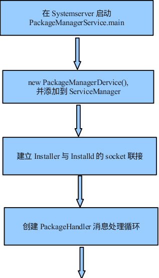
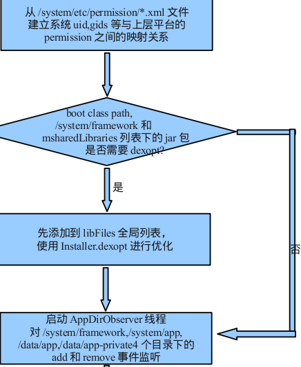
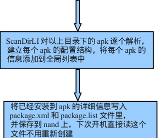

# PackageManagerService

## 1. 概述

　　PackageManagerService，简称 PMS，PMS 用来管理所有的 package 信息，包括安装、卸载、更新以及解析 AndroidManifext.xml 以组织相应的数据结构，这些数据结构将会被 PMS 、ActivityManagerService 等等 service 和 application 使用到。

　　PMS 有几个比较重要的命令可以用于 debug 中：

1. adb shell dumpsys package（dump 出系统中所有的 application 信息）
2. adb shell dumpsys package “com.android.contacts” p （dump 出系统中特定包名的 application 信息）

## 2. PMS 的启动

　　PMS 是在 SystemServer 进程中启动的。

　　先来看 SystemServer 的 main 方法:

### 1. SysterServer#main

```java
    public static void main(String[] args) {
        new SystemServer().run();
    }
```

　　main 方法中只调用了 SystemServer 的 run 方法。

### 2. SystemServer#run

```java
    private void run() {
        try {
            ...

            // Prepare the main looper thread (this thread).
            android.os.Process.setThreadPriority(
                android.os.Process.THREAD_PRIORITY_FOREGROUND);
            android.os.Process.setCanSelfBackground(false);
            Looper.prepareMainLooper();

            // Initialize native services.
            // 加载了 libandroid_server.so
            System.loadLibrary("android_servers");

            ...

            // Create the system service manager.
            // 创建 SystemServerManager
            // 它会对系统的服务进行创建、启动和生命周期管理
            mSystemServiceManager = new SystemServiceManager(mSystemContext);
            mSystemServiceManager.setRuntimeRestarted(mRuntimeRestart);
            LocalServices.addService(SystemServiceManager.class, mSystemServiceManager);
            // Prepare the thread pool for init tasks that can be parallelized
            SystemServerInitThreadPool.get();
        } finally {
            traceEnd();  // InitBeforeStartServices
        }

        // Start services.
        // 启动各种服务
        try {
            traceBeginAndSlog("StartServices");
            // 用 SystemServiceManager 启动了 ActivityManangerService、PowerManagerService、PackageManagerService 等服务。
            startBootstrapServices();
            // 启动了 BatteryService、UsageStatsService 和 WebVideUpdateService。
            startCoreServices();
            // 启动了 CameService、AlarmManagerService、VrManagerService 等服务。
            startOtherServices();
            SystemServerInitThreadPool.shutdown();
        } catch (Throwable ex) {
            Slog.e("System", "******************************************");
            Slog.e("System", "************ Failure starting system services", ex);
            throw ex;
        } finally {
            traceEnd();
        }

        ...

        // Loop forever.
        Looper.loop();
        throw new RuntimeException("Main thread loop unexpectedly exited");
    }
```

　　使用 startBootstrapServices()、startCoreServices()、startOtherServices() 三个方法启动的服务的父类为 SystemService。

　　官方把大概 100 多个系统服务分为了三种类型，分别是引导服务、核心服务和其他服务，其中其他服务为一些非紧要和一些不需要立即启动的服务，WMS 就是其他服务的一种。

### 3. SystemServer#startBootstrapServices

```java
    private void startBootstrapServices() {
    	...

		traceBeginAndSlog("StartPackageManagerService");
        // 创建 mPackageManagerService 对象
        mPackageManagerService = PackageManagerService.main(mSystemContext, installer,
                mFactoryTestMode != FactoryTest.FACTORY_TEST_OFF, mOnlyCore);
        mFirstBoot = mPackageManagerService.isFirstBoot();
        mPackageManager = mSystemContext.getPackageManager();
        traceEnd();
        
        if (!mRuntimeRestart && !isFirstBootOrUpgrade()) {
            MetricsLogger.histogram(null, "boot_package_manager_init_ready",
                    (int) SystemClock.elapsedRealtime());
        }
        // Manages A/B OTA dexopting. This is a bootstrap service as we need it to rename
        // A/B artifacts after boot, before anything else might touch/need them.
        // Note: this isn't needed during decryption (we don't have /data anyways).
        if (!mOnlyCore) {
            boolean disableOtaDexopt = SystemProperties.getBoolean("config.disable_otadexopt",
                    false);
            if (!disableOtaDexopt) {
                traceBeginAndSlog("StartOtaDexOptService");
                try {
                    OtaDexoptService.main(mSystemContext, mPackageManagerService);
                } catch (Throwable e) {
                    reportWtf("starting OtaDexOptService", e);
                } finally {
                    traceEnd();
                }
            }
        }
        ...
}
```


### 4. SystemServer#startOtherServices

```java
    private void startOtherServices() {
        ...

        if (!mOnlyCore) {
            traceBeginAndSlog("UpdatePackagesIfNeeded");
            try {
                mPackageManagerService.updatePackagesIfNeeded();
            } catch (Throwable e) {
                reportWtf("update packages", e);
            }
            traceEnd();
        }

        traceBeginAndSlog("PerformFstrimIfNeeded");
        try {
            mPackageManagerService.performFstrimIfNeeded();
        } catch (Throwable e) {
            reportWtf("performing fstrim", e);
        }
        traceEnd();
        
        ...
            
        traceBeginAndSlog("MakePackageManagerServiceReady");
        try {
            // 调用 PMS 的 systemReady 方法
            mPackageManagerService.systemReady();
        } catch (Throwable e) {
            reportWtf("making Package Manager Service ready", e);
        }
        traceEnd();
        ...
        mActivityManagerService.systemReady(() -> {
            ...
            mPackageManagerService.waitForAppDataPrepared();
            ...
        }

    }
```

### 5. PackageManagerService#main

```java
    public static PackageManagerService main(Context context, Installer installer,
            boolean factoryTest, boolean onlyCore) {
        // Self-check for initial settings.

        PackageManagerServiceCompilerMapping.checkProperties();
        // 构造一个 PMS 对象
        PackageManagerService m = new PackageManagerService(context, installer,
                factoryTest, onlyCore);
        m.enableSystemUserPackages();
        // 调用 ServiceManager 的 addService 注册这个服务
        ServiceManager.addService("package", m);
        return m;
    }
```

　　PackageManagerService 的构造函数的第二个参数是一个 Installer 对象，用于和 Installd 通信使用，第三个参数 factoryTest 为出厂测试，默认为 false，第四个参数 onlyCore 与 Vold 相关，也为 false。

### 6. PackageManagerService 的构造函数

　　PackageManagerService 构造函数的大概流程图：









　　将 PackageManagerService 构造函数分为 3 个部分来解析。

#### 6.1. PackageManagerService的构造函数1

```java
    public PackageManagerService(Context context, Installer installer,
            boolean factoryTest, boolean onlyCore) {
        ...

        mContext = context;

        mPermissionReviewRequired = context.getResources().getBoolean(
                R.bool.config_permissionReviewRequired);

        mFactoryTest = factoryTest;
        mOnlyCore = onlyCore;
        mMetrics = new DisplayMetrics();
        // 构造一个 Settings 对象
        mSettings = new Settings(mPackages);
        mSettings.addSharedUserLPw("android.uid.system", Process.SYSTEM_UID,
                ApplicationInfo.FLAG_SYSTEM, ApplicationInfo.PRIVATE_FLAG_PRIVILEGED);
        mSettings.addSharedUserLPw("android.uid.phone", RADIO_UID,
                ApplicationInfo.FLAG_SYSTEM, ApplicationInfo.PRIVATE_FLAG_PRIVILEGED);
        mSettings.addSharedUserLPw("android.uid.log", LOG_UID,
                ApplicationInfo.FLAG_SYSTEM, ApplicationInfo.PRIVATE_FLAG_PRIVILEGED);
        mSettings.addSharedUserLPw("android.uid.nfc", NFC_UID,
                ApplicationInfo.FLAG_SYSTEM, ApplicationInfo.PRIVATE_FLAG_PRIVILEGED);
        mSettings.addSharedUserLPw("android.uid.bluetooth", BLUETOOTH_UID,
                ApplicationInfo.FLAG_SYSTEM, ApplicationInfo.PRIVATE_FLAG_PRIVILEGED);
        mSettings.addSharedUserLPw("android.uid.shell", SHELL_UID,
                ApplicationInfo.FLAG_SYSTEM, ApplicationInfo.PRIVATE_FLAG_PRIVILEGED);
        ...
    }
```

　　Settings 是 Android 的全局管理者，用于协助 PMS 保存所有的安装包信息，PMS 和 Settings 之间的类图关系如下：


##### 6.1.1. Settings 的构造函数

```java
    Settings(Object lock) {
        this(Environment.getDataDirectory(), lock);
    }

    Settings(File dataDir, Object lock) {
        mLock = lock;

        mRuntimePermissionsPersistence = new RuntimePermissionPersistence(mLock);

        mSystemDir = new File(dataDir, "system");
        mSystemDir.mkdirs();
        FileUtils.setPermissions(mSystemDir.toString(),
                FileUtils.S_IRWXU|FileUtils.S_IRWXG
                |FileUtils.S_IROTH|FileUtils.S_IXOTH,
                -1, -1);
        mSettingsFilename = new File(mSystemDir, "packages.xml");
        mBackupSettingsFilename = new File(mSystemDir, "packages-backup.xml");
        mPackageListFilename = new File(mSystemDir, "packages.list");
        FileUtils.setPermissions(mPackageListFilename, 0640, SYSTEM_UID, PACKAGE_INFO_GID);

        final File kernelDir = new File("/config/sdcardfs");
        mKernelMappingFilename = kernelDir.exists() ? kernelDir : null;

        // Deprecated: Needed for migration
        mStoppedPackagesFilename = new File(mSystemDir, "packages-stopped.xml");
        mBackupStoppedPackagesFilename = new File(mSystemDir, "packages-stopped-backup.xml");
    }
```

　　Environment.getDataDirectory() 返回 /data 目录，然后创建 /data/system/目录，并设置它的权限，并在 /data/system 目录中创建 mSettingsFilename、mBackupSettingsFilename、mPackageListFilename、mStoppedPackagesFilename 和 mBackupStoppedPackagesFilename 几个文件。

　　packages.xml 就是保存了系统所有的 Package 信息，packages-backup.xml 是 packages.xml 的备份，防止在写 packages.xml 突然断电等问题。

##### 6.1.2. Process 中提供的 UID 列表

　　在 PMS 的构造函数，调用 addSharedUserLPw 将几种 SharedUserId 的名字和它对应的 UID 对应写到 Settings 当中。

　　先简单看一下 Process 中提供的 UID 列表。

```java
    /**
     * Defines the root UID.
     * @hide
     */
    public static final int ROOT_UID = 0;

    /**
     * Defines the UID/GID under which system code runs.
     */
    public static final int SYSTEM_UID = 1000;

    /**
     * Defines the UID/GID under which the telephony code runs.
     */
    public static final int PHONE_UID = 1001;

    /**
     * Defines the UID/GID for the user shell.
     * @hide
     */
    public static final int SHELL_UID = 2000;

    /**
     * Defines the UID/GID for the log group.
     * @hide
     */
    public static final int LOG_UID = 1007;

    /**
     * Defines the UID/GID for the WIFI supplicant process.
     * @hide
     */
    public static final int WIFI_UID = 1010;

    /**
     * Defines the UID/GID for the mediaserver process.
     * @hide
     */
    public static final int MEDIA_UID = 1013;

    /**
     * Defines the UID/GID for the DRM process.
     * @hide
     */
    public static final int DRM_UID = 1019;

    /**
     * Defines the UID/GID for the group that controls VPN services.
     * @hide
     */
    public static final int VPN_UID = 1016;

    /**
     * Defines the UID/GID for keystore.
     * @hide
     */
    public static final int KEYSTORE_UID = 1017;

    /**
     * Defines the UID/GID for the NFC service process.
     * @hide
     */
    public static final int NFC_UID = 1027;

    /**
     * Defines the UID/GID for the Bluetooth service process.
     * @hide
     */
    public static final int BLUETOOTH_UID = 1002;

    /**
     * Defines the GID for the group that allows write access to the internal media storage.
     * @hide
     */
    public static final int MEDIA_RW_GID = 1023;

    /**
     * Access to installed package details
     * @hide
     */
    public static final int PACKAGE_INFO_GID = 1032;

    /**
     * Defines the UID/GID for the shared RELRO file updater process.
     * @hide
     */
    public static final int SHARED_RELRO_UID = 1037;

    /**
     * Defines the UID/GID for the audioserver process.
     * @hide
     */
    public static final int AUDIOSERVER_UID = 1041;

    /**
     * Defines the UID/GID for the cameraserver process
     * @hide
     */
    public static final int CAMERASERVER_UID = 1047;

    /**
     * Defines the UID/GID for the WebView zygote process.
     * @hide
     */
    public static final int WEBVIEW_ZYGOTE_UID = 1051;

    /**
     * Defines the UID used for resource tracking for OTA updates.
     * @hide
     */
    public static final int OTA_UPDATE_UID = 1061;

    /**
     * Defines the start of a range of UIDs (and GIDs), going from this
     * number to {@link #LAST_APPLICATION_UID} that are reserved for assigning
     * to applications.
     */
    public static final int FIRST_APPLICATION_UID = 10000;

    /**
     * Last of application-specific UIDs starting at
     * {@link #FIRST_APPLICATION_UID}.
     */
    public static final int LAST_APPLICATION_UID = 19999;

```

　　上面定义了一系列的 UID，其中 application 的 uid 从 10000 开始到 19999 结束。

##### 6.1.3. Settings#addSharedUserLPw

```java
    SharedUserSetting addSharedUserLPw(String name, int uid, int pkgFlags, int pkgPrivateFlags) {
        SharedUserSetting s = mSharedUsers.get(name);
        if (s != null) {
            if (s.userId == uid) {
                return s;
            }
            PackageManagerService.reportSettingsProblem(Log.ERROR,
                    "Adding duplicate shared user, keeping first: " + name);
            return null;
        }
        s = new SharedUserSetting(name, pkgFlags, pkgPrivateFlags);
        s.userId = uid;
        if (addUserIdLPw(uid, s, name)) {
            mSharedUsers.put(name, s);
            return s;
        }
        return null;
    }
    private boolean addUserIdLPw(int uid, Object obj, Object name) {
        if (uid > Process.LAST_APPLICATION_UID) {
            return false;
        }

        if (uid >= Process.FIRST_APPLICATION_UID) {
            int N = mUserIds.size();
            final int index = uid - Process.FIRST_APPLICATION_UID;
            while (index >= N) {
                mUserIds.add(null);
                N++;
            }
            if (mUserIds.get(index) != null) {
                PackageManagerService.reportSettingsProblem(Log.ERROR,
                        "Adding duplicate user id: " + uid
                        + " name=" + name);
                return false;
            }
            mUserIds.set(index, obj);
        } else {
            if (mOtherUserIds.get(uid) != null) {
                PackageManagerService.reportSettingsProblem(Log.ERROR,
                        "Adding duplicate shared id: " + uid
                                + " name=" + name);
                return false;
            }
            mOtherUserIds.put(uid, obj);
        }
        return true;
    }
```

　　mSharedUsers 是一个 HashMap，保存着所有的 name 和 SharedUserSetting 的映射关系。

　　这里先调用 addUserIdLPw 将 uid 和 SharedUserSetting 添加到 mOtherUserIds 中，然后将 name 和 SharedUserSetting 添加到 mSharedUsers 中方便以后查找。


#### 6.2. PackageManagerService 的构造函数2

```java
    public PackageManagerService(Context context, Installer installer,
            boolean factoryTest, boolean onlyCore) {
            ...
                
        mInstaller = installer;
        mPackageDexOptimizer = new PackageDexOptimizer(installer, mInstallLock, context,
                "*dexopt*");
        mDexManager = new DexManager(this, mPackageDexOptimizer, installer, mInstallLock);
        mMoveCallbacks = new MoveCallbacks(FgThread.get().getLooper());

        mOnPermissionChangeListeners = new OnPermissionChangeListeners(
                FgThread.get().getLooper());

        //首先获取显示屏的相关信息并保存在 mMetrics 中
        getDefaultDisplayMetrics(context, mMetrics);

        Trace.traceBegin(TRACE_TAG_PACKAGE_MANAGER, "get system config");
        // 创建 SystemConfig 对象
        SystemConfig systemConfig = SystemConfig.getInstance();
        mGlobalGids = systemConfig.getGlobalGids();
        mSystemPermissions = systemConfig.getSystemPermissions();
        mAvailableFeatures = systemConfig.getAvailableFeatures();
        Trace.traceEnd(TRACE_TAG_PACKAGE_MANAGER);

        mProtectedPackages = new ProtectedPackages(mContext);

        synchronized (mInstallLock) {
        // writer
        synchronized (mPackages) {
            mHandlerThread = new ServiceThread(TAG,
                    Process.THREAD_PRIORITY_BACKGROUND, true /*allowIo*/);
            mHandlerThread.start();
            // 启动 "PackageManager" 的 HandleThread 并绑定到 PackageHandler 上
            // 这就是最后处理所有的跨进程消息的 handler
            mHandler = new PackageHandler(mHandlerThread.getLooper());
            mProcessLoggingHandler = new ProcessLoggingHandler();
            Watchdog.getInstance().addThread(mHandler, WATCHDOG_TIMEOUT);

            mDefaultPermissionPolicy = new DefaultPermissionGrantPolicy(this);
            mInstantAppRegistry = new InstantAppRegistry(this);

            File dataDir = Environment.getDataDirectory();
            mAppInstallDir = new File(dataDir, "app");
            mAppLib32InstallDir = new File(dataDir, "app-lib");
            mAsecInternalPath = new File(dataDir, "app-asec").getPath();
            mDrmAppPrivateInstallDir = new File(dataDir, "app-private");
            sUserManager = new UserManagerService(context, this,
                    new UserDataPreparer(mInstaller, mInstallLock, mContext, mOnlyCore), mPackages);

            // Propagate permission configuration in to package manager.
            // 将权限配置到包管理器
            ArrayMap<String, SystemConfig.PermissionEntry> permConfig
                    = systemConfig.getPermissions();
            for (int i=0; i<permConfig.size(); i++) {
                SystemConfig.PermissionEntry perm = permConfig.valueAt(i);
                BasePermission bp = mSettings.mPermissions.get(perm.name);
                if (bp == null) {
                    bp = new BasePermission(perm.name, "android", BasePermission.TYPE_BUILTIN);
                    mSettings.mPermissions.put(perm.name, bp);
                }
                if (perm.gids != null) {
                    bp.setGids(perm.gids, perm.perUser);
                }
            }

            ArrayMap<String, String> libConfig = systemConfig.getSharedLibraries();
            final int builtInLibCount = libConfig.size();
            for (int i = 0; i < builtInLibCount; i++) {
                String name = libConfig.keyAt(i);
                String path = libConfig.valueAt(i);
                addSharedLibraryLPw(path, null, name, SharedLibraryInfo.VERSION_UNDEFINED,
                        SharedLibraryInfo.TYPE_BUILTIN, PLATFORM_PACKAGE_NAME, 0);
            }

            mFoundPolicyFile = SELinuxMMAC.readInstallPolicy();

            Trace.traceBegin(TRACE_TAG_PACKAGE_MANAGER, "read user settings");
            mFirstBoot = !mSettings.readLPw(sUserManager.getUsers(false));
            Trace.traceEnd(TRACE_TAG_PACKAGE_MANAGER);
            ...
       }
       ...
}
```

　　首先获得显示屏的相关信息并保存在 mMetrics 中，然后启动 “PackageManager” 的 HandleThread 并绑定到 PackageHandler 上，这就是最后处理所有的跨进程消息的 handler。接着调用 systemConfig.getPermissions() 将权限配置到包管理器。

##### 6.2.1. SystemConfig#getInstance

```java
    public static SystemConfig getInstance() {
        static SystemConfig sInstance;
        synchronized (SystemConfig.class) {
            if (sInstance == null) {
                sInstance = new SystemConfig();
            }
            return sInstance;
        }
    }
```

　　可以看到 SystemConfig 是单例模式，全局一周一个对象。

##### 6.2.2. SystemConfig 的构造方法

```java
    SystemConfig() {
        // Read configuration from system
        readPermissions(Environment.buildPath(
                Environment.getRootDirectory(), "etc", "sysconfig"), ALLOW_ALL);
        // Read configuration from the old permissions dir
        readPermissions(Environment.buildPath(
                Environment.getRootDirectory(), "etc", "permissions"), ALLOW_ALL);
        // Allow Vendor to customize system configs around libs, features, permissions and apps
        int vendorPermissionFlag = ALLOW_LIBS | ALLOW_FEATURES | ALLOW_PERMISSIONS |
                ALLOW_APP_CONFIGS;
        readPermissions(Environment.buildPath(
                Environment.getVendorDirectory(), "etc", "sysconfig"), vendorPermissionFlag);
        readPermissions(Environment.buildPath(
                Environment.getVendorDirectory(), "etc", "permissions"), vendorPermissionFlag);
        // Allow ODM to customize system configs around libs, features and apps
        int odmPermissionFlag = ALLOW_LIBS | ALLOW_FEATURES | ALLOW_APP_CONFIGS;
        readPermissions(Environment.buildPath(
                Environment.getOdmDirectory(), "etc", "sysconfig"), odmPermissionFlag);
        readPermissions(Environment.buildPath(
                Environment.getOdmDirectory(), "etc", "permissions"), odmPermissionFlag);
        // Only allow OEM to customize features
        readPermissions(Environment.buildPath(
                Environment.getOemDirectory(), "etc", "sysconfig"), ALLOW_FEATURES);
        readPermissions(Environment.buildPath(
                Environment.getOemDirectory(), "etc", "permissions"), ALLOW_FEATURES);
    }
```

　　在 SystemConfig 的构造方法中就是调用 readPermissions 方法来处理系统的 sysconfig 和 permissions 相关的文件。

##### 6.2.3. SystemConfig#readPermissions

　　在 /etc/permissions 的文件大多来源于代码中的 frameworks/native/data/etc，这些文件的作用是表明系统支持的 feature 有哪些，例如是否支持蓝牙、wifi、P2P 等。

　　这些文件的内容很简单，例如 android.hardware.bluetooth.xml 的内容如下：

```xml
<permissions>
    <feature name="android.hardware.bluetooth" />
</permissions>
```

　　在 /etc/permissions 中有一个 platform.xml，它是来源于 frameworks/base/data/etc/ 中，其中内容大致如下：

```xml

    <permission name="android.permission.BLUETOOTH_ADMIN" >
        <group gid="net_bt_admin" />
    </permission>
 
    <permission name="android.permission.BLUETOOTH" >
        <group gid="net_bt" />
    </permission>
 
    <permission name="android.permission.BLUETOOTH_STACK" >
        <group gid="net_bt_stack" />
    </permission>
 
    <permission name="android.permission.NET_TUNNELING" >
        <group gid="vpn" />
    </permission>
 
    <permission name="android.permission.INTERNET" >
        <group gid="inet" />
    </permission>
 
    <assign-permission name="android.permission.MODIFY_AUDIO_SETTINGS" uid="media" />
    <assign-permission name="android.permission.ACCESS_SURFACE_FLINGER" uid="media" />
    <assign-permission name="android.permission.WAKE_LOCK" uid="media" />
    <assign-permission name="android.permission.UPDATE_DEVICE_STATS" uid="media" />
    <assign-permission name="android.permission.UPDATE_APP_OPS_STATS" uid="media" />
 
    <assign-permission name="android.permission.ACCESS_SURFACE_FLINGER" uid="graphics" />
 
 
    <library name="android.test.runner"
            file="/system/framework/android.test.runner.jar" />
    <library name="javax.obex"
            file="/system/framework/javax.obex.jar"/>
```

　　readPermissions 的实现：

```java
    void readPermissions(File libraryDir, int permissionFlag) {
        // Read permissions from given directory.
        if (!libraryDir.exists() || !libraryDir.isDirectory()) {
            if (permissionFlag == ALLOW_ALL) {
                Slog.w(TAG, "No directory " + libraryDir + ", skipping");
            }
            return;
        }
        if (!libraryDir.canRead()) {
            Slog.w(TAG, "Directory " + libraryDir + " cannot be read");
            return;
        }

        // Iterate over the files in the directory and scan .xml files
        File platformFile = null;
        for (File f : libraryDir.listFiles()) {
            // We'll read platform.xml last
            if (f.getPath().endsWith("etc/permissions/platform.xml")) {
                platformFile = f;
                continue;
            }

            if (!f.getPath().endsWith(".xml")) {
                Slog.i(TAG, "Non-xml file " + f + " in " + libraryDir + " directory, ignoring");
                continue;
            }
            if (!f.canRead()) {
                Slog.w(TAG, "Permissions library file " + f + " cannot be read");
                continue;
            }

            readPermissionsFromXml(f, permissionFlag);
        }

        // Read platform permissions last so it will take precedence
        if (platformFile != null) {
            readPermissionsFromXml(platformFile, permissionFlag);
        }
    }
```

　　首先不断地读出 /etc/permissions 或 /etc/sysconfig 下面的文件，并依次处理处理除了 platform.xml 以外的其他 xml 文件，并最后处理 platform.xml 文件。

##### 6.2.4. SystemConfig#readPermissionsFromXml

```java
    private void readPermissionsFromXml(File permFile, int permissionFlag) {
        FileReader permReader = null;
        try {
            permReader = new FileReader(permFile);
        } catch (FileNotFoundException e) {
            Slog.w(TAG, "Couldn't find or open permissions file " + permFile);
            return;
        }

        final boolean lowRam = ActivityManager.isLowRamDeviceStatic();

        try {
            XmlPullParser parser = Xml.newPullParser();
            parser.setInput(permReader);

            int type;
            while ((type=parser.next()) != parser.START_TAG
                       && type != parser.END_DOCUMENT) {
                ;
            }

            if (type != parser.START_TAG) {
                throw new XmlPullParserException("No start tag found");
            }

            if (!parser.getName().equals("permissions") && !parser.getName().equals("config")) {
                throw new XmlPullParserException("Unexpected start tag in " + permFile
                        + ": found " + parser.getName() + ", expected 'permissions' or 'config'");
            }

            boolean allowAll = permissionFlag == ALLOW_ALL;
            boolean allowLibs = (permissionFlag & ALLOW_LIBS) != 0;
            boolean allowFeatures = (permissionFlag & ALLOW_FEATURES) != 0;
            boolean allowPermissions = (permissionFlag & ALLOW_PERMISSIONS) != 0;
            boolean allowAppConfigs = (permissionFlag & ALLOW_APP_CONFIGS) != 0;
            boolean allowPrivappPermissions = (permissionFlag & ALLOW_PRIVAPP_PERMISSIONS) != 0;
            while (true) {
                XmlUtils.nextElement(parser);
                if (parser.getEventType() == XmlPullParser.END_DOCUMENT) {
                    break;
                }

                String name = parser.getName();
                if ("group".equals(name) && allowAll) {
                    String gidStr = parser.getAttributeValue(null, "gid");
                    if (gidStr != null) {
                        int gid = android.os.Process.getGidForName(gidStr);
                        mGlobalGids = appendInt(mGlobalGids, gid);
                    } else {
                        Slog.w(TAG, "<group> without gid in " + permFile + " at "
                                + parser.getPositionDescription());
                    }

                    XmlUtils.skipCurrentTag(parser);
                    continue;
                } else if ("permission".equals(name) && allowPermissions) {
                    String perm = parser.getAttributeValue(null, "name");
                    if (perm == null) {
                        Slog.w(TAG, "<permission> without name in " + permFile + " at "
                                + parser.getPositionDescription());
                        XmlUtils.skipCurrentTag(parser);
                        continue;
                    }
                    perm = perm.intern();
                    readPermission(parser, perm);

                } else if ("assign-permission".equals(name) && allowPermissions) {
                    String perm = parser.getAttributeValue(null, "name");
                    if (perm == null) {
                        Slog.w(TAG, "<assign-permission> without name in " + permFile + " at "
                                + parser.getPositionDescription());
                        XmlUtils.skipCurrentTag(parser);
                        continue;
                    }
                    String uidStr = parser.getAttributeValue(null, "uid");
                    if (uidStr == null) {
                        Slog.w(TAG, "<assign-permission> without uid in " + permFile + " at "
                                + parser.getPositionDescription());
                        XmlUtils.skipCurrentTag(parser);
                        continue;
                    }
                    int uid = Process.getUidForName(uidStr);
                    if (uid < 0) {
                        Slog.w(TAG, "<assign-permission> with unknown uid \""
                                + uidStr + "  in " + permFile + " at "
                                + parser.getPositionDescription());
                        XmlUtils.skipCurrentTag(parser);
                        continue;
                    }
                    perm = perm.intern();
                    ArraySet<String> perms = mSystemPermissions.get(uid);
                    if (perms == null) {
                        perms = new ArraySet<String>();
                        mSystemPermissions.put(uid, perms);
                    }
                    perms.add(perm);
                    XmlUtils.skipCurrentTag(parser);

                } else if ("library".equals(name) && allowLibs) {
                    String lname = parser.getAttributeValue(null, "name");
                    String lfile = parser.getAttributeValue(null, "file");
                    if (lname == null) {
                        Slog.w(TAG, "<library> without name in " + permFile + " at "
                                + parser.getPositionDescription());
                    } else if (lfile == null) {
                        Slog.w(TAG, "<library> without file in " + permFile + " at "
                                + parser.getPositionDescription());
                    } else {
                        //Log.i(TAG, "Got library " + lname + " in " + lfile);
                        mSharedLibraries.put(lname, lfile);
                    }
                    XmlUtils.skipCurrentTag(parser);
                    continue;

                } else if ("feature".equals(name) && allowFeatures) {
                    String fname = parser.getAttributeValue(null, "name");
                    int fversion = XmlUtils.readIntAttribute(parser, "version", 0);
                    boolean allowed;
                    if (!lowRam) {
                        allowed = true;
                    } else {
                        String notLowRam = parser.getAttributeValue(null, "notLowRam");
                        allowed = !"true".equals(notLowRam);
                    }
                    if (fname == null) {
                        Slog.w(TAG, "<feature> without name in " + permFile + " at "
                                + parser.getPositionDescription());
                    } else if (allowed) {
                        addFeature(fname, fversion);
                    }
                    XmlUtils.skipCurrentTag(parser);
                    continue;

                } 
                ...
         
                    
            }
        } catch (XmlPullParserException e) {
            Slog.w(TAG, "Got exception parsing permissions.", e);
        } catch (IOException e) {
            Slog.w(TAG, "Got exception parsing permissions.", e);
        } finally {
            IoUtils.closeQuietly(permReader);
        }

        // Some devices can be field-converted to FBE, so offer to splice in
        // those features if not already defined by the static config
        if (StorageManager.isFileEncryptedNativeOnly()) {
            addFeature(PackageManager.FEATURE_FILE_BASED_ENCRYPTION, 0);
            addFeature(PackageManager.FEATURE_SECURELY_REMOVES_USERS, 0);
        }

        for (String featureName : mUnavailableFeatures) {
            removeFeature(featureName);
        }
    }
```

　　这个方法比较长，主要看处理 feature、permission、assign-permission 和 library 的部分。

　　首先来看处理 feature 这个 tag 的代码，在 fname 中保存 feature 的名字，然后调用 addFeature 方法。

###### SystemConfig#addFeature

```java
    private void addFeature(String name, int version) {
        FeatureInfo fi = mAvailableFeatures.get(name);
        if (fi == null) {
            fi = new FeatureInfo();
            fi.name = name;
            fi.version = version;
            mAvailableFeatures.put(name, fi);
        } else {
            fi.version = Math.max(fi.version, version);
        }
    }
```

　　addFeature 方法创建了一个 FeatureInfo 对象，并将 fname 和 FeatureInfo 保存到 mAvailableFeatures 这个 HashMap 中。

　　接着看处理 permission tag ，首先读出 permission 的 name，然后调用 readPermission 去处理后面的 group 信息。

###### SystemConfig#readPermission

```java
    void readPermission(XmlPullParser parser, String name)
            throws IOException, XmlPullParserException {
        if (mPermissions.containsKey(name)) {
            throw new IllegalStateException("Duplicate permission definition for " + name);
        }

        final boolean perUser = XmlUtils.readBooleanAttribute(parser, "perUser", false);
        final PermissionEntry perm = new PermissionEntry(name, perUser);
        mPermissions.put(name, perm);

        int outerDepth = parser.getDepth();
        int type;
        while ((type=parser.next()) != XmlPullParser.END_DOCUMENT
               && (type != XmlPullParser.END_TAG
                       || parser.getDepth() > outerDepth)) {
            if (type == XmlPullParser.END_TAG
                    || type == XmlPullParser.TEXT) {
                continue;
            }

            String tagName = parser.getName();
            if ("group".equals(tagName)) {
                String gidStr = parser.getAttributeValue(null, "gid");
                if (gidStr != null) {
                    int gid = Process.getGidForName(gidStr);
                    perm.gids = appendInt(perm.gids, gid);
                } else {
                    Slog.w(TAG, "<group> without gid at "
                            + parser.getPositionDescription());
                }
            }
            XmlUtils.skipCurrentTag(parser);
        }
    }
```

　　readPermission 方法显示拿到 perUser 字段的值，用 name 和 perUser 创建一个 PermissionEntry 对象 perm，将 name 作为 key，perm 为 value 存储在 mPermission 中。

　　Android 管理权限的机制其实就是对应相应的 permission，用一个 gid 号来描述，当一个应用程序亲亲贵这个 permission 的时候，就把这个 hid 号添加到对对应的 application 中去。

　　process.getGidForName 方法通过 JNI 调用 getgrnam 系统喊出去获取相应的组名称所对应的 gid 号，并把它添加到 BasePermission 对象的 gids 数组中。

　　再看处理 assign-permission 这个 tag 的代码，首先读出 permission 的名字和 uid，保存在 perm 和 uidStr 中，Process.getUidForName 方法通过 JNI 调用 getpwnam 系统函数获取相应的用户名所对应的 uid 号，并把刚解析的 permission 名添加到 ArraySet perms当中，最后把上面的 uid 和 perms 添加到 mSystemPermissions 这个 SparseArray 类型数组中。

　　最后再看处理 library 这个 tag 的代码，这里把解析处理的 library 名字和路径保存在 mSharedLibraries 这个 ArrayMap 中。

#### 6.3. PackageManagerService 的构造函数3

```java
            Trace.traceBegin(TRACE_TAG_PACKAGE_MANAGER, "read user settings");
            // 是否是第一次开机
            mFirstBoot = !mSettings.readLPw(sUserManager.getUsers(false));
            Trace.traceEnd(TRACE_TAG_PACKAGE_MANAGER);

            // Clean up orphaned packages for which the code path doesn't exist
            // and they are an update to a system app - caused by bug/32321269
            final int packageSettingCount = mSettings.mPackages.size();
            for (int i = packageSettingCount - 1; i >= 0; i--) {
                PackageSetting ps = mSettings.mPackages.valueAt(i);
                if (!isExternal(ps) && (ps.codePath == null || !ps.codePath.exists())
                        && mSettings.getDisabledSystemPkgLPr(ps.name) != null) {
                    mSettings.mPackages.removeAt(i);
                    mSettings.enableSystemPackageLPw(ps.name);
                }
            }

            if (mFirstBoot) {
                requestCopyPreoptedFiles();
            }

            String customResolverActivity = Resources.getSystem().getString(
                    R.string.config_customResolverActivity);
            if (TextUtils.isEmpty(customResolverActivity)) {
                customResolverActivity = null;
            } else {
                mCustomResolverComponentName = ComponentName.unflattenFromString(
                        customResolverActivity);
            }

            long startTime = SystemClock.uptimeMillis();

            EventLog.writeEvent(EventLogTags.BOOT_PROGRESS_PMS_SYSTEM_SCAN_START,
                    startTime);
// 把 

            final String bootClassPath = System.getenv("BOOTCLASSPATH");
            final String systemServerClassPath = System.getenv("SYSTEMSERVERCLASSPATH");

            if (bootClassPath == null) {
                Slog.w(TAG, "No BOOTCLASSPATH found!");
            }
```


## 参考文章

1. [Android PackageManagerService 分析一：PMS 的启动](https://blog.csdn.net/lilian0118/article/details/24455019)
2. [Android PackageManagerService分析二：安装APK](https://blog.csdn.net/lilian0118/article/details/25792601)
3. [Android PackageManagerService分析三：卸载APK](https://blog.csdn.net/lilian0118/article/details/26362359)