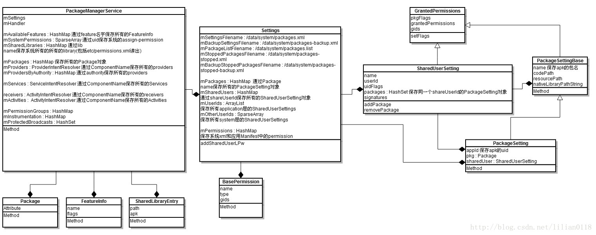
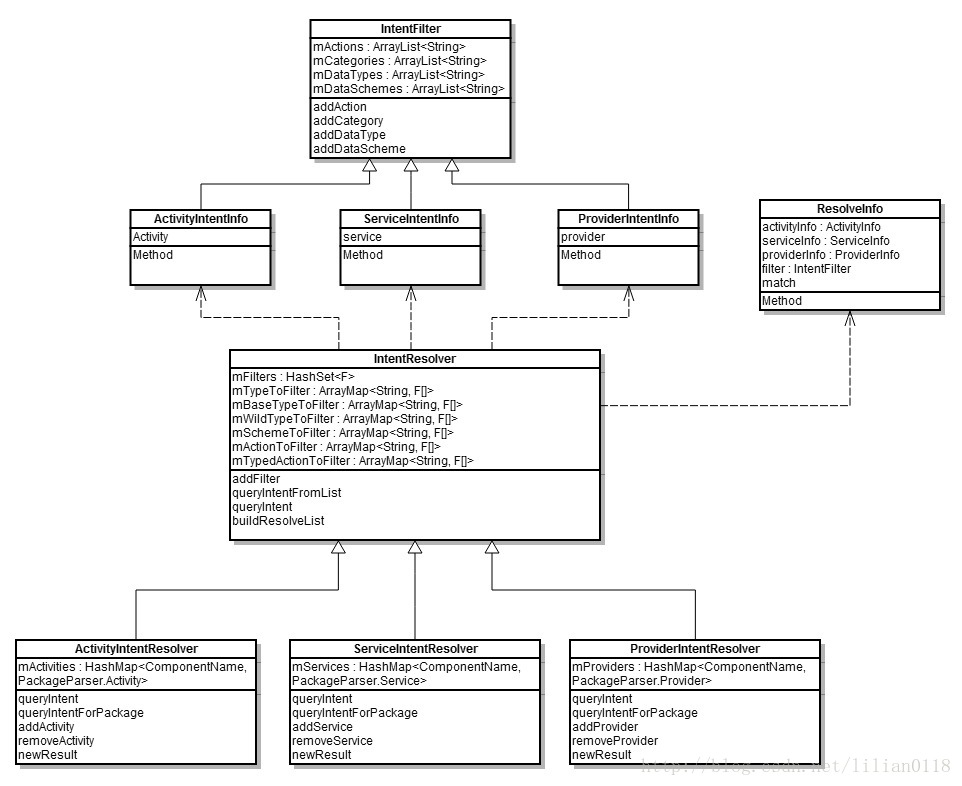

# PackageManagerService 之启动解析

## 1. 概述

　　PackageManagerService，简称 PMS，PMS 用来管理所有的 package 信息，包括安装、卸载、更新以及解析 AndroidManifext.xml 以组织相应的数据结构，这些数据结构将会被 PMS 、ActivityManagerService 等等 service 和 application 使用到。

　　PMS 有几个比较重要的命令可以用于 debug 中：

1. adb shell dumpsys package（dump 出系统中所有的 application 信息）
2. adb shell dumpsys package “com.android.contacts” p （dump 出系统中特定包名的 application 信息）

## 2. PMS 的启动

　　PMS 是在 SystemServer 进程中启动的。

　　先来看 SystemServer 的 main 方法:

### 2.1. SysterServer#main

```java
    public static void main(String[] args) {
        new SystemServer().run();
    }
```

　　main 方法中只调用了 SystemServer 的 run 方法。

### 2.2. SystemServer#run

```java
    private void run() {
        try {
            ...

            // Prepare the main looper thread (this thread).
            android.os.Process.setThreadPriority(
                android.os.Process.THREAD_PRIORITY_FOREGROUND);
            android.os.Process.setCanSelfBackground(false);
            Looper.prepareMainLooper();

            // Initialize native services.
            // 加载了 libandroid_server.so
            System.loadLibrary("android_servers");

            ...

            // Create the system service manager.
            // 创建 SystemServerManager
            // 它会对系统的服务进行创建、启动和生命周期管理
            mSystemServiceManager = new SystemServiceManager(mSystemContext);
            mSystemServiceManager.setRuntimeRestarted(mRuntimeRestart);
            LocalServices.addService(SystemServiceManager.class, mSystemServiceManager);
            // Prepare the thread pool for init tasks that can be parallelized
            SystemServerInitThreadPool.get();
        } finally {
            traceEnd();  // InitBeforeStartServices
        }

        // Start services.
        // 启动各种服务
        try {
            traceBeginAndSlog("StartServices");
            // 用 SystemServiceManager 启动了 ActivityManangerService、PowerManagerService、PackageManagerService 等服务。
            startBootstrapServices();
            // 启动了 BatteryService、UsageStatsService 和 WebVideUpdateService。
            startCoreServices();
            // 启动了 CameService、AlarmManagerService、VrManagerService 等服务。
            startOtherServices();
            SystemServerInitThreadPool.shutdown();
        } catch (Throwable ex) {
            Slog.e("System", "******************************************");
            Slog.e("System", "************ Failure starting system services", ex);
            throw ex;
        } finally {
            traceEnd();
        }

        ...

        // Loop forever.
        Looper.loop();
        throw new RuntimeException("Main thread loop unexpectedly exited");
    }
```

　　使用 startBootstrapServices()、startCoreServices()、startOtherServices() 三个方法启动的服务的父类为 SystemService。

　　官方把大概 100 多个系统服务分为了三种类型，分别是引导服务、核心服务和其他服务，其中其他服务为一些非紧要和一些不需要立即启动的服务，WMS 就是其他服务的一种。

### 2.3. SystemServer#startBootstrapServices

```java
    private void startBootstrapServices() {
    	...

		traceBeginAndSlog("StartPackageManagerService");
        // 创建 mPackageManagerService 对象
        mPackageManagerService = PackageManagerService.main(mSystemContext, installer,
                mFactoryTestMode != FactoryTest.FACTORY_TEST_OFF, mOnlyCore);
        mFirstBoot = mPackageManagerService.isFirstBoot();
        mPackageManager = mSystemContext.getPackageManager();
        traceEnd();
        
        if (!mRuntimeRestart && !isFirstBootOrUpgrade()) {
            MetricsLogger.histogram(null, "boot_package_manager_init_ready",
                    (int) SystemClock.elapsedRealtime());
        }
        // Manages A/B OTA dexopting. This is a bootstrap service as we need it to rename
        // A/B artifacts after boot, before anything else might touch/need them.
        // Note: this isn't needed during decryption (we don't have /data anyways).
        if (!mOnlyCore) {
            boolean disableOtaDexopt = SystemProperties.getBoolean("config.disable_otadexopt",
                    false);
            if (!disableOtaDexopt) {
                traceBeginAndSlog("StartOtaDexOptService");
                try {
                    OtaDexoptService.main(mSystemContext, mPackageManagerService);
                } catch (Throwable e) {
                    reportWtf("starting OtaDexOptService", e);
                } finally {
                    traceEnd();
                }
            }
        }
        ...
}
```


### 2.4. SystemServer#startOtherServices

```java
    private void startOtherServices() {
        ...

        if (!mOnlyCore) {
            traceBeginAndSlog("UpdatePackagesIfNeeded");
            try {
                mPackageManagerService.updatePackagesIfNeeded();
            } catch (Throwable e) {
                reportWtf("update packages", e);
            }
            traceEnd();
        }

        traceBeginAndSlog("PerformFstrimIfNeeded");
        try {
            mPackageManagerService.performFstrimIfNeeded();
        } catch (Throwable e) {
            reportWtf("performing fstrim", e);
        }
        traceEnd();
        
        ...
            
        traceBeginAndSlog("MakePackageManagerServiceReady");
        try {
            // 调用 PMS 的 systemReady 方法
            mPackageManagerService.systemReady();
        } catch (Throwable e) {
            reportWtf("making Package Manager Service ready", e);
        }
        traceEnd();
        ...
        mActivityManagerService.systemReady(() -> {
            ...
            mPackageManagerService.waitForAppDataPrepared();
            ...
        }

    }
```

### 2.5. PackageManagerService#main

```java
    public static PackageManagerService main(Context context, Installer installer,
            boolean factoryTest, boolean onlyCore) {
        // Self-check for initial settings.

        PackageManagerServiceCompilerMapping.checkProperties();
        // 构造一个 PMS 对象
        PackageManagerService m = new PackageManagerService(context, installer,
                factoryTest, onlyCore);
        m.enableSystemUserPackages();
        // 调用 ServiceManager 的 addService 注册这个服务
        ServiceManager.addService("package", m);
        return m;
    }
```

　　首先构造一个 PMS 对象，然后调用 ServiceManager 的 addService 注册这个服务。

　　PackageManagerService 的构造函数的第二个参数是一个 Installer 对象，用于和 Installd 通信使用，第三个参数 factoryTest 为出厂测试，默认为 false，第四个参数 onlyCore 与 Vold 相关，也为 false。

### 2.6. PackageManagerService 的构造函数

　　PackageManagerService 构造函数比较长，将 PackageManagerService 构造函数分为 5 个部分来解析。

#### 2.6.1. PackageManagerService 的构造函数 1

```java
    public PackageManagerService(Context context, Installer installer,
            boolean factoryTest, boolean onlyCore) {
        LockGuard.installLock(mPackages, LockGuard.INDEX_PACKAGES);
        Trace.traceBegin(TRACE_TAG_PACKAGE_MANAGER, "create package manager");
        // 向事件日志写入事件，标识 PackageManagerService 启动
        EventLog.writeEvent(EventLogTags.BOOT_PROGRESS_PMS_START,
                SystemClock.uptimeMillis());
        // SDK 版本检查

        if (mSdkVersion <= 0) {
            Slog.w(TAG, "**** ro.build.version.sdk not set!");
        }

        mContext = context;

        mPermissionReviewRequired = context.getResources().getBoolean(
                R.bool.config_permissionReviewRequired);
        // 开机模式是否为工厂模式

        mFactoryTest = factoryTest;
        // 是否仅启动内核
        mOnlyCore = onlyCore;
        // 构造 DisplayMetrics 对象以便获取尺寸数据数据
        mMetrics = new DisplayMetrics();
        // 构造 Settings 对象存储运行时的设置信息
        // Settings 是 Android 的全局管理者，用于协助 PMS 保存所有的安装包信息
        mSettings = new Settings(mPackages);
        // 添加一些用户 uid
        mSettings.addSharedUserLPw("android.uid.system", Process.SYSTEM_UID,
                ApplicationInfo.FLAG_SYSTEM, ApplicationInfo.PRIVATE_FLAG_PRIVILEGED);
        mSettings.addSharedUserLPw("android.uid.phone", RADIO_UID,
                ApplicationInfo.FLAG_SYSTEM, ApplicationInfo.PRIVATE_FLAG_PRIVILEGED);
        mSettings.addSharedUserLPw("android.uid.log", LOG_UID,
                ApplicationInfo.FLAG_SYSTEM, ApplicationInfo.PRIVATE_FLAG_PRIVILEGED);
        mSettings.addSharedUserLPw("android.uid.nfc", NFC_UID,
                ApplicationInfo.FLAG_SYSTEM, ApplicationInfo.PRIVATE_FLAG_PRIVILEGED);
        mSettings.addSharedUserLPw("android.uid.bluetooth", BLUETOOTH_UID,
                ApplicationInfo.FLAG_SYSTEM, ApplicationInfo.PRIVATE_FLAG_PRIVILEGED);
        mSettings.addSharedUserLPw("android.uid.shell", SHELL_UID,
                ApplicationInfo.FLAG_SYSTEM, ApplicationInfo.PRIVATE_FLAG_PRIVILEGED);
        
        // 判断是否在不同的进程

        String separateProcesses = SystemProperties.get("debug.separate_processes");
        if (separateProcesses != null && separateProcesses.length() > 0) {
            if ("*".equals(separateProcesses)) {
                mDefParseFlags = PackageParser.PARSE_IGNORE_PROCESSES;
                mSeparateProcesses = null;
                Slog.w(TAG, "Running with debug.separate_processes: * (ALL)");
            } else {
                mDefParseFlags = 0;
                mSeparateProcesses = separateProcesses.split(",");
                Slog.w(TAG, "Running with debug.separate_processes: "
                        + separateProcesses);
            }
        } else {
            mDefParseFlags = 0;
            mSeparateProcesses = null;
        }
        // installer 由 systemServer 构造，这里通过该对象与底层进行通信，进行具体安装、卸载的操作

        mInstaller = installer;
        // 创建 PackageDexOptimizer，该类用于辅助进行 dex 优化
        mPackageDexOptimizer = new PackageDexOptimizer(installer, mInstallLock, context,
                "*dexopt*");
        mDexManager = new DexManager(this, mPackageDexOptimizer, installer, mInstallLock);
        mMoveCallbacks = new MoveCallbacks(FgThread.get().getLooper());

        mOnPermissionChangeListeners = new OnPermissionChangeListeners(
                FgThread.get().getLooper());
		// 获得显示屏的相关信息并保存在 mMetrics
        getDefaultDisplayMetrics(context, mMetrics);

        Trace.traceBegin(TRACE_TAG_PACKAGE_MANAGER, "get system config");
        // 获取系统配置信息
        // 创建 SystemConfig 对象
        SystemConfig systemConfig = SystemConfig.getInstance();
        mGlobalGids = systemConfig.getGlobalGids();
        mSystemPermissions = systemConfig.getSystemPermissions();
        mAvailableFeatures = systemConfig.getAvailableFeatures();
        Trace.traceEnd(TRACE_TAG_PACKAGE_MANAGER);

        mProtectedPackages = new ProtectedPackages(mContext);

        synchronized (mInstallLock) {
        // writer
        synchronized (mPackages) {
            // 启动消息处理线程
            mHandlerThread = new ServiceThread(TAG,
                    Process.THREAD_PRIORITY_BACKGROUND, true /*allowIo*/);
            mHandlerThread.start();
            // 通过消息处理线程的 Looper 对象构造一个处理消息的 Handler 对象
            // 启动 "PackageManager" 的 HandleThread 并绑定到 PackageHandler 上，这就是最后处理所有的跨进程消息的 handler
            mHandler = new PackageHandler(mHandlerThread.getLooper());
            mProcessLoggingHandler = new ProcessLoggingHandler();
            // 使用看门狗检测当前消息处理线程
            Watchdog.getInstance().addThread(mHandler, WATCHDOG_TIMEOUT);

            mDefaultPermissionPolicy = new DefaultPermissionGrantPolicy(this);
            mInstantAppRegistry = new InstantAppRegistry(this);
            // 获取当前的 Data 目录

            File dataDir = Environment.getDataDirectory();
            mAppInstallDir = new File(dataDir, "app");
            mAppLib32InstallDir = new File(dataDir, "app-lib");
            mAsecInternalPath = new File(dataDir, "app-asec").getPath();
            mDrmAppPrivateInstallDir = new File(dataDir, "app-private");
            // 构造 UserManagerService 对象，创建用户管理服务
            sUserManager = new UserManagerService(context, this,
                    new UserDataPreparer(mInstaller, mInstallLock, mContext, mOnlyCore), mPackages);

            // Propagate permission configuration in to package manager.
            // 读取权限配置文件中的信息，保存到 mPermissions 这个 ArrayMap 中
            // 将权限配置到包管理器
            ArrayMap<String, SystemConfig.PermissionEntry> permConfig
                    = systemConfig.getPermissions();
            for (int i=0; i<permConfig.size(); i++) {
                SystemConfig.PermissionEntry perm = permConfig.valueAt(i);
                BasePermission bp = mSettings.mPermissions.get(perm.name);
                if (bp == null) {
                    bp = new BasePermission(perm.name, "android", BasePermission.TYPE_BUILTIN);
                    mSettings.mPermissions.put(perm.name, bp);
                }
                if (perm.gids != null) {
                    bp.setGids(perm.gids, perm.perUser);
                }
            }

            // 获取所有外部 lib
            ArrayMap<String, String> libConfig = systemConfig.getSharedLibraries();
            final int builtInLibCount = libConfig.size();
            for (int i = 0; i < builtInLibCount; i++) {
                String name = libConfig.keyAt(i);
                String path = libConfig.valueAt(i);
                addSharedLibraryLPw(path, null, name, SharedLibraryInfo.VERSION_UNDEFINED,
                        SharedLibraryInfo.TYPE_BUILTIN, PLATFORM_PACKAGE_NAME, 0);
            }

            // 尝试读取 mac_permissions.xml 并解析
            mFoundPolicyFile = SELinuxMMAC.readInstallPolicy();

            Trace.traceBegin(TRACE_TAG_PACKAGE_MANAGER, "read user settings");
            // 读取并解析 packages.xml 和 packages-backup.xml 等文件
            // 检查是否是第一次开机
            mFirstBoot = !mSettings.readLPw(sUserManager.getUsers(false));
            Trace.traceEnd(TRACE_TAG_PACKAGE_MANAGER);

            // Clean up orphaned packages for which the code path doesn't exist
            // and they are an update to a system app - caused by bug/32321269
            final int packageSettingCount = mSettings.mPackages.size();
            for (int i = packageSettingCount - 1; i >= 0; i--) {
                PackageSetting ps = mSettings.mPackages.valueAt(i);
                if (!isExternal(ps) && (ps.codePath == null || !ps.codePath.exists())
                        && mSettings.getDisabledSystemPkgLPr(ps.name) != null) {
                    mSettings.mPackages.removeAt(i);
                    mSettings.enableSystemPackageLPw(ps.name);
                }
            }

            if (mFirstBoot) {
                requestCopyPreoptedFiles();
            }
            // 判断是否自定义的解析界面

            String customResolverActivity = Resources.getSystem().getString(
                    R.string.config_customResolverActivity);
            if (TextUtils.isEmpty(customResolverActivity)) {
                customResolverActivity = null;
            } else {
                mCustomResolverComponentName = ComponentName.unflattenFromString(
                        customResolverActivity);
            }
            ...
       }
       ...
   }
```

　　首先获得显示屏的相关信息并保存在 mMetrics 中，然后启动 “PackageManager” 的 HandleThread 并绑定到 PackageHandler 上，这就是最后处理所有的跨进程消息的 handler。接着调用 systemConfig.getPermissions() 将权限配置到包管理器。

　　这个过程涉及的几个重要变量：

| 变量                     | 所对应目录        |
| ------------------------ | ----------------- |
| mAppDataDir              | /data/data        |
| mAppLib3InstallDir       | /data/app-lib     |
| mAsecInternalPath        | /data/app-asec    |
| mUserAppDataDir          | /data/user        |
| mAppInstallDir           | /data/app         |
| mDrmAppPrivateInstallDir | /data/app-private |

　　Settings 是 Android 的全局管理者，用于协助 PMS 保存所有的安装包信息，PMS 和 Settings 之间的类图关系如下：



##### 2.6.1.1. Settings 的构造函数

```java
    Settings(Object lock) {
        this(Environment.getDataDirectory(), lock);
    }

    Settings(File dataDir, Object lock) {
        mLock = lock;

        mRuntimePermissionsPersistence = new RuntimePermissionPersistence(mLock);

        mSystemDir = new File(dataDir, "system");
        // 创建 /data/system
        mSystemDir.mkdirs();
        FileUtils.setPermissions(mSystemDir.toString(),
                FileUtils.S_IRWXU|FileUtils.S_IRWXG
                |FileUtils.S_IROTH|FileUtils.S_IXOTH,
                -1, -1);
        mSettingsFilename = new File(mSystemDir, "packages.xml");
        mBackupSettingsFilename = new File(mSystemDir, "packages-backup.xml");
        mPackageListFilename = new File(mSystemDir, "packages.list");
        FileUtils.setPermissions(mPackageListFilename, 0640, SYSTEM_UID, PACKAGE_INFO_GID);

        final File kernelDir = new File("/config/sdcardfs");
        mKernelMappingFilename = kernelDir.exists() ? kernelDir : null;

        // Deprecated: Needed for migration
        mStoppedPackagesFilename = new File(mSystemDir, "packages-stopped.xml");
        mBackupStoppedPackagesFilename = new File(mSystemDir, "packages-stopped-backup.xml");
    }
```

　　此处 mSystemDir 是指目录 /data/system，在该目录有以下 5 个文件：

| 文件                         | 功能                     |
| ---------------------------- | ------------------------ |
| packages.xml                 | 记录所有安装 app 的信息  |
| packages-backup.xml          | 备份文件                 |
| packages-stopped.xml         | 记录系统被强制停止的文件 |
| packages-stoppped-backup.xml | 备份文件                 |
| packages.list                | 记录应用的数据信息       |

　　Environment.getDataDirectory() 返回 /data 目录，然后创建 /data/system/目录，并设置它的权限，并在 /data/system 目录中创建 mSettingsFilename、mBackupSettingsFilename、mPackageListFilename、mStoppedPackagesFilename 和 mBackupStoppedPackagesFilename 几个文件。

　　packages.xml 就是保存了系统所有的 Package 信息，packages-backup.xml 是 packages.xml 的备份，防止在写 packages.xml 突然断电等问题。

##### 2.6.1.2. Process 中提供的 UID 列表

　　在 PMS 的构造函数，调用 addSharedUserLPw 将几种 SharedUserId 的名字和它对应的 UID 对应写到 Settings 当中。

　　先简单看一下 Process 中提供的 UID 列表。

```java
    /**
     * Defines the root UID.
     * @hide
     */
    public static final int ROOT_UID = 0;

    /**
     * Defines the UID/GID under which system code runs.
     */
    public static final int SYSTEM_UID = 1000;

    /**
     * Defines the UID/GID under which the telephony code runs.
     */
    public static final int PHONE_UID = 1001;

    /**
     * Defines the UID/GID for the user shell.
     * @hide
     */
    public static final int SHELL_UID = 2000;

    /**
     * Defines the UID/GID for the log group.
     * @hide
     */
    public static final int LOG_UID = 1007;

    /**
     * Defines the UID/GID for the WIFI supplicant process.
     * @hide
     */
    public static final int WIFI_UID = 1010;

    /**
     * Defines the UID/GID for the mediaserver process.
     * @hide
     */
    public static final int MEDIA_UID = 1013;

    /**
     * Defines the UID/GID for the DRM process.
     * @hide
     */
    public static final int DRM_UID = 1019;

    /**
     * Defines the UID/GID for the group that controls VPN services.
     * @hide
     */
    public static final int VPN_UID = 1016;

    /**
     * Defines the UID/GID for keystore.
     * @hide
     */
    public static final int KEYSTORE_UID = 1017;

    /**
     * Defines the UID/GID for the NFC service process.
     * @hide
     */
    public static final int NFC_UID = 1027;

    /**
     * Defines the UID/GID for the Bluetooth service process.
     * @hide
     */
    public static final int BLUETOOTH_UID = 1002;

    /**
     * Defines the GID for the group that allows write access to the internal media storage.
     * @hide
     */
    public static final int MEDIA_RW_GID = 1023;

    /**
     * Access to installed package details
     * @hide
     */
    public static final int PACKAGE_INFO_GID = 1032;

    /**
     * Defines the UID/GID for the shared RELRO file updater process.
     * @hide
     */
    public static final int SHARED_RELRO_UID = 1037;

    /**
     * Defines the UID/GID for the audioserver process.
     * @hide
     */
    public static final int AUDIOSERVER_UID = 1041;

    /**
     * Defines the UID/GID for the cameraserver process
     * @hide
     */
    public static final int CAMERASERVER_UID = 1047;

    /**
     * Defines the UID/GID for the WebView zygote process.
     * @hide
     */
    public static final int WEBVIEW_ZYGOTE_UID = 1051;

    /**
     * Defines the UID used for resource tracking for OTA updates.
     * @hide
     */
    public static final int OTA_UPDATE_UID = 1061;

    /**
     * Defines the start of a range of UIDs (and GIDs), going from this
     * number to {@link #LAST_APPLICATION_UID} that are reserved for assigning
     * to applications.
     */
    public static final int FIRST_APPLICATION_UID = 10000;

    /**
     * Last of application-specific UIDs starting at
     * {@link #FIRST_APPLICATION_UID}.
     */
    public static final int LAST_APPLICATION_UID = 19999;

```

　　上面定义了一系列的 UID，其中 application 的 uid 从 10000 开始到 19999 结束。

##### 2.6.1.3. Settings#addSharedUserLPw

```java
    SharedUserSetting addSharedUserLPw(String name, int uid, int pkgFlags, int pkgPrivateFlags) {
        SharedUserSetting s = mSharedUsers.get(name);
        if (s != null) {
            if (s.userId == uid) {
                return s;
            }
            PackageManagerService.reportSettingsProblem(Log.ERROR,
                    "Adding duplicate shared user, keeping first: " + name);
            return null;
        }
        s = new SharedUserSetting(name, pkgFlags, pkgPrivateFlags);
        s.userId = uid;
        if (addUserIdLPw(uid, s, name)) {
            mSharedUsers.put(name, s);
            return s;
        }
        return null;
    }
    private boolean addUserIdLPw(int uid, Object obj, Object name) {
        if (uid > Process.LAST_APPLICATION_UID) {
            return false;
        }

        if (uid >= Process.FIRST_APPLICATION_UID) {
            int N = mUserIds.size();
            final int index = uid - Process.FIRST_APPLICATION_UID;
            while (index >= N) {
                mUserIds.add(null);
                N++;
            }
            if (mUserIds.get(index) != null) {
                PackageManagerService.reportSettingsProblem(Log.ERROR,
                        "Adding duplicate user id: " + uid
                        + " name=" + name);
                return false;
            }
            mUserIds.set(index, obj);
        } else {
            if (mOtherUserIds.get(uid) != null) {
                PackageManagerService.reportSettingsProblem(Log.ERROR,
                        "Adding duplicate shared id: " + uid
                                + " name=" + name);
                return false;
            }
            mOtherUserIds.put(uid, obj);
        }
        return true;
    }
```

　　mSharedUsers 是一个 ArrayMap，保存着所有的 name 和 SharedUserSetting 的映射关系。

　　这里先调用 addUserIdLPw 将 uid 和 SharedUserSetting 添加到 mOtherUserIds 中，然后将 name 和 SharedUserSetting 添加到 mSharedUsers 中方便以后查找。

##### 2.6.1.2. SystemConfig#getInstance

　　还调用了 SystemConfig.getInstance() 方法来获取 SystemConfig。

```java
    public static SystemConfig getInstance() {
        static SystemConfig sInstance;
        synchronized (SystemConfig.class) {
            if (sInstance == null) {
                sInstance = new SystemConfig();
            }
            return sInstance;
        }
    }
```

　　可以看到 SystemConfig 是单例模式，全局一周一个对象。

##### 2.6.1.3. SystemConfig 的构造方法

```java
    SystemConfig() {
        // Read configuration from system
        readPermissions(Environment.buildPath(
                Environment.getRootDirectory(), "etc", "sysconfig"), ALLOW_ALL);
        // Read configuration from the old permissions dir
        readPermissions(Environment.buildPath(
                Environment.getRootDirectory(), "etc", "permissions"), ALLOW_ALL);
        // Allow Vendor to customize system configs around libs, features, permissions and apps
        int vendorPermissionFlag = ALLOW_LIBS | ALLOW_FEATURES | ALLOW_PERMISSIONS |
                ALLOW_APP_CONFIGS;
        readPermissions(Environment.buildPath(
                Environment.getVendorDirectory(), "etc", "sysconfig"), vendorPermissionFlag);
        readPermissions(Environment.buildPath(
                Environment.getVendorDirectory(), "etc", "permissions"), vendorPermissionFlag);
        // Allow ODM to customize system configs around libs, features and apps
        int odmPermissionFlag = ALLOW_LIBS | ALLOW_FEATURES | ALLOW_APP_CONFIGS;
        readPermissions(Environment.buildPath(
                Environment.getOdmDirectory(), "etc", "sysconfig"), odmPermissionFlag);
        readPermissions(Environment.buildPath(
                Environment.getOdmDirectory(), "etc", "permissions"), odmPermissionFlag);
        // Only allow OEM to customize features
        readPermissions(Environment.buildPath(
                Environment.getOemDirectory(), "etc", "sysconfig"), ALLOW_FEATURES);
        readPermissions(Environment.buildPath(
                Environment.getOemDirectory(), "etc", "permissions"), ALLOW_FEATURES);
    }
```

　　在 SystemConfig 的构造方法中就是调用 readPermissions 方法来解析指定目录下的所有 xml 文件。

　　readPermissions() 解析指定目录下的所有 xml 文件，比如将标签所指的动态库保存到 PKMS 的成员变量 mShareadLibraries。可见，SystemConfig 创建过程是对以下这六个目录中的所有 xml 进行解析：

1. /system/ect/sysconfig
2. /system/etc/permissions
3. /odm/etc/sconfig
4. /odm/etc/permissions
5. /oem/etc/sysconfig
6. /oem/etc/permissions


##### 2.6.1.4. SystemConfig#readPermissions

```java
    void readPermissions(File libraryDir, int permissionFlag) {
        // Read permissions from given directory.
        if (!libraryDir.exists() || !libraryDir.isDirectory()) {
            if (permissionFlag == ALLOW_ALL) {
                Slog.w(TAG, "No directory " + libraryDir + ", skipping");
            }
            return;
        }
        if (!libraryDir.canRead()) {
            Slog.w(TAG, "Directory " + libraryDir + " cannot be read");
            return;
        }

        // Iterate over the files in the directory and scan .xml files
        File platformFile = null;
        for (File f : libraryDir.listFiles()) {
            // We'll read platform.xml last
            if (f.getPath().endsWith("etc/permissions/platform.xml")) {
                platformFile = f;
                continue;
            }

            if (!f.getPath().endsWith(".xml")) {
                Slog.i(TAG, "Non-xml file " + f + " in " + libraryDir + " directory, ignoring");
                continue;
            }
            if (!f.canRead()) {
                Slog.w(TAG, "Permissions library file " + f + " cannot be read");
                continue;
            }

            readPermissionsFromXml(f, permissionFlag);
        }

        // Read platform permissions last so it will take precedence
        if (platformFile != null) {
            readPermissionsFromXml(platformFile, permissionFlag);
        }
    }
```

　　首先不断地读出 /etc/permissions 或 /etc/sysconfig 下面的文件，并依次处理处理除了 platform.xml 以外的其他 xml 文件，并最后处理 platform.xml 文件。

　　该方法是解析指定目录下所有的具有可读权限的，且以 xml 后缀文件。

##### 2.6.1.5. SystemConfig#readPermissionsFromXml

```java
    private void readPermissionsFromXml(File permFile, int permissionFlag) {
        FileReader permReader = null;
        try {
            permReader = new FileReader(permFile);
        } catch (FileNotFoundException e) {
            Slog.w(TAG, "Couldn't find or open permissions file " + permFile);
            return;
        }

        final boolean lowRam = ActivityManager.isLowRamDeviceStatic();

        try {
            XmlPullParser parser = Xml.newPullParser();
            parser.setInput(permReader);

            int type;
            while ((type=parser.next()) != parser.START_TAG
                       && type != parser.END_DOCUMENT) {
                ;
            }

            if (type != parser.START_TAG) {
                throw new XmlPullParserException("No start tag found");
            }

            if (!parser.getName().equals("permissions") && !parser.getName().equals("config")) {
                throw new XmlPullParserException("Unexpected start tag in " + permFile
                        + ": found " + parser.getName() + ", expected 'permissions' or 'config'");
            }

            boolean allowAll = permissionFlag == ALLOW_ALL;
            boolean allowLibs = (permissionFlag & ALLOW_LIBS) != 0;
            boolean allowFeatures = (permissionFlag & ALLOW_FEATURES) != 0;
            boolean allowPermissions = (permissionFlag & ALLOW_PERMISSIONS) != 0;
            boolean allowAppConfigs = (permissionFlag & ALLOW_APP_CONFIGS) != 0;
            boolean allowPrivappPermissions = (permissionFlag & ALLOW_PRIVAPP_PERMISSIONS) != 0;
            while (true) {
                XmlUtils.nextElement(parser);
                if (parser.getEventType() == XmlPullParser.END_DOCUMENT) {
                    break;
                }

                String name = parser.getName();
                if ("group".equals(name) && allowAll) {
                    String gidStr = parser.getAttributeValue(null, "gid");
                    if (gidStr != null) {
                        int gid = android.os.Process.getGidForName(gidStr);
                        mGlobalGids = appendInt(mGlobalGids, gid);
                    } else {
                        Slog.w(TAG, "<group> without gid in " + permFile + " at "
                                + parser.getPositionDescription());
                    }

                    XmlUtils.skipCurrentTag(parser);
                    continue;
                } else if ("permission".equals(name) && allowPermissions) {
                    String perm = parser.getAttributeValue(null, "name");
                    if (perm == null) {
                        Slog.w(TAG, "<permission> without name in " + permFile + " at "
                                + parser.getPositionDescription());
                        XmlUtils.skipCurrentTag(parser);
                        continue;
                    }
                    perm = perm.intern();
                    readPermission(parser, perm);

                } else if ("assign-permission".equals(name) && allowPermissions) {
                    String perm = parser.getAttributeValue(null, "name");
                    if (perm == null) {
                        Slog.w(TAG, "<assign-permission> without name in " + permFile + " at "
                                + parser.getPositionDescription());
                        XmlUtils.skipCurrentTag(parser);
                        continue;
                    }
                    String uidStr = parser.getAttributeValue(null, "uid");
                    if (uidStr == null) {
                        Slog.w(TAG, "<assign-permission> without uid in " + permFile + " at "
                                + parser.getPositionDescription());
                        XmlUtils.skipCurrentTag(parser);
                        continue;
                    }
                    int uid = Process.getUidForName(uidStr);
                    if (uid < 0) {
                        Slog.w(TAG, "<assign-permission> with unknown uid \""
                                + uidStr + "  in " + permFile + " at "
                                + parser.getPositionDescription());
                        XmlUtils.skipCurrentTag(parser);
                        continue;
                    }
                    perm = perm.intern();
                    ArraySet<String> perms = mSystemPermissions.get(uid);
                    if (perms == null) {
                        perms = new ArraySet<String>();
                        mSystemPermissions.put(uid, perms);
                    }
                    perms.add(perm);
                    XmlUtils.skipCurrentTag(parser);

                } else if ("library".equals(name) && allowLibs) {
                    String lname = parser.getAttributeValue(null, "name");
                    String lfile = parser.getAttributeValue(null, "file");
                    if (lname == null) {
                        Slog.w(TAG, "<library> without name in " + permFile + " at "
                                + parser.getPositionDescription());
                    } else if (lfile == null) {
                        Slog.w(TAG, "<library> without file in " + permFile + " at "
                                + parser.getPositionDescription());
                    } else {
                        //Log.i(TAG, "Got library " + lname + " in " + lfile);
                        mSharedLibraries.put(lname, lfile);
                    }
                    XmlUtils.skipCurrentTag(parser);
                    continue;

                } else if ("feature".equals(name) && allowFeatures) {
                    String fname = parser.getAttributeValue(null, "name");
                    int fversion = XmlUtils.readIntAttribute(parser, "version", 0);
                    boolean allowed;
                    if (!lowRam) {
                        allowed = true;
                    } else {
                        String notLowRam = parser.getAttributeValue(null, "notLowRam");
                        allowed = !"true".equals(notLowRam);
                    }
                    if (fname == null) {
                        Slog.w(TAG, "<feature> without name in " + permFile + " at "
                                + parser.getPositionDescription());
                    } else if (allowed) {
                        addFeature(fname, fversion);
                    }
                    XmlUtils.skipCurrentTag(parser);
                    continue;

                } 
                ...
         
                    
            }
        } catch (XmlPullParserException e) {
            Slog.w(TAG, "Got exception parsing permissions.", e);
        } catch (IOException e) {
            Slog.w(TAG, "Got exception parsing permissions.", e);
        } finally {
            IoUtils.closeQuietly(permReader);
        }

        // Some devices can be field-converted to FBE, so offer to splice in
        // those features if not already defined by the static config
        if (StorageManager.isFileEncryptedNativeOnly()) {
            addFeature(PackageManager.FEATURE_FILE_BASED_ENCRYPTION, 0);
            addFeature(PackageManager.FEATURE_SECURELY_REMOVES_USERS, 0);
        }

        for (String featureName : mUnavailableFeatures) {
            removeFeature(featureName);
        }
    }
```

　　这个方法比较长，主要看处理 feature、permission、assign-permission 和 library 的部分。

　　首先来看处理 feature 这个 tag 的代码，在 fname 中保存 feature 的名字，然后调用 addFeature 方法。

###### 2.6.1.5.1. SystemConfig#addFeature

```java
    private void addFeature(String name, int version) {
        FeatureInfo fi = mAvailableFeatures.get(name);
        if (fi == null) {
            fi = new FeatureInfo();
            fi.name = name;
            fi.version = version;
            mAvailableFeatures.put(name, fi);
        } else {
            fi.version = Math.max(fi.version, version);
        }
    }
```

　　addFeature 方法创建了一个 FeatureInfo 对象，并将 fname 和 FeatureInfo 保存到 mAvailableFeatures 这个 HashMap 中。

　　接着看处理 permission tag ，首先读出 permission 的 name，然后调用 readPermission 去处理后面的 group 信息。

###### 2.6.1.5.2. SystemConfig#readPermission

```java
    void readPermission(XmlPullParser parser, String name)
            throws IOException, XmlPullParserException {
        if (mPermissions.containsKey(name)) {
            throw new IllegalStateException("Duplicate permission definition for " + name);
        }

        final boolean perUser = XmlUtils.readBooleanAttribute(parser, "perUser", false);
        final PermissionEntry perm = new PermissionEntry(name, perUser);
        mPermissions.put(name, perm);

        int outerDepth = parser.getDepth();
        int type;
        while ((type=parser.next()) != XmlPullParser.END_DOCUMENT
               && (type != XmlPullParser.END_TAG
                       || parser.getDepth() > outerDepth)) {
            if (type == XmlPullParser.END_TAG
                    || type == XmlPullParser.TEXT) {
                continue;
            }

            String tagName = parser.getName();
            if ("group".equals(tagName)) {
                String gidStr = parser.getAttributeValue(null, "gid");
                if (gidStr != null) {
                    int gid = Process.getGidForName(gidStr);
                    perm.gids = appendInt(perm.gids, gid);
                } else {
                    Slog.w(TAG, "<group> without gid at "
                            + parser.getPositionDescription());
                }
            }
            XmlUtils.skipCurrentTag(parser);
        }
    }
```

　　readPermission 方法显示拿到 perUser 字段的值，用 name 和 perUser 创建一个 PermissionEntry 对象 perm，将 name 作为 key，perm 为 value 存储在 mPermission 中。

　　Android 管理权限的机制其实就是对应相应的 permission，用一个 gid 号来描述，当一个应用程序亲亲贵这个 permission 的时候，就把这个 hid 号添加到对对应的 application 中去。

　　process.getGidForName 方法通过 JNI 调用 getgrnam 系统喊出去获取相应的组名称所对应的 gid 号，并把它添加到 BasePermission 对象的 gids 数组中。

　　再看处理 assign-permission 这个 tag 的代码，首先读出 permission 的名字和 uid，保存在 perm 和 uidStr 中，Process.getUidForName 方法通过 JNI 调用 getpwnam 系统函数获取相应的用户名所对应的 uid 号，并把刚解析的 permission 名添加到 ArraySet perms当中，最后把上面的 uid 和 perms 添加到 mSystemPermissions 这个 SparseArray 类型数组中。

　　最后再看处理 library 这个 tag 的代码，这里把解析处理的 library 名字和路径保存在 mSharedLibraries 这个 ArrayMap 中。

#### 2.6.2. PackageManagerService 的构造函数 2

```java
    public PackageManagerService(Context context, Installer installer,
            boolean factoryTest, boolean onlyCore) {
        ... 
		synchronized (mPackages) {
            ...
            // 标记扫描开始的事件
            long startTime = SystemClock.uptimeMillis();
            // 将扫描开始的事件写入日志

            EventLog.writeEvent(EventLogTags.BOOT_PROGRESS_PMS_SYSTEM_SCAN_START,
                    startTime);
            // 获取 java 启动类库的路径

            final String bootClassPath = System.getenv("BOOTCLASSPATH");
            // 获取 systemServer 的路径
            final String systemServerClassPath = System.getenv("SYSTEMSERVERCLASSPATH");

            if (bootClassPath == null) {
                Slog.w(TAG, "No BOOTCLASSPATH found!");
            }

            if (systemServerClassPath == null) {
                Slog.w(TAG, "No SYSTEMSERVERCLASSPATH found!");
            }

            // 扫描所有的 /system/framework 下面除 framework-res 以外的 apk 和 jar 包（因为 framework-res 只有 resource 文件）
            File frameworkDir = new File(Environment.getRootDirectory(), "framework");

            final VersionInfo ver = mSettings.getInternalVersion();
            mIsUpgrade = !Build.FINGERPRINT.equals(ver.fingerprint);
            if (mIsUpgrade) {
                logCriticalInfo(Log.INFO,
                        "Upgrading from " + ver.fingerprint + " to " + Build.FINGERPRINT);
            }

            // when upgrading from pre-M, promote system app permissions from install to runtime
            mPromoteSystemApps =
                    mIsUpgrade && ver.sdkVersion <= Build.VERSION_CODES.LOLLIPOP_MR1;

            // When upgrading from pre-N, we need to handle package extraction like first boot,
            // as there is no profiling data available.
            mIsPreNUpgrade = mIsUpgrade && ver.sdkVersion < Build.VERSION_CODES.N;

            mIsPreNMR1Upgrade = mIsUpgrade && ver.sdkVersion < Build.VERSION_CODES.N_MR1;

            // save off the names of pre-existing system packages prior to scanning; we don't
            // want to automatically grant runtime permissions for new system apps
            if (mPromoteSystemApps) {
                Iterator<PackageSetting> pkgSettingIter = mSettings.mPackages.values().iterator();
                while (pkgSettingIter.hasNext()) {
                    PackageSetting ps = pkgSettingIter.next();
                    if (isSystemApp(ps)) {
                        mExistingSystemPackages.add(ps.name);
                    }
                }
            }

            mCacheDir = preparePackageParserCache(mIsUpgrade);

            // Set flag to monitor and not change apk file paths when
            // scanning install directories.
            // 设置扫描的模式
            int scanFlags = SCAN_BOOTING | SCAN_INITIAL;

            if (mIsUpgrade || mFirstBoot) {
                scanFlags = scanFlags | SCAN_FIRST_BOOT_OR_UPGRADE;
            }

            // Collect vendor overlay packages. (Do this before scanning any apps.)
            // For security and version matching reason, only consider
            // overlay packages if they reside in the right directory.
            // 手机供应商包名：/vendor/overlay
            scanDirTracedLI(new File(VENDOR_OVERLAY_DIR), mDefParseFlags
                    | PackageParser.PARSE_IS_SYSTEM
                    | PackageParser.PARSE_IS_SYSTEM_DIR
                    | PackageParser.PARSE_TRUSTED_OVERLAY, scanFlags | SCAN_TRUSTED_OVERLAY, 0);

            mParallelPackageParserCallback.findStaticOverlayPackages();

            // Find base frameworks (resource packages without code).
            // 扫描 frameworkDir 目录下的 apk 进行安装，扫描模式为非优化模式

            scanDirTracedLI(frameworkDir, mDefParseFlags
                    | PackageParser.PARSE_IS_SYSTEM
                    | PackageParser.PARSE_IS_SYSTEM_DIR
                    | PackageParser.PARSE_IS_PRIVILEGED,
                    scanFlags | SCAN_NO_DEX, 0);

            // Collected privileged system packages.
            final File privilegedAppDir = new File(Environment.getRootDirectory(), "priv-app");
            scanDirTracedLI(privilegedAppDir, mDefParseFlags
                    | PackageParser.PARSE_IS_SYSTEM
                    | PackageParser.PARSE_IS_SYSTEM_DIR
                    | PackageParser.PARSE_IS_PRIVILEGED, scanFlags, 0);

            // Collect ordinary system packages.
            final File systemAppDir = new File(Environment.getRootDirectory(), "app");
            scanDirTracedLI(systemAppDir, mDefParseFlags
                    | PackageParser.PARSE_IS_SYSTEM
                    | PackageParser.PARSE_IS_SYSTEM_DIR, scanFlags, 0);

            // Collect all vendor packages.
            File vendorAppDir = new File("/vendor/app");
            try {
                vendorAppDir = vendorAppDir.getCanonicalFile();
            } catch (IOException e) {
                // failed to look up canonical path, continue with original one
            }
            scanDirTracedLI(vendorAppDir, mDefParseFlags
                    | PackageParser.PARSE_IS_SYSTEM
                    | PackageParser.PARSE_IS_SYSTEM_DIR, scanFlags, 0);

            // Collect all OEM packages.
            // 收集所有 OEM 包
            final File oemAppDir = new File(Environment.getOemDirectory(), "app");
            scanDirTracedLI(oemAppDir, mDefParseFlags
                    | PackageParser.PARSE_IS_SYSTEM
                    | PackageParser.PARSE_IS_SYSTEM_DIR, scanFlags, 0);

            // Prune any system packages that no longer exist.
            // 构造一个 List 来存放不存在的 packages 路径
            final List<String> possiblyDeletedUpdatedSystemApps = new ArrayList<String>();
            if (!mOnlyCore) {
                // 遍历 mSettings.mPackages
                Iterator<PackageSetting> psit = mSettings.mPackages.values().iterator();
                while (psit.hasNext()) {
                    PackageSetting ps = psit.next();

                    /*
                     * If this is not a system app, it can't be a
                     * disable system app.
                     */
                    // 如果不是系统 app，不处理
                    if ((ps.pkgFlags & ApplicationInfo.FLAG_SYSTEM) == 0) {
                        continue;
                    }

                    /*
                     * If the package is scanned, it's not erased.
                     */
                    final PackageParser.Package scannedPkg = mPackages.get(ps.name);
                    if (scannedPkg != null) {
                        /*
                         * If the system app is both scanned and in the
                         * disabled packages list, then it must have been
                         * added via OTA. Remove it from the currently
                         * scanned package so the previously user-installed
                         * application can be scanned.
                         */
                        // 如果在 disable 列表中，那么，说明它是通过 OTA 方式进行升级更新添加的，因此，清除相应数据
                        if (mSettings.isDisabledSystemPackageLPr(ps.name)) {
                            logCriticalInfo(Log.WARN, "Expecting better updated system app for "
                                    + ps.name + "; removing system app.  Last known codePath="
                                    + ps.codePathString + ", installStatus=" + ps.installStatus
                                    + ", versionCode=" + ps.versionCode + "; scanned versionCode="
                                    + scannedPkg.mVersionCode);
                            // 移除其信息
                            removePackageLI(scannedPkg, true);
                            mExpectingBetter.put(ps.name, ps.codePath);
                        }

                        continue;
                    }
                    // 如果不在 disbale 列表中，则直接清除相应的数据

                    if (!mSettings.isDisabledSystemPackageLPr(ps.name)) {
                        psit.remove();
                        logCriticalInfo(Log.WARN, "System package " + ps.name
                                + " no longer exists; it's data will be wiped");
                        // Actual deletion of code and data will be handled by later
                        // reconciliation step
                    } else {
                        // 否则，通过 codePath 判断其是否有可能被更新或删除
                        final PackageSetting disabledPs = mSettings.getDisabledSystemPkgLPr(ps.name);
                        if (disabledPs.codePath == null || !disabledPs.codePath.exists()) {
                            possiblyDeletedUpdatedSystemApps.add(ps.name);
                        }
                    }
                }
            }

            //look for any incomplete package installations
            // 获取未完成安装的 apk 包的 PackageSetting 列表
            ArrayList<PackageSetting> deletePkgsList = mSettings.getListOfIncompleteInstallPackagesLPr();
            // 清除未安装的安装包
            for (int i = 0; i < deletePkgsList.size(); i++) {
                // Actual deletion of code and data will be handled by later
                // reconciliation step
                final String packageName = deletePkgsList.get(i).name;
                logCriticalInfo(Log.WARN, "Cleaning up incompletely installed app: " + packageName);
                synchronized (mPackages) {
                    mSettings.removePackageLPw(packageName);
                }
            }

            //delete tmp files
            // 清除临时文件
            deleteTempPackageFiles();

            // Remove any shared userIDs that have no associated packages
            // 清除在 mSettings 中没有被使用的 SharedUserSettings
            mSettings.pruneSharedUsersLPw();

            ...
       }
       ...
}
```

　　环境变量：可通过 adb shell env 来查看系统所有的环境变量及相应值。也可通过命令 adb shell echo $SYSTEMSERVERCLASSPATH。

　　SYSTEMSERVERCLASSPATH：主要包括 /system/framework 目录下 services.jar、ethernet-service.jar、wifi-service.jar 这 3 个文件。

　　BOOTCLASSPATH：该环境变量内容较多，不同 ROM 可能有所不同，常见内容包含  /system/framework 目录下的 framework.jar、ext.jar、core-libart.jar、telephony-common.jar、ims-common.jar、core-junit.jar 等文件。

　　scanDirLI()：扫描指定目录下的 apk 文件，最终调用 PackageParser.parseBaseApk 来完成 AndroidManifest.xml 文件的解析，生成 Application、Activity、Service、Broadcast、Provider 等信息。


##### 2.6.2.1. PackageManagerService#scanDirTracedLI/#scanDirLI

```java
    private void scanDirTracedLI(File dir, final int parseFlags, int scanFlags, long currentTime) {
        Trace.traceBegin(TRACE_TAG_PACKAGE_MANAGER, "scanDir [" + dir.getAbsolutePath() + "]");
        try {
            // 调用 scanDirLI 方法扫描指定目录下的 apk 文件
            scanDirLI(dir, parseFlags, scanFlags, currentTime);
        } finally {
            Trace.traceEnd(TRACE_TAG_PACKAGE_MANAGER);
        }
    }

    private void scanDirLI(File dir, int parseFlags, int scanFlags, long currentTime) {
        final File[] files = dir.listFiles();
        if (ArrayUtils.isEmpty(files)) {
            Log.d(TAG, "No files in app dir " + dir);
            return;
        }

        if (DEBUG_PACKAGE_SCANNING) {
            Log.d(TAG, "Scanning app dir " + dir + " scanFlags=" + scanFlags
                    + " flags=0x" + Integer.toHexString(parseFlags));
        }
        // 创建 ParallelPackageParser 对象
        ParallelPackageParser parallelPackageParser = new ParallelPackageParser(
                mSeparateProcesses, mOnlyCore, mMetrics, mCacheDir,
                mParallelPackageParserCallback);

        // Submit files for parsing in parallel
        int fileCount = 0;
        for (File file : files) {
            final boolean isPackage = (isApkFile(file) || file.isDirectory())
                    && !PackageInstallerService.isStageName(file.getName());
            if (!isPackage) {
                // Ignore entries which are not packages
                continue;
            }
            // 统计目录中的文件信息
            parallelPackageParser.submit(file, parseFlags);
            fileCount++;
        }

        // Process results one by one
        for (; fileCount > 0; fileCount--) {
            ParallelPackageParser.ParseResult parseResult = parallelPackageParser.take();
            Throwable throwable = parseResult.throwable;
            int errorCode = PackageManager.INSTALL_SUCCEEDED;

            if (throwable == null) {
                // Static shared libraries have synthetic package names
                if (parseResult.pkg.applicationInfo.isStaticSharedLibrary()) {
                    renameStaticSharedLibraryPackage(parseResult.pkg);
                }
                try {
                    if (errorCode == PackageManager.INSTALL_SUCCEEDED) {
                        // 调用 scanPackageLI 方法依次扫描并解析指定目录的目录下所有的 apk 文件
                        scanPackageLI(parseResult.pkg, parseResult.scanFile, parseFlags, scanFlags,
                                currentTime, null);
                    }
                } catch (PackageManagerException e) {
                    errorCode = e.error;
                    Slog.w(TAG, "Failed to scan " + parseResult.scanFile + ": " + e.getMessage());
                }
            } else if (throwable instanceof PackageParser.PackageParserException) {
                PackageParser.PackageParserException e = (PackageParser.PackageParserException)
                        throwable;
                errorCode = e.error;
                Slog.w(TAG, "Failed to parse " + parseResult.scanFile + ": " + e.getMessage());
            } else {
                throw new IllegalStateException("Unexpected exception occurred while parsing "
                        + parseResult.scanFile, throwable);
            }

            // Delete invalid userdata apps
            if ((parseFlags & PackageParser.PARSE_IS_SYSTEM) == 0 &&
                    errorCode == PackageManager.INSTALL_FAILED_INVALID_APK) {
                logCriticalInfo(Log.WARN,
                        "Deleting invalid package at " + parseResult.scanFile);
                removeCodePathLI(parseResult.scanFile);
            }
        }
        parallelPackageParser.close();
    }
```

　　scanDirLI 调用 scanPackageLI 依次扫描并解析上面四个目录的目录下所有的 apk 文件。

##### 2.6.2.2. PackageManagerService#scanPackageLI

```java
    /**
     *  Scans a package and returns the newly parsed package.
     *  @throws PackageManagerException on a parse error.
     */
    private PackageParser.Package scanPackageLI(PackageParser.Package pkg, File scanFile,
            final int policyFlags, int scanFlags, long currentTime, @Nullable UserHandle user)
            throws PackageManagerException {
        // If the package has children and this is the first dive in the function
        // we scan the package with the SCAN_CHECK_ONLY flag set to see whether all
        // packages (parent and children) would be successfully scanned before the
        // actual scan since scanning mutates internal state and we want to atomically
        // install the package and its children.
        if ((scanFlags & SCAN_CHECK_ONLY) == 0) {
            if (pkg.childPackages != null && pkg.childPackages.size() > 0) {
                scanFlags |= SCAN_CHECK_ONLY;
            }
        } else {
            scanFlags &= ~SCAN_CHECK_ONLY;
        }

        // Scan the parent
        // 扫描父类
        PackageParser.Package scannedPkg = scanPackageInternalLI(pkg, scanFile, policyFlags,
                scanFlags, currentTime, user);

        // Scan the children
        // 扫描子类
        final int childCount = (pkg.childPackages != null) ? pkg.childPackages.size() : 0;
        for (int i = 0; i < childCount; i++) {
            PackageParser.Package childPackage = pkg.childPackages.get(i);
            // 调用 scanPackageInternalLI 方法
            scanPackageInternalLI(childPackage, scanFile, policyFlags, scanFlags,
                    currentTime, user);
        }


        if ((scanFlags & SCAN_CHECK_ONLY) != 0) {
            return scanPackageLI(pkg, scanFile, policyFlags, scanFlags, currentTime, user);
        }

        return scannedPkg;
    }
```

　　scanPackageLI 方法中调用 scanPackageInternalLI 来扫描父类和子类。

##### 2.6.2.3. PackageManagerService#scanPackageInternalLI

```java
    /**
     *  Scans a package and returns the newly parsed package.
     *  @throws PackageManagerException on a parse error.
     */
    private PackageParser.Package scanPackageInternalLI(PackageParser.Package pkg, File scanFile,
            int policyFlags, int scanFlags, long currentTime, @Nullable UserHandle user)
            throws PackageManagerException {
        PackageSetting ps = null;
        PackageSetting updatedPkg;
        // reader
        synchronized (mPackages) {
            // Look to see if we already know about this package.
            String oldName = mSettings.getRenamedPackageLPr(pkg.packageName);
            if (pkg.mOriginalPackages != null && pkg.mOriginalPackages.contains(oldName)) {
                // This package has been renamed to its original name.  Let's
                // use that.
                ps = mSettings.getPackageLPr(oldName);
            }
            // If there was no original package, see one for the real package name.
            if (ps == null) {
                ps = mSettings.getPackageLPr(pkg.packageName);
            }
            // Check to see if this package could be hiding/updating a system
            // package.  Must look for it either under the original or real
            // package name depending on our state.
            updatedPkg = mSettings.getDisabledSystemPkgLPr(ps != null ? ps.name : pkg.packageName);
            if (DEBUG_INSTALL && updatedPkg != null) Slog.d(TAG, "updatedPkg = " + updatedPkg);

            // If this is a package we don't know about on the system partition, we
            // may need to remove disabled child packages on the system partition
            // or may need to not add child packages if the parent apk is updated
            // on the data partition and no longer defines this child package.
            if ((policyFlags & PackageParser.PARSE_IS_SYSTEM) != 0) {
                // If this is a parent package for an updated system app and this system
                // app got an OTA update which no longer defines some of the child packages
                // we have to prune them from the disabled system packages.
                PackageSetting disabledPs = mSettings.getDisabledSystemPkgLPr(pkg.packageName);
                if (disabledPs != null) {
                    final int scannedChildCount = (pkg.childPackages != null)
                            ? pkg.childPackages.size() : 0;
                    final int disabledChildCount = disabledPs.childPackageNames != null
                            ? disabledPs.childPackageNames.size() : 0;
                    for (int i = 0; i < disabledChildCount; i++) {
                        String disabledChildPackageName = disabledPs.childPackageNames.get(i);
                        boolean disabledPackageAvailable = false;
                        for (int j = 0; j < scannedChildCount; j++) {
                            PackageParser.Package childPkg = pkg.childPackages.get(j);
                            if (childPkg.packageName.equals(disabledChildPackageName)) {
                                disabledPackageAvailable = true;
                                break;
                            }
                         }
                         if (!disabledPackageAvailable) {
                             mSettings.removeDisabledSystemPackageLPw(disabledChildPackageName);
                         }
                    }
                }
            }
        }

        boolean updatedPkgBetter = false;
        // First check if this is a system package that may involve an update
        if (updatedPkg != null && (policyFlags & PackageParser.PARSE_IS_SYSTEM) != 0) {
           // 与 update app 相关的
            ...
        }

        if (updatedPkg != null) {
            // An updated system app will not have the PARSE_IS_SYSTEM flag set
            // initially
            policyFlags |= PackageParser.PARSE_IS_SYSTEM;

            // An updated privileged app will not have the PARSE_IS_PRIVILEGED
            // flag set initially
            if ((updatedPkg.pkgPrivateFlags & ApplicationInfo.PRIVATE_FLAG_PRIVILEGED) != 0) {
                policyFlags |= PackageParser.PARSE_IS_PRIVILEGED;
            }
        }

        // Verify certificates against what was last scanned
        collectCertificatesLI(ps, pkg, scanFile, policyFlags);

        /*
         * A new system app appeared, but we already had a non-system one of the
         * same name installed earlier.
         */
        // 处理 system 与 非 system 的 app 同名的问题
        boolean shouldHideSystemApp = false;
        if (updatedPkg == null && ps != null
                && (policyFlags & PackageParser.PARSE_IS_SYSTEM_DIR) != 0 && !isSystemApp(ps)) {
            /*
             * Check to make sure the signatures match first. If they don't,
             * wipe the installed application and its data.
             */
            if (compareSignatures(ps.signatures.mSignatures, pkg.mSignatures)
                    != PackageManager.SIGNATURE_MATCH) {
                logCriticalInfo(Log.WARN, "Package " + ps.name + " appeared on system, but"
                        + " signatures don't match existing userdata copy; removing");
                try (PackageFreezer freezer = freezePackage(pkg.packageName,
                        "scanPackageInternalLI")) {
                    deletePackageLIF(pkg.packageName, null, true, null, 0, null, false, null);
                }
                ps = null;
            } else {
                /*
                 * If the newly-added system app is an older version than the
                 * already installed version, hide it. It will be scanned later
                 * and re-added like an update.
                 */
                if (pkg.mVersionCode <= ps.versionCode) {
                    shouldHideSystemApp = true;
                    logCriticalInfo(Log.INFO, "Package " + ps.name + " appeared at " + scanFile
                            + " but new version " + pkg.mVersionCode + " better than installed "
                            + ps.versionCode + "; hiding system");
                } else {
                    /*
                     * The newly found system app is a newer version that the
                     * one previously installed. Simply remove the
                     * already-installed application and replace it with our own
                     * while keeping the application data.
                     */
                    logCriticalInfo(Log.WARN, "Package " + ps.name + " at " + scanFile
                            + " reverting from " + ps.codePathString + ": new version "
                            + pkg.mVersionCode + " better than installed " + ps.versionCode);
                    InstallArgs args = createInstallArgsForExisting(packageFlagsToInstallFlags(ps),
                            ps.codePathString, ps.resourcePathString, getAppDexInstructionSets(ps));
                    synchronized (mInstallLock) {
                        args.cleanUpResourcesLI();
                    }
                }
            }
        }

        // The apk is forward locked (not public) if its code and resources
        // are kept in different files. (except for app in either system or
        // vendor path).
        // TODO grab this value from PackageSettings
        if ((policyFlags & PackageParser.PARSE_IS_SYSTEM_DIR) == 0) {
            if (ps != null && !ps.codePath.equals(ps.resourcePath)) {
                policyFlags |= PackageParser.PARSE_FORWARD_LOCK;
            }
        }

        // TODO: extend to support forward-locked splits
        String resourcePath = null;
        String baseResourcePath = null;
        if ((policyFlags & PackageParser.PARSE_FORWARD_LOCK) != 0 && !updatedPkgBetter) {
            if (ps != null && ps.resourcePathString != null) {
                resourcePath = ps.resourcePathString;
                baseResourcePath = ps.resourcePathString;
            } else {
                // Should not happen at all. Just log an error.
                Slog.e(TAG, "Resource path not set for package " + pkg.packageName);
            }
        } else {
            resourcePath = pkg.codePath;
            baseResourcePath = pkg.baseCodePath;
        }

        // Set application objects path explicitly.
        pkg.setApplicationVolumeUuid(pkg.volumeUuid);
        pkg.setApplicationInfoCodePath(pkg.codePath);
        pkg.setApplicationInfoBaseCodePath(pkg.baseCodePath);
        pkg.setApplicationInfoSplitCodePaths(pkg.splitCodePaths);
        pkg.setApplicationInfoResourcePath(resourcePath);
        pkg.setApplicationInfoBaseResourcePath(baseResourcePath);
        pkg.setApplicationInfoSplitResourcePaths(pkg.splitCodePaths);

        final int userId = ((user == null) ? 0 : user.getIdentifier());
        if (ps != null && ps.getInstantApp(userId)) {
            scanFlags |= SCAN_AS_INSTANT_APP;
        }

        // Note that we invoke the following method only if we are about to unpack an application
        // 调用 scanOackgeLI 方法，与上面的 scanPackageLI 不是同一个方法 
        PackageParser.Package scannedPkg = scanPackageLI(pkg, policyFlags, scanFlags
                | SCAN_UPDATE_SIGNATURE, currentTime, user);

        /*
         * If the system app should be overridden by a previously installed
         * data, hide the system app now and let the /data/app scan pick it up
         * again.
         */
        if (shouldHideSystemApp) {
            synchronized (mPackages) {
                mSettings.disableSystemPackageLPw(pkg.packageName, true);
            }
        }

        return scannedPkg;
    }
```


##### 2.6.2.4. PackageManagerService#scanPackageLI

```java
    private PackageParser.Package scanPackageLI(PackageParser.Package pkg, final int policyFlags,
            int scanFlags, long currentTime, @Nullable UserHandle user)
                    throws PackageManagerException {
        boolean success = false;
        try {
            // 调用 scanPackageDirtyLI 方法
            final PackageParser.Package res = scanPackageDirtyLI(pkg, policyFlags, scanFlags,
                    currentTime, user);
            success = true;
            return res;
        } finally {
            if (!success && (scanFlags & SCAN_DELETE_DATA_ON_FAILURES) != 0) {
                // DELETE_DATA_ON_FAILURES is only used by frozen paths
                destroyAppDataLIF(pkg, UserHandle.USER_ALL,
                        StorageManager.FLAG_STORAGE_DE | StorageManager.FLAG_STORAGE_CE);
                destroyAppProfilesLIF(pkg, UserHandle.USER_ALL);
            }
        }
    }
```


##### 2.6.2.5. PackageManagerService#scanPackageDirtyLI

```java
    private PackageParser.Package scanPackageDirtyLI(PackageParser.Package pkg,
            final int policyFlags, final int scanFlags, long currentTime, @Nullable UserHandle user)
                    throws PackageManagerException {
        if (DEBUG_PACKAGE_SCANNING) {
            if ((policyFlags & PackageParser.PARSE_CHATTY) != 0)
                Log.d(TAG, "Scanning package " + pkg.packageName);
        }

        applyPolicy(pkg, policyFlags);

        assertPackageIsValid(pkg, policyFlags, scanFlags);

        // Initialize package source and resource directories
        final File scanFile = new File(pkg.codePath);
        final File destCodeFile = new File(pkg.applicationInfo.getCodePath());
        final File destResourceFile = new File(pkg.applicationInfo.getResourcePath());

        SharedUserSetting suid = null;
        PackageSetting pkgSetting = null;

        // Getting the package setting may have a side-effect, so if we
        // are only checking if scan would succeed, stash a copy of the
        // old setting to restore at the end.
        PackageSetting nonMutatedPs = null;

        // We keep references to the derived CPU Abis from settings in oder to reuse
        // them in the case where we're not upgrading or booting for the first time.
        String primaryCpuAbiFromSettings = null;
        String secondaryCpuAbiFromSettings = null;

        // writer
        synchronized (mPackages) {
            if (pkg.mSharedUserId != null) {
                // SIDE EFFECTS; may potentially allocate a new shared user
                // 调用 Settings 的 getSharedUserLPw 方法获取关联的 SharedUserSettings 对象
                suid = mSettings.getSharedUserLPw(
                        pkg.mSharedUserId, 0 /*pkgFlags*/, 0 /*pkgPrivateFlags*/, true /*create*/);
                if (DEBUG_PACKAGE_SCANNING) {
                    if ((policyFlags & PackageParser.PARSE_CHATTY) != 0)
                        Log.d(TAG, "Shared UserID " + pkg.mSharedUserId + " (uid=" + suid.userId
                                + "): packages=" + suid.packages);
                }
            }

            // Check if we are renaming from an original package name.
            PackageSetting origPackage = null;
            String realName = null;
            if (pkg.mOriginalPackages != null) {
                // 关于应用命名和更新的代码
                ...
            }

            if (mTransferedPackages.contains(pkg.packageName)) {
                Slog.w(TAG, "Package " + pkg.packageName
                        + " was transferred to another, but its .apk remains");
            }

            // See comments in nonMutatedPs declaration
            if ((scanFlags & SCAN_CHECK_ONLY) != 0) {
                PackageSetting foundPs = mSettings.getPackageLPr(pkg.packageName);
                if (foundPs != null) {
                    nonMutatedPs = new PackageSetting(foundPs);
                }
            }

            if ((scanFlags & SCAN_FIRST_BOOT_OR_UPGRADE) == 0) {
                PackageSetting foundPs = mSettings.getPackageLPr(pkg.packageName);
                if (foundPs != null) {
                    primaryCpuAbiFromSettings = foundPs.primaryCpuAbiString;
                    secondaryCpuAbiFromSettings = foundPs.secondaryCpuAbiString;
                }
            }

            // 调用 mSettings 的 getPackageLPr 方法来初始化 pkgSetting
            pkgSetting = mSettings.getPackageLPr(pkg.packageName);
            if (pkgSetting != null && pkgSetting.sharedUser != suid) {
                PackageManagerService.reportSettingsProblem(Log.WARN,
                        "Package " + pkg.packageName + " shared user changed from "
                                + (pkgSetting.sharedUser != null
                                        ? pkgSetting.sharedUser.name : "<nothing>")
                                + " to "
                                + (suid != null ? suid.name : "<nothing>")
                                + "; replacing with new");
                pkgSetting = null;
            }
            final PackageSetting oldPkgSetting =
                    pkgSetting == null ? null : new PackageSetting(pkgSetting);
            final PackageSetting disabledPkgSetting =
                    mSettings.getDisabledSystemPkgLPr(pkg.packageName);

            String[] usesStaticLibraries = null;
            if (pkg.usesStaticLibraries != null) {
                usesStaticLibraries = new String[pkg.usesStaticLibraries.size()];
                pkg.usesStaticLibraries.toArray(usesStaticLibraries);
            }

            if (pkgSetting == null) {
                final String parentPackageName = (pkg.parentPackage != null)
                        ? pkg.parentPackage.packageName : null;
                final boolean instantApp = (scanFlags & SCAN_AS_INSTANT_APP) != 0;
                // REMOVE SharedUserSetting from method; update in a separate call
                // 调用 Settings 的 createNewSetting 方法来初始化 pkgSetting 对象
                pkgSetting = Settings.createNewSetting(pkg.packageName, origPackage,
                        disabledPkgSetting, realName, suid, destCodeFile, destResourceFile,
                        pkg.applicationInfo.nativeLibraryRootDir, pkg.applicationInfo.primaryCpuAbi,
                        pkg.applicationInfo.secondaryCpuAbi, pkg.mVersionCode,
                        pkg.applicationInfo.flags, pkg.applicationInfo.privateFlags, user,
                        true /*allowInstall*/, instantApp, parentPackageName,
                        pkg.getChildPackageNames(), UserManagerService.getInstance(),
                        usesStaticLibraries, pkg.usesStaticLibrariesVersions);
                // SIDE EFFECTS; updates system state; move elsewhere
                if (origPackage != null) {
                    mSettings.addRenamedPackageLPw(pkg.packageName, origPackage.name);
                }
                mSettings.addUserToSettingLPw(pkgSetting);
            } else {
                // REMOVE SharedUserSetting from method; update in a separate call.
                //
                // TODO(narayan): This update is bogus. nativeLibraryDir & primaryCpuAbi,
                // secondaryCpuAbi are not known at this point so we always update them
                // to null here, only to reset them at a later point.
                Settings.updatePackageSetting(pkgSetting, disabledPkgSetting, suid, destCodeFile,
                        pkg.applicationInfo.nativeLibraryDir, pkg.applicationInfo.primaryCpuAbi,
                        pkg.applicationInfo.secondaryCpuAbi, pkg.applicationInfo.flags,
                        pkg.applicationInfo.privateFlags, pkg.getChildPackageNames(),
                        UserManagerService.getInstance(), usesStaticLibraries,
                        pkg.usesStaticLibrariesVersions);
            }
            // SIDE EFFECTS; persists system state to files on disk; move elsewhere
            mSettings.writeUserRestrictionsLPw(pkgSetting, oldPkgSetting);

            // SIDE EFFECTS; modifies system state; move elsewhere
            if (pkgSetting.origPackage != null) {
                // If we are first transitioning from an original package,
                // fix up the new package's name now.  We need to do this after
                // looking up the package under its new name, so getPackageLP
                // can take care of fiddling things correctly.
                pkg.setPackageName(origPackage.name);

                // File a report about this.
                String msg = "New package " + pkgSetting.realName
                        + " renamed to replace old package " + pkgSetting.name;
                reportSettingsProblem(Log.WARN, msg);

                // Make a note of it.
                if ((scanFlags & SCAN_CHECK_ONLY) == 0) {
                    mTransferedPackages.add(origPackage.name);
                }

                // No longer need to retain this.
                pkgSetting.origPackage = null;
            }

            // SIDE EFFECTS; modifies system state; move elsewhere
            if ((scanFlags & SCAN_CHECK_ONLY) == 0 && realName != null) {
                // Make a note of it.
                mTransferedPackages.add(pkg.packageName);
            }

            if (mSettings.isDisabledSystemPackageLPr(pkg.packageName)) {
                pkg.applicationInfo.flags |= ApplicationInfo.FLAG_UPDATED_SYSTEM_APP;
            }

            if ((scanFlags & SCAN_BOOTING) == 0
                    && (policyFlags & PackageParser.PARSE_IS_SYSTEM_DIR) == 0) {
                // Check all shared libraries and map to their actual file path.
                // We only do this here for apps not on a system dir, because those
                // are the only ones that can fail an install due to this.  We
                // will take care of the system apps by updating all of their
                // library paths after the scan is done. Also during the initial
                // scan don't update any libs as we do this wholesale after all
                // apps are scanned to avoid dependency based scanning.
                updateSharedLibrariesLPr(pkg, null);
            }

            if (mFoundPolicyFile) {
                SELinuxMMAC.assignSeInfoValue(pkg);
            }
            pkg.applicationInfo.uid = pkgSetting.appId;
            pkg.mExtras = pkgSetting;


            // Static shared libs have same package with different versions where
            // we internally use a synthetic package name to allow multiple versions
            // of the same package, therefore we need to compare signatures against
            // the package setting for the latest library version.
            PackageSetting signatureCheckPs = pkgSetting;
            if (pkg.applicationInfo.isStaticSharedLibrary()) {
                SharedLibraryEntry libraryEntry = getLatestSharedLibraVersionLPr(pkg);
                if (libraryEntry != null) {
                    signatureCheckPs = mSettings.getPackageLPr(libraryEntry.apk);
                }
            }

            if (shouldCheckUpgradeKeySetLP(signatureCheckPs, scanFlags)) {
                if (checkUpgradeKeySetLP(signatureCheckPs, pkg)) {
                    // We just determined the app is signed correctly, so bring
                    // over the latest parsed certs.
                    pkgSetting.signatures.mSignatures = pkg.mSignatures;
                } else {
                    if ((policyFlags & PackageParser.PARSE_IS_SYSTEM_DIR) == 0) {
                        throw new PackageManagerException(INSTALL_FAILED_UPDATE_INCOMPATIBLE,
                                "Package " + pkg.packageName + " upgrade keys do not match the "
                                + "previously installed version");
                    } else {
                        pkgSetting.signatures.mSignatures = pkg.mSignatures;
                        String msg = "System package " + pkg.packageName
                                + " signature changed; retaining data.";
                        reportSettingsProblem(Log.WARN, msg);
                    }
                }
            } else {
                try {
                    // SIDE EFFECTS; compareSignaturesCompat() changes KeysetManagerService
                    verifySignaturesLP(signatureCheckPs, pkg);
                    // We just determined the app is signed correctly, so bring
                    // over the latest parsed certs.
                    pkgSetting.signatures.mSignatures = pkg.mSignatures;
                } catch (PackageManagerException e) {
                    if ((policyFlags & PackageParser.PARSE_IS_SYSTEM_DIR) == 0) {
                        throw e;
                    }
                    // The signature has changed, but this package is in the system
                    // image...  let's recover!
                    pkgSetting.signatures.mSignatures = pkg.mSignatures;
                    // However...  if this package is part of a shared user, but it
                    // doesn't match the signature of the shared user, let's fail.
                    // What this means is that you can't change the signatures
                    // associated with an overall shared user, which doesn't seem all
                    // that unreasonable.
                    if (signatureCheckPs.sharedUser != null) {
                        if (compareSignatures(signatureCheckPs.sharedUser.signatures.mSignatures,
                                pkg.mSignatures) != PackageManager.SIGNATURE_MATCH) {
                            throw new PackageManagerException(
                                    INSTALL_PARSE_FAILED_INCONSISTENT_CERTIFICATES,
                                    "Signature mismatch for shared user: "
                                            + pkgSetting.sharedUser);
                        }
                    }
                    // File a report about this.
                    String msg = "System package " + pkg.packageName
                            + " signature changed; retaining data.";
                    reportSettingsProblem(Log.WARN, msg);
                }
            }

            if ((scanFlags & SCAN_CHECK_ONLY) == 0 && pkg.mAdoptPermissions != null) {
                // This package wants to adopt ownership of permissions from
                // another package.
                for (int i = pkg.mAdoptPermissions.size() - 1; i >= 0; i--) {
                    final String origName = pkg.mAdoptPermissions.get(i);
                    final PackageSetting orig = mSettings.getPackageLPr(origName);
                    if (orig != null) {
                        if (verifyPackageUpdateLPr(orig, pkg)) {
                            Slog.i(TAG, "Adopting permissions from " + origName + " to "
                                    + pkg.packageName);
                            // SIDE EFFECTS; updates permissions system state; move elsewhere
                            mSettings.transferPermissionsLPw(origName, pkg.packageName);
                        }
                    }
                }
            }
        }

        pkg.applicationInfo.processName = fixProcessName(
                pkg.applicationInfo.packageName,
                pkg.applicationInfo.processName);

        if (pkg != mPlatformPackage) {
            // Get all of our default paths setup
            pkg.applicationInfo.initForUser(UserHandle.USER_SYSTEM);
        }

        final String cpuAbiOverride = deriveAbiOverride(pkg.cpuAbiOverride, pkgSetting);

        if ((scanFlags & SCAN_NEW_INSTALL) == 0) {
            if ((scanFlags & SCAN_FIRST_BOOT_OR_UPGRADE) != 0) {
                Trace.traceBegin(TRACE_TAG_PACKAGE_MANAGER, "derivePackageAbi");
                final boolean extractNativeLibs = !pkg.isLibrary();
                derivePackageAbi(pkg, scanFile, cpuAbiOverride, extractNativeLibs,
                        mAppLib32InstallDir);
                Trace.traceEnd(TRACE_TAG_PACKAGE_MANAGER);

                // Some system apps still use directory structure for native libraries
                // in which case we might end up not detecting abi solely based on apk
                // structure. Try to detect abi based on directory structure.
                if (isSystemApp(pkg) && !pkg.isUpdatedSystemApp() &&
                        pkg.applicationInfo.primaryCpuAbi == null) {
                    setBundledAppAbisAndRoots(pkg, pkgSetting);
                    setNativeLibraryPaths(pkg, mAppLib32InstallDir);
                }
            } else {
                // This is not a first boot or an upgrade, don't bother deriving the
                // ABI during the scan. Instead, trust the value that was stored in the
                // package setting.
                pkg.applicationInfo.primaryCpuAbi = primaryCpuAbiFromSettings;
                pkg.applicationInfo.secondaryCpuAbi = secondaryCpuAbiFromSettings;

                setNativeLibraryPaths(pkg, mAppLib32InstallDir);

                if (DEBUG_ABI_SELECTION) {
                    Slog.i(TAG, "Using ABIS and native lib paths from settings : " +
                        pkg.packageName + " " + pkg.applicationInfo.primaryCpuAbi + ", " +
                        pkg.applicationInfo.secondaryCpuAbi);
                }
            }
        } else {
            if ((scanFlags & SCAN_MOVE) != 0) {
                // We haven't run dex-opt for this move (since we've moved the compiled output too)
                // but we already have this packages package info in the PackageSetting. We just
                // use that and derive the native library path based on the new codepath.
                pkg.applicationInfo.primaryCpuAbi = pkgSetting.primaryCpuAbiString;
                pkg.applicationInfo.secondaryCpuAbi = pkgSetting.secondaryCpuAbiString;
            }

            // Set native library paths again. For moves, the path will be updated based on the
            // ABIs we've determined above. For non-moves, the path will be updated based on the
            // ABIs we determined during compilation, but the path will depend on the final
            // package path (after the rename away from the stage path).
            setNativeLibraryPaths(pkg, mAppLib32InstallDir);
        }

        // This is a special case for the "system" package, where the ABI is
        // dictated by the zygote configuration (and init.rc). We should keep track
        // of this ABI so that we can deal with "normal" applications that run under
        // the same UID correctly.
        if (mPlatformPackage == pkg) {
            pkg.applicationInfo.primaryCpuAbi = VMRuntime.getRuntime().is64Bit() ?
                    Build.SUPPORTED_64_BIT_ABIS[0] : Build.SUPPORTED_32_BIT_ABIS[0];
        }

        // If there's a mismatch between the abi-override in the package setting
        // and the abiOverride specified for the install. Warn about this because we
        // would've already compiled the app without taking the package setting into
        // account.
        if ((scanFlags & SCAN_NO_DEX) == 0 && (scanFlags & SCAN_NEW_INSTALL) != 0) {
            if (cpuAbiOverride == null && pkgSetting.cpuAbiOverrideString != null) {
                Slog.w(TAG, "Ignoring persisted ABI override " + cpuAbiOverride +
                        " for package " + pkg.packageName);
            }
        }

        pkgSetting.primaryCpuAbiString = pkg.applicationInfo.primaryCpuAbi;
        pkgSetting.secondaryCpuAbiString = pkg.applicationInfo.secondaryCpuAbi;
        pkgSetting.cpuAbiOverrideString = cpuAbiOverride;

        // Copy the derived override back to the parsed package, so that we can
        // update the package settings accordingly.
        pkg.cpuAbiOverride = cpuAbiOverride;

        if (DEBUG_ABI_SELECTION) {
            Slog.d(TAG, "Resolved nativeLibraryRoot for " + pkg.applicationInfo.packageName
                    + " to root=" + pkg.applicationInfo.nativeLibraryRootDir + ", isa="
                    + pkg.applicationInfo.nativeLibraryRootRequiresIsa);
        }

        // Push the derived path down into PackageSettings so we know what to
        // clean up at uninstall time.
        pkgSetting.legacyNativeLibraryPathString = pkg.applicationInfo.nativeLibraryRootDir;

        if (DEBUG_ABI_SELECTION) {
            Log.d(TAG, "Abis for package[" + pkg.packageName + "] are" +
                    " primary=" + pkg.applicationInfo.primaryCpuAbi +
                    " secondary=" + pkg.applicationInfo.secondaryCpuAbi);
        }

        // SIDE EFFECTS; removes DEX files from disk; move elsewhere
        if ((scanFlags & SCAN_BOOTING) == 0 && pkgSetting.sharedUser != null) {
            // We don't do this here during boot because we can do it all
            // at once after scanning all existing packages.
            //
            // We also do this *before* we perform dexopt on this package, so that
            // we can avoid redundant dexopts, and also to make sure we've got the
            // code and package path correct.
            adjustCpuAbisForSharedUserLPw(pkgSetting.sharedUser.packages, pkg);
        }

        if (mFactoryTest && pkg.requestedPermissions.contains(
                android.Manifest.permission.FACTORY_TEST)) {
            pkg.applicationInfo.flags |= ApplicationInfo.FLAG_FACTORY_TEST;
        }

        if (isSystemApp(pkg)) {
            pkgSetting.isOrphaned = true;
        }

        // Take care of first install / last update times.
        // 对 apk 的安装或者更新时间做相应的更新
        final long scanFileTime = getLastModifiedTime(pkg, scanFile);
        if (currentTime != 0) {
            if (pkgSetting.firstInstallTime == 0) {
                pkgSetting.firstInstallTime = pkgSetting.lastUpdateTime = currentTime;
            } else if ((scanFlags & SCAN_UPDATE_TIME) != 0) {
                pkgSetting.lastUpdateTime = currentTime;
            }
        } else if (pkgSetting.firstInstallTime == 0) {
            // We need *something*.  Take time time stamp of the file.
            pkgSetting.firstInstallTime = pkgSetting.lastUpdateTime = scanFileTime;
        } else if ((policyFlags & PackageParser.PARSE_IS_SYSTEM_DIR) != 0) {
            if (scanFileTime != pkgSetting.timeStamp) {
                // A package on the system image has changed; consider this
                // to be an update.
                pkgSetting.lastUpdateTime = scanFileTime;
            }
        }
        pkgSetting.setTimeStamp(scanFileTime);

        if ((scanFlags & SCAN_CHECK_ONLY) != 0) {
            if (nonMutatedPs != null) {
                synchronized (mPackages) {
                    mSettings.mPackages.put(nonMutatedPs.name, nonMutatedPs);
                }
            }
        } else {
            final int userId = user == null ? 0 : user.getIdentifier();
            // Modify state for the given package setting
            // 调用 commitPackageSettings 方法
            commitPackageSettings(pkg, pkgSetting, user, scanFlags,
                    (policyFlags & PackageParser.PARSE_CHATTY) != 0 /*chatty*/);
            if (pkgSetting.getInstantApp(userId)) {
                mInstantAppRegistry.addInstantAppLPw(userId, pkgSetting.appId);
            }
        }
        return pkg;
    }
```

　　如果在 Manifest 中指定了 SharedUserId，则首先获取一个关联的 SharedUserSetting 对象。

###### 2.6.2.5.1. Settings#getSharedUserLPw

```java
    /** Gets and optionally creates a new shared user id. */
    SharedUserSetting getSharedUserLPw(String name, int pkgFlags, int pkgPrivateFlags,
            boolean create) throws PackageManagerException {
        SharedUserSetting s = mSharedUsers.get(name);
        if (s == null && create) {
            s = new SharedUserSetting(name, pkgFlags, pkgPrivateFlags);
            s.userId = newUserIdLPw(s);
            if (s.userId < 0) {
                // < 0 means we couldn't assign a userid; throw exception
                throw new PackageManagerException(INSTALL_FAILED_INSUFFICIENT_STORAGE,
                        "Creating shared user " + name + " failed");
            }
            Log.i(PackageManagerService.TAG, "New shared user " + name + ": id=" + s.userId);
            mSharedUsers.put(name, s);
        }
        return s;
    }
```

　　在 PMS 的构造函数里面，系统会首先添加一系列的 system 的 user id 到 mSharedUsers 中，所以如果能够从 mSharedUsers 获得到就直接返回，如果不能，则首先构造一个 SharedUserSetting，并指派一个没有使用的 APPLICATION UID，当然 APPLICATION UID 的值是在 FIRST_APPLICATION_UID 到 LAST_APPLICATION_UID 之间。最后把创建的 SharedUserSetting 添加到 mShreadUsers 和 mUserIds 数组当中。

###### 2.6.2.5.2. Settings#createNewSetting

```java
    /**
     * Creates a new {@code PackageSetting} object.
     * Use this method instead of the constructor to ensure a settings object is created
     * with the correct base.
     */
    static @NonNull PackageSetting createNewSetting(String pkgName, PackageSetting originalPkg,
            PackageSetting disabledPkg, String realPkgName, SharedUserSetting sharedUser,
            File codePath, File resourcePath, String legacyNativeLibraryPath, String primaryCpuAbi,
            String secondaryCpuAbi, int versionCode, int pkgFlags, int pkgPrivateFlags,
            UserHandle installUser, boolean allowInstall, boolean instantApp, String parentPkgName,
            List<String> childPkgNames, UserManagerService userManager,
            String[] usesStaticLibraries, int[] usesStaticLibrariesVersions) {
        final PackageSetting pkgSetting;
        if (originalPkg != null) {
            // 更新 apk 相关
            if (PackageManagerService.DEBUG_UPGRADE) Log.v(PackageManagerService.TAG, "Package "
                    + pkgName + " is adopting original package " + originalPkg.name);
            pkgSetting = new PackageSetting(originalPkg, pkgName /*realPkgName*/);
            pkgSetting.childPackageNames =
                    (childPkgNames != null) ? new ArrayList<>(childPkgNames) : null;
            pkgSetting.codePath = codePath;
            pkgSetting.legacyNativeLibraryPathString = legacyNativeLibraryPath;
            pkgSetting.origPackage = originalPkg;
            pkgSetting.parentPackageName = parentPkgName;
            pkgSetting.pkgFlags = pkgFlags;
            pkgSetting.pkgPrivateFlags = pkgPrivateFlags;
            pkgSetting.primaryCpuAbiString = primaryCpuAbi;
            pkgSetting.resourcePath = resourcePath;
            pkgSetting.secondaryCpuAbiString = secondaryCpuAbi;
            // NOTE: Create a deeper copy of the package signatures so we don't
            // overwrite the signatures in the original package setting.
            pkgSetting.signatures = new PackageSignatures();
            pkgSetting.versionCode = versionCode;
            pkgSetting.usesStaticLibraries = usesStaticLibraries;
            pkgSetting.usesStaticLibrariesVersions = usesStaticLibrariesVersions;
            // Update new package state.
            pkgSetting.setTimeStamp(codePath.lastModified());
        } else {
            pkgSetting = new PackageSetting(pkgName, realPkgName, codePath, resourcePath,
                    legacyNativeLibraryPath, primaryCpuAbi, secondaryCpuAbi,
                    null /*cpuAbiOverrideString*/, versionCode, pkgFlags, pkgPrivateFlags,
                    parentPkgName, childPkgNames, 0 /*sharedUserId*/, usesStaticLibraries,
                    usesStaticLibrariesVersions);
            pkgSetting.setTimeStamp(codePath.lastModified());
            pkgSetting.sharedUser = sharedUser;
            // If this is not a system app, it starts out stopped.
            if ((pkgFlags&ApplicationInfo.FLAG_SYSTEM) == 0) {
                if (DEBUG_STOPPED) {
                    RuntimeException e = new RuntimeException("here");
                    e.fillInStackTrace();
                    Slog.i(PackageManagerService.TAG, "Stopping package " + pkgName, e);
                }
                List<UserInfo> users = getAllUsers(userManager);
                final int installUserId = installUser != null ? installUser.getIdentifier() : 0;
                if (users != null && allowInstall) {
                    // 多用户的部分
                    for (UserInfo user : users) {
                        // By default we consider this app to be installed
                        // for the user if no user has been specified (which
                        // means to leave it at its original value, and the
                        // original default value is true), or we are being
                        // asked to install for all users, or this is the
                        // user we are installing for.
                        final boolean installed = installUser == null
                                || (installUserId == UserHandle.USER_ALL
                                    && !isAdbInstallDisallowed(userManager, user.id))
                                || installUserId == user.id;
                        pkgSetting.setUserState(user.id, 0, COMPONENT_ENABLED_STATE_DEFAULT,
                                installed,
                                true /*stopped*/,
                                true /*notLaunched*/,
                                false /*hidden*/,
                                false /*suspended*/,
                                instantApp,
                                null /*lastDisableAppCaller*/,
                                null /*enabledComponents*/,
                                null /*disabledComponents*/,
                                INTENT_FILTER_DOMAIN_VERIFICATION_STATUS_UNDEFINED,
                                0, PackageManager.INSTALL_REASON_UNKNOWN);
                    }
                }
            }
            if (sharedUser != null) {
                pkgSetting.appId = sharedUser.userId;
            } else {
                // 更新系统 apk 相关
                // Clone the setting here for disabled system packages
                if (disabledPkg != null) {
                    // For disabled packages a new setting is created
                    // from the existing user id. This still has to be
                    // added to list of user id's
                    // Copy signatures from previous setting
                    pkgSetting.signatures = new PackageSignatures(disabledPkg.signatures);
                    pkgSetting.appId = disabledPkg.appId;
                    // Clone permissions
                    pkgSetting.getPermissionsState().copyFrom(disabledPkg.getPermissionsState());
                    // Clone component info
                    List<UserInfo> users = getAllUsers(userManager);
                    if (users != null) {
                        for (UserInfo user : users) {
                            final int userId = user.id;
                            pkgSetting.setDisabledComponentsCopy(
                                    disabledPkg.getDisabledComponents(userId), userId);
                            pkgSetting.setEnabledComponentsCopy(
                                    disabledPkg.getEnabledComponents(userId), userId);
                        }
                    }
                }
            }
        }
        return pkgSetting;
    }
```


##### 2.6.2.6. PackageManagerService#commitPackageSettings

```java
    /**
     * Adds a scanned package to the system. When this method is finished, the package will
     * be available for query, resolution, etc...
     */
    private void commitPackageSettings(PackageParser.Package pkg, PackageSetting pkgSetting,
            UserHandle user, int scanFlags, boolean chatty) throws PackageManagerException {
        final String pkgName = pkg.packageName;
        if (mCustomResolverComponentName != null &&
                mCustomResolverComponentName.getPackageName().equals(pkg.packageName)) {
            setUpCustomResolverActivity(pkg);
        }

        if (pkg.packageName.equals("android")) {
            synchronized (mPackages) {
                if ((scanFlags & SCAN_CHECK_ONLY) == 0) {
                    // Set up information for our fall-back user intent resolution activity.
                    mPlatformPackage = pkg;
                    pkg.mVersionCode = mSdkVersion;
                    mAndroidApplication = pkg.applicationInfo;
                    if (!mResolverReplaced) {
                        // 采用 ResolverActivity 去解析 intent
                        mResolveActivity.applicationInfo = mAndroidApplication;
                        mResolveActivity.name = ResolverActivity.class.getName();
                        mResolveActivity.packageName = mAndroidApplication.packageName;
                        mResolveActivity.processName = "system:ui";
                        mResolveActivity.launchMode = ActivityInfo.LAUNCH_MULTIPLE;
                        mResolveActivity.documentLaunchMode = ActivityInfo.DOCUMENT_LAUNCH_NEVER;
                        mResolveActivity.flags = ActivityInfo.FLAG_EXCLUDE_FROM_RECENTS;
                        mResolveActivity.theme = R.style.Theme_Material_Dialog_Alert;
                        mResolveActivity.exported = true;
                        mResolveActivity.enabled = true;
                        mResolveActivity.resizeMode = ActivityInfo.RESIZE_MODE_RESIZEABLE;
                        mResolveActivity.configChanges = ActivityInfo.CONFIG_SCREEN_SIZE
                                | ActivityInfo.CONFIG_SMALLEST_SCREEN_SIZE
                                | ActivityInfo.CONFIG_SCREEN_LAYOUT
                                | ActivityInfo.CONFIG_ORIENTATION
                                | ActivityInfo.CONFIG_KEYBOARD
                                | ActivityInfo.CONFIG_KEYBOARD_HIDDEN;
                        mResolveInfo.activityInfo = mResolveActivity;
                        mResolveInfo.priority = 0;
                        mResolveInfo.preferredOrder = 0;
                        mResolveInfo.match = 0;
                        mResolveComponentName = new ComponentName(
                                mAndroidApplication.packageName, mResolveActivity.name);
                    }
                }
            }
        }

        ArrayList<PackageParser.Package> clientLibPkgs = null;
        // writer
        synchronized (mPackages) {
            boolean hasStaticSharedLibs = false;

            // Any app can add new static shared libraries
            if (pkg.staticSharedLibName != null) {
                // Static shared libs don't allow renaming as they have synthetic package
                // names to allow install of multiple versions, so use name from manifest.
                if (addSharedLibraryLPw(null, pkg.packageName, pkg.staticSharedLibName,
                        pkg.staticSharedLibVersion, SharedLibraryInfo.TYPE_STATIC,
                        pkg.manifestPackageName, pkg.mVersionCode)) {
                    hasStaticSharedLibs = true;
                } else {
                    Slog.w(TAG, "Package " + pkg.packageName + " library "
                                + pkg.staticSharedLibName + " already exists; skipping");
                }
                // Static shared libs cannot be updated once installed since they
                // use synthetic package name which includes the version code, so
                // not need to update other packages's shared lib dependencies.
            }

            if (!hasStaticSharedLibs
                    && (pkg.applicationInfo.flags & ApplicationInfo.FLAG_SYSTEM) != 0) {
                // Only system apps can add new dynamic shared libraries.
                if (pkg.libraryNames != null) {
                    for (int i = 0; i < pkg.libraryNames.size(); i++) {
                        String name = pkg.libraryNames.get(i);
                        boolean allowed = false;
                        if (pkg.isUpdatedSystemApp()) {
                            // New library entries can only be added through the
                            // system image.  This is important to get rid of a lot
                            // of nasty edge cases: for example if we allowed a non-
                            // system update of the app to add a library, then uninstalling
                            // the update would make the library go away, and assumptions
                            // we made such as through app install filtering would now
                            // have allowed apps on the device which aren't compatible
                            // with it.  Better to just have the restriction here, be
                            // conservative, and create many fewer cases that can negatively
                            // impact the user experience.
                            final PackageSetting sysPs = mSettings
                                    .getDisabledSystemPkgLPr(pkg.packageName);
                            if (sysPs.pkg != null && sysPs.pkg.libraryNames != null) {
                                for (int j = 0; j < sysPs.pkg.libraryNames.size(); j++) {
                                    if (name.equals(sysPs.pkg.libraryNames.get(j))) {
                                        allowed = true;
                                        break;
                                    }
                                }
                            }
                        } else {
                            allowed = true;
                        }
                        if (allowed) {
                            if (!addSharedLibraryLPw(null, pkg.packageName, name,
                                    SharedLibraryInfo.VERSION_UNDEFINED,
                                    SharedLibraryInfo.TYPE_DYNAMIC,
                                    pkg.packageName, pkg.mVersionCode)) {
                                Slog.w(TAG, "Package " + pkg.packageName + " library "
                                        + name + " already exists; skipping");
                            }
                        } else {
                            Slog.w(TAG, "Package " + pkg.packageName + " declares lib "
                                    + name + " that is not declared on system image; skipping");
                        }
                    }

                    if ((scanFlags & SCAN_BOOTING) == 0) {
                        // If we are not booting, we need to update any applications
                        // that are clients of our shared library.  If we are booting,
                        // this will all be done once the scan is complete.
                        clientLibPkgs = updateAllSharedLibrariesLPw(pkg);
                    }
                }
            }
        }

        if ((scanFlags & SCAN_BOOTING) != 0) {
            // No apps can run during boot scan, so they don't need to be frozen
        } else if ((scanFlags & SCAN_DONT_KILL_APP) != 0) {
            // Caller asked to not kill app, so it's probably not frozen
        } else if ((scanFlags & SCAN_IGNORE_FROZEN) != 0) {
            // Caller asked us to ignore frozen check for some reason; they
            // probably didn't know the package name
        } else {
            // We're doing major surgery on this package, so it better be frozen
            // right now to keep it from launching
            checkPackageFrozen(pkgName);
        }

        // Also need to kill any apps that are dependent on the library.
        if (clientLibPkgs != null) {
            for (int i=0; i<clientLibPkgs.size(); i++) {
                PackageParser.Package clientPkg = clientLibPkgs.get(i);
                killApplication(clientPkg.applicationInfo.packageName,
                        clientPkg.applicationInfo.uid, "update lib");
            }
        }

        // writer
        Trace.traceBegin(TRACE_TAG_PACKAGE_MANAGER, "updateSettings");

        synchronized (mPackages) {
            // We don't expect installation to fail beyond this point

            // Add the new setting to mSettings
            mSettings.insertPackageSettingLPw(pkgSetting, pkg);
            // Add the new setting to mPackages
            mPackages.put(pkg.applicationInfo.packageName, pkg);
            // Make sure we don't accidentally delete its data.
            final Iterator<PackageCleanItem> iter = mSettings.mPackagesToBeCleaned.iterator();
            while (iter.hasNext()) {
                PackageCleanItem item = iter.next();
                if (pkgName.equals(item.packageName)) {
                    iter.remove();
                }
            }

            // Add the package's KeySets to the global KeySetManagerService
            KeySetManagerService ksms = mSettings.mKeySetManagerService;
            ksms.addScannedPackageLPw(pkg);

            // 将 Provider 添加到 ProviderIntentResolver mProviders 中
            int N = pkg.providers.size();
            StringBuilder r = null;
            int i;
            for (i=0; i<N; i++) {
                PackageParser.Provider p = pkg.providers.get(i);
                p.info.processName = fixProcessName(pkg.applicationInfo.processName,
                        p.info.processName);
                mProviders.addProvider(p);
                p.syncable = p.info.isSyncable;
                if (p.info.authority != null) {
                    String names[] = p.info.authority.split(";");
                    p.info.authority = null;
                    for (int j = 0; j < names.length; j++) {
                        if (j == 1 && p.syncable) {
                            // We only want the first authority for a provider to possibly be
                            // syncable, so if we already added this provider using a different
                            // authority clear the syncable flag. We copy the provider before
                            // changing it because the mProviders object contains a reference
                            // to a provider that we don't want to change.
                            // Only do this for the second authority since the resulting provider
                            // object can be the same for all future authorities for this provider.
                            p = new PackageParser.Provider(p);
                            p.syncable = false;
                        }
                        if (!mProvidersByAuthority.containsKey(names[j])) {
                            mProvidersByAuthority.put(names[j], p);
                            if (p.info.authority == null) {
                                p.info.authority = names[j];
                            } else {
                                p.info.authority = p.info.authority + ";" + names[j];
                            }
                            if (DEBUG_PACKAGE_SCANNING) {
                                if (chatty)
                                    Log.d(TAG, "Registered content provider: " + names[j]
                                            + ", className = " + p.info.name + ", isSyncable = "
                                            + p.info.isSyncable);
                            }
                        } else {
                            PackageParser.Provider other = mProvidersByAuthority.get(names[j]);
                            Slog.w(TAG, "Skipping provider name " + names[j] +
                                    " (in package " + pkg.applicationInfo.packageName +
                                    "): name already used by "
                                    + ((other != null && other.getComponentName() != null)
                                            ? other.getComponentName().getPackageName() : "?"));
                        }
                    }
                }
                if (chatty) {
                    if (r == null) {
                        r = new StringBuilder(256);
                    } else {
                        r.append(' ');
                    }
                    r.append(p.info.name);
                }
            }
            if (r != null) {
                if (DEBUG_PACKAGE_SCANNING) Log.d(TAG, "  Providers: " + r);
            }

            // 将 Service 的信息添加到 ServiceIntentResolver mServices 中
            N = pkg.services.size();
            r = null;
            for (i=0; i<N; i++) {
                PackageParser.Service s = pkg.services.get(i);
                s.info.processName = fixProcessName(pkg.applicationInfo.processName,
                        s.info.processName);
                mServices.addService(s);
                if (chatty) {
                    if (r == null) {
                        r = new StringBuilder(256);
                    } else {
                        r.append(' ');
                    }
                    r.append(s.info.name);
                }
            }
            if (r != null) {
                if (DEBUG_PACKAGE_SCANNING) Log.d(TAG, "  Services: " + r);
            }

            // 将 Receiver 的信息添加到 ActivityIntentResolver mReceivers 中
            N = pkg.receivers.size();
            r = null;
            for (i=0; i<N; i++) {
                PackageParser.Activity a = pkg.receivers.get(i);
                a.info.processName = fixProcessName(pkg.applicationInfo.processName,
                        a.info.processName);
                mReceivers.addActivity(a, "receiver");
                if (chatty) {
                    if (r == null) {
                        r = new StringBuilder(256);
                    } else {
                        r.append(' ');
                    }
                    r.append(a.info.name);
                }
            }
            if (r != null) {
                if (DEBUG_PACKAGE_SCANNING) Log.d(TAG, "  Receivers: " + r);
            }

            // 将 Activity 的信息添加到 ActivityIntentResolver mActivities 中
            N = pkg.activities.size();
            r = null;
            for (i=0; i<N; i++) {
                PackageParser.Activity a = pkg.activities.get(i);
                a.info.processName = fixProcessName(pkg.applicationInfo.processName,
                        a.info.processName);
                mActivities.addActivity(a, "activity");
                if (chatty) {
                    if (r == null) {
                        r = new StringBuilder(256);
                    } else {
                        r.append(' ');
                    }
                    r.append(a.info.name);
                }
            }
            if (r != null) {
                if (DEBUG_PACKAGE_SCANNING) Log.d(TAG, "  Activities: " + r);
            }

            // 将 permissionGroups 信息添加到 ArrayMap<String, PackageParser.PermissionGroup> mPermissionGroups 中
            N = pkg.permissionGroups.size();
            r = null;
            for (i=0; i<N; i++) {
                PackageParser.PermissionGroup pg = pkg.permissionGroups.get(i);
                PackageParser.PermissionGroup cur = mPermissionGroups.get(pg.info.name);
                final String curPackageName = cur == null ? null : cur.info.packageName;
                // Dont allow ephemeral apps to define new permission groups.
                if ((scanFlags & SCAN_AS_INSTANT_APP) != 0) {
                    Slog.w(TAG, "Permission group " + pg.info.name + " from package "
                            + pg.info.packageName
                            + " ignored: instant apps cannot define new permission groups.");
                    continue;
                }
                final boolean isPackageUpdate = pg.info.packageName.equals(curPackageName);
                if (cur == null || isPackageUpdate) {
                    mPermissionGroups.put(pg.info.name, pg);
                    if (chatty) {
                        if (r == null) {
                            r = new StringBuilder(256);
                        } else {
                            r.append(' ');
                        }
                        if (isPackageUpdate) {
                            r.append("UPD:");
                        }
                        r.append(pg.info.name);
                    }
                } else {
                    Slog.w(TAG, "Permission group " + pg.info.name + " from package "
                            + pg.info.packageName + " ignored: original from "
                            + cur.info.packageName);
                    if (chatty) {
                        if (r == null) {
                            r = new StringBuilder(256);
                        } else {
                            r.append(' ');
                        }
                        r.append("DUP:");
                        r.append(pg.info.name);
                    }
                }
            }
            if (r != null) {
                if (DEBUG_PACKAGE_SCANNING) Log.d(TAG, "  Permission Groups: " + r);
            }

            // 处理 permissions 信息
            N = pkg.permissions.size();
            r = null;
            for (i=0; i<N; i++) {
                PackageParser.Permission p = pkg.permissions.get(i);

                // Dont allow ephemeral apps to define new permissions.
                if ((scanFlags & SCAN_AS_INSTANT_APP) != 0) {
                    Slog.w(TAG, "Permission " + p.info.name + " from package "
                            + p.info.packageName
                            + " ignored: instant apps cannot define new permissions.");
                    continue;
                }

                // Assume by default that we did not install this permission into the system.
                p.info.flags &= ~PermissionInfo.FLAG_INSTALLED;

                // Now that permission groups have a special meaning, we ignore permission
                // groups for legacy apps to prevent unexpected behavior. In particular,
                // permissions for one app being granted to someone just because they happen
                // to be in a group defined by another app (before this had no implications).
                if (pkg.applicationInfo.targetSdkVersion > Build.VERSION_CODES.LOLLIPOP_MR1) {
                    p.group = mPermissionGroups.get(p.info.group);
                    // Warn for a permission in an unknown group.
                    if (DEBUG_PERMISSIONS && p.info.group != null && p.group == null) {
                        Slog.i(TAG, "Permission " + p.info.name + " from package "
                                + p.info.packageName + " in an unknown group " + p.info.group);
                    }
                }

                ArrayMap<String, BasePermission> permissionMap =
                        p.tree ? mSettings.mPermissionTrees
                                : mSettings.mPermissions;
                BasePermission bp = permissionMap.get(p.info.name);

                // Allow system apps to redefine non-system permissions
                if (bp != null && !Objects.equals(bp.sourcePackage, p.info.packageName)) {
                    final boolean currentOwnerIsSystem = (bp.perm != null
                            && isSystemApp(bp.perm.owner));
                    if (isSystemApp(p.owner)) {
                        if (bp.type == BasePermission.TYPE_BUILTIN && bp.perm == null) {
                            // It's a built-in permission and no owner, take ownership now
                            bp.packageSetting = pkgSetting;
                            bp.perm = p;
                            bp.uid = pkg.applicationInfo.uid;
                            bp.sourcePackage = p.info.packageName;
                            p.info.flags |= PermissionInfo.FLAG_INSTALLED;
                        } else if (!currentOwnerIsSystem) {
                            String msg = "New decl " + p.owner + " of permission  "
                                    + p.info.name + " is system; overriding " + bp.sourcePackage;
                            reportSettingsProblem(Log.WARN, msg);
                            bp = null;
                        }
                    }
                }

                if (bp == null) {
                    bp = new BasePermission(p.info.name, p.info.packageName,
                            BasePermission.TYPE_NORMAL);
                    permissionMap.put(p.info.name, bp);
                }

                if (bp.perm == null) {
                    if (bp.sourcePackage == null
                            || bp.sourcePackage.equals(p.info.packageName)) {
                        BasePermission tree = findPermissionTreeLP(p.info.name);
                        if (tree == null
                                || tree.sourcePackage.equals(p.info.packageName)) {
                            bp.packageSetting = pkgSetting;
                            bp.perm = p;
                            bp.uid = pkg.applicationInfo.uid;
                            bp.sourcePackage = p.info.packageName;
                            p.info.flags |= PermissionInfo.FLAG_INSTALLED;
                            if (chatty) {
                                if (r == null) {
                                    r = new StringBuilder(256);
                                } else {
                                    r.append(' ');
                                }
                                r.append(p.info.name);
                            }
                        } else {
                            Slog.w(TAG, "Permission " + p.info.name + " from package "
                                    + p.info.packageName + " ignored: base tree "
                                    + tree.name + " is from package "
                                    + tree.sourcePackage);
                        }
                    } else {
                        Slog.w(TAG, "Permission " + p.info.name + " from package "
                                + p.info.packageName + " ignored: original from "
                                + bp.sourcePackage);
                    }
                } else if (chatty) {
                    if (r == null) {
                        r = new StringBuilder(256);
                    } else {
                        r.append(' ');
                    }
                    r.append("DUP:");
                    r.append(p.info.name);
                }
                if (bp.perm == p) {
                    bp.protectionLevel = p.info.protectionLevel;
                }
            }

            if (r != null) {
                if (DEBUG_PACKAGE_SCANNING) Log.d(TAG, "  Permissions: " + r);
            }

            // 将 instrumentation 信息添加到 ArrayMap<ComponentName, PackageParser.Instrumentation> mInstrumentation 中
            N = pkg.instrumentation.size();
            r = null;
            for (i=0; i<N; i++) {
                PackageParser.Instrumentation a = pkg.instrumentation.get(i);
                a.info.packageName = pkg.applicationInfo.packageName;
                a.info.sourceDir = pkg.applicationInfo.sourceDir;
                a.info.publicSourceDir = pkg.applicationInfo.publicSourceDir;
                a.info.splitNames = pkg.splitNames;
                a.info.splitSourceDirs = pkg.applicationInfo.splitSourceDirs;
                a.info.splitPublicSourceDirs = pkg.applicationInfo.splitPublicSourceDirs;
                a.info.splitDependencies = pkg.applicationInfo.splitDependencies;
                a.info.dataDir = pkg.applicationInfo.dataDir;
                a.info.deviceProtectedDataDir = pkg.applicationInfo.deviceProtectedDataDir;
                a.info.credentialProtectedDataDir = pkg.applicationInfo.credentialProtectedDataDir;
                a.info.nativeLibraryDir = pkg.applicationInfo.nativeLibraryDir;
                a.info.secondaryNativeLibraryDir = pkg.applicationInfo.secondaryNativeLibraryDir;
                mInstrumentation.put(a.getComponentName(), a);
                if (chatty) {
                    if (r == null) {
                        r = new StringBuilder(256);
                    } else {
                        r.append(' ');
                    }
                    r.append(a.info.name);
                }
            }
            if (r != null) {
                if (DEBUG_PACKAGE_SCANNING) Log.d(TAG, "  Instrumentation: " + r);
            }

            if (pkg.protectedBroadcasts != null) {
                N = pkg.protectedBroadcasts.size();
                for (i=0; i<N; i++) {
                    mProtectedBroadcasts.add(pkg.protectedBroadcasts.get(i));
                }
            }
        }

        Trace.traceEnd(TRACE_TAG_PACKAGE_MANAGER);
    }
```

　　这里的 mCustomResolverComponentName 默认是空，采用 framework 是本身的 ResolverActivity 去解析 intent。mAndroidApplication 在 Android 系统中只有一个这样的 application，就是 framework-res.apk，它的 packageName 是 “android”。然后在 mResolveActvity 和 mResolveInfo 保存 ResolverActivity 的信息，ResolverActivity 用于在启动 Activity 的时候，如果有多个 activity 符合条件，弹出对话框给用户选择。

　　首先调用 Settings 的 insertPackageSettingLPw 方法将 pkgSetting 对象加入到 Settings 中的 mPackages 这个 ArrayMap 中。在 insertPackageSettingLPw 方法中，首先将 Package 中的一些信息赋予给 PackageSetting，然后调用 addPackageSettingLPw 方法将 PackageSetting 对象添加到 mPackages 中，并将 PackageSetting 加入到 SharedUserSetting 中的 packages 这个 HashSet 中。


　　然后就是将从 AndroidManifest 里面 Parse 出来的 providers、services、receivers、activities、permissionGroups、permission 和 intrumentation 添加到 PMS 的相应数据结构中。providers 保存在 ProviderIntentResolver 对象中，services 保存在 ServiceIntentResolver 对象中，receivers 和 activities 保存在 ActivityIntentResolver 中，permissionGroups、permissions 保存在 ArrayMap 中。

　　ProviderIntentResolver、ServiceIntentResolver 和 ActivityIntentResolver 都是继承于 IntentResolver，它们的类图关系如下：



　　到这里扫描就完了，依次扫描完了 目录下所有的 APK 文件，并解析成一个个 Package 对象，并把它们加入到 PMS 和 Settings 中的一些数据结构中。


#### 2.6.3. PackageManagerService 的构造函数 3

```java
    public PackageManagerService(Context context, Installer installer,
            boolean factoryTest, boolean onlyCore) {

        ...
        synchronized (mInstallLock) {
        // writer
        synchronized (mPackages) {   
            ...
            // Remove any shared userIDs that have no associated packages
            // 清除在 mSettings 中没有被使用得 SharedUserSettings
            mSettings.pruneSharedUsersLPw();

            // 如果是普通模式，则需要进行一些额外操作
            if (!mOnlyCore) {
                EventLog.writeEvent(EventLogTags.BOOT_PROGRESS_PMS_DATA_SCAN_START,
                        SystemClock.uptimeMillis());
                // 扫描该目录
                scanDirTracedLI(mAppInstallDir, 0, scanFlags | SCAN_REQUIRE_KNOWN, 0);

                scanDirTracedLI(mDrmAppPrivateInstallDir, mDefParseFlags
                        | PackageParser.PARSE_FORWARD_LOCK,
                        scanFlags | SCAN_REQUIRE_KNOWN, 0);

                /**
                 * Remove disable package settings for any updated system
                 * apps that were removed via an OTA. If they're not a
                 * previously-updated app, remove them completely.
                 * Otherwise, just revoke their system-level permissions.
                 */
                // 后面这部分代码逻辑简单，就是遍历 possiblyDeletedUpdatedSystemApps，处理通过 OTA 更新和删除得 APK 文件
                for (String deletedAppName : possiblyDeletedUpdatedSystemApps) {
                    PackageParser.Package deletedPkg = mPackages.get(deletedAppName);
                    mSettings.removeDisabledSystemPackageLPw(deletedAppName);

                    String msg;
                    if (deletedPkg == null) {
                        msg = "Updated system package " + deletedAppName
                                + " no longer exists; it's data will be wiped";
                        // Actual deletion of code and data will be handled by later
                        // reconciliation step
                    } else {
                        msg = "Updated system app + " + deletedAppName
                                + " no longer present; removing system privileges for "
                                + deletedAppName;

                        deletedPkg.applicationInfo.flags &= ~ApplicationInfo.FLAG_SYSTEM;

                        PackageSetting deletedPs = mSettings.mPackages.get(deletedAppName);
                        deletedPs.pkgFlags &= ~ApplicationInfo.FLAG_SYSTEM;
                    }
                    logCriticalInfo(Log.WARN, msg);
                }

                /**
                 * Make sure all system apps that we expected to appear on
                 * the userdata partition actually showed up. If they never
                 * appeared, crawl back and revive the system version.
                 */
                for (int i = 0; i < mExpectingBetter.size(); i++) {
                    final String packageName = mExpectingBetter.keyAt(i);
                    if (!mPackages.containsKey(packageName)) {
                        final File scanFile = mExpectingBetter.valueAt(i);

                        logCriticalInfo(Log.WARN, "Expected better " + packageName
                                + " but never showed up; reverting to system");

                        int reparseFlags = mDefParseFlags;
                        if (FileUtils.contains(privilegedAppDir, scanFile)) {
                            reparseFlags = PackageParser.PARSE_IS_SYSTEM
                                    | PackageParser.PARSE_IS_SYSTEM_DIR
                                    | PackageParser.PARSE_IS_PRIVILEGED;
                        } else if (FileUtils.contains(systemAppDir, scanFile)) {
                            reparseFlags = PackageParser.PARSE_IS_SYSTEM
                                    | PackageParser.PARSE_IS_SYSTEM_DIR;
                        } else if (FileUtils.contains(vendorAppDir, scanFile)) {
                            reparseFlags = PackageParser.PARSE_IS_SYSTEM
                                    | PackageParser.PARSE_IS_SYSTEM_DIR;
                        } else if (FileUtils.contains(oemAppDir, scanFile)) {
                            reparseFlags = PackageParser.PARSE_IS_SYSTEM
                                    | PackageParser.PARSE_IS_SYSTEM_DIR;
                        } else {
                            Slog.e(TAG, "Ignoring unexpected fallback path " + scanFile);
                            continue;
                        }

                        mSettings.enableSystemPackageLPw(packageName);

                        try {
                            // 扫描包文件
                            scanPackageTracedLI(scanFile, reparseFlags, scanFlags, 0, null);
                        } catch (PackageManagerException e) {
                            Slog.e(TAG, "Failed to parse original system package: "
                                    + e.getMessage());
                        }
                    }
                }
            }
            mExpectingBetter.clear();

            // Resolve the storage manager.
            mStorageManagerPackage = getStorageManagerPackageName();

            // Resolve protected action filters. Only the setup wizard is allowed to
            // have a high priority filter for these actions.
            mSetupWizardPackage = getSetupWizardPackageName();
            if (mProtectedFilters.size() > 0) {
                if (DEBUG_FILTERS && mSetupWizardPackage == null) {
                    Slog.i(TAG, "No setup wizard;"
                        + " All protected intents capped to priority 0");
                }
                for (ActivityIntentInfo filter : mProtectedFilters) {
                    if (filter.activity.info.packageName.equals(mSetupWizardPackage)) {
                        if (DEBUG_FILTERS) {
                            Slog.i(TAG, "Found setup wizard;"
                                + " allow priority " + filter.getPriority() + ";"
                                + " package: " + filter.activity.info.packageName
                                + " activity: " + filter.activity.className
                                + " priority: " + filter.getPriority());
                        }
                        // skip setup wizard; allow it to keep the high priority filter
                        continue;
                    }
                    if (DEBUG_FILTERS) {
                        Slog.i(TAG, "Protected action; cap priority to 0;"
                                + " package: " + filter.activity.info.packageName
                                + " activity: " + filter.activity.className
                                + " origPrio: " + filter.getPriority());
                    }
                    filter.setPriority(0);
                }
            }
            mDeferProtectedFilters = false;
            mProtectedFilters.clear();

            // Now that we know all of the shared libraries, update all clients to have
            // the correct library paths.
            // 给需要使用 shared libraries 的 package 找到相应的路径，并将其保存至 package 的 usesLibraryFiles 中
            updateAllSharedLibrariesLPw(null);

            for (SharedUserSetting setting : mSettings.getAllSharedUsersLPw()) {
                // NOTE: We ignore potential failures here during a system scan (like
                // the rest of the commands above) because there's precious little we
                // can do about it. A settings error is reported, though.
                adjustCpuAbisForSharedUserLPw(setting.packages, null /*scannedPackage*/);
            }

            // Now that we know all the packages we are keeping,
            // read and update their last usage times.
            mPackageUsage.read(mPackages);
            mCompilerStats.read();
            ...
     }
}

```

　　当 mOnlyCore = false 时，则 scanDirLi() 还会手机如下目录中的 apk：

1. /data/app
2. /data/app-private

##### 2.6.3.1. PackageManagerService#scanPackageTracedLI

```java
    /**
     *  Traces a package scan.
     *  @see #scanPackageLI(File, int, int, long, UserHandle)
     */
    private PackageParser.Package scanPackageTracedLI(File scanFile, final int parseFlags,
            int scanFlags, long currentTime, UserHandle user) throws PackageManagerException {
        Trace.traceBegin(TRACE_TAG_PACKAGE_MANAGER, "scanPackage [" + scanFile.toString() + "]");
        try {
            return scanPackageLI(scanFile, parseFlags, scanFlags, currentTime, user);
        } finally {
            Trace.traceEnd(TRACE_TAG_PACKAGE_MANAGER);
        }
    }
```

　　scanPackageTracedLI 方法用于扫描指定文件 dir。调用了 scanPackageLI方法。

##### 2.6.3.2. PackageManagerService#scanPackageLI

```java
    /**
     *  Scans a package and returns the newly parsed package.
     *  Returns {@code null} in case of errors and the error code is stored in mLastScanError
     */
    private PackageParser.Package scanPackageLI(File scanFile, int parseFlags, int scanFlags,
            long currentTime, UserHandle user) throws PackageManagerException {
        if (DEBUG_INSTALL) Slog.d(TAG, "Parsing: " + scanFile);
        // 创建 PackageParser 对象 pp
        PackageParser pp = new PackageParser();
        pp.setSeparateProcesses(mSeparateProcesses);
        pp.setOnlyCoreApps(mOnlyCore);
        pp.setDisplayMetrics(mMetrics);
        pp.setCallback(mPackageParserCallback);

        if ((scanFlags & SCAN_TRUSTED_OVERLAY) != 0) {
            parseFlags |= PackageParser.PARSE_TRUSTED_OVERLAY;
        }

        Trace.traceBegin(TRACE_TAG_PACKAGE_MANAGER, "parsePackage");
        final PackageParser.Package pkg;
        try {
            // 解析出一个 Package 对象
            pkg = pp.parsePackage(scanFile, parseFlags);
        } catch (PackageParserException e) {
            throw PackageManagerException.from(e);
        } finally {
            Trace.traceEnd(TRACE_TAG_PACKAGE_MANAGER);
        }

        // Static shared libraries have synthetic package names
        if (pkg.applicationInfo.isStaticSharedLibrary()) {
            renameStaticSharedLibraryPackage(pkg);
        }

        return scanPackageLI(pkg, scanFile, parseFlags, scanFlags, currentTime, user);
    }
```

　　在 PackageManagerService 的 scanPackageLI 的方法中会调用 PackageParser 的 parsePackage 方法去解析 package 信息。

##### 2.6.3.3. PackageParser#parsePackage

```java
    /**
     * Parse the package at the given location. Automatically detects if the
     * package is a monolithic style (single APK file) or cluster style
     * (directory of APKs).
     * <p>
     * This performs sanity checking on cluster style packages, such as
     * requiring identical package name and version codes, a single base APK,
     * and unique split names.
     * <p>
     * Note that this <em>does not</em> perform signature verification; that
     * must be done separately in {@link #collectCertificates(Package, int)}.
     *
     * If {@code useCaches} is true, the package parser might return a cached
     * result from a previous parse of the same {@code packageFile} with the same
     * {@code flags}. Note that this method does not check whether {@code packageFile}
     * has changed since the last parse, it's up to callers to do so.
     *
     * @see #parsePackageLite(File, int)
     */
    public Package parsePackage(File packageFile, int flags, boolean useCaches)
            throws PackageParserException {
        Package parsed = useCaches ? getCachedResult(packageFile, flags) : null;
        if (parsed != null) {
            return parsed;
        }

        // 如果是目录
        if (packageFile.isDirectory()) {
            parsed = parseClusterPackage(packageFile, flags);
        } else {
            // 是文件
            parsed = parseMonolithicPackage(packageFile, flags);
        }

        // 使用标志 flags 缓存 packageFile 的分析结果
        cacheResult(packageFile, flags, parsed);

        return parsed;
    }

    /**
     * Equivalent to {@link #parsePackage(File, int, boolean)} with {@code useCaches == false}.
     */
    public Package parsePackage(File packageFile, int flags) throws PackageParserException {
        return parsePackage(packageFile, flags, false /* useCaches */);
    }
```

　　在 PackageParse 的 parsePackage 的方法中对于文件会调用 parseClusterPackage 方法去解析，如果是文件，就调用 parseMonolithicPackage 方法去解析。但是这两个方法最后都会调用到 parseBaseApkCommon 方法去解析文件。

##### 2.6.3.4. PackageParse#parseBaseApkCommom

```java
    /**
     * This is the common parsing routing for handling parent and child
     * packages in a base APK. The difference between parent and child
     * parsing is that some tags are not supported by child packages as
     * well as some manifest attributes are ignored. The implementation
     * assumes the calling code has already handled the manifest tag if needed
     * (this applies to the parent only).
     *
     * @param pkg The package which to populate
     * @param acceptedTags Which tags to handle, null to handle all
     * @param res Resources against which to resolve values
     * @param parser Parser of the manifest
     * @param flags Flags about how to parse
     * @param outError Human readable error if parsing fails
     * @return The package if parsing succeeded or null.
     *
     * @throws XmlPullParserException
     * @throws IOException
     */
    private Package parseBaseApkCommon(Package pkg, Set<String> acceptedTags, Resources res,
            XmlResourceParser parser, int flags, String[] outError) throws XmlPullParserException,
            IOException {
        mParseInstrumentationArgs = null;
        mParseActivityArgs = null;
        mParseServiceArgs = null;
        mParseProviderArgs = null;

        int type;
        boolean foundApp = false;

        TypedArray sa = res.obtainAttributes(parser,
                com.android.internal.R.styleable.AndroidManifest);

        String str = sa.getNonConfigurationString(
                com.android.internal.R.styleable.AndroidManifest_sharedUserId, 0);
        if (str != null && str.length() > 0) {
            if ((flags & PARSE_IS_EPHEMERAL) != 0) {
                outError[0] = "sharedUserId not allowed in ephemeral application";
                mParseError = PackageManager.INSTALL_PARSE_FAILED_BAD_SHARED_USER_ID;
                return null;
            }
            String nameError = validateName(str, true, false);
            if (nameError != null && !"android".equals(pkg.packageName)) {
                outError[0] = "<manifest> specifies bad sharedUserId name \""
                    + str + "\": " + nameError;
                mParseError = PackageManager.INSTALL_PARSE_FAILED_BAD_SHARED_USER_ID;
                return null;
            }
            pkg.mSharedUserId = str.intern();
            pkg.mSharedUserLabel = sa.getResourceId(
                    com.android.internal.R.styleable.AndroidManifest_sharedUserLabel, 0);
        }

        pkg.installLocation = sa.getInteger(
                com.android.internal.R.styleable.AndroidManifest_installLocation,
                PARSE_DEFAULT_INSTALL_LOCATION);
        pkg.applicationInfo.installLocation = pkg.installLocation;

        final int targetSandboxVersion = sa.getInteger(
                com.android.internal.R.styleable.AndroidManifest_targetSandboxVersion,
                PARSE_DEFAULT_TARGET_SANDBOX);
        pkg.applicationInfo.targetSandboxVersion = targetSandboxVersion;

        /* Set the global "forward lock" flag */
        if ((flags & PARSE_FORWARD_LOCK) != 0) {
            pkg.applicationInfo.privateFlags |= ApplicationInfo.PRIVATE_FLAG_FORWARD_LOCK;
        }

        /* Set the global "on SD card" flag */
        if ((flags & PARSE_EXTERNAL_STORAGE) != 0) {
            pkg.applicationInfo.flags |= ApplicationInfo.FLAG_EXTERNAL_STORAGE;
        }

        if (sa.getBoolean(com.android.internal.R.styleable.AndroidManifest_isolatedSplits, false)) {
            pkg.applicationInfo.privateFlags |= ApplicationInfo.PRIVATE_FLAG_ISOLATED_SPLIT_LOADING;
        }

        // Resource boolean are -1, so 1 means we don't know the value.
        int supportsSmallScreens = 1;
        int supportsNormalScreens = 1;
        int supportsLargeScreens = 1;
        int supportsXLargeScreens = 1;
        int resizeable = 1;
        int anyDensity = 1;

        int outerDepth = parser.getDepth();
        while ((type = parser.next()) != XmlPullParser.END_DOCUMENT
                && (type != XmlPullParser.END_TAG || parser.getDepth() > outerDepth)) {
            if (type == XmlPullParser.END_TAG || type == XmlPullParser.TEXT) {
                continue;
            }

            String tagName = parser.getName();

            if (acceptedTags != null && !acceptedTags.contains(tagName)) {
                Slog.w(TAG, "Skipping unsupported element under <manifest>: "
                        + tagName + " at " + mArchiveSourcePath + " "
                        + parser.getPositionDescription());
                XmlUtils.skipCurrentTag(parser);
                continue;
            }

            // 开始解析标签
            // application 标签
            if (tagName.equals(TAG_APPLICATION)) {
                if (foundApp) {
                    if (RIGID_PARSER) {
                        outError[0] = "<manifest> has more than one <application>";
                        mParseError = PackageManager.INSTALL_PARSE_FAILED_MANIFEST_MALFORMED;
                        return null;
                    } else {
                        Slog.w(TAG, "<manifest> has more than one <application>");
                        XmlUtils.skipCurrentTag(parser);
                        continue;
                    }
                }

                foundApp = true;
                if (!parseBaseApplication(pkg, res, parser, flags, outError)) {
                    return null;
                }
                // overlay 标签
            } else if (tagName.equals(TAG_OVERLAY)) {
                sa = res.obtainAttributes(parser,
                        com.android.internal.R.styleable.AndroidManifestResourceOverlay);
                pkg.mOverlayTarget = sa.getString(
                        com.android.internal.R.styleable.AndroidManifestResourceOverlay_targetPackage);
                pkg.mOverlayPriority = sa.getInt(
                        com.android.internal.R.styleable.AndroidManifestResourceOverlay_priority,
                        0);
                pkg.mIsStaticOverlay = sa.getBoolean(
                        com.android.internal.R.styleable.AndroidManifestResourceOverlay_isStatic,
                        false);
                final String propName = sa.getString(
                        com.android.internal.R.styleable
                        .AndroidManifestResourceOverlay_requiredSystemPropertyName);
                final String propValue = sa.getString(
                        com.android.internal.R.styleable
                        .AndroidManifestResourceOverlay_requiredSystemPropertyValue);
                sa.recycle();

                if (pkg.mOverlayTarget == null) {
                    outError[0] = "<overlay> does not specify a target package";
                    mParseError = PackageManager.INSTALL_PARSE_FAILED_MANIFEST_MALFORMED;
                    return null;
                }

                if (pkg.mOverlayPriority < 0 || pkg.mOverlayPriority > 9999) {
                    outError[0] = "<overlay> priority must be between 0 and 9999";
                    mParseError =
                        PackageManager.INSTALL_PARSE_FAILED_MANIFEST_MALFORMED;
                    return null;
                }

                // check to see if overlay should be excluded based on system property condition
                if (!checkOverlayRequiredSystemProperty(propName, propValue)) {
                    Slog.i(TAG, "Skipping target and overlay pair " + pkg.mOverlayTarget + " and "
                        + pkg.baseCodePath+ ": overlay ignored due to required system property: "
                        + propName + " with value: " + propValue);
                    return null;
                }

                XmlUtils.skipCurrentTag(parser);
			// key-sets 标签
            } else if (tagName.equals(TAG_KEY_SETS)) {
                if (!parseKeySets(pkg, res, parser, outError)) {
                    return null;
                }
                // permission-group 标签
            } else if (tagName.equals(TAG_PERMISSION_GROUP)) {
                if (!parsePermissionGroup(pkg, flags, res, parser, outError)) {
                    return null;
                }
                // permission 标签
            } else if (tagName.equals(TAG_PERMISSION)) {
                if (!parsePermission(pkg, res, parser, outError)) {
                    return null;
                }
                // permission-tree 标签
            } else if (tagName.equals(TAG_PERMISSION_TREE)) {
                if (!parsePermissionTree(pkg, res, parser, outError)) {
                    return null;
                }
                // uses-permission 标签
            } else if (tagName.equals(TAG_USES_PERMISSION)) {
                if (!parseUsesPermission(pkg, res, parser)) {
                    return null;
                }
                // uses-permission-sdk-m 或 uses-permission-sdk-23 标签
            } else if (tagName.equals(TAG_USES_PERMISSION_SDK_M)
                    || tagName.equals(TAG_USES_PERMISSION_SDK_23)) {
                if (!parseUsesPermission(pkg, res, parser)) {
                    return null;
                }
                // uses-configuration 标签
            } else if (tagName.equals(TAG_USES_CONFIGURATION)) {
                ConfigurationInfo cPref = new ConfigurationInfo();
                sa = res.obtainAttributes(parser,
                        com.android.internal.R.styleable.AndroidManifestUsesConfiguration);
                cPref.reqTouchScreen = sa.getInt(
                        com.android.internal.R.styleable.AndroidManifestUsesConfiguration_reqTouchScreen,
                        Configuration.TOUCHSCREEN_UNDEFINED);
                cPref.reqKeyboardType = sa.getInt(
                        com.android.internal.R.styleable.AndroidManifestUsesConfiguration_reqKeyboardType,
                        Configuration.KEYBOARD_UNDEFINED);
                if (sa.getBoolean(
                        com.android.internal.R.styleable.AndroidManifestUsesConfiguration_reqHardKeyboard,
                        false)) {
                    cPref.reqInputFeatures |= ConfigurationInfo.INPUT_FEATURE_HARD_KEYBOARD;
                }
                cPref.reqNavigation = sa.getInt(
                        com.android.internal.R.styleable.AndroidManifestUsesConfiguration_reqNavigation,
                        Configuration.NAVIGATION_UNDEFINED);
                if (sa.getBoolean(
                        com.android.internal.R.styleable.AndroidManifestUsesConfiguration_reqFiveWayNav,
                        false)) {
                    cPref.reqInputFeatures |= ConfigurationInfo.INPUT_FEATURE_FIVE_WAY_NAV;
                }
                sa.recycle();
                pkg.configPreferences = ArrayUtils.add(pkg.configPreferences, cPref);

                XmlUtils.skipCurrentTag(parser);

                // uses-feature 标签
            } else if (tagName.equals(TAG_USES_FEATURE)) {
                FeatureInfo fi = parseUsesFeature(res, parser);
                pkg.reqFeatures = ArrayUtils.add(pkg.reqFeatures, fi);

                if (fi.name == null) {
                    ConfigurationInfo cPref = new ConfigurationInfo();
                    cPref.reqGlEsVersion = fi.reqGlEsVersion;
                    pkg.configPreferences = ArrayUtils.add(pkg.configPreferences, cPref);
                }

                XmlUtils.skipCurrentTag(parser);
			// feature-group 标签
            } else if (tagName.equals(TAG_FEATURE_GROUP)) {
                FeatureGroupInfo group = new FeatureGroupInfo();
                ArrayList<FeatureInfo> features = null;
                final int innerDepth = parser.getDepth();
                while ((type = parser.next()) != XmlPullParser.END_DOCUMENT
                        && (type != XmlPullParser.END_TAG || parser.getDepth() > innerDepth)) {
                    if (type == XmlPullParser.END_TAG || type == XmlPullParser.TEXT) {
                        continue;
                    }

                    final String innerTagName = parser.getName();
                    if (innerTagName.equals("uses-feature")) {
                        FeatureInfo featureInfo = parseUsesFeature(res, parser);
                        // FeatureGroups are stricter and mandate that
                        // any <uses-feature> declared are mandatory.
                        featureInfo.flags |= FeatureInfo.FLAG_REQUIRED;
                        features = ArrayUtils.add(features, featureInfo);
                    } else {
                        Slog.w(TAG, "Unknown element under <feature-group>: " + innerTagName +
                                " at " + mArchiveSourcePath + " " +
                                parser.getPositionDescription());
                    }
                    XmlUtils.skipCurrentTag(parser);
                }

                if (features != null) {
                    group.features = new FeatureInfo[features.size()];
                    group.features = features.toArray(group.features);
                }
                pkg.featureGroups = ArrayUtils.add(pkg.featureGroups, group);

                // uses-sdk 标签
            } else if (tagName.equals(TAG_USES_SDK)) {
                if (SDK_VERSION > 0) {
                    sa = res.obtainAttributes(parser,
                            com.android.internal.R.styleable.AndroidManifestUsesSdk);

                    int minVers = 1;
                    String minCode = null;
                    int targetVers = 0;
                    String targetCode = null;

                    TypedValue val = sa.peekValue(
                            com.android.internal.R.styleable.AndroidManifestUsesSdk_minSdkVersion);
                    if (val != null) {
                        if (val.type == TypedValue.TYPE_STRING && val.string != null) {
                            targetCode = minCode = val.string.toString();
                        } else {
                            // If it's not a string, it's an integer.
                            targetVers = minVers = val.data;
                        }
                    }

                    val = sa.peekValue(
                            com.android.internal.R.styleable.AndroidManifestUsesSdk_targetSdkVersion);
                    if (val != null) {
                        if (val.type == TypedValue.TYPE_STRING && val.string != null) {
                            targetCode = val.string.toString();
                            if (minCode == null) {
                                minCode = targetCode;
                            }
                        } else {
                            // If it's not a string, it's an integer.
                            targetVers = val.data;
                        }
                    }

                    sa.recycle();

                    final int minSdkVersion = PackageParser.computeMinSdkVersion(minVers, minCode,
                            SDK_VERSION, SDK_CODENAMES, outError);
                    if (minSdkVersion < 0) {
                        mParseError = PackageManager.INSTALL_FAILED_OLDER_SDK;
                        return null;
                    }

                    final int targetSdkVersion = PackageParser.computeTargetSdkVersion(targetVers,
                            targetCode, SDK_VERSION, SDK_CODENAMES, outError);
                    if (targetSdkVersion < 0) {
                        mParseError = PackageManager.INSTALL_FAILED_OLDER_SDK;
                        return null;
                    }

                    pkg.applicationInfo.minSdkVersion = minSdkVersion;
                    pkg.applicationInfo.targetSdkVersion = targetSdkVersion;
                }

                XmlUtils.skipCurrentTag(parser);

                // supports-screens 标签
            } else if (tagName.equals(TAG_SUPPORT_SCREENS)) {
                sa = res.obtainAttributes(parser,
                        com.android.internal.R.styleable.AndroidManifestSupportsScreens);

                pkg.applicationInfo.requiresSmallestWidthDp = sa.getInteger(
                        com.android.internal.R.styleable.AndroidManifestSupportsScreens_requiresSmallestWidthDp,
                        0);
                pkg.applicationInfo.compatibleWidthLimitDp = sa.getInteger(
                        com.android.internal.R.styleable.AndroidManifestSupportsScreens_compatibleWidthLimitDp,
                        0);
                pkg.applicationInfo.largestWidthLimitDp = sa.getInteger(
                        com.android.internal.R.styleable.AndroidManifestSupportsScreens_largestWidthLimitDp,
                        0);

                // This is a trick to get a boolean and still able to detect
                // if a value was actually set.
                supportsSmallScreens = sa.getInteger(
                        com.android.internal.R.styleable.AndroidManifestSupportsScreens_smallScreens,
                        supportsSmallScreens);
                supportsNormalScreens = sa.getInteger(
                        com.android.internal.R.styleable.AndroidManifestSupportsScreens_normalScreens,
                        supportsNormalScreens);
                supportsLargeScreens = sa.getInteger(
                        com.android.internal.R.styleable.AndroidManifestSupportsScreens_largeScreens,
                        supportsLargeScreens);
                supportsXLargeScreens = sa.getInteger(
                        com.android.internal.R.styleable.AndroidManifestSupportsScreens_xlargeScreens,
                        supportsXLargeScreens);
                resizeable = sa.getInteger(
                        com.android.internal.R.styleable.AndroidManifestSupportsScreens_resizeable,
                        resizeable);
                anyDensity = sa.getInteger(
                        com.android.internal.R.styleable.AndroidManifestSupportsScreens_anyDensity,
                        anyDensity);

                sa.recycle();

                XmlUtils.skipCurrentTag(parser);

                // protected-broadcast 标签
            } else if (tagName.equals(TAG_PROTECTED_BROADCAST)) {
                sa = res.obtainAttributes(parser,
                        com.android.internal.R.styleable.AndroidManifestProtectedBroadcast);

                // Note: don't allow this value to be a reference to a resource
                // that may change.
                String name = sa.getNonResourceString(
                        com.android.internal.R.styleable.AndroidManifestProtectedBroadcast_name);

                sa.recycle();

                if (name != null && (flags&PARSE_IS_SYSTEM) != 0) {
                    if (pkg.protectedBroadcasts == null) {
                        pkg.protectedBroadcasts = new ArrayList<String>();
                    }
                    if (!pkg.protectedBroadcasts.contains(name)) {
                        pkg.protectedBroadcasts.add(name.intern());
                    }
                }

                XmlUtils.skipCurrentTag(parser);

                // instrumentation 标签
            } else if (tagName.equals(TAG_INSTRUMENTATION)) {
                if (parseInstrumentation(pkg, res, parser, outError) == null) {
                    return null;
                }
                // original-package 标签
            } else if (tagName.equals(TAG_ORIGINAL_PACKAGE)) {
                sa = res.obtainAttributes(parser,
                        com.android.internal.R.styleable.AndroidManifestOriginalPackage);

                String orig =sa.getNonConfigurationString(
                        com.android.internal.R.styleable.AndroidManifestOriginalPackage_name, 0);
                if (!pkg.packageName.equals(orig)) {
                    if (pkg.mOriginalPackages == null) {
                        pkg.mOriginalPackages = new ArrayList<String>();
                        pkg.mRealPackage = pkg.packageName;
                    }
                    pkg.mOriginalPackages.add(orig);
                }

                sa.recycle();

                XmlUtils.skipCurrentTag(parser);

                // adopt-permissions 标签
            } else if (tagName.equals(TAG_ADOPT_PERMISSIONS)) {
                sa = res.obtainAttributes(parser,
                        com.android.internal.R.styleable.AndroidManifestOriginalPackage);

                String name = sa.getNonConfigurationString(
                        com.android.internal.R.styleable.AndroidManifestOriginalPackage_name, 0);

                sa.recycle();

                if (name != null) {
                    if (pkg.mAdoptPermissions == null) {
                        pkg.mAdoptPermissions = new ArrayList<String>();
                    }
                    pkg.mAdoptPermissions.add(name);
                }

                XmlUtils.skipCurrentTag(parser);

                // uses-gl-texture 标签
            } else if (tagName.equals(TAG_USES_GL_TEXTURE)) {
                // Just skip this tag
                XmlUtils.skipCurrentTag(parser);
                continue;

                // compatible-screens 标签
            } else if (tagName.equals(TAG_COMPATIBLE_SCREENS)) {
                // Just skip this tag
                XmlUtils.skipCurrentTag(parser);
                continue;
                // supports-input 标签
            } else if (tagName.equals(TAG_SUPPORTS_INPUT)) {//
                XmlUtils.skipCurrentTag(parser);
                continue;

            // eat-comment 标签
            } else if (tagName.equals(TAG_EAT_COMMENT)) {
                // Just skip this tag
                XmlUtils.skipCurrentTag(parser);
                continue;

                // package 标签
            } else if (tagName.equals(TAG_PACKAGE)) {
                if (!MULTI_PACKAGE_APK_ENABLED) {
                    XmlUtils.skipCurrentTag(parser);
                    continue;
                }
                if (!parseBaseApkChild(pkg, res, parser, flags, outError)) {
                    // If parsing a child failed the error is already set
                    return null;
                }

                // restrict-update 标签
            } else if (tagName.equals(TAG_RESTRICT_UPDATE)) {
                if ((flags & PARSE_IS_SYSTEM_DIR) != 0) {
                    sa = res.obtainAttributes(parser,
                            com.android.internal.R.styleable.AndroidManifestRestrictUpdate);
                    final String hash = sa.getNonConfigurationString(
                            com.android.internal.R.styleable.AndroidManifestRestrictUpdate_hash, 0);
                    sa.recycle();

                    pkg.restrictUpdateHash = null;
                    if (hash != null) {
                        final int hashLength = hash.length();
                        final byte[] hashBytes = new byte[hashLength / 2];
                        for (int i = 0; i < hashLength; i += 2){
                            hashBytes[i/2] = (byte) ((Character.digit(hash.charAt(i), 16) << 4)
                                    + Character.digit(hash.charAt(i + 1), 16));
                        }
                        pkg.restrictUpdateHash = hashBytes;
                    }
                }

                XmlUtils.skipCurrentTag(parser);

                // uses-split 标签
            } else if (RIGID_PARSER) {
                outError[0] = "Bad element under <manifest>: "
                    + parser.getName();
                mParseError = PackageManager.INSTALL_PARSE_FAILED_MANIFEST_MALFORMED;
                return null;

            } else {
                Slog.w(TAG, "Unknown element under <manifest>: " + parser.getName()
                        + " at " + mArchiveSourcePath + " "
                        + parser.getPositionDescription());
                XmlUtils.skipCurrentTag(parser);
                continue;
            }
        }

        if (!foundApp && pkg.instrumentation.size() == 0) {
            outError[0] = "<manifest> does not contain an <application> or <instrumentation>";
            mParseError = PackageManager.INSTALL_PARSE_FAILED_MANIFEST_EMPTY;
        }

        final int NP = PackageParser.NEW_PERMISSIONS.length;
        StringBuilder implicitPerms = null;
        for (int ip=0; ip<NP; ip++) {
            final PackageParser.NewPermissionInfo npi
                    = PackageParser.NEW_PERMISSIONS[ip];
            if (pkg.applicationInfo.targetSdkVersion >= npi.sdkVersion) {
                break;
            }
            if (!pkg.requestedPermissions.contains(npi.name)) {
                if (implicitPerms == null) {
                    implicitPerms = new StringBuilder(128);
                    implicitPerms.append(pkg.packageName);
                    implicitPerms.append(": compat added ");
                } else {
                    implicitPerms.append(' ');
                }
                implicitPerms.append(npi.name);
                pkg.requestedPermissions.add(npi.name);
            }
        }
        if (implicitPerms != null) {
            Slog.i(TAG, implicitPerms.toString());
        }

        final int NS = PackageParser.SPLIT_PERMISSIONS.length;
        for (int is=0; is<NS; is++) {
            final PackageParser.SplitPermissionInfo spi
                    = PackageParser.SPLIT_PERMISSIONS[is];
            if (pkg.applicationInfo.targetSdkVersion >= spi.targetSdk
                    || !pkg.requestedPermissions.contains(spi.rootPerm)) {
                continue;
            }
            for (int in=0; in<spi.newPerms.length; in++) {
                final String perm = spi.newPerms[in];
                if (!pkg.requestedPermissions.contains(perm)) {
                    pkg.requestedPermissions.add(perm);
                }
            }
        }

        if (supportsSmallScreens < 0 || (supportsSmallScreens > 0
                && pkg.applicationInfo.targetSdkVersion
                        >= android.os.Build.VERSION_CODES.DONUT)) {
            pkg.applicationInfo.flags |= ApplicationInfo.FLAG_SUPPORTS_SMALL_SCREENS;
        }
        if (supportsNormalScreens != 0) {
            pkg.applicationInfo.flags |= ApplicationInfo.FLAG_SUPPORTS_NORMAL_SCREENS;
        }
        if (supportsLargeScreens < 0 || (supportsLargeScreens > 0
                && pkg.applicationInfo.targetSdkVersion
                        >= android.os.Build.VERSION_CODES.DONUT)) {
            pkg.applicationInfo.flags |= ApplicationInfo.FLAG_SUPPORTS_LARGE_SCREENS;
        }
        if (supportsXLargeScreens < 0 || (supportsXLargeScreens > 0
                && pkg.applicationInfo.targetSdkVersion
                        >= android.os.Build.VERSION_CODES.GINGERBREAD)) {
            pkg.applicationInfo.flags |= ApplicationInfo.FLAG_SUPPORTS_XLARGE_SCREENS;
        }
        if (resizeable < 0 || (resizeable > 0
                && pkg.applicationInfo.targetSdkVersion
                        >= android.os.Build.VERSION_CODES.DONUT)) {
            pkg.applicationInfo.flags |= ApplicationInfo.FLAG_RESIZEABLE_FOR_SCREENS;
        }
        if (anyDensity < 0 || (anyDensity > 0
                && pkg.applicationInfo.targetSdkVersion
                        >= android.os.Build.VERSION_CODES.DONUT)) {
            pkg.applicationInfo.flags |= ApplicationInfo.FLAG_SUPPORTS_SCREEN_DENSITIES;
        }

        // At this point we can check if an application is not supporting densities and hence
        // cannot be windowed / resized. Note that an SDK version of 0 is common for
        // pre-Doughnut applications.
        if (pkg.applicationInfo.usesCompatibilityMode()) {
            adjustPackageToBeUnresizeableAndUnpipable(pkg);
        }
        return pkg;
    }
```

　　方法比较长，主要是解析 AndroidManifest.xml 文件，建立一个 Package 对象。


#### 2.6.4. PackageManagerService 的构造函数 4

```java
    public PackageManagerService(Context context, Installer installer,
            boolean factoryTest, boolean onlyCore) {
            ...
        synchronized (mInstallLock) {
        // writer
        synchronized (mPackages) {
        
            EventLog.writeEvent(EventLogTags.BOOT_PROGRESS_PMS_SCAN_END,
                    SystemClock.uptimeMillis());
            Slog.i(TAG, "Time to scan packages: "
                    + ((SystemClock.uptimeMillis()-startTime)/1000f)
                    + " seconds");

            // If the platform SDK has changed since the last time we booted,
            // we need to re-grant app permission to catch any new ones that
            // appear.  This is really a hack, and means that apps can in some
            // cases get permissions that the user didn't initially explicitly
            // allow...  it would be nice to have some better way to handle
            // this situation.
            int updateFlags = UPDATE_PERMISSIONS_ALL;
            if (ver.sdkVersion != mSdkVersion) {
                Slog.i(TAG, "Platform changed from " + ver.sdkVersion + " to "
                        + mSdkVersion + "; regranting permissions for internal storage");
                updateFlags |= UPDATE_PERMISSIONS_REPLACE_PKG | UPDATE_PERMISSIONS_REPLACE_ALL;
            }
            // 当 sdk 版本不一致时，更新相关信息，并给需要使用权限的 apk 分配相应的权限
            updatePermissionsLPw(null, null, StorageManager.UUID_PRIVATE_INTERNAL, updateFlags);
            ver.sdkVersion = mSdkVersion;

            // If this is the first boot or an update from pre-M, and it is a normal
            // boot, then we need to initialize the default preferred apps across
            // all defined users.
            // 当这是 ota 后的首次启动，正常启动启动则需要清除目录的缓存代码
            if (!onlyCore && (mPromoteSystemApps || mFirstBoot)) {
                for (UserInfo user : sUserManager.getUsers(true)) {
                    mSettings.applyDefaultPreferredAppsLPw(this, user.id);
                    applyFactoryDefaultBrowserLPw(user.id);
                    primeDomainVerificationsLPw(user.id);
                }
            }

            // Prepare storage for system user really early during boot,
            // since core system apps like SettingsProvider and SystemUI
            // can't wait for user to start
            final int storageFlags;
            if (StorageManager.isFileEncryptedNativeOrEmulated()) {
                storageFlags = StorageManager.FLAG_STORAGE_DE;
            } else {
                storageFlags = StorageManager.FLAG_STORAGE_DE | StorageManager.FLAG_STORAGE_CE;
            }
            List<String> deferPackages = reconcileAppsDataLI(StorageManager.UUID_PRIVATE_INTERNAL,
                    UserHandle.USER_SYSTEM, storageFlags, true /* migrateAppData */,
                    true /* onlyCoreApps */);
            mPrepareAppDataFuture = SystemServerInitThreadPool.get().submit(() -> {
                BootTimingsTraceLog traceLog = new BootTimingsTraceLog("SystemServerTimingAsync",
                        Trace.TRACE_TAG_PACKAGE_MANAGER);
                traceLog.traceBegin("AppDataFixup");
                try {
                    mInstaller.fixupAppData(StorageManager.UUID_PRIVATE_INTERNAL,
                            StorageManager.FLAG_STORAGE_DE | StorageManager.FLAG_STORAGE_CE);
                } catch (InstallerException e) {
                    Slog.w(TAG, "Trouble fixing GIDs", e);
                }
                traceLog.traceEnd();

                traceLog.traceBegin("AppDataPrepare");
                if (deferPackages == null || deferPackages.isEmpty()) {
                    return;
                }
                int count = 0;
                for (String pkgName : deferPackages) {
                    PackageParser.Package pkg = null;
                    synchronized (mPackages) {
                        PackageSetting ps = mSettings.getPackageLPr(pkgName);
                        if (ps != null && ps.getInstalled(UserHandle.USER_SYSTEM)) {
                            pkg = ps.pkg;
                        }
                    }
                    if (pkg != null) {
                        synchronized (mInstallLock) {
                            prepareAppDataAndMigrateLIF(pkg, UserHandle.USER_SYSTEM, storageFlags,
                                    true /* maybeMigrateAppData */);
                        }
                        count++;
                    }
                }
                traceLog.traceEnd();
                Slog.i(TAG, "Deferred reconcileAppsData finished " + count + " packages");
            }, "prepareAppData");

            // If this is first boot after an OTA, and a normal boot, then
            // we need to clear code cache directories.
            // Note that we do *not* clear the application profiles. These remain valid
            // across OTAs and are used to drive profile verification (post OTA) and
            // profile compilation (without waiting to collect a fresh set of profiles).
            if (mIsUpgrade && !onlyCore) {
                Slog.i(TAG, "Build fingerprint changed; clearing code caches");
                for (int i = 0; i < mSettings.mPackages.size(); i++) {
                    final PackageSetting ps = mSettings.mPackages.valueAt(i);
                    if (Objects.equals(StorageManager.UUID_PRIVATE_INTERNAL, ps.volumeUuid)) {
                        // No apps are running this early, so no need to freeze
                        clearAppDataLIF(ps.pkg, UserHandle.USER_ALL,
                                StorageManager.FLAG_STORAGE_DE | StorageManager.FLAG_STORAGE_CE
                                        | Installer.FLAG_CLEAR_CODE_CACHE_ONLY);
                    }
                }
                ver.fingerprint = Build.FINGERPRINT;
            }

            checkDefaultBrowser();

            // clear only after permissions and other defaults have been updated
            // 当权限和其他默认项都完成更新，则清理相关信息
            mExistingSystemPackages.clear();
            mPromoteSystemApps = false;

            // All the changes are done during package scanning.
            ver.databaseVersion = Settings.CURRENT_DATABASE_VERSION;

            // can downgrade to reader
            // 信息写回 packages.xml 文件
            Trace.traceBegin(TRACE_TAG_PACKAGE_MANAGER, "write settings");
            mSettings.writeLPr();
            Trace.traceEnd(TRACE_TAG_PACKAGE_MANAGER);
            ...
     }
     ...
}
```


##### 2.6.4.1. PackageInstallerService 构造方法

```java
    public PackageInstallerService(Context context, PackageManagerService pm) {
        mContext = context;
        mPm = pm;
        // 创建名为 "PackageInstaller" 的 Handler 线程

        mInstallThread = new HandlerThread(TAG);
        mInstallThread.start();

        mInstallHandler = new Handler(mInstallThread.getLooper());

        mCallbacks = new Callbacks(mInstallThread.getLooper());

        mSessionsFile = new AtomicFile(
                new File(Environment.getDataSystemDirectory(), "install_sessions.xml"));
        mSessionsDir = new File(Environment.getDataSystemDirectory(), "install_sessions");
        mSessionsDir.mkdirs();
    }
```


#### 2.6.5. PackageManagerService 的构造函数 5

```java
    public PackageManagerService(Context context, Installer installer,
            boolean factoryTest, boolean onlyCore) {
        ...
        synchronized (mInstallLock) {
        // writer
        synchronized (mPackages) {
            ...

			EventLog.writeEvent(EventLogTags.BOOT_PROGRESS_PMS_READY,
                    SystemClock.uptimeMillis());

            if (!mOnlyCore) {
                mRequiredVerifierPackage = getRequiredButNotReallyRequiredVerifierLPr();
                mRequiredInstallerPackage = getRequiredInstallerLPr();
                mRequiredUninstallerPackage = getRequiredUninstallerLPr();
                mIntentFilterVerifierComponent = getIntentFilterVerifierComponentNameLPr();
                if (mIntentFilterVerifierComponent != null) {
                    mIntentFilterVerifier = new IntentVerifierProxy(mContext,
                            mIntentFilterVerifierComponent);
                } else {
                    mIntentFilterVerifier = null;
                }
                mServicesSystemSharedLibraryPackageName = getRequiredSharedLibraryLPr(
                        PackageManager.SYSTEM_SHARED_LIBRARY_SERVICES,
                        SharedLibraryInfo.VERSION_UNDEFINED);
                mSharedSystemSharedLibraryPackageName = getRequiredSharedLibraryLPr(
                        PackageManager.SYSTEM_SHARED_LIBRARY_SHARED,
                        SharedLibraryInfo.VERSION_UNDEFINED);
            } else {
                mRequiredVerifierPackage = null;
                mRequiredInstallerPackage = null;
                mRequiredUninstallerPackage = null;
                mIntentFilterVerifierComponent = null;
                mIntentFilterVerifier = null;
                mServicesSystemSharedLibraryPackageName = null;
                mSharedSystemSharedLibraryPackageName = null;
            }

            mInstallerService = new PackageInstallerService(context, this);
            final Pair<ComponentName, String> instantAppResolverComponent =
                    getInstantAppResolverLPr();
            if (instantAppResolverComponent != null) {
                if (DEBUG_EPHEMERAL) {
                    Slog.d(TAG, "Set ephemeral resolver: " + instantAppResolverComponent);
                }
                mInstantAppResolverConnection = new EphemeralResolverConnection(
                        mContext, instantAppResolverComponent.first,
                        instantAppResolverComponent.second);
                mInstantAppResolverSettingsComponent =
                        getInstantAppResolverSettingsLPr(instantAppResolverComponent.first);
            } else {
                mInstantAppResolverConnection = null;
                mInstantAppResolverSettingsComponent = null;
            }
            updateInstantAppInstallerLocked(null);

            // Read and update the usage of dex files.
            // Do this at the end of PM init so that all the packages have their
            // data directory reconciled.
            // At this point we know the code paths of the packages, so we can validate
            // the disk file and build the internal cache.
            // The usage file is expected to be small so loading and verifying it
            // should take a fairly small time compare to the other activities (e.g. package
            // scanning).
            final Map<Integer, List<PackageInfo>> userPackages = new HashMap<>();
            final int[] currentUserIds = UserManagerService.getInstance().getUserIds();
            for (int userId : currentUserIds) {
                userPackages.put(userId, getInstalledPackages(/*flags*/ 0, userId).getList());
            }
            mDexManager.load(userPackages);
        } // synchronized (mPackages)
        } // synchronized (mInstallLock)

        // Now after opening every single application zip, make sure they
        // are all flushed.  Not really needed, but keeps things nice and
        // tidy.
        Trace.traceBegin(TRACE_TAG_PACKAGE_MANAGER, "GC");
        Runtime.getRuntime().gc();
        Trace.traceEnd(TRACE_TAG_PACKAGE_MANAGER);

        Trace.traceBegin(TRACE_TAG_PACKAGE_MANAGER, "loadFallbacks");
        FallbackCategoryProvider.loadFallbacks();
        Trace.traceEnd(TRACE_TAG_PACKAGE_MANAGER);

        // The initial scanning above does many calls into installd while
        // holding the mPackages lock, but we're mostly interested in yelling
        // once we have a booted system.
        mInstaller.setWarnIfHeld(mPackages);

        // Expose private service for system components to use.
        LocalServices.addService(PackageManagerInternal.class, new PackageManagerInternalImpl());
        Trace.traceEnd(TRACE_TAG_PACKAGE_MANAGER);
    }

```

#### 2.6.6. PMS 初始化总结

　　PMS 的初始化过程分为 5 个阶段：

1. PMS_START 阶段

   创建 Settings 对象；

   将 6 类 shareUserId 到 mSettings；

   初始化 SystemConfig;

   创建名为 “PackageManager” 的 handler 线程 mHandlerThread;

   创建 UserManagerService 多用户管理服务；

   通过解析 4 大目录中的 xml 文件构造共享 mSharedLibraries;

2. PMS_SYSTEM_SCAN_START 阶段

   扫描系统 apk；

3. PMS_DATA_SCAN_START 阶段

   扫描 /data/app 目录下的 apk；

   扫描 /data/app=private 目录下的 apk；

4. PMS_SCAN_END 阶段

   将上述信息写回 /data/system/packages.xml；

5. PMS_READY 阶段

   创建服务 PackageInstallerService；

### 2.7. PackageManagerService#systemReady

```java
    @Override
    public void systemReady() {
        enforceSystemOrRoot("Only the system can claim the system is ready");

        mSystemReady = true;
        final ContentResolver resolver = mContext.getContentResolver();
        ContentObserver co = new ContentObserver(mHandler) {
            @Override
            public void onChange(boolean selfChange) {
                mEphemeralAppsDisabled =
                        (Global.getInt(resolver, Global.ENABLE_EPHEMERAL_FEATURE, 1) == 0) ||
                                (Secure.getInt(resolver, Secure.INSTANT_APPS_ENABLED, 1) == 0);
            }
        };
        mContext.getContentResolver().registerContentObserver(android.provider.Settings.Global
                        .getUriFor(Global.ENABLE_EPHEMERAL_FEATURE),
                false, co, UserHandle.USER_SYSTEM);
        mContext.getContentResolver().registerContentObserver(android.provider.Settings.Global
                        .getUriFor(Secure.INSTANT_APPS_ENABLED), false, co, UserHandle.USER_SYSTEM);
        co.onChange(true);

        // Disable any carrier apps. We do this very early in boot to prevent the apps from being
        // disabled after already being started.
        CarrierAppUtils.disableCarrierAppsUntilPrivileged(mContext.getOpPackageName(), this,
                mContext.getContentResolver(), UserHandle.USER_SYSTEM);

        // Read the compatibilty setting when the system is ready.
        boolean compatibilityModeEnabled = android.provider.Settings.Global.getInt(
                mContext.getContentResolver(),
                android.provider.Settings.Global.COMPATIBILITY_MODE, 1) == 1;
        PackageParser.setCompatibilityModeEnabled(compatibilityModeEnabled);
        if (DEBUG_SETTINGS) {
            Log.d(TAG, "compatibility mode:" + compatibilityModeEnabled);
        }

        int[] grantPermissionsUserIds = EMPTY_INT_ARRAY;

        synchronized (mPackages) {
            // Verify that all of the preferred activity components actually
            // exist.  It is possible for applications to be updated and at
            // that point remove a previously declared activity component that
            // had been set as a preferred activity.  We try to clean this up
            // the next time we encounter that preferred activity, but it is
            // possible for the user flow to never be able to return to that
            // situation so here we do a sanity check to make sure we haven't
            // left any junk around.
            ArrayList<PreferredActivity> removed = new ArrayList<PreferredActivity>();
            for (int i=0; i<mSettings.mPreferredActivities.size(); i++) {
                PreferredIntentResolver pir = mSettings.mPreferredActivities.valueAt(i);
                removed.clear();
                for (PreferredActivity pa : pir.filterSet()) {
                    if (mActivities.mActivities.get(pa.mPref.mComponent) == null) {
                        removed.add(pa);
                    }
                }
                if (removed.size() > 0) {
                    for (int r=0; r<removed.size(); r++) {
                        PreferredActivity pa = removed.get(r);
                        Slog.w(TAG, "Removing dangling preferred activity: "
                                + pa.mPref.mComponent);
                        pir.removeFilter(pa);
                    }
                    mSettings.writePackageRestrictionsLPr(
                            mSettings.mPreferredActivities.keyAt(i));
                }
            }

            for (int userId : UserManagerService.getInstance().getUserIds()) {
                if (!mSettings.areDefaultRuntimePermissionsGrantedLPr(userId)) {
                    grantPermissionsUserIds = ArrayUtils.appendInt(
                            grantPermissionsUserIds, userId);
                }
            }
        }
        // 多用户服务
        sUserManager.systemReady();

        // If we upgraded grant all default permissions before kicking off.
        // 升级所有已获取的默认权限
        for (int userId : grantPermissionsUserIds) {
            mDefaultPermissionPolicy.grantDefaultPermissions(userId);
        }

        // If we did not grant default permissions, we preload from this the
        // default permission exceptions lazily to ensure we don't hit the
        // disk on a new user creation.
        if (grantPermissionsUserIds == EMPTY_INT_ARRAY) {
            mDefaultPermissionPolicy.scheduleReadDefaultPermissionExceptions();
        }

        // Kick off any messages waiting for system ready
        // 处理所有等待系统准备就绪的消息
        if (mPostSystemReadyMessages != null) {
            for (Message msg : mPostSystemReadyMessages) {
                msg.sendToTarget();
            }
            mPostSystemReadyMessages = null;
        }

        // Watch for external volumes that come and go over time
        // 观察外部存储设备
        final StorageManager storage = mContext.getSystemService(StorageManager.class);
        storage.registerListener(mStorageListener);

        mInstallerService.systemReady();
        mPackageDexOptimizer.systemReady();

        StorageManagerInternal StorageManagerInternal = LocalServices.getService(
                StorageManagerInternal.class);
        StorageManagerInternal.addExternalStoragePolicy(
                new StorageManagerInternal.ExternalStorageMountPolicy() {
            @Override
            public int getMountMode(int uid, String packageName) {
                if (Process.isIsolated(uid)) {
                    return Zygote.MOUNT_EXTERNAL_NONE;
                }
                if (checkUidPermission(WRITE_MEDIA_STORAGE, uid) == PERMISSION_GRANTED) {
                    return Zygote.MOUNT_EXTERNAL_DEFAULT;
                }
                if (checkUidPermission(READ_EXTERNAL_STORAGE, uid) == PERMISSION_DENIED) {
                    return Zygote.MOUNT_EXTERNAL_DEFAULT;
                }
                if (checkUidPermission(WRITE_EXTERNAL_STORAGE, uid) == PERMISSION_DENIED) {
                    return Zygote.MOUNT_EXTERNAL_READ;
                }
                return Zygote.MOUNT_EXTERNAL_WRITE;
            }

            @Override
            public boolean hasExternalStorage(int uid, String packageName) {
                return true;
            }
        });

        // Now that we're mostly running, clean up stale users and apps
        sUserManager.reconcileUsers(StorageManager.UUID_PRIVATE_INTERNAL);
        reconcileApps(StorageManager.UUID_PRIVATE_INTERNAL);

        if (mPrivappPermissionsViolations != null) {
            Slog.wtf(TAG,"Signature|privileged permissions not in "
                    + "privapp-permissions whitelist: " + mPrivappPermissionsViolations);
            mPrivappPermissionsViolations = null;
        }
    }
```


## 参考文章

1. [Android PackageManagerService 分析一：PMS 的启动](https://blog.csdn.net/lilian0118/article/details/24455019)
4. [PackageManagerService启动流程源码解析](https://blog.csdn.net/u012124438/article/details/54882771)