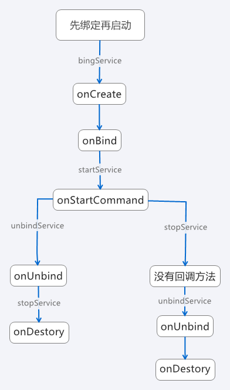
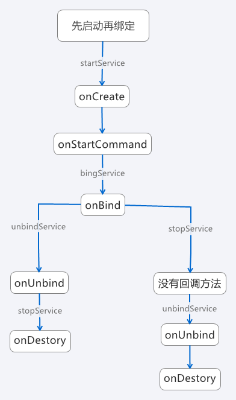

# Service 的基础知识

	本文内容：
	1. Service 的基本概念
	2. 两种启动方式
		2.1. 启动服务
		2.2. 绑定服务
			2.2.1. 关于绑定服务的注意点
	3. Service 的生命周期
		3.1. onCreate()
		3.2. onBind()
		3.3. onStartCommand()
			3.3.1. onStartCommand() 方法的返回值
		3.4. onUnbind()
		3.5. onDestroy()
	4. 启动服务和绑定服务
		4.1. 启动服务和绑定服务的生命周期
			4.1.1. 启动服务生命周期
			4.1.2. 绑定服务生命周期
			4.1.3. 启动并绑定服务生命周期
				4.1.3.1. 先绑定服务后启动服务
				4.1.3.2. 先启动服务后绑定服务
		4.2.启动服务与绑定服务的区别
	5. Service 的使用
	6. IntentService
	7. 前台服务
	8. 服务 Service 与线程 Thread
		8.1. 概念不同
		8.2. 执行任务不同
		8.3. 使用场景
	9. 参考文章

[TOC]


## 1. Service 的基本概念

　　Service 是可以在后台执行长时间运行操作并且不需要和用户交互的应用组件。服务是由其他应用组件启动，依赖于启动服务所在的应用程序进程，服务一旦被启动将在后台一直运行，即使启动服务的组件已销毁也不受影响。此外，服务也可以绑定到组件上，以与之进行交互。

　　服务也是运行在主线程，如果需要耗时操作，则需要在服务的内部手动创建子线程，在子线程中执行耗时操作。

　　服务可以在很多场合使用，比如播放多媒体的时候用户启动了其他 activity，此时要在后台继续播放；比如检测 sd 卡上文件的变化；比如在后台记录你的地理位置的改变；也可以执行进程间通信（IPC）等等。

##  2. 两种启动方式

　　服务有两种启动方式，一种是启动服务，一种就是绑定服务。

#### 2.1. 启动服务

　　当应用组件（如 Activity）通过调用 `startService()` 启动服务时，服务即处于 “ 启动 ” 状态。一旦启动，服务即可在后台无限期运行，即使启动服务的组件已被销毁也不受影响，除非手动调用才能停止服务，已启动的服务通常是执行单一操作，而且不会将结果返回给调用方。

#### 2.2. 绑定服务

　　当应用组件通过调用 `bindService()` 绑定到服务时，服务即处于“绑定”状态。绑定服务提供了一个客户端 - 服务端接口，允许组件与服务进行交互、发送请求、获取结果，甚至是利用进程间通信（IPC）执行这些操作。仅当与另一个应用组件绑定时，绑定服务才会运行。多个组件可以同时绑定到该服务，但全部取消绑定后，该服务即会被销毁。

　　应用程序组件（客户端）通过调用 `bindService()`方法能够绑定服务，然后 Android 系统会调用服务的 `onBind()` 回调方法，这个方法会返回一个跟服务器端交互的 Binder 对象。

　　这个绑定是异步的，`bindService()` 方法立即返回，并且不给客户端返回 IBinder 对象。要接收 IBinder 对象，客户端必须创建一个 `ServiceConnection` 类的实例，并且把这个实例传递给 `bindService()` 方法。`ServiceConnection` 对象包含了一个系统调用的传递 IBinder 对象的回调方法。

　　注意：只有 Activity、Service、ContentProvider 能够绑定服务；BroadcastReceiver 广播接收器不能绑定服务。

##### 2.2.1. 关于绑定服务的注意点

1. 多个客户端可同时连接到一个服务。不过，只有在第一个客户端绑定时，系统才会调用服务的 `onBind()` 方法来检索 IBinder。系统随后无需再次调用 `onBind()`，便可将同一 IBinder 传递至任何其他绑定的客户端。当最后一个客户端取消与服务的绑定时，系统会将服务销毁（除非 `startService()` 也启动了该服务）。

2. 通常情况下，我们应该在客户端生命周期（如 Activity 的生命周期）的引入和退出时刻设置绑定和解绑操作，以便控制绑定状态下的 Service，一般有以下两种情况：

   a. 如果只需要在 Activity 可见时与服务交互，则应在 `onStart()` 期间绑定，在 `onStop()` 期间解绑。

   b. 如果希望 Activity 在后台停止运行状态下仍可接收响应，则可在 `onCreate()` 期间绑定，在 `onDestory()` 期间取消绑定。需要注意的是，这意味着 Activity 在其整个运行过程中（甚至包括后台运行期间）都需要使用服务，因此如果服务位于其他进程内，那么当提高该进程的权重时，系统很可能会终止该进程。

3. 通常情况下，请勿在 Activity 的 `onResume()` 和 `onPause() `期间绑定和解绑，因为每一次生命周期转换都会发生这些回调，这样反复绑定和解绑是不合理的。此外，如果应用内的多个 Activity 绑定到同一服务，并且其中两个 Activity 之间发生了转换，则如果当前 Activity 在下一次绑定（恢复期间）之前取消绑定（暂停期间），系统可能会销毁服务并重建服务，因此服务的绑定不应该发生在 Activity 的 `onResume()` 和 `onPause()` 中。

4. 应该始终捕获 DeadObjectException 异常，该异常是在连接中断时引发的，表示调用的对象已死亡，也就是 Service 对象已销毁，这是远程方法引用的唯一异常，DeadObjectException 继承自 RemoteException，因此也可以捕获 RemoteException 异常。

5. 应用组件（客户端）可通过调用 `bindService()` 绑定到服务，Android 系统随后调用服务的 `onBind() `方法，该方法返回用于与服务交互的 IBinder，而该绑定是异步执行的。

## 3. Service 的生命周期


#### 3.1. onCreate()
　　首次创建服务时，系统将调用此方法来执行一次性设置程序（在调用 `onStartCommand()` 或 `onBind()` 之前），如果服务已在运行，则不会调用此方法，该方法只调用一次。

　　`onCreate()` 方法只会在 Service 第一次被创建的时候调用，而 `onStartCommand()` 方法在每次启动服务的时候都会调用。

#### 3.2. onBind()
　　当另一个组件想通过调用 `bindService()` 与服务绑定（例如执行 RPC）时，系统将调用此方法。在此方法实现中，必须返回一个 IBinder 接口的实现类，供客户端用来与服务进行通信。无论是启动状态还是绑定状态，此方法必须重写，但在启动状态就会直接返回 null 。

#### 3.3. onStartCommand()
　　当另一个组件（Activity）通过调用 `startService()` 请求启动服务时系统将调用此方法，一旦执行此方法，服务即会启动并可在后台无限期运行。如果自己实现此方法，则需要在服务工作完成后，通过调用 `stopSelf()` 或 `stopService()` 来停止服务（在绑定状态无需实现此方法）。

##### 3.3.1. onStartCommand()方法的返回值

　　`onStartCommand()` 方法执行后，返回的是一个 int 型。这个整型可以有三个返回值：START_NOT_STICKY、START_STICKY、START_REDELIVER_INTENT。
* **START_NOT_STICKY**：“非粘性的”。使用这个返回值时，如果在执行完 `onStartComment()` 方法后，服务被异常 kill 掉，系统不会自动重启该服务。

* **START_STICKY**：如果 Service 进程被 kill 掉，保留 Service 的状态为开始状态，但不保留递送的 intent 对象。随后系统会尝试重新创建 Service，由于服务状态为开始状态，所以创建服务后一定会调用 `onStartCommand(Intent,int,int)` 方法。如果在此期间没有任何启动命令被传递到 Service，那么参数 Intent 将为 null 。

* **START_REDELIVER_INTENT**：重传 Intent。使用这个返回值时，系统会自动重启该服务，并将 Intent 的值传入。

#### 3.4. onUnbind()
　　当另一个组件通过调用 `unbindServicer()` 与服务解绑时，系统将调用此方法。

#### 3.5. onDestroy()
　　当服务不再使用且被销毁时，系统将调用此方法，服务应该实现此方法来清理所有的资源，如线程、注册的监听器、接收器等，这是服务接收的最后一个调用。


## 4. 启动服务和绑定服务

#### 4.1. 启动服务和绑定服务的生命周期

##### 4.1.1. 启动服务生命周期

　　第一次调用 `startService()` 启动服务，会调用 `onCreate()` 和 `onStartCommand()` 方法，之后调用 `startService()` 启动服务，只会调用 `onStartCommand()` 方法。调用 `stopService()` 方法停止服务，会调用 `onDestory()` 方法。停止服务之后再次 `startService()` 启动服务，会再次调用 `onCreate()` 和 `onStartCommand()` 方法。

##### 4.1.2. 绑定服务生命周期

　　第一次调用 `bindService()` 启动服务，调用 `onCreate() `和 `onBind()` 方法，之后调用 `bindService()` 没有任何方法调用，调用 `unbindService()` 方法解绑服务，会调用 `onUnbind()` 和 `onDestory()` 方法。在 Activity 退出的时候不调用 `unbindService()` 解绑的话会报错。

##### 4.1.3. 启动并绑定服务生命周期

　　Android 系统仅会为一个 Service 创建一个实例对象，所以不管是启动服务还是绑定服务，操作的是同一个 Service 实例，而且由于绑定服务或者启动服务之间顺序问题将会出现两种情况：

###### 4.1.3.1. 先绑定服务后启动服务



　　先调用 `bindService()` 方法，调用 `onCreate()` 和 `onBind()` 方法，再调用 `startService()` 方法，调用 `onStartCommand()` 方法，调用 `unbindService()` 方法解绑，调用 `onUnbind()` 方法，再调用 `stopService()` 方法，调用 `onDestory()` 方法，如果是先调用 `stopService()` 没有方法回调，再调用 `unbindService()` 方法解绑会调用 `onUnbind()` 和 `onDestory()` 方法。

　　如果当前 Service 实例先以绑定状态运行，然后再以启动状态运行，如果之前绑定的宿主（Activity）被销毁了，也不会影响服务的运行，服务还是会一直运行下去，直到调用停止服务或者内存不足时才会销毁该服务。

###### 4.1.3.2. 先启动服务后绑定服务



　　先调用 `startService()` 方法，调用 `onCreate()` 和 `onStartCommand()` 方法，（之后再调用 `startService()` 方法，只会回调 `onStartCommand()` 方法）再调用 `bindService()` 方法，调用 `onBind()` 方法，调用 `unbindService()` 方法解绑，调用 `onUnbind()` 方法，再调用 `stopService()` 方法，调用 `onDestory()` 方法，如果是先调用 `stopService()` 没有方法回调，再调用 `unbindService()` 方法解绑会调用 `onUnbind()` 和 `onDestory()` 方法。

　　如果当前 Service 实例先以启动状态运行，然后再以绑定状态运行，即使宿主解绑后，服务依然在后台运行，直到有 Context 调用了 `stopService()` 或是服务本身调用了 `stopSelf()` 方法抑或内存不足时才会销毁服务。

　　以上两种情况显示出启动服务的优先级要比绑定服务高一些。不过无论 Service 是处于启动状态还是绑定状态，或者是启动并绑定状态，都可以像使用 Activity 那样通过调用 Intent 来使用服务。当然，也可以通过清单文件将服务声明为私有服务，阻止其他应用访问。

　　在调用 `startService()` 和 `bindService()` 方法之后，如果 Service 的 `onUnbind()` 返回的是 true，调用 `unbindService()` 解绑之后，再次调用 `bindService()` 绑定服务，会调用 Service 的 `onRebind()` 方法，而不是什么方法都不调用（会回调 ServiceConnection 的 `onServiceConnected()` 方法）。

#### 4.2. 启动服务与绑定服务的区别

**区别一：生命周期**
　　通过 started 方式的服务会一直运行在后台，需要由组件本身或外部组件来停止服务才会以结束结束。

　　bind 方式的服务，生命周期就会依赖绑定的组件。

**区别二：参数传递**
　　started 服务可以给启动的服务对象传递参数，但无法获取服务中方法的返回值。

　　bind 服务可以给启动的服务对象传递参数，也可以用过绑定的业务对象获取返回结果。

## 5. Service 的使用

　　无论是启动服务还是绑定服务，都需要在 AndroidManifest.xml 文件中配置 Service。

　　配置信息如下：

```xml
<service 
android:enabled="["true"" android:exported="["true"" android:icon="drawable resource" android:isolatedprocess="["true"" android:label="string resource" android:name="string" 
android:permission="string" android:process="string">
    . . .
</service>
```


　　配置的字段：

| 字段 | 含义 |
|--------|--------|
| android:exported | 代表是否能被其他应用隐式调用，其默认值是由 service 中有无 intent-filter 决定的，如果有 intent-filter，默认值 true，否则是 false。为 false 的情况下，即使有 intent-filter 匹配，也无法打开，即无法被其他应用隐式调用。|
| android:name | 对应 Service 类名 |
| android:permission | 权限声明 |
| android:process | 是否需要在单独线程中运行，当设置为 android:process=":remote" 时，代表 Service 在单独的进程中进行，注意“:”很重要，它的意思是指要在当前进程名称前面附加上当前的包名，所以“remote”和“:remote”不是一个意思，前者的进程名称为“remote”，而后者的进程名称为“App-packageName:remote”。 |
| android:isolatedProcess | 设置 true 意味着，服务会在一个特殊的进程下运行，这个进程与系统其他进程分开且没有自己的权限。与其通信的唯一途径是通过服务的 API(bind and start)。 |
| android:enabled | 是否可以被系统实例化，默认为 true，因为父标签也有 enable 属性，所以必须两个都为默认值 true 的情况下才会被激活，否则不会激活。 |

## 6. IntentService
　　服务不会自动开启线程，服务中的代码默认是运行在主线程中，如果直接在服务里执行一些耗时操作，容易造成 ANR(Application Not Responding)异常，为了可以简单的创建一个异步的、会自动停止的服务，Android 专门提供了一个 **IntentService** 类。可以启动 IntentService 多次，而每一个耗时操作会以工作队列的方式在 IntentService 的 onHandleIntent() 回调方法中执行，并且每次只会执行一个工作线程，执行完第一个，再执行第二个，以此类推。

## 7. 前台服务
　　前台服务被认为是用户主动意识到的一种服务，因此在内存不足时，系统也不会考虑将其终止。前台服务必须为状态栏提供通知，状态栏位于 “ 正在进行 ” 标题下方，这意味着除非服务停止或从前台删除，否则不能清除通知。例如将从服务播放音乐的音乐播放器设置在前台运行，这是因为用户明确意识到其操作。状态栏中的通知可能表示正在播放的歌曲，并允许用户启动 Activity 来与音乐播放器进行交互。

　　`startForeground()` 和` stopForeground()` 方法分别将服务设置为前台服务和从前台删除服务。`startForeground(int id, Notification notification)`的作用是把当前服务设置为前台服务，其中 `id` 参数代表唯一标识通知的整型数，需要注意的是提供给 `startForeground()` 的整型 ID 不得为 0 ，而 notification 是一个状态栏的通知。`stopForeground(boolean removeNotification)`用来从前台删除服务，此方法传入一个布尔值，指示是否也删除状态栏通知，true 为删除。注意该方法并不会停止服务，但是，如果在服务正在前台运行时将其停止，则通知也会被删除。

## 8. 服务 Service 与线程 Thread
#### 8.1. 概念不同
　　Thread 是程序执行的最小单元，它是分配 CPU 的基本单位， android 系统中 UI 线程也是线程，当然 Thread 还可以用于执行一些耗时异步操作。

　　Service 是 Android 的一种机制，服务是运行在主线程上的，它是由系统进程托管。它与其他组件之间的通信类似于 client 和 server，是一种轻量级的 IPC 通信，这种通信的载体是 binder ，它是在 linux 层交互信息的一种 IPC。

#### 8.2. 执行任务不同
　　在 Android 系统中，线程一般指的是工作线程（即后台线程），而主线程是一种特殊的工作线程，他负责将事件分配给相应的用户界面小工具，如绘图事件及事件响应，因此为了保证应用 UI 的响应能力，主线程上不可执行耗时操作。如果执行的操作不能很快完成，则应确保它们在单独的工作线程执行。

　　Service 则是 Android 系统中的组件，一般情况下他运行于主线程，因此在 Service 中不可执行耗时操作，否则系统会报 ANR 异常。如果需要让 Service 执行耗时任务，可在 Servce 中开启单独线程去执行。

#### 8.3. 使用场景

　　当要执行耗时的网络或者数据库查询以及其他阻塞 UI 线程或密集使用 CPU 的任务时，都应该使用工作线程（Thread），这样才能保证 UI 线程不被占用而影响用户体验。

　　在应用程序中，如果需要长时间的在后台运行，而且不需要交互的情况下，使用服务。比如播放音乐，通过 Service + Notification 方式在后台执行，同时在通知栏显示着。

## 9. 参考文章
1.[Android组件系列----Android Service组件深入解析](https://www.cnblogs.com/smyhvae/p/4070518.html)
2.[Android编程开发Android Service详解](https://www.2cto.com/kf/201802/721726.html)

