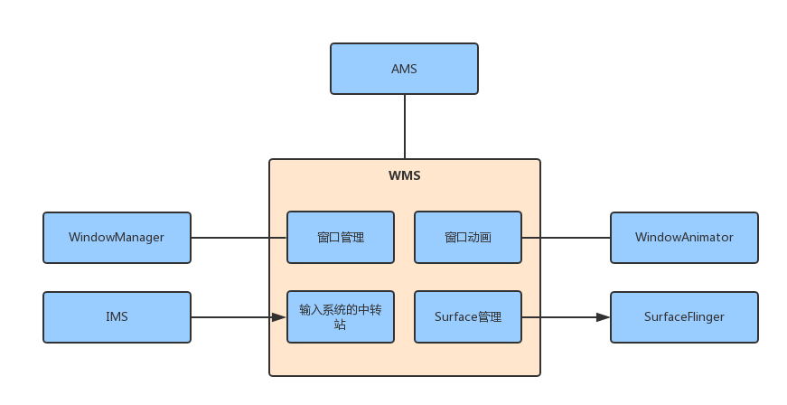
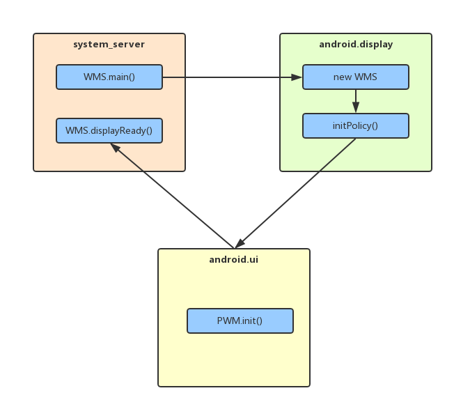
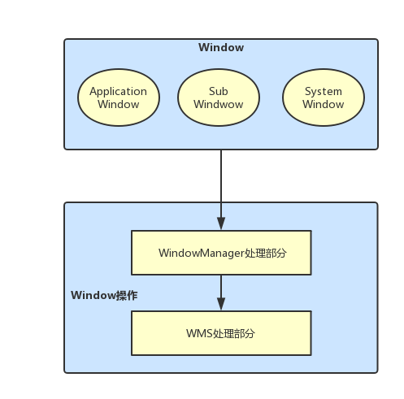

# WindowManangerService

## 1. WMS 概述

　　WMS 是系统的其他服务，无论对于应用开发还是 Framework 开发都是重点的知识，它的职责有很多，主要有以下几点：

### 1. 窗口管理

　　WMS 是窗口的管理者，它负责窗口的启动、添加和删除，另外窗口的大小和层级也是由 WMS 进行管理的。窗口管理的核心成员有 DisplayContent、WindowToken 和 WindowState。

### 2. 窗口动画

　　窗口间进行切换时，使用窗口动画可以显得更炫一些，窗口动画由 WMS 的动画子系统来负责，动画自系统的管理者为 WindowAnimator。

### 3. 输入系统的中转站

　　通过对窗口的触摸从而产生触摸事件，InputManangerService（IMS）会对触摸事件进行处理，它会寻找一个最合适的窗口来处理触摸反馈信息，WMS 是窗口的管理者，因此，WMS "理所应当" 的成为了输入系统的中转站。

### 4. Surface 管理

　　窗口并不具备有绘制的功能，因此每个窗口都需要有一块 Surface 来供自己绘制。为每个窗口分配 Surface 是由 WMS 来完成的。

　　WMS 的职责可以简单总结为下图：



## 2. WMS 的产生

　　WMS 是在 SystemServer 进程中启动的。

　　先来看 SystemServer 的 main 方法:

### 2.1. SysterServer#main

```java
    public static void main(String[] args) {
        new SystemServer().run();
    }
```

　　main 方法中只调用了 SystemServer 的 run 方法。

### 2.2. SystemServer#run

```java
    private void run() {
        try {
            ...

            // Prepare the main looper thread (this thread).
            android.os.Process.setThreadPriority(
                android.os.Process.THREAD_PRIORITY_FOREGROUND);
            android.os.Process.setCanSelfBackground(false);
            Looper.prepareMainLooper();

            // Initialize native services.
            // 加载了 libandroid_server.so
            System.loadLibrary("android_servers");

            ...

            // Create the system service manager.
            // 创建 SystemServerManager
            // 它会对系统的服务进行创建、启动和生命周期管理
            mSystemServiceManager = new SystemServiceManager(mSystemContext);
            mSystemServiceManager.setRuntimeRestarted(mRuntimeRestart);
            LocalServices.addService(SystemServiceManager.class, mSystemServiceManager);
            // Prepare the thread pool for init tasks that can be parallelized
            SystemServerInitThreadPool.get();
        } finally {
            traceEnd();  // InitBeforeStartServices
        }

        // Start services.
        // 启动各种服务
        try {
            traceBeginAndSlog("StartServices");
            // 用 SystemServiceManager 启动了 ActivityManangerService、PowerManagerService、PackageManagerService 等服务。
            startBootstrapServices();
            // 启动了 BatteryService、UsageStatsService 和 WebVideUpdateService。
            startCoreServices();
            // 启动了 CameService、AlarmManagerService、VrManagerService 等服务。
            startOtherServices();
            SystemServerInitThreadPool.shutdown();
        } catch (Throwable ex) {
            Slog.e("System", "******************************************");
            Slog.e("System", "************ Failure starting system services", ex);
            throw ex;
        } finally {
            traceEnd();
        }

        ...

        // Loop forever.
        Looper.loop();
        throw new RuntimeException("Main thread loop unexpectedly exited");
    }
```

　　使用 startBootstrapServices()、startCoreServices()、startOtherServices() 三个方法启动的服务的父类为 SystemService。

　　官方把大概 100 多个系统服务分为了三种类型，分别是引导服务、核心服务和其他服务，其中其他服务为一些非紧要和一些不需要立即启动的服务，WMS 就是其他服务的一种。

### 3. SystemServer#startOtherServices

```java
    /**
     * Starts a miscellaneous grab bag of stuff that has yet to be refactored
     * and organized.
     */
    private void startOtherServices() {
        ...

        try {
            
            ...

            traceBeginAndSlog("InitWatchdog");
            // 得到 Watchdog 实例
            final Watchdog watchdog = Watchdog.getInstance();
            // 初始化 watchdog
            // watchdog 用来监控系统的一些关键服务的运行状况
            watchdog.init(context, mActivityManagerService);
            traceEnd();

            traceBeginAndSlog("StartInputManagerService");
            // 创建 IMS，并赋值给 IMS 类型的 inputManager 对象
            inputManager = new InputManagerService(context);
            traceEnd();

            traceBeginAndSlog("StartWindowManagerService");
            // WMS needs sensor service ready
            ConcurrentUtils.waitForFutureNoInterrupt(mSensorServiceStart, START_SENSOR_SERVICE);
            mSensorServiceStart = null;
            // 执行了 WMS 的 main 方法。其内部会创建 WMS，需要注意的是 main 方法其中一个传入的参数就是上面创建的 IMS，WMS 是输入书简的中转站，其内部包含了 IMS 引用并不意外。
            wm = WindowManagerService.main(context, inputManager,
                    mFactoryTestMode != FactoryTest.FACTORY_TEST_LOW_LEVEL,
                    !mFirstBoot, mOnlyCore, new PhoneWindowManager());
            // 将 WMS 注册到 ServiceManager 中
            ServiceManager.addService(Context.WINDOW_SERVICE, wm);
            // 将 IMS 注册到 ServiceManager 中。
            ServiceManager.addService(Context.INPUT_SERVICE, inputManager);
            traceEnd();
            
            ...        
                
        }
        
        ...
            
        traceBeginAndSlog("MakeDisplayReady");
        try {
            // 初始化显示信息
            wm.displayReady();
        } catch (Throwable e) {
            reportWtf("making display ready", e);
        }
        traceEnd();
        
        ...
            
               traceBeginAndSlog("MakeWindowManagerServiceReady");
        try {
            // 通知 WMS，系统的初始化工作已经完成
            // 内部调用了 WindowManagerPolicy 的 systemReady 方法
            wm.systemReady();
        } catch (Throwable e) {
            reportWtf("making Window Manager Service ready", e);
        }
        traceEnd();
            
        ...
    }
```

　　startOtherServices 方法用于启动其他服务，其他服务大概有 70 多个，上面的代码只列出了 WMS 以及它相关的 IMS 的启动逻辑，剩余的其他服务的启动逻辑也都大同小异。

　　WMS 的 main 方法是运行在 SystemServer 的 run 方法中，换句话说就是运行在 “system_server” 线程中。

　　将 WMS 和 IMS 注册到 ServiceManager 中，如果某个客户端想要使用 WMS，就需要先去 ServiceManager 中查询信息，然后根据信息与 WMS 所在的进程建立通信通路，客户端就可以使用 WMS 了。

### 4. WindowManagerService#main

```java
    public static WindowManagerService main(final Context context, final InputManagerService im,
            final boolean haveInputMethods, final boolean showBootMsgs, final boolean onlyCore,
            WindowManagerPolicy policy) {
        // 调用了 DisplayThread 的 getHandler 方法，用来得到 DisplayThread 的 Handler 实例。
        DisplayThread.getHandler().runWithScissors(() ->
                                                   // 创建了 WMS 的实例。
                sInstance = new WindowManagerService(context, im, haveInputMethods, showBootMsgs,
                        onlyCore, policy), 0);
        return sInstance;
    }
```

　　DisplayThread 是一个单例的前台线程，这个线程用来处理需要低延时显示的相关操作，并只能由 WindowManager、DisplayManager 和 InputManager 实时执行快速操作。

　　runWithScissors 方法中使用了 Lambda 表达式，它等价于如下代码：

```java
    DisplayThread.getHandler().runWithScissors(new Runnable() {
            @Override
            public void run() {
             sInstance = new WindowManagerService(context, im, haveInputMethods, showBootMsgs,
                        onlyCore, policy);//2
            }
        }, 0);
```

　　创建 WMS 的过程是运行在 Runnable 的 run 方法中，而 Runnable 则传入到 DisplayThread 对应 Handler 的 runWithScissors 方法中，说明 WMS 的创建是运行在 “android:display” 线程中。需要注意的是，runWithScissors 方法的第二个参数传入的是 0.

### 5. Handler#runWithScissors

```java
    public final boolean runWithScissors(final Runnable r, long timeout) {
        if (r == null) {
            throw new IllegalArgumentException("runnable must not be null");
        }
        if (timeout < 0) {
            throw new IllegalArgumentException("timeout must be non-negative");
        }
		// 判断当前线程是否是主线程
        if (Looper.myLooper() == mLooper) {
            r.run();
            return true;
        }

        BlockingRunnable br = new BlockingRunnable(r);
        return br.postAndWait(this, timeout);
    }
```

　　对传入的 Runnable 和 timeout 进行了判断，如果 Runnable 为 null 或者 timeout 小于 0 则抛出异常。

　　根据每个线程只有一个 Looper 的原理来判断当前的线程（“System_server” 线程）是否是 Handler 所指向的线程（“android.display” 线程），如果是则直接执行 Runnable 的 run 方法，如果不是则调用 BlockingRunnable 的 postAndWait 方法，并将当前线程的 Runnable 作为参数传进去。

### 6. BlockingRunnable

　　BlockingRunnable 是 Handler 的内部类。

```java
    private static final class BlockingRunnable implements Runnable {
        private final Runnable mTask;
        private boolean mDone;

        public BlockingRunnable(Runnable task) {
            mTask = task;
        }

        @Override
        public void run() {
            try {
                // 执行了传入的 Runnable 的 run 方法（运行在 “android.display” 线程）
                mTask.run();
            } finally {
                synchronized (this) {
                    mDone = true;
                    notifyAll();
                }
            }
        }

        public boolean postAndWait(Handler handler, long timeout) {
            // 将当前的 BlockingRunnable 添加到 Handler 的任务队列中
            if (!handler.post(this)) {
                return false;
            }

            synchronized (this) {
                if (timeout > 0) {
                    final long expirationTime = SystemClock.uptimeMillis() + timeout;
                    while (!mDone) {
                        long delay = expirationTime - SystemClock.uptimeMillis();
                        if (delay <= 0) {
                            return false; // timeout
                        }
                        try {
                            wait(delay);
                        } catch (InterruptedException ex) {
                        }
                    }
                    // time = 0 
                } else {
                    while (!mDone) {
                        try {
                            // 当前线程（system_server 线程）进入等待状态
                            wait();
                        } catch (InterruptedException ex) {
                        }
                    }
                }
            }
            return true;
        }
    }
```

　　BlockingRunnable 的 postAndWait 方法会把当前的 BlockingRunnable 添加到 Handler 的任务队列中，之前调用 postAndWait 方法传递的 timeout 为 0，如果 mDone 为 false 的话会一直调用 wait() 方法使得当前线程（“system_server” 线程）进入等待状态，那么等待的是哪个线程呢？在 BlockingRunnable 的 run 方法中执行了传入的 Runnable 的 run 方法（运行在 “android.display” 线程），执行完毕后在 finally 代码块中将 mDone 设置为 true，并调用 notifyAll 方法唤醒处于等待状态的线程，这样就不会继续调用 postAndWait  中的 wait 方法。

　　因此得出结论，“system_server” 线程等待的就是 “android.display” 线程，一直到 “android.display” 线程执行完毕再执行 “system_server” 线程，这是因为 “android.display” 线程内部执行了 WMS 的创建，显然 WMS 的创建优先级更高些。

### 7. WindowManagerService 的构造方法

```java
    private WindowManagerService(Context context, InputManagerService inputManager,
            boolean haveInputMethods, boolean showBootMsgs, boolean onlyCore,
            WindowManagerPolicy policy) {
        
        ...
            
        // 保存传进来的 IMS，这样 WMS 就持有 IMS 的引用
        mInputManager = inputManager;
        
        ...
           
        mDisplayManager = (DisplayManager)context.getSystemService(Context.DISPLAY_SERVICE);
        // 通过 DisplayManager 的 getDisplays 方法得到 Display 数组（每个显示设备都有一个 Display 实例）
        mDisplays = mDisplayManager.getDisplays();
        // 遍历 Display 数组
        for (Display display : mDisplays) {
            // 将 Display 封装成 DisplayContent,DisplayContent 用来描述一块屏幕
            createDisplayContentLocked(display);
        }

        ...

            // 得到 AMS 实例，并赋值给 mActivityManager，这样 WMS 就持有了 AMS 的引用
        mActivityManager = ActivityManager.getService();
        
        ...
        // 创建 WindowAnimator，它用于管理所有的窗口动画

        mAnimator = new WindowAnimator(this);

        mAllowTheaterModeWakeFromLayout = context.getResources().getBoolean(
                com.android.internal.R.bool.config_allowTheaterModeWakeFromWindowLayout);


        LocalServices.addService(WindowManagerInternal.class, new LocalService());
        // 初始化了窗口管理策略的接口类 WindowManagerPolicy(WMP)，它用来定义一个窗口策略所有遵循的通用规范
        initPolicy();

        // Add ourself to the Watchdog monitors.
        // 将自身也就是 WMS 通过 addMonitor 方法添加到 Watdog 中。
        Watchdog.getInstance().addMonitor(this);

        ...
    }
```

　　Watchdog 用来监控系统的一些关键服务的运行状态（比如传入的 WMS 的运行状况），这些被监控的服务都会实现 Watchdog.Monitor 接口。Watchdog 每分钟都会对监控的系统服务进行检查，如果被监控的系统服务出现了死锁，则会杀死 Watchdog 所在的进程，也就是 SystemServer 进程。

### 8. WindowManagerService#initPolicy

```java
    private void initPolicy() {
        UiThread.getHandler().runWithScissors(new Runnable() {
            @Override
            public void run() {
                WindowManagerPolicyThread.set(Thread.currentThread(), Looper.myLooper());
                // 执行 WMP 的 init 方法

                mPolicy.init(mContext, WindowManagerService.this, WindowManagerService.this);
            }
        }, 0);
    }
```

　　initPolicy 方法和 WMS 的 main 方法类似。WMP 是一个接口，init 方法的具体实现在 PhoneWindowManager（PWM）中。PWM 的 init 方法运行在 “android.ui” 线程中，它的优先级要高于 initPolicy 方法所在的 "android.display" 线程，因此 “android.display” 线程要等 PWM 的 init 方法执行完毕后，处于等待状态的 “android.display” 线程才会被唤醒从而继续执行下面的代码。

## 3. 三个线程之间的关系

　　“system_server”、“android.display” 和 “android.io” 这三个线程之间的关系：



　　"system_server" 线程中会调用 WMS 的 main 方法，main 方法中会创建 WMS，创建 WMS 的过程运行在 “andriod.display” 线程中，它的优先级更高一些，因此要等创建 WMS 完毕后才会唤醒处于等待状态的 “system_server” 线程。

　　WMS 初始化时会执行 initPolicy 方法，initPolicy 方法会调用 PWM 的 init 方法，这个 init 方法运行在 "android.ui" 线程，并且优先级更高，因此要先执行 PWN 的 init 方法后，才能唤醒处于等待状态的 "android.display" 线程。

　　PWM 的 init 方法执行完毕后会接着执行运行在 "system_server" 线程的代码，比如前面提到的 WMS 的 systemReady 方法。

## 4. WMS 的重要成员

　　所谓 WMS 的重要成员是指 WMS 中的重要的成员变量：

```java
    final WindowManagerPolicy mPolicy;

    final IActivityManager mActivityManager;
    final ActivityManagerInternal mAmInternal;

    final AppOpsManager mAppOps;

    final DisplaySettings mDisplaySettings;

	...

    /**
     * All currently active sessions with clients.
     */
    final ArraySet<Session> mSessions = new ArraySet<>();

    /**
     * Mapping from an IWindow IBinder to the server's Window object.
     * This is also used as the lock for all of our state.
     * NOTE: Never call into methods that lock ActivityManagerService while holding this object.
     */
    final WindowHashMap mWindowMap = new WindowHashMap();

    /**
     * List of window tokens that have finished starting their application,
     * and now need to have the policy remove their windows.
     */
    final ArrayList<AppWindowToken> mFinishedStarting = new ArrayList<>();

    /**
     * List of window tokens that have finished drawing their own windows and
     * no longer need to show any saved surfaces. Windows that's still showing
     * saved surfaces will be cleaned up after next animation pass.
     */
    final ArrayList<AppWindowToken> mFinishedEarlyAnim = new ArrayList<>();

    /**
     * List of app window tokens that are waiting for replacing windows. If the
     * replacement doesn't come in time the stale windows needs to be disposed of.
     */
    final ArrayList<AppWindowToken> mWindowReplacementTimeouts = new ArrayList<>();

    /**
     * Windows that are being resized.  Used so we can tell the client about
     * the resize after closing the transaction in which we resized the
     * underlying surface.
     */
    final ArrayList<WindowState> mResizingWindows = new ArrayList<>();

    /**
     * Windows whose animations have ended and now must be removed.
     */
    final ArrayList<WindowState> mPendingRemove = new ArrayList<>();

    /**
     * Used when processing mPendingRemove to avoid working on the original array.
     */
    WindowState[] mPendingRemoveTmp = new WindowState[20];

    /**
     * Windows whose surface should be destroyed.
     */
    final ArrayList<WindowState> mDestroySurface = new ArrayList<>();

    /**
     * Windows with a preserved surface waiting to be destroyed. These windows
     * are going through a surface change. We keep the old surface around until
     * the first frame on the new surface finishes drawing.
     */
    final ArrayList<WindowState> mDestroyPreservedSurface = new ArrayList<>();

	...
    final H mH = new H();

	...
        
    final WindowAnimator mAnimator;

	...
    final InputManagerService mInputManager;
```

　　上面是 WMS 的部分成员变量，分别对它们进行简单的介绍。

### 1. mPolicy:WindowManagerPolicy

　　WindowManagerPolicy （WMP）类型的变量。WindowManagerPolicy 是窗口管理策略的接口类，用来定义一个窗口策略所要遵循的通用规范，并提供了 WindowManager 所有的特定的 UI 行为。它的具体实现类为 PhoneWindowManager，这个实现类在 WMS 创建时被创建。WMP 允许定制窗口层级和特殊窗口类型以及关键的调度和布局。

### 2.  mSessions:ArraySet

　　ArraySet 类型的变量，元素类型为 Session。Session 主要用于进程间通信，其他的应用程序想要和 WMS 进程进行通信就需要经过 Session，并且每个应用程序进程都会对应一个 Session，WMS 保存这些 Session 用来记录所有向 WMS 提供窗口管理服务的客户端。

### 3. mWindowMap:WindowHashMap

　　WindowHashMap 类型的变量，WindowHashMap 继承了 HashMap，它限制了 HashMap 的 key 值得类型为 IBinder，value 值的类型为 WindowState。WindowState 用于保存窗口的信息，在 WMS 中它用来描述一个窗口。综上得出结论，mWindowMap 就是用来保存 WMS 中各种窗口的集合。

### 4.mFinishedStarting:ArrayList

　　ArrayList 类型的变量，元素类型为 AppWindowToken，它是 WindowToken 的子类。

　　要理解 mFinishedStarting 的含义，需要先了解 WindowToken 是什么。WindowToken 主要有两个作用：

1. 可以理解为窗口令牌，当应用程序想要向 WMS 申请新创建一个窗口，则需要向 WMS 出示有效的 WindowToken。

   AppWindowToken 作为 WindowToken 的子类，主要用来描述应用程序的 WindowToken 结构。

   应用程序中每个 Activity 都对应一个 AppWindowToken。

2. WindowToken 会将相同组件（比如 Activity）的窗口（WindowState）复合在一起，方便管理。

　　mFinishedStarting 就是用于存储已经完成启动的应用程序窗口（比如 Activity）的 AppWindowToken 的列表。除了 mFinishedStarting，还有类似的 mFinishedEarlyAnim 和 mWindowReplacementTimeputs，其中 mFinishedEarlyAnim 存储了已经完成窗口绘制并且不需要展示任何已保存 surface 的应用程序窗口的 AppWindowToken。mWindowReplacementTimeout 存储了等待更换的应用程序窗口的 AppWindowToken，如果更换不及时，旧窗口就需要被处理。

### 5.mResizingWindows:ArrayList

　　ArrayList 类型的变量，元素类型为 WindowState。

　　mResizingWindows 是用来存储正在调整大小的窗口的列表。与 mResizingWindows 类似的还有 mPendingRemove、mDestroySurface 和 mDestoryPreservedSurface 等等。其中 mPendingRemove 是在内存耗尽时设置的，里面存有需要强制删除的窗口。mDestroySurface 里面存有需要被 Destory 的 Surface。mDestoryPreservedSurface 里面存有窗口需要保存的等待销毁的 Surface，为什么窗口要保存这些 Surface？这是因为窗口经历 Surface 变化时，窗口需要一直保持旧 Surface，直到新 Surface 的第一帧绘制完成。

### 6.mAnimator:WindowAnimator

　　WindowAnimator 类型的变量，用于管理窗口的动画以及特效动画。

### 7.mH:H

　　H 类型的变量，系统的 Handler 类，用于将任务加入到主线程的消息队列中，这样代码逻辑就会在主线程中执行。

### 8.mInputManager:InputManagerService

　　InputManagerService 类型的变量，输入系统的管理者。InputManagerService（IMS）会对触摸事件进行处理，它会寻找一个最合适的窗口来处理触摸反馈信息，WMS 是窗口的管理者，因此，WMS “理所应当” 的成为了输入系统的中转站，WMS 包含了 IMS 的引用不足为怪。

## 5. Window 的添加过程（WMS 部分）

　　Window 的操作分为两大部分，一部分是 WindowManager 处理部分，另一部分是 WMS 处理部分，如下：



　　无论是系统窗口还是 Activity，它们的 Window 的添加或称都会调用 WMS 的 addWindow 方法。

　　将  addWindow 方法分为 3 个部分解析：

### 1.WindowManagerService#addWindow1

```java
    public int addWindow(Session session, IWindow client, int seq,
            WindowManager.LayoutParams attrs, int viewVisibility, int displayId,
            Rect outContentInsets, Rect outStableInsets, Rect outOutsets,
            InputChannel outInputChannel) {
        int[] appOp = new int[1];
        // 根据 Window 的属性，调用 WMP 的 checkAddPermission 方法来检查权限。
        // 具体的是现在 PhoneWindowManager 的 checkAddPermission 方法中，如果没有权限则不会执行后续的代码逻辑。
        int res = mPolicy.checkAddPermission(attrs, appOp);
        if (res != WindowManagerGlobal.ADD_OKAY) {
            return res;
        }

        ...

        synchronized(mWindowMap) {
            if (!mDisplayReady) {
                throw new IllegalStateException("Display has not been initialialized");
            }

            // 通过 displayId 来获得窗口要添加到哪个 DisplayContent 上，如果没有找到 SisplayContent，则返回 WindowManagerGlobal.ADD_INVALID_DISPLAY 这一状态，其中 DisplayContent 用来描述一块屏幕。
            final DisplayContent displayContent = mRoot.getDisplayContentOrCreate(displayId);
            if (displayContent == null) {
                Slog.w(TAG_WM, "Attempted to add window to a display that does not exist: "
                        + displayId + ".  Aborting.");
                return WindowManagerGlobal.ADD_INVALID_DISPLAY;
            }
            ...

            // type 代表一个窗口的类型，它的数值介于 FIRST_SUB_WINDOW 和 LAST_SUB_WINDOW 之间（1000-1999）,这个数值定义在 WindowManager 中，说明这个窗口是一个子窗口。
            if (type >= FIRST_SUB_WINDOW && type <= LAST_SUB_WINDOW) {
                // attrs.token 是 IBinder 类型的对象
                // windowForClientLocked 方法内部会根据 attrs.token 作为 key 值从 mWindowMap 中得到该子窗口的父窗口。
                //接着对父窗口进行判断，如果父窗口为 null 或者 type 的取值返回不正确则会返回错误的状态
                parentWindow = windowForClientLocked(null, attrs.token, false);
                if (parentWindow == null) {
                    Slog.w(TAG_WM, "Attempted to add window with token that is not a window: "
                          + attrs.token + ".  Aborting.");
                    return WindowManagerGlobal.ADD_BAD_SUBWINDOW_TOKEN;
                }
                if (parentWindow.mAttrs.type >= FIRST_SUB_WINDOW
                        && parentWindow.mAttrs.type <= LAST_SUB_WINDOW) {
                    Slog.w(TAG_WM, "Attempted to add window with token that is a sub-window: "
                            + attrs.token + ".  Aborting.");
                    return WindowManagerGlobal.ADD_BAD_SUBWINDOW_TOKEN;
                }
            }
           ...

        }
        ...
    }
```

　　WMS 的 addWindow 返回的是 addWindow 的各种状态，比如添加 Window 成功、无效的 dispaly 等等，这些状态被定义在 WindowManagerGlobal 中。


### 2. WindowManagerService#addWindow2

```java
    public int addWindow(Session session, IWindow client, int seq,
            WindowManager.LayoutParams attrs, int viewVisibility, int displayId,
            Rect outContentInsets, Rect outStableInsets, Rect outOutsets,
            InputChannel outInputChannel) {
        ...

        synchronized(mWindowMap) {
            ...

            AppWindowToken atoken = null;
            final boolean hasParent = parentWindow != null;
            // Use existing parent window token for child windows since they go in the same token
            // as there parent window so we can apply the same policy on them.
            // 通过 displayContent 的 getWindowToken 方法来得到 WindowToken
            WindowToken token = displayContent.getWindowToken(
                    hasParent ? parentWindow.mAttrs.token : attrs.token);
            // If this is a child window, we want to apply the same type checking rules as the
            // parent window type.
            // 如果有父窗口就将父窗口的 type 值赋值给 rootType
            // 如果没有将当前窗口的 type 值赋值 rootType
            final int rootType = hasParent ? parentWindow.mAttrs.type : type;

            boolean addToastWindowRequiresToken = false;
            // 接下来如果 WindowToken 为 null，则根据 rootType 或者 type 的值进行区分判断
            if (token == null) {
                if (rootType >= FIRST_APPLICATION_WINDOW && rootType <= LAST_APPLICATION_WINDOW) {
                    Slog.w(TAG_WM, "Attempted to add application window with unknown token "
                          + attrs.token + ".  Aborting.");
                    return WindowManagerGlobal.ADD_BAD_APP_TOKEN;
                }
                // 如果 rootType 值等于 TYPE_INPUT_METHOD、TYPE_WALLPAPER 等值时，则返回状态值 WindowManagerGlobal.ADD_BAD_APP_TOKEN，说明 rootType 等于 TYPE_INPUT_METHOD、TYPE_WALLPAPE 等值时是不允许 WindowToken 为 null 的
                if (rootType == TYPE_INPUT_METHOD) {
                    Slog.w(TAG_WM, "Attempted to add input method window with unknown token "
                          + attrs.token + ".  Aborting.");
                    return WindowManagerGlobal.ADD_BAD_APP_TOKEN;
                }
                if (rootType == TYPE_VOICE_INTERACTION) {
                    Slog.w(TAG_WM, "Attempted to add voice interaction window with unknown token "
                          + attrs.token + ".  Aborting.");
                    return WindowManagerGlobal.ADD_BAD_APP_TOKEN;
                }
                if (rootType == TYPE_WALLPAPER) {
                    Slog.w(TAG_WM, "Attempted to add wallpaper window with unknown token "
                          + attrs.token + ".  Aborting.");
                    return WindowManagerGlobal.ADD_BAD_APP_TOKEN;
                }
                ...
                
               
                if (type == TYPE_TOAST) {
                    // Apps targeting SDK above N MR1 cannot arbitrary add toast windows.
                    if (doesAddToastWindowRequireToken(attrs.packageName, callingUid,
                            parentWindow)) {
                        Slog.w(TAG_WM, "Attempted to add a toast window with unknown token "
                                + attrs.token + ".  Aborting.");
                        return WindowManagerGlobal.ADD_BAD_APP_TOKEN;
                    }
                }
                final IBinder binder = attrs.token != null ? attrs.token : client.asBinder();
                // 通过多次的条件判断筛选，在这里隐式创建 WindowToen
                // 这就说明当添加窗口时是可以不向 WMS 体魄美国 WindowToken 的，前提是 rootType 和 type 的值不为前面条件判断筛选的值。
                // WindowToken 隐式和显示的创建肯定是要加以区分的，第 4 个参数为 false 就代表这个 WindowToken 是隐式创建的。
                token = new WindowToken(this, binder, type, false, displayContent,
                        session.mCanAddInternalSystemWindow);
            // 接下来的代码逻辑就是 WindowToken 不为 null 的情况，根据 rootType 和 type 的值进行判断
                // 比如判断如果窗口为应用程序窗口
            } else if (rootType >= FIRST_APPLICATION_WINDOW && rootType <= LAST_APPLICATION_WINDOW) {
                // 将 WindowToken 转换为专门针对应用程序窗口的 AppWindowToken，然后根据 AppWindowToken 的值进行后续的判断
                atoken = token.asAppWindowToken();
                if (atoken == null) {
                    Slog.w(TAG_WM, "Attempted to add window with non-application token "
                          + token + ".  Aborting.");
                    return WindowManagerGlobal.ADD_NOT_APP_TOKEN;
                } else if (atoken.removed) {
                    Slog.w(TAG_WM, "Attempted to add window with exiting application token "
                          + token + ".  Aborting.");
                    return WindowManagerGlobal.ADD_APP_EXITING;
                }
            } else if (rootType == TYPE_INPUT_METHOD) {
                if (token.windowType != TYPE_INPUT_METHOD) {
                    Slog.w(TAG_WM, "Attempted to add input method window with bad token "
                            + attrs.token + ".  Aborting.");
                      return WindowManagerGlobal.ADD_BAD_APP_TOKEN;
                }
            } 
            ...
    }
```


### 3. WindowManagerService#addWindow3

```java
    public int addWindow(Session session, IWindow client, int seq,
            WindowManager.LayoutParams attrs, int viewVisibility, int displayId,
            Rect outContentInsets, Rect outStableInsets, Rect outOutsets,
            InputChannel outInputChannel) {
       ...

        synchronized(mWindowMap) {
            ...

                // 创建了 WindowState，它存有窗口的所有的状态信息，在 WMS 中它代表一个窗口。
                // 从 WindowState 传入的参数，可以发现 WindowState 中包含了 WMS、Session、WindowToken、父类的 WindowState、LayoutParams 等信息。
            final WindowState win = new WindowState(this, session, client, token, parentWindow,
                    appOp[0], seq, attrs, viewVisibility, session.mUid,
                    session.mCanAddInternalSystemWindow);
           // 判断请求添加窗口的客户端是否已经死亡，如果是，则不会再执行下面的代码逻辑
            if (win.mDeathRecipient == null) {
                // Client has apparently died, so there is no reason to
                // continue.
                Slog.w(TAG_WM, "Adding window client " + client.asBinder()
                        + " that is dead, aborting.");
                return WindowManagerGlobal.ADD_APP_EXITING;
            }
           // 判断请求添加窗口的 DisplayContent 是否为 null，如果是，则不会再执行下面的代码逻辑

            if (win.getDisplayContent() == null) {
                Slog.w(TAG_WM, "Adding window to Display that has been removed.");
                return WindowManagerGlobal.ADD_INVALID_DISPLAY;
            }
           
           // 调用了 WMP 的 adjustWindowParamsLw 方法，该方法的实现在 PhoneWindowManager 中，会根据窗口的 type 对窗口的 LayoutParams 的一些成员变量进行修改 

            mPolicy.adjustWindowParamsLw(win.mAttrs);
            win.setShowToOwnerOnlyLocked(mPolicy.checkShowToOwnerOnly(attrs));
           // 调用 WMP 的 prepareWindowLw 方法，用于准备将窗口添加到系统中

            res = mPolicy.prepareAddWindowLw(win, attrs);
           	...
            win.attach();
           // 将 WindowState 添加到 mWindowMap 中
            mWindowMap.put(client.asBinder(), win);
            if (win.mAppOp != AppOpsManager.OP_NONE) {
                int startOpResult = mAppOps.startOpNoThrow(win.mAppOp, win.getOwningUid(),
                        win.getOwningPackage());
                if ((startOpResult != AppOpsManager.MODE_ALLOWED) &&
                        (startOpResult != AppOpsManager.MODE_DEFAULT)) {
                    win.setAppOpVisibilityLw(false);
                }
            }

            final AppWindowToken aToken = token.asAppWindowToken();
            if (type == TYPE_APPLICATION_STARTING && aToken != null) {
                aToken.startingWindow = win;
                if (DEBUG_STARTING_WINDOW) Slog.v (TAG_WM, "addWindow: " + aToken
                        + " startingWindow=" + win);
            }

            boolean imMayMove = true;
           // 将 WindowState 添加到该 WidowState 对应的 WindowToken 中（实际是保存在 WindowToken 的父类 WindowContainer 中），这样  WindowToken 就包含了相同组件的 WindowState。

            win.mToken.addWindow(win);
            if (type == TYPE_INPUT_METHOD) {
                win.mGivenInsetsPending = true;
                setInputMethodWindowLocked(win);
                imMayMove = false;
            } else if (type == TYPE_INPUT_METHOD_DIALOG) {
                displayContent.computeImeTarget(true /* updateImeTarget */);
                imMayMove = false;
            } else {
                if (type == TYPE_WALLPAPER) {
                    displayContent.mWallpaperController.clearLastWallpaperTimeoutTime();
                    displayContent.pendingLayoutChanges |= FINISH_LAYOUT_REDO_WALLPAPER;
                } else if ((attrs.flags&FLAG_SHOW_WALLPAPER) != 0) {
                    displayContent.pendingLayoutChanges |= FINISH_LAYOUT_REDO_WALLPAPER;
                } else if (displayContent.mWallpaperController.isBelowWallpaperTarget(win)) {
                    // If there is currently a wallpaper being shown, and
                    // the base layer of the new window is below the current
                    // layer of the target window, then adjust the wallpaper.
                    // This is to avoid a new window being placed between the
                    // wallpaper and its target.
                    displayContent.pendingLayoutChanges |= FINISH_LAYOUT_REDO_WALLPAPER;
                }
            }

            ...
       	}

        return res;
    }
```


### 4. addWindow 方法总结

　　addWindow 方法分了 3 个部分来进行解析，主要就是做了下面 4 件事情：

1. 对所要添加的窗口进行检查，如果窗口不满足一些条件，就不会再执行下面的代码逻辑。
2. WindowToken 相关的处理，比如有的窗口类型需要提供 WindowToken，没有提供的话就不会执行下面的代码逻辑，有的窗口类型则需要由 WMS 隐式创建 WindowToken。
3. WindowState 的创建和相关处理，将 WindowToken 和 WindowState 先关联。
4. 创建和配置 DispalyContent，完成窗口添加到系统前的准备工作。

## 6. Window 的删除过程

　　Window 的创建和更新过程类似，要删除 Window 需要先调用 WindowManagerImpl 的 remove 方法，removeView 方法中又会调用 WindowManagerGlobal 的 removeView 方法。

　　将要删除的 Window（View）简称为 V。

### 1. WindowManagerGlobal#removeView

```java
    public void removeView(View view, boolean immediate) {
        if (view == null) {
            throw new IllegalArgumentException("view must not be null");
        }

        synchronized (mLock) {
            // 找到要 V 在 View 列表中的索引
            int index = findViewLocked(view, true);
            View curView = mRoots.get(index).getView();
            // 调用了 removeViewLocked 发给发并将索引传进去
            removeViewLocked(index, immediate);
            if (curView == view) {
                return;
            }

            throw new IllegalStateException("Calling with view " + view
                    + " but the ViewAncestor is attached to " + curView);
        }
    }
```

### 2. WindowManagerGlobal#removeViewLocked

```java
    private void removeViewLocked(int index, boolean immediate) {
        // 根据传入的索引在 ViewRootImpl 列表中获得 V 的 ViewRootImpl
        ViewRootImpl root = mRoots.get(index);
        View view = root.getView();

        if (view != null) {
            // 得到 InputMethodManager 实例
            InputMethodManager imm = InputMethodManager.getInstance();
            if (imm != null) {
                // 如果 InputMethodManager 实例不为 null，则调用 InputMethodManager 的 windowDismissed 方法来结束 V 的输入法相关的逻辑
                imm.windowDismissed(mViews.get(index).getWindowToken());
            }
        }
        // 调用 ViewRootIlmpl 的 die 方法
        boolean deferred = root.die(immediate);
        if (view != null) {
            view.assignParent(null);
            if (deferred) {
                mDyingViews.add(view);
            }
        }
    }
```


### 3. ViewRootImpl#die

```java
    /**
     * @param immediate True, do now if not in traversal. False, put on queue and do later.
     * @return True, request has been queued. False, request has been completed.
     */
    boolean die(boolean immediate) {
        // Make sure we do execute immediately if we are in the middle of a traversal or the damage
        // done by dispatchDetachedFromWindow will cause havoc on return.
        // 如果 immediate 为 true（需要理解执行），并且 mIsTraversal 值为 true 时，执行 doDie 方法
        // mIsInTraversal 在执行 ViewRootImpl 的 performTraversals 方法时会被置为 true，在 performTraversals 方法执行完时被设置为 false
        // 因此这里可以理解为 die 方法需要立即执行并且此时 ViewRootImpl 不在执行 performTraversals 方法
        if (immediate && !mIsInTraversal) {
            // 2
            doDie();
            return false;
        }

        if (!mIsDrawing) {
            destroyHardwareRenderer();
        } else {
            Log.e(mTag, "Attempting to destroy the window while drawing!\n" +
                    "  window=" + this + ", title=" + mWindowAttributes.getTitle());
        }
        mHandler.sendEmptyMessage(MSG_DIE);
        return true;
    }
```

### 4. ViewRootImpl#doDie

```java
    void doDie() {
        // 检查执行 doDie 方法的线程的正确性
        // checkThread 的内部会判断执行 doDie 方法线程是否是创建 V 的原始线程，如果不是就会抛出异常，这是因为只有创建 V 的原始线程才能够操作 V。
        checkThread();
        if (LOCAL_LOGV) Log.v(mTag, "DIE in " + this + " of " + mSurface);
        synchronized (this) {
            // 防止 doDie 方法被重复调用
            if (mRemoved) {
                return;
            }
            // 防止 doDie 方法被重复调用
            mRemoved = true;
            // V 有子 View 就会调用 dispatchDetachedFromWindow 方法来销毁 View
            if (mAdded) {
        
                dispatchDetachedFromWindow();
            }
            //  如果 V 有子 View 并且不是第一次被添加

            if (mAdded && !mFirst) {
                destroyHardwareRenderer();

                if (mView != null) {
                    int viewVisibility = mView.getVisibility();
                    boolean viewVisibilityChanged = mViewVisibility != viewVisibility;
                    if (mWindowAttributesChanged || viewVisibilityChanged) {
                        // If layout params have been changed, first give them
                        // to the window manager to make sure it has the correct
                        // animation info.
                        try {
                            if ((relayoutWindow(mWindowAttributes, viewVisibility, false)
                                    & WindowManagerGlobal.RELAYOUT_RES_FIRST_TIME) != 0) {
                                mWindowSession.finishDrawing(mWindow);
                            }
                        } catch (RemoteException e) {
                        }
                    }

                    mSurface.release();
                }
            }

            mAdded = false;
        }
        // 调用 WindowManagerGlobal 的 doRemoveView 方法
        WindowManagerGlobal.getInstance().doRemoveView(this);
    }
```

#### 4.1. WindowManagerGlobal#doRemoveView

```java
    void doRemoveView(ViewRootImpl root) {
        synchronized (mLock) {
            // 找到 V 对应的 ViewRootImpl 在 ViewRootImpl 列表中的索引，接着根据这个索引从 ViewRootImpl 列表、布局参数列表和 View 列表中删除与 V 对应的元素。
            final int index = mRoots.indexOf(root);
            if (index >= 0) {
                mRoots.remove(index);
                mParams.remove(index);
                final View view = mViews.remove(index);
                mDyingViews.remove(view);
            }
        }
        if (ThreadedRenderer.sTrimForeground && ThreadedRenderer.isAvailable()) {
            doTrimForeground();
        }
    }
```

　　WindowManagerGlobal 中维护了和 WIndow 操作相关的三个列表，doRemoveView 方法会从这三个列表中清除 V 对应的元素。

#### 4.2. ViewRootImpl#dispatchDetachedFromWindow

```java
    void dispatchDetachedFromWindow() {
        ...
        try {
            mWindowSession.remove(mWindow);
        } catch (RemoteException e) {
        }

        ...
    }
```

　　dispatchDetachedFromWindow 方法中主要调用了 IWindowSession 的 remove 方法，IWindowSession 在 Server 端的实现为 Session。

#### 4.3. Session#remove

```java
   public void remove(IWindow window) {
        mService.removeWindow(this, window);
    }
```


#### 4.4. WindowManagerService#removeWindow

```java
    void removeWindow(Session session, IWindow client) {
        synchronized(mWindowMap) {
            // 用于获取 Window 对应的 WindowState
            // WindowState 用于保存窗口的信息，在 WMS 中它用来描述一个接口。
            WindowState win = windowForClientLocked(session, client, false);
            if (win == null) {
                return;
            }
            // 调用 WindowState 的 removeIfPossible 方法
            win.removeIfPossible();
        }
    }
```


#### 4.5. WindowState#removeIfPossible


## 参考文章

4. [Android 解析 WindowManagerService（一）WMS 的诞生](https://blog.csdn.net/itachi85/article/details/78186741)
5. [Android解析WindowManagerService（二）WMS的重要成员和Window的添加过程](https://blog.csdn.net/itachi85/article/details/78357437)
6. [Android解析WindowManagerService（三）Window的删除过程](https://blog.csdn.net/itachi85/article/details/79134490)