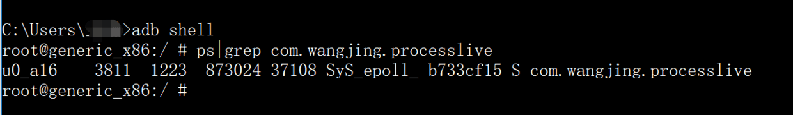
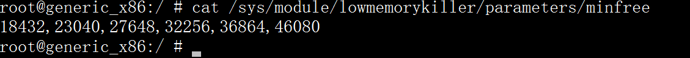
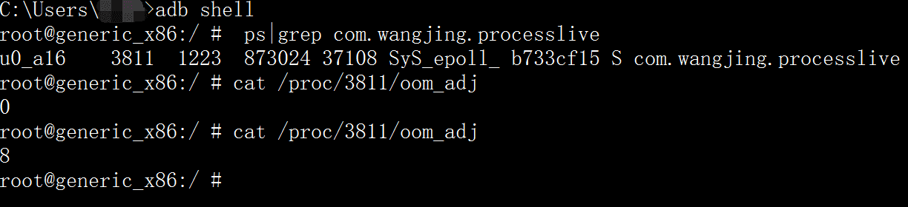
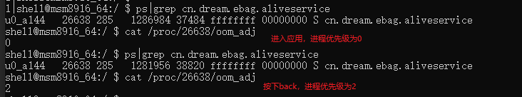

# 进程保活

## 1. 进程的知识

　　每一个 Android 应用启动后至少对应一个进程，有的是多个进程，而且主流应用中多个进程的应用比例较大。

### 1.1. 如何查看进程的基本信息

　　对于任何一个进程，都可以通过 `adb shell` 和 `ps|grep <package_name>` 的方式来查看它的基本信息。



　　返回信息解释：

| 值                       | 解释                             |
| ------------------------ | -------------------------------- |
| u0_a16                   | USER 进程当前用户                |
| 3881                     | 进程 ID                          |
| 1223                     | 进程的父进程 ID                  |
| 873024                   | 进程的虚拟内存大小               |
| 37108                    | 实际驻留 “ 在内存中 ” 的内存大小 |
| com.wangjing.processlive | 进程名                           |

### 1.2. 进程划分

　　Android 系统将进程划分为如下几种（重要性从高到低）。

#### 1.2.1. 前台进程（Foreground process）

　　用户正在使用的程序，一般系统是不会杀死前台进程的，除非用户强制停止应用或系统内存不足等极端情况会杀死。

##### 1.2.1.1. 常见场景

1. 某个进程持有一个正在与用户交互的 Activity 并且该 Activity 正处于 resume 的状态。
2. 某个进程持有一个 Service，并且该 Service 与用户正在交互的 Activity 绑定。
3. 某个进程持有一个 Service，并且该 Service 调用 startForground() 方法使之位于前台运行。
4. 某个进程持有一个 Service，并且该 Service 正在执行它的某个生命周期回调方法，比如 onCreate()、onStary() 或 onDestory()。
5. 某个进程持有一个 BroadcastReceiver，并且该 BroadcastReceiver 正在执行其 onReceiver() 方法。

#### 1.2.2. 可见进程

　　用户正在使用，看得到但是摸不着，显示界面没有覆盖到整个屏幕，只有屏幕的一部分。可见进程不包含任何前台组件，一般系统也是不会杀死可见进程的，除非要在资源吃紧的情况下，要保持某个或多个前台进程存活。

##### 1.2.2.1. 常见场景

1. 拥有不在前台、但仍对用户可见的 Activity（已调用 onPause()）。
2. 拥有绑定到可见（或前台）Activity 的 Service。

#### 1.2.3. 服务进程

　　在内存不足以维持所有前台进程和可见进程同时运行的情况下，服务进程会被杀死。

##### 1.2.3.1. 常见场景

1. 某个进程中运行着一个 Service 且该 Service 是通过 startService() 启动的，与用户看见的界面没有直接关联。

#### 1.2.4. 后台进程

　　系统可能随时终止它们，回收内存。

##### 1.2.4.1. 常见场景

1. 在用户按了 “ back ” 或者 “ home ” 后，程序本身看不到了，但是其实还在运行的程序，比如 Activity 调用了 onPause 方法。

#### 1.2.5. 空进程

　　会被直接杀死的进程。

##### 1.2.5.1. 常见场景

1. 某个进程不包含任何活跃的组件时该进程就会被置为空进程，完全没用，杀了它只有好处没坏处，内存不足时会第一个杀死它。

### 1.3. 内存阈值

　　系统出于体验和性能上的考虑，app 在退到后台时系统并不会真正的 kill 掉这个进程，而是将其缓存起来。打开的应用越多，后台缓存的进程也越多。在系统内存不足的情况下，系统开始依据自身的一套进程回收机制来判断要 kill 掉哪些进程，以腾出内存来供给需要的 app，这套杀进程的机制就叫 Low Memory Killer，它是基于 Linux 内核的 OOM Killer(Out-Of-Memory killer) 机制诞生。

　　那这个不足怎么来规定呢？那就是**内存阈值**。

　　可以使用 `cat /sys/module/lowmemorykiller/parameters/minfree` 来查看某个手机的内存阈值。



　　注意这些数字的单位是 page，1 page = 4 kb。上面的六个数字对应的就是（MB）：72、90、108、126、144、180，这些数字也就是对应的内存阈值，内存阈值在不同的手机上不一样，一旦低于该值，Android 便开始按顺序关闭进程，因此 Android 开始结束优先级最低的空进程，即当可用内存小于 108 MB（46080*4/1024）。

　　如果内存不足了，先会将空进程全部杀光，如果内存还不足，就要杀后台进程。

　　进程是有它的优先级的，这个优先级通过进程的 oom_adj 值来反映，它是 linux 内核分配给每个系统进程的一个值，代表进程的优先级，进程回收机制就是根据这个优先级来决定是否进行回收，oom_adj 值定义在 com.android.server.am.ProcessList 类中，这个类路径是 ${android-sdk-path}\sources\android23\com\android\server\am\ProcessList.java 。可以通过` cat /proc/进程id/oom_adj` 可以看到当前进程的 oom_adj 值。

1. oom_adj 的值越小，表示进程的优先级越高，越不容易被杀死回收，oom_adj 的值越大，表示进程的优先级有低，越容易被杀死回收。
2. 普通进程 oom_adj 值是大于等于 0 的，而系统进程 oom_adj 的值是小于 0 的。


　　看到 adj 值是 0，0 就表示这个进程是属于前台进程，按下 Back 键，将应用置于后台，再次查看：



　　adj 值变成了 8，8 代表这个进程是属于不活跃的进程。

　　oom_adj 值是多少，每个手机的厂商可能不一样，oom_adj 值主要有下面几个：

| adj 级别               | 值   | 解释                                                     |
| ---------------------- | ---- | -------------------------------------------------------- |
| UNKNOWN_ADJ            | 16   | 预留的最低级别，一般对于缓存的进程才有可能设置成这个级别 |
| CACHED_APP_MAX_ADJ     | 15   | 缓存进程、空进程，在内存不足的情况下就会优先被 kill      |
| CACHED_APP_MIN_ADJ     | 9    | 缓存进程，也就是空进程                                   |
| SERVICE_B_ADJ          | 8    | 不活跃的进程                                             |
| PREVIOUS_APP_ADJ       | 7    | 切换进程                                                 |
| HOME_APP_ADJ           | 6    | 与 Home 交互的进程                                       |
| SERVICE_ADJ            | 5    | 有 Service 的进程                                        |
| HEAVY_WEIGHT_APP_ADJ   | 4    | 高权重进程                                               |
| BACKUP_APP_ADJ         | 3    | 正在备份的进程                                           |
| PERCEPTIBLE_APP_ADJ    | 2    | 可感知的进程，比如那种播放音乐                           |
| VISIBLE_APP_ADJ        | 1    | 可见进程                                                 |
| FOREGROUND_APP_ADJ     | 0    | 前台进程                                                 |
| PERSISTENT_SERVICE_ADJ | -11  | 重要进程                                                 |
| PERSISTENT_PROC_ADJ    | -12  | 核心进程                                                 |
| SYSTEM_ADJ             | -16  | 系统进程                                                 |
| NATIVE_ADJ             | -17  | 系统起的 Native 进程                                     |

　　根据上面的 adj 值，系统会先进行回收的就是：oom_adj 越大，占用物理内存越多会被最先 kill 掉。所以对于进程如何保活也就是如何降低 oom_adj 的值，以及如何使得应用占的内存最少。

　　app 退到后台时，其所有的进程优先级都会降低。但是 UI 进程是降低最为明显的，因为它占用的内存资源最多，系统内存不足的时候肯定优先先杀这些占用内存高的进程来腾出资源。所以，为了尽量避免后台 UI 进程被杀，需要尽可能地释放一些不用地资源，尤其是图片、音视频之类的。

## 2. 进程保活方案

### 2.1 进程保活手段的分类

　　当前业界的 Andriod 进程保活手段主要分为 **黑**、**白**、**灰**三种，其大致的实现思路如下：

* 黑色保活：不同的 app 进程，用广播相互唤醒（包括利用系统提供的广播进行唤醒）。
* 白色保活：启动前台 Service。
* 灰色保活：利用系统的漏洞启动前台 Service。

#### 2.1.1. 黑色保活

　　所谓黑色保活，就是利用不同的 app 进程使用广播来进行相互唤醒。

　　举 3 个比较常见的场景：

1. 开机、网络切换、拍照、拍视频的时候，利用系统产生的广播唤醒 app。
2. 接入第三方 SDK 也会唤醒相应的 app 进程，如微信 sdk 会唤醒微信，支付宝 sdk 会唤醒支付宝。
3. 假如手机里装了支付宝、淘宝、天猫、UC 等阿里系的 app，那么打开任意一个阿里系的 app 后，有可能就顺便把其他阿里系的 app 给唤醒了。

　　对于场景 1，在最新的 Android N 取消了 ACTION_NEW_PICTURE（拍照）、ACTION_NEW_VIDEO（拍视频）、CONNECTIVITY_ACTION（网络切换）等三种广播。而开机广播，有一些定制 ROM 的厂商会将其去掉。

#### 2.1.2. 白色保活

　　白色保活手段非常简单，就是调用系统 api 启动一个前台的 Service 进程，这样会在系统的通知栏生成一个 Notification，用来让用户知道有这样一个 app 在运行着，哪怕当前的 app 推到了后台。

　　比如 LBE 和 QQ 音乐就是这样。

#### 2.1.3. 灰色保活

　　灰色保活，这种保活手段是应用范围最广泛。

　　它是利用系统的漏洞来启动一个前台的 Service 进程，与普通的启动方式区别在于，它不会在系统通知栏处出现一个 Notification，看起来就如同运行着一个后台 Service 进程一样。这样做带来的好处就是，用户无法察觉到应用运行着一个前台进程（因为看不到 Notification），但是应用的进程优先级又是高于普通后台进程的。

　　大致的实现思路如下：

1. 思路一： API level < 18，启动前台 Service 时直接传入 new Notification。

2.  思路二：API level >= 18，同时启动两个 id 相同的前台 Service，然后再将后启动的 Service 做 stop 处理。。

　　使用灰色保活并不代表 Service 就永久不死了，只能说是提高了进程的优先级。如果 app 进程占用了大量的内存，按照回收进程的策略，同样会干掉 app。

### 2.2. 具体的进程保活方案

#### 2.2.1. 开启一个像素的 Activity

　　基本思想：系统一般是不会杀死前台进程的，所以要使得进程常驻，只需要在锁屏的时候在本进程开启一个 Activity，为了欺骗用户，让这个 Activity 的大小是 1 像素，并且透明无切换动画，在开屏幕的时候，把这个 Activity 关闭掉，所以这个就需要监听系统锁屏广播。

##### 2.2.1.1. 代码实现

　　一个像素的 Activity：

```java
public class LiveActivity extends Activity {
    public static final String TAG = LiveActivity.class.getSimpleName();
		// 开启一个像素的 Activity
    public static void actionToLiveActivity(Context context) {
        Intent intent = new Intent(context, LiveActivity.class);
        intent.setFlags(Intent.FLAG_ACTIVITY_NEW_TASK);
        context.startActivity(intent);
    }

    @Override
    protected void onCreate(@Nullable Bundle savedInstanceState) {
        super.onCreate(savedInstanceState);
        Log.d(TAG, "onCreate");
        setContentView(R.layout.activity_main);

        Window window = getWindow();
        // 放在左上角
        window.setGravity(Gravity.START | Gravity.TOP);
        WindowManager.LayoutParams lp = window.getAttributes();
        // 宽高设计为 1 个像素
        lp.width = 1;
        lp.height = 1;
        // 起始坐标
        lp.x = 0;
        lp.y = 0;
        window.setAttributes(lp);

        ScreenManager.getInstance(this).setActivity(this);
    }

    @Override
    protected void onDestroy() {
        super.onDestroy();
        Log.d(TAG, "onDestroy");
    }
}
```

　　一个像素 Activity 的主题:

```xml
    <style name="LiveStyle">
        <item name="android:windowIsTranslucent">true</item>
        <item name="android:windowBackground">@android:color/transparent</item>
        <item name="android:windowAnimationStyle">@null</item>
        <item name="android:windowNoTitle">true</item>
    </style>
```

　　管理一个像素 Activity 的 Mananger：

```java
public class ScreenManager {

    private Context mContext;

    private WeakReference<Activity> mActivityWref;

    public static ScreenManager gDefualt;

    public static ScreenManager getInstance(Context context){
        if (gDefualt == null){
            gDefualt = new ScreenManager(context.getApplicationContext());
        }
        return gDefualt;
    }

    private ScreenManager(Context context){
        this.mContext = context;
    }

    public void setActivity(Activity activity){
        mActivityWref = new WeakReference<>(activity);
    }
		
  	// 开启一个像素的 LiveActivity
    public void startActivity(){
        LiveActivity.actionToLiveActivity(mContext);
    }

    public void finishActivity(){
        // 结束掉 LiveActivity
        if(mActivityWref != null){
            Activity activity = mActivityWref.get();
            if (activity != null){
                activity.finish();
            }
        }
    }
}
```

　　屏保与亮屏的广播监听：

```java
public class ScreenBroadcastListener {

    private static final String TAG = ScreenBroadcastListener.class.getSimpleName();

    private Context mContext;
    private ScrrenBroadcastReceiver mScreenReceiver;

    private ScreenStateListener mListener;

    public ScreenBroadcastListener(Context context) {
        mContext = context.getApplicationContext();
        mScreenReceiver = new ScreenBroadcastReceiver();
    }

  	// 屏幕状态的监听
    interface ScreenStateListener {
        void onScreenOn();

        void onScreenOff();
    }
		//屏幕广播的接受者
    private class ScreenBroadcastReceiver extends BroadcastReceiver {
        private String action = null;

        @Override
        public void onReceive(Context context, Intent intent) {
            action = intent.getAction();
            Log.d(TAG, "onReceive action:" + action);
            if (Intent.ACTION_SCREEN_ON.equals(action)) { // 开屏
                if (mListener != null) {
                    mListener.onScreenOn();
                }
            } else if (Intent.ACTION_SCREEN_OFF.equals(action)) { // 锁屏
                if (mListener != null) {
                    mListener.onScreenOff();
                }
            }
        }
    }
		//注册屏幕广播
    public void registerListener(ScreenStateListener listener) {
        mListener = listener;
        registerListener();
    }
		//注解屏幕广播
    private void registerListener() {
        IntentFilter filter = new IntentFilter();
        filter.addAction(Intent.ACTION_SCREEN_ON);
        filter.addAction(Intent.ACTION_SCREEN_OFF);
        mContext.registerReceiver(mScreenReceiver, filter);
    }
}
```

　　主 Mactivity：在 onCreate 注册监听屏保和亮屏的广播：

```java
public class MainActivity extends AppCompatActivity {

    private LiveService service;

    @Override
    protected void onCreate(Bundle savedInstanceState) {
        super.onCreate(savedInstanceState);
        setContentView(R.layout.activity_main);
        final ScreenManager screenManager = ScreenManager.getInstance(this);
        ScreenBroadcastListener listener = new ScreenBroadcastListener(this);
        // 注册监听屏保和亮屏的广播
        listener.registerListener(new ScreenBroadcastListener.ScreenStateListener() {
            @Override
            public void onScreenOn() {
                // 亮屏时，关闭 LiveActivity
                screenManager.finishActivity();
            }

            @Override
            public void onScreenOff() {
                // 屏保时，开启 LiveActivity
                screenManager.startActivity();
            }
        });
    }

    @Override
    protected void onDestroy() {
        super.onDestroy();
    }
}
```

##### 2.2.1.2. 查看优先级


　　开启一个像素的 Activity 后，按 back 键并屏保后，进程的优先级与前台进程的优先级一样。

##### 2.2.1.3. 优化

　　内存越多会被最先 kill 掉，为了减少主程序的内存，可以将打开和关闭一个像素的 Activity 放到一个服务 Service 中去，而 Service 可以在另外一个进程中运行，在 MainActivity 中开启和关闭这个 Service 就可以了，这样主应用的进程就会更加的轻量。

　　打开一个像素 Activity 的 Service：

```java
public class LiveService extends Service {
		// 开启服务
    public static void toLiveService(Context context){
        Intent intent = new Intent(context,LiveService.class);
        context.startService(intent);
    }

    @Nullable
    @Override
    public IBinder onBind(Intent intent) {
        return null;
    }

    @Override
    public int onStartCommand(Intent intent, int flags, int startId) {
        //屏幕关闭的时候启动一个像素的 Activity，开屏的时候关闭 Activity
        final ScreenManager screenManager = ScreenManager.getInstance(this);
        ScreenBroadcastListener listener = new ScreenBroadcastListener(this);
        listener.registerListener(new ScreenBroadcastListener.ScreenStateListener() {
            @Override
            public void onScreenOn() { //亮屏
                screenManager.finishActivity();
            }

            @Override
            public void onScreenOff() { // 屏保
                screenManager.startActivity();
            }
        });
        return START_REDELIVER_INTENT;
    }
}
```

　　MainActivity 在 onCreate 中关闭服务，在 onDestory 中开启服务：

```java
public class MainActivity extends AppCompatActivity {

    private LiveService service;

    @Override
    protected void onCreate(Bundle savedInstanceState) {
        super.onCreate(savedInstanceState);
        setContentView(R.layout.activity_main);
        Intent intent = new Intent(this, LiveService.class);
        stopService(intent); // 关闭服务
    }


    @Override
    protected void onDestroy() {
        super.onDestroy();
        Intent intent = new Intent(this, LiveService.class);
        startService(intent); // 开启服务
    }
}
```

##### 2.2.1.4. 查看优先级


　　可以看到在按 back 键之后，Service 被开启，主应用的优先级和前台进程的优先级一样。

##### 2.2.1.5 守护进程

　　通过上面的操作，主应用就始终和前台进程是一样的优先级了，为了省电，系统检测到锁屏事件后一段时间内会杀死后台进程，如果采取这种方案，就可以避免这个问题。

　　但是还是又被杀掉的可能，所以还需要做双进程守护，关于双进程守护，比较适合的就是 aidl 的那种方式，但是这个不是完全的靠谱，原理是 A 进程死的时候，B 还活着，B 可以将 A 进程拉起来，反之，B 进程死的时候，A 还活着，A 可以将 B 拉进来。所以双进程守护的前提是，系统杀进程只能一个一个的去杀，如果一次性杀两个，这种方法也是不行的。

　　在 Android 5.0 之前，在应用退出后，ActivityManagerService 就把主进程给杀死了。但是，在 Android 5.0 以后，在应用退出后，ActivityManagerService 不仅把主进程给杀死，另外把主进程所属的进程组一并杀死，这样一来，由于子进程和主进程在同一进程组，子进程在做的事情，也就停止了。

#### 2.2.2. 前台进程

　　原理：对于 API level < 18：调用 startForeground(ID, new Notofication()) ，发送空的 Notification，图标则不会显示。

　　对于 API level >= 18：在需要提优先级的 service A 启动一个 InnerService，两个服务同时 startForeground，且绑定同样的 ID，Stop 掉 InnerService，这样通知栏图标即被移除。

##### 2.2.2.1. 代码实现

　　保活服务：

```java
public class KeepLiveService extends Service {

    public static final String TAG = KeepLiveService.class.getSimpleName();

    public static final int NOTIFICATION_ID = 0x11;

    @Nullable
    @Override
    public IBinder onBind(Intent intent) {
        Log.d(TAG, "onBind");
        throw new UnsupportedOperationException("Not yet implemented");
    }

    @Override
    public void onCreate() {
        Log.d(TAG, "onCreate");
        super.onCreate();
        // API 18 以下，直接发送 Notification 并将其置为前台
        if (Build.VERSION.SDK_INT < Build.VERSION_CODES.JELLY_BEAN_MR2) {
            startForeground(NOTIFICATION_ID, new Notification());
        } else {
            // API 18 以上，发送 Notification 并将其置为前台后，启动 InnerService
            Notification.Builder builder = new Notification.Builder(this);
            builder.setSmallIcon(R.mipmap.ic_launcher);
            startForeground(NOTIFICATION_ID, builder.build());
            startService(new Intent(this, InnerService.class));
        }
    }

    public class InnerService extends Service {
        public final String TAG = InnerService.class.getSimpleName();

        @Nullable
        @Override
        public IBinder onBind(Intent intent) {
            Log.d(TAG, "onBind");
            return null;
        }

        @Override
        public void onCreate() {
            Log.d(TAG, "onCreate");
            super.onCreate();
            // 发送与 KeepLiveService 中 ID 相同的 Notification，然后将其取消自己的前台显示
            Notification.Builder builder = new Notification.Builder(this);
            builder.setSmallIcon(R.mipmap.ic_launcher);
            startForeground(NOTIFICATION_ID, builder.build());
            new Handler().postDelayed(new Runnable() {
                @Override
                public void run() {
                    stopForeground(true);
                    NotificationManager manager = (NotificationManager) getSystemService(NOTIFICATION_SERVICE);
                    manager.cancel(NOTIFICATION_ID);
                    stopSelf();
                }
            }, 100);
        }
    }
}

```

　　在 MainActivity 的使用:

```java
public class MainActivity extends AppCompatActivity {

    private LiveService service;

    @Override
    protected void onCreate(Bundle savedInstanceState) {
        super.onCreate(savedInstanceState);
        setContentView(R.layout.activity_main);
        Intent intent = new Intent(this, KeepLiveService.class);
        startService(intent);
    }
}
```

　　在 AndroidManifest.xml 中注册:

```xml
<service android:name=".KeepLiveService" />
```

##### 2.2.2.2. 查看优先级



　　在没有采取前台服务之前，启动应用，oom_adj 的值为 0，按下返回键之后，变为 9，采取前台服务之后，按下返回键后，进程优先级变为了 2，所以进程的优先级有所提高。

#### 2.2.3. 相互唤醒

　　相互唤醒的意思是打开一个应用，这个应用会去唤醒其他应用。此外，开机、网络切换、拍照、拍视频时候，利用系统产生的广播也能唤醒 app，不过 Android N 已经将这三种广播取消了。

　　像友盟、信鸽这种推送 SDK，也存在唤醒 app 的功能。

#### 2.2.4. JobSheduler

　　JobSheduler 是作为进程死后复活的一种手段。

　　Native 进程方式最大缺点是费电，Native 进程费电的原因是需要在 Native 进程中通过死循环、定时器或轮询判断主进程是否存活，当主进程不存活时进行拉活。其次 5.0 以上系统不支持。

　　但是 JobScheduler 可以替代在 Android 5.0 以上 native 进程方式，这种方式即使用户强制关闭，也能被拉起来。

#### 2.2.5. 粘性服务 & 系统服务绑定

　　这个是系统自带的，服务的 onStartCommand 方法必须具有一个整型的返回值，这个整型的返回值用来告诉系统在服务启动完毕后，如果被 kill，系统将如何操作。

　　这种方案虽然可以，但是在某些情况或者某些定制的 ROM 上可能失效，可以认为是多做的一种保守方案。

　　服务 的 onStartCommand 方法返回值的取值：

* START_STICKY

  如果系统在 onStartCommand 返回后被销毁，系统将会重新创建服务并以此调用 onCreate 和 onStartCommand（注意：根据测试 Android 2.3.3 以下版本只会调用 onCreate 根本不会调用 onStartCommand，Android 4.0 可以办到），这种相当于服务又重新启动恢复到之前的状态了。

* START_NOT_STICKY

  如果系统在 onStartCommand 返回后被销毁，如果返回该值，则在执行完 onStartCommand 方法后，如果 Service 被杀死，系统将不会重启该服务。

* START_REDELIVER_INTENT

  START_STICKY 的兼容版本，不同的是其不保证服务被杀后一定能重启。

#### 2.2.6. 其他

　　NotificationListenerService 就是一个监听通知的服务，只要手机收到了通知，NotificationListenerService 都能监听到，即使用户把进程杀死，也能重启。

　　如果应用要是有消息推送的话，那么就可以使用这种方式。

　　账号同步唤醒 App 机制：创建一个账号并设置同步器，创建周期同步，系统会自动调用同步器，这样就能激活 APP。局限是国产机会修改最短同步周期，并且需要联网才能使用。

　　通过上面几种措施，在绝大部分的机型下、绝大部分用户手机中，进程寿命会得到了提高。

## 3. 参考文章

[Android 进程保活的一般套路](https://juejin.im/entry/58acf391ac502e007e9a0a11)

[关于 Android 进程保活，你所需要知道的一切](https://www.jianshu.com/p/63aafe3c12af)