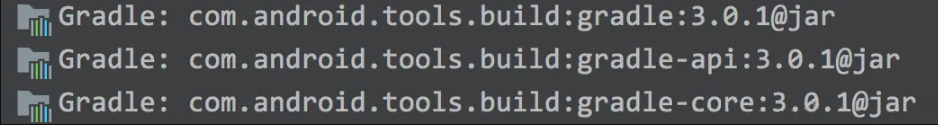

# Gradle 之撰写 task

## 前言

　　task 相当于开发者日常开发中所接触到的函数、方法，它们是相同的概念。例如 transformClassesAndResourcesWithProguardForRelease task 是为了混淆 release 包中源码的。

　　接下来就开始实操，首先在 app/build.gradle 中添加如下依赖：

```groovy
compileOnly 'com.android.tools.build:gradle:3.0.1'
```

　　即可在 External Libraries 中看到关于 Gradle plugin 的源码。



## task 撰写

### task 声明

　　根据 [官方文档](https://docs.gradle.org/4.4/dsl/org.gradle.api.Task.html)和 [Task#create()](https://docs.gradle.org/current/javadoc/org/gradle/api/tasks/TaskContainer.html#create-java.util.Map-) 可以知道，task 的基本写法可以是如下四种：

```groovy
task myTask
task myTask { configure closure }
task (myTask) { configure closure }
task (name:myTask) { configure closure }
```

　　每一个 tsk 都有自己的名字，这样开发者才能调用它，例如调用上面的 task：

```groovy
./gradlew myTask
```

　　但是有一个问题，倘若当前项目的 app module 和 a module 都含有一个名为 myTask 的 task，那么会不会冲突，该如何调用它们？答案是不会冲入，调用方式如下：

```groovy
./gradlew app:myTask (调用 app module 的 myTask)
./gradlew a:myTask (调用 a module 的 myTask)
```

　　通过 PorjectName:taskName 的形式便可以指定唯一绝对路径去调用指定 Project 的指定 task 了。

#### 扩展

### task 内容格式

### task 依赖关系

## task 实战

### install && launch apk

#### hook assets

## 参考文章

[写给 Android 开发者的 Gradle 系列（二）撰写 task](https://juejin.im/post/5afa06466fb9a07aaa1163f1)

