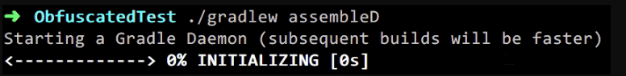
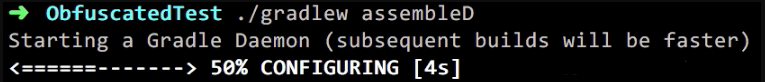
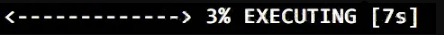
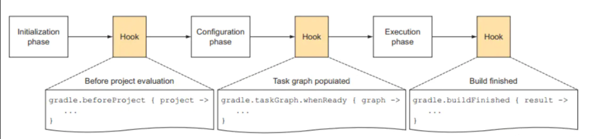

# Gradle 基本知识

## Gradle 介绍

　　对于大部分的 Android 开发者来说 Gradle 是一个强大的工具，它提供便捷的方式帮助开发者构建 app。

　　一个新建的 Android 象目，可以看到 project/build.gradle 文件中的内容类似如下：

```groovy
buildscript {
    repositories {
        google()
        jcenter()
        
    }
    dependencies {
        classpath 'com.android.tools.build:gradle:3.5.2'
        
        // NOTE: Do not place your application dependencies here; they belong
        // in the individual module build.gradle files
    }
}

allprojects {
    repositories {
        google()
        jcenter()
        
    }
}

task clean(type: Delete) {
    delete rootProject.buildDir
}
```

　　project/app/build.gradle 文件中的内容类似如下：

```groovy
apply plugin: 'com.android.application'

android {
    compileSdkVersion 29
    buildToolsVersion "29.0.2"


    defaultConfig {
        applicationId "com.example.viewgroupdistribute"
        minSdkVersion 15
        targetSdkVersion 29
        versionCode 1
        versionName "1.0"

        testInstrumentationRunner "androidx.test.runner.AndroidJUnitRunner"
    }

    buildTypes {
        release {
            minifyEnabled false
            proguardFiles getDefaultProguardFile('proguard-android-optimize.txt'), 'proguard-rules.pro'
        }
    }

}

dependencies {
    implementation fileTree(dir: 'libs', include: ['*.jar'])

    implementation 'androidx.appcompat:appcompat:1.1.0'
    implementation 'androidx.constraintlayout:constraintlayout:1.1.3'
    testImplementation 'junit:junit:4.12'
    androidTestImplementation 'androidx.test.ext:junit:1.1.1'
    androidTestImplementation 'androidx.test.espresso:espresso-core:3.2.0'
}
```

　　Gradle 基于 groovy 语言，[groovy 官方文档](http://www.groovy-lang.org/documentation.html)。

　　如果想知道 buildScript 和 allProjects 的含义，就需要了解 [Gradle DSL 学习](https://docs.gradle.org/4.4/dsl/)，buildScripts 是用来配置当前 project 和所有子 project 的，该方法将会在这些 project 中执行给定的闭包。

　　如果想知道 buildTypes 的意义，需要了解 [Android Plugin DSL 学习](https://google.github.io/android-gradle-dsl/3.1/)。

　　如果想要了解 task 的含义，就需要了解 [Android tasks](https://avatarqing.github.io/Gradle-Plugin-User-Guide-Chinese-Verision/basic_project/android_tasks.html)。

## Gradle task

　　日常开发中，Gradle  task 与大部分的开发者开发时最为紧密的。日常开发中开发者难免会进行 build/clean project、build apk 等操作。


　　实际上这些按钮的底层实现都是通过 Gradle task 来完成的，只不过 IDE 使用 GUI 降低开发者们的使用门槛。点击相应按钮后在 Build 输出栏中会输出相应的信息。


　　一个 task 就是一个函数，想逃知道当前 Android 项目中共有哪些 task，可以在象目目录下输入：

```
gradlew tasks
```

　　将会输出类似以下信息：


　　这仅时部分 task，如果想要查看全部的 task 可以添加 --all 参数：

```
gradlew tasks --all
```

　　拉到最后的 Other task 部分：


　　可以看到所有的 task，提取部分 task 说明下：

* conpileDebugJavaWithJavac：编译 java 文件。
* processDebugManifest：生成最终 AndroidManifest 文件。
* compileDebugAidl：编译 AIDL 文件。
* packageDebug：打包成 apk。

　　而如果为 release 包开启了混淆，可看到还有 transformClassesAndResourcesWithProguardForRelease task，即为 release 包混淆。

　　这些 task 实际上贯穿了开发者们的日常开发流程，只是 IDE 在上层封装了一层，开发者们点点按钮就完成了这些操作。

　　这些 task 都是 plugin 中的，在 build.gradle 顶部 apply 的 plugin 中的（com.android.application/com.android.library）。

## Gradle 构建周期

　　根据 [Build phases 文档](https://docs.gradle.org/current/userguide/build_lifecycle.html#sec:build_phases) 和 [Settings file 文档](https://docs.gradle.org/current/userguide/build_lifecycle.html#sec:settings_file) 可以知道，Gradle 构建周期分为：Initialization、Configuration 和 Execution 三个阶段。

### Initialization

　　Gradle 支持单个和多项目构建。在 Initialization 阶段，Gradle 将会确定哪些象目将参与构建，并为每个项目构建一个 Project 对象实例。对于 Android 项目来说即为执行 setting.gradle 文件。

　　假设当前应用中除 app 以外还有一个 a module 和 b module，那么 setting.gradle 文件应类似如下：

```groovy
include ':app',':a',':b'
```

　　所以 Gradle 将会为他们三个分别创建一个 Project 对象实例。

### Configuration

　　在这一阶段项目配置对象，所有项目的构建脚本将会被执行，这样才能够知道各个 task 之间的依赖关系。需要说的一点是，这里题到的执行可能会稍微有一些歧义：

```groovy
task a{

}

task testBoth{
	// 依赖 a task 限制性
	dependsOn("a")
	println '我会在 Configuration 和 Execution 阶段都会执行'
	doFirst {
		println '我仅会在 testBoth 的 Execution 阶段执行'
	}
	
	doLast{
		println '我仅会在 testBoth 的 Executopn 阶段执行'
	}
}
```

　　写在 task 闭包中的内容是会在 Configuration 中就执行，例如上面的 dependsOn("a") 和 println 内容；而 doFirst()/doLast() 闭包中的内容是在 Execution 阶段才会执行到（doFirst()/doLast() 实际上就是给当前 task 添加 Listener，这些 Listeners 只会在当前 task Execution 阶段才会执行）。

　　例子：

```groovy
// settings.gradle
println 'This is executed during the initialization phase.'
```

```groovy
// build.gradle
println 'This is executed during the configuration phase.'

task configured {
    println 'This is also executed during the configuration phase.'
}

task test {
    doLast {
        println 'This is executed during the execution phase.'
    }
}

task testBoth {
	doFirst {
	  println 'This is executed first during the execution phase.'
	}
	doLast {
	  println 'This is executed last during the execution phase.'
	}
	println 'This is executed during the configuration phase as well.'
}
```

　　输出：

```groovy
> gradle test testBoth
This is executed during the initialization phase.

> Configure project :
This is executed during the configuration phase.
This is also executed during the configuration phase.
This is executed during the configuration phase as well.

> Task :test
This is executed during the execution phase.

> Task :testBoth
This is executed first during the execution phase.
This is executed last during the execution phase.

BUILD SUCCESSFUL in 0s
2 actionable tasks: 2 executed
```

　　对于 Android 项目来说即为执行各个 mu=odule 下的 build.gradle 文件，这样各个 module 下的 build.gradle 文件，这样各个 build.gradle 文件中的 task 的以来关系就被确认下来了（例如 assembleDebug task 的执行依赖于其他 task 先执行，而这个依赖关系的确定就是在 Configuration 阶段）。

### Execution

　　task 的执行阶段。首先执行 doFirst() 闭包中的内容，最后执行 doLast() 闭包中的内容。

　　在命令行中执行某一个 task，是可以清晰地看见每一个执行流程：







### hook gradle 构建过程

　　在命令行输入 ./gradlew xxx 并按下回车之后地执行过程中，就会执行上面的流程。



　　在 Gradle 开发中，很少提及到上述的 hook 系列。用得比较多的一个是提到的 task 中的 doFirst()/doLast()，再一个就是 Project 在 Configuration 阶段结束的 hook，前面提到 Configuration 阶段将会执行每一个 Project 的 build.gradle 文件，那么可以通过 Project.afterEvaluate 来监听每一个 Project 的引入后的点。

```groovy
//afeterEvaluate {Project -> 
//	println 'hook afterEvaluate'
//}

task hook { Project project ->
	afterEvaluate {
		println 'hook afterEvalute'
	}
}
```

　　为什么要 hook Project 的 afterEvaluate 阶段呢？因为在 afterEvaluate 阶段的时候，当前 Project 内的 task 信息才能被掌握，例如想在 assembleDebug task 前输出一段信息，那么在 app/build.gradle 中撰写以下代码：

```groovy
//task badHook{
//	tasks.findByName("assembleDebug").doFirst {
//		println 'hook afterEvaluate from BadHook'
//	}
//}

task assDHook {
	afterEvaluate {
		tasks.findByName("assembleDebug").doFirst {
			println 'hook afterEvaluate From assHook'
		}
	}
}
```

　　此时如果调用 assembleDebug task 的话，首先是 Initialization 阶段，再是 Configuration 阶段，该阶段中当 appProject 到达 afterEvaluate 阶段的时候 appProject 中的 tasks 信息将会全部被获取，当然这其中也包括 assembleDebug task，所以此时再给它添加一个 doFirst{} 闭包便可以达到目的。而像 badHook 闭包的内容将会在 Initialization 阶段执行，此时 appProject 并没有获取全部的 task 信息，将会导致压根找不到 assembleDebug 的错误。

## 参考文章

[写给 Android 开发者的 Gradle 系列（一）基本姿势](https://juejin.im/post/5af4f117f265da0b9f405221)
