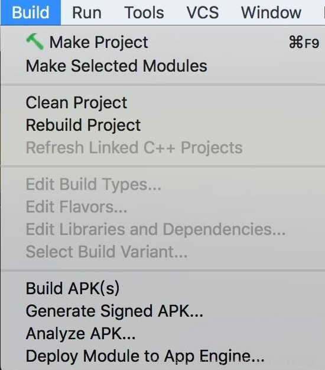
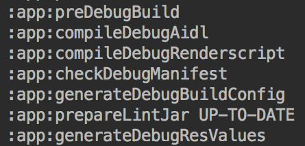
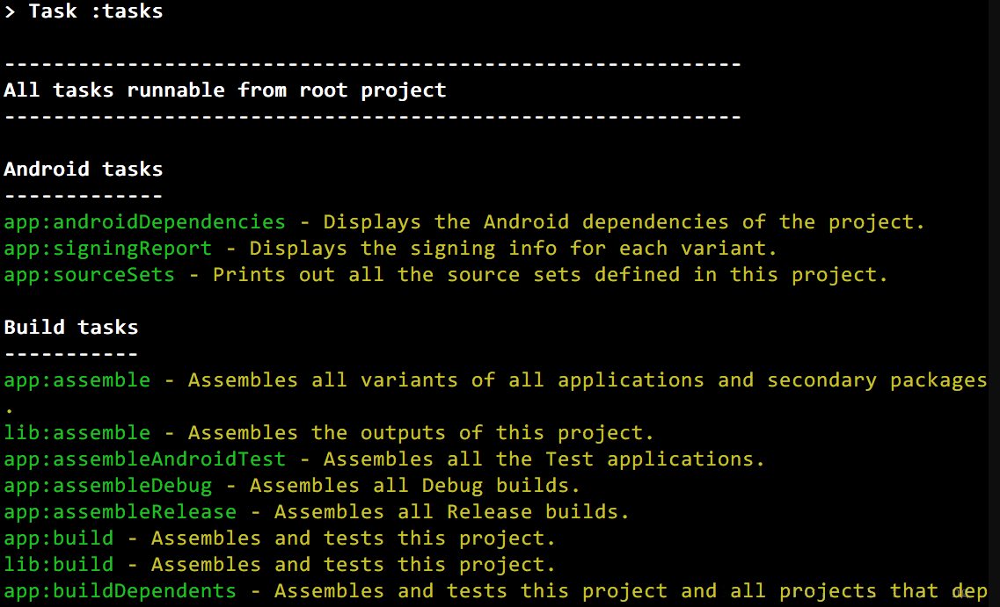

# Gradle 知识

## Gradle 介绍

　　对于大部分的 Android 开发者来说 Gradle 是一个强大的工具，它提供便捷的方式帮助开发者构建 app。

　　一个新建的 Android 象目，可以看到 project/build.gradle 文件中的内容类似如下：

```groovy
buildscript {
    repositories {
        google()
        jcenter()
        
    }
    dependencies {
        classpath 'com.android.tools.build:gradle:3.5.2'
        
        // NOTE: Do not place your application dependencies here; they belong
        // in the individual module build.gradle files
    }
}

allprojects {
    repositories {
        google()
        jcenter()
        
    }
}

task clean(type: Delete) {
    delete rootProject.buildDir
}
```

　　project/app/build.gradle 文件中的内容类似如下：

```groovy
apply plugin: 'com.android.application'

android {
    compileSdkVersion 29
    buildToolsVersion "29.0.2"


    defaultConfig {
        applicationId "com.example.viewgroupdistribute"
        minSdkVersion 15
        targetSdkVersion 29
        versionCode 1
        versionName "1.0"

        testInstrumentationRunner "androidx.test.runner.AndroidJUnitRunner"
    }

    buildTypes {
        release {
            minifyEnabled false
            proguardFiles getDefaultProguardFile('proguard-android-optimize.txt'), 'proguard-rules.pro'
        }
    }

}

dependencies {
    implementation fileTree(dir: 'libs', include: ['*.jar'])

    implementation 'androidx.appcompat:appcompat:1.1.0'
    implementation 'androidx.constraintlayout:constraintlayout:1.1.3'
    testImplementation 'junit:junit:4.12'
    androidTestImplementation 'androidx.test.ext:junit:1.1.1'
    androidTestImplementation 'androidx.test.espresso:espresso-core:3.2.0'
}
```

　　Gradle 基于 groovy 语言，[groovy 官方文档](http://www.groovy-lang.org/documentation.html)。

　　如果想知道 buildScript 和 allProjects 的含义，就需要了解 [Gradle DSL 学习](https://docs.gradle.org/4.4/dsl/)，buildScripts 是用来配置当前 project 和所有子 project 的，该方法将会在这些 project 中执行给定的闭包。

　　如果想知道 buildTypes 的意义，需要了解 [Android Plugin DSL 学习](https://google.github.io/android-gradle-dsl/3.1/)。

　　如果想要了解 task 的含义，就需要了解 [Android tasks](https://avatarqing.github.io/Gradle-Plugin-User-Guide-Chinese-Verision/basic_project/android_tasks.html)。

## Gradle task

　　日常开发中，Gradle  task 与大部分的开发者开发时最为紧密的。日常开发中开发者难免会进行 build/clean project、build apk 等操作。



　　实际上这些按钮的底层实现都是通过 Gradle task 来完成的，只不过 IDE 使用 GUI 降低开发者们的使用门槛。点击相应按钮后在 Build 输出栏中会输出相应的信息。



　　一个 task 就是一个函数，想逃知道当前 Android 项目中共有哪些 task，可以在象目目录下输入：

```
gradlew tasks
```

　　将会输出类似以下信息：



　　这仅时部分 task，如果想要查看全部的 task 可以添加 --all 参数：

```
gradlew tasks --all
```

　　拉到最后的 Other task 部分：


## 参考文章

[Gradle自定义插件](https://blog.csdn.net/eclipsexys/article/details/50973205)

[Gradle从入门到实战 - Groovy基础](https://blog.csdn.net/singwhatiwanna/article/details/76084580)

[全面理解Gradle - 执行时序](https://blog.csdn.net/singwhatiwanna/article/details/78797506)

[全面理解Gradle - 定义Task](https://blog.csdn.net/singwhatiwanna/article/details/78898113)

[写给 Android 开发者的 Gradle 系列（一）基本姿势](https://juejin.im/post/5af4f117f265da0b9f405221)

[写给 Android 开发者的 Gradle 系列（二）撰写 task](https://juejin.im/post/5afa06466fb9a07aaa1163f1)

[写给 Android 开发者的 Gradle 系列（三）撰写 plugin](https://juejin.im/post/5b02113a5188254289190671)