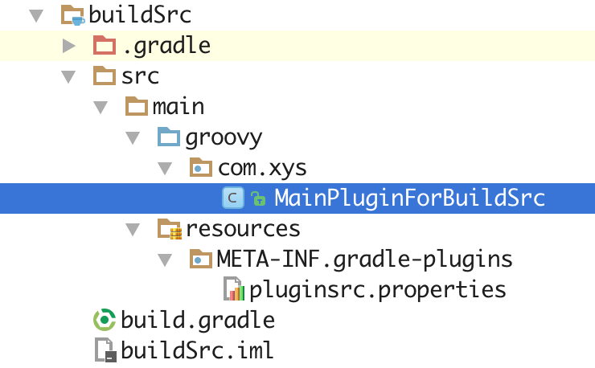
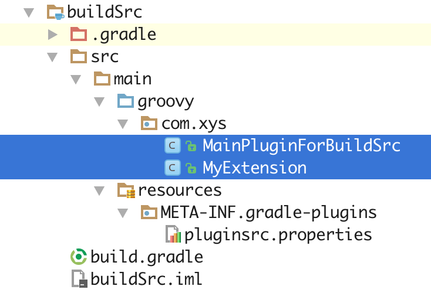
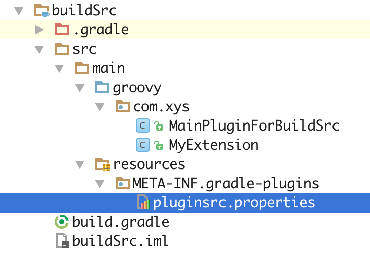
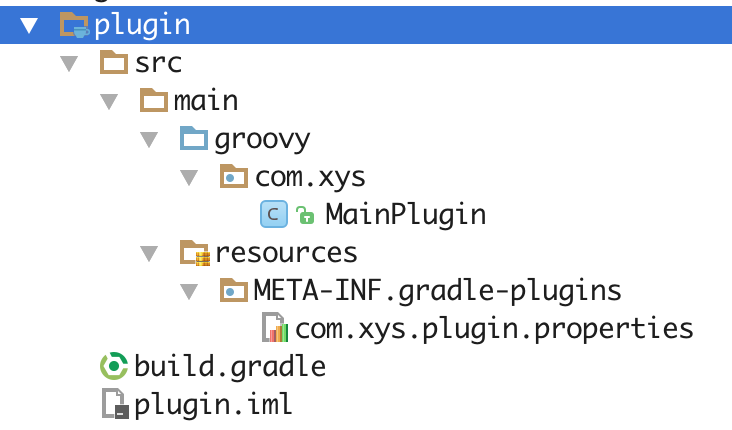
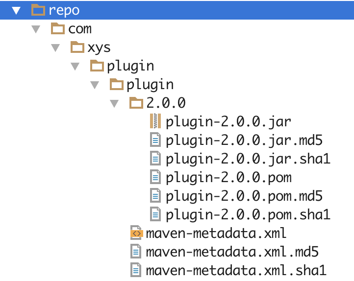

# Gradle 自定义插件

　　在 Gradle 中创建自定义插件，Gradle 提供了三种方式：

* 在 build.gradle 脚本中直接使用
* 在 buildSrc 中使用
* 在独立 Module 中使用

　　开发 Gradle 插件可以在 IDEA 中进行开发，也可以在 Android Studio 中进行开发，它们唯一的不同，激素hi IDEA 提供了 Gradle 开发的插件，比较方便创建文件和目录，而 Android Studio 中，开发者需要手动创建（但实际上，这个目录并不多，也不复杂，完全可以手动创建）。

## 在项目中使用

　　在 Android Studio 中创建一个标准的 Android 项目，整个目录结构如下所示：

```java
├── app
│   ├── build.gradle
│   ├── libs
│   └── src
│       ├── androidTest
│       │   └── java
│       ├── main
│       │   ├── AndroidManifest.xml
│       │   ├── java
│       │   └── res
│       └── test
├── build.gradle
├── buildSrc
│   ├── build.gradle            ---1
│   └── src
│       └── main
│           ├── groovy          ---2
│           └── resources       ---3
├── gradle
│   └── wrapper
│       ├── gradle-wrapper.jar
│       └── gradle-wrapper.properties
├── gradle.properties
├── gradlew
├── gradlew.bat
├── local.properties
└── settings.gradle
```

　　其中，除了 buildSrc 目录以外，都是标准的 Android 目录，而 buildSrc 就是 Gradle 提供的在项目中配置自定义插件的默认目录，开发 Gradle 要创建的目录，也就是 RootProject/src/main/groovy 和 RootProject/src/main/resources 两个目录。

　　在配置完成后，如果配置正确，对应的文件夹将被 IDE 所识别，成为对应类别的文件夹。

### 创建 buildSrc/build.gradle

　　首先，先来配置 buildSrc 目录下的 build.gradle 文件，这个配置比较固定，脚本如下所示：

```groovy
apply plugin: 'groovy'

dependencies {
    compile gradleApi()
    compile localGroovy()
}
```

### 创建 Groovy 脚本

　　接下来，在 groovy 目录下，创建一个 Groovy 类（与 Java 类似，可以带包名，但 Groovy 类似 .grovvy 结尾），如图所示：



　　在脚本中通过实现 gradle 的 Plugin 接口，实现 apply 方法即可，脚本如下所示：

```groovy
package com.xys

import org.gradle.api.Plugin
import org.gradle.api.Project

public class MainPluginForBuildSrc implements Plugin<Project> {

    @Override
    void apply(Project project) {
        project.task('testPlugin') << {
            println "Hello gradle plugin in src"
        }
    }
}
```

　　在如上所示的脚本的 apply 方法中，简单的实现了一个 task，命名为 testPlugin，执行该 Task，会输出一行日志。

#### 创建 Groovy 脚本的 Extension

　　所谓 Groovy 脚本的 Extension，实际上就是类似于 Gradle 的配置信息，在主项目使用自定义的 Gradle 插件时，可以在主项目的 build.gradle 脚本中通过 Extension 来传递一些配置、参数。

　　创建一个 Extension，著需要创建一个 Groovy 类即可，如图所示：



　　如上所示，命名了一个叫 MyExtension 的 groovy 类，其脚本如下所示：

```groovy
package com.xys;

class MyExtension {
    String message
}
```

　　MyExtension 代码非常简单，就是定义了要配置的参数变量。

#### 在 Groovy 脚本中使用 Extension

　　在创建了 Extension 之后，需要修改下之前创建的 Groovy 类来加载 Extension，修改后的脚本如下所示：

```groovy
package com.xys

import org.gradle.api.Plugin
import org.gradle.api.Project

public class MainPluginForBuildSrc implements Plugin<Project> {

    @Override
    void apply(Project project) {

        project.extensions.create('pluginsrc', MyExtension)

        project.task('testPlugin') << {
            println project.pluginsrc.message
        }
    }
}
```

　　通过 project.extension.create 方法，来将一个 Extension 配置给 Gradle 即可。

### 创建 resources

　　resources 目录是标识整个插件的目录，其目录下的结构如下所示：

```
└── resources
└── META-INF
└── gradle-plugins
```

　　该目录结构与 buildSrc 一样，是 Gradle 插件的默认目录，不能有任何修改。创建好这些目录后，在 gradle-plugins 目录下创建 -- 插件名.properties 文件，如图所示：



　　如上所示，这里命名为 pluginsrc.properties，在该文件中，代码如下所示：

```properties
implementation-class=com.xys.MainPluginForBuildSrc
```

　　通过上面的代码指定最开始创建的 Groovy 类即可。

### 在主项目中使用插件

　　在主项目的 build.gradle 文件中，通过 apply 指令来加载自定义的插件，脚本如下所示：

```groovy
apply plugin: 'pluginsrc'
```

　　其中 plugin 的名字，就是前面创建 pluginsrc.properties 中的名字 -- pluginsrc，通过这种方式，就加载了自定义的插件。

#### 配置 Extension

　　在主项目的 build.gradle 文件中，通过如下所示的代码来加载 Extension：

```groovy
pluginsrc{
    message = 'hello gradle plugin'
}
```

　　同样，领域名为插件名，配置的参数就是在 Extension 中定义的参数名。

　　配置完毕后，就可以在主项目中使用自定义的插件了，在终端执行 gradle testPlugin 指令，结果如下所示：

```groovy
:app:testPlugin
hello gradle plugin
```

## 在本地 Repo 中使用

　　在 buildSrc 中创建自定义 Gradle 插件只能在当前项目中使用，因此，对于具有普遍性的插件来说，通常是建立一个独立的 Module 来创建自定义 Gradle 插件。

### 创建 Android Library Module

　　首先，在主项目的工程中，创建一个普通的 Android Library Module，并删除其默认创建的目录，修改为 Gralde 插件所需要的目录，即在 buildSrc 目录中的所有目录，如图所示：



　　如上图所示，创建的文件与在 buildSrc 目录中创建的文件都是一摸一样的，只是这里在一个自定义的 Module 中创建插件而不是在默认的 buildSrc 目录中创建。

### 部署到本地 Repo

　　因为是通过自定义 Module 来创建插件的，因此，不能让 Gradle 来自动完成插件的加载，需要手动进行部署，所以，需要在插件的 build.gradle 脚本中增加 Maven 的配置，脚本如下所示：

```groovy
apply plugin: 'groovy'
apply plugin: 'maven'

dependencies {
    compile gradleApi()
    compile localGroovy()
}

repositories {
    mavenCentral()
}

group='com.xys.plugin'
version='2.0.0'
uploadArchives {
    repositories {
        mavenDeployer {
            repository(url: uri('../repo'))
        }
    }
}
```

　　相比 buildSrc 中的 build.gradle 脚本，这里增加了 Maven 的支持和 uploadArchives 这样一个 Task，这个 Task 的作用就是将该 Module 部署到本地的 repo 目录下。在终端中执行 gradle uploadArchives 指令，将插件部署到 repo 目录下，如图所示：



　　当插件部署到本地后，就可以在主项目中引用插件了。

　　当插件正式发布后，可以把插件像其他 module 一样发布到中央库，这样就可以像使用中央库的库项目一样来使用插件了。

#### 引用插件

　　在 buildSrc 中，系统自动帮开发者自定义的插件提供了引用支持，但自定义 Module 的插件中，开发者就需要自己来添加自定义插件的引用支持。在主项目的 build.gradle 文件中，添加如下所示的脚本：

```groovy
apply plugin: 'com.xys.plugin'

buildscript {
    repositories {
        maven {
            url uri('../repo')
        }
    }
    dependencies {
        classpath 'com.xys.plugin:plugin:2.0.0'
    }
}
```

　　其中，classpath 指定的路径，就是类似 compile 引用的方式，即 -- 插件名：group:version 配置完毕后，就可以在主项目中使用自定义的插件了，在终端执行 gradle testPlugin 指令，结果如下所示：

```groovy
:app:testPlugin
Hello gradle plugin
```

　　如果不使用本地 Maven Repo 来部署，也可以拿到生成的插件 jar 文件，复制到 libs 目录下，通过如下所示的代码来引用：

```groovy
classpath fileTree(dir: 'libs', include: '\*.jar') // 使用jar
```

## 参考文章

[Gradle自定义插件](https://blog.csdn.net/eclipsexys/article/details/50973205)