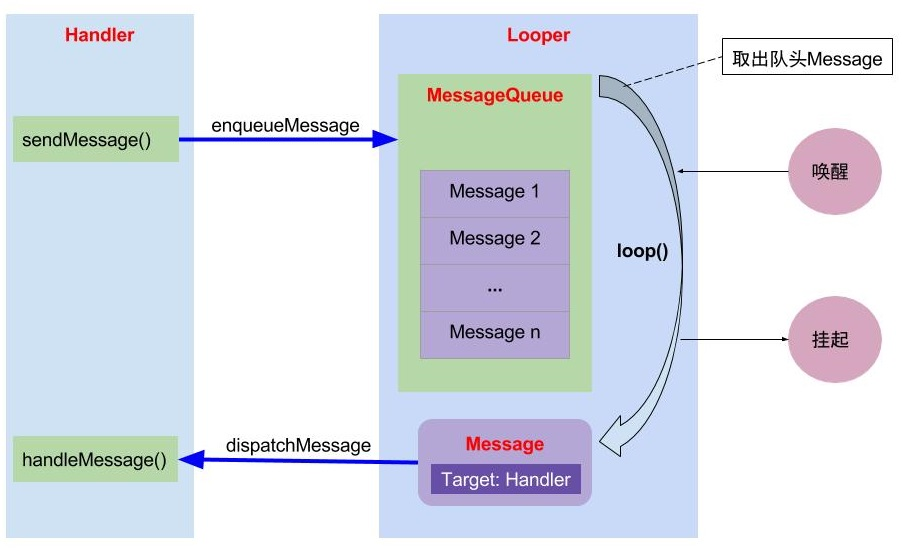

# 关于 Handler

## 1. 消息机制概述

### Android 中线程的分类

1. 带有消息队列，用来执行循环性任务（例如主线程、android.os.HandlerThread）。
2. 没有消息队列，用来执行一次性任务（例如 java.lang.Thread）。

### 1.1. 消息机制的模型

　　消息机制主要包含：MessageQueue、Handler 和 Looper 这三大部分，以及 Message。

#### 1.1.1. Message

　　需要传递的消息，可以传递数据。

　　在整个消息处理机制中，message 又叫 task，封装了任务携带的信息和处理该任务的 handler。

　　这个类定义了一个包含描述和一个任意类型的对象，它可以被发送给 handler。

　　尽管 Message 有 public 的默认构造方法，但是应该通过 Message.obtail() 来从消息池中获取空消息对象，以节省资源。

　　如果 message 只需要携带简单的 int 信息，请优先使用 Message.arg1 和 Message.arg2 来传递消息，这比用 Bundle 更省内存。

　　用 message.what 来标识信息，以便用不同方式处理 message。

#### 1.1.2. MessageQueue

　　消息队列，但是它的内部实现并不是用的队列，实际上是通过一个单链表的数据结构来维护消息列表，因为单链表在插入和删除上比较有优势。主要功能向消息池投递消息（MessageQueue.enqueueMessage）和取走消息池的消息（MessageQueue.next）。

　　负责消息的入队出队。

#### 1.1.3. Handler

　　消息辅助类，主要功能向消息池发送各种消息事件（Hnadler sendMessage）和处理相应消息事件（Handler.handleMessage）。

　　可以使用 Handler 发送并处理与一个线程关联的 Message 和 Runnable。（注意：Runnable 会被封装进一个 Message，所以它本质上还是一个 Message）。

　　每个 Handler 都会跟一个线程绑定，并与该线程的 MessageQueue 关联在一起，从而实现消息的管理以及线程间通信。

#### 1.1.4. Looper

　　不断循环执行（Looper.loop），从MessageQueue 中读取消息，按分发机制将消息分发给目标处理者。

#### 消息机制的架构
　　消息机制的运行流程：在子线程执行完耗时操作，当 Handler 发送消息时，将会调用 MessageQueue.enqueueMessae，向消息队列中添加消息。当通过 Looper.loop 开启循环后，会不断地从线程池中读取消息，即调用 MessageQueue.next，然后调用目标 Handler(即发送该消息的 Handler)的 dispatchMessage 方法传递消息，然后返回到 Handler 所在线程，目标 Handler 收到消息，调用 handleMessage 方法，接收消息，处理消息。


　　Message、Handler 和 Looper 三者之间的关系：每个线程中只能存在一个 Looper，Looper 是保存在 ThreadLocal 中的。主线程（UI 线程）已经创建了一个 Looper，所以在主线程不需要再创建 Looper，但是在其他线程中需要创建 Looper。每个线程中可以有多了 Handler，即一个 Looper 可以处理来自多个 Handler 的消息。Looper 中维护一个 MessageQueue，来维护消息队列，消息队列中的 Message 可以来自不同的 Handler。

　　消息机制的整体架构图：


　　Looper 有一个 MessageQueue 消息队列；MessageQueue 有一组待处理的 Message；Message 中记录发送和处理消息的 Handler；Handler 中有 Looper 和 MessageQueue。

### 基于消息的异步任务接口

1. android.os.HandlerThread
2. android.os.AyncTask

## Handler 的基本用法

```java
android.os.Handler handler = new Handler(){
  @Override
  public void handleMessage(final Message msg) {
    //这里接受并处理消息
  }
};
//发送消息
handler.sendMessage(message);
handler.post(runnable);
```

　　实例化一个 Handler 重写 handleMessage 方法，然后在需要的时候调用它的 send 以及 post 系列方法就可以了，非常简单易用，并且支持延时消息。


## 消息机制的源码解析

### Looper

　　要想使用消息机制，首先要创建一个 Looper。

　　用于在指定线程中运行一个消息循环，一旦有新任务则执行，执行完继续等待下一个任务，即变成 Looper 线程。

#### 初始化 Looper

　　无参情况下，默认调用 prepare(true)，表示的是这个 Looper 可以退出，而对于 false 的情况则表示当前 Looper 不可以退出。

```java
public final class Looper {
    public static void prepare() {
        prepare(true);
    }

    private static void prepare(boolean quitAllowed) {
        if (sThreadLocal.get() != null) {
            throw new RuntimeException("Only one Looper may be created per thread");
        }
        sThreadLocal.set(new Looper(quitAllowed));
    }
}
```
　　Looper 提供了 Looper.prepare() 方法来创建 Looper，并且会借助 THreadLocal 来实现与当前线程的绑定功能。Looper.loop() 则会开始不断尝试从 MessageQueue 中获取 Message，并且分发给对应的 Handler。

　　也就是说 Handler 跟线程的关联是靠 Looper 来实现的。

　　这里看出，不能重复创建 Looper，只能创建一个。创建 Looper，并保存在 ThreadLocal。其中 ThreadLocal 是线程本地存储区（Thred Local Storage，简称为 TLS），每一个线程都有自己的私有的本地存储区域，不同线程之间彼此不能访问对方的 TSL 区域。

1. prepare() 其核心就是将 looper 对象定义为 ThreadLocal。
2. 一个Thread 只能有一个 Looper 对象。
3. prepare() 方法会调用 Looper d 的构造方法，初始化一个消息队列，并且指定当前线程。

　　ThreadLocal 并不是一个 Thread，而是 Thread 的局部变量。当使用 ThreadLocal 维护变量时，ThreadLocal 为每个使用该变量的线程提供独立的变量副本，所以每一个线程都可以独立地改变自己的副本，而不会影响其他线程所对应的副本。

　　从线程的角度看，目标变量就像是线程的本地变量。

#### MessageQueue

　　MessageQueue 是一个低等级的持有 Message 集合的类，被 Looper 分发。Message 并不是直接加到 MessageQueue 的，而是通过 Handler 对象和 Looper 关联到一起。可以通过 Looper.myQueue() 方法来检索当前线程的 MessageQueue。

#### 开启 Looper

```java
public final class Looper {
    /**
     * Run the message queue in this thread. Be sure to call
     * {@link #quit()} to end the loop.
     */
    public static void loop() {
		// 获取 TLS 存储的 Looper 对象
        // 得到当前线程 Looper
        final Looper me = myLooper();
        if (me == null) {
            throw new RuntimeException("No Looper; Looper.prepare() wasn't called on this thread.");
        }
		// 获取当前 Looper 对象中的消息队列
        final MessageQueue queue = me.mQueue;

        // Make sure the identity of this thread is that of the local process,
        // and keep track of what that identity token actually is.
        Binder.clearCallingIdentity();
        final long ident = Binder.clearCallingIdentity();

		// 进入 loop 的主循环方法
        for (;;) {
			// 可能会阻塞，因为 next() 方法可能会无限循环
            // 不断从 MessageQueue 获取消息
            Message msg = queue.next(); // might block
			// 消息为空，则退出循环
            // 退出 Looper
            if (msg == null) {
                // No message indicates that the message queue is quitting.
                // 没有消息表示消息队列正在退出
                return;
            }

            // This must be in a local variable, in case a UI event sets the logger
			// 默认为 null，可通过 setMessageLogging() 方法来指定输出，用于 debug 功能
            final Printer logging = me.mLogging;
            if (logging != null) {
                logging.println(">>>>> Dispatching to " + msg.target + " " +
                        msg.callback + ": " + msg.what);
            }

            final long traceTag = me.mTraceTag;
            if (traceTag != 0 && Trace.isTagEnabled(traceTag)) {
                Trace.traceBegin(traceTag, msg.target.getTraceName(msg));
            }
            try {
				// 获取 msg 的目标 Handler，然后用于分发 Message
                // 将真正的处理工作交给 message 的 target，即 Handler
                msg.target.dispatchMessage(msg);
            } finally {
                if (traceTag != 0) {
                    Trace.traceEnd(traceTag);
                }
            }

            if (logging != null) {
                logging.println("<<<<< Finished to " + msg.target + " " + msg.callback);
            }

            // Make sure that during the course of dispatching the
            // identity of the thread wasn't corrupted.
            final long newIdent = Binder.clearCallingIdentity();
            if (ident != newIdent) {
                Log.wtf(TAG, "Thread identity changed from 0x"
                        + Long.toHexString(ident) + " to 0x"
                        + Long.toHexString(newIdent) + " while dispatching to "
                        + msg.target.getClass().getName() + " "
                        + msg.callback + " what=" + msg.what);
            }
			// 回收消息资源
            msg.recycleUnchecked();
        }
    }
}
```

　　loop() 进入循环模式，不断重复下面的操作：读取 MessageQueue 的下一条 Message，如果为空则退出循环，不为空则把 Message 分发给相应的 target。

　　当 next() 取出下一条消息时，队列中已经没有消息时，next() 会无限循环，产生阻塞。等待 MessageQueue 中加入消息，然后重新唤醒。

　　调用 loop 方法后，Looper 线程就开始真正工作了，它不断从自己的 MessageQueue 中取出队头的消息（或者说是任务）执行。

　　主线程中不需要自己创建 Looper，这是由于在程序启动的时候，系统已经自动调用了 Looper.prepare() 方法。

　　查看 ActivityThread 中的 main() 方法：

```java
public final class ActivityThread {
    public static void main(String[] args) {
        ...
        Looper.prepareMainLooper();
		...
        Looper.loop();
		...
    }
}
```
　　其中 prepareMainLooper() 方法会调用 prepare(false) 方法。

　　除了 prepare() 和 loop() 方法，Looper 类还有一些比较有用的方法，比如

1. Looper.myLooper() 得到当前线程 looper 对象。
2. getThread() 得到 looper 对象所属线程。
3. quit() 方法结束 looper 循环。

#### quit

　　quit() 方法其实调用的是  MessageWueue 的 quite(boolean safe) 方法：

```java
//Looper#quit()
    public void quit() {
        mQueue.quit(false);
    }
// MessageQueue#quit()
    void quit(boolean safe) {
        if (!mQuitAllowed) {
            throw new IllegalStateException("Main thread not allowed to quit.");
        }

        synchronized (this) {
            if (mQuitting) {
                return;
            }
            mQuitting = true;

            if (safe) {
                removeAllFutureMessagesLocked();
            } else {
                removeAllMessagesLocked();
            }

            // We can assume mPtr != 0 because mQuitting was previously false.
            nativeWake(mPtr);
        }
    }
```

　　可以看到其实主线程是不能调用这个方法退出消息队列的。至于 mQuitAllowed 参数是在 Looper 初始化的时候初始化的，主线程初始化调用的 Looper.prepareMainLooper() 方法，这个方法把参数设置为 false。

### Handler

　　添加消息到消息队列是通过 Handler 来操作的。

　　每一个 Handler 实例关联了一个单一的 thread 和这个 thread 的 messageQueue，当 Handler 的实例被创建的时候它就被绑定到了创建它的 thread。它用来调度 message 和 runnables 在未来某个时间点的执行，还可以排列其他线程里执行的操作。

#### 创建 Handler

```java
public class Handler {
    
    final Looper mLooper;
    final MessageQueue mQueue;
    
	public Handler() {
        this(null, false);
    }

    public Handler(@Nullable Callback callback) {
        this(callback, false);
    }

    public Handler(@NonNull Looper looper) {
        this(looper, null, false);
    }

    public Handler(@NonNull Looper looper, @Nullable Callback callback) {
        this(looper, callback, false);
    }

    @UnsupportedAppUsage
    public Handler(boolean async) {
        this(null, async);
    }

    public Handler(@Nullable Callback callback, boolean async) {
        if (FIND_POTENTIAL_LEAKS) {
            final Class<? extends Handler> klass = getClass();
            if ((klass.isAnonymousClass() || klass.isMemberClass() || klass.isLocalClass()) &&
                    (klass.getModifiers() & Modifier.STATIC) == 0) {
                Log.w(TAG, "The following Handler class should be static or leaks might occur: " +
                    klass.getCanonicalName());
            }
        }
		// 必须先执行 Looper.prepare()，才能获取 Looper 对象，否则为 null。
        mLooper = Looper.myLooper(); //从当前线程的 TLS 中获取 Looper 对象
        // 检查当前的线程是否有 Looper
        if (mLooper == null) {
            throw new RuntimeException(
                "Can't create handler inside thread " + Thread.currentThread()
                        + " that has not called Looper.prepare()");
        }
        // Looper 持有一个 MessageQueue
        // 消息队列，来自 Looper 对象
        mQueue = mLooper.mQueue;
        mCallback = callback; // 回调方法
        mAsynchronous = async; // 设置消息是否为异步处理方式
    }
	// 设置了 Looper，用于非转线程的 Handler 创建
    @UnsupportedAppUsage
    public Handler(@NonNull Looper looper, @Nullable Callback callback, boolean async) {
        mLooper = looper;
        mQueue = looper.mQueue;
        mCallback = callback;
        mAsynchronous = async;
    }
}
```

　　在实例化 Handler 的时候，Handler 会去检查当前线程的 Looper 是否存在，如果不存在则会报异常，也就是说在创建 Handler 之前一定需要先创建 Looper。

　　对于 Handler 的无参构造方法，默认采用当前线程 TLS 中的 Looper 对象，并且 callback 回调方法为 null，且消息为同步处理方式。

　　只要执行的 Looper.prepare() 方法，那么便可以获取有效的 Looper 对象。

　　构造方法里面的重点就是初始化了两个变量，把关联 looper 的 messageQueue 作为自己的 MessageQueue，因此它的消息将发送到关联 looper 的 MessageQueue 上。

　　有了 handler 之后，就可以使用 Handler 提供的 post 和 send 系列方法向 MessageQueue 上发送消息了。其实 post 发出的 Runnable 对象最后都被封装成 message 对象。

### 发送消息

　　发送消息有几种方式，但是归根结底都是调用了 sendMessageAtTime() 方法。

　　在子线程中通过 Handler 的 post() 方式或 send() 方式发送消息，最终都是调用了 sendMessageAtTime() 方法。

#### post 方法

```java
    public final boolean post(@NonNull Runnable r) {
       return  sendMessageDelayed(getPostMessage(r), 0);
    }

    public final boolean postAtTime(@NonNull Runnable r, long uptimeMillis) {
        return sendMessageAtTime(getPostMessage(r), uptimeMillis);
    }

    public final boolean postAtTime(
            @NonNull Runnable r, @Nullable Object token, long uptimeMillis) {
        return sendMessageAtTime(getPostMessage(r, token), uptimeMillis);
    }

    public final boolean postDelayed(@NonNull Runnable r, long delayMillis) {
        return sendMessageDelayed(getPostMessage(r), delayMillis);
    }
    
    /** @hide */
    public final boolean postDelayed(Runnable r, int what, long delayMillis) {
        return sendMessageDelayed(getPostMessage(r).setWhat(what), delayMillis);
    }

    public final boolean postDelayed(
            @NonNull Runnable r, @Nullable Object token, long delayMillis) {
        return sendMessageDelayed(getPostMessage(r, token), delayMillis);
    }
```

1. 调用 getPostMessage(r) ，把 runnable 对象添加到一个 Message 对象中。
2. sendMessageDelayed(getPostMessage(r),0)，基本没做什么操作，又继续调用 sendMessageAtTime(msg, SystemClick.uptimeMillis() + delayMillis) 方法，在这个方法里面拿到创建这个 Handler 对象的线程持有的 MessageQueue。
3. 调用 enqueueMessage(queue, msg, uptimeMillis) 方法，给 msg 对象的 target 变量赋值为当前的 Handler 对象，然后放入到 MessageQueue。

#### send 方法

```java
    public final boolean sendMessage(@NonNull Message msg) {
        return sendMessageDelayed(msg, 0);
    }
    
    public final boolean sendEmptyMessage(int what)
    {
        return sendEmptyMessageDelayed(what, 0);
    }
    
    public final boolean sendEmptyMessageDelayed(int what, long delayMillis) {
        Message msg = Message.obtain();
        msg.what = what;
        return sendMessageDelayed(msg, delayMillis);
    }

    public final boolean sendEmptyMessageAtTime(int what, long uptimeMillis) {
        Message msg = Message.obtain();
        msg.what = what;
        return sendMessageAtTime(msg, uptimeMillis);
    }

    public final boolean sendMessageDelayed(@NonNull Message msg, long delayMillis) {
        if (delayMillis < 0) {
            delayMillis = 0;
        }
        return sendMessageAtTime(msg, SystemClock.uptimeMillis() + delayMillis);
    }

```

　　就连子线程中调用 Activity 中的 runOnUiThread() 中更新 UI，其实也是发送消息通知主线程更新 UI，最终也会调用 sendMessageAtTime() 方法。

```java
   public final void runOnUiThread(Runnable action) {
        if (Thread.currentThread() != mUiThread) {
            mHandler.post(action);
        } else {
            action.run();
        }
    }
```

　　如果当前的线程不等于 UI 线程（主线程），就去调用 Handler 的 post() 方法，最终会调用 sendMessageAtTime() 方法，否则就直接调用 Runnable 对象的 run() 方法。

#### sendMessageAtTime

```java
    public boolean sendMessageAtTime(@NonNull Message msg, long uptimeMillis) {
        // 其中 mQueue 是消息队列，从 Looper 中获取
        MessageQueue queue = mQueue;
        if (queue == null) {
            RuntimeException e = new RuntimeException(
                    this + " sendMessageAtTime() called with no mQueue");
            Log.w("Looper", e.getMessage(), e);
            return false;
        }
        // 调用 enqueueMessage 方法
        return enqueueMessage(queue, msg, uptimeMillis);
    }

    private boolean enqueueMessage(@NonNull MessageQueue queue, @NonNull Message msg,
            long uptimeMillis) {
        msg.target = this;
        msg.workSourceUid = ThreadLocalWorkSource.getUid();

        if (mAsynchronous) {
            msg.setAsynchronous(true);
        }
        // 调用 MessageQueue 的 enqueueMessage 方法
        return queue.enqueueMessage(msg, uptimeMillis);
    }
```

　　可以看到 sendMessageAtTime() 方法的作用很简单，就是调用 MessageQueue 的 enqueueMessage() 方法，往消息队列中添加一个消息。

　　接下来看 MessageQueue 的 enqueueMessage() 方法的具体执行逻辑。

#### MessageQueue#enqueueMessage

```java
    boolean enqueueMessage(Message msg, long when) {
        // 每一个 Message 必须有一个 target
        if (msg.target == null) {
            throw new IllegalArgumentException("Message must have a target.");
        }
        if (msg.isInUse()) {
            throw new IllegalStateException(msg + " This message is already in use.");
        }

        synchronized (this) {
            if (mQuitting) { //正在退出时，回收 msg，加入到消息池
                IllegalStateException e = new IllegalStateException(
                        msg.target + " sending message to a Handler on a dead thread");
                Log.w(TAG, e.getMessage(), e);
                msg.recycle();
                return false;
            }

            msg.markInUse();
            msg.when = when;
            Message p = mMessages;
            boolean needWake;
            if (p == null || when == 0 || when < p.when) {
                // p 为 null （代表 MessageQueue 没有消息）或者 msg 的触发时间是队列中最早的，则进入该分支
                // New head, wake up the event queue if blocked.
                msg.next = p;
                mMessages = msg;
                needWake = mBlocked;
            } else {
                // Inserted within the middle of the queue.  Usually we don't have to wake
                // up the event queue unless there is a barrier at the head of the queue
                // and the message is the earliest asynchronous message in the queue.
                // 将消息按时间顺序插入到 MessageQueue。一般地，不需要唤醒事件队列，除非消息对头存在 barrier，并且同时 Message 是队列中最早的异步消息。
                needWake = mBlocked && p.target == null && msg.isAsynchronous();
                Message prev;
                for (;;) {
                    prev = p;
                    p = p.next;
                    if (p == null || when < p.when) {
                        break;
                    }
                    if (needWake && p.isAsynchronous()) {
                        needWake = false;
                    }
                }
                msg.next = p; // invariant: p == prev.next
                prev.next = msg;
            }

            // We can assume mPtr != 0 because mQuitting is false.
            if (needWake) {
                nativeWake(mPtr);
            }
        }
        return true;
    }
```

　　MessageQueue 是按照 Message 触发时间的先后顺序排列的，队头的消息是将要最早触发的消息。当有消息需要加入消息队列时，会从队列头开始遍历，直到找到消息应该插入的合适位置，以保证所有消息的时间顺序。

　　调用 enqueueMessage(queue, msg, uptimeMillis) 方法，给 msg 对象的 target 变量赋值为当前的 Handler 对象，然后放入到 MessageQueue。

### 获取消息

　　当发送了消息后，在 MessageQueue 维护了消息队列，然后在 Looper 中通过 loop() 方法，不断地获取消息。

　　loop() 方法中最重要的是调用了 queue.next() 方法，通过该方法来提取下一条信息。

　　下来来看 next() 方法的具体流程。

#### MessageQueue#next()

```java
    Message next() {
        // Return here if the message loop has already quit and been disposed.
        // This can happen if the application tries to restart a looper after quit
        // which is not supported.
        final long ptr = mPtr;
        // 当消息循环已经退出，则直接返回
        if (ptr == 0) {
            return null;
        }
		// 循环迭代得首次为-1
        int pendingIdleHandlerCount = -1; // -1 only during first iteration
        int nextPollTimeoutMillis = 0;
        for (;;) {
            if (nextPollTimeoutMillis != 0) {
                Binder.flushPendingCommands();
            }
			
            // 阻塞操作，当等待 nextPollTimeoutMillis 时长，或者消息队列被唤醒，都会返回
            nativePollOnce(ptr, nextPollTimeoutMillis);

            synchronized (this) {
                // Try to retrieve the next message.  Return if found.
                final long now = SystemClock.uptimeMillis();
                Message prevMsg = null;
                Message msg = mMessages;
                if (msg != null && msg.target == null) {
                    // Stalled by a barrier.  Find the next asynchronous message in the queue.
                    // 当消息 Handler 为空时，查询 MessageQueue 中的下一条异步消息 msg，为空则退出循环。
                    do {
                        prevMsg = msg;
                        msg = msg.next;
                    } while (msg != null && !msg.isAsynchronous());
                }
                if (msg != null) {
                    if (now < msg.when) {
                        // Next message is not ready.  Set a timeout to wake up when it is ready.
                        // 当异步消息触发时间大于当前时间，则设置下一次轮询的超时时长
                        nextPollTimeoutMillis = (int) Math.min(msg.when - now, Integer.MAX_VALUE);
                    } else {
                        // Got a message.
                        // 获取一条消息，并返回
                        mBlocked = false;
                        if (prevMsg != null) {
                            prevMsg.next = msg.next;
                        } else {
                            mMessages = msg.next;
                        }
                        msg.next = null;
                        if (DEBUG) Log.v(TAG, "Returning message: " + msg);
                        // 设置消息的使用状态，即 flags != FLAG_IN_USE
                        msg.markInUse();
                        // 成功地获取 MessageQueue 中的下一条即将要执行地消息
                        return msg; 
                    }
                } else {
                    // No more messages.
                    nextPollTimeoutMillis = -1;
                }

                // Process the quit message now that all pending messages have been handled.
                // 消息正在退出，返回 null
                if (mQuitting) {
                    dispose();
                    return null;
                }

                // If first time idle, then get the number of idlers to run.
                // Idle handles only run if the queue is empty or if the first message
                // in the queue (possibly a barrier) is due to be handled in the future.
                if (pendingIdleHandlerCount < 0
                        && (mMessages == null || now < mMessages.when)) {
                    pendingIdleHandlerCount = mIdleHandlers.size();
                }
                if (pendingIdleHandlerCount <= 0) {
                    // No idle handlers to run.  Loop and wait some more.
                    mBlocked = true;
                    continue;
                }

                if (mPendingIdleHandlers == null) {
                    mPendingIdleHandlers = new IdleHandler[Math.max(pendingIdleHandlerCount, 4)];
                }
                mPendingIdleHandlers = mIdleHandlers.toArray(mPendingIdleHandlers);
            }

            // Run the idle handlers.
            // We only ever reach this code block during the first iteration.
            for (int i = 0; i < pendingIdleHandlerCount; i++) {
                final IdleHandler idler = mPendingIdleHandlers[i];
                mPendingIdleHandlers[i] = null; // release the reference to the handler

                boolean keep = false;
                try {
                    keep = idler.queueIdle();
                } catch (Throwable t) {
                    Log.wtf(TAG, "IdleHandler threw exception", t);
                }

                if (!keep) {
                    synchronized (this) {
                        mIdleHandlers.remove(idler);
                    }
                }
            }

            // Reset the idle handler count to 0 so we do not run them again.
            pendingIdleHandlerCount = 0;

            // While calling an idle handler, a new message could have been delivered
            // so go back and look again for a pending message without waiting.
            nextPollTimeoutMillis = 0;
        }
    }
```

　　nativePollOnce 是阻塞操作，启动 nextPollTimeoutMillis 代表下一个消息到来前，还需要等待的时长；当 nextPollTimeoutMillis =-1 时，表示消息队列中无消息，会一直等待下去。

　　可以看出 next() 方法根据消息的处罚时间，获取下一条需要执行的消息，队列中消息为空时 ，则会进行阻塞操作。

### 分发消息

　　在 loop() 方法中，获取到下一条消息后，执行 msg.target.dispatchMessage(msg)，来分发消息到目标 Handler 对象。

　　message.target 为该 handler 对象，这就确保了 looper 执行到该 message 时能找到处理它的 handler，即 loop() 方法中的关键代码。

　　下面就来具体看 dispatchMessage(msg) 方法的执行流程。

#### Handler#dispatchMessage()

```java
    public void dispatchMessage(Message msg) {
        // msg.callback 是 Runnable，如果是 post 方法则会走这个 if
        if (msg.callback != null) {
            // 当 Message 存在回调方法，回调 msg.callback.run() 方法
            handleCallback(msg);
        } else {
            if (mCallback != null) {
                // 当 Handler 存在 Callback 成员变量时，回调方法 handleMessage()
                if (mCallback.handleMessage(msg)) {
                    return;
                }
            }
            // Handler 自身的回调方法 handleMessage()
            // 回调到 Handler 的 handleMessage 方法
            handleMessage(msg);
        }
    }

    private static void handleCallback(Message message) {
        message.callback.run();
    }
```

　　dispatchMessage() 方法针对 Runnable 的方法做了特殊处理，如果是，则会直接执行 Runnable.run()。

　　分发消息流程：

1. 当 Message 的 msg.callback 不为空时，则回调方法 msg.callback.run()。
2. 当 Handler 的 mCallback 不为空时，则回调 mCallback.handleMessage(msg) 。
3. 最后调用 Handler 自身的回调方法 handleMessage()，该方法默认为空，Handler 子类通过覆写该方法完成具体的逻辑。

　　消息分发的优先级：

1. Message 的回调方法：message.callback.run()，优先级最高。
2. Handler 中 Callback 的回调方法：Handler.mCallback.handleMessage(msg)，优先级仅次于 1。
3. Handler 的默认方法：Handler.handleMessage(msg)，优先级最低。

　　对于很多情况下，消息分发后的处理方法时第 3 种情况，即 Handler.handleMessage()，一般地往往通过覆写该方法从而实现自己的业务逻辑。

　　Looper.loop() 是个死循环，会不断调用 MessageQueue.next() 获取 Message，并调用 msg.target.dispatchMessage(msg) 回到了 Handler 来分发消息，以此来完成消息的回调。

　　消息处理的方法调用栈：Looper.loop() -> MessageQueue.next() -> Message.target.dispatchMessage() -> Handler.handleMessage() ，很显然，Handler.handleMessage() 所在的线程最终由调用 Looper.loop() 的线程所决定。平时使用 Handler 的时候会从异步发送消息到 Handler，而 Handler 的 handleMessage() 方法是在主线程调用的，所以消息就从异步线程切换到了主线程。

　　最终又调用到了重写的 handleMessage(Message msg) 方法来做处理子线程发来的消息或者调用 handleCallback(Message message) 去执行子线程中定义并传过来的操作。

### 消息机制的运行过程图




### 小结

　　Handler 的背后有着 Looper 以及 MessageQueue 的协助，三者通力合作。

　　Looper：负责关联线程以及消息的分发。在该线程下循环从 MessageQueue 获取 Message，分发给 Handler。

　　MessageQueue：是个队列，负责消息的存储与管理。负责管理由 Handler 发送过来的 Message。

　　Handler：负责发送并处理消息。面向开发者，提供 API，并隐藏背后实现的细节。

　　Handler 发送的消息由 MessageQueue 存储管理，并由 Looper 负责回调消息到 handleMessage()。

　　线程的转换由 Looper 完成，handleMessage() 所在线程由 Looper.loop() 调用者所在线程决定。

## Handler 的延申

### 为什么要有 Handler 机制

　　如果想要在子线程更新 UI，就需要使用 Handler 机制传递消息到主线程（UI 线程），这是因为 Android 是单线程模型，所以子线程中是不能更新 UI 的，而 Android 为什么要做成单线程模型，这是因为多线程并发访问 UI 可能会导致 UI 空间处于不可于其的状态，如果加锁，虽然能解决，但是缺点也很明显：1. 锁机制让 UI 访问逻辑变得复杂；2. 加锁导致效率低下。


### 1. Handler 引起的内存泄漏原因以及最佳解决方案

　　Handler 允许发送延时消息，如果在延时期间用户关闭了 Activity，那么该 Activity 会泄漏。

　　这个泄漏是因为 Message 会持有 Handler，而又因为 Java 的特性，内部类会持有外部类，使得 Activity 会被 Handler 持有，这样最终就导致 Activity 泄漏。

　　解决该问题的最有效的方法是：将 Handler 定义成静态的内部类，在内部持有 Activity 的弱引用，并及时移除所有消息。

　　而单纯的在 onDestory 中移除消息并不保险，因为 onDestory 并不一定执行。

　　让 Handler 持有 Activity 的弱引用：

```java
private static class SafeHandler extends Handler {
	//持有 Activity 的弱引用
    private WeakReference<HandlerActivity> ref;

    public SafeHandler(HandlerActivity activity) {
        this.ref = new WeakReference(activity);
    }

    @Override
    public void handleMessage(final Message msg) {
        HandlerActivity activity = ref.get();
        if (activity != null) {
            activity.handleMessage(msg);
        }
    }
}
```

　　在 Activity 的 onDestroy() 的方法里移除所有消息：

```java
@Override
protected void onDestroy() {
  safeHandler.removeCallbacksAndMessages(null);
  super.onDestroy();
}
```

　　这样，就能完全避免内存泄漏了。

### 2. 为什么能在主线程直接使用 Handler，而不需要创建 Looper？

　　在 ActivityThread.main() （ActivityThread 一个应用开始的类）方法中有如下代码：

```java
    public static void main(String[] args) {
        // ...
        Looper.prepareMainLooper();
        ActivityThread thread = new ActivityThread();
        thread.attach(false);

        if (sMainThreadHandler == null) {
            sMainThreadHandler = thread.getHandler();
        }
        // ...
        Looper.loop();
        
        throw new RuntimeException("Main thread loop unexpectedly exited");
    }
```

　　Looper.prepareMainLooper() 代码如下：

```java
    public static void prepareMainLooper() {
        prepare(false);
        synchronized (Looper.class) {
            if (sMainLooper != null) {
                throw new IllegalStateException("The main Looper has already been prepared.");
            }
            sMainLooper = myLooper();
        }
    }
```

　　可以看到在 ActivityThread 里调用了 Looper.prepareMainLooper() 方法创建了主线程的 Looper，并且调用了 loop() 方法，所以可以在主线程中直接使用 Handler 了。

### 3. 主线程的 Looper 不允许退出

　　如果尝试退出主线程的 Looper，会得到以下错误：

```java
Caused by: java.lang.IllegalStateException: Main thread not allowed to quit.
  at android.os.MessageQueue.quit(MessageQueue.java:415)
  at android.os.Looper.quit(Looper.java:240)
```

　　原因是主线程不允许退出，退出就意味 App 要挂。


### Android 主线程是如何管理子线程消息的


### 4. Handler 里的 Callback 能干什么？

　　先看一下 Handler.dispatchMessage() 方法：

```java
    public void dispatchMessage(Message msg) {
        // 这里的 callback 是 Runnable 
        if (msg.callback != null) {
            handleCallback(msg);
        } else {
            // 如果 callback 处理了该 msg 并且返回 true，就不会再回调 handleMessage
            if (mCallback != null) {
                if (mCallback.handleMessage(msg)) {
                    return;
                }
            }
            handleMessage(msg);
        }
    }
```

　　可以看到 Handler.Callback 有优先处理消息的权利，当一条消息被 Callback 处理并拦截（返回 true），那么 Handler 的 handleMessage(msg) 放啊就不会被调用了。

　　如果 Callback 处理了消息，但是并没有拦截，那么就意味着一个消息可以同时被 Callback 以及 Handler 处理。

　　就可以利用 Callback 这个拦截机制来拦截 Handler 的消息。

　　场景：Hook ActivityThread.mH，在 ActivityThread 中有个成员变量 mH，它是个 Handler，又是个极其重要的类，几乎所有的插件化框架都使用了这个方法。

### 5. 创建 Message 实例的最佳方式

　　由于 Handler 极为常用，所以为了节省开销，Android 给 Message 设计了回收机制，所以在使用的时候尽量复用 Message，减少内存消耗。

　　方法有二：

1. 通过 Message 的静态方法 Message.obtain(); 获取。
2. 通过 Handler 的共有方法 handler.obtainMessage()。

### 6. 子线程里弹 Toast 的正确姿势

　　如果尝试在子线程里直接区弹 Toast 的时候，会 crash：

```java
java.lang.RuntimeException: Can't create handler inside thread that has not called Looper.prepare()
```

　　本质上是因为 Toast 的实现依赖于 Handler，按子线程使用 Handler 的要求修改即可，同理的还有 Dialog。

　　正确实例代码：

```java
new Thread(new Runnable() {
  @Override
  public void run() {
    Looper.prepare();
    Toast.makeText(HandlerActivity.this, "不会崩溃啦！", Toast.LENGTH_SHORT).show();
    Looper.loop();
  }
}).start();
```

　　在调用 Looper.loop() 之前，确保已经调用了 prepared() 方法，并且可以调用 quite 方法结束循环。

### 7. 妙用 Looper 机制

　　可以利用 Looper 的机制来做一些事情：

1. 将 Runnable post 到主线程执行；
2. 利用 Looper 判断当前线程是否是主线程。

　　代码如下：

```java
public final class MainThread {

    private MainThread() {
    }

    private static final Handler HANDLER = new Handler(Looper.getMainLooper());

    public static void run(@NonNull Runnable runnable) {
        if (isMainThread()) {
            runnable.run();
        }else{
            HANDLER.post(runnable);
        }
    }

    public static boolean isMainThread() {
        return Looper.myLooper() == Looper.getMainLooper();
    }

}
```

## 总结

1. Handler 的背后有 Looper、MeeageQueue 支撑，Looper 负责消息分发，MessageQueue 负责消息管理。
2. 在创建 Handler 之前一定需要先创建 Looper；
3. Looper 有退出的功能，但是主线程的 Looper 不允许退出。
4. 异步线程的 Looper 需要自己调用 Looper.myLooper().quit()；退出。
5. Runnable 被封装进了 Messgage，可以说是一个特殊的 Message。
6. Handler.handleMessage() 所在的线程是 Looper.loop()  方法被调用的线程，也可以说成 Looper 所在的线程，并不是创建 Handler 的线程。
7. 使用内部类的方式使用 Handler 可能会造成内存泄漏，即便在 Activity.onDestory 里移除延时消息，必须要写成静态内部类。


## 参考文章
[Android消息机制的原理及源码解析](https://www.jianshu.com/p/f10cff5b4c25)

[Handler 都没搞懂，拿什么去跳槽啊？](https://juejin.im/post/5c74b64a6fb9a049be5e22fc)

[Android Handler 消息机制（解惑篇）](https://juejin.im/entry/57fb3c53128fe100546ea4f2)

[Android异步消息处理机制完全解析，带你从源码的角度彻底理解](https://blog.csdn.net/guolin_blog/article/details/9991569)

[Android的消息机制之ThreadLocal的工作原理](https://blog.csdn.net/singwhatiwanna/article/details/48350919)

