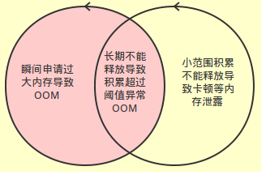
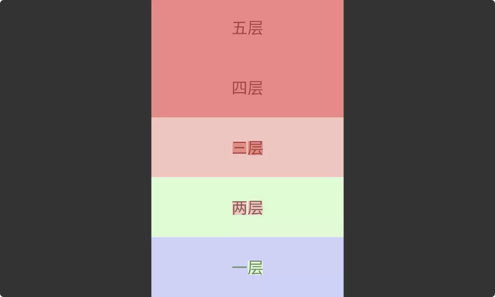
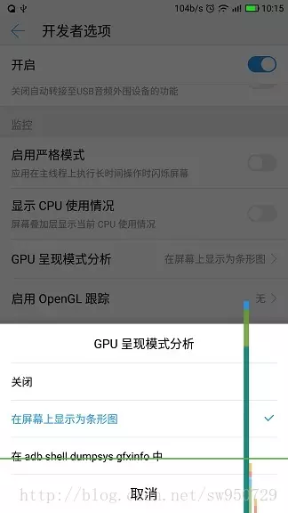
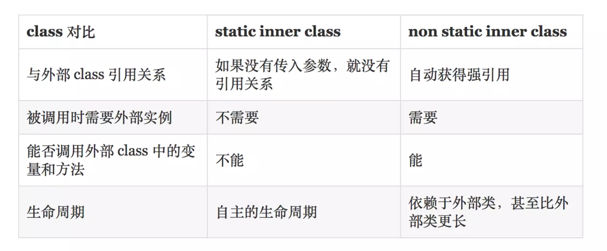

# 性能优化

　　性能优化有几个方面：

1. 内存优化

2. UI 优化（ 布局优化和绘制优化 ）
3. 速度的优化（ 线程优化和网络优化 ）
4. 电量优化
5. 启动优化

## 1. 内存优化
### 1.1 内存泄漏

　　内存泄漏：内存不在 GC 的掌控范围之内了。

　　java 的 GC 内存回收机制：某对象不再有任何引用的时候才会进行回收。

　　当向上寻找，一直寻找到 GC Root 的时候，此对象不会进行会回收；如果数据在整个页面或整个项目都没有引导，则这个对象会被 GC 掉。

**GC 的引用点**

1. Java 栈中引用的对象
2. 方法静态引用的对象
3. 方法常量引用的对象
4. Native 中 JNI 引用的对象
5. Thread -  " 活着的 " 线程

### 1.2. 内存溢出

**内存溢出的原因图**


　　内存泄漏一般导致应用卡顿，极端情况会导致项目 boom。Boom 的原因是因为超过内存的阈值。原因只要有两方面：

1. 代码存在泄漏，内存无法及时释放导致 oom。

2. 一些逻辑消耗了大量内存，无法及时释放或者超过导致 oom。

　　所谓消耗大量的内存的，绝大多数是因为图片加载。这是 oom 出现最频繁的地方。

#### 1.2.1. 如何查看内存溢出

1. 确定是否存在内存溢出的问题

　　方法有两种：

* Android -> SystemInformation -> Memory Usage 查看 Object 里面是否有没有被释放的 Views 和 Activity。
* 命令 `adb shell dumpsys meminfo 包名 -d`。

2. 通过看 Memory Montor 工具，检查动作，反复多次执行某一个操作，查看内存的大概变化情况。
3. 使用 Heap SnapShot 工具（堆栈快照）更仔细地查找泄漏的位置。

　　点击 -> 进行一段时间的监控，生成一个文件 -> package treeview 会出现一些信息，信息内容如下：

* Total count：内存中该类的对象个数
* Heap count：堆内存中该类的对象个数
* Size of：物理大小
* Shallow size：该对象本身占有内存大小
* Retained size：释放该对象后，节省的内存大小
* Depth：深度
* Shadow size：对象本身内存大小
* Domination size：管辖的内存大小

### 1.3. 内存分析工具

　　性能优化工具：
* Heap SnapShot 工具
* Head Views 工具
* LeakCanary 工具
* MAT 工具
* TraceView 工具（Device Monitor）

　　第三方文熙工具：

* Memory Analyzer
* GT Home
* iTest

### 1.4. 注意事项

* 长生命周期的对象使用 Application 的上下文，而不是 Activity 的上下文（Context）。
* Animation 会导致内存溢出。 view 显示动画时，View 会持有 Activity 对象，而动画持有 View，动画不 cancel 就会一直去执行 view 的 onDraw 方法，那么 Activity 就会被一直持有，不能被释放，导致内存泄漏。解决方法是在 Activity 的 onDestory() 方法中调用 Animation.cancle() 进行停止，也可以通过自定义 view 来代替动画。


## 2. UI 优化
　　UI 优化主要包括**布局优化**以及 **view 的绘制优化**。

　　一般会导致卡顿的情况：
1. 人为在 UI 线程中做轻微耗时操作，导致 UI 线程卡顿；
2. 布局 Layout 过于复杂，无法在 16 ms 内完成渲染；
3. 同一时间动画执行的次数过多，导致 CPU 或 GPU 负载过重；
4. View 过度绘制，导致某些像素在同一帧时间内被绘制多次，从而使 CPU 或 GPU 负载过重；
5. View 频繁的触发 measure、layout，导致 measure、layout 累计耗时过多及整个 View 频繁的重新渲染；
6. 内存频繁触发 GC 过多（同一帧中频繁创建内存），导致暂时阻塞渲染操作；
7. 冗余资源及逻辑等导致加载和执行缓慢；
8. ANR；

### 2.1. 布局优化

　　屏幕上的某个像素在同一帧的时间内被绘制了多次，在多层次的 UI 结构里面，如果不可见的 UI 也在做绘制的操作，这就会导致某些像素区域被绘制了多次，这就浪费了大量的 CPU 以及 GPU 资源。

#### 2.1.1. 关于布局优化的方法

1. 如果父控件有颜色，也有自己需要的颜色，那么就不必在子控件加背景颜色。
2. 如果每个子控件的颜色不太一样，而且可以完全覆盖父控件，那么就不需要在子控件上加背景颜色。
3. 尽量避免不必要的嵌套。
4. 能用 LinearLayout 和 FrameLayout，就不要用 RelativeLayout，因为 RelativeLayout 控件想对比较复杂，测试也相对耗时。

5. 使用 include 和 merge 增加复用，减少层级。

   针对嵌套布局，goognle 提出了 include、merge 和 ViewStub 。

   include 可以提高布局的复用性，大大方便开发，include 没有减少布局的嵌套，但是 include 和 merge 联手搭配，还是不错的。

   merge 的布局取决于父控件是哪个布局，使用 merge 相当于减少了自身的一层布局，直接采用父 include 的布局，当然直接在父布局里面使用意义不大，所以会和 include 配合使用，即增加了布局的复用性，也减少了一层布局嵌套。

6. ViewStub 按需加载，更加轻便。

   ViewStub 可以按需加载，在需要的时候 ViewStub 中的布局才加载到内存。对于一些进度条，提示信息等等少次数使用的功能，使用 ViewStub 很合适。

7. 复杂界面可选择 ConstraintLayout，可有效减少层级。

   ConstraintLayout 可以有效地解决布局嵌套过多的问题。ConstraintLayout 使用约束的方式来指定各个控件的位置和关系，有点类似于 RelativeLayout，但远比 RelativeLayout 要更强大。所以简单布局简单处理，复杂布局 ConstraintLayout 很好使。

### 2.2. 绘制优化

　　平时感觉的卡顿问题最主要的原因之一是因为渲染性能，因为越来越复杂的界面交互，其中可能添加了动画、图片等等。希望创造出越炫的交互界面，同时也希望可以流畅显示，但是往往卡顿就会发生在这里。

　　这个是 Android 的渲染机制造成的，Android 系统每隔 16ms 发出 VSYNC 信号，触发对 UI 进行渲染，但是渲染未必成功，如果成功了那么代表一切顺利，但是失败了可能就要延误时间，或者直接跳过去，给人视觉上的表现就是要么卡了一会，要么跳帧。

　　View 的绘制频率保证 60 fps 是最佳的，这就要求每帧绘制时间不超过 16ms ( 16ms = 1000 / 60 ) ，虽然程序很难保证 16 ms 这个时间，但是尽量降低 onDraw 方法中的复杂度总是切实有效的。

　　解决方法：
**第一点：**onDraw 方法中不要做耗时的任务，也不做过多的循环操作，特别是嵌套循环，虽然每次循环耗时很小，但是大量的循环势必霸占 CPU 的时间片，从而造成 View 的绘制过程不流畅。

**第二点：**除了循环之外，onDraw() 中不要创建新的布局对象，因为 onDraw() 方法一般都会频繁大量调用，就意味着会产生大量的临时对象，不仅占用内存，而且会导致系统更加频繁的 GC，大大降低程序的执行速度和效率。

#### 2.2.1 关于绘制优化的方法

1. onDraw 中不要创建新的布局对象。
2. onDraw 方法中不要做耗时的任务，少使用循环。

### 2.3. 检查 UI 优化的方法

#### 2.3.1. **调试过度绘制**

　　对于 UI 性能的优化可以通过开发者选项中的 GPU 过度绘制工具来进行分析。在设置 -> 开发者选项 -> 调试 GPU 过度绘制中打开调试。

　　开启后在我们想要调试的应用界面中可以看到各种颜色的区域：



　　具体含义如下：

| 颜色 | 含义 |
|--------|--------|
| 无色 | WebView 等的渲染区域 |
| 蓝色 | 1x 过度渲染 |
| 绿色 | 2x 过度渲染 |
| 淡红色 | 3x 过度渲染 |
| 红色 | 4x(+) 过度渲染 |

　　目标就是尽量减少红色 Overdraw，看到更多的蓝色区域。

#### 2.3.2. **查看每帧的渲染时长**

　　可以打开设置 -> 开发者选项 -> GPU 呈现模式分析 -> 在屏幕上显示为条形图。



　　随着界面的刷新，界面上会以实时柱状图来显示每帧的渲染时间，柱状图越高表示渲染时间越长，每个柱状图偏上都有一根表示 16 ms 基准的绿色横线，每一条竖着的柱状线都包含三部分（蓝色代表测量绘制 Display List 的时间，红色代表 OpenGL 渲染 Display List 所需要的时间，黄色代表 CPU 等待 GPU 处理的时间），只要每一帧的总时间低于基准线就不会发生 UI 卡顿问题（个别超出基准线其实也不算什么问题的）。

　　也可以在执行完 UI 滑动操作后在命令行输入如下命令查看命令行打印的 GPU 渲染数据：
```
	adb shell dumpsys gfxinfo [应用包名]
```

　　分析依据：Draw + Process + Execute = 完整的显示一帧时间 < 16ms。

## 3.内存优化

　　内存泄漏：程序不再使用的对象无法被 GC 识别，导致对象一直留在内存当中，占用了内存空间。

　　内存泄漏分为 4 种：

1. 集合类泄漏
2. 单例 / 静态变量造成的内存泄漏
3. 匿名内部类 / 非静态内部类
4. 资源未关闭造成的内存泄漏

### 3.1. 集合类泄漏

　　集合类（List 等）添加元素后，仍引用着集合元素对象，导致该集合中的元素对象无法被回收，从而导致内存泄漏。

　　**解决方法**：使用 clear 清理集合，并释放其引用（list = null）。

### 3.2. 单例 / 静态变量造成的内存泄漏

　　单例模式具有其静态特性，它的生命周期等于应用程序的生命周期，所以容易造成内存泄漏。

　　当一个生命周期长的对象持有了生命周期短的对象的引用，这就造成了内存泄漏。

　　Context 和 Toast 是容易出现内存泄漏的，如果生命周期长，可以使用 Application 的 Content。

　　**解决方法**：生命周期长的引用生命周期长的，不要引用生命周期短的。


### 3.3. 匿名内部类 / 非静态内部类



　　如果非静态内部类的生命周期长于外部类，再加上自动持有外部类的强引用，就会发生内存泄漏。解决方法就是改为静态内部类。

　　匿名内部类也会持有外部类的强引用，解决方法也是改为静态内部类。

　　静态持有非静态类的引用，就会导致内存泄漏，解决方法是使用弱引用。

　　引用分为强引用、软引用、弱引用、虚引用，强度依次递减。

* 强引用：不做特殊处理的一般都是强引用，如果一个对象具有强引用，GC 绝不会回收它。
* 软引用（SoftReference）：如果内存空间足够，GC 就不会回收它，如果内存空间不足了，就会回收这些对象的内存。
* 弱引用（WeakReference）：弱引用要比软引用更弱一个级别，内存不够回收，GC 的时候不管内存够不够也回收。不过 GC 是一个优先级很低的线程，所以也不会随便就被回收了。
* 虚引用

### 3.4. 资源未关闭造成的内存泄漏

　　资源为关系的情况有：

1. 网络、文件等流忘记关闭
2. 手动注册广播时，退出时忘记 unregisterReceiver()
3. Service 执行完后忘记 stopSelf()
4. EventBus 等观察者模式的框架忘记手动解除注册

　　检查内存泄漏的工具：1. leakcanary；2.Memory Monitor；3. Android Lint。

## 4. 启动优化
　　安卓应用的启动方式分为三种：冷启动（Cold start）、暖启动（Warm start）、热启动（Hot start）。不同的启动方式决定了应用 UI 对用户可见所需要花费的时间长短。冷启动消耗的时间最长，基于冷启动方式的优化工作也是最考验产品用户体验的地方。

### 4.1. 启动方式

#### 4.1.1. 冷启动

　　冷启动是指应用程序从头开始，系统没有获取到当前 app 的 activity、Service 等等。例如第一次启动 app 或者杀死进程后第一次启动。那么对比其他两种当时，冷启动是耗时最长的。

　　应用发生冷启动时，系统一定会执行下面的三个任务：
1. 开始加载并启动应用

2. 应用启动后，显示一个空白的启动窗口（启动闪屏页）

3. 创建应用程序进程

　　那么创建应用程序进程之后，开始创建应用程序对象：

4.  启动 UI 线程
5.  创建主 Activity
6.  加载布局
7.  屏幕布局
8.  执行初始化绘制

　　应用程序进程完成第一次绘制后，系统进程会交换当前显示的背景窗口，将其替换为主活动。此时，用户可以开始使用该应用进程，至此启动完成。

　　在冷启动过程中有两个 creation 工作，分别是 Application 和 Activity creation，它们均在 View 绘制展示之前。所以，在应用自定义的 Application 类和第一个 Activity 类中，onCreate() 方法做的事情越多，冷启动消耗的时间越长。

##### 4.1.1.1. Application 创建

　　当 Application 启动时，空白的启动窗口将保留在屏幕上，直到系统首次完成绘制应用程序。此时，系统进程会交换应用程序的启动窗口，允许用户开始与应用程序进行交互。（为什么程序启动时会出现一段时间的黑屏或白屏）。

　　如果有自己的 Application，系统会调用 Application 对象的 onCreate() 方法，之后，应用程序会生成主线程（UI 线程），病通过创建主要活动来执行任务。

##### 4.1.1.2 Activity 创建

　　应用程序进程创建 Actiivty 后，Activity 将执行以下操作：

1. 初始化值
2. 调用构造函数
3. 调用回调方法（例如 Activity.onCreate），对应 Activity 的当前生命周期状态。

　　通常，onCreate() 方法对加载时间的影响最大，因为它以最高的开销执行工作：加载和渲染视图以及初始化 Activity 运行所需的对象。 

#### 4.1.2. 暖启动

　　当应用中的 Activities 被销毁，但在内存中常驻时，应用的启动方式就会变为暖启动。相比冷启动，暖启动过程减少了对象初始化、布局加载等工作，启动时间更短。但启动时，系统依然会展示闪屏页，直到第一个 Activity 的内容呈现为止。

　　暖启动的场景有：

1. 用户退出应用，但随后重新启动它。该过程可能已继续运行，但应用程序必须通过调用从头开始重新创建 Activity 的 onCreate()。
2. 系统将您的应用程序从内存中逐出，然后用户重新启动它。需要重新启动进程和活动，但是在调用 onCreate() 的时候可以从 Bundle(savedInstanceState) 获取数据。

#### 4.1.3. 热启动

　　相比暖启动，热启动时应用做的工作更少，启动时间更短。在一个热启动中，系统会把你的 Activity 带到前台，如果应用程序的 Activity 仍然驻留在内存中，那么引用程序可以避免重复对象初始化、布局加载和渲染。产生热启动的场景有：用户使用返回键退出应用，然后马上又重新启动应用。

　　热启动和冷启动一样系统进程显示空白屏幕，直到应用程序完成呈现活动。

### 4.2. 如何优化

　　可以在进入主页时添加闪屏页，倒计时显示闪屏页。在闪屏页显示的时候进行一些必要的加载，例如用户信息、定位等等。在倒计时结束后关闭闪屏页进入首页。

　　另外，在启动的 Application 和 首页 Activity 要减少耗时操作：
1. 主线程中涉及到 Shareperference 能否在非 UI 线程执行。

2. Application 的创建过程中尽量少的进行耗时操作。

3. 减少布局的层次，并且生命周期回调的方法中尽量减少耗时的操作。


## 4. 网络优化

　　可以通过 Memory 下面的 Net 进行网络的监听。

### 4.1.线程优化

　　大多数就是因为线程阻塞导致的 ANR。

　　ANR：application not responding，应用程序无响应。

　　ANR 出现的时机：

1. activity 如果在 5s 内无响应事件（屏幕触摸事件或者键盘输入事件）；
2. BroadcastReceiver 如果在 10s 内无法处理完成；
3. Service 如果在 20s 内无法处理完成。

　　Android 系统提供了一些工具类来解决此问题：

* Asynctask：为 UI 线程与工作线程之间进行快速处理的切换提供一种简单边界的机制。适用于当下立即需要启动，但是异步执行的生命周期短暂的场景。
* HandlerThread：为某些回调方法或者等待某些执行任务设置一个专属的线程，并提供线程任务的调度机制。
* ThreadPool：把任务分解成不同的单元，分发到各个不同的线程上，进行同时并发处理。
* IntentService：适合执行由 UI 触发的后台任务。并可以把这些任务执行的情况进行一定的机制反馈给 UI。

　　一般多线程的情况可以通过 Asynctask 处理，也可以使用 annotation。

### 4.2. 网络优化

　　网络优化的重点：时间、速度和成功率。

#### 4.2.1. 图片优化

1. 使用 WebP 格式。同样的图片，采用 WebP 格式可大幅节省流量，相对于 JPG 格式的图片，流量能节省将近 25% 到 35%；相对于 PNG 格式的图片，流量可以节省将近 80%。最重要的是使用 WebP 之后图片质量也没有改变。

2. 使用缩略图。可以控制 inside 和 option，进行图片缩放。

#### 4.2.2. 网络请求处理的优化

1. 对服务器返回数据进行缓存，设定有效时间，有效时间之内不走网络请求，读取缓存显示，从而减少流量消耗。可以使用 HttpResponseCache 进行数据缓存。
2. 尽量少使用 GPS 定位，如果条件允许，尽可能使用网络定位。
3. 下载和上传尽可能使用断点。
4. 刷新数据时，尽可能使用局部刷新，而不是全局刷新。第一、界面会闪屏一下，网差的时候界面可能会直接白屏一段时间；第二，节省流量。


## 5. 电量优化

### 5.1. 电量优化

　　关于电量优化的建议：
1. 需要进行网络请求时，首先判断网络当前的状态。

2. 在多网络请求的情况下，最好进行批量处理，尽量避免频繁的间隔网络请求。

3. 在同时有 wifi 和移动数据的情况下，应该直接屏蔽移动数据的网络请求，只有当 wifi 断开时再调用，因为 wifi 请求的耗电量远比移动数据的耗电量低的低。

* 后台任务要尽可能少的唤醒 CPU。

## 7. 其他优化

### 7.1. 查看代码缺陷和无用资源

　　Android Studio 有自带的代码检查工具。打开 Analyze -> Run Inspection by Name... -> unused resource 点击开始检测。

　　也可以将鼠标放在代码区点击右键 -> Analyze -> Inspect Code -> 界面选择你要检测的模块 ->点击确认开始检测。

　　上面的方法是最容易找到代码缺陷以及无用代码的地方。


## 7. 参考文章

[Android 性能优化全方面解析](https://juejin.im/post/5a0d30e151882546d71ee49e)
[Android 性能优化最佳实践](https://juejin.im/post/5b50b017f265da0f7b2f649c)