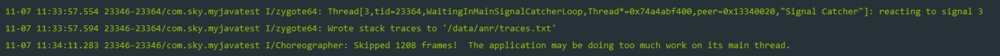

# ANR 解析

## 什么是 ANR
　　ANR 全称是 Application Not Responding，意思就是应用程序未响应。如果一个应用无法响应用户的输入，系统就会弹出一个 ANR 对话框，用户可以自行选择继续等待或者是停止当前程序。

#### 原因
　　Andriod 系统中，ActivityManangerService(简称 AMS) 和 WindowManangerService(简称 WMS) 会检测 App 的响应事件，如果 App 在特定时间无法响应屏幕触摸或键盘输入事件，或者特定事件没有处理完毕，就会出现 ANR。

　　以下四个条件都可以造成 ANR 发生：
* InputDispatching Timeout：5 秒内无法响应屏幕触摸事件或键盘输入事件；
* BroadcastQueue Timeout：在执行前台广播（BroadcastReceiver）的 onReceiver() 函数时 10 秒没有处理完成，后台为 60 秒。
* Service Timeout：前台服务 20 秒内，后台服务在 200 秒内没有执行完毕。
* ContentProvider Timeout：ContentProvider 的 publish 在 10s 内没有进行完。

## 出现场景
* 主线程被 IO 操作（从 4.0 之后网络 IO 不允许在主线程中）阻塞。
* 主线程中存在耗时的计算
* 主线程中错误的操作，比如 Thread.wait 或者 Thread.sleep 等。

　　Android 系统会监控程序的响应状况，一旦出现下面两种情况，则弹出 ANR 对话框：
* 应用在 5 秒内未响应用户的输入事件（如按键或者触摸）
* BroadcastReceiver 未在 10 秒内完成相关的处理

## 如何避免
　　基本的思路就是尽量避免在主线程（UI 线程）中作耗时操作，将耗时操作放在子线程中。将 IO 操作在工作线程来处理，减少其他耗时操作和错误操作。
* 使用 AsyncTask 处理耗时 IO 操作。
* 使用 Thread 或者 HandlerThread 时，调用 Process.setThreadPriority(Process.THREAD_PRIORITY_BACKGROUND)设置优先级，否则仍然会降低程序响应，因为默认 Thread 的优先级和主线程相同。
* 使用 Handler 处理工作线程结果，而不是使用 Thread.wait() 或者 Thread.sleep() 来阻塞主线程。
* Activity 的 onCreate 和 onResume 回调中尽量避免耗时的代码。
* BroadcastReceiver 中的 onReceive 代码也要尽量减少耗时，建议使用 Intentservice 处理。

## 画龙点睛
　　通常 100 到 200 毫秒就会让任察觉程序反应慢，为了更加提升响应，可以使用下面的几种方法：
* 如果程序正在后台处理用户的输入，建议使用让用户得知进度，比如使用 ProgressBar 控件。
* 程序启动时可以选择加上欢迎界面，避免让用户察觉卡顿。
* 使用 Systrace 和 TraceView 找到影响响应的问题。

## 如何定位
　　如果开发机器上出现问题，可以通过查看 /data/anr/traces.txt 即可，最新的 ANR 信息在最开始部分。

　　如果是线上版本引起的，Google Play 后台有相关的数据可以帮助查看分析并解决问题。

## ANR 分析方法

#### ANR 分析方法一：Log

　　可以看到 logcat 清晰地记录了 ANR 发生的时间，以及线程的 tid 和一句话概括原因：WaitingInMainSignalCatcherLoop，大概意思为主线程等待异常。

　　最后一句 The application may be doing too much work on its main thread. 告知可能在主线程做了太多的工作。

#### ANR 分析方法二：traces.txt
　　上面的 log 有第二句 Wrote stack trances to '/data/anr/trances.txt'，说明 ANR 异常已经输出到 trances.txt 文件，使用 adb 命令把这个文件从手机里导出来：

1. 进入 adb.exe 所在的目录，也就是 Android SDK 的 platform-tools 目录：
```
cd D:\Android\AndroidSdk\platform-tools
```

2. 到指定目录后执行以下 adb 命令导出 trances.txt 文件：
```
adb pull /data/anr/trances.txt
```
　　traces.txt 默认会被导出到 Android SDK 的 \platform-tools 目录。一般来说 traces.txt 文件记录的东西会比较多，分析的时候需要有针对性地去找相关记录。
```
----- pid 23346 at 2017-11-07 11:33:57 -----  ----> 进程id和ANR产生时间
Cmd line: com.sky.myjavatest
Build fingerprint: 'google/marlin/marlin:8.0.0/OPR3.170623.007/4286350:user/release-keys'
ABI: 'arm64'
Build type: optimized
Zygote loaded classes=4681 post zygote classes=106
Intern table: 42675 strong; 137 weak
JNI: CheckJNI is on; globals=526 (plus 22 weak)
Libraries: /system/lib64/libandroid.so /system/lib64/libcompiler_rt.so
/system/lib64/libjavacrypto.so
/system/lib64/libjnigraphics.so /system/lib64/libmedia_jni.so /system/lib64/libsoundpool.so
/system/lib64/libwebviewchromium_loader.so libjavacore.so libopenjdk.so (9)
Heap: 22% free, 1478KB/1896KB; 21881 objects    ----> 内存使用情况
...
"main" prio=5 tid=1 Sleeping    ----> 原因为Sleeping
  | group="main" sCount=1 dsCount=0 flags=1 obj=0x733d0670 self=0x74a4abea00
  | sysTid=23346 nice=-10 cgrp=default sched=0/0 handle=0x74a91ab9b0
  | state=S schedstat=( 391462128 82838177 354 ) utm=33 stm=4 core=3 HZ=100
  | stack=0x7fe6fac000-0x7fe6fae000 stackSize=8MB
  | held mutexes=
  at java.lang.Thread.sleep(Native method)
  - sleeping on <0x053fd2c2> (a java.lang.Object)
  at java.lang.Thread.sleep(Thread.java:373)
  - locked <0x053fd2c2> (a java.lang.Object)
  at java.lang.Thread.sleep(Thread.java:314)
  at android.os.SystemClock.sleep(SystemClock.java:122)
  at com.sky.myjavatest.ANRTestActivity.onCreate(ANRTestActivity.java:20) ----> 产生ANR的包名以及具体行数
  at android.app.Activity.performCreate(Activity.java:6975)
  at android.app.Instrumentation.callActivityOnCreate(Instrumentation.java:1213)
  at android.app.ActivityThread.performLaunchActivity(ActivityThread.java:2770)
  at android.app.ActivityThread.handleLaunchActivity(ActivityThread.java:2892)
  at android.app.ActivityThread.-wrap11(ActivityThread.java:-1)
  at android.app.ActivityThread$H.handleMessage(ActivityThread.java:1593)
  at android.os.Handler.dispatchMessage(Handler.java:105)
  at android.os.Looper.loop(Looper.java:164)
  at android.app.ActivityThread.main(ActivityThread.java:6541)
  at java.lang.reflect.Method.invoke(Native method)
  at com.android.internal.os.Zygote$MethodAndArgsCaller.run(Zygote.java:240)
  at com.android.internal.os.ZygoteInit.main(ZygoteInit.java:767)
```
　　在文件中使用 ctrl + F 查找包名可以快速定位相关代码。

　　通过上方 log 可以看出相关问题：

* 进程 id 和包名：pid 23346 com.sky.myjavatest
* 造成 ANR 的原因：Sleeping
* 造成 ANR 的具体行数：ANRTestActivity.java:20 类的第 20 行

*注意：*产生新的 ANR，原来的 traces.txt 文件会被覆盖。

#### ANR 分析方法三：Java 线程调用分析
　　通过 JDK 提供的命令可以帮助分析和调试 Java 应用，命令是：
```
jstack {pid}
```
　　其中 pid 可以通过 jps 命令获得，jps 命令会列出当前系统中运行的所有 Java 虚拟机进程，比如：
```
7266 Test
7267 Jps
```

#### ANR 分析方法四：DDMS 分析 ANR 问题
* 使用 DDMS-----Update Threads 工具
* 阅读 Update Threads 的输出

## 造成 ANR 的原因及解决方法
　　造成 ANR 的原因有很多：
* 主线程阻塞或主线程数据读取
> 解决方法：避免死锁的出现，使用子线程来处理耗时操作或阻塞任务。尽量避免在主线程 query provider、不要滥用 SharePreferences。

* CPU 满负荷、I/O 阻塞
> 解决方法：文件读写或数据库操作放在子线程异步处理。

* 内存不足
> 解决方法：AndroidManifest.xml 文件 < application > 中可以设置 android:largeHeap="true"，以此增大 App 使用内存。不过不建议使用此法，从根本上防止内存泄漏，优化内存使用才是正确的做法。

* 各大组件 ANR
> 各大组件声明周期中也应避免耗时操作，注意 BroadcastReceiver 的 onReceive()、后台 Service 和 ContentProvider 也不要执行太长时间的任务。

## ANR 源码分析

#### Service 造成的 Service Timeout
　　Service Timeout 是位于“ActivityMananger”线程中的 AMS.MainHandler 收到 SERVICE_TIMEOUT_MSG 消息时触发。

##### 发送延时消息
　　Service 进程 attach 到 system_server 进程的过程中会调用 realStartServiceLocked ，紧接着 mAm.mHandler.sendMessageAtTime() 来发送一个延时消息，延时的时长是定义好的，如前台 Service 的 20 秒。ActivityMananger 线程中的 AMS.MainHandler 收到 SERVICE_TIMEOUT_MAG 消息时会触发。

　　ActiveServices.realStartServiceLocked
```
    private final void realStartServiceLocked(ServiceRecord r,
            ProcessRecord app, boolean execInFg) throws RemoteException {
		...
		//发送deply 消息（SERVICE_TIMEOUT_MSG）
		bumpServiceExecutingLocked(r, execInFg, "create");
        try {
			...
			//最终执行服务的 onCreate() 方法
            app.thread.scheduleCreateService(r, r.serviceInfo,
                    mAm.compatibilityInfoForPackageLocked(r.serviceInfo.applicationInfo),
                    app.repProcState);
			...
        } catch (DeadObjectException e) {
            Slog.w(TAG, "Application dead when creating service " + r);
            mAm.appDiedLocked(app);
            throw e;
        } finally {
			...
		}
	}
```


## 参考文章
[说说 Android 中的 ANR](https://droidyue.com/blog/2015/07/18/anr-in-android/)
[Android ANR：原理分析及解决办法](https://www.jianshu.com/p/388166988cef)
[Android性能优化（七）之你真的理解ANR吗？](https://juejin.im/post/58e5bd6dda2f60005fea525c)

