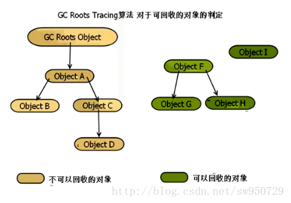

# 性能优化

　　性能优化有几个方面：一、内存优化；二、UI 优化（布局优化和绘制优化）；三、速度的优化（线程优化/网络优化）；四、电量优化；五、启动优化。

## 内存优化
　　什么是内存泄漏？内存不在 GC 的掌控范围之内了。那么 java 的 GC 内存回收机制是什么？某对象不再有任何引用的时候才会进行回收。

　　当向上寻找，一直寻找到 GC Root 的时候，此对象不会进行会回收；如果数据在整个页面或整个项目都没有引导，则这个对象会被 GC 掉。

#### GC 的引用点
1. Java 栈中引用的对象
2. 方法静态引用的对象
3. 方法常量引用的对象
4. Native 中 JNI 引用的对象
5. Thread - "活着的"线程

#### 内存溢出

###### 分析原因

　　内存泄漏一般导致应用卡顿，极端情况会导致项目 boom。Boom 的原因是因为超过内存的阈值。原因只要有两方面：
* 代码存在泄漏，内存无法及时释放导致 oom。
* 一些逻辑消耗了大量内存，无法及时释放或者超过导致 oom。

　　所谓消耗大量的内存的，绝大多数是因为图片加载。这是 oom 出现最频繁的地方。

#### 内存分析工具
　　性能优化工具：
* Heap SnapShot 工具
* Head Views 工具
* LeakCanary 工具
* MAT 工具
* TraceView 工具（Device Monitor）

#### 注意事项
* 尽量不要使用 Activity 的上下文，而是使用 application 的上下文，因为 application 的生命周期长，进程退出时才会被销毁。所以，单例模式是最容易造成内存泄漏的根本所在，因为单例模式的生命周期应该和 application 的生命周期一样长，而不是和 Activity 的相同。
* Animation 也会导致内存溢出，因为当使用 view 显示动画时，导致 view 被 Activity 持有，而 Activity 又持有 view。最后因为 Activity 无法释放，导致内存泄漏。解决方法是在 Activity 的 onDestory() 方法中调用 Animation.cancle() 进行停职，当然一些简单的动画可以通过自定义 view 来解决。

## UI 优化
　　UI 优化主要包括布局优化以及 view 的绘制优化。

　　什么情况会导致卡顿？一般是如下几种情况：
1. 人为在 UI 线程中做轻微耗时操作，导致 UI 线程卡顿；
2. 布局 Layout 过于复杂，无法在 16 ms 内完成渲染；
3. 同一时间动画执行的次数过多，导致 CPU 或 GPU 负载过重；
4. View 过度绘制，导致某些像素在同一帧时间内被绘制多次，从而使 COU 或 GPU 负载过重；
5. View 频繁的触发 measure、layout，导致 measure、layout 累计耗时过多及整个 View 频繁的重新渲染；
6. 内存频繁触发 GC 过多（同一帧中频繁创建内存），导致暂时阻塞渲染操作；
7. 冗余资源及逻辑等导致加载和执行缓慢；
8. ANR；

#### 布局优化

###### GPU 绘制
　　对于 UI 性能的优化可以通过开发者选项中的 GPU 过度绘制工具来进行分析。在设置 -> 开发者选项 -> 调试 GPU 过度绘制中打开调试。

　　开启后在我们想要调试的应用界面中可以看到各种颜色的区域，具体含义如下：

| 颜色 | 含义 |
|--------|--------|
| 无色 | WebView 等的渲染区域 |
| 蓝色 | 1x 过度渲染 |
| 绿色 | 2x 过度渲染 |
| 淡红色 | 3x 过度渲染 |
| 红色 | 4x(+) 过度渲染 |

　目标就是尽量减少红色 Overdraw，看到更多的蓝色区域。

## 参考文章
[Android性能优化全方面解析](https://juejin.im/post/5a0d30e151882546d71ee49e)
[Android 性能优化最佳实践](https://juejin.im/post/5b50b017f265da0f7b2f649c)
[Android 性能优化必知必会(2018-5-8日更新)](https://zhuanlan.zhihu.com/p/30691789)
