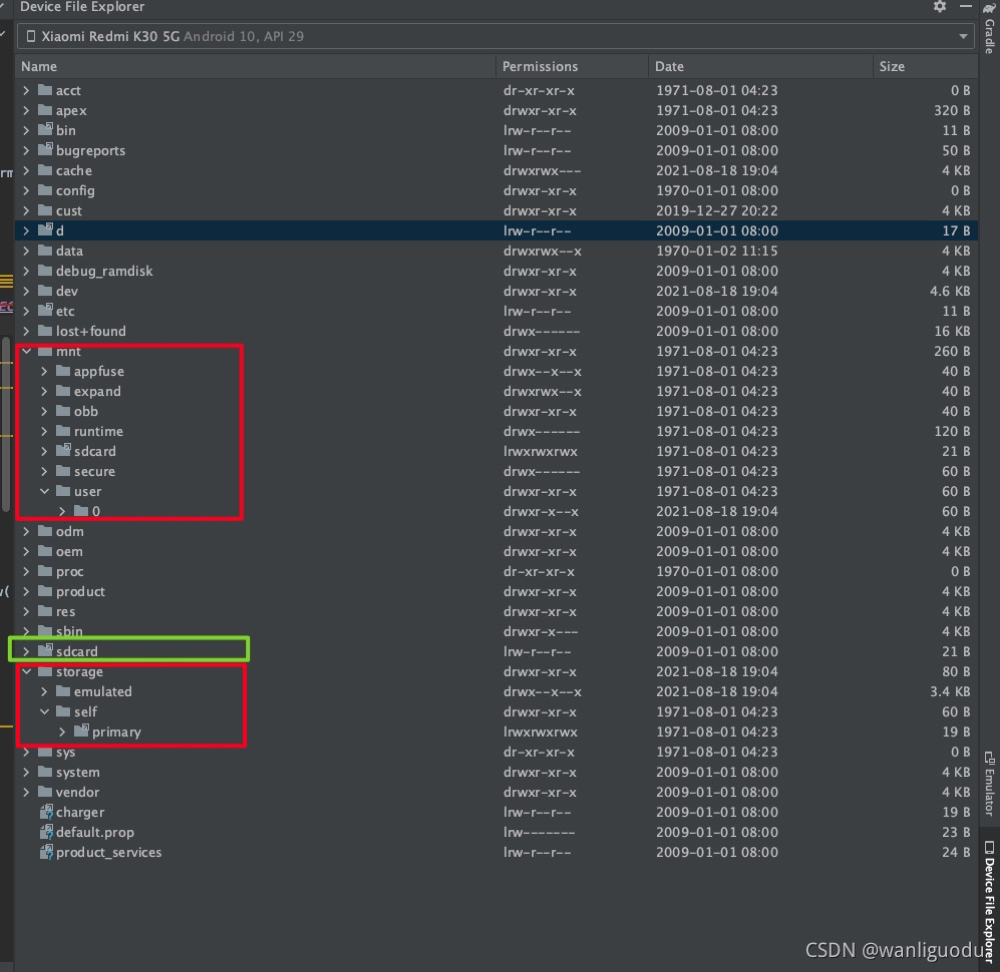
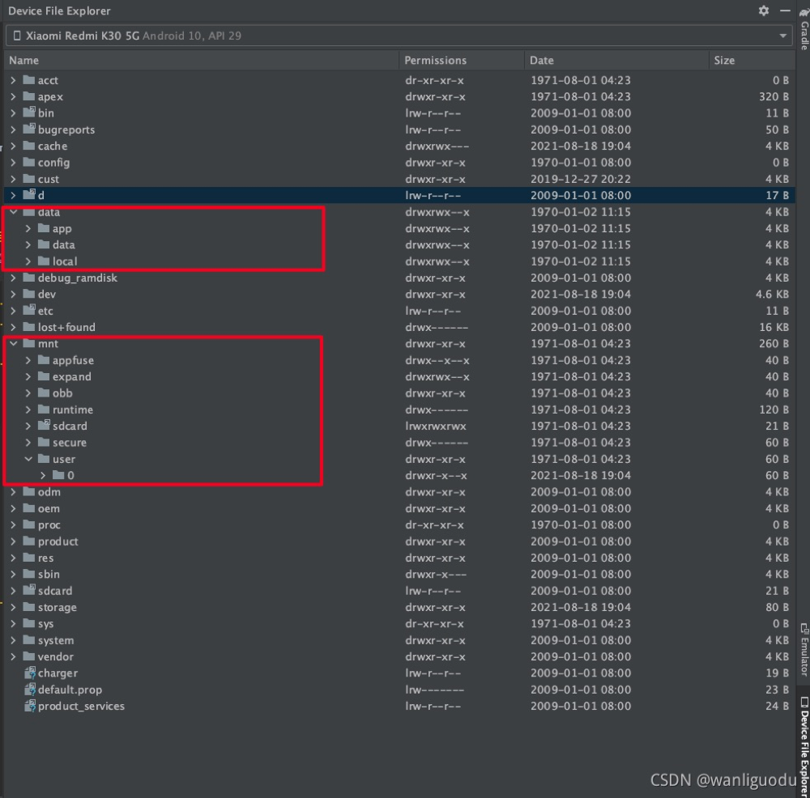
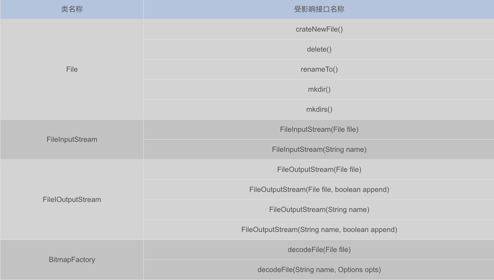
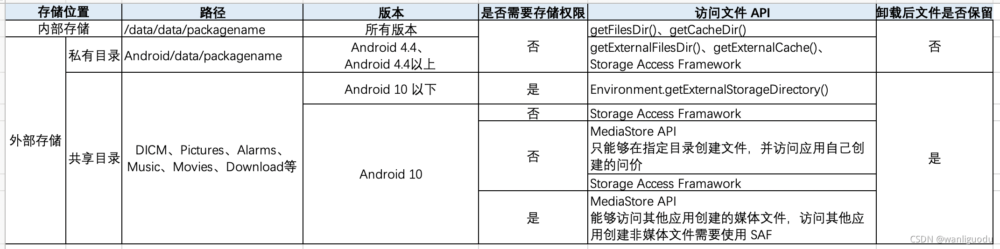

# 安卓存储空间

## Android 存储目录

Android 存储分为内部存储（Internal storage）和外部存储（External storage）。那么这个内外是怎么区分的呢？

Android 长久以来都是支持外置存储空间这个功能的，也就是我们常说的 SD 存储卡。现在部分双卡手机也是支持扩展 micro SD 存储卡，也有一部分手机已经取消支持扩展功能了。现在的手机一般都会自带一个机身存储，这个机身存储和 SD 存储卡的功能是完全一样的，都是通过 Linux 文件挂载的方式将这些存储空间挂载系统上，机身自带的存储会比 SD 存储卡更快更安全。
所以我们谈论的 Android 的内部和外部存储都是是否通过挂载的方式将额外的存储空间挂载到系统中。一般机身自带的存储挂载点都在 /mnt/user/0/primary，一般 SD 卡挂载点 /storage/sdcard1，根据设备的不同，则可能不同。
如果使用 Android Studio 使用 Device File Explorer 打开正在链接的手机(Xiaomi Redmi K30)文件系统，在根目录里可以看到 /sdcard、/mnt/sdcard、/storage/self/primary 里面的内容都是一样的：



仔细看图标右上角有个三角符合，鼠标放到上面可以显示一个文件路径，带这些符号的都是一个软连接，最后这个软连接都指向 `/mnt/user/0/primary` ，也就是机身自带存储的挂载点。不同的手机部分目录有可能不同。

所以，所说的 Android 内外存储本质就是数据放置在 `/data/data/`和 `/mnt/user/0/primary`的区别：



因此，下面的内部存储和外部存储就可以很好的理解了。

### 内部存储

内部存储就是指的是 App 私有的目录，如： /data/data/packagename/
有些手机的目录是 /data/user/0/com.application.id/
实际上是同一个目录，/data/user/0 目录是一个软连接，其实际指向的目录即 /data/data
内部存储的目录会随着 APP 卸载而被删除。

Android 系统自带的一块存储区域，会给每个应用程序分配一个空间目录，它一般不会很大，可供应用存储少量的文件。内部存储空间始终是可用的，因此在存储应用所依赖的数据时更为可靠，而且应用程序本身也通常是存放在内部存储空间。应用使用此存储区域，不需要额外申请权限，并且该区域内的文件只有本应用可以访问。

在应用中要获取内部存储空间，需要用到 Context 上下文对应的API：

```java
context.getFilesDir()
```

文件的位置是在：

```
/data/data/packageName/files     //packageName是应用的包名
```

或者

```java
/data/user/0/packageName/files   //packageName是应用的包名
```

实际上两者指向同一个地方，后者只是 linked 到前者的位置。
需要注意的是，此位置的数据，在应用卸载之后，会被自动清除。

### 外部存储

外部存储包括外部私有存储和外部公共存储，这些数据都是存储在挂载上的空间上的。

在 Android4.4 之前，外部存储就是指 SD 卡，不过在 Android4.4 之后，随着手机自身携带的存储空间越来越大，手机自身的存储空间也成了外部存储空间。也就是说，目前大部分手机自带的存储，一小部分划分为了 Android 系统的内部存储空间，大部分被划分为了外部存储空间。

在访问外部存储空间的时候，需要先判断一下磁盘的挂载情况：

```java
String StorageState = Environment.getExternalStorageState();     //外部存储的挂载状态
//如果返回的状态是mounted，那么表示是可用的。
```

外部存储又分为**外部私有存储（应用专属空间）**和**外部公共存储（公共空间）**。

#### 外部私有存储

外部私有存储是指 /storage/emulated/0/Android/data/packagename
在外部私有存储中，APP 可以读取自己目录下的文件，如果 Api 大于 19 ，不需要申请写权限。如果需要读取其他 APP 的外部私有存储目录，则需要声明读写权限，若高于23，还需要动态进行权限申请。
外部私有存储的目录会随着 APP 卸载而被删除。

外部存储的应用专属空间，是指在外部存储空间会为每个应用程序开辟一个目录空间，用来存储较大的文件，是应用所独有的。在应用卸载之后，会被自动清除。
在程序中要获取外部存储的应用专属空间，需要用到 Context 上下文对应的 API：

```java
context.getExternalFilesDir(null);
```

目录空间的位置是：

```java
/storage/emulated/0/Android/data/com.example.demotest/files
```

或者是：

```
/mnt/sdcard/Android/data/com.example.demotest/files
```

实际上都是指向的同一个位置。

#### 外部公共存储

外部存储是指 sdcard 中根目录中的公共目录，即 /storage/emulated/0，例如，图片文件夹：/storage/emulated/0/DCIM 和下载文件夹：/storage/emulated/0/Download
这部分的目录是共享的，所以如果 APP 在这个目录下读写文件，需要申请读写权限，并且在 App 卸载后不会被删除。

外部存储的公共空间，需要申请外部存储读写权限 READ_EXTERNAL_STORAGE 和WRITE_EXTERNAL_STORAGE。应用在该存储空间存放的文件，也可以被其他应用所读取，并且即便是应用卸载了，该文件也不会被清除掉。
在程序中要获取外部存储的公共空间，需要用到 Environment 对应的API：

```java
Environment.getExternalStorageDirectory(); //外部存储公共目录
```

对应的路径为：

```
/storage/emulated/0
```

可以看到，外部存储的应用专属空间是整个外部空间的一个子目录，或者说除了专属存储空间以外的其他空间就是公共存储空间。

### 使用 Api 获取存储目录


只有使用外部公共存储的时候需要读写权限

* 写入权限 android.Manifest.permission#WRITE_EXTERNAL_STORAGE
* 读取权限 android.Manifest.permission#READ_EXTERNAL_STORAGE

## 安卓存储结构


- /data/data/

  apk的安装目录。 如：百度地图的安装路径是/data/data/com.baidu.com/ 注意：该目录需要获取 root 权限才能查看。

- /system/

  存放系统应用的 apk 文件，即手机厂商预安装应用的 apk 文件 （手机厂商只需把需要预安装的 apk 放在该节点的相应路径下，android 系统就会自己解压并安装该 apk）。

- /storage/

  该节点是内置存储卡和外置 SD 卡的挂载点，/storage/emulated/0/ 是内置存储卡挂载点， /storage/sdcard1 是外置 SD 卡挂载点（不同的设备挂载节点不一样，有些设备可能会挂载到 /mnt/ 节点）。

代码：

```java
//这个方法在 API30 下已经被废弃了
val dir = Environment.getExternalStorageDirectory()
```

谷歌官方给这个方法的注释（部分）：

> 这个方法返回主共享/外部存储目录。如果该目录已由用户安装在其计算机上、已从设备中删除或发生了其他一些问题，则当前可能无法访问该目录。您可以使用 getExternalStorageState() 确定其当前状态。
> 注意：不要被这里的“外部”一词混淆。这个目录最好被认为是**媒体/共享存储**。它是一个文件系统，可以保存相对大量的数据，并在所有应用程序之间共享（不强制执行权限）。传统上这是一个 SD 卡，但**它也可以作为设备中的内置存储实现**，该设备与受保护的内部存储不同，可以作为文件系统安装在计算机上。

就是说，外部存储空间作为一个文件系统，被实现在内置存储设备中。

同时，安卓鼓励的是应用运行时重要必须的数据放在内部存储中，而在外部存储空间去进行大文件的存放和共享。

上面提到了内置存储卡，它被视为外部存储空间, 所以如果尝试打印相关信息：

```java
// 被废弃了，但是依然可以打印出来，在开发中不推荐用
Log.d("外部存储根目录", "${Environment.getExternalStorageDirectory()}")
```

显示的是 ：**外部存储根目录: /storage/emulated/0**

则明确了外部存储的根目录是内置存储卡, 可以理解为烧在主板上的一个硬盘。

## 应用专属存储

### 内部存储空间

可以在内部存储空间给应用创建目录或者文件。

这些目录既包括用于存储持久性文件的专属位置，也包括用于存储缓存数据的其他位置。系统会阻止其他应用访问这些位置，并且在 Android 10（API 级别 29）及更高版本中，系统会对这些位置进行加密。这些特征使得这些位置非常适合存储只有应用本身才能访问的敏感数据。 ——Google

内部存储空间中的根目录为 /data，下面讨论在内部存储空间中的用户专属存储。

在 context 中可以直接调出已经封装好了的用户专属存储的目录：

```java
Log.d("本地文件目录", "${this.filesDir}")
Log.d("本地数据目录", "${this.dataDir}")
Log.d("本地缓存目录","${this.cacheDir}")
```

显示内容：

**本地文件目录: /data/user/0/com.example.myapplication/files
本地数据目录: /data/user/0/com.example.myapplication
本地缓存目录: /data/user/0/com.example.myapplication/cache**

这些目录可以直接利用来进行创建目录，文件来存取数据，而不需要申请权限。

### 外部存储空间

现在的新手机基本采用的是内置存储卡，虽然在用户的角度上看不出内部存储空间和内部存储卡的区别（用户只知道容量为128G），但开发者还是应该有意的把大文件存储在外部存储空间上。

可以在外部存储空间上，开设应用私有的存储空间。虽然写在了外部存储空间上，应用被卸载时，这些内容还是会被系统移除。

要把什么内容存在上面呢？把一些私有的媒体文件存储在上面合适，避开 MediaStore 的扫描，让其他的应用无法获取。

通过context可以直接获取到外部存储空间的目录:

```java
Log.d("外部存储文件目录", "${this.getExternalFilesDir("MUSIC")}")
```

显示内容为：**外部存储文件目录: /storage/emulated/0/Android/data/com.example.myapplication/files/MUSIC**

这样创建的音乐目录，MediaStore无法扫描，在安卓10，安卓11下，其他应用也无法直接访问到这个位置，它是安全的。

但发现可以获取一个外部的媒体目录（具体做什么现在还不清楚），但可以被MediaStore扫描到：

```java
Log.d("外部存储文件目录", this.externalMediaDirs.get(0).absolutePath)
```

显示内容：**外部存储文件目录: /storage/emulated/0/Android/media/com.example.myapplication**

所以私有媒体内容不应该存入这个文件夹，它很可能被共享。

## 共享空间

这里的共享是针对应用而言的，例如相册就是一个典型的共享空间，应用都可以去访问相册

Android 提供用于存储和访问以下类型的可共享数据的 API：

- **媒体内容**：系统提供标准的公共目录来存储这些类型的文件，这样用户就可以将所有照片保存在一个公共位置，将所有音乐和音频文件保存在另一个公共位置，依此类推。您的应用可以使用此平台的 [`MediaStore`](https://developer.android.google.cn/reference/android/provider/MediaStore?hl=zh-cn) API 访问此内容。
- **文档和其他文件**：系统有一个特殊目录，用于包含其他文件类型，例如 PDF 文档和采用 EPUB 格式的图书。您的应用可以使用此平台的存储访问框架访问这些文件。

### 媒体内容

Mediastore是什么呢，官方称为:经过优化的媒体集合索引。

可以把它理解为一个数据库，它的查询方式和SQL数据库查询很类似。

注意的是，在安卓10之后，要添加媒体文件都要先生成Uri。

### 文档和其他文件

文档和其他特殊文件的操作流程大致为:

系统把文档提供器封装为了一个Activity，通过启动回调的方式来选择文档和处理文档。

## 分区存储

在过去，即**API<29**时，如果去访问外部存储，都需要申请权限，无论是访问媒体库，还是访问自己应用专属分区文件，在早一点的版本，还可以去访问其他应用创建的文件。

为了让用户更好的管理文件，减少混乱，加强安全等级, 分区存储从 API29 开始提出，API30 开始，强制进行分区存储。

分区存储不允许应用去读取其他应用的存储空间，不允许随意读取共享空间（限制了共享的范围），同时访问媒体库和应用在外部存储上的专属空间时，不再需要申请权限。

列出分区存储中的一些规则：

- 应用访问自己的应用目录不受限制 **无需任何权限**
- 应用向媒体集合下载目录提供文件，如果您要想保存图片、视频、音频、文档，**无需任何权限**
- 不再提供宽泛的共享存储, 读写存储权限只能访问提供的媒体集 ( `图片集`、`视频集`、`音频集`， `下载集` )
- 位置元数据限制，获取图片上的位置等信息需要请求权限，如果不请求权限，读取图片的信息的时候，位置元数据将会被删除
- 读取 **PDF** 或**其他类型**的文件，需要调用**系统的文件选择器** ( `Storage Access Framerwork API` )
- 在媒体集或应用目录之外，写任何文件都需要**系统的文件选择器** , 这样用户能选择并确认将文件存在哪里。

实际操作时，可以概括为以下两点：

- 特定于应用的目录中的文件（使用 `getExternalFilesDir()` 访问，上述例子给出）。
- 应用创建的照片、视频和音频片段（通过媒体库访问）, 尽可能的使用**MediaStore**去操作。

## Android 10 分区存储机制

### 原则

分区存储遵循以下三个原则对外部存储文件访问方式重新设计，便于用户更好的管理外部存储文件。

1. 文件更好的归属：系统记录文件由哪个应用创建，应用不需要存储权限即可以访问应用自己创建文件。
2. 应用数据保护：添加外部存储应用私有目录文件访问限制，应用即使申请了存储权限也不能访问其他应用外部存储私有目录文件。
3. 用户数据保护：添加 pdf、office、doc 等非媒体、图片和音频文件的访问限制，用户即使申请了存储权限也不能访问其他应用创建的 pdf、office、doc 等文件。

### 分区存储概览

分区存储就是对外部存储进行重新设计，简单来说，对**外部共享文件**的访问需要通过 MediaStrore API 和 Storage Access Framework 来访问；对**外部私有文件**来说在无法读写自己应用以外创建的其他文件。

#### 外部共享文件的访问

外部共享目录就是**sdcard** 中根目录中的公共目录，即 `/storage/emulated/0` 目录下的文件，例如 DCIM、Pictures、Alarms, Music, Notifications,Podcasts, Ringtones、Movies、Download 等。

在访问共享目录下文件的时候，在 Android 10 以前，在通过存储权限申请后，可以直接通过 file path 获取资源。在Android 10 版本以及以后的版本中，共享目录文件需要通过 MediaStore API 或者 Storage Access Framework 方式访问：

1. MediaStore API 在共享目录指定目录下创建文件或者访问应用自己创建文件，不需要申请存储权限。
2. MediaStore API 访问其他应用在共享目录创建的媒体文件(图片、音频、视频)， 需要申请存储权限，未申请存储权限，通过 ContentResolver 查询不到文件 Uri，即使通过其他方式获取到文件 Uri，读取或创建文件会抛出异常。
3. MediaStore API 不能够访问其他应用创建的非媒体文件 (pdf、office、doc、txt 等)， 只能够通过 Storage Access Framework 方式访问。

#### 外部私有文件的访问

外部私有文件的目录对应 ：/storage/emulated/0/Android/data/packagename ，

* 在 Android 10 以前，在申请存储权限后，可以对整个 sdcard 进行读取文件，这也当然包括其他应用创建的外部私有文件。
* 在 Android 10 版本以及以后，在分区存储中应用只能访问应用自己创建文件，不需要申请存储权限。

#### 内部存储文件的访问

内部私有存储文件的目录对应： **/data/data/packagename/**
文件访问方式与之前 Android 版本一致，可以通过 file path 获取资源。

#### 其他受影响的变更

1. 图片位置信息 一些图片会包含位置信息，因为位置对于用户属于敏感信息， Android 10 应用在分区存储模式下图片位置信息默认获取不到，应用通过以下两项设置可以获取图片位置信息，在 manifest 中申请 ACCESS_MEDIA_LOCATION 调用 MediaStore setRequireOriginal(Uri uri) 接口更新图片 Uri。
2. MediaStore.Files 应用分区存储模式下，MediaStore.Files 集合只能够获取媒体文件信息(图片、音频、视频)，获取不到非媒体(pdf、office、doc、txt等)文件。
3. File Path 路径访问受影响接口开启分区存储新特性， Andrioid 10 不能够通过 File Path 路径直接访问共享目录下资源，以下接口通过 File 路径操作文件资源，功能会受到影响，应用需要使用 MediaStore 或者 SAF方式访问。



#### 存储特性 Android 版本差异



## 分区存储适配方案

### 兼容模式

在应用没有完成分区适配工作时，可以临时使用兼容方案，兼容模式下应用申请存储权限，即可以拥有外部存储完整目录的访问权限，通过 Android 10 之前文件访问方式运行，可以使用以下两种方法设置兼容模式：

1. Target 小于等于 Android 9（API 28）
2. Target 大于等于 Android 10 （API 29），在 manifest 中设置 requestLegacyExternalStorage 属性为 true

```xml
<manifest ... >
 <!-- This attribute is "false" by default on apps targeting
      Android 10 or higher. -->
   <application android:requestLegacyExternalStorage="true" ... >
     ...
   </application>
</manifest>

```

使用 Environment.isExternalStorageLegacy() 判断兼容模式接口，true 表示应用以兼容模式运行，false 表示应用以分区存储特性运行。
注意: 应用已完成分区存储适配工作且已经打开分区存储开关，如果当前应用以兼容模式运行，覆盖安装后应用仍然会以兼容模式运行，卸载重新安装才会以分区存储模式运行。

### 分区存储适配方案

#### 文件迁移

文件迁移是将应用共享目录文件迁移到应用私有目录或者 Android 10 要求的媒体集合目录。

1. 针对只有应用自己访问并且应用卸载后允许删除的文件，需要迁移文件到应用私有目录文件，可以通过 File path 方式访问文件资源，降低适配成本；
2. 允许其他应用访问，并且应用卸载后不允许删除的文件，文件需要存储在共享目录，应用可以选择是否进行目录整改，将文件迁移到 Android 10 要求的媒体集合目录。

#### 文件访问兼容行适配

共享目录文件不能通过 File path 方式读取，需要使用 MediaStore API 或者 Storage Access Framework 框架进行访问。

##### MediaStore API 解析

MediaStore 是 Android 系统提供的一个多媒体数据库，专门用于存放多媒体信息的，通过 ContentResolver 即可对数据库进行操作。

Android 10 版本 MediaStore API 只允许在共享目录指定目录创建文件， 非指定目录创建文件会抛出IllegalArgumentException， 创建文件目录汇总如下：

| 媒体类型 | Uri                                   | 默认创建目录 | 允许创建目录                                      |
| -------- | ------------------------------------- | ------------ | ------------------------------------------------- |
| Image    | content://meida/external/images/meida | Pictures     | DCIM、Pictures                                    |
| Audio    | content://meida/external/audio/meida  | Music        | Alarms、Music、Notifications、Podcasts、Ringtones |
| Video    | content://meida/external/video/media  | Movies       | DCIM 、Movies                                     |
| Download | content://media/external/downloads    | Download     | Download                                          |

在不同存储权限 MediaStore API 可访问文件区域：

- 无存储权限，能够在共享目录指定目录创建文件，可以读取应用自己创建的文件。
- 申请读权限，能够读取共享目录其他应用创建的媒体类型文件。
- 申请写权限，能够修改或删除共享目录其他应用创建的媒体类型文件。

##### Storage Access Framework 解析

Android 4.4（API 级别 19）引入了存储访问框架 (SAF)。借助 SAF，用户可轻松浏览和打开各种文档、图片及其他文件，而不用管这些文件来自其首选文档存储提供程序中的哪一个。用户可通过易用的标准界面，跨所有应用和提供程序以统一的方式浏览文件并访问最近用过的文件。

SAF 包含以下元素：

* 文档提供程序 ： 一种内容提供程序，可让存储服务（如 Google 云端硬盘）提供其管理的文件。文档提供程序以 DocumentsProvider 类的子类形式实现。文档提供程序的架构基于传统的文件层次结构，但其实际的数据存储方式由您决定。Android 平台包含若干内置的文档提供程序，如 Downloads、Images 和 Videos。
* 客户端应用 ：一种定制化的应用，它会调用 ACTION_CREATE_DOCUMENT、ACTION_OPEN_DOCUMENT 和 ACTION_OPEN_DOCUMENT_TREE intent 操作并接收文档提供程序返回的文件。
* 选择器 ：一种系统界面，可让用户访问所有文档提供程序内满足客户端应用搜索条件的文档。

以下为 SAF 提供的部分功能：

* 让用户浏览所有文档提供程序的内容，而不仅仅是单个应用的内容。
* 让您的应用获得对文档提供程序所拥有文档的长期、持续访问权限。用户可通过此访问权限添加、修改、保存和删除提供程序中的文件。
* 支持多个用户帐号和临时根目录，如只有在插入 U 盘后才会出现的“USB 存储提供程序”。

## 参考文章

1. [安卓存储空间](https://www.cnblogs.com/ekikun/p/14876765.html)

2. [Android 10 分区存储完全解析](https://blog.csdn.net/wanliguodu/article/details/120297395)

3. [安卓存储区域划分](https://www.csdn.net/tags/MtTaMgxsMTQyODM5LWJsb2cO0O0O.html)


