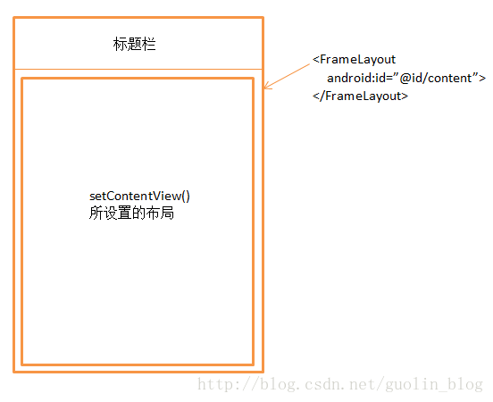

# Activity 的布局绘制过程

## 1. 概述
　　LayoutInflater 主要是用于加载布局的，而通常加载布局的任务都是在 Activity 中调用 setContentView() 方法来完成，而 setContentView() 方法的内部是使用 LayoutInflater 来加载布局的，只是这一部分源码是 internal 的，不太容易查看到。

## 2. LayoutInflater 的用法

　　LayoutInflater 的用法非常简单，首先需要获取到 LayoutInflater 的实例，有两种方法可以获取到。

1. 第一种写法

   ```java
   LayoutInflater layoutInflater = LayoutInflater.from(context);
   ```

2. 第二种写法

   ```java
   LayoutInflater layoutInflater = (LayoutInflater) context.getSystemService(Context.LAYOUT_INFLATER_SERVICE);
   ```

　　其实第一种就是第二种的简单写法，只是 Android 做了一下封装而已。

　　得到了 LayoutInflater 的实例之后就可以调用它的 inflate() 方法来加载布局了，如下：

```java
layoutInflater.inflate();
```

　　inflate() 方法一般接收两个参数，第一个参数就是要加载的布局 id，第二个参数是指给该布局的外部再嵌套一层父布局，如果不需要就直接传 null。这样就成功创建了一个布局的实例，之后再将它添加到指定的位置就可以显示了。

## 3. 源码分析

　　从 Activity 的 setContentView 开始看起。

### 3.1. Activity#setContentView() 方法

```java
public class Activity extends ContextThemeWrapper
        implements LayoutInflater.Factory2,
        Window.Callback, KeyEvent.Callback,
        OnCreateContextMenuListener, ComponentCallbacks2,
        Window.OnWindowDismissedCallback, WindowControllerCallback {
    /**
     * Set the activity content from a layout resource.  The resource will be
     * inflated, adding all top-level views to the activity.
     *
     * @param layoutResID Resource ID to be inflated.
     *
     * @see #setContentView(android.view.View)
     * @see #setContentView(android.view.View, android.view.ViewGroup.LayoutParams)
     */
    public void setContentView(@LayoutRes int layoutResID) {
      	// 调用的 Window 的 setContent 方法
        getWindow().setContentView(layoutResID);
        initWindowDecorActionBar();
    }
}
```
　　getWindow() 获得的是一个 Window 对象，而 Window 是一个抽象类，而唯一实现它的类是 android.view.PhoneWindow，所以 getWindow().setContentView(layoutResID) 实际上调用的是 PhotoWindow 的 setContentView(layoutResId) 。

#### 3.1.1. PhoneWindow#setContentView

```java
public class PhoneWindow extends Window implements MenuBuilder.Callback {
    @Override
    public void setContentView(int layoutResID) {
        // Note: FEATURE_CONTENT_TRANSITIONS may be set in the process of installing the window
        // decor, when theme attributes and the like are crystalized. Do not check the feature
        // before this happens.
        if (mContentParent == null) {
            installDecor();
        } else if (!hasFeature(FEATURE_CONTENT_TRANSITIONS)) {
            mContentParent.removeAllViews();
        }

        if (hasFeature(FEATURE_CONTENT_TRANSITIONS)) {
            final Scene newScene = Scene.getSceneForLayout(mContentParent, layoutResID,
                    getContext());
            transitionTo(newScene);
        } else {
						//使用 LayoutInflater.inflate() 加载布局
            mLayoutInflater.inflate(layoutResID, mContentParent);
        }
        mContentParent.requestApplyInsets();
        final Callback cb = getCallback();
        if (cb != null && !isDestroyed()) {
            cb.onContentChanged();
        }
        mContentParentExplicitlySet = true;
    }
}
```
　　setContentView(int layoutResID) 方法调用 LayoutInflater 的 inflate() 方法加载布局。

#### 3.1.2. LayoutInflater#inflate

```java
public abstract class LayoutInflater {
    public View inflate(@LayoutRes int resource, @Nullable ViewGroup root) {
        return inflate(resource, root, root != null);
    }

	    public View inflate(@LayoutRes int resource, @Nullable ViewGroup root, boolean attachToRoot) {
        final Resources res = getContext().getResources();
        if (DEBUG) {
            Log.d(TAG, "INFLATING from resource: \"" + res.getResourceName(resource) + "\" ("
                    + Integer.toHexString(resource) + ")");
        }

        final XmlResourceParser parser = res.getLayout(resource);
        try {
            return inflate(parser, root, attachToRoot);
        } finally {
            parser.close();
        }
    }

  	// inflate 的方法都会调用到这里
    public View inflate(XmlPullParser parser, @Nullable ViewGroup root, boolean attachToRoot) {
        synchronized (mConstructorArgs) {
            Trace.traceBegin(Trace.TRACE_TAG_VIEW, "inflate");

            final Context inflaterContext = mContext;
            final AttributeSet attrs = Xml.asAttributeSet(parser);
            Context lastContext = (Context) mConstructorArgs[0];
            mConstructorArgs[0] = inflaterContext;
            View result = root;

            try {
                // Look for the root node.
                int type;
                while ((type = parser.next()) != XmlPullParser.START_TAG &&
                        type != XmlPullParser.END_DOCUMENT) {
                    // Empty
                }

                if (type != XmlPullParser.START_TAG) {
                    throw new InflateException(parser.getPositionDescription()
                            + ": No start tag found!");
                }

                final String name = parser.getName();

                if (DEBUG) {
                    System.out.println("**************************");
                    System.out.println("Creating root view: "
                            + name);
                    System.out.println("**************************");
                }

              	// 如果是 merge 标签
                if (TAG_MERGE.equals(name)) {
                    if (root == null || !attachToRoot) {
                        throw new InflateException("<merge /> can be used only with a valid "
                                + "ViewGroup root and attachToRoot=true");
                    }
										// 调用 rInflate 方法
                    rInflate(parser, root, inflaterContext, attrs, false);
                } else {
                    // Temp is the root view that was found in the xml
										// 找到 xml 文件中的根视图
                    final View temp = createViewFromTag(root, name, inflaterContext, attrs);

                    ViewGroup.LayoutParams params = null;

                    if (root != null) {
                        if (DEBUG) {
                            System.out.println("Creating params from root: " +
                                    root);
                        }
                        // Create layout params that match root, if supplied
                        params = root.generateLayoutParams(attrs);
                        if (!attachToRoot) {
                            // Set the layout params for temp if we are not
                            // attaching. (If we are, we use addView, below)
                            temp.setLayoutParams(params);
                        }
                    }

                    if (DEBUG) {
                        System.out.println("-----> start inflating children");
                    }

                    // Inflate all children under temp against its context.
										// 加载根视图的所有子视图
                    rInflateChildren(parser, temp, attrs, true);

                    if (DEBUG) {
                        System.out.println("-----> done inflating children");
                    }

                    // We are supposed to attach all the views we found (int temp)
                    // to root. Do that now.
										// 将找到的所有子图添加到根视图上去
                    if (root != null && attachToRoot) {
                        root.addView(temp, params);
                    }

                    // Decide whether to return the root that was passed in or the
                    // top view found in xml.
                    if (root == null || !attachToRoot) {
                        result = temp;
                    }
                }

            } catch (XmlPullParserException e) {
                final InflateException ie = new InflateException(e.getMessage(), e);
                ie.setStackTrace(EMPTY_STACK_TRACE);
                throw ie;
            } catch (Exception e) {
                final InflateException ie = new InflateException(parser.getPositionDescription()
                        + ": " + e.getMessage(), e);
                ie.setStackTrace(EMPTY_STACK_TRACE);
                throw ie;
            } finally {
                // Don't retain static reference on context.
                mConstructorArgs[0] = lastContext;
                mConstructorArgs[1] = null;

                Trace.traceEnd(Trace.TRACE_TAG_VIEW);
            }

            return result;
        }
    }
}
```
　　LayoutInflater 其实就是使用 Android 提供的 pull 解析方式来解析布局文件的。

　　createViewFromTag() 方法将节点名和参数都传了进入，它是用于根据节点名来创建 View 对象的。在 createViewFromTag() 方法的内部又会去调用 createView() 方法，然后使用反射的方式创建出 View 的实例并返回。

　　inflate() 方法只是创建出了一个根布局的实例而已，接着会调用 rInflateChildren() 方法来循环遍历这个根布局下的子元素。

#### 3.1.3. LayoutInflater#rInflateChildren

```java
public abstract class LayoutInflater {
    final void rInflateChildren(XmlPullParser parser, View parent, AttributeSet attrs,
            boolean finishInflate) throws XmlPullParserException, IOException {
        rInflate(parser, parent, parent.getContext(), attrs, finishInflate);
    }

    void rInflate(XmlPullParser parser, View parent, Context context,
            AttributeSet attrs, boolean finishInflate) throws XmlPullParserException, IOException {

        final int depth = parser.getDepth();
        int type;

        while (((type = parser.next()) != XmlPullParser.END_TAG ||
                parser.getDepth() > depth) && type != XmlPullParser.END_DOCUMENT) {

            if (type != XmlPullParser.START_TAG) {
                continue;
            }

            final String name = parser.getName();

            if (TAG_REQUEST_FOCUS.equals(name)) {
                parseRequestFocus(parser, parent);
            } else if (TAG_TAG.equals(name)) {
                parseViewTag(parser, parent, attrs);
            } else if (TAG_INCLUDE.equals(name)) { // include 标签
                if (parser.getDepth() == 0) {
                    throw new InflateException("<include /> cannot be the root element");
                }
                parseInclude(parser, context, parent, attrs);
            } else if  (TAG_MERGE.equals(name)) { // merge 标签
                throw new InflateException("<merge /> must be the root element");
            } else {
              	// 调用 createViewFromTag 方法创建 View 的实例
                final View view = createViewFromTag(parent, name, context, attrs);
                final ViewGroup viewGroup = (ViewGroup) parent;
                final ViewGroup.LayoutParams params = viewGroup.generateLayoutParams(attrs);
              	// 查找 view 下的子元素
                rInflateChildren(parser, view, attrs, true);
                viewGroup.addView(view, params);
            }
        }

        if (finishInflate) {
            parent.onFinishInflate();
        }
    }
}
```
　　子元素的处理同样也是调用 createViewFromTag() 方法来创建 View 的实例，调用 rInflateChildren() 方法来查找当前 View 下的子元素，每次递归完成后则将这个 View 添加到父布局当中。

　　这样的话，把整个布局文件都解析完成后就形成了一个完整的 DOM 结构，最终会把最顶层的根布局返回，至此 inflate() 过程全部结束。

　　setContentView() 的方法在 onCreate() 方法中调用完成之后，随后会进入 resume 状态，接着会调用 ActivityThread 的 handleResumeActivity() 方法处理 resume。

#### 3.1.4. ActivityThread#handleResumeActivity

```java
public final class ActivityThread {
    final void handleResumeActivity(IBinder token,
            boolean clearHide, boolean isForward, boolean reallyResume, int seq, String reason) {
        ActivityClientRecord r = mActivities.get(token);
        if (!checkAndUpdateLifecycleSeq(seq, r, "resumeActivity")) {
            return;
        }

        // If we are getting ready to gc after going to the background, well
        // we are back active so skip it.
        unscheduleGcIdler();
        mSomeActivitiesChanged = true;

        // TODO Push resumeArgs into the activity for consideration
        r = performResumeActivity(token, clearHide, reason);

        if (r != null) {
            final Activity a = r.activity;

            final int forwardBit = isForward ?
                    WindowManager.LayoutParams.SOFT_INPUT_IS_FORWARD_NAVIGATION : 0;

            // If the window hasn't yet been added to the window manager,
            // and this guy didn't finish itself or start another activity,
            // then go ahead and add the window.
            boolean willBeVisible = !a.mStartedActivity;
            if (!willBeVisible) {
                try {
                    willBeVisible = ActivityManagerNative.getDefault().willActivityBeVisible(
                            a.getActivityToken());
                } catch (RemoteException e) {
                    throw e.rethrowFromSystemServer();
                }
            }
            if (r.window == null && !a.mFinished && willBeVisible) {
                r.window = r.activity.getWindow();
              	// 获取布局
                View decor = r.window.getDecorView();
                decor.setVisibility(View.INVISIBLE);
                ViewManager wm = a.getWindowManager();
                WindowManager.LayoutParams l = r.window.getAttributes();
                a.mDecor = decor;
                l.type = WindowManager.LayoutParams.TYPE_BASE_APPLICATION;
                l.softInputMode |= forwardBit;
                if (r.mPreserveWindow) {
                    a.mWindowAdded = true;
                    r.mPreserveWindow = false;
                    // Normally the ViewRoot sets up callbacks with the Activity
                    // in addView->ViewRootImpl#setView. If we are instead reusing
                    // the decor view we have to notify the view root that the
                    // callbacks may have changed.
                    ViewRootImpl impl = decor.getViewRootImpl();
                    if (impl != null) {
                        impl.notifyChildRebuilt();
                    }
                }
                if (a.mVisibleFromClient && !a.mWindowAdded) {
                    a.mWindowAdded = true;
										// 将视图添加上去
                    wm.addView(decor, l);
                }
            ...
        } else {
            ...
        }
    }
}

```

　　handleResumeActivity() 方法中调用 ViewMananger 的 addView() 添加视图，而 ViewManager 是一个接口，WindowManangerImpl 是实现它的类，所以查看 WindowManagerImpl 的 addView() 方法。

#### 3.1.5. WindowManagerImpl#addView

```java
public final class WindowManagerImpl implements WindowManager {
    @Override
    public void addView(@NonNull View view, @NonNull ViewGroup.LayoutParams params) {
        applyDefaultToken(params);
      	// 调用 WindowManagerGlobal 的 addView 方法
        mGlobal.addView(view, params, mContext.getDisplay(), mParentWindow);
    }
}
```

　　WindowManagerImpl 的 addView() 接着调用了 WindowManagerGlobal 的 addView() 方法。

#### 3.1.6. WindowManagerGlobal#addView

```java
public final class WindowManagerGlobal {
    public void addView(View view, ViewGroup.LayoutParams params,
            Display display, Window parentWindow) {
        // 只贴出了关键的代码
				...

        // do this last because it fires off messages to start doing things
				// 设置 ViewRoot 的视图
        try {
            root.setView(view, wparams, panelParentView);
        } catch (RuntimeException e) {
            ...
        }
    }
}
```

　　WindowMnanagerGolder 的 addView() 方法向 ViewRoot 添加视图。

#### 3.1.7. ViewRootImpl#setView

```java
public final class ViewRootImpl implements ViewParent,
        View.AttachInfo.Callbacks, ThreadedRenderer.HardwareDrawCallbacks {
    /**
     * We have one child
     */
    public void setView(View view, WindowManager.LayoutParams attrs, View panelParentView) {
        synchronized (this) {
            if (mView == null) {
                mView = view;

                mAttachInfo.mDisplayState = mDisplay.getState();
                mDisplayManager.registerDisplayListener(mDisplayListener, mHandler);

                mViewLayoutDirectionInitial = mView.getRawLayoutDirection();
                mFallbackEventHandler.setView(view);
                mWindowAttributes.copyFrom(attrs);
                if (mWindowAttributes.packageName == null) {
                    mWindowAttributes.packageName = mBasePackageName;
                }
                attrs = mWindowAttributes;
                setTag();

                // Keep track of the actual window flags supplied by the client.
                mClientWindowLayoutFlags = attrs.flags;

                setAccessibilityFocus(null, null);

                if (view instanceof RootViewSurfaceTaker) {
                    mSurfaceHolderCallback =
                            ((RootViewSurfaceTaker)view).willYouTakeTheSurface();
                    if (mSurfaceHolderCallback != null) {
                        mSurfaceHolder = new TakenSurfaceHolder();
                        mSurfaceHolder.setFormat(PixelFormat.UNKNOWN);
                    }
                }

                // Compute surface insets required to draw at specified Z value.
                // TODO: Use real shadow insets for a constant max Z.
                if (!attrs.hasManualSurfaceInsets) {
                    attrs.setSurfaceInsets(view, false /*manual*/, true /*preservePrevious*/);
                }

                CompatibilityInfo compatibilityInfo =
                        mDisplay.getDisplayAdjustments().getCompatibilityInfo();
                mTranslator = compatibilityInfo.getTranslator();

                // If the application owns the surface, don't enable hardware acceleration
                if (mSurfaceHolder == null) {
                    enableHardwareAcceleration(attrs);
                }

                boolean restore = false;
                if (mTranslator != null) {
                    mSurface.setCompatibilityTranslator(mTranslator);
                    restore = true;
                    attrs.backup();
                    mTranslator.translateWindowLayout(attrs);
                }
                if (DEBUG_LAYOUT) Log.d(mTag, "WindowLayout in setView:" + attrs);

                if (!compatibilityInfo.supportsScreen()) {
                    attrs.privateFlags |= WindowManager.LayoutParams.PRIVATE_FLAG_COMPATIBLE_WINDOW;
                    mLastInCompatMode = true;
                }

                mSoftInputMode = attrs.softInputMode;
                mWindowAttributesChanged = true;
                mWindowAttributesChangesFlag = WindowManager.LayoutParams.EVERYTHING_CHANGED;
                mAttachInfo.mRootView = view;
                mAttachInfo.mScalingRequired = mTranslator != null;
                mAttachInfo.mApplicationScale =
                        mTranslator == null ? 1.0f : mTranslator.applicationScale;
                if (panelParentView != null) {
                    mAttachInfo.mPanelParentWindowToken
                            = panelParentView.getApplicationWindowToken();
                }
                mAdded = true;
                int res; /* = WindowManagerImpl.ADD_OKAY; */

                // Schedule the first layout -before- adding to the window
                // manager, to make sure we do the relayout before receiving
                // any other events from the system.
              	// 调用 requestLayout 方法
                requestLayout();
                if ((mWindowAttributes.inputFeatures
                        & WindowManager.LayoutParams.INPUT_FEATURE_NO_INPUT_CHANNEL) == 0) {
                    mInputChannel = new InputChannel();
                }
                mForceDecorViewVisibility = (mWindowAttributes.privateFlags
                        & PRIVATE_FLAG_FORCE_DECOR_VIEW_VISIBILITY) != 0;
                try {
                    mOrigWindowType = mWindowAttributes.type;
                    mAttachInfo.mRecomputeGlobalAttributes = true;
                    collectViewAttributes();
                    res = mWindowSession.addToDisplay(mWindow, mSeq, mWindowAttributes,
                            getHostVisibility(), mDisplay.getDisplayId(),
                            mAttachInfo.mContentInsets, mAttachInfo.mStableInsets,
                            mAttachInfo.mOutsets, mInputChannel);
                } catch (RemoteException e) {
                    mAdded = false;
                    mView = null;
                    mAttachInfo.mRootView = null;
                    mInputChannel = null;
                    mFallbackEventHandler.setView(null);
                    unscheduleTraversals();
                    setAccessibilityFocus(null, null);
                    throw new RuntimeException("Adding window failed", e);
                } finally {
                    if (restore) {
                        attrs.restore();
                    }
                }

                if (mTranslator != null) {
                    mTranslator.translateRectInScreenToAppWindow(mAttachInfo.mContentInsets);
                }
                mPendingOverscanInsets.set(0, 0, 0, 0);
                mPendingContentInsets.set(mAttachInfo.mContentInsets);
                mPendingStableInsets.set(mAttachInfo.mStableInsets);
                mPendingVisibleInsets.set(0, 0, 0, 0);
                mAttachInfo.mAlwaysConsumeNavBar =
                        (res & WindowManagerGlobal.ADD_FLAG_ALWAYS_CONSUME_NAV_BAR) != 0;
                mPendingAlwaysConsumeNavBar = mAttachInfo.mAlwaysConsumeNavBar;
                ...

                if (view instanceof RootViewSurfaceTaker) {
                    mInputQueueCallback =
                        ((RootViewSurfaceTaker)view).willYouTakeTheInputQueue();
                }
                if (mInputChannel != null) {
                    if (mInputQueueCallback != null) {
                        mInputQueue = new InputQueue();
                        mInputQueueCallback.onInputQueueCreated(mInputQueue);
                    }
                    mInputEventReceiver = new WindowInputEventReceiver(mInputChannel,
                            Looper.myLooper());
                }

                view.assignParent(this);
                mAddedTouchMode = (res & WindowManagerGlobal.ADD_FLAG_IN_TOUCH_MODE) != 0;
                mAppVisible = (res & WindowManagerGlobal.ADD_FLAG_APP_VISIBLE) != 0;

                if (mAccessibilityManager.isEnabled()) {
                    mAccessibilityInteractionConnectionManager.ensureConnection();
                }

                if (view.getImportantForAccessibility() == View.IMPORTANT_FOR_ACCESSIBILITY_AUTO) {
                    view.setImportantForAccessibility(View.IMPORTANT_FOR_ACCESSIBILITY_YES);
                }

                // Set up the input pipeline.
                CharSequence counterSuffix = attrs.getTitle();
                mSyntheticInputStage = new SyntheticInputStage();
                InputStage viewPostImeStage = new ViewPostImeInputStage(mSyntheticInputStage);
                InputStage nativePostImeStage = new NativePostImeInputStage(viewPostImeStage,
                        "aq:native-post-ime:" + counterSuffix);
                InputStage earlyPostImeStage = new EarlyPostImeInputStage(nativePostImeStage);
                InputStage imeStage = new ImeInputStage(earlyPostImeStage,
                        "aq:ime:" + counterSuffix);
                InputStage viewPreImeStage = new ViewPreImeInputStage(imeStage);
                InputStage nativePreImeStage = new NativePreImeInputStage(viewPreImeStage,
                        "aq:native-pre-ime:" + counterSuffix);

                mFirstInputStage = nativePreImeStage;
                mFirstPostImeInputStage = earlyPostImeStage;
                mPendingInputEventQueueLengthCounterName = "aq:pending:" + counterSuffix;
            }
        }
    }
}
```

　　ViewRootImpl 的 setView() 方法代码这么多，其实只需要看到它里面调用了 requestLayout() 方法即可。requestLayout() 用来重绘页面，视图的 measure、layout、draw 都会重新调用。

#### 3.1.8. ViewRootImpl#requestLayout

```java
public final class ViewRootImpl implements ViewParent,
        View.AttachInfo.Callbacks, ThreadedRenderer.HardwareDrawCallbacks {

    final class TraversalRunnable implements Runnable {
        @Override
        public void run() {
          	// 调用 doTraversal 方法
            doTraversal();
        }
    }
    final TraversalRunnable mTraversalRunnable = new TraversalRunnable();

    @Override
    public void requestLayout() {
        if (!mHandlingLayoutInLayoutRequest) {
            checkThread();
            mLayoutRequested = true;
          	// 调用 scheduleTraversals 方法
            scheduleTraversals();
        }
    }

	void scheduleTraversals() {
        if (!mTraversalScheduled) {
            mTraversalScheduled = true;
            mTraversalBarrier = mHandler.getLooper().getQueue().postSyncBarrier();
          	// 发出 Choreographer.CALLBACK_TRAVERSAL 消息，接收到消息后执行 mTraversalRunnable 的 run 方法
            mChoreographer.postCallback(
                    Choreographer.CALLBACK_TRAVERSAL, mTraversalRunnable, null);
            if (!mUnbufferedInputDispatch) {
                scheduleConsumeBatchedInput();
            }
            notifyRendererOfFramePending();
            pokeDrawLockIfNeeded();
        }
    }

    void doTraversal() {
        if (mTraversalScheduled) {
            mTraversalScheduled = false;
            mHandler.getLooper().getQueue().removeSyncBarrier(mTraversalBarrier);

            if (mProfile) {
                Debug.startMethodTracing("ViewAncestor");
            }

          	// 调用 performTraversals 方法
            performTraversals();

            if (mProfile) {
                Debug.stopMethodTracing();
                mProfile = false;
            }
        }
    }

}
```

　　ViewRootImpl 的 requestLayout() 最终会调用到 performTraversals() 方法，requestLayout() 方法会先调用 scheduleTraversals() 方法，scheduleTraversals() 方法调用 Choreographer 的 postCallBack() 方法向主线程（UI 线程）发送重绘页面的消息，等到主线程处理处理该消息时会调用 mTraversalRunnable 的 run() 方法，调用到 doTraversal() 方法，在 doTraversal() 方法中调用了 performTraversals() 方法，在 performTraversals() 方法中会依次调用 View 的 measure、layout、draw 方法将视图显示到屏幕上。

　　**总结：**setContentView 会将整个布局文件都解析完成并形成一个完整的 Dom 结构，并设置最顶部的根布局。在 resume 的时候才会进行视图的绘制操作，通过调用 requestLayout() 最终调用到 performTraversales() 方法，performTraversales() 方法会依次调用 View 的 measure、layout、draw 步骤将视图显示在屏幕上。

### 3.2. inflate 方法

　　inflate() 方法还有个接收三个参数的方法重载，如下：

```java
public View inflate(@LayoutRes int resource, @Nullable ViewGroup root, boolean attachToRoot)
```

　　关于第三个参数 attachToRoot 的一些结论：

1. 如果 root 为 null，attachToRoot 将失去作用，设置任何值都没有意义。
2. 如果 root 不为 null，attachToRoot 设为 true，则会给加载的布局文件指定一个父布局，即 root。
3. 如果 root 不为 null，attachToRoot 设为 false，则会将布局文件最外层的所有 layout 属性进行设置，当该 view 被添加到父 view 当中时，这些 layout 属性会自动生效。
4. 在不设置 attachToRoot 参数的情况下，如果 root 不为 null，attachToRoot 参数默认为 true。

## 4. 关于 layout_width 和 layout_height

　　layout_width 和 layout_height 是用于设置 View 在布局中的大小的，也就是说，首先 View 必须存在于一个布局中，之后如果将 layout_width 设置成 match_parent 表示让 View 的宽度填充满布局，如果设置成 wrap_content 表示让 View 的宽度刚好可以包含其内容，如果设置成具体的数值则 View 的宽度会变成相应的数值。这也是为什么这两个属性叫做 layout_width 和 layout_height，而不是 width 和 height。

　　平时在 Activity 中指定布局文件的时候，最外层的那个布局是可以指定大小的，layout_width 和 layout_height 都是有作用的，这是因为，在 setContentView() 方法中，Android 会自动在布局文件的最外层再嵌套一个 FrameLayout，所以 layout_width 和 layout_height 属性才会有效果。

　　任何一个 Activity 中显示的界面其实主要都由两部分组成，标题栏和内容栏布局。标题栏就是很多界面顶部显示的那部分内容，可以在代码中控制让它是否显示。而内容栏内容就是一个 FrameLayout，这个布局的 id 叫做 content，调用 setContentView() 方法时所传入的布局其实就是放到这个 Fragment 中的，这也是为什么这个方法叫做 setContentView() ，而不是 setView()。

　　Activity 窗口的组成图：




## 5. 参考文章
1. [Android LayoutInflater原理分析，带你一步步深入了解View(一)](https://blog.csdn.net/guolin_blog/article/details/12921889)

