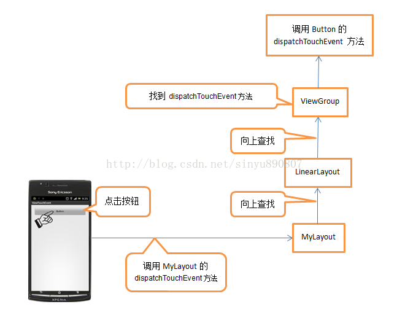
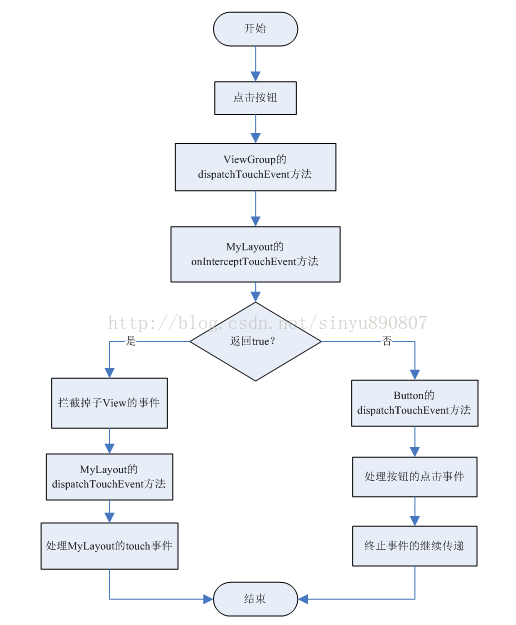

# ViewGroup 事件分发机制

　　ViewGroup 就是一组 View 的集合，它包含很多的子 View 和子 ViewGroup，是 Android 中所有布局的父类或间接父类，像 LinearLayout、RelativeLayout 等都是继承自 ViewGroup 的。但 ViewGroup 实际上也是一个 View，只不过比起 View，它多了可以包含子 View 和定义布局参数的功能。

　　ViewGroup 继承结构示意图如下所示：


　　可以看到，经常用到的各种布局，全部属于 ViewGroup 的子类。

　　通过一个 Demo 来演示一下 Android 中 ViewGroup 的事件分发流程。

　　首先自定义一个布局，命名为 MyLayout，继承自 LinearLayout，如下所示：

```java
public class MyLayout extends LinearLayout {
    public MyLayout(Context context) {
        super(context);
    }

    public MyLayout(Context context, @Nullable AttributeSet attrs) {
        super(context, attrs);
    }

    public MyLayout(Context context, @Nullable AttributeSet attrs, int defStyleAttr) {
        super(context, attrs, defStyleAttr);
    }
}
```

　　然后，打开主布局文件 activity_main.xml，在其中加入自定义的布局：

```java
<com.example.viewgroupdistribute.MyLayout xmlns:android="http://schemas.android.com/apk/res/android"
    xmlns:tools="http://schemas.android.com/tools"
    android:id="@+id/my_layout"
    android:layout_width="match_parent"
    android:layout_height="match_parent"
    android:orientation="vertical"
    tools:context=".MainActivity">

    <Button
        android:id="@+id/button1"
        android:layout_width="match_parent"
        android:layout_height="wrap_content"
        android:text="Button1" />

    <Button
        android:id="@+id/button2"
        android:layout_width="match_parent"
        android:layout_height="wrap_content"
        android:text="Button2" />

</com.example.viewgroupdistribute.MyLayout>
```

　　可看看到，在 MyLayout 中添加了两个按钮，接着在 MainActivity 中为这两个按钮和 MyLayout 都注册了监听事件：

```java
        myLayout.setOnTouchListener(new View.OnTouchListener() {
            @Override
            public boolean onTouch(View v, MotionEvent event) {
                Log.d(TAG,"myLayout on touch");
                return false;
            }
        });
        button1.setOnClickListener(new View.OnClickListener() {
            @Override
            public void onClick(View v) {
                Log.d(TAG,"you clicked button1");
            }
        });
        button2.setOnClickListener(new View.OnClickListener() {
            @Override
            public void onClick(View v) {
                Log.d(TAG,"you clicked button2");
            }
        });
```

　　在 MyLayout 的 onTouch() 方法和 Button1、Button2 的 onClick 方法中都打印了一句话，运行后分别电一一下 Button1、Button2 和空白区域，打印结果如下：

```java
06-30 14:37:58.110 28623-28623/com.example.viewgroupdistribute D/MainActivity: you clicked button1
06-30 14:37:59.139 28623-28623/com.example.viewgroupdistribute D/MainActivity: you clicked button2
06-30 14:37:59.869 28623-28623/com.example.viewgroupdistribute D/MainActivity: myLayout on touch
```

　　会发现，当点击按钮的时候，MyLayout 注册的 onTouch() 方法并不会执行，只有点击空白区域的时候才会执行该方法。

　　

## ViewGroup 的事件分发源码分析

　　ViewGroup 中有一个 onInterceptTouchEvent 方法，看一下这个方法源码：

```java
    /**
     * Implement this method to intercept all touch screen motion events.  This
     * allows you to watch events as they are dispatched to your children, and
     * take ownership of the current gesture at any point.
     *
     * <p>Using this function takes some care, as it has a fairly complicated
     * interaction with {@link View#onTouchEvent(MotionEvent)
     * View.onTouchEvent(MotionEvent)}, and using it requires implementing
     * that method as well as this one in the correct way.  Events will be
     * received in the following order:
     *
     * <ol>
     * <li> You will receive the down event here.
     * <li> The down event will be handled either by a child of this view
     * group, or given to your own onTouchEvent() method to handle; this means
     * you should implement onTouchEvent() to return true, so you will
     * continue to see the rest of the gesture (instead of looking for
     * a parent view to handle it).  Also, by returning true from
     * onTouchEvent(), you will not receive any following
     * events in onInterceptTouchEvent() and all touch processing must
     * happen in onTouchEvent() like normal.
     * <li> For as long as you return false from this function, each following
     * event (up to and including the final up) will be delivered first here
     * and then to the target's onTouchEvent().
     * <li> If you return true from here, you will not receive any
     * following events: the target view will receive the same event but
     * with the action {@link MotionEvent#ACTION_CANCEL}, and all further
     * events will be delivered to your onTouchEvent() method and no longer
     * appear here.
     * </ol>
     *
     * @param ev The motion event being dispatched down the hierarchy.
     * @return Return true to steal motion events from the children and have
     * them dispatched to this ViewGroup through onTouchEvent().
     * The current target will receive an ACTION_CANCEL event, and no further
     * messages will be delivered here.
     */
    public boolean onInterceptTouchEvent(MotionEvent ev) {
        if (ev.isFromSource(InputDevice.SOURCE_MOUSE)
                && ev.getAction() == MotionEvent.ACTION_DOWN
                && ev.isButtonPressed(MotionEvent.BUTTON_PRIMARY)
                && isOnScrollbarThumb(ev.getX(), ev.getY())) {
            return true;
        }
        return false;
    }
```

　　如果上面的判断为 false，那么 onInterceptTouchEvent() 方法返回的就是 false。

　　既然时布尔型的返回，那么只有两种可能，在 MyLayout 中重写这个方法，然后返回一个 true 试试，代码如下所示：

```java
public class MyLayout extends LinearLayout {
    public MyLayout(Context context) {
        super(context);
    }

    public MyLayout(Context context, @Nullable AttributeSet attrs) {
        super(context, attrs);
    }

    public MyLayout(Context context, @Nullable AttributeSet attrs, int defStyleAttr) {
        super(context, attrs, defStyleAttr);
    }

    @Override
    public boolean onInterceptTouchEvent(MotionEvent ev) {
        return true;
    }
}
```

　　再次运行然后分别点击 Button1、Button2 和空白区域，打印结果如下所示：

```java
06-30 14:42:55.349 29124-29124/com.example.viewgroupdistribute D/MainActivity: myLayout on touch
06-30 14:42:57.210 29124-29124/com.example.viewgroupdistribute D/MainActivity: myLayout on touch
06-30 14:42:58.328 29124-29124/com.example.viewgroupdistribute D/MainActivity: myLayout on touch
```

　　会发现，不管点击哪里，永远都只会触发 MyLayout 的 touch 事件了，按钮的点击事件完全被屏蔽掉了！

　　只要触摸了任何控件，就一定会调用该控件的 dispatchTouchEvent() 方法。这个说法没错，只不过还不完整而已。实际情况是，当点击了某个控件，首先会去调用该控件所在布局的 dispatchTouchEvent 方法，然后在布局的 dispatchTouchEvent 方法中找到被点击的相应控件，再去调用该控件的 dispatchTouchEvent 方法。

　　如果点击了 MyLayout 中的按钮，会先去调用 MyLayout 的 dispatchTouchEvent 方法，而这个方法是在 MyLayout 的祖类 ViewGroup 中的，按钮的 dispatchTouchEvent 方法就是在这里调用的。

　　点击的事件传递图：



### ViewGroup#dispatchTouchEvent

```java
    @Override
    public boolean dispatchTouchEvent(MotionEvent ev) {
        if (mInputEventConsistencyVerifier != null) {
            mInputEventConsistencyVerifier.onTouchEvent(ev, 1);
        }

        // If the event targets the accessibility focused view and this is it, start
        // normal event dispatch. Maybe a descendant is what will handle the click.
        if (ev.isTargetAccessibilityFocus() && isAccessibilityFocusedViewOrHost()) {
            ev.setTargetAccessibilityFocus(false);
        }

        boolean handled = false;
        if (onFilterTouchEventForSecurity(ev)) {
            final int action = ev.getAction();
            final int actionMasked = action & MotionEvent.ACTION_MASK;

            // Handle an initial down.
            if (actionMasked == MotionEvent.ACTION_DOWN) {
                // Throw away all previous state when starting a new touch gesture.
                // The framework may have dropped the up or cancel event for the previous gesture
                // due to an app switch, ANR, or some other state change.
                cancelAndClearTouchTargets(ev);
                resetTouchState();
            }

            // Check for interception.
            final boolean intercepted;
            if (actionMasked == MotionEvent.ACTION_DOWN
                    || mFirstTouchTarget != null) {
                final boolean disallowIntercept = (mGroupFlags & FLAG_DISALLOW_INTERCEPT) != 0;
                if (!disallowIntercept) {
                    intercepted = onInterceptTouchEvent(ev);
                    ev.setAction(action); // restore action in case it was changed
                } else {
                    intercepted = false;
                }
            } else {
                // There are no touch targets and this action is not an initial down
                // so this view group continues to intercept touches.
                intercepted = true;
            }

            // If intercepted, start normal event dispatch. Also if there is already
            // a view that is handling the gesture, do normal event dispatch.
            if (intercepted || mFirstTouchTarget != null) {
                ev.setTargetAccessibilityFocus(false);
            }

            // Check for cancelation.
            final boolean canceled = resetCancelNextUpFlag(this)
                    || actionMasked == MotionEvent.ACTION_CANCEL;

            // Update list of touch targets for pointer down, if needed.
            final boolean split = (mGroupFlags & FLAG_SPLIT_MOTION_EVENTS) != 0;
            TouchTarget newTouchTarget = null;
            boolean alreadyDispatchedToNewTouchTarget = false;
            if (!canceled && !intercepted) {

                // If the event is targeting accessiiblity focus we give it to the
                // view that has accessibility focus and if it does not handle it
                // we clear the flag and dispatch the event to all children as usual.
                // We are looking up the accessibility focused host to avoid keeping
                // state since these events are very rare.
                View childWithAccessibilityFocus = ev.isTargetAccessibilityFocus()
                        ? findChildWithAccessibilityFocus() : null;

                if (actionMasked == MotionEvent.ACTION_DOWN
                        || (split && actionMasked == MotionEvent.ACTION_POINTER_DOWN)
                        || actionMasked == MotionEvent.ACTION_HOVER_MOVE) {
                    final int actionIndex = ev.getActionIndex(); // always 0 for down
                    final int idBitsToAssign = split ? 1 << ev.getPointerId(actionIndex)
                            : TouchTarget.ALL_POINTER_IDS;

                    // Clean up earlier touch targets for this pointer id in case they
                    // have become out of sync.
                    removePointersFromTouchTargets(idBitsToAssign);

                    final int childrenCount = mChildrenCount;
                    if (newTouchTarget == null && childrenCount != 0) {
                        final float x = ev.getX(actionIndex);
                        final float y = ev.getY(actionIndex);
                        // Find a child that can receive the event.
                        // Scan children from front to back.
                        final ArrayList<View> preorderedList = buildTouchDispatchChildList();
                        final boolean customOrder = preorderedList == null
                                && isChildrenDrawingOrderEnabled();
                        final View[] children = mChildren;
                        for (int i = childrenCount - 1; i >= 0; i--) {
                            final int childIndex = getAndVerifyPreorderedIndex(
                                    childrenCount, i, customOrder);
                            final View child = getAndVerifyPreorderedView(
                                    preorderedList, children, childIndex);

                            // If there is a view that has accessibility focus we want it
                            // to get the event first and if not handled we will perform a
                            // normal dispatch. We may do a double iteration but this is
                            // safer given the timeframe.
                            if (childWithAccessibilityFocus != null) {
                                if (childWithAccessibilityFocus != child) {
                                    continue;
                                }
                                childWithAccessibilityFocus = null;
                                i = childrenCount - 1;
                            }

                            // 如果不是当前点击的 child，则 continue
                            if (!canViewReceivePointerEvents(child)
                                    || !isTransformedTouchPointInView(x, y, child, null)) {
                                ev.setTargetAccessibilityFocus(false);
                                continue;
                            }

                            newTouchTarget = getTouchTarget(child);
                            if (newTouchTarget != null) {
                                // Child is already receiving touch within its bounds.
                                // Give it the new pointer in addition to the ones it is handling.
                                newTouchTarget.pointerIdBits |= idBitsToAssign;
                                break;
                            }

                            resetCancelNextUpFlag(child);
                            if (dispatchTransformedTouchEvent(ev, false, child, idBitsToAssign)) {
                                // Child wants to receive touch within its bounds.
                                mLastTouchDownTime = ev.getDownTime();
                                if (preorderedList != null) {
                                    // childIndex points into presorted list, find original index
                                    for (int j = 0; j < childrenCount; j++) {
                                        if (children[childIndex] == mChildren[j]) {
                                            mLastTouchDownIndex = j;
                                            break;
                                        }
                                    }
                                } else {
                                    mLastTouchDownIndex = childIndex;
                                }
                                mLastTouchDownX = ev.getX();
                                mLastTouchDownY = ev.getY();
                                newTouchTarget = addTouchTarget(child, idBitsToAssign);
                                alreadyDispatchedToNewTouchTarget = true;
                                break;
                            }

                            // The accessibility focus didn't handle the event, so clear
                            // the flag and do a normal dispatch to all children.
                            ev.setTargetAccessibilityFocus(false);
                        }
                        if (preorderedList != null) preorderedList.clear();
                    }

                    if (newTouchTarget == null && mFirstTouchTarget != null) {
                        // Did not find a child to receive the event.
                        // Assign the pointer to the least recently added target.
                        newTouchTarget = mFirstTouchTarget;
                        while (newTouchTarget.next != null) {
                            newTouchTarget = newTouchTarget.next;
                        }
                        newTouchTarget.pointerIdBits |= idBitsToAssign;
                    }
                }
            }

            // Dispatch to touch targets.
            if (mFirstTouchTarget == null) {
                // No touch targets so treat this as an ordinary view.
                handled = dispatchTransformedTouchEvent(ev, canceled, null,
                        TouchTarget.ALL_POINTER_IDS);
            } else {
                // Dispatch to touch targets, excluding the new touch target if we already
                // dispatched to it.  Cancel touch targets if necessary.
                TouchTarget predecessor = null;
                TouchTarget target = mFirstTouchTarget;
                while (target != null) {
                    final TouchTarget next = target.next;
                    if (alreadyDispatchedToNewTouchTarget && target == newTouchTarget) {
                        handled = true;
                    } else {
                        final boolean cancelChild = resetCancelNextUpFlag(target.child)
                                || intercepted;
                        if (dispatchTransformedTouchEvent(ev, cancelChild,
                                target.child, target.pointerIdBits)) {
                            handled = true;
                        }
                        if (cancelChild) {
                            if (predecessor == null) {
                                mFirstTouchTarget = next;
                            } else {
                                predecessor.next = next;
                            }
                            target.recycle();
                            target = next;
                            continue;
                        }
                    }
                    predecessor = target;
                    target = next;
                }
            }

            // Update list of touch targets for pointer up or cancel, if needed.
            if (canceled
                    || actionMasked == MotionEvent.ACTION_UP
                    || actionMasked == MotionEvent.ACTION_HOVER_MOVE) {
                resetTouchState();
            } else if (split && actionMasked == MotionEvent.ACTION_POINTER_UP) {
                final int actionIndex = ev.getActionIndex();
                final int idBitsToRemove = 1 << ev.getPointerId(actionIndex);
                removePointersFromTouchTargets(idBitsToRemove);
            }
        }

        if (!handled && mInputEventConsistencyVerifier != null) {
            mInputEventConsistencyVerifier.onUnhandledEvent(ev, 1);
        }
        return handled;
    }
```

　　先是可以看到一个条件判断`!canceled && !intercepted `，如果  intercepted 和 canceled 两个都为 false，就会进入到这个条件判断中。canceled 是指是否取消，而 intercepted 是 onInterceptTouchEvent() 的返回值，也就是说如果在 onInterceptTouchEvent() 方法中返回 false，也就是 !intercepted 为 true，才可以进入到条件判断的内部。而如果在 onInterceptTouchEvent() 方法中返回 true，那么就不会进入到条件判断的内部。

　　接着分析条件判断的内部，在里面通过一个 for 循环，遍历了当前 ViewGroup 下的所有子 View，然后判断当前的 View 是不是正在点击的 View，如果不是的话则 continue，进行下一个 View 的处理，如果是的话，就会继续执行。接着会调用 `dispatchTransformedTouchEvent(ev, false, child, idBitsToAssign)` 这个方法，这个方法中调用 View，也就是 child 的 dispatchTouchEvent，之后的流程和上面的一样了。所以，按钮点击事件的处理确实就是在这里进行的。

```java
    private boolean dispatchTransformedTouchEvent(MotionEvent event, boolean cancel,
            View child, int desiredPointerIdBits) {
        final boolean handled;

        // Canceling motions is a special case.  We don't need to perform any transformations
        // or filtering.  The important part is the action, not the contents.
        final int oldAction = event.getAction();
        if (cancel || oldAction == MotionEvent.ACTION_CANCEL) {
            event.setAction(MotionEvent.ACTION_CANCEL);
            if (child == null) {
                handled = super.dispatchTouchEvent(event);
            } else {
                handled = child.dispatchTouchEvent(event);
            }
            event.setAction(oldAction);
            return handled;
        }

        // Calculate the number of pointers to deliver.
        final int oldPointerIdBits = event.getPointerIdBits();
        final int newPointerIdBits = oldPointerIdBits & desiredPointerIdBits;

        // If for some reason we ended up in an inconsistent state where it looks like we
        // might produce a motion event with no pointers in it, then drop the event.
        if (newPointerIdBits == 0) {
            return false;
        }

        // If the number of pointers is the same and we don't need to perform any fancy
        // irreversible transformations, then we can reuse the motion event for this
        // dispatch as long as we are careful to revert any changes we make.
        // Otherwise we need to make a copy.
        final MotionEvent transformedEvent;
        if (newPointerIdBits == oldPointerIdBits) {
            if (child == null || child.hasIdentityMatrix()) {
                if (child == null) {
                    handled = super.dispatchTouchEvent(event);
                } else {
                    final float offsetX = mScrollX - child.mLeft;
                    final float offsetY = mScrollY - child.mTop;
                    event.offsetLocation(offsetX, offsetY);

                    handled = child.dispatchTouchEvent(event);

                    event.offsetLocation(-offsetX, -offsetY);
                }
                return handled;
            }
            transformedEvent = MotionEvent.obtain(event);
        } else {
            transformedEvent = event.split(newPointerIdBits);
        }

        // Perform any necessary transformations and dispatch.
        if (child == null) {
            handled = super.dispatchTouchEvent(transformedEvent);
        } else {
            final float offsetX = mScrollX - child.mLeft;
            final float offsetY = mScrollY - child.mTop;
            transformedEvent.offsetLocation(offsetX, offsetY);
            if (! child.hasIdentityMatrix()) {
                transformedEvent.transform(child.getInverseMatrix());
            }

            handled = child.dispatchTouchEvent(transformedEvent);
        }

        // Done.
        transformedEvent.recycle();
        return handled;
    }
```

　　然后需要注意一下，调用子 View 的 dispatchTouchEvent 后是有返回值的。如果一个控件是可点击的，那么点击该控件时，dispatchTouchEvent 的返回值必定是 true，这样 handled 就是 true。

　　如果点击的不是按钮，而是空白区域，那么 child 就是 null，就会调用 `super.dispatchTouchEvent(transformedEvent)` 方法，而 super 就是 View，然后处理逻辑又和上面的相同了。

## 整个 ViewGroup 事件分发过程的流程图



## 总结

1. Android 事件分发是先传递给 ViewGroup，再由 ViewGroup 传递给 View 的。
2. 在 ViewGroup 中可以通过 onInterceptTouchEvent 方法对事件传递进行拦截，onInterceptTouchEvent 方法返回 true 代表不允许事件继续向子 View 传递，返回 false 代表不对事件进行拦截，默认返回 false。
3. 子 View 中如果将传递的事件消费掉，ViewGroup 中将无法接收到任何事件。


## 参考文章
2. [Android事件分发机制完全解析，带你从源码的角度彻底理解(下)](https://blog.csdn.net/sinyu890807/article/details/9153747)
4. [Android ViewGroup事件分发机制](https://blog.csdn.net/lmj623565791/article/details/39102591)
5. [面试：讲讲 Android 的事件分发机制](https://www.jianshu.com/p/d3758eef1f72)