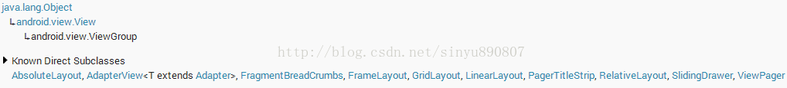

# 事件分发机制

　　如果想给按钮注册一个点击事件，只需要调用：

```java
button.setOnClickListener(new OnClickListener() {
	@Override
	public void onClick(View v) {
		Log.d("TAG", "onClick execute");
	}
});
```

　　这样在 onClick 方法里面写实现，就可以在按钮被点击的时候执行。

　　如果想给这个按钮再添加一个 touch 事件，只需要调用:

```java
button.setOnTouchListener(new OnTouchListener() {
	@Override
	public boolean onTouch(View v, MotionEvent event) {
		Log.d("TAG", "onTouch execute, action " + event.getAction());
		return false;
	}
});
```

　　onTouch 方法里能做的事情比 onClick 要多一些，比如判断手指按下、抬起、移动等事件。

　　那么如果两个事件都注册了，onTouch 是优先于 onClick 执行的，并且 onTouch 执行了两次，一次是 ACTION_DOWN，一次是 ACTION_UO。因此事件传递的顺序是先经过 onTouch，再传递给 onClick。

　　onTouch 方法时候返回值的，如果把 onTouch 方法里的返回值改成 true，onClick 方法不再执行了。

## 源码分析

### 1. 点击事件

　　只要触摸到了任何一个控件，就一定会调用该控件的 dispatchTouchEvent 方法。当去点击按钮的时候，就会去调用 Button 类里的 dispatchTouchEvent 方法，其实调用的是 View 里的 dispatchToucheEvent 方法。

#### 1.1. View#dispatchTouchEvent

```java
    /**
     * Pass the touch screen motion event down to the target view, or this
     * view if it is the target.
     *
     * @param event The motion event to be dispatched.
     * @return True if the event was handled by the view, false otherwise.
     */
    public boolean dispatchTouchEvent(MotionEvent event) {
        // If the event should be handled by accessibility focus first.
        if (event.isTargetAccessibilityFocus()) {
            // We don't have focus or no virtual descendant has it, do not handle the event.
            if (!isAccessibilityFocusedViewOrHost()) {
                return false;
            }
            // We have focus and got the event, then use normal event dispatch.
            event.setTargetAccessibilityFocus(false);
        }

        boolean result = false;

        if (mInputEventConsistencyVerifier != null) {
            mInputEventConsistencyVerifier.onTouchEvent(event, 0);
        }

        final int actionMasked = event.getActionMasked();
        if (actionMasked == MotionEvent.ACTION_DOWN) {
            // Defensive cleanup for new gesture
            stopNestedScroll();
        }

        if (onFilterTouchEventForSecurity(event)) {
            if ((mViewFlags & ENABLED_MASK) == ENABLED && handleScrollBarDragging(event)) {
                result = true;
            }
            //noinspection SimplifiableIfStatement
            ListenerInfo li = mListenerInfo;
            if (li != null && li.mOnTouchListener != null
                    && (mViewFlags & ENABLED_MASK) == ENABLED
                	// 调用 li.mOnTouchListener.onTouch 方法
                    && li.mOnTouchListener.onTouch(this, event)) {
                result = true;
            }
			// 调用 onTouchEvent 方法
            if (!result && onTouchEvent(event)) {
                result = true;
            }
        }

        if (!result && mInputEventConsistencyVerifier != null) {
            mInputEventConsistencyVerifier.onUnhandledEvent(event, 0);
        }

        // Clean up after nested scrolls if this is the end of a gesture;
        // also cancel it if we tried an ACTION_DOWN but we didn't want the rest
        // of the gesture.
        if (actionMasked == MotionEvent.ACTION_UP ||
                actionMasked == MotionEvent.ACTION_CANCEL ||
                (actionMasked == MotionEvent.ACTION_DOWN && !result)) {
            stopNestedScroll();
        }

        return result;
    }
```

　　在 View 的 dispatchTouchEvent 方法内，会进行一个判断，如果 if (li != null && li.mOnTouchListener != null && (mViewFlags & ENABLED_MASK) == ENABLED && li.mOnTouchListener.onTouch(this, event)) 为 true，则返回 true，否则就会执行 onTouchEvent(event) 方法，如果 onTouchEvent(event) 返回的是 true，则返回 true。

　　而判断中的 li 是一个 ListenerInfo 对象，而  li.mOnTouchListener 是一个 OnTouchListener 对象，是在 View 的 setTouchEvent() 方法中设置的：

```java
    /**
     * Register a callback to be invoked when a touch event is sent to this view.
     * @param l the touch listener to attach to this view
     */
    public void setOnTouchListener(OnTouchListener l) {
        getListenerInfo().mOnTouchListener = l;
    }

    ListenerInfo getListenerInfo() {
        if (mListenerInfo != null) {
            return mListenerInfo;
        }
        mListenerInfo = new ListenerInfo();
        return mListenerInfo;
    }
```

　　也就是说只要给控件注册了 touch 事件，mListenerInfo 被初始化了，mOnTouchListener 也被赋值了，

　　第二个条件 (mViewFlags & ENABLE_MASK) == ENABLED 是判断当前点击的控件是否是 enable 的，按钮默认都是 enbale 的，因此这个条件恒定为 true。

　　第三个条件 li.mOnTouchListener.onTouch(this, event) 其实就是去回调控件注册 touch 事件时的 onTouch 方法。也就是说如果在 onTouch 方法里返回 true，就会让这三个条件全部成立，从而整个方法直接返回 true。如果在 onTouch 方法里返回 false，就会再去执行 onTouchEvent(event) 方法。

#### 1.2. View#onTouchEvent

```java
    public boolean onTouchEvent(MotionEvent event) {
        final float x = event.getX();
        final float y = event.getY();
        final int viewFlags = mViewFlags;
        final int action = event.getAction();

        final boolean clickable = ((viewFlags & CLICKABLE) == CLICKABLE
                || (viewFlags & LONG_CLICKABLE) == LONG_CLICKABLE)
                || (viewFlags & CONTEXT_CLICKABLE) == CONTEXT_CLICKABLE;

        if ((viewFlags & ENABLED_MASK) == DISABLED) {
            if (action == MotionEvent.ACTION_UP && (mPrivateFlags & PFLAG_PRESSED) != 0) {
                setPressed(false);
            }
            mPrivateFlags3 &= ~PFLAG3_FINGER_DOWN;
            // A disabled view that is clickable still consumes the touch
            // events, it just doesn't respond to them.
            return clickable;
        }
        if (mTouchDelegate != null) {
            if (mTouchDelegate.onTouchEvent(event)) {
                return true;
            }
        }

        if (clickable || (viewFlags & TOOLTIP) == TOOLTIP) {
            switch (action) {
                case MotionEvent.ACTION_UP:
                    mPrivateFlags3 &= ~PFLAG3_FINGER_DOWN;
                    if ((viewFlags & TOOLTIP) == TOOLTIP) {
                        handleTooltipUp();
                    }
                    if (!clickable) {
                        removeTapCallback();
                        removeLongPressCallback();
                        mInContextButtonPress = false;
                        mHasPerformedLongPress = false;
                        mIgnoreNextUpEvent = false;
                        break;
                    }
                    boolean prepressed = (mPrivateFlags & PFLAG_PREPRESSED) != 0;
                    if ((mPrivateFlags & PFLAG_PRESSED) != 0 || prepressed) {
                        // take focus if we don't have it already and we should in
                        // touch mode.
                        boolean focusTaken = false;
                        if (isFocusable() && isFocusableInTouchMode() && !isFocused()) {
                            focusTaken = requestFocus();
                        }

                        if (prepressed) {
                            // The button is being released before we actually
                            // showed it as pressed.  Make it show the pressed
                            // state now (before scheduling the click) to ensure
                            // the user sees it.
                            setPressed(true, x, y);
                        }

                        if (!mHasPerformedLongPress && !mIgnoreNextUpEvent) {
                            // This is a tap, so remove the longpress check
                            removeLongPressCallback();

                            // Only perform take click actions if we were in the pressed state
                            if (!focusTaken) {
                                // Use a Runnable and post this rather than calling
                                // performClick directly. This lets other visual state
                                // of the view update before click actions start.
                                if (mPerformClick == null) {
                                    mPerformClick = new PerformClick();
                                }
                                if (!post(mPerformClick)) {
                                    performClick();
                                }
                            }
                        }

                        if (mUnsetPressedState == null) {
                            mUnsetPressedState = new UnsetPressedState();
                        }

                        if (prepressed) {
                            postDelayed(mUnsetPressedState,
                                    ViewConfiguration.getPressedStateDuration());
                        } else if (!post(mUnsetPressedState)) {
                            // If the post failed, unpress right now
                            mUnsetPressedState.run();
                        }

                        removeTapCallback();
                    }
                    mIgnoreNextUpEvent = false;
                    break;

                case MotionEvent.ACTION_DOWN:
                    if (event.getSource() == InputDevice.SOURCE_TOUCHSCREEN) {
                        mPrivateFlags3 |= PFLAG3_FINGER_DOWN;
                    }
                    mHasPerformedLongPress = false;

                    if (!clickable) {
                        checkForLongClick(0, x, y);
                        break;
                    }

                    if (performButtonActionOnTouchDown(event)) {
                        break;
                    }

                    // Walk up the hierarchy to determine if we're inside a scrolling container.
                    boolean isInScrollingContainer = isInScrollingContainer();

                    // For views inside a scrolling container, delay the pressed feedback for
                    // a short period in case this is a scroll.
                    if (isInScrollingContainer) {
                        mPrivateFlags |= PFLAG_PREPRESSED;
                        if (mPendingCheckForTap == null) {
                            mPendingCheckForTap = new CheckForTap();
                        }
                        mPendingCheckForTap.x = event.getX();
                        mPendingCheckForTap.y = event.getY();
                        postDelayed(mPendingCheckForTap, ViewConfiguration.getTapTimeout());
                    } else {
                        // Not inside a scrolling container, so show the feedback right away
                        setPressed(true, x, y);
                        checkForLongClick(0, x, y);
                    }
                    break;

                case MotionEvent.ACTION_CANCEL:
                    if (clickable) {
                        setPressed(false);
                    }
                    removeTapCallback();
                    removeLongPressCallback();
                    mInContextButtonPress = false;
                    mHasPerformedLongPress = false;
                    mIgnoreNextUpEvent = false;
                    mPrivateFlags3 &= ~PFLAG3_FINGER_DOWN;
                    break;

                case MotionEvent.ACTION_MOVE:
                    if (clickable) {
                        drawableHotspotChanged(x, y);
                    }

                    // Be lenient about moving outside of buttons
                    if (!pointInView(x, y, mTouchSlop)) {
                        // Outside button
                        // Remove any future long press/tap checks
                        removeTapCallback();
                        removeLongPressCallback();
                        if ((mPrivateFlags & PFLAG_PRESSED) != 0) {
                            setPressed(false);
                        }
                        mPrivateFlags3 &= ~PFLAG3_FINGER_DOWN;
                    }
                    break;
            }

            return true;
        }

        return false;
    }
```

　　在 View 的 onTouchEvent() 方法中如果该控件是可以点击的就会进入到 switch 判断中去，而如果当前的时间是抬起手指，则会进入到 MotionEvent.ACTION_UP 这个 case 当中。在经过种种判断之后，会执行到 performClick() 方法。

#### 1.3. View#performClick()

```java
    public boolean performClick() {
        final boolean result;
        final ListenerInfo li = mListenerInfo;
        if (li != null && li.mOnClickListener != null) {
            playSoundEffect(SoundEffectConstants.CLICK);
            li.mOnClickListener.onClick(this);
            result = true;
        } else {
            result = false;
        }

        sendAccessibilityEvent(AccessibilityEvent.TYPE_VIEW_CLICKED);

        notifyEnterOrExitForAutoFillIfNeeded(true);

        return result;
    }
```

　　可以看到，只要 mOnClickListener 不是 null，就会去调用它的 onClick 方法，那 mOnClickListener 又是在哪里赋值的？查看 setOnClickListener 方法。

#### 1.4. View#setOnClickListener

```java
    public void setOnClickListener(@Nullable OnClickListener l) {
        if (!isClickable()) {
            setClickable(true);
        }
        getListenerInfo().mOnClickListener = l;
    }
```

　　当通过调用 setOnClickListener 方法来给控件注册一个点击事件时，就会给 mOnClickListener 赋值。然后每当空间被点击时，都会在 performClick() 方法里回调被点击控件的 onClick 方法。

### 2. touch 事件的层级传递

　　如果给一个控件注册了 touch 事件，每次点击它的时候都会触发一系列的 ACTION_DOWN、ACTION_MOVE、ACTION_UP 等事件。这里需要注意，如果在执行 ACTION_DOWN 的时候返回了 false，后面一系列其他的 action 就不会再得到执行了。简单地说，就是当 dispatchTouchEvent 在进行事件分发的时候，只有前一个 action 返回 true，才会触发后一个 action。

　　前面的例子中，明明在 onTouch 事件里面返回了 false，ACTION_DOWN 和 ACTION_UP 也得到执行了？参考前面分析的源码，首先在 onTouchEvent 方法的细节。由于点击了按钮，就会进入到 `if (clickable || (viewFlags & TOOLTIP) == TOOLTIP)` 这个 if 判断中，然后不管当前的 action 是什么，最后都一定会走到最后返回一个 true。

　　明明在 onTouch 事件里返回了 false，系统还是在 onTouchEvent 方法中返回了 true。就因为这个原因，才使得前面的例子中 ACTION_UP 可以得到执行。

　　那可以换一个控件，将按钮替换成 ImageView，然后给它也注册一个 touch 事件，并返回 false。如下所示：

```java
imageView.setOnTouchListener(new OnTouchListener() {
	@Override
	public boolean onTouch(View v, MotionEvent event) {
		Log.d("TAG", "onTouch execute, action " + event.getAction());
		return false;
	}
});
```

　　运行一下程序，点击 ImageView，会发现结果如下：

````
onTouch execute, action 0
````

　　在 ACTION_DOWN 执行完后，后面的一系列 action 都不会得到执行了。这又是为什么呢？因为 ImageView 和按钮不同，它是默认不可点击的，因此在 onTouchEvent 的  `if (clickable || (viewFlags & TOOLTIP) == TOOLTIP)` 这个 if 判断无法进入 if 的内部，直接跳过返回了 false，也就导致后面其他的 action 都无法执行了。

## onTouch 和 onTouchEvent 有什么区别，又该如何使用？

　　从源码中可以看出，这两个方法都是在 View 的 dispatchTouchEvent 中调用的，onTouch 优先于 onTouchEvent 执行。如果在 onTouch 方法中通过返回 true 将事件消费掉，onTouchEvent 将不会再执行。

　　另外需要注意的是，onTouch 能够得到执行需要两个前提条件，第一 mOnTouchListener 的值不能为空，第二当前点击的控件必须是 enable 的。因此如果有一个控件是非 enable 的，那么给它注册 onTouch 事件将永远得不到执行。对于这一类控件，如果想要监听它的 touch 事件，就必须通过在该控件中重写 onTouchEvent 方法来实现。

## 为什么给 ListView 引入了一个滑动菜单的功能，ListView 就不能滚动了？

　　滚动菜单的功能是通过给 ListView 注册了一个 touch 事件来实现的。如果在 onTouch 方法里处理完了滑动逻辑后返回 true，那么 ListView 本身的滚动事件就被屏蔽了，自然也就无法滑动（原理同前面例子中按钮不能点击），因此解决方法就是在 onTouch 方法里返回 false。

## ViewGroup 的事件分发

　　ViewGroup 就是一组 View 的集合，它包含很多的子 View 和子 ViewGroup，是 Android 中所有布局的父类或间接父类，像 LinearLayout、RelativeLayout 等都是继承自 ViewGroup 的。但 ViewGroup 实际上也是一个 View，只不过比起 View，它多了可以包含子 View 和定义布局参数的功能。

　　ViewGroup 继承结构示意图如下所示：



　　可以看到，经常用到的各种布局，全部属于 ViewGroup 的子类。

　　通过一个 Demo 来演示一下 Android 中 ViewGroup 的事件分发流程。


　　


## 参考文章
1. [Android事件分发机制完全解析，带你从源码的角度彻底理解(上)](https://blog.csdn.net/guolin_blog/article/details/9097463)
2. [Android事件分发机制完全解析，带你从源码的角度彻底理解(下)](https://blog.csdn.net/sinyu890807/article/details/9153747)
3. [Android ViewGroup事件分发机制](https://blog.csdn.net/lmj623565791/article/details/39102591)
4. [面试：讲讲 Android 的事件分发机制](https://www.jianshu.com/p/d3758eef1f72)