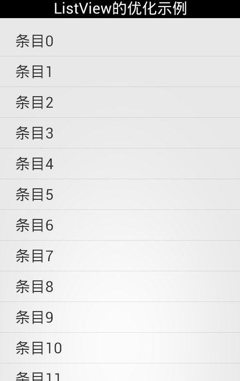

# Android 中 ListView 的几种常见的优化方式

先给出一个没有任何优化的 ListView 的 Adapter，这里都继承自 BaseAdapter，使用一个包含 100 个字符串的 List 集合来作为 ListView 的项目所要显示的内容，每一个条目都是自定义的组件，这个组件中只包含一个 textView。



代码：

```java
    package com.alexchen.listviewoptimize;  

    import java.util.ArrayList;  
    import java.util.List;  
    import android.app.Activity;  
    import android.os.Bundle;  
    import android.view.Menu;  
    import android.view.MenuItem;  
    import android.view.View;  
    import android.view.ViewGroup;  
    import android.widget.BaseAdapter;  
    import android.widget.ListView;  
    import android.widget.TextView;  

    public class MainActivity extends Activity {  

        private ListView lv_demo;  
        private List<String> list;  

        @Override  
        protected void onCreate(Bundle savedInstanceState) {  
            super.onCreate(savedInstanceState);  
            setContentView(R.layout.activity_main);  
            lv_demo = (ListView) findViewById(R.id.lv_demo);  
            //list为要加载的条目文本的集合，这里总共是100条  
            list = new ArrayList<String>();  
            for (int i = 0; i < 100; i++) {  
                list.add("条目" + i);  
            }  

            lv_demo.setAdapter(new MyAdapter());  
        }  

        private class MyAdapter extends BaseAdapter {  

            @Override  
            public int getCount() {  
                return list.size();  
            }  

            @Override  
            public View getView(int position, View convertView, ViewGroup parent) {  
                //listview_item里只有一个textview  
                View view = View.inflate(MainActivity.this, R.layout.listview_item,  
                        null);  
                //使用每一次都findviewById的方法来获得listview_item内部的组件  
                TextView tv_item = (TextView) view.findViewById(R.id.tv_item);  
                tv_item.setText(list.get(position));  
                return view;  
            }  

            @Override  
            public Object getItem(int position) {  
                return null;  
            }  

            @Override  
            public long getItemId(int position) {  
                return 0;  
            }  

        }  
    }  
```

## 优化一：复用 convertView

也是最普通的优化，就在 MyAdapter 类中的 getView 方法中，上面的写法每次需要一个 View 对象时，都是去重新 inflate 一个 View 出来返回去，没有实现 View 对象的复用，而实际上对于 ListView 而言，只需要保留能够显示的最大个数的 view 即可，其他新的 view 可以通过复用的方式使用消失的条目的 view，而 getView 方法里也提供了一个参数：convertView，这个就代表着可以复用的 view 对象，当然这个对象也可能为空，当它为空的时候，表示该条目 view 第一次创建，所以需要 inflate 一个 view 出来，所以在这里，使用下面这种方式来重写 getView 方法：

```java
@Override  
    public View getView(int position, View convertView, ViewGroup parent) {  
        View view;  
        // 判断convertView的状态，来达到复用效果  
        if (null == convertView) {  
            //如果convertView为空，则表示第一次显示该条目，需要创建一个view  
            view = View.inflate(MainActivity.this, R.layout.listview_item,  
                    null);  
        } else {  
            //否则表示可以复用convertView  
            view = convertView;  
        }  
        // listview_item里只有一个textview  
        TextView tv_item = (TextView) view.findViewById(R.id.tv_item);  
        tv_item.setText(list.get(position));  
        return view;  
    }  
```
## 优化二：使用 ViewHolder

上面是对 view 对象的复用做的优化，经过上面的优化之后，不需要每一个 view 都重新生成了。下面来解决下一个每一次都需要做的工作，那就是 view 中组件的查找：
TextView tv_item = (TextView) view.findViewById(R.id.tv_item);
实际上，findViewById 是到 xml 文件中去查找对应的 id，可以想象如果组件多的话也是挺费事的，如果可以让 view 内的组件也随着 view 的复用而复用，那该是多美好的一件事啊。实际上谷歌也推荐了一种优化方法来做应对，那就是重新建一个内部静态类，里面的成员变量跟 view 中所包含的组件个数类型相同，这里的 view 只包含了一个TextView，所以这个静态类如下：

```java
private static class ViewHolder {  
    private TextView tvHolder;  
}  
```
不过，如果 item 过多的话，建议不要使用。因为 static 是 Java 中的一个关键字，当用它来修饰成员变量时，那么该变量就属于该类，而不是该类的实例。所以用 static 修饰的变量，它的生命周期是很长的，如果用它来引用一些资源耗费过多的实例（比如 Context 的情况最多），这时就要尽量避免使用了。

那么这个 viewHolder 类要如何使用才可以达到复用效果呢？基本思路就是在 convertView 为 null 的时候，不仅重新 inflate 出来一个 view，并且还需要进行 findviewbyId 的查找工作，但是同时还需要获取一个 ViewHolder 类的对象，并将 findviewById 的结果赋值给 ViewHolder 中对应的成员变量。最后将 holder 对象与该 view 对象 “ 绑 ” 在一块。

当 convertView 不为 null 时，让 view=converView，同时取出这个 view 对应的 holder 对象，就获得了这个 view 对象中的 TextView 组件，它就是 holder 中的成员变量，这样在复用的时候，就不需要再去 findViewById 了，只需要在最开始的时候进行数次查找工作就可以了。这里的关键在于如何将 view 与 holder 对象进行绑定，那么就需要用到两个方法：setTag 和 getTag 方法了：

```java
    @Override  
        public View getView(int position, View convertView, ViewGroup parent) {  
            View view;  
            ViewHolder holder;  
            // 判断 convertView 的状态，来达到复用效果  
            if (null == convertView) {  
                // 如果 convertView 为空，则表示第一次显示该条目，需要创建一个 view  
                view = View.inflate(MainActivity.this, R.layout.listview_item,  
                        null);  
                //新建一个viewholder对象  
                holder = new ViewHolder();  
                //将findviewbyID的结果赋值给holder对应的成员变量  
                holder.tvHolder = (TextView) view.findViewById(R.id.tv_item);  
                // 将holder与view进行绑定  
                view.setTag(holder);  
            } else {  
                // 否则表示可以复用convertView  
                view = convertView;  
                holder = (ViewHolder) view.getTag();  
            }  
            // 直接操作holder中的成员变量即可，不需要每次都findViewById  
            holder.tvHolder.setText(list.get(position));  
            return view;  
        }  
```

经过上面的做法，可能大家感觉不太到优化的效果，根据Google的文档，实际优化效果在百分之5左右。

## 优化三：分页加载

上面的两个例子中 ListView 都是显示的本地的 List 中的内容，List 的长度也只有 100 个，可以毫不费力一次性加载完这 100 个数据；但是实际应用中，往往会需要使用 Listview 来显示网络上的内容，比如说拿使用 ListView 显示新闻为例：

其一：假如网络情况很好，使用的手机也许能够一下子加载完所有新闻数据，然后显示在 ListView 中，用户可能感觉还好，假如说在网络不太顺畅的情况下，用户加载完所有网络的数据，可能这个 list 是 1000 条新闻，那么用户可能需要面对一个空白的 Activity 好几分钟，这个显然是不合适的。

其二：Android 虚拟机给每个应用分配的运行时内存是一定的，一般性能不太好的机器只有 16M，好一点的可能也就是 64M 的样子，假如说现在要浏览的新闻总数为一万条，即便是网络很好的情况下，可以很快的加载完毕，但是多数情况下也会出现内存溢出从而导致应用崩溃的情况。

那么为了解决上面的两个问题，需要进行分批加载，比如说 1000 条新闻的 List 集合，一次加载 20 条，等到用户翻页到底部的时候，再添加下面的 20 条到 List 中，再使用 Adapter 刷新 ListView，这样用户一次只需要等待 20 条数据的传输时间，不需要一次等待好几分钟把数据都加载完再在 ListView 上显示。其次这样也可以缓解很多条新闻一次加载进行产生 OOM 应用崩溃的情况。

实际上，分批加载也不能完全解决问题，因为虽然在分批中一次只增加 20 条数据到 List 集合中，然后再刷新到 ListView 中去，假如有 10 万条数据，如果顺利读到最后这个 List 集合中还是会累积海量条数的数据，还是可能会造成 OOM 的情况，这时候就需要用到分页，比如说将这 10 万条数据分为 1000 页，每一页 100 条数据，每一页加载时都覆盖掉上一页中 List 集合中的内容，然后每一页内再使用分批加载，这样用户的体验就会相对好一些。

## 优化四：图片优化

1、处理图片的方式：
如果自定义 Item 中有涉及到图片等等的，一定要狠狠的处理图片，图片占的内存是 ListView 项中最恶心的，处理图片的方法大致有以下几种：

①、不要直接拿路径就去循环 decodeFile(); 使用 Option 保存图片大小、不要加载图片到内存去。

②、拿到的图片一定要经过边界压缩。

③、在 ListView 中取图片时也不要直接拿个路径去取图片，而是以 WeakReference（使用 WeakReference 代替强引用。
比如可以使用 WeakReference 、SoftReference、WeakHashMap 等的来存储图片信息，是图片信息不是图片哦！
④、在 getView 中做图片转换时，产生的中间变量一定及时释放。

2、异步加载图片基本思想：
1）、 先从内存缓存中获取图片显示（内存缓冲）
2）、获取不到的话从 SD 卡里获取（SD 卡缓冲）
3）、都获取不到的话从网络下载图片并保存到 SD 卡同时加入内存并显示（视情况看是否要显示）。

原理：

优化一：先从内存中加载，没有则开启线程从 SD 卡或网络中获取，这里注意从 SD 卡获取图片是放在子线程里执行的，否则快速滑屏的话会不够流畅。
优化二：与此同时，在 adapter 里有个 busy 变量，表示 listview 是否处于滑动状态，如果是滑动状态则仅从内存中获取图片，没有的话无需再开启线程去外存或网络获取图片。
优化三：ImageLoader 里的线程使用了线程池，从而避免了过多线程频繁创建和销毁，每次总是 new 一个线程去执行这是非常不可取的，好一点的用的 AsyncTask 类，其实内部也是用到了线程池。在从网络获取图片时，先是将其保存到 sd 卡，然后再加载到内存，这么做的好处是在加载到内存时可以做个压缩处理，以减少图片所占内存。
Tips：这里可能出现图片乱跳（错位）的问题：
图片错位问题的本质源于 listview 使用了缓存 convertView，假设一种场景，一个 listview 一屏显示九个 item，那么在拉出第十个 item 的时候，事实上该 item 是重复使用了第一个 item，也就是说在第一个 item 从网络中下载图片并最终要显示的时候，其实该 item 已经不在当前显示区域内了，此时显示的后果将可能在第十个 item 上输出图像，这就导致了图片错位的问题。所以解决之道在于可见则显示，不可见则不显示。在 ImageLoader 里有个 imageViews 的 map 对象，就是用于保存当前显示区域图像对应的 url 集，在显示前判断处理一下即可。

## ListView 的其他优化

1、尽量避免在 BaseAdapter 中使用 static 来定义全局静态变量：
static 是 Java 中的一个关键字，当用它来修饰成员变量时，那么该变量就属于该类，而不是该类的实例。所以用 static 修饰的变量，它的生命周期是很长的，如果用它来引用一些资源耗费过多的实例（比如 Context 的情况最多），这时就要尽量避免使用了。

2、尽量使用 getApplicationContext：
如果为了满足需求下必须使用 Context 的话：Context 尽量使用 Application Context，因为 Application 的 Context 的生命周期比较长，引用它不会出现内存泄露的问题。

3、尽量避免在 ListView 适配器中使用线程：
因为线程产生内存泄露的主要原因在于线程生命周期的不可控制。之前使用的自定义 ListView 中适配数据时使用 AsyncTask 自行开启线程的，这个比用 Thread 更危险，因为 Thread 只有在 run 函数不结束时才出现这种内存泄露问题，然而 AsyncTask 内部的实现机制是运用了线程执行池（ThreadPoolExcutor），这个类产生的 Thread 对象的生命周期是不确定的，是应用程序无法控制的，因此如果 AsyncTask 作为 Activity 的内部类，就更容易出现内存泄露的问题。解决办法如下：
①、将线程的内部类，改为静态内部类。
②、在线程内部采用弱引用保存 Context 引用。

# 参考文章

1. [Android中ListView的几种常见的优化方法](https://blog.csdn.net/leexiaobin1993/article/details/50956231)


