# MVI

## 总体架构

### 两个架构原则

Android 的架构设计原则主要有两个

**分离关注点**

要遵循的最重要的原则是分离关注点。一种常见的错误是在一个 `Activity` 或 `Fragment` 中编写所有代码。这些基于界面的类应仅包含处理界面和操作系统交互的逻辑。总得来说，`Activity`或`Fragment`中的代码应该尽量精简，尽量将业务逻辑迁移到其它层。

**通过数据驱动界面**

另一个重要原则是应该通过数据驱动界面（最好是持久性模型）。数据模型独立于应用中的界面元素和其他组件。
这意味着它们与界面和应用组件的生命周期没有关联，但仍会在操作系统决定从内存中移除应用的进程时被销毁。
数据模型与界面元素，生命周期解耦，因此方便复用，同时便于测试，更加稳定可靠。

### 推荐的应用架构

基于上一部分提到的常见架构原则，每个应用应至少有两个层：

- 界面层 - 在屏幕上显示应用数据。
- 数据层 - 提供所需要的应用数据。

可以额外添加一个名为 “ 网域层 ” 的架构层，以简化和复用使用界面层与数据层之间的交互。

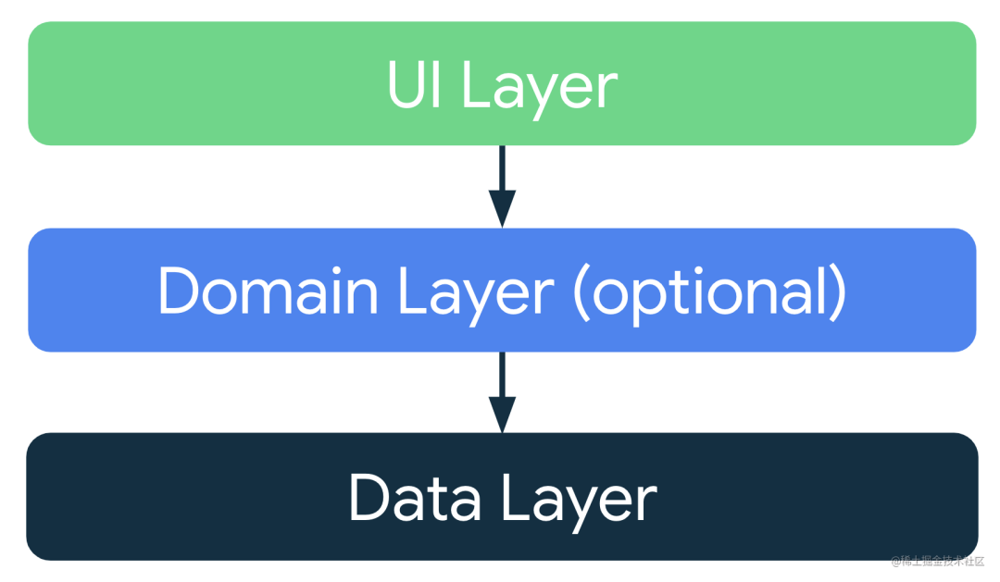

如上所示，各层之间的依赖关系是单向依赖的，网域层，数据层不依赖于界面层。

### 界面层

界面的作用是在屏幕上显示应用数据，并响应用户的点击。每当数据发生变化时，无论是因为用户互动（例如按了某个按钮），还是因为外部输入（例如网络响应），界面都应随之更新，以反映这些变化。
不过，从数据层获取的应用数据的格式通常不同于`UI`需要展示的数据的格式，因此需要将数据层数据转化为页面的状态。

因此界面层一般分为两部分，即`UI`层与`State Holder`，`State Holder`的角色一般由`ViewModel`承担。

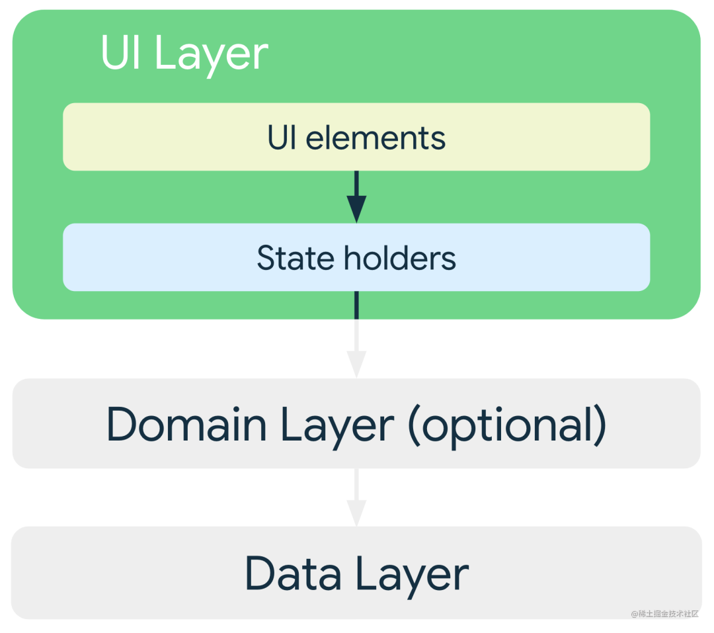

数据层的作用是存储和管理应用数据，以及提供对应用数据的访问权限，因此界面层必须执行以下步骤：

1. 获取应用数据，并将其转换为`UI`可以轻松呈现的`UI State`。
2. 订阅`UI State`，当页面状态发生改变时刷新`UI`
3. 接收用户的输入事件，并根据相应的事件进行处理，从而刷新`UI State`
4. 根据需要重复第 1-3 步。

主要是一个单向数据流动，如下图所示：

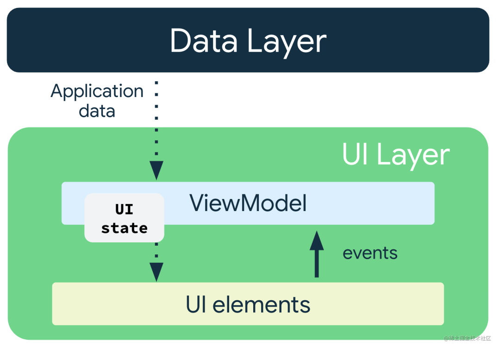

因此界面层主要需要做以下工作：

1. 如何定义`UI State`。
2. 如何使用单向数据流 (`UDF`)，作为提供和管理`UI State`的方式。
3. 如何暴露与更新`UI State`
4. 如何订阅`UI State`

#### 如何定义 UI State

如果要实现一个新闻列表界面，该怎么定义`UI State`呢?将界面需要的所有状态都封装在一个`data class`中。
与之前的`MVVM`模式的主要区别之一也在这里，即之前通常是一个`State`对应一个`LiveData`，而`MVI`架构则强调对`UI State`的集中管理。

```kotlin
data class NewsUiState(
    val isSignedIn: Boolean = false,
    val isPremium: Boolean = false,
    val newsItems: List<NewsItemUiState> = listOf(),
    val userMessages: List<Message> = listOf()
)

data class NewsItemUiState(
    val title: String,
    val body: String,
    val bookmarked: Boolean = false,
    ...
)
```

以上示例中的`UI State`定义是不可变的。这样的主要好处是，不可变对象可保证即时提供应用的状态。这样一来，`UI`便可专注于发挥单一作用：读取`UI State`并相应地更新其`UI`元素。因此，切勿直接在`UI`中修改`UI State`。违反这个原则会导致同一条信息有多个可信来源，从而导致数据不一致的问题。

例如，如上中来自`UI State`的`NewsItemUiState`对象中的`bookmarked`标记在`Activity`类中已更新，那么该标记会与数据层展开竞争，从而产生多数据源的问题。

#### UI State 集中管理的优缺点

在`MVVM`中通常是多个数据流，即一个`State`对应一个`LiveData`，而`MVI`中则是单个数据流。两者各有什么优缺点？

单个数据流的优点主要在于方便，减少模板代码，添加一个状态只需要给`data class`添加一个属性即可，可以有效地降低`ViewModel`与`View`的通信成本
同时`UI State`集中管理可以轻松地实现类似`MediatorLiveData`的效果，比如可能只有在用户已登录并且是付费新闻服务订阅者时，才需要显示书签按钮。您可以按如下方式定义`UI State`：

```kotlin
data class NewsUiState(
    val isSignedIn: Boolean = false,
    val isPremium: Boolean = false,
    val newsItems: List<NewsItemUiState> = listOf()
){
 val canBookmarkNews: Boolean get() = isSignedIn && isPremium
}
```

如上所示，书签的可见性是其它两个属性的派生属性，其它两个属性发生变化时，`canBookmarkNews`也会自动变化，当需要实现书签的可见与隐藏逻辑，只需要订阅`canBookmarkNews`即可，这样可以轻松实现类似`MediatorLiveData`的效果，但是远比`MediatorLiveData`要简单。

当然，`UI State`集中管理也会有一些问题：

- 不相关的数据类型：`UI`所需的某些状态可能是完全相互独立的。在此类情况下，将这些不同的状态捆绑在一起的代价可能会超过其优势，尤其是当其中某个状态的更新频率高于其他状态的更新频率时。
- `UiState diffing`：`UiState` 对象中的字段越多，数据流就越有可能因为其中一个字段被更新而发出。由于视图没有 `diffing` 机制来了解连续发出的数据流是否相同，因此每次发出都会导致视图更新。当然，我们可以对 `LiveData` 或`Flow`使用 `distinctUntilChanged()` 等方法来实现局部刷新，从而解决这个问题。

#### 使用单向数据流管理 UI State

上文提到，为了保证`UI`中不能修改状态，`UI State`中的元素都是不可变的，那么如何更新`UI State`呢？
一般使用`ViewModel`作为`UI State`的容器，因此响应用户输入更新`UI State`主要分为以下几步：

1. `ViewModel` 会存储并公开`UI State`。`UI State`是经过`ViewModel`转换的应用数据。
2. `UI`层会向`ViewModel`发送用户事件通知。
3. `ViewModel`会处理用户操作并更新`UI State`。
4. 更新后的状态将反馈给`UI`以进行呈现。
5. 系统会对导致状态更改的所有事件重复上述操作。

举个例子，如果用户需要给新闻列表加个书签，那么就需要将事件传递给`ViewModel`，然后`ViewModel`更新`UI State`(中间可能有数据层的更新)，`UI`层订阅`UI State`订响应刷新，从而完成页面刷新，如下图所示：

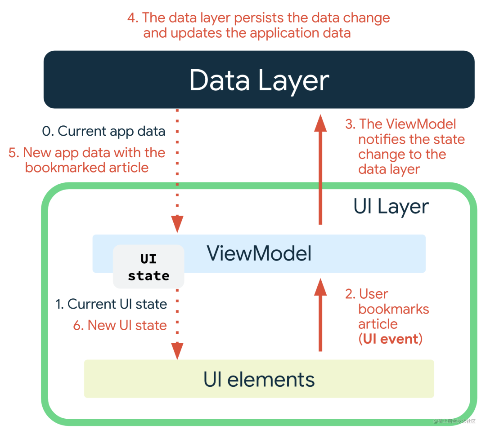

#### 为什么使用单向数据流动？

单向数据流动可以实现关注点分离原则，它可以将状态变化来源位置、转换位置以及最终使用位置进行分离。
这种分离可让`UI`只发挥其名称所表明的作用：通过观察`UI State`变化来显示页面信息，并将用户输入传递给`ViewModel`以实现状态刷新。

换句话说，单向数据流动有助于实现以下几点：

1. 数据一致性。界面只有一个可信来源。
2. 可测试性。状态来源是独立的，因此可独立于界面进行测试。
3. 可维护性。状态的更改遵循明确定义的模式，即状态更改是用户事件及其数据拉取来源共同作用的结果。

### 暴露与更新 UI State

定义好`UI State`并确定如何管理相应状态后，下一步是将提供的状态发送给界面。可以使用`LiveData`或者`StateFlow`将`UI State`转化为数据流并暴露给`UI`层
为了保证不能在`UI`中修改状态，应该定义一个可变的`StateFlow`与一个不可变的`StateFlow`，如下所示：

```kotlin
class NewsViewModel(...) : ViewModel() {

    private val _uiState = MutableStateFlow(NewsUiState())
    val uiState: StateFlow<NewsUiState> = _uiState.asStateFlow()

    ...

}

```

这样一来，`UI`层可以订阅状态，而`ViewModel`也可以修改状态，以需要执行异步操作的情况为例，可以使用`viewModelScope`启动协程，并且可以在操作完成时更新状态。

```kotlin
class NewsViewModel(
    private val repository: NewsRepository,
    ...
) : ViewModel() {

    private val _uiState = MutableStateFlow(NewsUiState())
    val uiState: StateFlow<NewsUiState> = _uiState.asStateFlow()

    private var fetchJob: Job? = null

    fun fetchArticles(category: String) {
        fetchJob?.cancel()
        fetchJob = viewModelScope.launch {
            try {
                val newsItems = repository.newsItemsForCategory(category)
                _uiState.update {
                    it.copy(newsItems = newsItems)
                }
            } catch (ioe: IOException) {
                // Handle the error and notify the notify the UI when appropriate.
                _uiState.update {
                    val messages = getMessagesFromThrowable(ioe)
                    it.copy(userMessages = messages)
                 }
            }
        }
    }
}
```

在上面的示例中，`NewsViewModel` 类会尝试进行网络请求，然后更新`UI State`，然后`UI`层可以对其做出适当反应。

#### 订阅 UI State

订阅`UI State`很简单，只需要在`UI`层观察并刷新`UI`即可。

```java
class NewsActivity : AppCompatActivity() {
    override fun onCreate(savedInstanceState: Bundle?) {
        lifecycleScope.launch {
            repeatOnLifecycle(Lifecycle.State.STARTED) {
                viewModel.uiState.collect {
                    // Update UI elements
                }
            }
        }
    }
}
```

#### UI State 实现局部刷新

因为`MVI`架构下实现了`UI State`的集中管理，因此更新一个属性就会导致`UI State`的更新，那么在这种情况下怎么实现局部刷新呢？
可以利用`distinctUntilChanged`实现，`distinctUntilChanged`只有在值发生变化了之后才会回调刷新，相当于对属性做了一个防抖，因此可以实现局部刷新，使用方式如下所示：

```java
class NewsActivity : AppCompatActivity() {
    override fun onCreate(savedInstanceState: Bundle?) {
        lifecycleScope.launch {
            repeatOnLifecycle(Lifecycle.State.STARTED) {
                // Bind the visibility of the progressBar to the state
                // of isFetchingArticles.
                viewModel.uiState
                    .map { it.isFetchingArticles }
                    .distinctUntilChanged()
                    .collect { progressBar.isVisible = it }
            }
        }
    }
}
```

当然也可以对其进行一定的封装，给`Flow`或者`LiveData`添加一个扩展函数，令其支持监听属性即可，使用方式如下所示：

```java
class MainActivity : AppCompatActivity() {
 private fun initViewModel() {
        viewModel.viewStates.run {
            //监听newsList
            observeState(this@MainActivity, MainViewState::newsList) {
                newsRvAdapter.submitList(it)
            }
            //监听网络状态
            observeState(this@MainActivity, MainViewState::fetchStatus) {
                //..
            }
        }
    }
}
```

### 网域层

网域层是位于界面层和数据层之间的可选层。

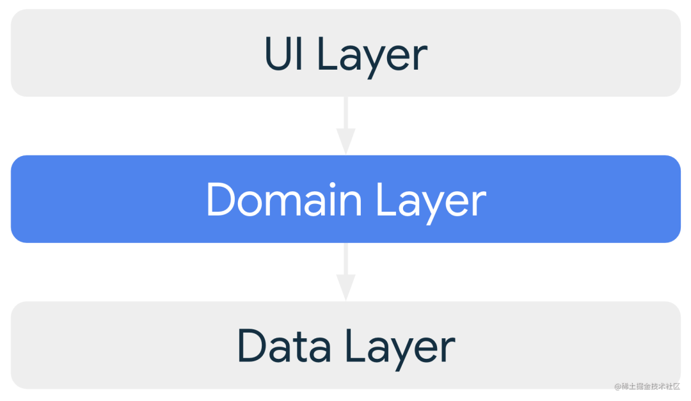

网域层负责封装复杂的业务逻辑，或者由多个`ViewModel`重复使用的简单业务逻辑。此层是可选的，因为并非所有应用都有这类需求。因此，应仅在需要时使用该层。
网域层具有以下优势：

1. 避免代码重复。
2. 改善使用网域层类的类的可读性。
3. 改善应用的可测试性。
4. 能够划分好职责，从而避免出现大型类。

对于常见的`APP`，网域层似乎并没有必要，对于`ViewModel`重复的逻辑，使用`util`来说一般就已足够。

### 数据层

数据层主要负责获取与处理数据的逻辑，数据层由多个`Repository`组成，其中每个`Repository`可包含零到多个`Data Source`。应该为应用处理的每种不同类型的数据创建一个`Repository`类。例如，可以为与电影相关的数据创建 `MoviesRepository` 类，或者为与付款相关的数据创建 `PaymentsRepository` 类。当然为了方便，针对只有一个数据源的`Repository`，也可以将数据源的代码也写在`Repository`，后续有多个数据源时再做拆分。

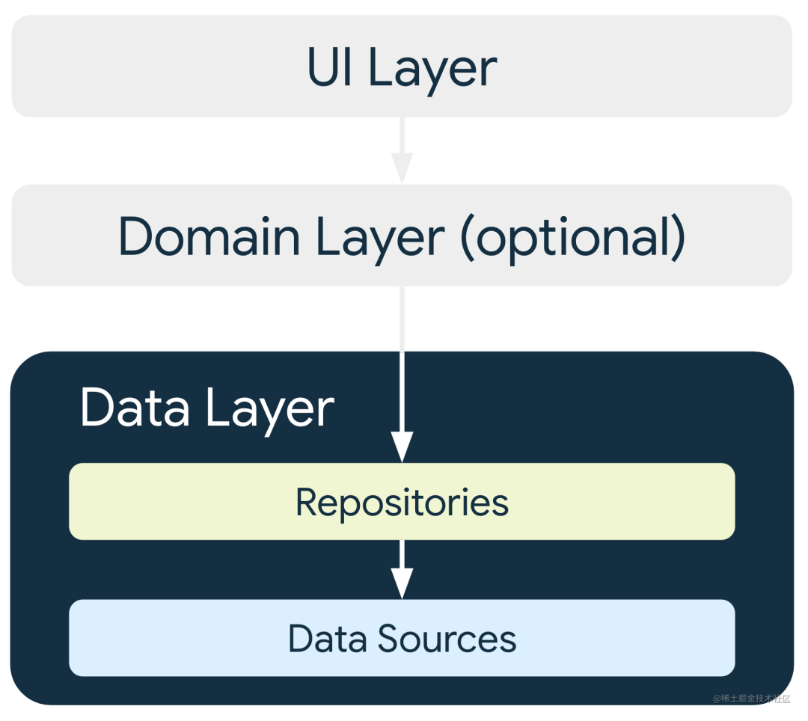

数据层跟之前的`MVVM`架构下的数据层并没用什么区别。

### 总结

相比老版的架构指南，新版主要是增加了网域层并修改了界面层，其中网域层是可选的，各位各根据自己的项目需求使用。
而界面层则从`MVVM`架构变成了`MVI`架构，强调了数据的`单向数据流动`与`状态的集中管理`。相比`MVVM`架构，`MVI`架构主要有以下优点：

1. 强调数据单向流动，很容易对状态变化进行跟踪和回溯，在数据一致性、可测试性、可维护性上都有一定优势。
2. 强调对`UI State`的集中管理，只需要订阅一个`ViewState`便可获取页面的所有状态，相对 `MVVM` 减少了不少模板代码。
3. 添加状态只需要添加一个属性，降低了`ViewModel`与`View`层的通信成本，将业务逻辑集中在`ViewModel`中，`View`层只需要订阅状态然后刷新即可。

当然在软件开发中没有最好的架构，只有最合适的架构，各位可根据情况选用适合项目的架构，实际上`Google`在指南中推荐使用`MVI`而不再是`MVVM`，很可能是为了统一`Android`与`Compose`的架构。因为在`Compose`中并没有双向数据绑定，只有单向数据流动，因此`MVI`是最适合`Compose`的架构。

当然如果项目中没有使用`DataBinding`，或许也可以开始尝试一下使用`MVI`，不使用`DataBinding`的`MVVM`架构切换为`MVI`成本不高，切换起来也比较简单，在易用性，数据一致性，可测试性，可维护性等方面都有一定优势，后续也可以无缝切换到`Compose`。

## 1. 经典框架介绍

### MVC 框架介绍

MVC 是个古老的 Android 开发架构，随着 MVP 与 MVVM 的流行已经逐渐退出历史舞台，在这里做一个简单的介绍，其架构图如下所示：

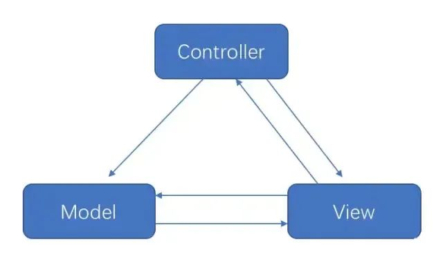

MVC 架构主要分为以下几部分：

1. **视图层（View）**：对应于 xml 布局文件和 java 代码动态 view 部分。

2. **控制层（Controller）**：主要负责业务逻辑，在 android 中由 Activity 承担，同时因为 XML 视图功能太弱，所以 Activity 既要负责视图的显示又要加入控制逻辑，承担的功能过多。

3. **模型层（Model）**：主要负责网络请求，数据库处理，I/O 的操作，即页面的数据来源。

由于 android 中 xml 布局的功能性太弱，Activity 实际上负责了 View 层与 Controller 层两者的工作，所以在 android 中 mvc 更像是这种形式：


因此 MVC 架构在 android 平台上的主要存在以下问题：

1. Activity 同时负责 View 与 Controller 层的工作，违背了单一职责原则。

2. Model 层与 View 层存在耦合，存在互相依赖，违背了最小知识原则。

### MVP 框架介绍

由于 MVC 架构在 Android 平台上的一些缺陷，MVP 也就应运而生了，其架构图如下所示：

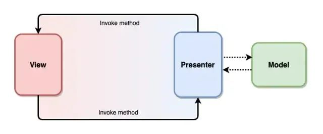

MVP 架构主要分为以下几个部分：

1. View 层：对应于 Activity 与 XML，只负责显示 UI，只与 Presenter 层交互，与 Model 层没有耦合。

2. Presenter 层：主要负责处理业务逻辑，通过接口回调 View 层。

3. Model 层：主要负责网络请求，数据库处理等操作，这个没有什么变化。

可以看到，MVP 解决了 MVC 的两个问题，即 Activity 承担了两层职责与 View 层与 Model 层耦合的问题。

但 MVP 架构同样有自己的问题：

1. Presenter 层通过接口与 View 通信，实际上持有了 View 的引用。

2. 但是随着业务逻辑的增加，一个页面可能会非常复杂，这样就会造成 View 的接口会很庞大。

### **MVVM架构介绍**

MVVM 模式将 Presenter 改名为 ViewModel，基本上与 MVP 模式完全一致。

唯一的区别是，它采用双向数据绑定（data-binding）：View 的变动，自动反映在 ViewModel，反之亦然。

MVVM 架构图如下所示：

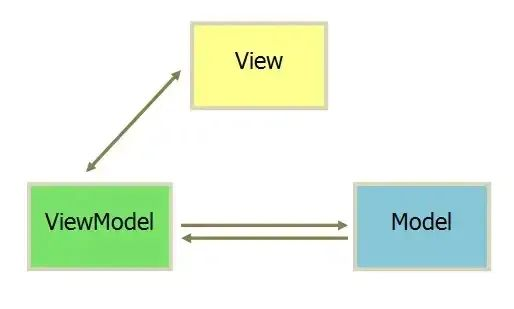

可以看出 MVVM 与 MVP 的主要区别在于，不用去主动去刷新 UI 了，只要 Model 数据变了，会自动反映到 UI 上。换句话说，MVVM 更像是自动化的 MVP。

MVVM 的双向数据绑定主要通过 DataBinding 实现，不过有很多人是不喜欢用DataBinding的，这样架构就变成了下面这样：

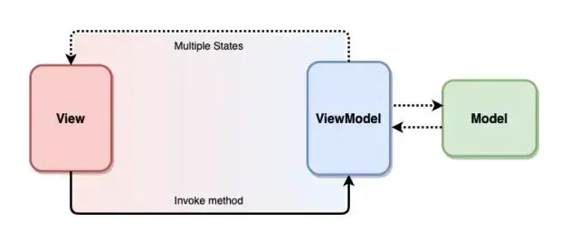

1. View 观察 ViewModle 的数据变化并自我更新，这其实是单一数据源而不是双向数据绑定，所以其实 MVVM 的这一大特性其实并没有用到。

2. View 通过调用 ViewModel 提供的方法来与 ViewMdoel 交互。

### 小结

1. MVC 架构的主要问题在于 Activity 承担了 View 与 Controller 两层的职责，同时 View 层与 Model 层存在耦合。

2. MVP 引入 Presenter 层解决了 MVC 架构的两个问题，View 只能与 Presenter 层交互，业务逻辑放在 Presenter 层。

3. MVP 的问题在于随着业务逻辑的增加，View 的接口会很庞大，MVVM 架构通过双向数据绑定可以解决这个问题。

4. MVVM 与 MVP 的主要区别在于，不用去主动去刷新 UI 了，只要 Model 数据变了，会自动反映到 UI 上。换句话说，MVVM 更像是自动化的 MVP。

5. MVVM 的双向数据绑定主要通过 DataBinding 实现，但有很多人不喜欢用 DataBinding，而是 View 通过 LiveData 等观察 ViewModle 的数据变化并自我更新，这其实是单一数据源而不是双向数据绑定。

## 2. MVI 架构到底是什么？

### MVVM 框架有什么不足？

相信使用 MVVM 架构的同学都有如下经验，为了保证数据流的单向流动，LiveData 向外暴露时需要转化成 immutable 的，这需要添加不少模板代码并且容易遗忘，如下所示：

```kotlin
class TestViewModel : ViewModel() {
    //为保证对外暴露的LiveData不可变，增加一个状态就要添加两个LiveData变量
    private val _pageState: MutableLiveData<PageState> = MutableLiveData()
    val pageState: LiveData<PageState> = _pageState
    private val _state1: MutableLiveData<String> = MutableLiveData()
    val state1: LiveData<String> = _state1
    private val _state2: MutableLiveData<String> = MutableLiveData()
    val state2: LiveData<String> = _state2
    //...
}
```

如上所示，如果页面逻辑比较复杂，ViewModel 中将会有许多全局变量的 LiveData，并且每个 LiveData 都必须定义两遍，一个可变的，一个不可变的。这其实就是通过 MVVM 架构写比较复杂页面时最难受的点。

其次就是 View 层通过调用 ViewModel 层的方法来交互的，View 层与 ViewModel 的交互比较分散，不成体系。

小结一下，在使用中，MVVM 架构主要有以下不足：

1. 为保证对外暴露的 LiveData 是不可变的，需要添加不少模板代码并且容易遗忘。

2. View 层与 ViewModel 层的交互比较分散零乱，不成体系。

### MVI 架构是什么？

MVI 与 MVVM 很相似，其借鉴了前端框架的思想，更加强调数据的单向流动和唯一数据源，架构图如下所示：

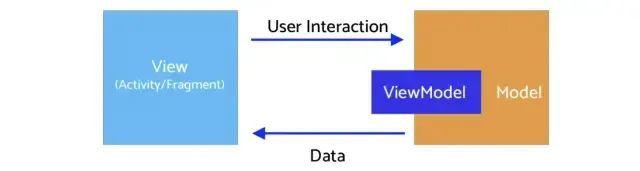

其主要分为以下几部分：

1. Model: 与 MVVM 中的 Model 不同的是，MVI 的 Model 主要指 UI 状态（State）。例如页面加载状态、控件位置等都是一种 UI 状态。

2. View: 与其他 MVX 中的 View 一致，可能是一个 Activity 或者任意 UI 承载单元。MVI 中的 View 通过订阅 Intent 的变化实现界面刷新。（注意：这里不是Activity 的 Intent）

3. Intent: 此 Intent 不是 Activity 的 Intent，用户的任何操作都被包装成 Intent 后发送给 Model 层进行数据请求。

### 单向数据流

MVI 强调数据的单向流动，主要分为以下几步：

1. 用户操作以 Intent 的形式通知 Model。

2. Model 基于 Intent 更新 State。

3. View 接收到 State 变化刷新 UI。

数据永远在一个环形结构中单向流动，不能反向流动：

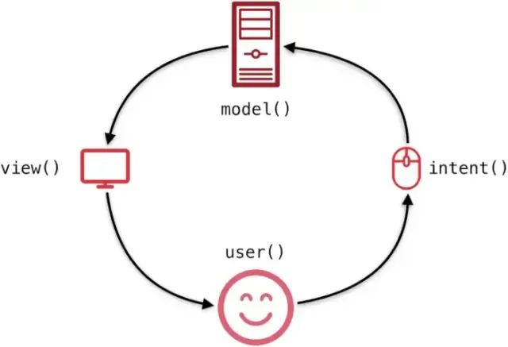

## 3. MVI 架构实战

### 总体架构图


使用 ViewModel 来承载 MVI 的 Model 层，总体结构也与 MVVM 类似，主要区别在于 Model 与 View 层交互的部分。

1. Model 层承载 UI 状态，并暴露出 ViewState 供 View 订阅，ViewState 是个 data class，包含所有页面状态。

2. View 层通过 Action 更新 ViewState，替代 MVVM 通过调用 ViewModel 方法交互的方式。

### MVI 实例介绍

#### 添加 ViewState 与 ViewEvent

ViewState 承载页面的所有状态，ViewEvent 则是一次性事件，如 Toast 等，如下所示： 

```kotlin
data class MainViewState(val fetchStatus: FetchStatus, val newsList: List<NewsItem>)  

sealed class MainViewEvent {
    data class ShowSnackbar(val message: String) : MainViewEvent()
    data class ShowToast(val message: String) : MainViewEvent()
}
```

1. 这里 ViewState 只定义了两个，一个是请求状态，一个是页面数据。

2. ViewEvent 也很简单，一个简单的密封类，显示 Toast 与 Snackbar。

#### ViewState 更新

```kotlin
class MainViewModel : ViewModel() {
    private val _viewStates: MutableLiveData<MainViewState> = MutableLiveData()
    val viewStates = _viewStates.asLiveData()
    private val _viewEvents: SingleLiveEvent<MainViewEvent> = SingleLiveEvent()
    val viewEvents = _viewEvents.asLiveData()

    init {
        emit(MainViewState(fetchStatus = FetchStatus.NotFetched, newsList = emptyList()))
    }

    private fun fabClicked() {
        count++
        emit(MainViewEvent.ShowToast(message = "Fab clicked count $count"))
    }

    private fun emit(state: MainViewState?) {
        _viewStates.value = state
    }

    private fun emit(event: MainViewEvent?) {
        _viewEvents.value = event
    }
}
```

如上所示：

1. 只需定义 ViewState 与 ViewEvent 两个 State，后续增加状态时在 data class 中添加即可，不需要再写模板代码。

2. ViewEvents 是一次性的，通过 SingleLiveEvent 实现，当然你也可以用 Channel 当来实现。

3. 当状态更新时，通过 emit 来更新状态。

#### View 监听 ViewState

```kotlin
private fun initViewModel() {
    viewModel.viewStates.observe(this) {
        renderViewState(it)
    }
    viewModel.viewEvents.observe(this) {
        renderViewEvent(it)
    }
}
```

如上所示，MVI 使用 ViewState 对 State 集中管理，只需要订阅一个 ViewState 便可获取页面的所有状态，相对 MVVM 减少了不少模板代码。

#### View 通过 Action 更新 State

```kotlin
class MainActivity : AppCompatActivity() {
    private fun initView() {
        fabStar.setOnClickListener {
            viewModel.dispatch(MainViewAction.FabClicked)
        }
    }
}
class MainViewModel : ViewModel() {
    fun dispatch(action: MainViewAction) =
        reduce(viewStates.value, action)

    private fun reduce(state: MainViewState?, viewAction: MainViewAction) {
        when (viewAction) {
            is MainViewAction.NewsItemClicked -> newsItemClicked(viewAction.newsItem)
            MainViewAction.FabClicked -> fabClicked()
            MainViewAction.OnSwipeRefresh -> fetchNews(state)
            MainViewAction.FetchNews -> fetchNews(state)
        }
    }
}
```

如上所示，View 通过 Action 与 ViewModel 交互，通过 Action 通信，有利于 View 与 ViewModel 之间的进一步解耦，同时所有调用以 Action 的形式汇总到一处，也有利于对行为的集中分析和监控。

## 总结

目前 MVVM 是官方推荐的架构，但仍然有以下几个痛点：

1. MVVM 与 MVP 的主要区别在于双向数据绑定，但由于很多人并不喜欢使用 DataBindg，其实并没有使用 MVVM 双向绑定的特性，而是单一数据源。

2. 当页面复杂时，需要定义很多 State，并且需要定义可变与不可变两种，状态会以双倍的速度膨胀，模板代码较多且容易遗忘。

3. View 与 ViewModel 通过 ViewModel 暴露的方法交互，比较凌乱难以维护。

而 MVI 可以比较好的解决以上痛点，它主要有以下优势：

1. 强调数据单向流动，很容易对状态变化进行跟踪和回溯。

2. 使用 ViewState 对 State 集中管理，只需要订阅一个 ViewState 便可获取页面的所有状态，相对 MVVM 减少了不少模板代码。

3. ViewModel 通过 ViewState 与 Action 通信，通过浏览 ViewState 和 Aciton 定义就可以理清 ViewModel 的职责，可以直接拿来作为接口文档使用。

当然 MVI 也有一些缺点，比如：

1. 所有的操作最终都会转换成 State，所以当复杂页面的 State 容易膨胀。

2. state 是不变的，因此每当 state 需要更新时都要创建新对象替代老对象，这会带来一定内存开销。


# 参考文章

1. [MVVM 框架进阶：MVI 框架快来了解一下](https://mp.weixin.qq.com/s/My6j8GCLWNq2pSDWUtBugg)
2. [MVVM 成为历史，Google 全面倒向 MVI](https://mp.weixin.qq.com/s/UyIVZGYA8cW9-b7mAKpGhA)


