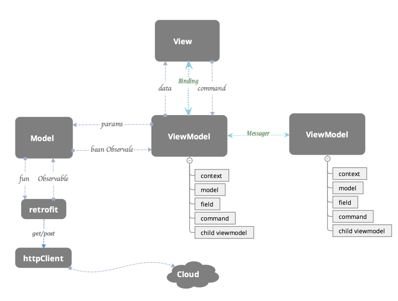
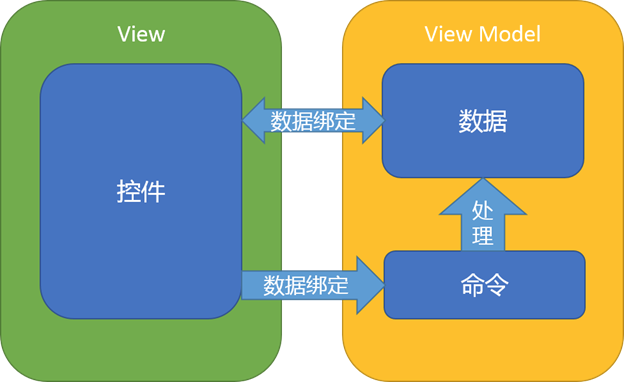

# MVVM

　　MVVM

# 1. 概述

　　Databinding 是一种框架，MVVM 是一种模式，两者的概念是不一样的。DataBinding 是一个实现数据和 UI 绑定的框架，只是一个实现 MVVM 模式的工具。

　　ViewModel 和 View 以通过 DataBinding 来实现单向绑定和双向绑定，这套 UI 和数据之间的动态监听和动态更新的框架 Google 已经做好了。在 MVVM 模式中 ViewModel 和 View 是用绑定关系来实现的，所以有了 DataBinding 使构建 Android MVVM 应用程序成为可能。

# 2. MVC、MVP、MVVM

　　首先，先大致了解 Android 开发中常见的模式，以便更深入了解MVVM 模式。

## 2.1. MVC

> **View：**对应于 xml 布局文件
>  **Model：**实体模型
>  **Controllor：**对应于 Activity 业务逻辑，数据处理和 UI 处理

　　从上面看起来各个组件的职责视乎还挺耦合 MVC 的，但是打开 Android 的一个 Activity 文件，一看一言难尽， Android 中经常会出现数千行的 Activity 代码，究其原因，Android 中纯粹作为 View 的各个 XML 视图功能太弱，Activity 基本上都是 View 和 Controller 的合体，既要负责视图的显示又要加入控制逻辑，承担的功能过多，代码量大也就不足为奇。所有更贴切的目前常规的开发说应该是 View-Model 模式，大部分都是通过 Activity 的协调、连接和处理逻辑的。

## 2.2. MVP

> **View: **对应于 Activity 和 xml，负责 View 的绘制以及与用户交互
>  **Model: **依然是实体模型
>  **Presenter: **负责完成 View 与 Model 间的交互和业务逻辑

　　在 Android 开发中 MVP 的设计思想用得比较多，利用 MVP 的设计模型可以把部分的逻辑的代码从 Fragment 和 Activity 业务的逻辑移出来，在 Presenter 中持有 View（Activity 或者 Fragment）的引用，然后在 Presenter 调用 View 暴露的接口对视图进行操作，这样有利于把视图操作和业务逻辑分开来。MVP 能够让 Activity 成为真正的 View 而不是 View 和 Control 的合体，Activity 只做 UI 相关的事。但是这个模式还是存在一些不好的地方，比较如说：

- Activity 需要实现各种跟 UI 相关的接口，同时要在 Activity 中编写大量的事件，然后在事件处理中调用 presenter 的业务处理方法，View 和 Presenter 只是互相持有引用并互相做回调，代码不美观。
- 这种模式中，程序的主角是 UI，通过 UI 事件的触发对数据进行处理，更新 UI 就有考虑线程的问题。而且 UI 改变后牵扯的逻辑耦合度太高，一旦控件更改（比较 TextView 替换 EditText等）牵扯的更新 UI 的接口就必须得换。
- 复杂的业务同时会导致 presenter 层太大，代码臃肿的问题。

## 2.3. MVVM

> **View: **对应于 Activity 和 xml，负责 View 的绘制以及与用户交互
> **Model: **实体模型
> **ViewModel: **负责完成 View 与 Model 间的交互,负责业务逻辑

　　MVVM 的目标和思想 MVP 类似，利用数据绑定(Data Binding)、依赖属性(Dependency Property)、命令(Command)、路由事件(Routed Event)等新特性，打造了一个更加灵活高效的架构。

### 2.3.1. 数据驱动
　　在 MVVM 中，以前开发模式中必须先处理业务数据，然后根据的数据变化，去获取 UI 的引用然后更新 UI，通过也是通过 UI 来获取用户输入，而在 MVVM 中，数据和业务逻辑处于一个独立的 View Model 中，ViewModel 只要关注数据和业务逻辑，不需要和 UI 或者控件打交道。由数据自动去驱动 UI 去自动更新 UI，UI 的改变又同时自动反馈到数据，数据成为主导因素，这样使得在业务逻辑处理只要关心数据，方便而且简单很多。

### 2.3.2. 低耦合度

　　MVVM 模式中，数据是独立于 UI 的，ViewModel 只负责处理和提供数据，UI 想怎么处理数据都由 UI 自己决定，ViewModel 不涉及任何和 UI 相关的事也不持有 UI 控件的引用，即使控件改变（TextView 换成 EditText）ViewModel 几乎不需要更改任何代码，专注自己的数据处理就可以了，如果是 MVP 遇到 UI 更改，就可能需要改变获取 UI 的方式，改变更新 UI 的接口，改变从 UI 上获取输入的代码，可能还需要更改访问 UI 对象的属性代码等等。

### 2.3.3. 更新 UI

　　在 MVVM 中，可以在工作线程中直接修改 View Model 的数据（只要数据是线程安全的），剩下的数据绑定框架搞定，很多事情都不需要去关心。

### 2.3.4. 团队协作
　　MVVM 的分工是非常明显的，由于 View 和 View Model 之间是松散耦合的。一个是处理业务和数据，一个是专门的 UI 处理。完全有两个人分工来做，一个做 UI（xml 和 Activity）一个写 ViewModel，效率更高。

### 2.3.5. 可复用性

　　一个 View Model 复用到多个 View 中，同样的一份数据，用不同的 UI 去做展示，对于版本迭代频繁的 UI 改动，只要更换 View 层就行，对于如果想在 UI 上的做 AbTest 更是方便的多。

### 2.3.6. 单元测试
　　View Model 里面是数据和业务逻辑，View 中关注的是 UI，这样的做测试是很方便的，完全没有彼此的依赖，不管是 UI 的单元测试还是业务逻辑的单元测试，都是低耦合的。

　　通过上面对 MVVM 的简述和其他两种模式的对比，发现 MVVM 对比 MVC 和 MVP 来说还是存在比较大的优势。

# 3. 如何构建MVVM应用程序

[Android MVVM实战Demo完全解析](https://www.jianshu.com/p/996d76b2317f) - 简单使用

[MVVM Light Toolkit使用指南](https://www.jianshu.com/p/43ea7a531700) - 开源库

## 3.1. 如何分工

　　构建 MVVM 框架首先要具体了解各个模块的分工，接下来讲解 View，ViewModel，Model 的它们各自的职责所在。

### 3.1.1. View

　　View 层做的就是和 UI 相关的工作，只在 XML 和 Activity 或 Fragment 写 View 层的代码，View 层不做和业务相关的事，也就是 Activity 不写和业务逻辑相关代码，也不写需要根据业务逻辑来更新 UI 的代码，因为更新 UI 通过 Binding 实现，更新 UI 在 ViewModel 里面做（更新绑定的数据源即可），Activity 要做的事就是初始化一些控件（如控件的颜色，添加 RecyclerView 的分割线），Activity 可以更新 UI，但是更新的 UI 必须和业务逻辑和数据是没有关系的，只是单纯的根据点击或者滑动等事件更新 UI(如 根据滑动颜色渐变、根据点击隐藏等单纯 UI 逻辑)，Activity（View层）是可以处理 UI 事件，但是处理的只是处理 UI 自己的事情，View 层只处理 View 层的事。**简单的说：View 层不做任何业务逻辑、不涉及操作数据、不处理数据、UI 和数据严格的分开。**

### 3.1.2. ViewModel
　　ViewModel 层做的事情刚好和 View 层相反，ViewModel 只做和业务逻辑和业务数据相关的事，不做任何和 UI、控件相关的事，ViewModel 层不会持有任何控件的引用，更不会在 ViewModel 中通过 UI 控件的引用去做更新 UI 的事情。

　　ViewModel 就是专注于业务的逻辑处理，操作的也都是对数据进行操作，这些个数据源绑定在相应的控件上会自动去更改 UI，开发者不需要关心更新 UI 的事情。DataBinding 框架已经支持双向绑定，这使得在可以通过双向绑定获取 View 层反馈给 ViewModel 层的数据，并进行操作。

　　关于对 UI 控件事件的处理，也希望能把这些事件处理绑定到控件上，并把这些事件统一化，方便 ViewModel 对事件的处理和代码的美观。为此通过 BindingAdapter 对一些常用的事件做了封装，把一个个事件封装成一个个 Command，对于每个事件用一个 ReplyCommand< T > 去处理就行了，ReplyCommand< T > 会把可能需要的数据带给你，这使得处理事件的时候也只关心处理数据就行了，再强调一遍 ViewModel 不做和UI相关的事。

### 3.1.3. Model

　　Model 的职责很简单，基本就是实体模型（Bean）同时包括 Retrofit 的Service ，ViewModel 可以根据 Model 获取一个 Bean 的 Observable< Bean > ( RxJava )，然后做一些数据转换操作和映射到 ViewModel 中的一些字段，最后把这些字段绑定到 View 层上。

## 3.2. 如何协作

　　关于协作，先来看下面的一张图：



　　上图反应了 MVVM 框架中各个模块的联系和数据流的走向，由上图可知View 和 Model 直接是解耦的，是没有直接联系的，也就是之前说到的 View 不做任何和业务逻辑和数据处理相关的事。从每个模块一一拆分来看。那么我们重点就是下面的三个协作。

> - **ViewModel与View的协作**

- **ViewModel与Model的协作**
- **ViewModel与ViewModel的协作**
- **ViewModel与View的协作**



　　上图中 ViewModel 和 View 是通过绑定的方式连接在一起的，绑定的一种是数据绑定，一种是命令绑定。数据的绑定 DataBinding 已经提供好了，简单的定义一些ObservableField就能把数据和控件绑定在一起了（如TextView的text属性），但是 DataBinding 框架提供的不够全面，比如说如何让一个 URL 绑定到一个 ImageView 让这个 ImageView 能自动去加载 url 指定的图片，如何把数据源和布局模板绑定到一个 ListView，让 ListView可以不需要去写 Adapter 和 ViewHolder 相关的东西，而只是通过简单的绑定的方式把 ViewModel 的数据源绑定到 Xml 的控件里面就能快速的展示列表呢？这些就需要做一些工作和简单的封装。关于事件绑定也是一样，MVVM Light Toolkit 做了简单的封装，对于每个事件用一个 ReplyCommand< T > 去处理就行了，ReplyCommand<T>会把可能你需要的数据带给你，这使得我们处理事件的时候也只关心处理数据就行了。

由 **图 1** 中ViewModel的模块中我们可以看出ViewModel类下面一般包含下面5个部分：

- Context （上下文）
- Model (数据模型Bean)
- Data Field （数据绑定）
- Command （命令绑定）
- Child ViewModel （子ViewModel）

我们先来看下示例代码，然后在一一讲解5个部分是干嘛用的：


```php
//context
private Activity context;

//model（数据模型Bean）
private NewsService.News news;
private TopNewsService.News topNews;

//数据绑定（data field）
public final ObservableField<String> imageUrl = new ObservableField<>();
public final ObservableField<String> html = new ObservableField<>();
public final ObservableField<String> title = new ObservableField<>();
// 一个变量包含了所有关于View Style 相关的字段
public final ViewStyle viewStyle = new ViewStyle();

//命令绑定（command）
public final ReplyCommand onRefreshCommand = new ReplyCommand<>(() -> {    

})
public final ReplyCommand<Integer> onLoadMoreCommand = new ReplyCommand<>((p) -> { 

});

//Child ViewModel
public final ObservableList<NewItemViewModel> itemViewModel = new ObservableArrayList<>();

/** * ViewStyle 关于控件的一些属性和业务数据无关的Style 可以做一个包裹，这样代码比较美观，
ViewModel 页面也不会有太多的字段。 **/
public static class ViewStyle {    
   public final ObservableBoolean isRefreshing = new ObservableBoolean(true);    
   public final ObservableBoolean progressRefreshing = new ObservableBoolean(true);
}
```

> - **Context**
>    Context 是干嘛用的呢，为什么每个ViewModel都最好需要持了一个Context的引用呢？ViewModel 不做和UI相关的事，不操作控件，也不更新UI，那为什么要有Context呢？原因主要有以下两点，当然也有其他用处，调用工具类、帮助类可能需要context参数等：

- 通过图1中，我们发现ViewModel 通过传参给Model 然后得到一个Observable<Bean>,其实这就是网络请求部分，做网络请求我们必须把Retrofit Service返回的Observable<Bean>绑定到Context的生命周期上，防止在请求回来时Activity已经销毁等异常，其实这个Context的目的就是把网络请求绑定到当前页面的生命周期中。
- 在图1中，我们可以看到两个ViewModel 之间的联系是通过Messenger来做，这个Messenger 是需要用到Context，这个我们后续会讲解。

> - **Model**
>    Model 是什么呢，其实就是数据原型，也就是我们用Json转过来的Java Bean，我们可能都知道，ViewModel要把数据映射到View中可能需要大量对Model的数据拷贝，拿Model 的字段去生成对应的ObservableField（我们不会直接拿Model的数据去做展示），这里其实是有必要在一个ViewModel 保留原始的Model引用，这对于我们是非常有用的，因为可能用户的某些操作和输入需要我们去改变数据源，可能我们需要把一个Bean 从列表页点击后传给详情页，可能我们需要把这个model 当做表单提交到服务器。这些都需要我们的ViewModel持有相应的model。

> - **Data Field （数据绑定）**
>    Data Field 就是需要绑定到控件上的ObservableField字段， 无可厚非这是ViewModel的必须品。这个没有什么好说，但是这边有一个建议：
>    这些字段是可以稍微做一下分类和包裹的，比如说可能一些字段绑定到控件的一些Style属性上（如果说：长度，颜色，大小）这些根据业务逻辑的变化而动态去更改的，对于着一类针对View Style的的字段可以声明一个ViewStyle类包裹起来，这样整个代码逻辑会更清晰一些，不然ViewModel里面可能字段泛滥，不易管理和阅读性较差。而对于其他一些字段，比如说title，imageUrl，name这些属于数据源类型的字段，这些字段也叫数据字段，是和业务逻辑息息相关的，这些字段可以放在一块。

> - **Command （命令绑定）**
>    Command （命令绑定）说白了就是对事件的处理（下拉刷新，加载更多，点击，滑动等事件处理），我们之前处理事件是拿到UI控件的引用，然后设置Listener，这些Listener 其实就是Command，但是考虑到在一个ViewModel 写各种Listener 并不美观，可能实现一个Listener就需要实现多个方法，但是我们可能只想要其中一个有用的方法实现就好了。同时实现Listener 会拿到UI的引用，可能会去做一些和UI相关的事情，这和我们之前说的ViewModel 不持有控件的引用，ViewModel不更改UI 有相悖。更重要一点是实现一个Listener 可能需要写一些UI逻辑才能最终获取我们想要的，简单一点的比如说，你想要监听ListView滑到最底部然后触发加载更多的事件，这时候你就要在ViewModel里面写一个OnScrollListener,然后在里面的onScroll方法中做计算，计算什么时候ListView滑动底部了，其实ViewModel的工作并不想去处理这些事件，它专注做的应该是业务逻辑和数据处理，如果有一个东西它不需要你自己去计算是否滑到底部，而是在滑动底部自动触发一个Command，同时把当前列表的总共的item数量返回给你，方便你通过 page=itemCount/LIMIT+1去计算出应该请求服务器哪一页的数据那该多好啊。MVVM Light Toolkit 帮你实现了这一点：


```java
public final ReplyCommand<Integer> onLoadMoreCommand =  new ReplyCommand<>((itemCount) -> { 
   int page=itemCount/LIMIT+1; 
   loadData(page.LIMIT)
});
```

接着在XML 布局文件中通过bind:onLoadMoreCommand绑定上去就行了


```bash
<android.support.v7.widget.RecyclerView 
 android:layout_width="match_parent"  
 android:layout_height="match_parent"  
 bind:onLoadMoreCommand="@{viewModel.loadMoreCommand}"/>
```

当然Command并不是必须的，你完全可以依照你的习惯和喜好在ViewModel 写Listener，不过使用Command 可以使你的ViewModel 更简洁易读，你也可以自己定义更多的Command，自己定义其他功能Command，那么ViewModel的事件处理都是托管ReplyCommand<T>来处理，这样的代码看起来会特别美观和清晰。

> - **Child ViewModel （子ViewModel）**
>    子ViewModel 的概念就是在ViewModel 里面嵌套其他的ViewModel，这种场景还是很常见的。比如说你一个Activity里面有两个Fragment，ViewModel 是以业务划分的，两个Fragment做的业务不一样，自然是由两个ViewModel来处理，Activity 本身可能就有个ViewModel 来做它自己的业务，这时候Activity的这个ViewModel里面可能包含了两个Fragment分别的ViewModel。这就是嵌套的子ViewModel。还有另外一种就是对于AdapterView 如ListView RecyclerView,ViewPager等。


```cpp
//Child ViewModelpublic final 
ObservableList<ItemViewModel> itemViewModel = new ObservableArrayList<>();
```

它们的每个Item 其实就对应于一个ViewModel，然后在当前的ViewModel 通过ObservableList<ItemViewModel>持有引用（如上述代码），这也是很常见的嵌套的子ViewModel。我们其实还建议，如果一个页面业务非常复杂，不要把所有逻辑都写在一个ViewModel，可以把页面做业务划分，把不同的业务放到不同的ViewModel，然后整合到一个总的ViewModel，这样做起来可以使我们的代码业务清晰，简短意赅，也方便后人的维护。

总得来说ViewModel 和View 之前仅仅只有绑定的关系，View层需要的属性和事件处理都是在xml里面绑定好了，ViewModel层不会去操作UI，只会操作数据，ViewModel只是根据业务要求处理数据，这些数据自动映射到View层控件的属性上。关于ViewModel类中包含哪些模块和字段，这个需要开发者自己去衡量，这边建议ViewModel 不要引入太多的成员变量，成员变量最好只有上面的提到的5种（context、model、...），能不进入其他类型的变量就尽量不要引进来，太多的成员变量对于整个代码结构破坏很大，后面维护的人要时刻关心成员变量什么时候被初始化，什么时候被清掉，什么时候被赋值或者改变，一个细节不小心可能就出现潜在的Bug。太多不清晰定义的成员变量又没有注释的代码是很难维护的。

**2016 8月25日更新**：
 我们会把UI控件的属性和事件都通过xml里面（如bind：text=@{...})绑定，但是如果一个业务逻辑要弹一个Dialog，但是你又不想在ViewModel里面做弹窗的事（ViewModel 不做UI相关的事）或者说改变ActionBar上面的图标的颜色,改变ActionBar按钮是否可点击，这些都不是写在xml里面（都是用java 初始化话），如何对这些控件的属性做绑定呢？我们先来看下代码：


```java
public class MainViewModel implements ViewModel {
....
//true的时候弹出Dialog，false的时候关掉dialog
public final ObservableBoolean isShowDialog = new ObservableBoolean();
....
.....
}
// 在View层做一个对isShowDialog改变的监听
public class MainActivity extends RxBasePmsActivity {

private MainViewModel mainViewModel;

@Override
protected void onCreate(Bundle savedInstanceState) {
..... 
mainViewModel.isShowDialog.addOnPropertyChangedCallback(new android.databinding.Observable.OnPropertyChangedCallback() {
      @Override
      public void onPropertyChanged(android.databinding.Observable sender, int propertyId) {
          if (mainViewModel.isShowDialog.get()) {
               dialog.show();
          } else {
               dialog.dismiss();
          }
       }
    });
 }
 ...
}
```

简单的说你可以对任意的ObservableField做监听，然后根据数据的变化做相应UI的改变，业务层ViewModel 只要根据业务处理数据就行，以数据来驱动UI。

- **ViewModel与Model的协作**　
   从图1 中，Model 是通过Retrofit 去获取网络数据的，返回的数据是一个Observable<Bean>( RxJava ),Model 层其实做的就是这些。那么ViewModel 做的就是通过传参数到Model层获取到网络数据（数据库同理）然后把Model的部分数据映射到ViewModel的一些字段（ObservableField），并在ViewModel 保留这个Model的引用,我们来看下这一块的大致代码(代码涉及到简单RxJava，如看不懂可以查阅入门一下)：


```cpp
 //Model
 private NewsDetail newsDetail;

 private void loadData(long id) {  
   //  Observable<Bean> 用来获取网络数据
   Observable<Notification<NewsDetailService.NewsDetail>>   newsDetailOb =   
   RetrofitProvider.getInstance()
                  .create(NewsDetailService.class)   
                  .getNewsDetail(id)                   
                  .subscribeOn(Schedulers.io())      
                  .observeOn(AndroidSchedulers.mainThread())
                 // 将网络请求绑定到Activity 的生命周期
                  .compose(((ActivityLifecycleProvider) context).bindToLifecycle()) 
                 //变成 Notification<Bean> 使我们更方便处理数据和错误
                  .materialize().share();  

 // 处理返回的数据
   newsDetailOb.filter(Notification::isOnNext)         
               .map(n -> n.getValue())    
               // 给成员变量newsDetail 赋值，之前提到的5种变量类型中的一种（model类型）        
               .doOnNext(m -> newsDetail = m)   
               .subscribe(m -> initViewModelField(m));

 // 网络请求错误处理
    NewsListHelper.dealWithResponseError(
      newsDetailOb.filter(Notification::isOnError)        
                  .map(n -> n.getThrowable()));
}
//Model -->ViewModel
private void initViewModelField(NewsDetail newsDetail) {  
     viewStyle.isRefreshing.set(false);   
     imageUrl.set(newsDetail.getImage());    
     Observable.just(newsDetail.getBody())
            .map(s -> s + "<style type=\"text/css\">" + newsDetail.getCssStr())           
            .map(s -> s + "</style>")            
            .subscribe(s -> html.set(s));   
     title.set(newsDetail.getTitle());
 }
```

以上代码基本把注释补全了，基本思路比较清晰，，Rxjava涉及的操作符都是比较基本的，如有不懂，可以稍微去入门，之后的源码里面ViewModel数据逻辑处理都是用Rxjava做，所以需要提前学习一下方便你看懂源码。

> 注：我们推荐使用MVVM 和 RxJava一块使用，虽然两者皆有观察者模式的概念，但是我们RxJava不使用在针对View的监听，更多是业务数据流的转换和处理。DataBinding框架其实是专用于View-ViewModel的动态绑定的，它使得我们的ViewModel 只需要关注数据，而RxJava 提供的强大数据流转换函数刚好可以用来处理ViewModel中的种种数据，得到很好的用武之地，同时加上Lambda表达式结合的链式编程，使ViewModel 的代码非常简洁同时易读易懂。

- **ViewModel与ViewModel的协作**　
   在图 1 中 我们看到两个ViewModel 之间用一条虚线连接着，中间写着Messenger，Messenger 可以理解是一个全局消息通道，引入messenger最主要的目的就实现ViewModel和ViewModel的通信，也可以用做View和ViewModel的通信，但是并不推荐这样做。ViewModel主要是用来处理业务和数据的，每个ViewModel都有相应的业务职责，但是在业务复杂的情况下，可能存在交叉业务，这时候就需要ViewModel和ViewModel交换数据和通信，这时候一个全局的消息通道就很重要的。这边给出一个简单的例子仅供参考：
   场景是这样的，你的MainActivity对应一个MainViewModel，MainActivity 里面除了自己的内容还包含一个Fragment，这个Fragment 的业务处理对应于一个FragmentViewModel,FragmentViewModel请求服务器并获取数据，**刚好这个数据MainViewModel也需要用到**，我们不可能在MainViewModel重新请求数据，这样不太合理，这时候就需要把数据传给MainViewModel,那么应该怎么传，彼此没有引用或者回调。那么只能通过全局的消息通道Messenger。

FragmentViewModel 获取消息后通知MainViewModel 并把数据传给它：


```rust
combineRequestOb.filter(Notification::isOnNext)        
.map(n -> n.getValue())        
.map(p -> p.first)        
.filter(m -> !m.getTop_stories().isEmpty())        
.doOnNext(m ->Observable.just(NewsListHelper.isTomorrow(date)).filter(b -> b).subscribe(b -> itemViewModel.clear())) 
// 上面的代码可以不看，就是获取网络数据 ，通过send把数据传过去
.subscribe(m -> Messenger.getDefault().send(m, TOKEN_TOP_NEWS_FINISH));
```

MainViewModel 接收消息并处理：


```kotlin
Messenger.getDefault().register(activity, NewsViewModel.TOKEN_TOP_NEWS_FINISH, TopNewsService.News.class, (news) -> {
// to something....
}
```

在MainActivity onDestroy 取消注册就行了(不然导致内存泄露)


```java
@Override
protected void onDestroy() {    
      super.onDestroy();      
      Messenger.getDefault().unregister(this);
}
```

当然上面的例子也只是简单的说明下，Messenger可以用在很多场景，通知，广播都可以，不一定要传数据，在一定条件下也可以用在View层和ViewModel 上的通信和广播。运用范围特别广，需要开发者结合实际的业务中去做更深层次的挖掘。

# 4. 总结和源码

- 本篇博文讲解主要是一些个人开发过程中总结的Android MVVM构建思想，更多是理论上各个模块如何分工，代码如何设计，虽然现在业界使用Android MVVM模式开发还比较少，但是随着DataBinding 1.0 的发布，相信在Android MVVM 这块领域会更多的人来尝试，刚好最近用MVVM开发了一段时间，有点心得，写出来仅供参考。

- 文中讲解的过程代码比较少，代码用到了自己开发的一个MVVM Light Toolkit 库，而且还是RxJava + Lambda 的代码，估计很多人看着都晕菜了，这边会把源码公布出来。如果你还没有尝试过用RxJava+Retrofit+DataBinding 构建Android MVVM 应用程序，那么你可以试着看一下这边的源码并且做一下尝试，说不定你会喜欢上这样的开发框架。

- 关于MVVM Light Toolkit 只是一个工具库，主要目的是更快捷方便的构建Android MVVM应用程序，在里面添加了一些控件额外属性和做了一些事件的封装，同时引进了全局消息通道Messenger，用起来确实非常方便，你可以尝试一下，当然还有不少地方没有完善和优化，后续也会不断更新和优化，如果不能达到你的业务需求时，你也可以自己添加自己需要的属性和事件。

- 源码地址 [https://github.com/Kelin-Hong/MVVMLight](https://links.jianshu.com/go?to=https%3A%2F%2Fgithub.com%2FKelin-Hong%2FMVVMLight)

- library ---> library是MVVM Light Toolkit 的源码，源码很简单，感兴趣的同学可以看看，没什么多少的技术难度,可以根据自己的需求，添加更多的控件的属性和事件绑定。

- sample ---> 本文涉及的代码均处出于这个项目，sample 一个知乎日报的App的简单实现，代码包含了一大部分 MVVM Light Toolkit 的使用场景，（Data、Command、Messenger均有涉及），同时sample严格按照博文阐述的MVVM的设计思想开发的，对理解本文有很大的帮助，欢迎clone下来看看。
   **Sample 截图**

  

- 源码涉及 RxJava+Retrofit+Lambda 如有不懂或没接触过，花点时间入门一下，用到都是比较简单的东西。

希望这篇博客在如何构建Android MVVM应用程序对你有所帮助，如有任何疑问，可以给我留言,欢迎大家共同探讨，如果对MVVM Light Toolkit 有任何问题，也可以反馈给我。

# 5. 参考文章

1. [开发8年Android大牛：构建Android MVVM应用程序其实只需这几步？](https://www.jianshu.com/p/e1e10211621d)


