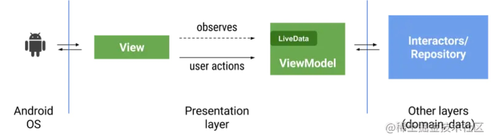
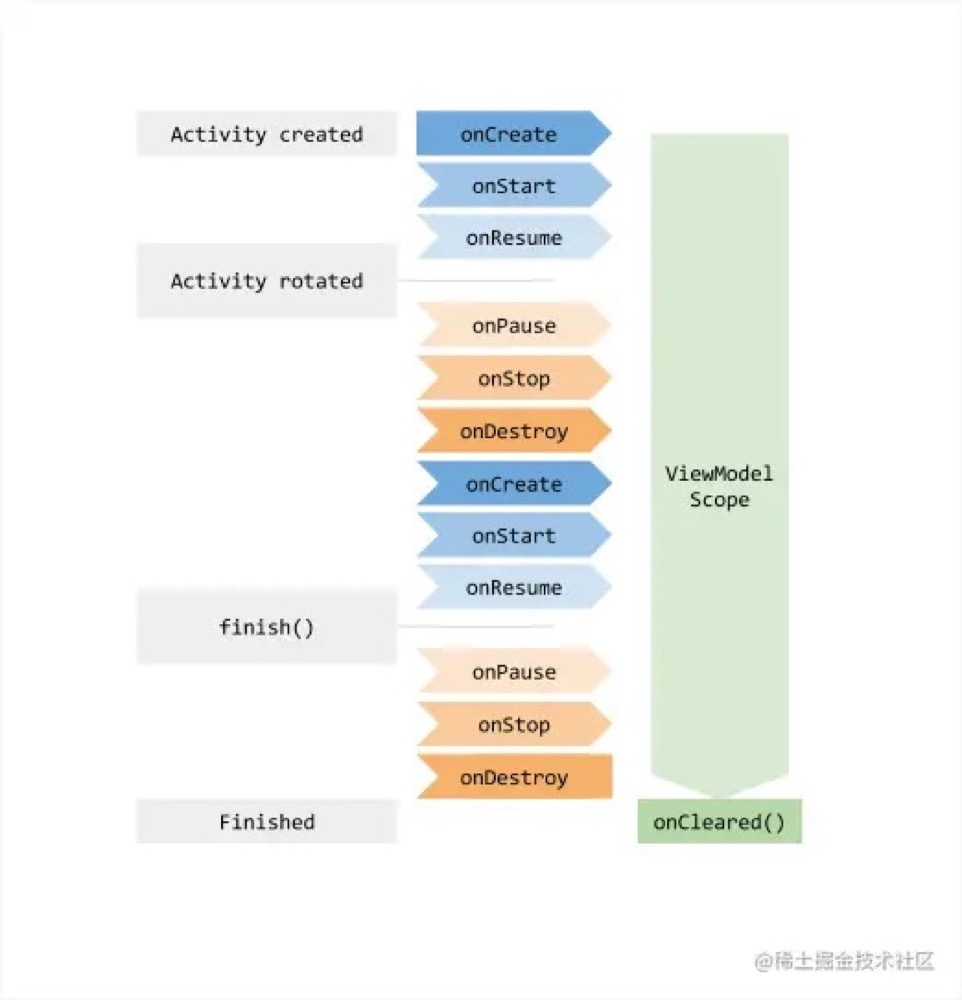
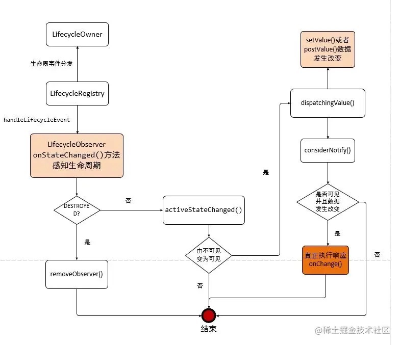

# MVVM 设计模式与 ViewModel、LiveData

## 0. MVVM 设计模式




## 1. 如何应用

### 1.1. Demo

如果项目不是 androidx，那么需要先在 gradle 中引入 lifecycle 库，androidx 则不需要：

```groovy
    implementation 'android.arch.lifecycle:extensions:1.1.1'
```

用一个例子来讲解：

点击屏幕上减少/增加按钮，屏幕中间的 TextView 会进行相应的数字加减。

#### 1.1.1. Model 层

进行数据的获取，网络请求，数据库操作等。数据的获取、存储、数据状态变化都是 Model 层的任务。Model 包括实体模型（Bean）、获取网络数据接口，本地存储（增删改查）接口，数据变化监听等。Model 提供数据获取接口供 ViewModel 调用。

```kotlin
class MyModel {

    fun changNumber(current: Int, up: Boolean, callback: ModelDataCallBack<Int>) {
        callback.onSucceed(if (up) current + 1 else current - 1)
    }


    interface ModelDataCallBack<T> {

        fun onSucceed(data: T)

        fun onFailed(failedMsg: String, failedCode: String)
    }
}
```

#### 1.1.2. ViewModel 层

数据的整体封装处理，为 UI 层提供相应数据。比如获取到的数据根据相应条件进行过滤、对数据进行业务操作处理等。

ViewModel 只做和业务逻辑和业务数据相关的事，不做任何和 UI 相关的事情，ViewModel 层不会持有任何控件的引用，更不会在 ViewModel 中通过 UI 控件的引用去做更新 UI 的事情。

```kotlin
class MyViewModel : ViewModel(){

    private val _changeNumber = MutableLiveData<Int>()
    val changeNumber: LiveData<Int>
        get() = _changeNumber

    private val model = lazy { MyModel() }

    fun getNumber(currentNumber: Int, up: Boolean) {
        model.value.changNumber(currentNumber, up, object : MyModel.ModelDataCallBack<Int> {
            override fun onSucceed(data: Int) {
                _changeNumber.value = data
            }

            override fun onFailed(failedMsg: String, failedCode: String) {
            }

        })
    }
}
```

#### 1.1.3. View 层

view 层则为相应的 Activity，Fragment，主要进行数据的展示，把数据填充到 UI 上，在 View 层中不做任何的数据处理，ViewModel 层传递什么数据过来就使用什么数据，尽量降低耦合。View 层不做任何业务逻辑、不涉及操作数据、不处理数据，UI 和数据严格的分开。

```kotlin
class ActivityDemo : AppCompatActivity(){

    private lateinit var mViewModel: MyViewModel

    override fun onCreate(savedInstanceState: Bundle?) {
        super.onCreate(savedInstanceState)
        setContentView(R.layout.activity_demo)
        mViewModel = ViewModelProvider(this)[MyViewModel::class.java]
        //mViewModel = MyViewModel()
        initObserver()
        initEvent()
    }

    //初始化注册观察者
    private fun initObserver() {
        mViewModel.changeNumber.observe(this, Observer {
            demo_tv.text = it.toString()
        })
    }

    private fun initEvent() {
        demo_btn_down.setOnClickListener {
            mViewModel.getNumber(demo_tv.text.toString().toInt(), false)
        }
        demo_btn_up.setOnClickListener {
            mViewModel.getNumber(demo_tv.text.toString().toInt(), true)
        }
    }
}
```

#### 1.1.4. 过程

* 在 View 层对 changeNumber 添加注册了observer，并定义了接收到事件后 textview 做相应的改变。

* 按钮点击后，调用 ViewModel 层再到 Model 层的方法，回调到 ViewModel 后，_changeNumber 的值被改变。

* changeNumber 实际上就是 _changeNumber，进而触发 View 层的 observer 事件。

ps：changeNumber 复写了 get()，返回 \_changeNumber，所以我们调用 changeNumber，实际上对 changeNumber 返回的 \_changeNumber 进行注册观察。这里做多一层封装，就是为了避免 View 层直接对 \_changeNumber 进行操作。

整体流程图如下：


### 1.2. MVVM 的一些优点

* ViewModel 跟随 activity、fragment 生命周期，ViewModel 的生命周期如下，所以即使 Activity 异常重建的时候，ViewModel 也不会被销毁。



- 搭配 LiveData 可实现的观察者模式与生命周期绑定观察，能够解决以往的内存泄露问题。(一些由持有 Context、Activity 所引起的内存泄露)
- UI 层与业务逻辑层分离，各自不影响，耦合低。
- 进行单元测试可以针对 ViewModel 进行测试

## 2. 相关原理剖析

问题：

- ViewModel 层的数据是如何更新并传递通知给 UI 层的？
- 如何做到得知生命周期的改变和 Activity 或 fragment 销毁重建后仍然存在并且关联其生命周期？
- 如何避免内存泄漏？

### 2.1. 过程调用图



### 2.2. ViewModel

ViewModel 类中定义了 onCleared() 方法，提供给我们进行重写，可以在这里进行资源释放，变量等清理工作。

### 2.3. LiveData

**Google官方的解释如下：**

LiveData 是可以在给定生命周期内观察到的数据持有者类。这意味着可以将一个 Observer 与 LifecycleOwner 成对添加，并且只有在配对的 LifecycleOwner 处于活动状态时，才会向该观察者通知有关包装数据的修改。如果 LifecycleOwner 状态为 Lifecycle.State＃STARTED 或 Lifecycle.State＃RESUMED，则将其视为活动状态。通过observeForever（Observer）添加的观察者被视为始终处于活动状态，因此将始终收到有关修改的通知。对于那些观察者，应该手动调用 removeObserver（Observer）。

如果相应的生命周期移至 “ 生命周期状态为 DESTROYED ” 状态，则添加了生命周期的观察者将被自动删除。 这对于活动和片段可以安全地观察 LiveData 而不用担心泄漏的活动特别有用：销毁它们时，它们将立即被取消订阅。

此外，LiveData 具有 LiveData onActive（）和 LiveData onInactive（）方法，以在活动观察者的数量在 0 到 1 之间变化时得到通知。这使 LiveData 在没有任何活动观察者的情况下可以释放大量资源。

此类旨在容纳 ViewModel 的各个数据字段，但也可以用于以分离的方式在应用程序中的不同模块之间共享数据。

#### 2.3.1. observe

注册观察 LiveData 数据的入口，参数为：生命周期(即实现了 LifecyclerOwner 接口的类)，Observer 接口的实现类。

**具体执行流程：**

```java
@MainThread
    public void observe(@NonNull LifecycleOwner owner, @NonNull Observer<T> observer) {
        assertMainThread("observe");
        if (owner.getLifecycle().getCurrentState() == DESTROYED) { //观察者的生命周期状态等于DESTROYED
            //DESTROYED会在Activity的onDestroy()方法之前调用
            // ignore
            return;
        }
        LifecycleBoundObserver wrapper = new LifecycleBoundObserver(owner, observer);
        ObserverWrapper existing = mObservers.putIfAbsent(observer, wrapper);
        ·······
        //添加到观察者中
        owner.getLifecycle().addObserver(wrapper);
    }
```

#### 2.3.2. observeForever(注册一个没有关联LifecycleOwner 对象的 Observer)

```java
@MainThread
    public void observeForever(@NonNull Observer<? super T> observer) {
        assertMainThread("observeForever");
        AlwaysActiveObserver wrapper = new AlwaysActiveObserver(observer);
        ObserverWrapper existing = mObservers.putIfAbsent(observer, wrapper);
        ········
        wrapper.activeStateChanged(true);
    }
    
    void activeStateChanged(boolean newActive) {
            if (newActive == mActive) {
                return;
            }
            // 立刻设置为活动状态, 所以不会分发事件到不活跃的观察者
            mActive = newActive;
            boolean wasInactive = LiveData.this.mActiveCount == 0;
            LiveData.this.mActiveCount += mActive ? 1 : -1;
            if (wasInactive && mActive) {
                onActive();
            }
            if (LiveData.this.mActiveCount == 0 && !mActive) {
                onInactive();
            }
            //这里如果处于活跃状态就分发值
            if (mActive) {
                dispatchingValue(this);
            }
        }
```

#### 2.3.3. removeObserver

```java
    /**
     * Removes the given observer from the observers list.
     *
     * @param observer The Observer to receive events.
     */
		@MainThread
    public void removeObserver(@NonNull final Observer<? super T> observer) {
        assertMainThread("removeObserver");
        ObserverWrapper removed = mObservers.remove(observer);
        if (removed == null) {
            return;
        }
        removed.detachObserver();
        removed.activeStateChanged(false);
    }
```

移除单个观察者。

#### 2.3.4. removeObservers

```java
    /**
     * Removes all observers that are tied to the given {@link LifecycleOwner}.
     *
     * @param owner The {@code LifecycleOwner} scope for the observers to be removed.
     */
    @SuppressWarnings("WeakerAccess")
    @MainThread
    public void removeObservers(@NonNull final LifecycleOwner owner) {
        assertMainThread("removeObservers");
        for (Map.Entry<Observer<? super T>, ObserverWrapper> entry : mObservers) {
            if (entry.getValue().isAttachedTo(owner)) {
                removeObserver(entry.getKey());
            }
        }
    }
```

移除所有的观察者。

#### 2.3.5. postValue

在子线程中调用，与 setValue 相对应。如果在子线程中多次调用，那么会分发最后一次的值，其他的值不会发送到主线程。postValue 负责把值发送到主线程，只要执行主线程那么值就会更新。

```java
protected void postValue(T value) {
        boolean postTask;
        synchronized (mDataLock) {
            postTask = mPendingData == NOT_SET;
            mPendingData = value;
        }
        if (!postTask) {
            return;
        }
        //把 runnable 发送到主线程再执行，runnable 中也调用 setValue 进行更新
        ArchTaskExecutor.getInstance().postToMainThread(mPostValueRunnable);
    }
    
    private final Runnable mPostValueRunnable = new Runnable() {
        @SuppressWarnings("unchecked")
        @Override
        public void run() {
            Object newValue;
            synchronized (mDataLock) {
                newValue = mPendingData;
                mPendingData = NOT_SET;
            }
            setValue((T) newValue);
        }
    };
```

#### 2.3.6. setValue

该方法会先判断该方法是否运行在主线程，如果运行在主线程中则继续赋值，然后调用 dispatchingValue，dispatchingValue 方法中通过循环遍历观察者 Observer，调用 considerNotify 方法进行判断观察者的状态，最后调用观察者 Observer 自带的方法 onChange 进行数据的改变通知。 

如果开始判断该方法不运行在主线程中则抛出IllegalStateException异常。

```java
    @MainThread
    protected void setValue(T value) {
        assertMainThread("setValue");
        mVersion++;
        mData = value;
        dispatchingValue(null);
    }
    
    @SuppressWarnings("WeakerAccess") /* synthetic access */
    void dispatchingValue(@Nullable ObserverWrapper initiator) {
        if (mDispatchingValue) {
            mDispatchInvalidated = true;
            return;
        }
        mDispatchingValue = true;
        do {
            mDispatchInvalidated = false;
            if (initiator != null) {
                considerNotify(initiator);
                initiator = null;
            } else {
                for (Iterator<Map.Entry<Observer<? super T>, ObserverWrapper>> iterator =
                        mObservers.iteratorWithAdditions(); iterator.hasNext(); ) {
                    considerNotify(iterator.next().getValue());
                    if (mDispatchInvalidated) {
                        break;
                    }
                }
            }
        } while (mDispatchInvalidated);
        mDispatchingValue = false;
    }

    private void considerNotify(ObserverWrapper observer) {
        if (!observer.mActive) {
            return;
        }
        // Check latest state b4 dispatch. Maybe it changed state but we didn't get the event yet.
        //
        // we still first check observer.active to keep it as the entrance for events. So even if
        // the observer moved to an active state, if we've not received that event, we better not
        // notify for a more predictable notification order.
        if (!observer.shouldBeActive()) {
            observer.activeStateChanged(false);
            return;
        }
        if (observer.mLastVersion >= mVersion) {
            return;
        }
        observer.mLastVersion = mVersion;
        //noinspection unchecked
        observer.mObserver.onChanged((T) mData);
    }
```

#### 2.3.7. setValue 与 postValue

```java
liveData.postValue(a)
liveData.setValue(b)
```

如果运行上述两行代码，那么 a 的值会覆盖掉 b 的值。因为 postValue 把 runnable 发送到主线程中，主线程在运行 setValue 的时候会运行该 runnable，显示设置了 a，后需运行 runnable 又设置了 b，这就覆盖了之前的值。

### 2.4. MutableLiveData

由于 LiveData 中的 setValue、postvalue 方法均为 protected，因此无法直接调用，MutableLiveData 继承于 LiveData，因此用 MutableLiveData 进行数据源的更新改变设置。

```java
/**
 * 公开暴露 setValue(T) 和 postValue(T) 方法的 LiveData
 *
 * @param <T> MutableLiveData 实例保存的数据类型
 */
@SuppressWarnings("WeakerAccess")
public class MutableLiveData<T> extends LiveData<T> {
    @Override
    public void postValue(T value) {
        super.postValue(value);
    }

    @Override
    public void setValue(T value) {
        super.setValue(value);
    }
}
```

### 2.5 interface LifecycleOwner

```java
/**
 * 具有 Android 生命周期的类，自定义组件可以通过事件的形式分发生命周期的改变，而无需在 Activity 或 Fragment 中实现任何代码。
 * 
 * @see Lifecycle
 */
@SuppressWarnings({"WeakerAccess", "unused"})
public interface LifecycleOwner {
    /**
     * 返回实现接口者的生命周期
     *
     * @return The lifecycle of the provider.
     */
    @NonNull
    Lifecycle getLifecycle();
}
```

实现了该接口中的 getLifecycle() 方法就有 Fragment，Activity 等。

### 2.6. LifeCycle

getLifecycle() 方法返回的 Lifecycle 是一个抽象类，里面包含两个枚举类 Event 和 State，包含三个抽象方法：

```java
    //添加观察者
    @MainThread
    public abstract void addObserver(@NonNull LifecycleObserver observer);
    
    //移除观察者
    @MainThread
    public abstract void removeObserver(@NonNull LifecycleObserver observer);
    
    //返回当前的生命周期
    @MainThread
    @NonNull
    public abstract State getCurrentState();
```

枚举类 Event 定义存放 LifecycleOwner 的状态，State 则定义存放关联着 Activity 生命周期的状态。

### 2.7. interface Observer

```java
/**
 * 能够接收 LiveData 的简单回调
 *
 * @param <T> 参数的类型
 *
 * @see LiveData LiveData - for a usage description.
 */
public interface Observer<T> {
    /**
     * 当数据被改变的时候进行调用
     * @param t 新的数据(即改变后的数据)
     */
    void onChanged(@Nullable T t);
}
```

## 3. 问题解答

### 3.1. 问题解答：如何做到得知生命周期的改变和 Activity 或 fragment 销毁重建后仍然存在并且关联其生命周期？

在实例化一个 ViewModel 的时候传递了 activity/fragment 生命周期的引用进去，即 lifecycler 对象。

```java
//属于类ViewModelProvider.java
public ViewModelProvider(@NonNull ViewModelStoreOwner owner) {
        this(owner.getViewModelStore(), owner instanceof HasDefaultViewModelProviderFactory
                ? ((HasDefaultViewModelProviderFactory) owner).getDefaultViewModelProviderFactory()
                : NewInstanceFactory.getInstance());
    }
    
    
//属于 ComponentActivity.java    
 public ViewModelStore getViewModelStore() {
        if (getApplication() == null) {
            throw new IllegalStateException("Your activity is not yet attached to the "
                    + "Application instance. You can't request ViewModel before onCreate call.");
        }
        if (mViewModelStore == null) {
            NonConfigurationInstances nc =
                    (NonConfigurationInstances) getLastNonConfigurationInstance();
            if (nc != null) {
                // Restore the ViewModelStore from NonConfigurationInstances
                mViewModelStore = nc.viewModelStore;
            }
            if (mViewModelStore == null) {
                mViewModelStore = new ViewModelStore();
            }
        }
        return mViewModelStore;
    }    
    
    
//属于Activity类
 public Object getLastNonConfigurationInstance() {
        return mLastNonConfigurationInstances != null
                ? mLastNonConfigurationInstances.activity : null;
    }
```

FragmentActivity、AppcompactActivity继承ComponentActivity。

**如何获取到之前的 ViewModel 实例呢？**

1. 实例化 ViewModel 的时候 ViewModelProvider 得到 ViewModelStoreOwner 对象，于是存了 ViewModelStore 和 Factory。

2. 获取 ViewModelStore 的方法在 ComponentActivity 中，且保存唯一的 ViewModelStore。

3. activity 销毁后，通过 getLastNonConfigurationInstance 获取 viewmodelStore。

4. getLastNonConfigurationInstance 这个方法会在 Activity 重建时保存一个Object，而 ComponentActivity 利用了这个 Object 存储了 ViewModelStore 对象。

5. 然后通过 ComponentActivity 获取到之前保存的 ViewModelStore，进而获取到 Viewmodel。

通过 ViewModelProvider 构造方法中可以得知 ComponentActivity 包含了唯一 ViewModelStore， ViewModelStore 存储了 ViewModel， ViewModelProvider 通过 ComponentActivity 取到了ViewModelStore，从而唯一获取到了 ViewModel。因为 ComponentActivity 重建保存了 ViewModelStore，也就保存了 ViewModel。

**又是如何进行关联生命周期的呢？**

看回 ComponentActivity 的构造方法就知道了

```java
public ComponentActivity() {
        Lifecycle lifecycle = getLifecycle();
        //noinspection ConstantConditions
        if (lifecycle == null) {
            ......
        }
        if (Build.VERSION.SDK_INT >= 19) {
            getLifecycle().addObserver(new LifecycleEventObserver() {
                @Override
                public void onStateChanged(@NonNull LifecycleOwner source,
                        @NonNull Lifecycle.Event event) {
                    if (event == Lifecycle.Event.ON_STOP) {
                        Window window = getWindow();
                        final View decor = window != null ? window.peekDecorView() : null;
                        if (decor != null) {
                            decor.cancelPendingInputEvents();
                        }
                    }
                }
            });
        }
        getLifecycle().addObserver(new LifecycleEventObserver() {
            @Override
            public void onStateChanged(@NonNull LifecycleOwner source,
                    @NonNull Lifecycle.Event event) {
                if (event == Lifecycle.Event.ON_DESTROY) {
                //isChangingConfigurations()方法通常在{#onStop}中使用它来确定状态是否需要清理或将通过{
                //#onRetainNonConfigurationInstance()传递到活动的下一个实例。
                    if (!isChangingConfigurations()) {
                        getViewModelStore().clear();
                    }
                }
            }
        });

        if (19 <= SDK_INT && SDK_INT <= 23) {
            getLifecycle().addObserver(new ImmLeaksCleaner(this));
        }
    }
```

在构造方法中就进行了一个生命周期判断，通过 Lifecycle 的回调进行关联，生命周期事件为 onDestroy 并且 isChangingConfigurations() 判断为不传递到下一个实例的时候，再进行 ViewModelStore 的 clear()，所以异常销毁的 Activity 不会清理 ViewModelStore 的 ViewModel，那么得到的 ViewModel 也是之前的实例了。

### 3.2. 问题解答：如何防止内存泄漏？

- 方法1：使用 Application，使 ViewModel 跟随 APP 的生命周期走。
- 方法2：ViewModel 中定义了个空的 onCleared() 方法，Google 给我们在这里进行 Activity/Fragment 销毁后自定义处理的操作。

# 参考文章

1. [设计模式学习——MVVM设计模式与ViewModel、LiveData](https://juejin.cn/post/6844904153953599501)


