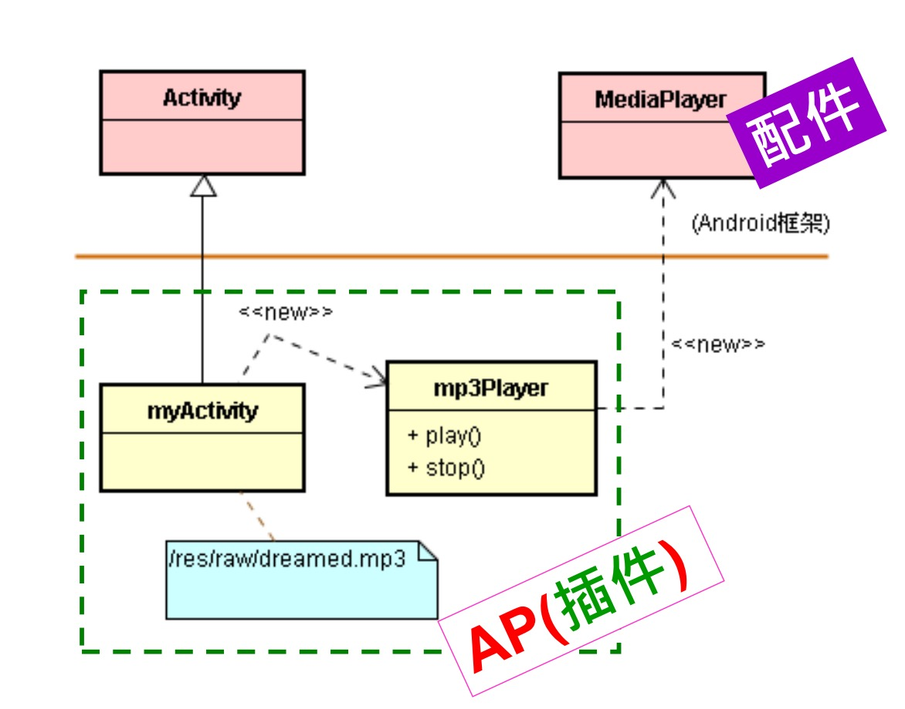

# 从架构到代码的演练

# 1. 架构师的工作

* 主要任务：（强龙）架构师依循 EIT 造形，分出 < E、I、T > 三种要素。
* 分工模式：
  * 1. 架构师做 EIT 设计
  * 2. 强龙做 < E&I >
  * 3. 地头蛇配 < T >
* 强龙掌控
  * 生产面
    * 强龙掌控 < I >，地头蛇就不会失控
  * 系统面
    * < E > 是控制点，透过 < I > 来驱动 < T >

# 2. 套用商业用词：框架与插件

## 2.1. 商业用词：框架与插件

* < E > 是控制点，透过 < I > 来驱动 < T >
* < E > + < I > = 框架（Framework）
* < T > = 插件（Plug-in）

## 2.2. 分工模式

1. 框架师做 EIT 设计
2. 强龙做框架
3. 地头蛇配插件

# 3. 区分插件与配件

# 4. 亲身体验：代码练习

* 于 < 买主来了 > 之前，架构师基于已具备的知识，来决定接口 < I >；然后把其知识（又称强龙知识）写在基类 < E > 里。基于 < I >，当买主出现了，才把买主的知识（又称地头蛇知识）写入子类 < T > 里。
* 然后，两者汇合，成为完整的知识了。如下图所示：

1. 架构师依循 EIT 造形，分出 < E、I、T > 三部分。
2. 把强龙知识写入于 < E > 里。
3. 把地头蛇（即买主）知识写入到 < T > 里。
4. 详细定义接口 < I >。
5. < E > 是控制点，透过 < I > 来调用 < T >。

# 5. 结语

* 应用程序（AP）也是框架的一种插件。
* 框架（或架构）设计的关键任务就是接口（Interface）设计，这项接口是框架 < E > 与插件 < T > 之间的接口，这就是所谓的：框架 API。
* 架构师的工作就是聚焦于这件最为关键的事情上，这样子让 AP 开发工作就显得很轻松了，只要专注于理清买主知识的内涵，把它分析出来写入 < T > 里就行了。最后，将相关的 < T > 组合起来，就成为应用程序（简称 AP 或 APP）了。

