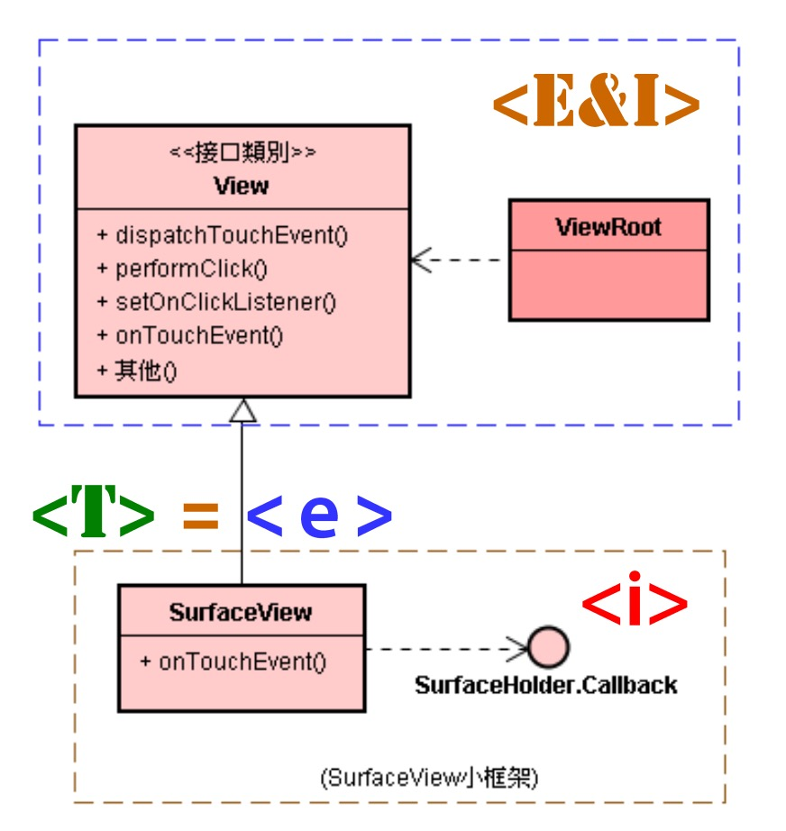
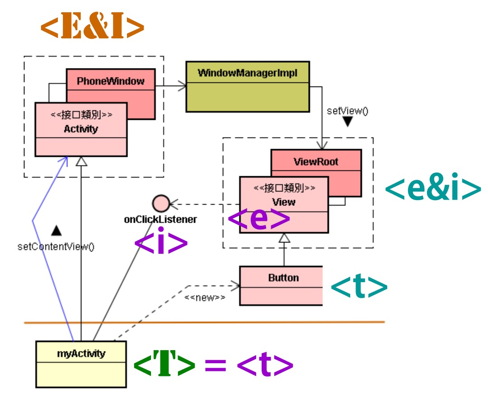

# 简介EIT造形

# 1. < E&I > 是框架的核心要素

* 在特定领域（Domain）里，将 EIT 造形的 < E&I> 部分有意义地组合起来，就成为框架（Framework）了。

* 基本的分工模式

  -- 强龙定义 < I >，并开发 < E >

  -- 地头蛇开发 < T >

* < E&I > 组合起来成为框架本身

* < T > 组合起来成为框架的应用（Application）

* 强龙做框架；地头蛇做应用

* 以 Android 的 Java 层应用框架为例，在 Android 框架里，处处可见 EIT 造形；其 < E&I > 部分就是框架的核心要素。

# 2. 框架是 EIT 造形的组合

* 在软件系统里，每一个 EIT 都是一个结构相同而内涵不同的造形。
* 它们会遵循某种规律而组合成较大的结构（如框架），如下入所示：

* 此图含有两个 EIT 造形：{ ViewRoot，View，< T > } 和 {SurfaceVide，Callback，< T >}。它们是透过类别的继承关系（即 SurfaceView 类别继承 View 类别）而组合在一起。

* 这两个 EIT 造形是由于共享 < T > 而组合在一起的。
* 顾名思义，EIT 造形就是意味着：把轮胎（T）拔掉，得到接口（I），于是将引擎与轮胎分离了。既然分离了，又谁来诞生轮胎呢？谁来把轮胎装配到引擎呢？

* 此 Android 框架里有三个重要的 EIT 造形：
  1. {PhoneWindow，Activity，myActivity}
  2. {ViewRoot，View，Button}
  3. {View，onClickListener，myActivity}

三个 EIT 造形的互动过程是：

1. 首先 Android 框架诞生 myActivity 轮胎，并且把它装配到 PhoneWindow 引擎上。
2. PhoneWIndow 引擎透过 Activity 接口来呼叫 myActivity 轮胎；要求它（即 myActivity）来诞生 Button 轮胎，并且把自己（即 myActivity）的 onClickListener 接口装配到 Button 轮胎（含基类别 View）里。
3. myActivity 呼叫 setContentView() 函数来将 Button 轮胎的接口传递给 PhoneWindow 引擎。
4. PhoneWindow 引擎再把 Button 轮胎接口传给 WindowManagerImp，委托它来装配到 ViewRoot 引擎上。此时，轮胎都装配好了；UI 画面也显示了。
5. 用户就能触摸 UI 画面的按钮（即 Button 轮胎），触发了 UI 事件，Android 框架就把事件传送给 ViewRoot 引擎。
6. ViewRoot 引擎就透过 View 接口而呼叫到 Button 轮胎。
7. Button 轮胎（含基类别 View）就透过 onClickListener 接口来呼叫 myActivity 轮胎的 onClick() 函数。