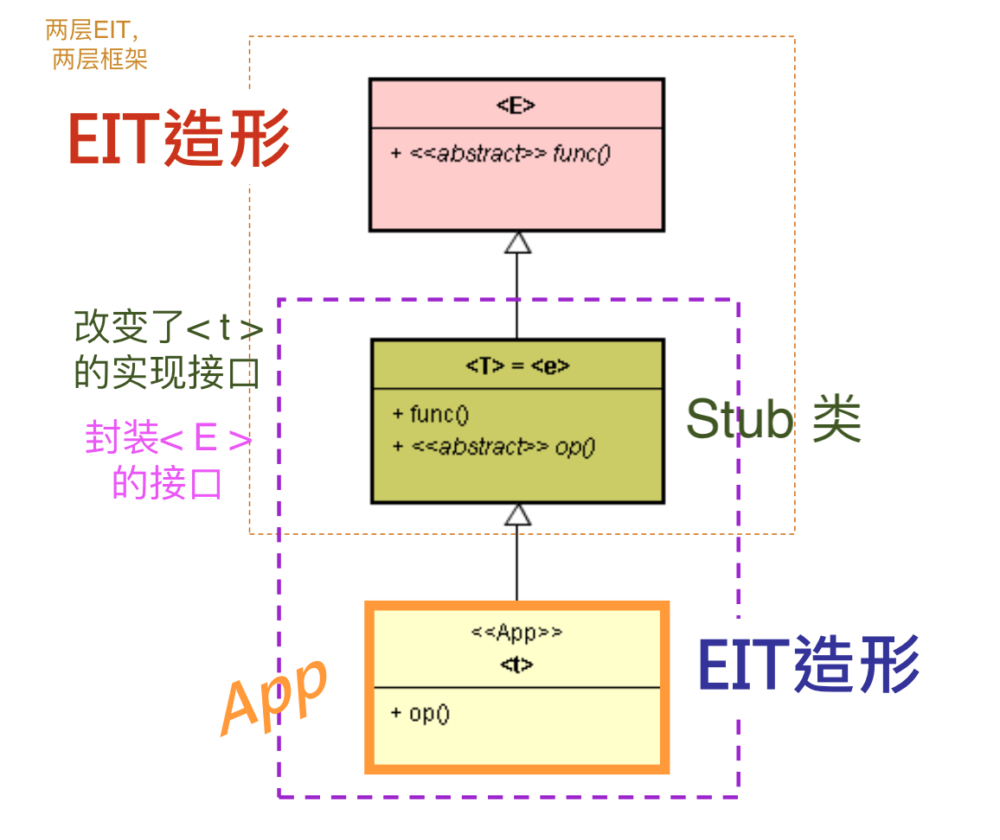
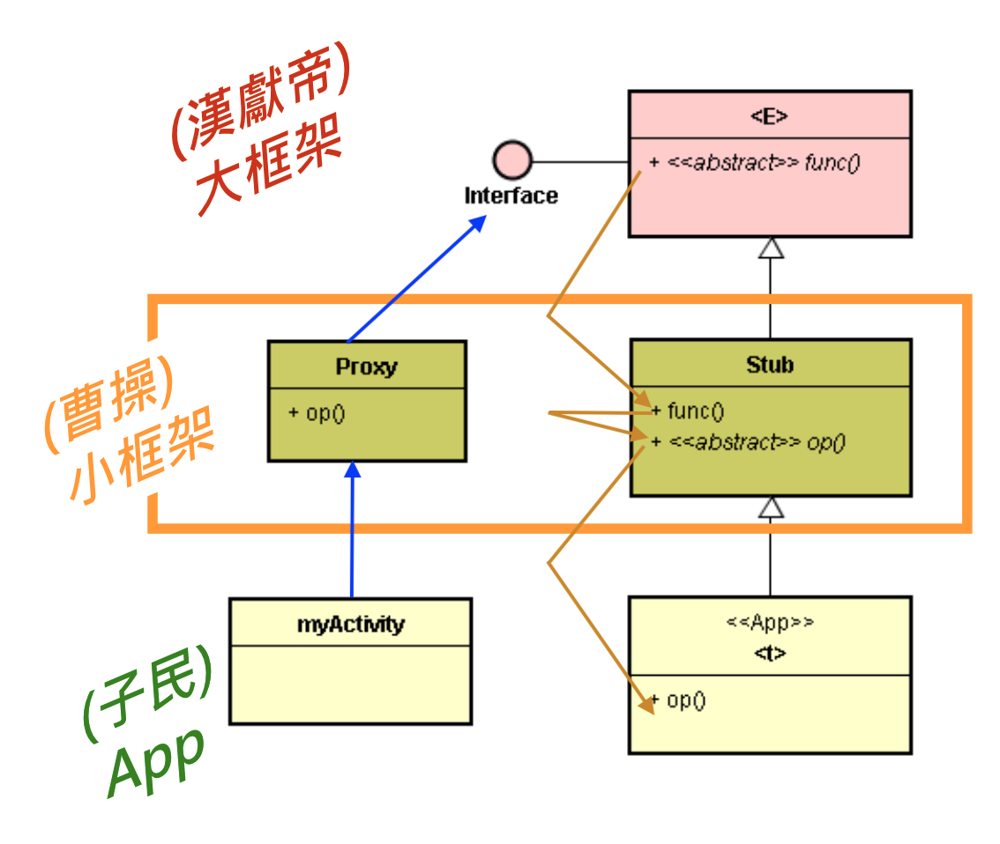
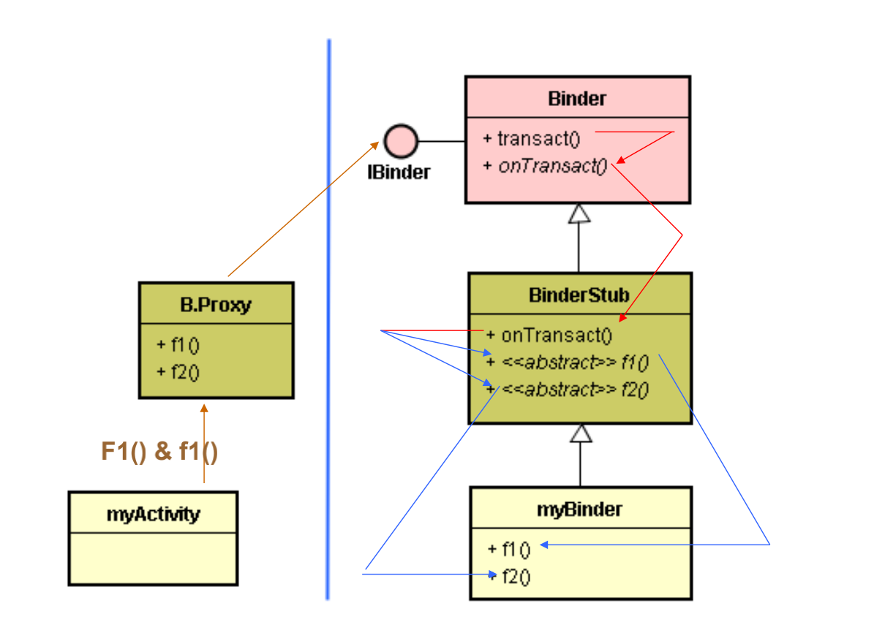
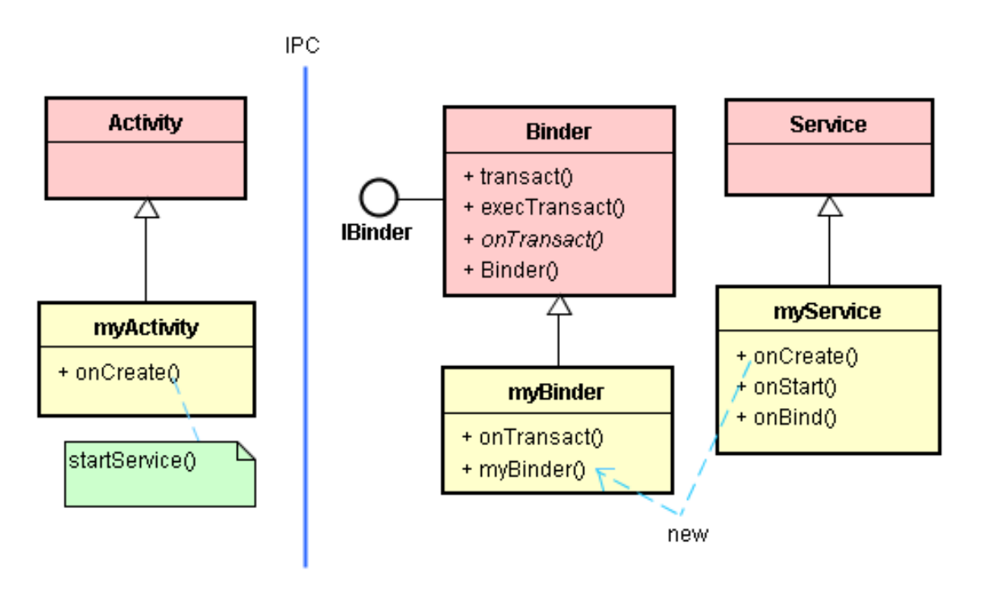

# AIDL 与 Proxy-Stub 设计模式

# 1. 复习：IBinder 接口

* stub 类

* Proxy

* Android 的典型框架

​		onTransact() 就是 EIT 造形里的 < I >。

 		这是标准的 EIT 造形，其 < I > 是支持 < 基类 / 子类 > 之间 IoC 调用的接口。

​		运用曹操 (Stub) 类，形成两层 EIT (两层框架)。

# 2. IBinder 接口的一般用途

* 不使用 Proxy-Stub 模式的开发。
* Android 的 IPC 框架仰赖单一的 IBinder 接口。此时 Client 端调用 IBinder 接口的 transact() 函数，透过 IPC 机制而调用到远方 (Remote) 的 onTransact() 函数。

* myActivity 调用 IBinder 接口，执行 myBinder  onTransact() 函数，可送信息给 myService 去播放 mp3 音乐。

* myService 也能送 Broadcast 信息给 myActivity，将字符串显示于画面上。

* 这样大大增加了 App 开发者的负担。

# 3. 包装 IBinder 接口 -- 使用 Proxy-Stub 设计模式

* 采用 Proxy-Stub 设计模式将 IBinder 接口包装起来，让 App 与 IBinder 接口不再产生高度相依性。
* 其将 IBinder 接口包装起来，转换出更好用的新接口。

* Proxy 类提供较好用的 IA 接口给 Client 使用。
* Stub 类别则是屏蔽了 Binder 基类的 onTransact() 函数，然后将 IA 接口里的 f1() 和 f2() 函数定义为抽象函数。于是简化了 App 开发的负担。
* EIT 造形的双层组合

# 4. 谁来写 Proxy 及 Stub 类呢？ -- 地头蛇（App 开发者）自己写

* 在这个范例里，定义了一个 IPlayer 接口，然后规划了 PlayerProxy 和 PlayerStub 两的类。

* PlayerStub 类将 onTransact() 函数隐藏起来，提供一个更具有美感、更亲切的新接口给 mp3Binder 类使用。
* 隐藏了 onTransact() 函数之后，mp3Binder 类的开发者就不必费心去了解 onTransact() 函数了。于是，PlayerProxy 与PlayerStub 两个类遥遥相对，并且将 IPC 细节知识 ( 例如 transact() 和 onTransact() 函数之参数等 ) 包夹起来。

# 5. 谁来写 Proxy 及 Stub 类呢？ -- 强龙提供 AIDL 工具，给地头蛇产出 Proxy 和 Stub 类

* 由框架开发者来撰写 Proxy-Stub 类，才能减轻开发者的负担。

* 框架分为：<天子框架> 和 <曹操框架>。 因此，应该由两者(天子或曹操) 之一来撰写 Proxy-Stub类。

* 但是，有个难题：IA 接口 ( f1 和 f2 函数 ) 的内容必须等到 <买主> 来了才会知道。 在框架开发阶段，买主还没来，IA 接口的知识无法取得，又如何定义 IA 接口呢? 没有 IA 接口定义，又如何撰写 Stub 和 Proxy 类呢?

  * 技术之一是：类别模版（class template）

    BinderProxy< IPlayer > proxy;

  * 程序生成器（program generator）

    例如：Android 的 aid.exe

* AIDL 的目的是定义 Proxy/Stub 来封装 IBinder 接口，以便产生更亲切贴心的新接口。 

* 所以，在应用程序里，可以选择使用 IBinder 接口，也可以使用 AIDL 来定义出新接口。

* 由于 IBinder 接口只提供单一函数 (即 transact() 函数) 来进行远距通信，呼叫起来比较不方便。

* 所以 Android 提供 aidl.exe 工具来协助产出 Proxy 和 Stub 类别，以化解这个困难。

