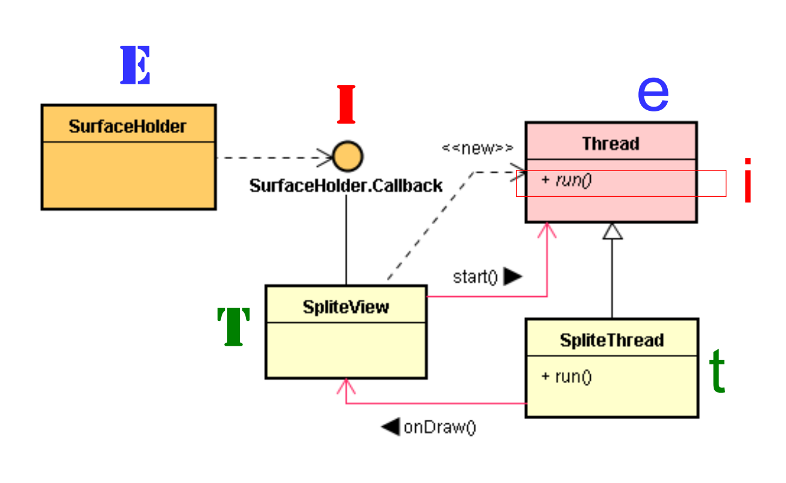

# Surface 的 UI 多线程

# 1. View 与 SurfaceView 之区别

* SurfaceView 是 View 的子类，其内嵌了一个用来绘制的 Surface。 
* 当 SurfaceView 成为可见时，就会诞生 Surface；反之当 SurfaceView 被隐藏时，就会删除 Surface，以便节省资源。
* 程序里可以控制 Surface 的大小，SurfaceView 可控制 Surface 的绘图位置。
* View 组件是由 UI 线程(主线程所执行)。如果需要去迅速更新 UI 画面或者UI画图需要较长时间(避免阻塞主线程)，就使用 SurfaceView。
* 它可以由背景线程(background thead)来执行，而 View 只能由 UI(主)线程执行。这 SurfaceView 内含高效率的 rendering 机制，能让背景线程快速更新 surface 的内容，适合演示动画(animation)。

* 在程序里，可以通过 SurfaceHolder 接口来处理 Surface，只要调用 getHolder() 函数就可以取得此接口。
* 当 SurfaceView 成为可见时，就会诞生 Surface；反之当 SurfaceView 被隐藏时，就会删除 Surface，以便节省资源。当 Surface 诞生和删除时，框架互调用 SurfaceCreated() 和  SurfaceDestroyed() 函数。

# 2. 使用 SurfaceView 画 2D 图

* 主线程创建 SurfaceHolder，SpliteThread 里的 onDraw() 在子线程中运行。