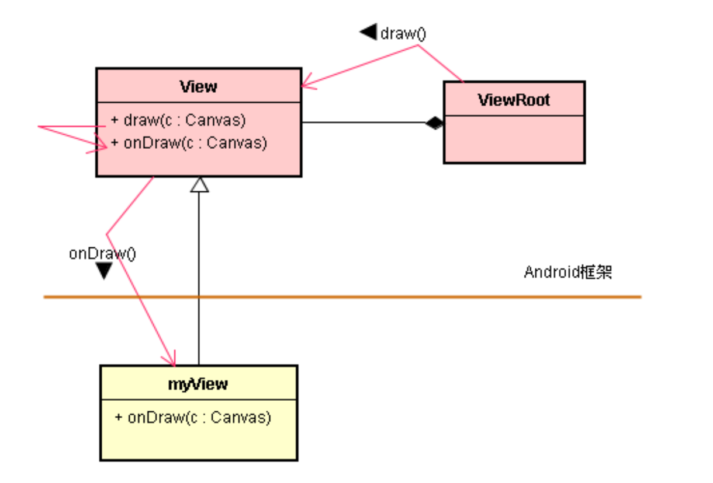
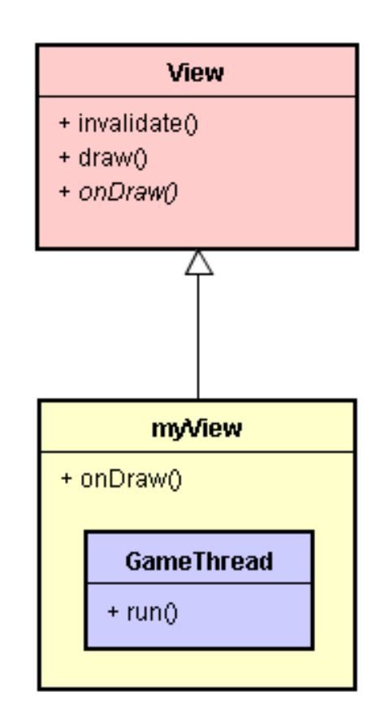
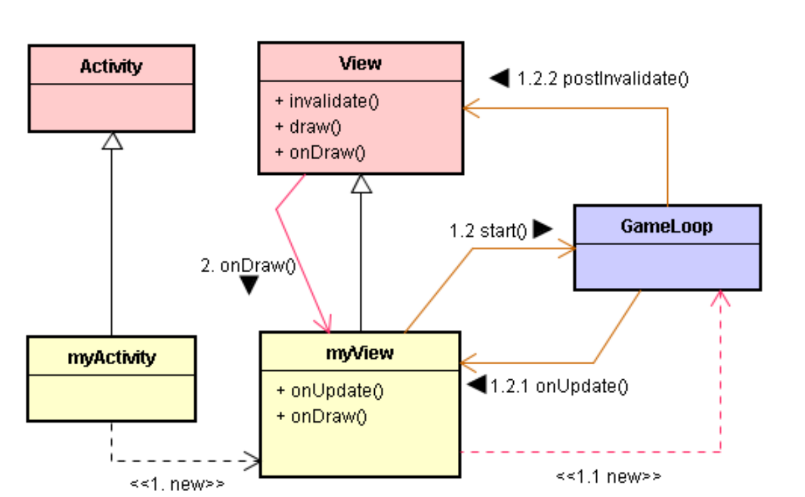

# 应用 Android 的 UI 框架

-- 以设计游戏循环（GameLoop）为例

# 1. UI 线程、View 与 onDraw() 函数

* 游戏的 UI 画面通常是由大量美工贴图所构成的，并不会使用一般的 Layout 来布局，而是使用画布 (Canvas) 来把图片显示于 View 的窗口里。
* 在 View 类里有个 onDraw() 函数，View 类体系里的每一个类都必须覆写 (Override) 这个 onDraw() 函数，来执行实际绘图的动作。 
* 游戏的基本动作就是不断的进行：绘图和刷新 (Refresh) 画面。其中，onDraw() 函数实践画图，将图形绘制于 View 的画布 (Canvas) 上，并显示出来；而 invalidate() 函数则启动画面的刷新，重新調用一次 onDraw() 函数。
* 当我们设计 myView 子类别时，也必须覆写 onDraw() 函数。在程序执行时，Android 框架会进行反向調用到 myView 的 onDraw() 函数来进行画图动作。

# 2. 基本游戏循环（GameLoop）

* 游戏的基本动作就是不断的绕回圈 (Loop)，重复绘图和刷新画面的动作。最简单的循环实现方式是：在 onDraw() 函数里調用 invalidate() 函数，就能刷新画面 ( 重新調用一次onDraw() 函数 ) 了。

* Android 中提供了 invalidate() 来实现画面的刷新：即触发框架重新执行 onDraw() 函数来绘图及显示。

# 3. 使用 UI 线程的 MQ（Message Queue）

* 可以透过 Message 方式来触发 UI 线程去調用 invalidate() 函数，而达到重新执行 onDraw() 来进行重复绘图和刷新画面的动作。
* 使用 sendMessageDelayed() 函数来暂停一下，延迟数秒钟才传递  Message 给 UI 线程。

# 4. 诞生一个小线程，担任游戏线程

* 也可以由其它线程来丢 Message 到 UI 线程的 MQ 里，来触发 UI 线程去調用 invalidate() 函数。

# 5. 小线程调用 postInvalidate()

* 由小线程直接去調用 postInvalidate() 函数；就相当于，由小线程传递 Message 给 UI 线程，触发 UI 线程去調用invalidate() 函数。

# 6. 设计一个 GameLoop 类别

* GameThread 扮演了游戏线程（Game thread）的角色，它负责控制游戏的循环。
* 于是，将 GameThread 线程部分独立出来，成为一个独立的类别，通称为游戏线程 (Game Thread) 或游戏循环 (Game Loop)。

# 7. 只诞生一次 GameLoop 对象

* 每次执行 onDraw() 时，都会重新诞生一次 GameThread 对象，也诞生一次游戏线程去調用 postInvalidate() 函数。似乎是 UI 线程控制着游戏线程，这样游戏线程就不能扮演主控者的角色了。
* 于是，可换一个方式：一开始先诞生一个游戏线程，并且使用 while(true) 来创造一个无限循环 (Endless Loop)，让游戏线程持续绕回圈，而不会停止。

* 在诞生 myView 时，就诞生 GameLoop 对象，且調用其 start() 函数来启动游戏线程。此时游戏线程处于<暂停>状态，虽然继续绕回圈，但是并不会調用 postInvalidate() 函数。接着，由 Android 框架調用 myView 的 onDraw() 函数来绘图和显示。
* 绘图完毕，立即調用 GameLoop 的 loopResume() 函数，让 GameLoop 从 < 暂停 > 状态转移到 < 执行 > 状态。此时，这游戏线程就去調用 postInvalidate() 函数，触发 UI 线程重新調用 myView 的 onDraw() 函数。
* 请留意：onUpdate() 函数是由游戏线程所执行的；而 onDraw() 则是由 UI 线程所执行的。