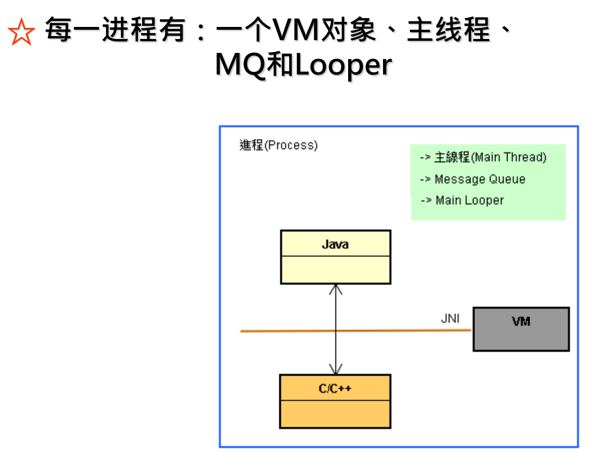
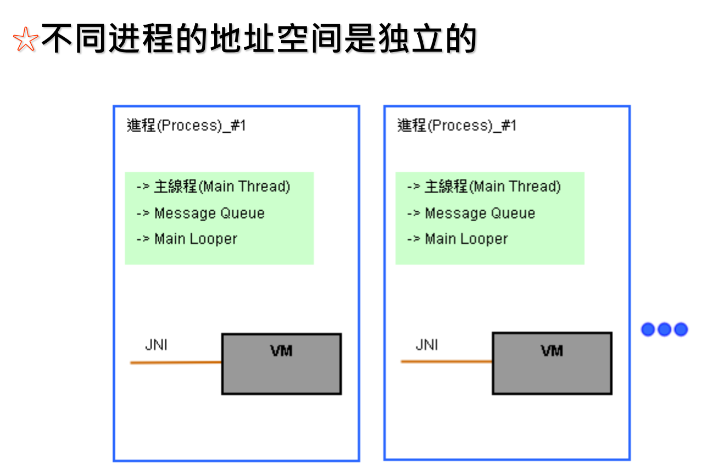
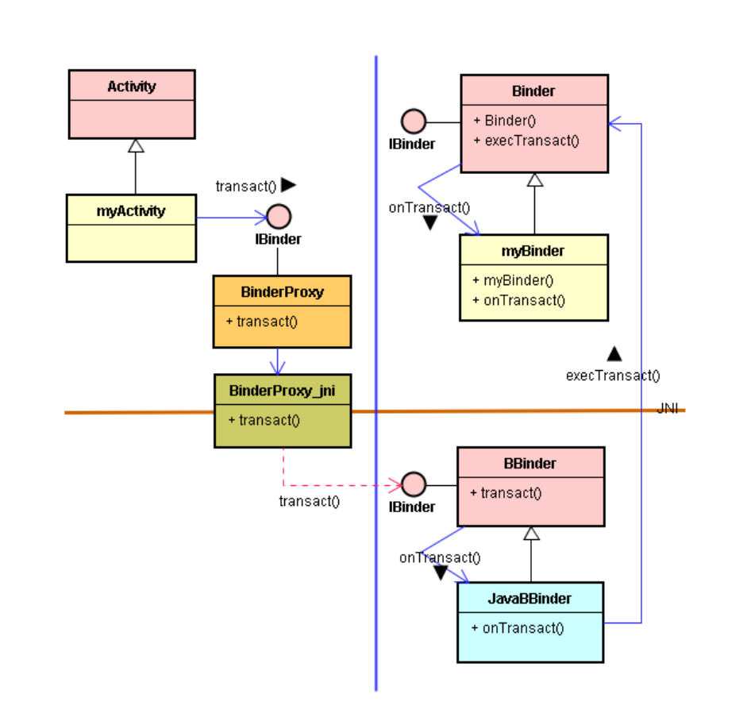
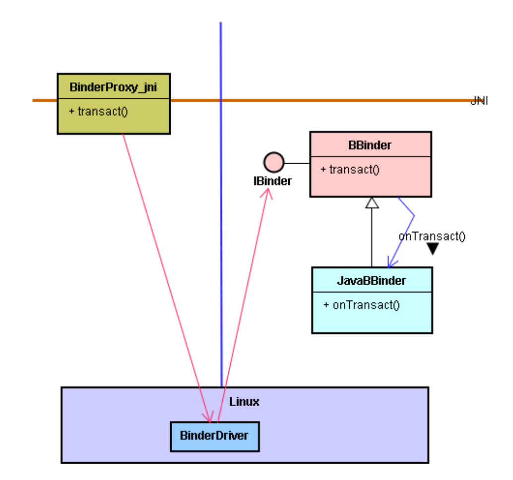
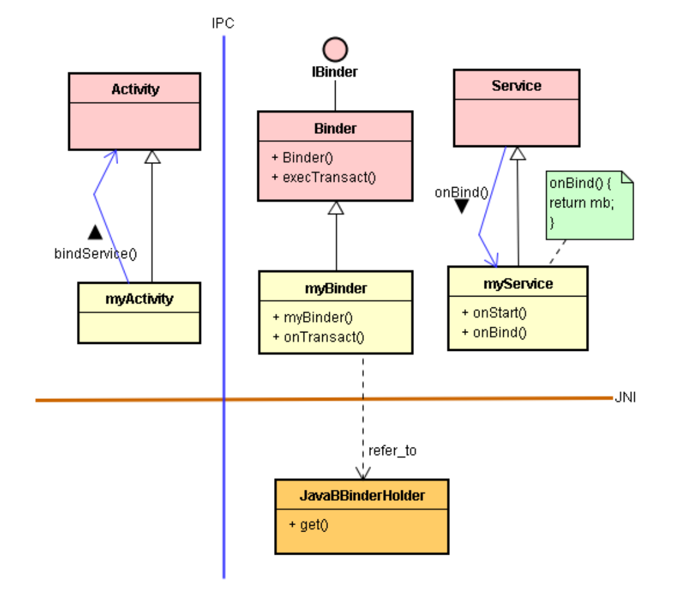
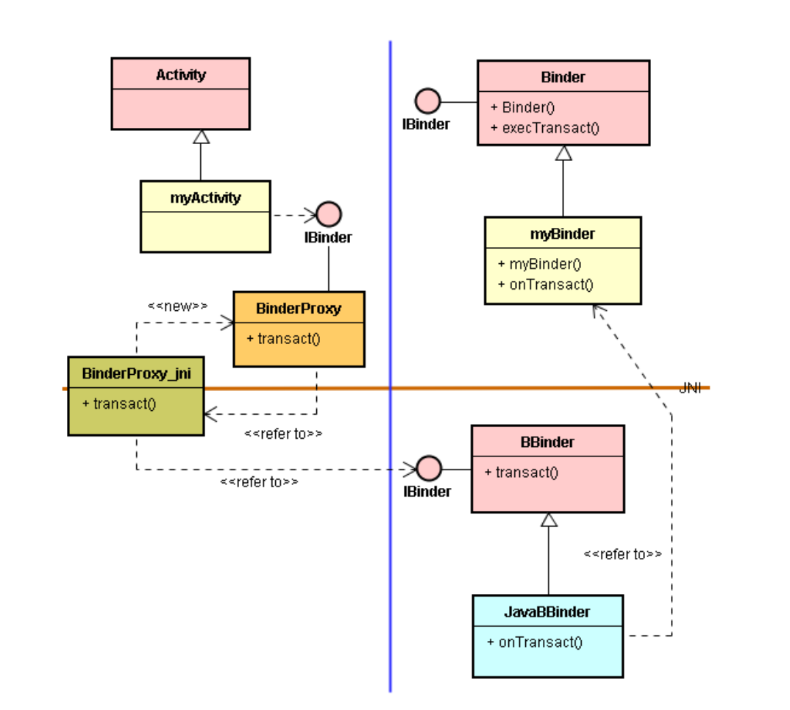
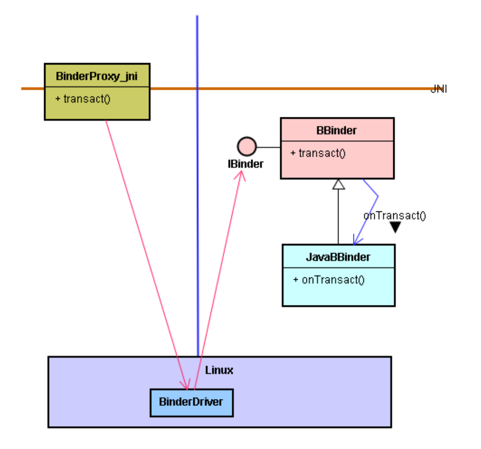

# 认识进程（Process）与 IPC  架构

# 1. 什么是 IPC 通信

## 1.1. IPC 通信概念

* IPC（Inter-Process Communication）通信，是跨越两个不同进程（Process）之通信。
* 一般而言，一个 Android 应用程序里的各组 件 ( 如 Activity、Service 等 ) 都在同一个进程里执行。这种在同一进程内的通信，又称为**短程通信**，意味着，两个 Activity 在同一个进程(Process)里执行。
* 相对地，**远程( Remote )通信**的意思是：两个组件 ( 如 Activity 或 Service ) 分别在不同的进程里执行；两者之间是 IPC 通信，又称远程通信。

## 1.2. IPC 通信的效率

* 当我们启动某一支应用程序 (App) 时，Android 系统里的 Zygote 服务孵化 (Fork) 一个新进程 (Process) 给它，然后将它 (该 App ) 加载到这个新诞生的进程里。
* 基于 Linux 的安全限制，以及进程的基本特性 ( 例如，不同进程的地址空间是独立的 )，如果两个类 ( 或其对象 ) 在同一个进程里执行时，两者沟通方便也快速 。但是，当它们分别在不同的进程里执行时，两者沟通就属于 IPC 跨进程沟通了，不如前者方便，也慢些 。

# 2. 复习：Android 的进程概念

* 一个进程是一个独立的执行空间，不会被正在其它进程里的程序所侵犯。这种保护方法是 Android 的重要安全机制。于是，得先认识进程的内涵，才能进一步了解跨进程 IPC 机制。
* 在 Android 的进程里，有一个虚拟机 (Virtual Machine，简称 VM) 的对象，可执行 Java 代码，也引导 JNI 本地程序的执行，实现 Java 与 C/C++ 之间的沟通；如下图：



* 每一个进程在诞生时，都会诞生一个主线程 (Main Thread)，以及诞生一个 Looper 类的对象和一个 MQ(Message Queue) 数据结构。每当主线程做完事情，就会去执行 Looper 类。此时，不断地观察 MQ 的动态。

  如下图：

  

* 主线程最主要的工作就是处理 UI 画面的事件(Event)，每当 UI 事件发生时，Android 框架会丢信息(Message)到 MQ 里。主线程看到 MQ 有新的信息时，就取出信息，然后依据信息内容而去执行特定的函数。执行完毕，就再继续执行 Looper 类，不断地观察 MQ 的动态。

* 刚才说明了，当两个类都在同一个进程里执行时，两者之间的沟通，只要采取一般的函数调用(Function Call)就行了，既快速又方便。一旦两个类分别在不同的进程里执行时，两者之间的沟通，就不能采取一般的函数调用途径了，只好采取 IPC 沟通途径。

# 3. 设定 IPC 通信 -- 使用 AndroidManifest.xml 文件

* 在 Android 框架里，一个应用(程序)套件(Application Package)通常含有多个 Java 类 (Class)，这些类可以在同一个进程 (Process) 里执行；也可以在不同的进程里执行 。 

* 通常，一个进程只会摆一支 App。但是一支 App 可占用多个进程。
* 在 Android 的各进程里，都有一个 VM 对象，执行 Java 代码，也引导 JNI 本地程序的执行，实现 Java 与 C/C++ 程序之间的沟通。

# 4. IPC 的 IBinder 接口 -- 定义与实现

## 4.1. IBinder 接口的定义

* 大家都知道，当两个类都在同一个进程里执行时，两者之间的沟通，只要采取一般的函数调用(Function Call)就行了，既快速又方便。一旦两个类分别在不同的进程里执行时，两者之间的沟通，就不能采取一般的函数调用途径了。只好采取 IPC 沟通途径。

*  Android 框架的 IPC 沟通仰赖单一的 IBinder 接口。此时 Client 端调用 IBinder 接口的 transact() 函数，透过 IPC 机制而调用到远方 (Remote) 的 onTransact() 函数。

* 在 Android 的源代码里，Java 层的 IBinder 接口是定义于IBinder.java 代码文档里。此程序文件如下：

  ```java
  // IBinder.java
  // .......
  public interface IBinder {
  		// ..........
  		public boolean transact(int code, Parcel data, Parcel reply, int flags) throws RemoteException;
  	  // ...........
  }
  ```

* IBinder 接口定义了一些函数，可以让 Client 程序可以进行跨进程的調用 ( 当然也能支持同进程的短程調用 )。其中，最主要的一个函数就是：transact() 函数。

## 4.2. IBinder 接口的实现类

* 基于这个 IBinder.java 定义档，我们就可以开发类别来实作(Implement)它，然后提供给其它 App 来調用了。在 Android 的框架里，也撰写了 Binder 基类和 BinderProxy 类别来实作 IBinder 接口。
* Binder 基类的很重要目的是支持跨进程調用 Service（举例），也就是让远程的 Client 可以跨进程調用某个 Service （举例）。

## 4.3. Binder 基类的主要函数

*  transact() 函数

  用来实作 IBinder 的 transact() 函数接口。

* execTransact() 函数

  其角色与 transact() 函数是相同的，只是这是用来让 C/C++ 本地程序来調用的。

* onTransact() 函数

  这是一个抽象函数，让应用子类来覆写 (Override) 的。上述的 transact() 和 execTransact() 两者都是調用 onTransact() 函数来实现反向調用 (IoC, Inversion of Control) 的。

* init() 函数

  这是一个本地 (Native) 函数，让 JNI 模块来实现这个函数。Binder() 构造函数 (Constructor) 会調用这个 init() 本地函数。

### 4.3.1. UML 图形表示


* Binder 就是 EIT 造形里的 < E >。
* 这个 IBinder 接口是 Binder (即 < E > )提供给 Client 的接口，简称为 < CI >。
* onTransact() 就是 EIT 造形里的 < I >。
* 这是标准的 EIT 造形，其 < I > 是支持 < 基类/子类> 之间 IoC 调用的接口。 
*  Init() 是 EIT 造形的另一种特殊接口，其支持 < 从 Java 到本地 C > 之间的调用接口。


* 当 Binder 的子类别诞生对象时，会調用到 Binder() 构造函数。此时，Binder() 会調用到 init() 本地函数。

## 4.4. Java 层的 BinderProxy 基类定义

* 当我们看到类别名称是 XXXProxy 时，就自然会联想到它是摆在 Client 进程里，担任 Service 端的分身 (Proxy)。 
* 由于跨进程沟通时，并不是从 Java 层直接沟通的，而是透过底层的 Binder Driver 驱动来沟通的，所以 Client 端的 Java 类别 ( 如 Activity ) 必须透过 BinderProxy 分身的 IBinder 接口，转而調用 JNI 本地模块来衔接到底层 Binder Driver 驱动服务，进而調用到正在另一个进程里执行的 Service。
* 当 Client 透过 IBinder 接口而調用到 BinderProxy 的transact() 函数，就調用到其 JNI 本地模块的 transact() 函数，就能进而衔接到底层 Binder Driver 驱动服务了。



* 在上图里，从 JNI 本地模块拉了一条红色虚线，表示这并非直接的通信途径。也就是，实际上是透过底层 Binder Driver 驱动才調用到 BBinder 的 IBinder 接口。如下图：




# 5. 使用 IBinder 接口


* 在图里，从 myActivity 到 IBinder 接口，画上了虚线箭头，表示那是抽象概念的。实际上，myActivity 并没有直接調用 Java 层的 IBinder 接口，而是绕到底层 C/C++ 和 Binder 驱动而间接調用到 Binder 基类的 execTransact() 函数，转而調用 myBinder 的 onTransact() 函数。

# 6. IPC 通信的三步骤

* 三步骤：配对、建桥、相会

​		其 IPC 通信的三个步骤是：

* **Step-1.** Activity 使用 startService() 函數來啟動 Service。
* **Step-2.** Activity 調用 bindService() 来绑定 Service。亦即，Activity 建立与 Service 之间的连结(Connection)。
* **Step-3.** Activity 調用 IBinder 接口的 transact() 函数，透过底层 Binder Driver 驱动而间接調用到 Binder 基类的 execTransact() 函数，转而調用 myBinder 的 onTransact()   函数。

## 6.1. Step-1：调用 startService()

* 当 myActivity 調用 startService() 时，就調用Service.onStart() 函数，执行到指令：

  `mb = new myBinder()`

* 接着，調用 myBinder() 建构式(Constructor)；进而調用父类别 Binder() 建构式，转而調用 JNI 本地的 init() 函数。

* 此刻执行 init() 函数时，会在 C/C++ 层里诞生一个JavaBBinderHolder 类别的对象，并且将这JavaBBinderHolder 对象的指针存入到 myBinder 对象里，让 myBinder 对象指向 JavaBBinderHolder 对象。


## 6.2. Step-2：调用 bindService()

* 目前，已经执行完 startService() 函数了。接着，myActivity 继续調用 bindService() 函数，想去绑定 Service 服务。如果找到该服务，且它尚未被任何 Client 所绑定的话，就会調用 myService 的 onBind() 函数。此时，执行到指令：

  `return mb;`

* 这 onBind() 函数将 mb ( 即 myBinder 对象的 IBinder 接口 )回传 Android 框架 ( 其实是框架里的AMS (ActivityManagerService))。



* 当 AMS 接到回传来的 myBinder 对象指针 ( 即其 IBinder 接口 ) 时，就可以找到其在 C/C++ 层所对映的JavaBBinderHolder 对象。接着，又調用JavaBBinderHolder 的 get() 函数去诞生一个 JavaBBinder 对象。

* 接着，AMS 在 Client 端进程的 java 层里诞生一个BinderProxy 对象来代表 JavaBBinder 的分身，也就是代表了 myBinder 的分身。最后将 BinderProxy 的 IBinder 接口回传给 myActivity。 

* 此时完成了跨进程的服务绑定(Bind)，如下图：

  

## 6.3. step-3：调用 IBinder 接口的 transact()

* 所谓建好了服务绑定(Bind)之后，就如同建好了跨进程的桥梁。之后，就能随时透过这桥梁而进行从 myActivity 調用到myService 的跨进程 IPC 通信。绑定了服务之后，就能从myActivity 調用 BinderProxy ( 透过 IBinder 接口 ) 的 IBinder 接口，执行了 transact() 函数。如下图：

  

* 在上图里，从 JNI 本地模块拉了一条红色虚线，表示这并非直接的通信途径。也就是，实际上是透过底层 Binder Driver 驱动才調用到 BBinder 的 IBinder 接口。如下图：

  

​	总结上述Activity与Service之间IPC通信的三个步骤：

* Step-1. 調用 startService()。
*  Step-2. 調用bindService()。 
* Step-3. 調用 IBinder 接口的 transact()。 

# 7. 短程通信 vs 远程通信

​		短程通信与远程通信举例。

* App 启动时，就会把 App 的 load 到内存里，此刻通称为 loading-time。