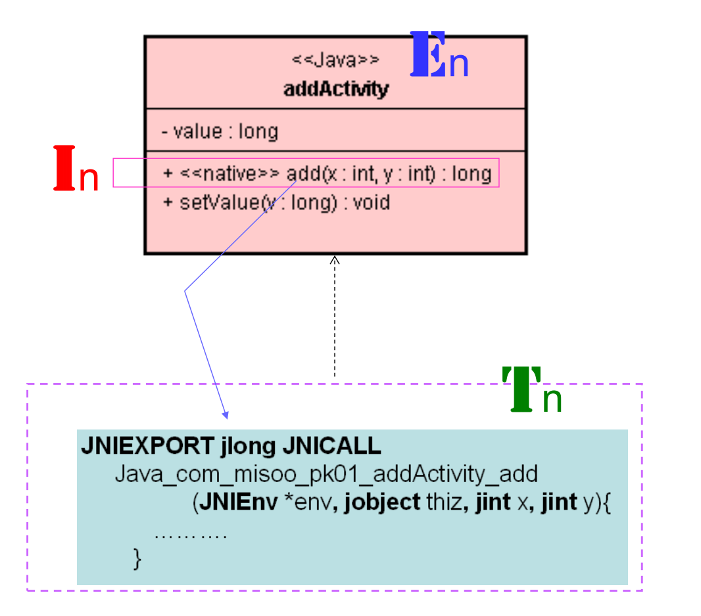
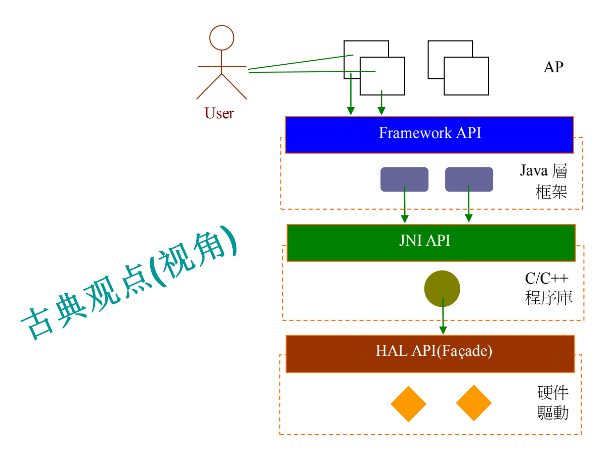
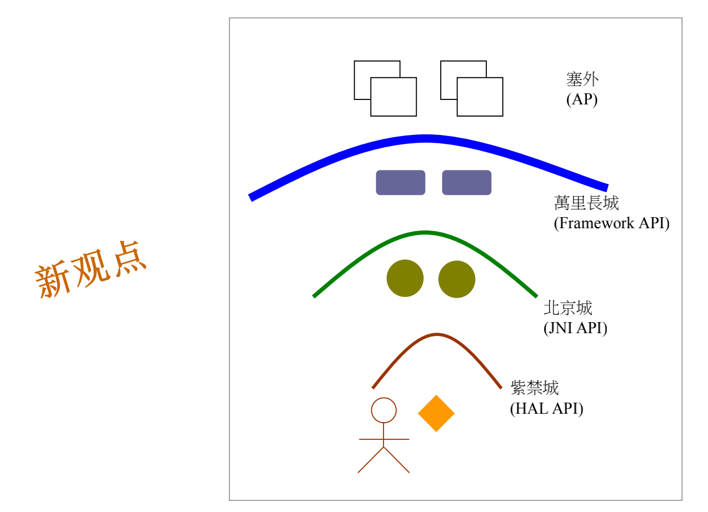
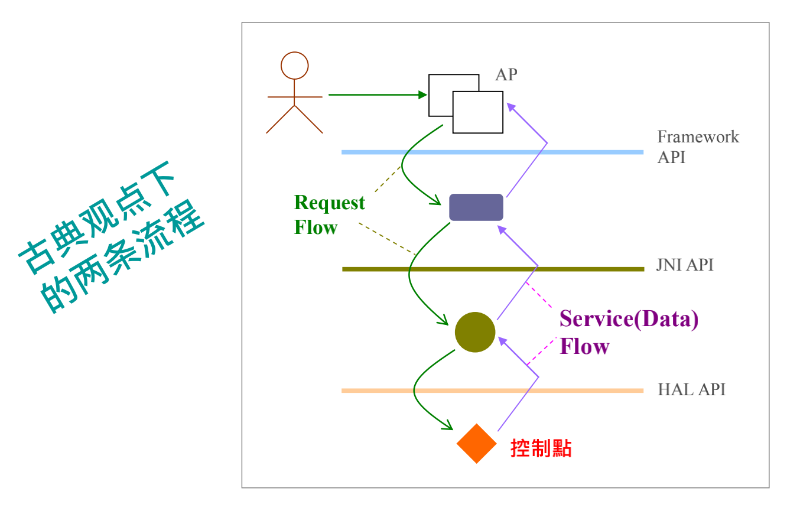
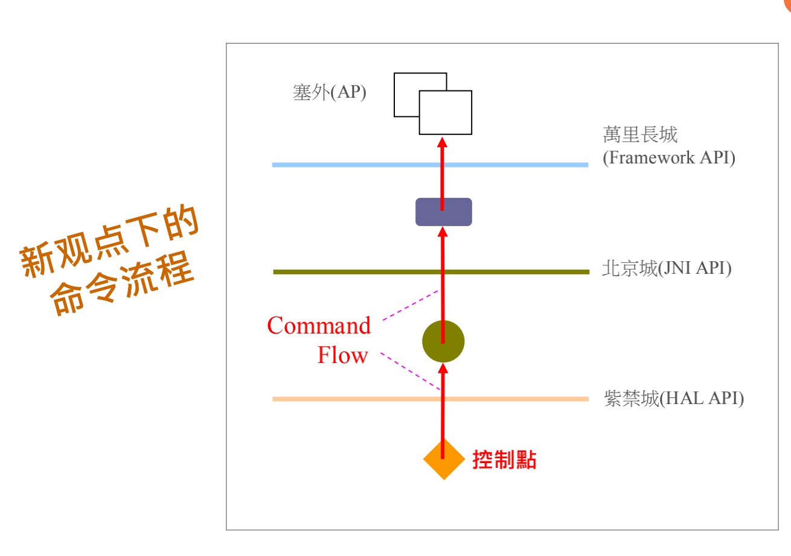
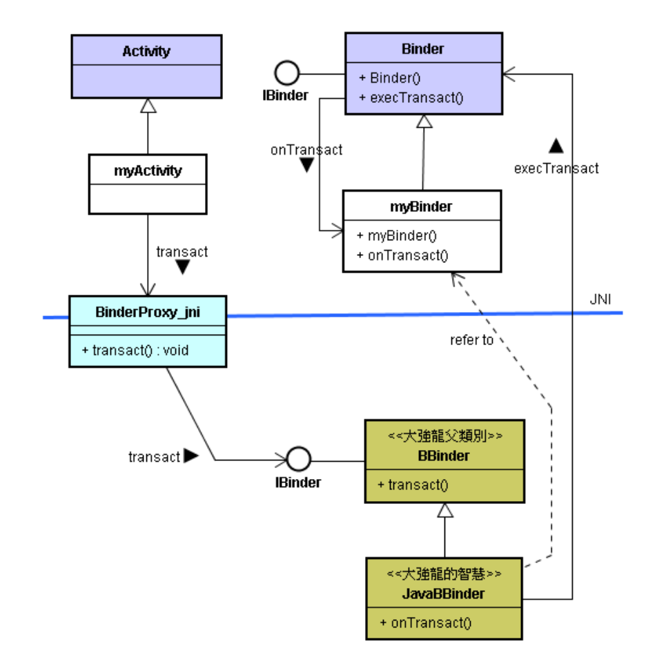

# JNI：从 C 调用 Java 函数

# 1. Why？将控制点下移到下 C/C++ 层

## 1.1. 对古典视角的反思

* App 接近 User，所以 App 在整体架构里，是主导者，拥有控制权。
* 所以，App 是架构的**控制点**所在。
*  Java 函数调用 C/C++ 层函数，是合理的。
* 但是EIT造形告诉我们：App 是被调用的，它被要求： “**Don’t call me, I’ll call you back.** ”
* 新潮视角：框架 (<E&I>) 拥有主导权，是控制点所在。
* **控制点**可以下移到 C/C++ 层。=》 软硬结合的机会。
* 软硬结合的范例：把 Zigbee Dongle（硬件）插件插到手机上，就能立即 (自动地) 启动 App 画面。


# 2. 控制点与函数调用

* C 调用 Java 函数，并不一定表示 C 层拥有控制点。
* 但是，C 层拥有控制点的必备表现是：C 调用 Java 层函数。
* EIT 造形的典型反向调用：IoC



* < T > 也能（正向）调用 < E >


* Android 的范例


## 2.1. C 层拥有控制点的比喻

### 2.1.1. 古典观点



* 底层提供服务给上层调用。
* User 希望 AP 稳定不变。
* AP 希望 Java 框架不变。
* Java 框架期待 C/C++ 模块不变。
* C/C++ 模块期待驱动稳定不变。
* 人人都期待底下的 “ 平台 ” 不变。

### 2.1.2. 新观点



* 地位尊卑顺序相反。
* 地位尊卑顺序相反。
* 老观点，人人争先恐后做 AP。 
* 反之，新观点，争先恐后做框架和 API。 
* 新观点，底层先获利。万里长城让关内居民先获利。有利于软硬整合厂家。

### 2.1.3. 观点对比



* 这不重视另一项流程：命令流程 (Command Flow)。误认为请求流程 == 命令流程。
* 于是，命令来自业主或 AP，底层硬件厂成为长工，难以实现软硬整合。
* 大家都知道命令的来源是紫禁城内，流向北京城外，再流到长城之外。



* 紫禁城内清朝皇帝的主导地位，必然会最第一道防线(即万里长城)设立关口，并重兵驻守，成为具有高度主导性的接口，例如山海关、居庸关等。
* 唯有主导性 API (或称接口，或称关口) 才能确保命令的传递和执行。在此平台里，硬件差异化才能凸显于 API 上，与 App 相会合。


* C/C++ 掌握主导权 (话语权)、拥有控制点的更多表现：

  除了 C 函数调用 Java 层函数之外，还有：

  1. C 函数存取 Java 对象的属性值。
  2. C 函数创建 Java 层的对象 (object)。

# 3. How-to：从 C 调用 Java 函数

## 3.1. 控制点的基本特性

* 如果控制点摆在本地 C 层，就会常常
  1. 从本地 C 函数去调用 Java 函数；
  2. 从本地 C 函数去存取 Java 层对象的属性值；
  3. 从本地 C 函数去创建 Java 层的对象。

## 3.2. 从 C 调用 Java 函数

* 关于 JNI，大家都知道如何从 Java 调用 C 函 数。然而，在 Android 里，反而由 C 呼叫 Java 的情形才更具关键性。
* 例如，Activity 的跨进程沟通如下：



* 当 App 里的 Activity 透过 IBinder 接口来与 Service 进行 IPC 沟通时，事实上是由 Java 层的 Activity 调用 C/C++ 模块去进行 IPC 沟通，再由 C 模块调用 Java 层的 Service。 
* 所以，Java 与 C 函数的双向调用都是 Android 平台的重要机制。

## 3.3. How To

* 拿目前对象指针换取它的类 (目前类) ID：

  ```c
  jclass clazz = (*env)->GetObjectClass(env, thiz);
  ```

* 拿目前类 ID 换取某函数 ID：

  ```c
  m_mid = (*env)->GetMethodID(env, m_class,"setV", "(I)V");
  ```

* 依据类 ID 和函数 ID，调用这指定的类里的指定的函数：

  ```c
  (*env)->CallVoidMethod(env, m_object, m_mid, sum);
  ```

# 4. C 函数存取 Java 对象的值

## 4.1. C 函数调用 Java 函数存取对象值基本步骤

0. 有了 Java 层对象 (thiz)

1.  问这个对象 thiz 的类，得到 clazz

   ```c
   jclass clazz = (*env)->GetObjectClass(env, thiz);
   ```

2.  问这个类里的 setV() 函数，得到 methodID

   ```c
   m_mid = (*env)->GetMethodID(env, clazz, "setV", "(I)V");
   ```

3. 基于 methodID 和 thiz，调用 setV() 函数

   ```c
   int sum = 25;
   (*env)->CallVoidMethod(env, thiz, m_mid, sum);
   ```

## 4.2. C 函数直接存取属性值

* 刚才是透过函数调用 (function call) 来存取 Java 对象的属性值。
* C 函数也能直接存取属性值。

### 4.2.1. 基本步骤

0. 有了 Java 层对象 (thiz)

1.  问这个对象 thiz 的类，得到 clazz

   ```c
   jclass clazz = (*env)->GetObjectClass(env, thiz);
   ```

2. 问这个类里的 numb 属性，得到 fieldID

   ```c
   m_fid = (*env)->GetFieldID(env, clazz, "numb", "I");
   ```

3. 基于 fieldID 和 thiz，直接存取 numb 值

   ```c
   n = (int)(*env)->GetObjectField(env, m_object, m_fid);
   ```

# 5. 从 C 创建 Java 对象

* 掌握对象的生杀大权，是拥有控制权的象征。
* 目前你已经会调用 Java 函数了。那就会调用一种特别的函数了。这种特别的函数，叫作构造式。调用构造式，就能创建对象了。
* 改由 C 模块来诞生 Java 层的 ResultValue 对象，其意味着 C 模块拥有较大的掌控权。也就是说，整个应用程序的控制中心点，从 Java 层转移到本地的 C 模块。
* 如果你决定由 C 模块来主导系统的执行，这项技巧是非常重要的。

## 5.1. 创建与 thiz 同类的对象

1. 问这个对象 thiz 的类，得到 clazz。
2. 问这个类里的 < init > () 构造式，得到 methodID。
3. 基于 methodID，调用构造式(创建对象) 。

## 5.2. 创建与 thiz 不同类的对象

1. 问特定的类，得到 clazz。

   ```c
   jclass clazz = (*env)->FindClass(env, "com/misoo/counter/ResultValue");
   ```

2. 问这个类里的 < init > () 构造式，得到 methodID。

   ```c
   jmethodID constr = (*env)->GetMethodID(env, clazz, “<init>", "()V");
   ```

3. 基于methodID，调用构造式(创建对象) 。

   ```c
   jobject ref = (*env)->NewObject(env, clazz, constr);
   ```

* 创建与 Thiz 同类的对象，对控制点的意义不大。因为 Java 层已经创建该类的对象，无法防止了。
* 创建与 Thiz 不同类的对象，有很大的控制涵意。

## 5.3. 结语

* 由于 Android 是开源开放的平台，我们才有将控制点往下，移到 C/C++ 层的机会。
* 当你使用手机时，你所摸的都是硬件，例如触摸屏、键盘等。
* 因此 C/C++ 层代码比 Java 层代码更早侦测到用户的事件，所以控制点往下移到 C/C++ 层有效促进软硬整合，让硬件的创新迅速浮现出来，与 Java 层 App 代码紧密结合。