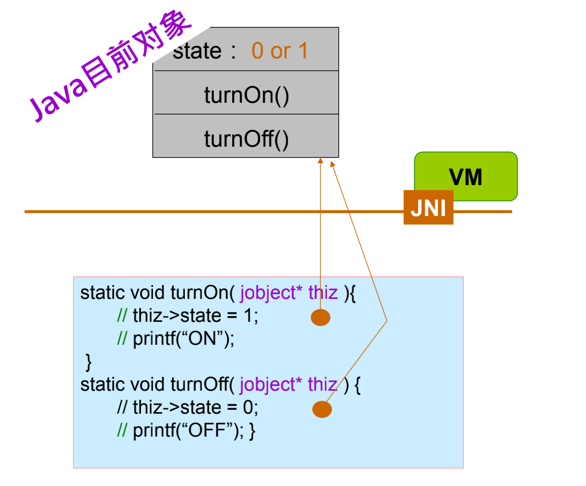
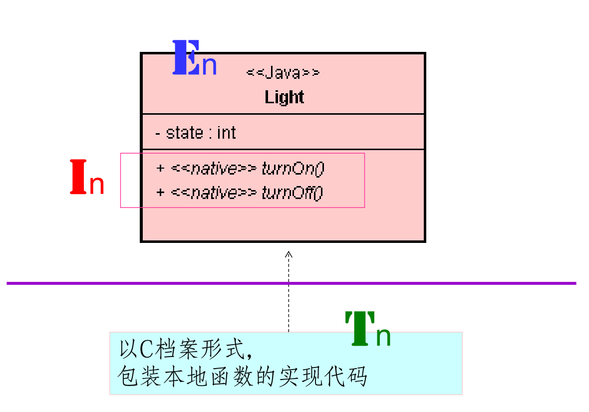
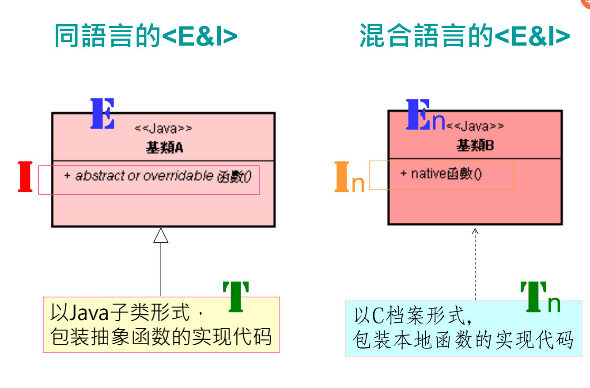

# JNI 架构原理：Java 与 C 的对接

# 1. 为什么，Android 应用需要 Java 和 C 对接呢？


# 2. EIT 造形的 Java 实现

* 到目前为止，所看到的 EIT 造形，几乎都是以 Java 代码来实现的。


* 无论是 < E >、< I > 或 < T > 都是以 Java 撰写的代码实现。

# 3. EIT 造形的 C 语言实现

## 3.1. 复习：C 语言的结构（struct）

* 定义结构形态。商品有牌子﹐定义型态就像描述一件商品的品牌。

```c
struct smile
{
		char sna;
		char size;
		float price;
};
struct smile x, y;
```

## 3.2. 复习：结构指针（Pointer）

* 宣告结构指针﹐来指向结构变量。

```c
struct smile x;
struct smile *px;
px = &x;
```

* smile 型态的变量﹐px 可以指向 x 变量。
* “&” 运算能把 x 变量的地址存入 px 中﹐使得 px 指向 x 变量。

## 3.3. 复习：动态内存分配

* 「动态」(Dynamic) 的意思是﹕待程序执行时(Run-Time)才告诉计算机共需要多少内存空间﹐计算机依照需要立即分配空间﹐裨储存数据。
* malloc() 和 free() 是最常用的动态内存分配函数。如果在执行时需要空间来储存数据﹐宜使用 malloc() 函数。用完了就用 free() 释放该空间。

```c
NODE *pn;
pn = (NODE *) malloc (sizeof(NODE));
```

* typedef 指令定义的新型态 ── NODE 是 struct kiki 的别名。

```c
struct kiki { 
char na[10];
short int age;
};
typedef struct kiki NODE;
```

## 3.4. 以 C 结构表达类（Class），并创建对象（Object）

### 3.4.1. 认识 C 函数指针

* struct 里不能定义函数本身，但能定义函数指针 (function pointer) 属性。

```c
typedef struct cc {
		int id;
		void (*hello)();
} CC;
```

​		这个 hello 就是一个函数指针属性了。

## 3.5. 在 C 函数里存取对象的属性（attribute）值


# 4. EIT 造形的 C 和 Java 组合实现

* 无论是 C 或 Java 都必须将目前对象 (Current Object) 指针传给 C 函数。
* 让 C 函数可指向目前对象，以便存取对象的内部属性质或调用类里的其它函数。



## 4.1. EIT 造形观点




## 4.2. 混合式 EIT 造形

* 一般 EIT 造形是同语言的。 

* 也就是 < E >、< I > 和 < T > 都使用同一种语言撰写的，例如上述的 Java、C/C++ 等。

* 于此，将介绍一个 EIT 造形的变形：

  < E&I > 是以 Java 撰写的。

  < T > 则是以 C 语言撰写的。



* 两种 EIT 代码造形常常合并存在


* 由谁来创建基类的对象呢？
  * 答案是：通常，< Tn > 不是 App 的一部分，而是基类(强龙撰写)的一部分。
  * 创建子类 < T > 和创建基类 < E > 对象是 App 开发者(地头蛇)的事；将 < T > 与 < E > 装配起来，也是地头蛇的事。
  * 因之，< Tn > 可能是强龙开发的，或是第三方提供的。
  * 结论：在本地 C 层，< Tn > 开发者指需要撰写本地 (native) 函数的 C 代码实现即可。
  * 创建 (基类) 对象和函数调用都是 Java 层的事。