# 复习问题集

# 1. 进程基础（1.1-1.6）

## 1.1. A1.1-process

* 下图是 Android 典型的进程（Process）架构。在每一个进程里，Android 都会创建一个 VM 的对象。


* 请问：为什么不让这些进程来共享同一个 VM 对象呢?
* 提示：確保 App 的沙盒效果(sandboxed) ，提升安全、效率和可靠性(security, performance, reliability)。

### 1.1.1. 相关问题

* 为什么每一个进程里都有一个主线程呢? 

  主线程主要是处理 UI Event，为了更新 UI 的安全性，避免多线程的同步问题。

* 每一个个主线程都有自己的 Message Queue；请问：这个 MQ 主要想装些什么信息(Message)呢? 这些信息来自何方呢? 

  MQ 主要是 UI Event 信息，非主线程传递给主线程的消息。

  信息来自主线程、非主线程。

* 而主线程的 Looper 有何用途呢?

  循环从 MQ 中取出消息，并交给主线程处理。

## 1.2. A1.2-process

* 兹将上一题附图里的进程内部稍微放大，如下图所示。


* 大家都知道，由 VM 来执行  Java 的代码；那么，谁来执行 C/C++ 的代码呢?

  CPU

### 1.2.1. 相关问题

* Android 选择了 Java与C/C++ 混合型语言架构。

* 请问：如果将 Java 改为 Python 或 JavaSctipt 等动态语言，会有什么不一样的效果或难题呢?

  Java 和 C++ 以类为结构，更适合框架的开发。

## 1.3. A1.3-process

* 例如有一个 App 的 AndroidManifest.xml 文件，其内容如下页所述。

```xml
// AndroidManifest.xml
<?xml version="1.0" encoding="utf-8"?>
	………………
	<activity android:name=".FirstActivity" 
	………………
	<activity android:name=".LoadActivity">
	………………
	<service android:name=".LoadService" 
		android:process=":remote">
	………………
</manifest>
```

* 请问：这支 App 总共占用了多少个进程呢? 而 FirstActivity、LoadActivity 和 LoadService 三者，各在那一个进程里执行

  呢?

  FirstActivity、LoadActivity 在进程 1 中执行；

  LoadService 在进程 2 中执行。

* 提示

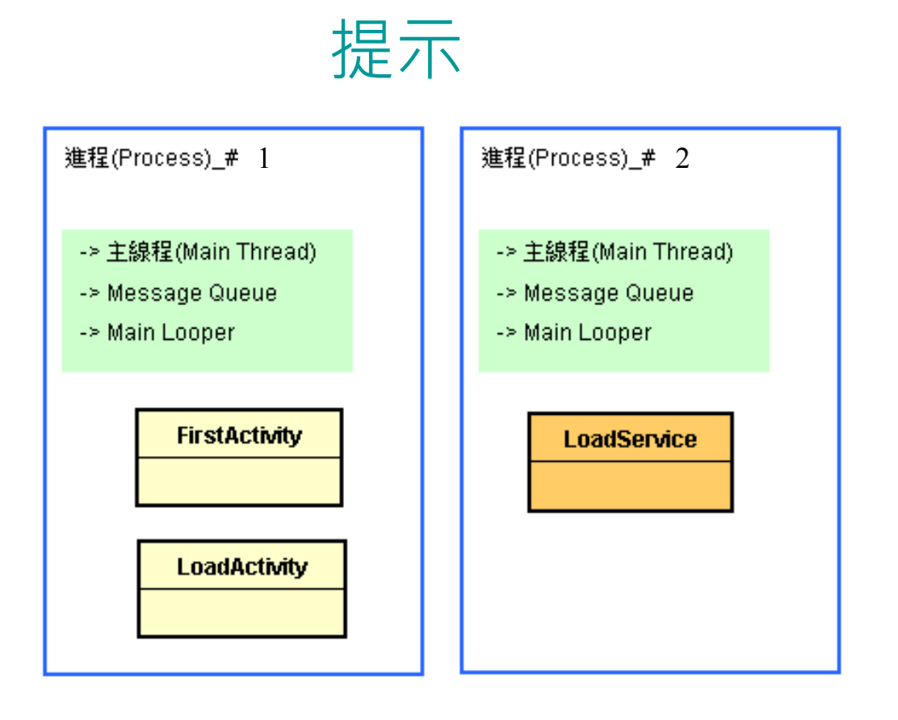

### 1.3.1. 相关问题

* 那一个线程执行 FirstActivity 呢? 

  进程 1 的主线程。

* 那一个线程执行 LoadActivity 呢? 

  进程 1 的主线程。

* 那一个线程执行 LoadService 呢?

  进程 2 的主线程。

* 从上题可知：一个 App 可占用多个进程。

* 反过来，请问：一个进程可以含有多支 App 吗? 

  也是可以的，但是不建议这样做。

* 如果可以，那么是在什么情况下才有这种需要呢? 又在何种条件下才会被 Android 允许?

  为了方便多支 App 的数据传递，减少跨进程通信的消耗。

  只要多支 App 是同一个开发人员，相同的签名文件才会被 Android 允许。

## 1.4. A 1.4 - process

* 以上所谈的都是 App 进程。与 App 进程相对的就是：系统进程。其包括：Init 进程、Zygote 进程、ServiceManager 和 System Server 等；如下图。


* 其中，System Server 进程里的 Android Service 是以 Java 写成的。
* 请问，这个 System Server 进程里，需要一个 VM 的对象来执行 Android Service 的 Java 代码?

* 提示

  * 由 Linux 内核启动用户空间的 Init 进程

    * 解析脚本文件：Init.rc

      Init.rc 是 Android 的初始化脚本

  * 由 Init 进程创建 ServiceManager 和 Zygote 进程。 

  * 由 Zygote 创建 (VM 和 ) SystemServer 进程。

  * AMS(ActivityManagerService) 启动一个 App 的时候，就会通过 Socket 请求 Zygote 来 fork 一个进程给这个即将要启动的 App。

### 1.4.1. 相关问题

* 请问：AMS 服务执行于那一个系统进程里呢? 

  执行在 System Service 进程中。

* 请问：谁来实际创建出 App 进程呢?

  Zogate 进程 fork 一个进程给 App 中。

* 请问：ServiceManager 进程的用途是什么呢?

  协助建立、寻找等各式各样的 Android Service 和 Native Service。负责系统服务的管理。

## 1.5. A 1.5-process

* 下图里，两个 EIT 造形在同一个进程里执行。

* 目的：myActivity 想透过 IS 接口而调用 myService 里的 f1() 和 f2() 函数，去播放 MP3 音乐。

* 由于 myService 类别的对象不是 myActivity 所创建(诞生)的，此时面临一个问题：myActivity 如何取的 myService 的 IS 接口呢?

  通过 AMS 找到 myService，然后取的 IS 接口。

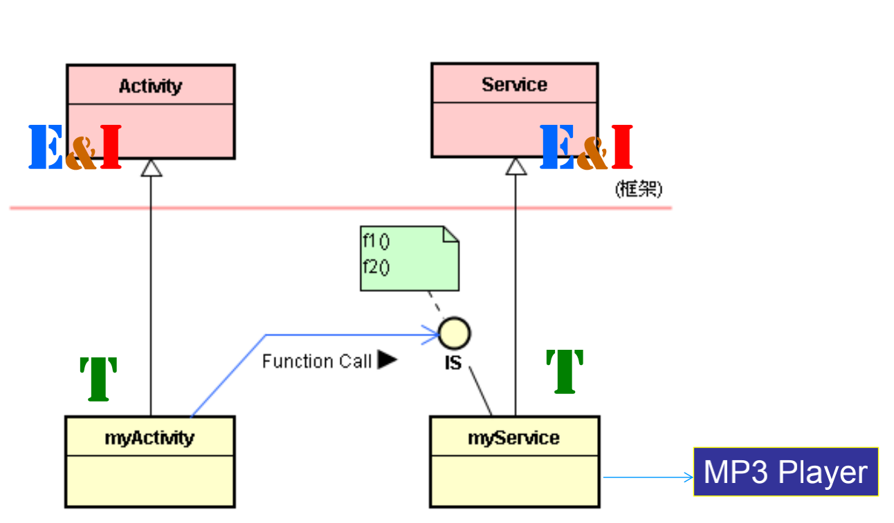

### 1.5.1. 相关问题

* myService 类别的对象，是谁来创建的呢?

  ActivityManagerService。

## 1.6. A 1.6-process

* 针对上一个问题，Android 的常见解决之道是：加上一个EIT造形，如下图。
* 其让 myActivity 先取得 IBinder 接口，才换成 IS 接口
* 请问： 如何才能让 myActivity 取得 IBinder 接口呢? 又如何才能从 IBinder 接口转换出 IS 接口呢?


### 1.6.1. 相关为题

* 上图的做法是：myActivity 透过 IS 接口而调用了 myService 里的 f1() 和 f2() 去播放音乐。

* 此外，还有一种做法：既然 myActivity 先取得了 IBinder 接口，就能调用 IBinder 里的 transact() 函数，转而调用 myBinder 里的 onTransact() 函数，再转而调用 myService 里的 f1() 和 f2() 函数，就能实现播放音乐的目的了。

* 在 Android 里，上述两种做法都是必要的。

* 请问：上述两种做法的主要差异是什么呢? 什么情境下可使用第 1 种做法，而什么情境下则必须使用第 2 种作法呢?

  差异，跨进程必须使用第 2 种做法，同一进程上图的方法就可以。

# 2. 线程基础（2.1.-2.8）

## 2.1. A 2.1.- thread

* 如果某个进程里含有 Activity 组件的话，该主线程就会去关照 UI 事件，此时时，这个主线程就是俗称的 UI 线程。

* 关照 UI 事件 (Event) 是主线程的重要职责，而且是它的专属职责，其它子线程还不可以插手存取 UI 画面上的对象。请问，为什么会有这样的限制呢? 原因是什么呢?

  因为是单线程的开发环境，所以碰到 UI 的显示，都是主线程的事情，小线程不应该进来执行对象相关的行为，因为 UI 组件基类（Button）不是开发者开发的，如果让小进程进来执行，碰到 UI 的显示，系统就会 done 掉，如果不调用 UI 组件基类（Button），只调用本类（myButton）的方法是可以的。

## 2.2. A 2.2 - thread

* 当 Android 发现 UI 线程的 MQ 里有些 UI 事件没来得及 ( 5 秒钟内 ) 处理时，Android 就会显示出 ANR 小窗口。

* 请问：会出现 ANR 告示的主要原因是什么呢? 请举一个情境例子。

  原因：主线程播放 mp3，超过了 5s，就会出现 ANR 窗口。

## 2.3. A 2.3 - thread

* UI 线程可以透过EIT造形 ( 即 Thread 基类)来创建一个小线程；如下图所示。

* 请问：当小线程在执行 < T > 插件 ( 里的 run() 函数 ) 时，想把一个字符串 (String) 放入 TextView 控件里，以便显示于 UI  画面上，如何才能做到呢?

  小线程将字符串变为 message，丢到主线程的 messageQueue 中，然后主线程收到 message，将字符串给 textview 。


## 2.4. A 2.4 - thread

* 小线程与 UI 线程的通信途径是：小线程将 Message 丢到 UI 线程的信箱 ( 就是 Message Queue ) 里。如下图所示。

* 请问：反过来，UI 线程与小线程的通信途径是什么呢?

  t -> msg -> m.t MQ -> m.t

  t <- msg <- m.t MQ <- m.t


### 2.4.1. 相关问题

* 谁来创建小线程的 Message Queue 呢? 

  小线程使用 Looper.prepare() 创建小线程的 Message Queue。

* 如果是由小线程自己创建自己的 Message Queue 吗? 

  是的。

* 如何写这段代码呢?

```java
// ac01.java 
//……
public class ac01 extends Activity implements OnClickListener {
	private Thread t;
	private Handler h;
	private String str;
	public void onCreate(Bundle icicle) {
		//……..
		t = new Thread(new Task());
		t.start(); 
  }
	public void onClick(View v) {
		switch(v.getId()){
			case 101:
				Message m = h.obtainMessage(1, 33, 1, null);
				h.sendMessage(m); 
        break;
			case 102: 
        setTitle(str); 
        break;
		  case 103: 
        h.getLooper().quit(); finish(); 
        break;
      }
    }
	class Task implements Runnable {
		public void run() {
			Looper.prepare();
			h = new Handler(){
				public void handleMessage(Message msg) {
					str = Thread.currentThread().getName() + ", value=" + String.valueOf(msg.arg1);
        }
      };
      Looper.loop();
    }
  }
}
```

## 2.5. A 2.5 - thread

* 在 View 类别里有个多形 (Polymorphic) 的 onDraw() 函数，如下图所示。

* 请问：为什么只限 UI 线程才能执行这个 onDraw() 函数呢? 理由是什么?

  View 是单线程的开发环境，只有主线程才能执行 onDraw() 方法。


## 2.6. A 2.6 - thread

* 下图里的箭头，都是 UI 线程所执行的。就构成常见的游戏控制循环(Game Loop)。 

* UI 线程执行 < T > 插件时，调用基类的 invalidate() 函数，触发重新调用 onDraw() ，来更新画面上的绘图。

* 请问：小线程也可以调用此 invalidate() 函数吗? Why?

  不可以，invalidate() 会调用 onDraw() 方法，onDraw() 是需要在主线程上执行的。小线程可以发送 message 到主线程的 message queue 中，让主线程处理 message。

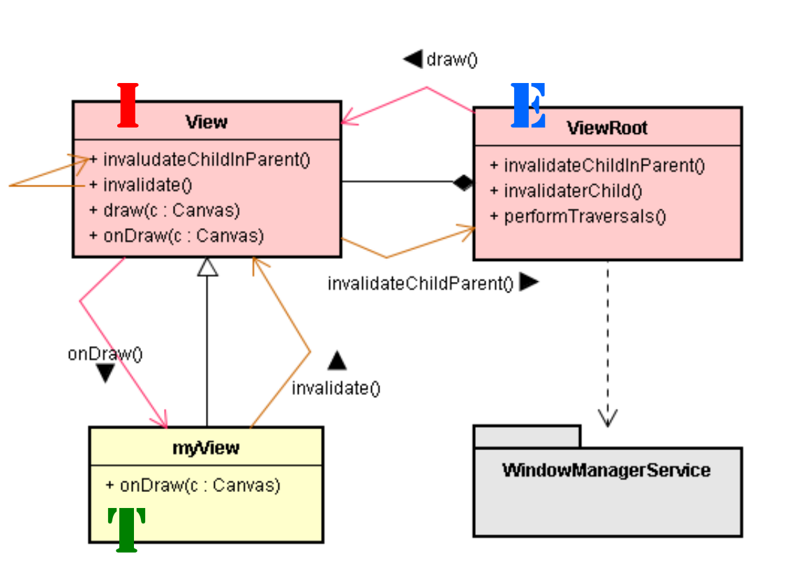

### 2.6.1. 提示

* 其中，invalidate() 函数会处理到 UI。 
* 可是，UI 是单线程环境。

## 2.7. A 1.7-thread

* 在上题里，UI 线程执行 < T > 插件时，直接调用基类的 invalidate() 函数。
* 现在设计一个新类别：GameLoop 类，内含一个 EIT 造形。如下图所示。

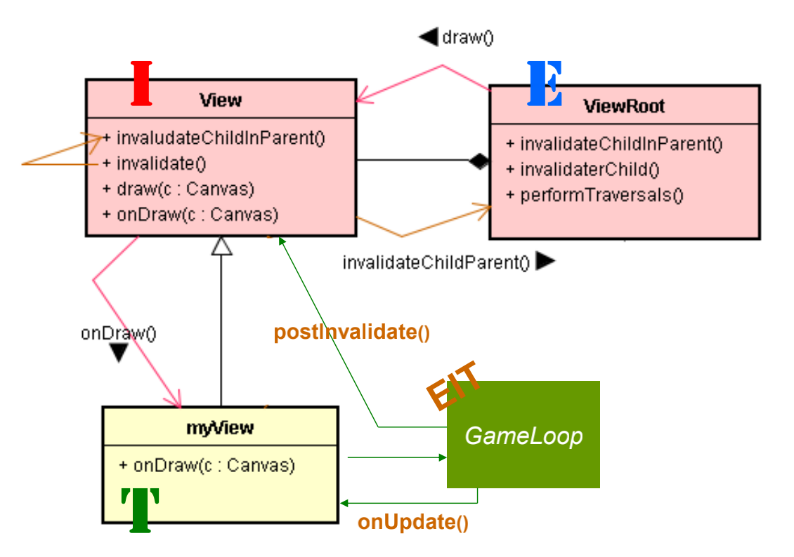

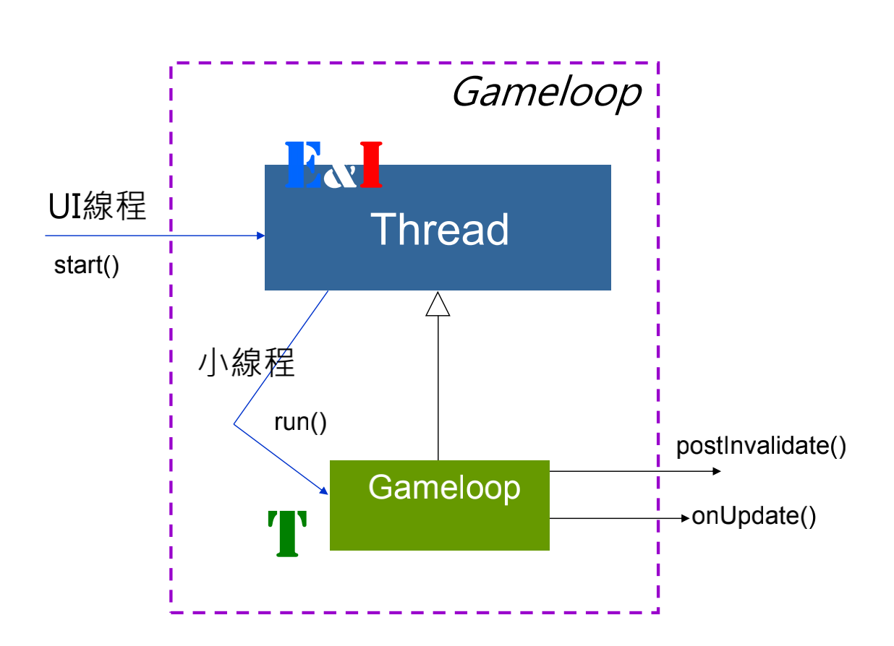

此 Gameloop 类别的代码如下：

```java
public class GameLoop extends Thread {
	myView mView;
	GameLoop( myView v ){
    mView = v; 
  }
	public void run() {
		mView.onUpdate();
		mView.postInvalidateDelayed(1000);
  }
}
```

* 于是，小线程可调用 View 类别里的 postInvalidate() 函数来请求 UI 线程转而调用 View 类别的 inalidate() 函数。如下图所示。

* 请问：小线程执行 postInvalidate() 函数时，如何与 UI 线程通信呢?透过 Message Queue 吗?

  将 message 丢给主线程的 message queue，UI 线程就会收到 message。

  会。

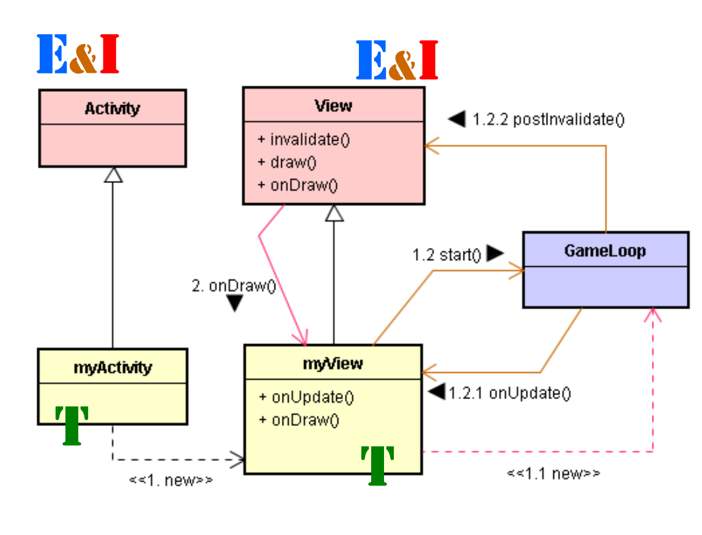

### 2.7.1. 相关问题

* 请问：这项架构是由几个EIT造形组成的呢?

  Activity - myActivity

  View - myView

  Thread-GameLoop

  3 个。

## 2.8. A2.8-thread

* 在 View 类别体系里的 SurfaceView 比较特别，小线程可以透过它来绘制 UI 上的图像。如下图所示。

* 请问：如何创建小线程来绘制 SurfaceView 里的图像呢?

  主线程创建 SurfaceView 和小线程，在 onSurfaceCreate() 方法里小线程会拿到画布，然后在画布上绘制。

  

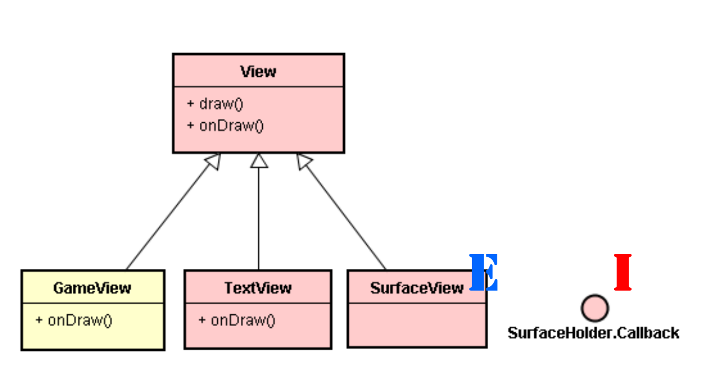

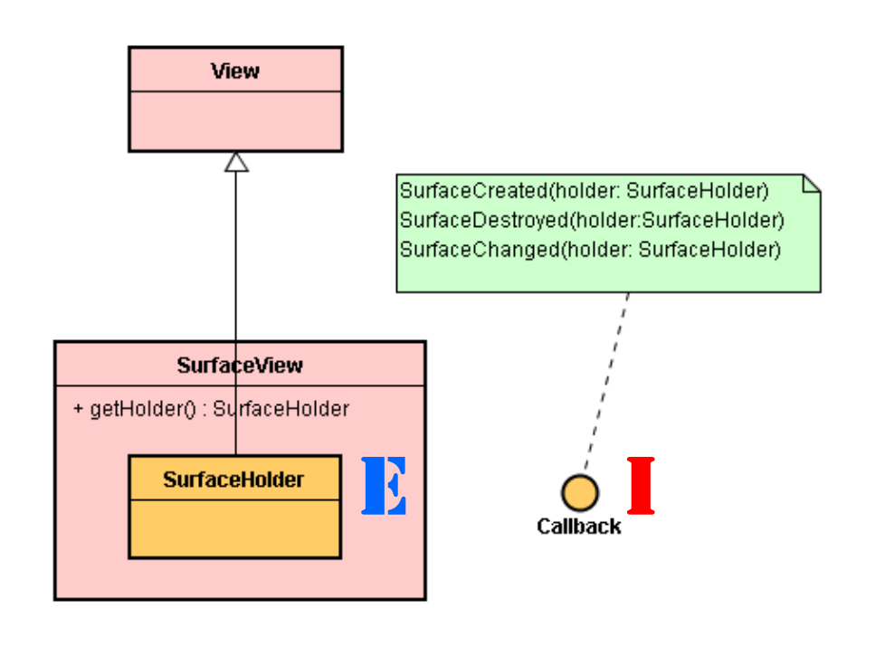

### 2.8.1. 提示

* 基于上图里的 < E > 和 < I > 来撰写其插件 < T >。如下图所示。
* 依循上一题里的 Gameloop 类别写法，撰写一个 SpriteThread (内含一个 EIT 造形) 类别来创建一个小线程。


### 2.8.2. 相关问题

* 在插件 < T > 里，该如何取得 SurfaceView 里的画布(Surface)呢?

  Canvas cavans = mHolder.lockCanvas();

```java
public void surfaceCreated(SurfaceHolder holder) {
	mHolder = holder; 
	Canvas cavans = mHolder.lockCanvas();
	// ………
}
```

# 3. JNI 基础（3.1-3.8）

## 3.1. A 3.1-JNI

* Java 代码在 VM 上执行。

* 在执行 Java 代码的过程中，如果 Java 需要与本地代码 ( 如以 C 写成的 \*so 动态库)沟通时，VM 就会把 \*.so視为插件 \<T\>而加载到 VM 里，然后让 Java 函数顺利地呼叫到这插件 \<T\>里的 C 函数。

* 请问：VM 在那一个时间点，会去加载所需要的插件 \<T\> 呢?

  使用类的时候，比如 `MediaPlayer palmer = new MediaPlayer()`，就会将 MediaPlayer 类加载进来，而类中有  `System.loadLibrary("media_jni");` 会将 media_jni.so 文件作为插件加载进来。

### 3.1.1. 提示

* 请参考下述的代码范例：

```java
// 例如，MediaPlayer.java 类：
public class MediaPlayer{
	static {
		System.loadLibrary("media_jni");
	}
	……..
}
```

### 3.1.2. 相关问题

* 此时，VM 扮演着 \<E&I\> 的角色；Java 扮演 Client 角色；而 C 函数则扮演 \<T\> 角色。载入插件 (*.so) 之后，如下图所示。

* 请问：载入后，VM 会先调用 \<T\> 里的那一个函数呢? 其目的是什么?

  会先调用 JNI_OnLoad() 函数，目的 1. 确定 JNI 的版本，2.生成类方法的映射表。


* VM 载入 JNI 模块时，调用 JNI_OnLoad() 函数。

| 別名      | 參數 | 本名                                                     |
| --------- | ---- | -------------------------------------------------------- |
| init()    | ()V  | Java_com_misoo_counter<br />_CounterNative_nativeSetup() |
| execute() | (I)V | Java_com_misoo_counter<br />_CounterNative_nativeExec()  |

## 3.2. A3.2-JNI

* addActivity 是一个完整的 Java 类，其 add() 函数里有完整的实作 (Implement) 代码。如果从这 Java 类里移除掉 add() 函数里的实作代码，而以 C 语言来实作之。如下图所示。

* 请问：为什么 Java 与 C 函数不能直接互相调用呢?

  Java 是在 VM 中运行的，C 函数是在 CPU 中运行的，不能跨系统直接调用。

  是将 C 文件 *.so 作为插件，由 VM 来调用到 C 方法。


### 3.2.1. 提示

* 这 add() 函数所构成的  \*.so 成为 VM (即 \<E&I\>的插件 \<T\>；如下图所示。

* Java 函数透过 \<E&I\>来调用 \<T\>，并不直接调用 \<T\> (即 \*.so) 里的本地 add() 函数。

* 请你说说其幕后的理由吧。

  就是因为 Java 是在 VM 中运行，C 在 CPU 中运行，不能跨平台直接调用。

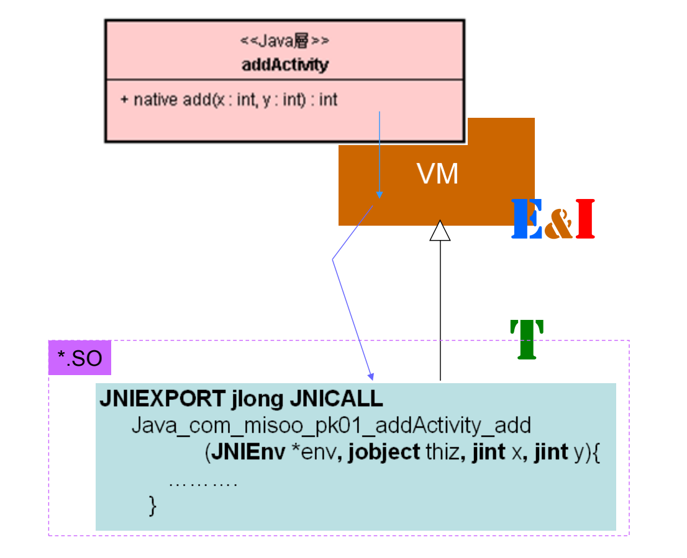

### 3.2.2. 相关问题

* 在执行 Java 程序的过程中，什么时间点才会要求 VM 去调用本地的 add() 函数呢?

  运行到 onCreate() 的 `this.add(2.4) ` 的时候。

```java
class addActivity extends Activity {
	void onCreate( ... ){
		// ......
		this.add( 2, 4 );
	}
	int native add(int x, int y);
}
```

* 如果在 Java 里将 add() 函数定义为 static 函数，则上述的答案会有何不同呢?

  static 函数运行到 C 方法，第二个参数就是 JClass，而为静态是 JObject 代表的是 currentObject。

```java
class addActivity extends Activity {
	// ......
	int static native add(int x, int y);
}
```

```java
class myActivity extends Activity {
	// ......
	addActivity.add(200, 300);
	// ......
}
```

## 3.3. A3.3-JNI

* 接续上一个题目，本地函数 add() 的第 1 个参数是：JNIEnv *env；如下页的代码所示。

* 请问，这个 JNIEnv 类的内涵是什么? 这个 env 指针 (Pointer) 有什么用途呢?

  JNIEnv 是 VM 为一个线程创建的一个独有对象，env 指针保障了线程的独有空间，避免了线程同步问题。

* 本地的 add() 函数的参数型态为：

```c
// com_misoo_pk01_addActivity.cpp
// ………
JNIEXPORT jlong JNICALL
Java_com_misoo_pk01_addActivity_add(JNIEnv *env, jobject thiz, jint x, jint y){
	// ………. 
}
// ………
```

### 3.3.1. 提示

* 在 Android 环境里，每一个线程 (Thread) 第一次进入 VM (即 \<E&I\> ) 去调用本地函数时，VM 会替它诞生一个相对映的 JNIEnv 对象。如下图所示。
* 所以一个线程每次调用本地函数时，都会将其对映的 JNIEnv 对象指针值传递给本地函数。


## 3.4. A3.4-JNI

* 接续上一个题目，基于 JNI 的 EIT 造形，让线程在执行插件\<T\> (就是 \*.so ) 时，都能随时透过 JNIEnv 对象来与 \<E&I\> (就是 VM ) 来通信；如下图所示。

* 请问，在线程执行 f1() 、f2() 时，透过 JNIEnv 对象来与 VM 来通信，有何目的呢?

  线程安全。

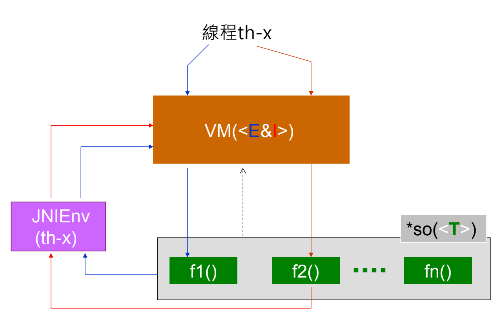

### 3.4.1. 相关问题

* 请问：为什么 \<T\> 不直接与 VM 通信，而要透过 JNIEnv 对象呢? 

  JNIEnv 会记载 thread 执行 T 的交互信息，VM 就可以知道 T 执行的状态。

* 请问：JNIEnv 对象用来储存什么信息或数据呢?

  储存 thread 与 VM 之间的互动关系数据，会储存 thread 专属的数据。

## 3.5. A3.5-JNI

* 接续上一个题目，不同的线程，会使用不同的 JNIEnv 对向来与 VM 通信；如下述两个图所示。

* 请问，这样能有效化解多线程的冲突问题吗?

  能。


### 3.5.1. 提示

* 回想，当我们在写 Web 程序时，都会用到 Session 对象。
* 这个 Session 对象与 JNIEnv 对象的角色是一致的；两者有异曲同工之妙。 
* 每次浏览器建立完成一个 Connection (如同一条线程)，都会获得一个专用的 Session 对象。

## 3.6. A3.6-JNI

* 接续上一个题目。有一个线程(th-x)先进入 EIT 造形去执行 f1()，如下图的 Step-1 所示。

* f1() 做了 1+2+3+ … + 10 的计算，并计算出结果(即 sum 值) 。然后，th-x 就离开 f1() 返回到 Java 层了。

* 随后，线程 (th-x) 再度进入 EIT 造形去执行 f2() 函数，想取得先前 f1() 所计算出来的 sum 值。如下图的 Step-2 所示。

* 请问：f1() 函数应该将 sum 值储存在哪里，才能让 f2() 顺利拿到 sum 值呢?

   f1() 和 f2() 是同一个线程调用，存取的同一个 JNIEnv 对象，储存在 JNIEnv 上就可以，但要看平台是否支持。

  也可以存储在 C 的公用变量里，但是要注意其他线程的同步问题。

  可以将 sum 值存放在 java 端，调用 f2() 的时候传递过来即可。

  


### 3.6.1. 提示

* 由于，同一条线程去执行 f1() 和 f2()，此时 f1() 和 f2() 都能存取同一个 JNIEnv 对象。
* 能不能透过 *.so 的公用变量(Global Variable)呢?

## 3.7. A3.7-JNI

* 接续上一个题目。刚才是同一个线程 (th-x) 去执行 f1() 和 f2() 函数。

* 如果分别由不同的线程去分别执行 f1() 和 f2() 函数的话，f2()想取得先前 f1() 所计算出来的 sum 值。如下图所示。

  放在公用变量里。

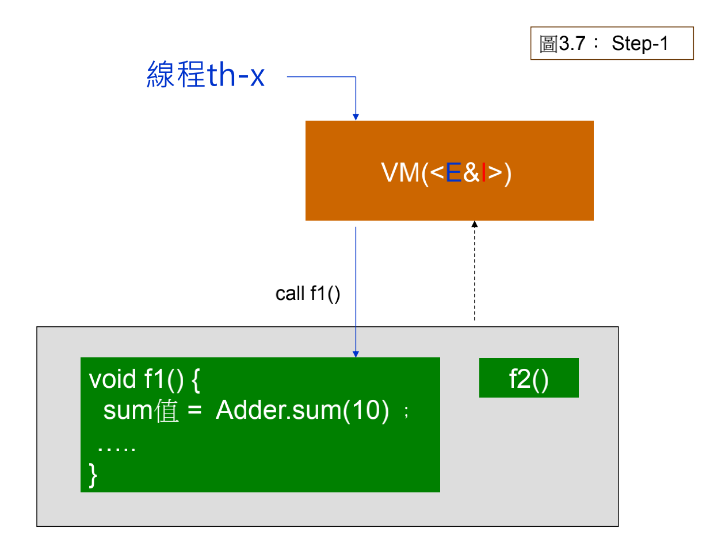

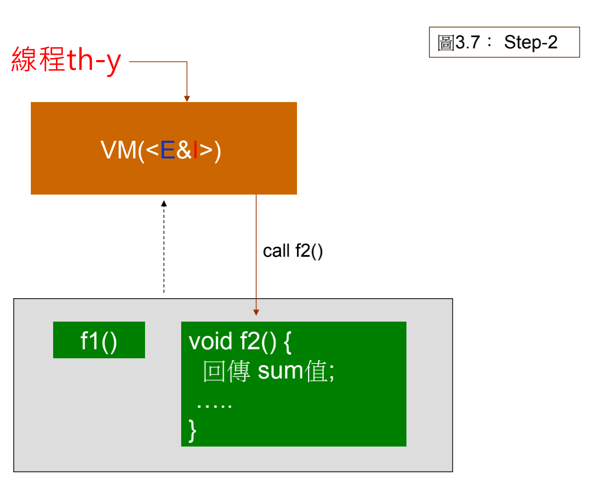

### 3.7.1. 提示

* 由于，由不同的线程去执行 f1() 和 f2()，此时 f1() 和 f2() 使用不同的 JNIEnv 对象。

* 能不能透过 *.so 的公用变量 (Global Variable) 呢?

  能。但是要解决线程冲突的问题。

## 3.8. A3.8-JNI

* 当 UI 线程经由 VM 而去执行 \<T\> 时，如下图所示。

* 请问：在执行 \<T\> 时，UI 线程如何去创建一个小线程呢?

  使用 pthread_create。

* 如何撰写其代码(创建一个小线程)呢? 

  pthread_create( &thread, NULL, trRun, NULL);


### 3.8.1. 相关问题

* 在 \<T\>里所创建的小线程，VM 有给它专属的 JNIEnv 对象吗? 

  不会，需要自己建立。

* 如果没有的话；请问：如何去向 VM 索取一个 JNIEnv 对象呢? 

  jvm->AttachCurrentThread(&env, NULL)

* 索取 JNIEnv 对象，有何目的呢?

  透过 JNIEnv 与 VM 沟通，调用 Java 的方法。

```c++
/* com.misoo.counter.CounterNative.cpp */
#include <stdio.h>
#include <pthread.h>
#include "com_misoo_counter_CounterNative.h"
jmethodID mid;
jclass mClass;
JavaVM *jvm;
pthread_t thread;
int n, sum;
void* trRun( void* );

void JNICALL Java_com_misoo_counter_CounterNative_nativeSetup(JNIEnv *env, jobject thiz) {
	jclass clazz = env->GetObjectClass(thiz);
	mClass = (jclass)env->NewGlobalRef(clazz);
	mid = env->GetStaticMethodID(mClass, "callback", "(I)V");
}

void JNICALL Java_com_misoo_counter_CounterNative_nativeExec(JNIEnv *env, jobject thiz, jint numb){
	n = numb;
	pthread_create( &thread, NULL, trRun, NULL);
}

void* trRun( void* ){
	int status;
	JNIEnv *env; bool isAttached = false;
	status = jvm->GetEnv((void **) &env, JNI_VERSION_1_4);
	if(status < 0) {
		status = jvm->AttachCurrentThread(&env, NULL);
		if(status < 0) return NULL;
		isAttached = true;
	}
	sum = 0;
	for(int i = 0; i<=n; i++) sum += i;
	env->CallStaticVoidMethod(mClass, mid, sum);
	if(isAttached) jvm->DetachCurrentThread();
	return NULL;
}
```

# 4. IPC 基础（4.1-4.8）

## 4.1. A4.1-IPC

* Android 在 Java 层和 C/C++ 层都定义了 IBinder 接口。如下图所示。

* 请问：这个 IBinder 接口的主要用途是什么?

  跨进程通信需要使用 IBinder 接口。

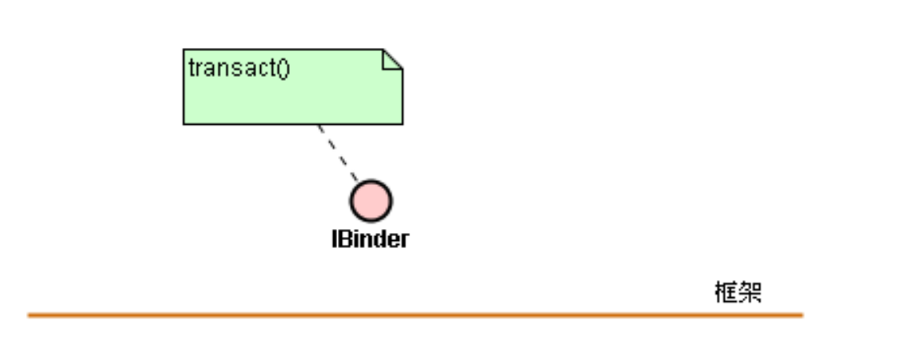

其代码定义是：

```java
// IBinder.java
public interface IBinder {
// ..........
public boolean transact( int code, Parcel data, 
Parcel reply, int flags) throws RemoteException;
	// ...........
}
```

### 4.1.1. 相关问题

* Android 不允许 A 进程的函数直接调用另一个 B 进程里的函数；为什么呢?

  为了安全，防止不法分子访问自己的内容。

## 4.2. A4.2-IPC

* Android 在 Java 层定义了 Binder 基类来实现 IBinder 接口。如下图所示。

* 从图里可以看到，Binder 基类定义了 4 项接口。

* 请问：这 4 项接口各有什么用途呢?

  Transact() 提供给 client 调用的，给 java 调用的。

  execTransact() 提供给 c 模块调用的。

  onTransact()：抽象函数，EIT 的 I，给子类去实现。

  init()：调用到 c 函数。

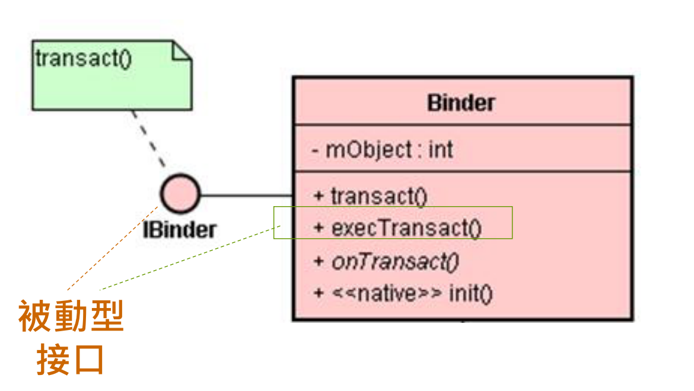

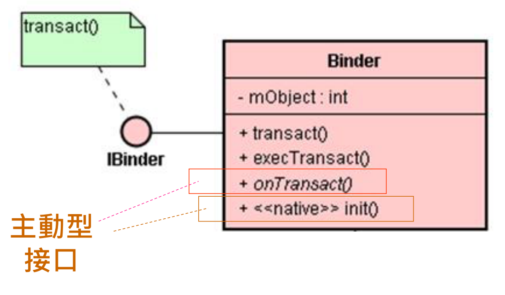

## 4.3. A4.3-IPC

* 本地的 JNI 接口，用来衔接(透过 VM )到本地的 Binder_jni 插件，如下图所示。

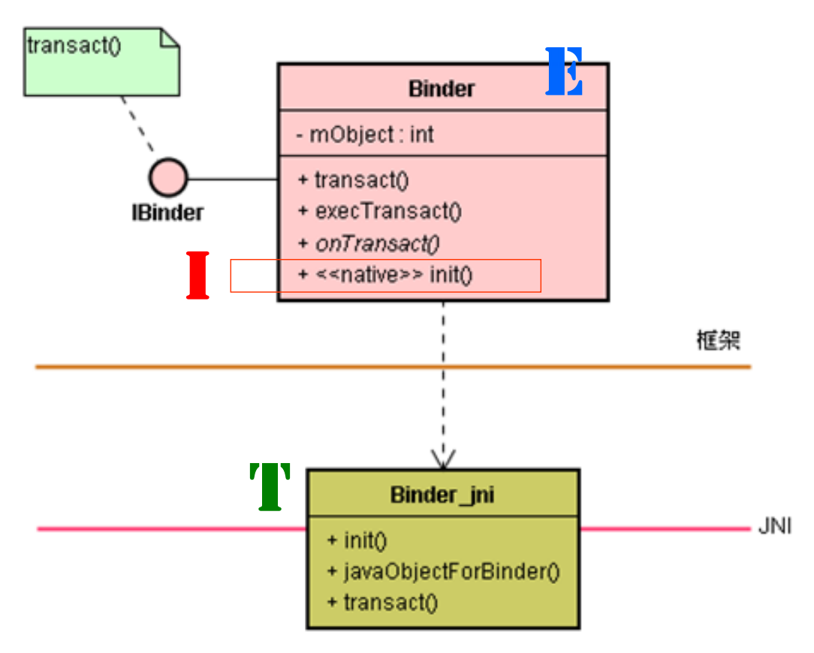

* 另一个是大家比较熟悉的接口：onTransact() 抽象函数。

* 它用来衔接到子类插件(如 myBinder)，如下图所示。

* 如此，Binder 基类和 IBinder 接口，将 C/C++ 层与 Java 层的 Service 衔接起来了。

* 请问：将 C/C++ 层与 Java 层的 Service 衔接的目的是什么呢?

  为了让跨进程可以找到对应的 service。

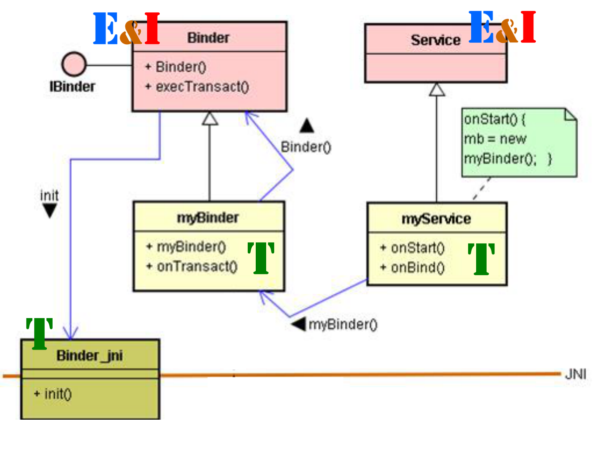

### 4.3.1. 相关问题

* 这个 Binder 基类定义了一个 IBinder 接口，谁去调用它呢? 在何种情况下，才会去调用它的 transact() 函数呢?

  如果是同一个线程，Java 层会调用 IBinder 接口，会调用 transact() 函数。

```xml
// AndroidManifest.xml
<?xml version="1.0" encoding="utf-8"?>
	………………
	<activity android:name=".FirstActivity" 
	………………
	<activity android:name=".LoadActivity">
	………………
	<service android:name=".LoadService" 
		android:process=":remote">
	………………
</manifest>
```

## 4.4. A4.4-IPC

* 下图里，整个架构是由 3 个 EIT 造形所组成 的 。 请问 ， 那一条线程去执行 Binder() 构造式呢?

  主线程。

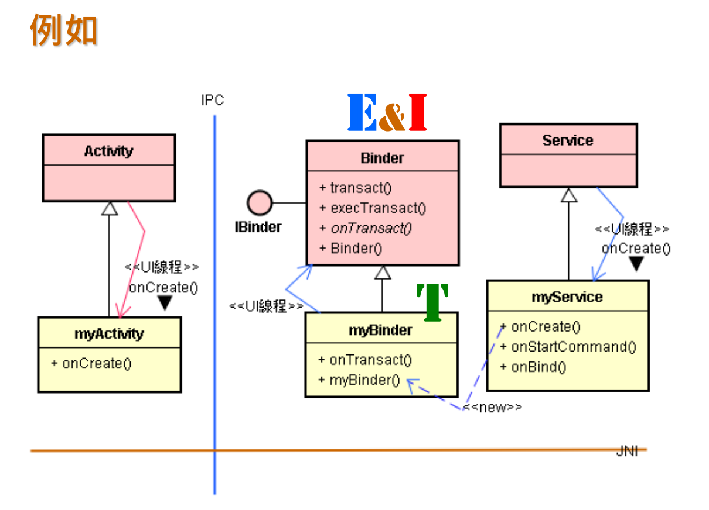

## 4.5. A4.5-IPC

* 下图里，整个架构是由 4 个 EIT 造形所组成的。请问，那一条线程去执行 JavaBBinder 的 onTransact() 函数呢? 

  Thread Poll 里的 BinderThread 执行。

* 那一条线程去执行 myBinder 的 onTransact() 函数呢?

  BinderThread 执行。


### 4.5.1. 提示

* 执行 Activity 的线程，进入 BD(Binder Driver) 之后，会从 BD 的线程池 (Thread Pool) 里取得一条线程 ( 又称 Binder Thread) 来执行右边进程的动作。如下图所示。


### 4.5.2. 相关问题

* 当左边的线程 -A 到 BD 去启动一个 Binder 线程去执行右边进程的事情。

* 请问：此刻线程 -A 会作什么事情呢? 立即返回到 Java 层? 等待 Binder 线程执行(又边进程的事情)完毕才返回呢?

  会等待 Binder 线程执行(又边进程的事情)完毕才返回。会 waiting 等待 binder 线程执行完毕。

## 4.6. A4.6-IPC

* 有个 myActivity 想调用另一个进程里的 MediaPlayer 类别去拨放 mp3 音乐；如下图所示。

* 请问：有那几种可能的实现途径呢?

  常见的途径是，透过 Service 机制来启动 MediaPlayer 引擎。

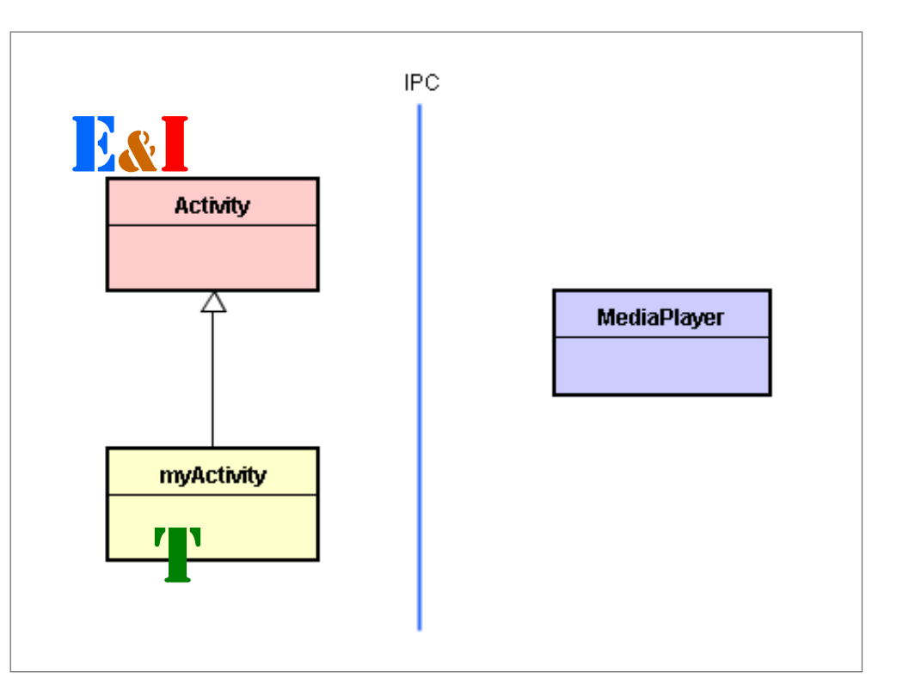

### 4.6.1. 提示

* 常见的途径是，透过 Service 机制来启动 MediaPlayer 引擎。如下图：


### 4.6.2. 相关问题

* 上图使用虚线箭头，表示并非直接实际调用这个 IBinder 接口。

* 请问：此虚线箭头所代表的实际调用路径是什么(复习)?

  而是通过 Linux 的 Thread Pool 创建一个 Binder Thread 线程，接到 Binder。

## 4.7. A4.7-IPC

* 下图里，BD 先调用 C/C++ 层的 IBinder 接口，然后才间接调用到 Java 层的 execTransact() 函数。

* 请问：为什么 BD 不直接调用 Java 层的 IBinder 接口呢?

  进程不同，直接调用是给同进程使用的。

  execTransact() 函数是给 c/c++ 调用的。


### 4.7.1. 相关问题

* 从图里，你可以发现到，此架构总共有多少个 EIT 造形所组成呢?

  4 个。

  Activity-myActivity

  BBinder-JavaBBinder

  Binder-myBINDER

  Service-myService

## 4.8. A4.8-IPC

* 在调用 IBinder 接口里的 transact() 函数时，需要将 int、float 等一般型态的数据值，打包于 Parcel 对象里，然后才将 Parcel 对象传递过去。其参数如下代码所示。

* 请问：为什么不能直接传递一般型态的数据值呢?

  为了 IPC 传递更多的数据。

* 其代码定义是

  ```java
  // IBinder.java
  public interface IBinder {
  	// ..........
  	public boolean transact( int code, Parcel data, Parcel reply, int flags) throws RemoteException;
  	// ...........
  }
  ```

### 4.8.1. 相关问题

* 请问：上一页的代码里，还有 code 参数。你知道它的用途是什么吗?

  编解码。

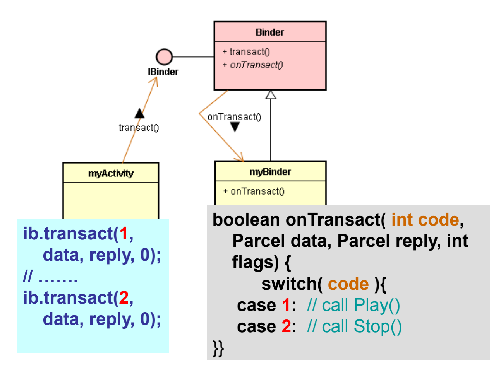


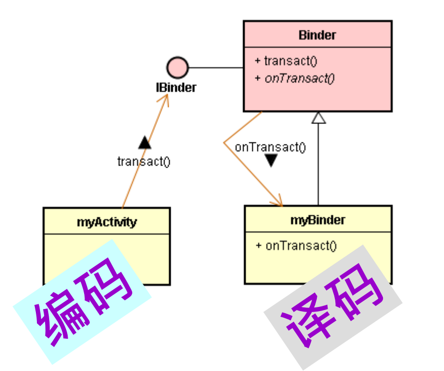


